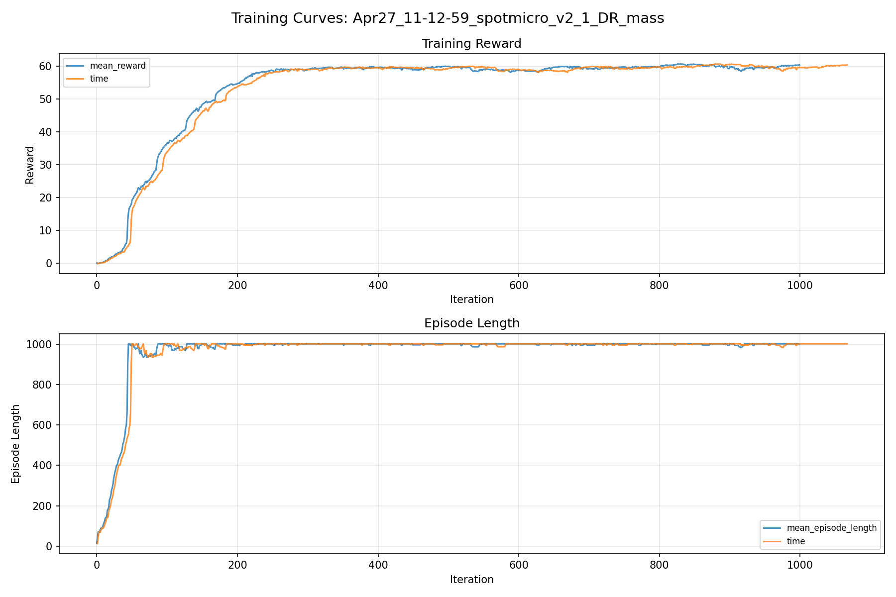
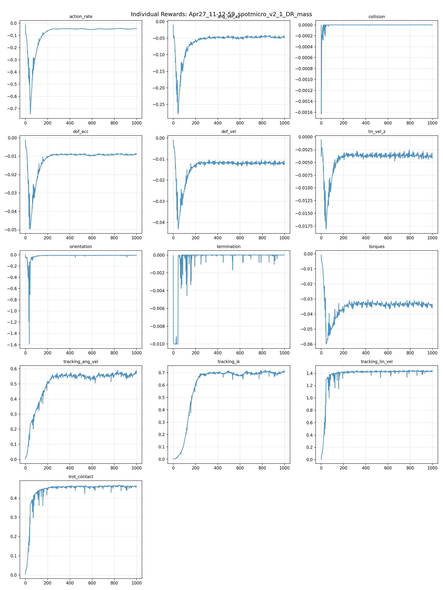
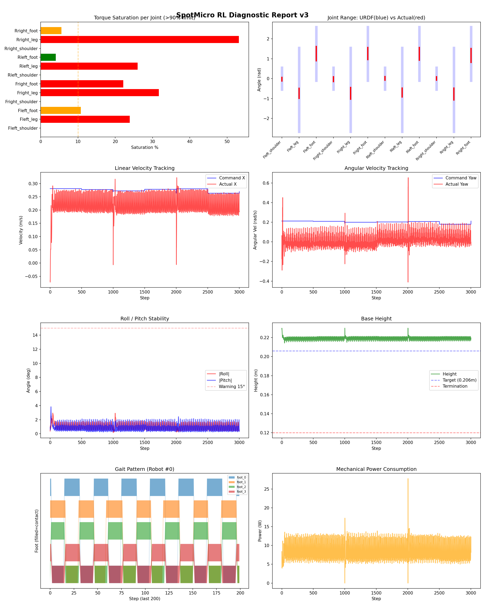
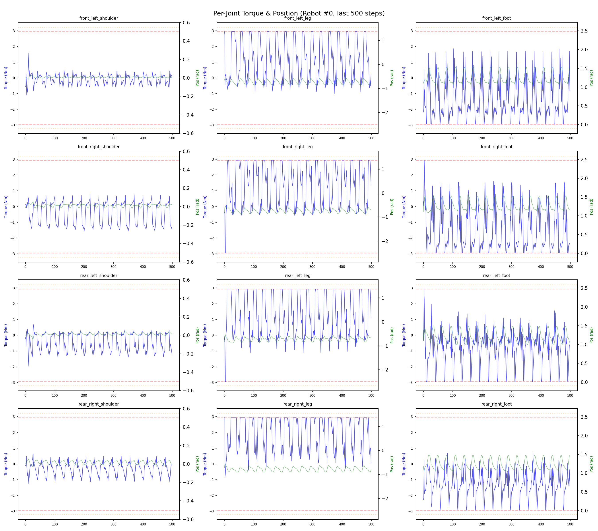
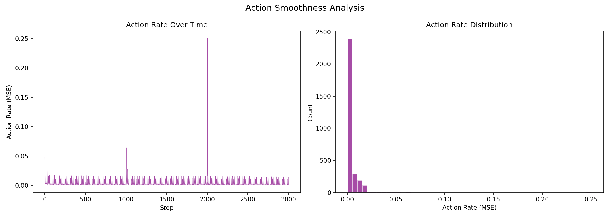

# 실험 008: spotmicro_v2_1_DR_mass

- **날짜:** 2026-04-27 11:32
- **Task:** spotmicro_test
- **Run name:** `spotmicro_v2_1_DR_mass`
- **판정:** ✅ PASS

---

## 실험 목적

V2.1: 질량 랜덤화 적용하여 오차와 안정성을 유지하는지 확인

---

## 변경점 (이전 커밋 대비)

```diff
diff --git a/ai_training/rl/legged_gym/legged_gym/envs/spotmicro_test/spotmicro_test_config.py b/ai_training/rl/legged_gym/legged_gym/envs/spotmicro_test/spotmicro_test_config.py
index 27e468a..6161929 100644
--- a/ai_training/rl/legged_gym/legged_gym/envs/spotmicro_test/spotmicro_test_config.py
+++ b/ai_training/rl/legged_gym/legged_gym/envs/spotmicro_test/spotmicro_test_config.py
@@ -106,8 +106,8 @@ class SpotmicroTestCfg(LeggedRobotCfg):
     class domain_rand(LeggedRobotCfg.domain_rand):
         randomize_friction = True
         friction_range = [0.4, 1.2]
-        randomize_base_mass = False
-        added_mass_range = [-0.5, 0.5]
+        randomize_base_mass = True
+        added_mass_range = [-0.2, 0.2]
         push_robots = False
         push_interval_s = 15
         max_push_vel_xy = 0.5
@@ -119,7 +119,7 @@ class SpotmicroTestCfgPPO(LeggedRobotCfgPPO):
         entropy_coef = 0.01
 
     class runner(LeggedRobotCfgPPO.runner):
-        run_name = 'spotmicro_v2_0_DR_friction'
+        run_name = 'spotmicro_v2_1_DR_mass'
         experiment_name = 'spotmicro_test'
         max_iterations = 1000
         save_interval = 100
```

**변경 요약:**
  - randomize_base_mass = False
  - added_mass_range = [-0.5, 0.5]
  + randomize_base_mass = True
  + added_mass_range = [-0.2, 0.2]
  - run_name = 'spotmicro_v2_0_DR_friction'
  + run_name = 'spotmicro_v2_1_DR_mass'

---

## 현재 Reward Scales

| Reward | Scale |
|--------|-------|
| action_rate | -0.05 |
| ang_vel_xy | -0.2 |
| collision | -1.0 |
| dof_acc | -2.5e-07 |
| dof_vel | -0.001 |
| lin_vel_z | -2.0 |
| orientation | -4.0 |
| termination | -10.0 |
| torques | -0.001 |
| tracking_ang_vel | 0.9 |
| tracking_ik | 1.0 |
| tracking_lin_vel | 1.5 |
| trot_contact | 0.5 |

---

## 진단 결과 (Diagnostic)

### 핵심 지표

- ✅ Timeout: 100.0% (≥80%)
- ✅ 속도오차 X: 0.0635 m/s (<0.08)
- ⚠️ 토크포화: 14.8% (10~40%)
- ✅ 자세: roll 1.0°, pitch 0.9° (안정)
- ✅ 조기종료: 0.0% (<5%)

### 상세 수치

| 지표 | 값 |
|------|-----|
| Timeout% | 100.0 |
| 조기종료% | 0.0 |
| 속도오차 X | 0.06345146894454956 m/s |
| 속도오차 Y | 0.02042091079056263 m/s |
| 각속도오차 | 0.09288971871137619 rad/s |
| 토크포화% | 14.782092907092906 |
| 평균 높이 | 0.21923104205946903 m |
| Roll (평균) | 1.033491849899292° |
| Pitch (평균) | 0.8582805395126343° |
| Action Rate | 0.0036902381107211113 |
| 평균 전력 | 8.216561317443848 W |
| CoT | 1.4990749312007272 |


## 학습 곡선 분석

| 지표 | 값 | 판정 |
|------|-----|------|
| 수렴 iter (90%) | 200 | 빠름 |
| 후반 안정성 (CV) | 0.010 | 안정 |
| 정체 구간 | 있음 (iter 217, 49 iter) | |


## Per-leg 분석

### 발별 접촉/공중 비율

| 발 | 접촉% | 공중% |
|-----|-------|------|
| foot_0 | 56.0% | 44.0% |
| foot_1 | 58.1% | 41.9% |
| foot_2 | 51.5% | 48.5% |
| foot_3 | 51.0% | 49.0% |

### 관절별 토크 포화

| 관절 | 포화% | 최대토크 | 한계 | 상태 |
|------|------|---------|------|------|
| front_left_shoulder | 0.0% | 1.560 | 2.940 | ✅ |
| front_left_leg | 23.9% | 2.940 | 2.940 | ❌ |
| front_left_foot | 10.8% | 2.940 | 2.940 | ⚠️ |
| front_right_shoulder | 0.0% | 2.940 | 2.940 | ✅ |
| front_right_leg | 31.7% | 2.940 | 2.940 | ❌ |
| front_right_foot | 22.2% | 2.940 | 2.940 | ❌ |
| rear_left_shoulder | 0.0% | 2.940 | 2.940 | ✅ |
| rear_left_leg | 26.0% | 2.940 | 2.940 | ❌ |
| rear_left_foot | 4.1% | 2.940 | 2.940 | ✅ |
| rear_right_shoulder | 0.0% | 2.336 | 2.940 | ✅ |
| rear_right_leg | 53.1% | 2.940 | 2.940 | ❌ |
| rear_right_foot | 5.6% | 2.940 | 2.940 | ⚠️ |


## Gait 분석

| 지표 | 값 |
|------|-----|
| Gait 주파수 | 0.42 Hz |
| Gait 주기 | 30 steps |
| 대각 동기화율 | 94.6% |
| L/R 비대칭 | 0.0%p |
| 판정 | ✅ Trot 패턴 / ✅ 대칭 |


## 관절별 상세

| 관절 | 토크포화% | 사용범위% | 편향(rad) | 한계근접% | 상태 |
|------|----------|----------|----------|----------|------|
| front_left_shoulder | 0.0% | 17% | -0.025 | 0.0% | ✅ |
| front_left_leg | 23.9% | 12% | -0.739 | 0.0% | ⚠️ |
| front_left_foot | 10.8% | 27% | +1.261 | 0.0% | ⚠️ |
| front_right_shoulder | 0.0% | 23% | -0.024 | 0.0% | ✅ |
| front_right_leg | 31.7% | 14% | -0.739 | 0.0% | ⚠️ |
| front_right_foot | 22.2% | 23% | +1.264 | 0.0% | ⚠️ |
| rear_left_shoulder | 0.0% | 17% | +0.016 | 0.0% | ✅ |
| rear_left_leg | 26.0% | 11% | -0.697 | 0.0% | ⚠️ |
| rear_left_foot | 4.1% | 23% | +1.248 | 0.0% | ⚠️ |
| rear_right_shoulder | 0.0% | 16% | +0.005 | 0.0% | ✅ |
| rear_right_leg | 53.1% | 14% | -0.775 | 0.0% | ⚠️ |
| rear_right_foot | 5.6% | 26% | +1.167 | 0.0% | ⚠️ |


## 에너지 효율 상세

| 지표 | 값 |
|------|-----|
| 평균 전력 | 8.22 W |
| 피크 전력 | 27.75 W |
| 피크/평균 비율 | 3.4x |
| CoT | 1.50 |

### 관절별 전력 분배

| 관절 | 평균전력(W) | 비율% |
|------|-----------|-------|
| front_right_foot | 1.852 | 22.5% |
| front_left_foot | 1.462 | 17.8% |
| rear_right_leg | 1.102 | 13.4% |
| rear_left_leg | 0.847 | 10.3% |
| rear_right_foot | 0.778 | 9.5% |
| front_left_leg | 0.724 | 8.8% |
| front_right_leg | 0.639 | 7.8% |
| rear_left_foot | 0.538 | 6.5% |
| rear_left_shoulder | 0.093 | 1.1% |
| front_right_shoulder | 0.082 | 1.0% |
| rear_right_shoulder | 0.066 | 0.8% |
| front_left_shoulder | 0.033 | 0.4% |


## 이전 실험 대비 비교

| 지표 | 이전 (exp007) | 현재 (exp008) | 변화 |
|------|-------|-------|------|
| Timeout% | 100.0% | 100.0% | → 유지 |
| 속도오차 X | 0.0686 | 0.0635 | ✅ ↓ 0.0052m/s |
| 토크포화 | 12.8% | 14.8% | ⚠️ ↑ 2.0011% |
| Roll | 1.0° | 1.0° | ⚠️ ↑ 0.0537° |
| Pitch | 0.9° | 0.9° | ⚠️ ↑ 0.0049° |
| 평균 전력 | 7.8815W | 8.2166W | ⚠️ ↑ 0.3351W |


## Tensorboard 학습 곡선 요약

| 스칼라 | 최종값 | 최대 | 최소 | 후반10% 평균 |
|--------|--------|------|------|-------------|
| rew_action_rate | -0.0444 | -0.0143 | -0.7436 | -0.0472 |
| rew_ang_vel_xy | -0.0489 | -0.0101 | -0.2785 | -0.0475 |
| rew_collision | 0.0000 | 0.0000 | -0.0016 | -0.0000 |
| rew_dof_acc | -0.0090 | -0.0011 | -0.0496 | -0.0091 |
| rew_dof_vel | -0.0125 | -0.0009 | -0.0431 | -0.0119 |
| rew_lin_vel_z | -0.0042 | -0.0006 | -0.0181 | -0.0038 |
| rew_orientation | -0.0079 | -0.0026 | -1.5886 | -0.0095 |
| rew_termination | 0.0000 | 0.0000 | -0.0100 | -0.0000 |
| rew_torques | -0.0352 | -0.0007 | -0.0600 | -0.0339 |
| rew_tracking_ang_vel | 0.5789 | 0.5917 | 0.0024 | 0.5596 |
| rew_tracking_ik | 0.7074 | 0.7219 | 0.0012 | 0.6983 |
| rew_tracking_lin_vel | 1.4278 | 1.4512 | 0.0094 | 1.4303 |
| rew_trot_contact | 0.4603 | 0.4677 | 0.0044 | 0.4595 |
| learning_rate | 0.0000 | 0.0076 | 0.0000 | 0.0003 |
| surrogate | 0.0004 | 0.0026 | -0.0110 | -0.0018 |
| value_function | 0.1010 | 0.3463 | 0.0005 | 0.0345 |
| collection time | 0.7528 | 0.9264 | 0.7129 | 0.8047 |
| learning_time | 0.2914 | 0.3436 | 0.2759 | 0.2928 |
| total_fps | 94141.0000 | 97899.0000 | 80031.0000 | 89693.9100 |
| mean_noise_std | 0.1887 | 0.9991 | 0.1600 | 0.1846 |
| mean_episode_length | 1002.0000 | 1002.0000 | 13.0787 | 1000.2205 |
| time | 1002.0000 | 1002.0000 | 13.0787 | 1000.2205 |
| mean_reward | 60.3773 | 60.6593 | -0.1630 | 59.6399 |
| time | 60.3773 | 60.6593 | -0.1630 | 59.6399 |

총 학습 iteration: 999


---

## 그래프

### Tensorboard 학습 곡선



### Diagnostic 결과





---

## 결론 및 다음 실험 방향

**자동 판정:** ✅ PASS

대부분 기준을 통과했으나 일부 항목이 보통 수준입니다.
  - ⚠️ 토크포화: 14.8% (10~40%)

> 💡 위 결론은 자동 생성되었습니다. 필요시 수정하세요.

---

## 메모

오차 범위 허용범위 내라고 판단됨. 다른 랜덤화 적용하고 나중에 필요하다 생각되면 무게 범위 늘릴수

