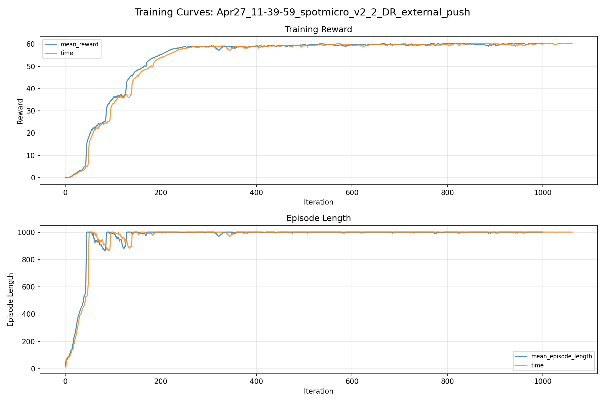
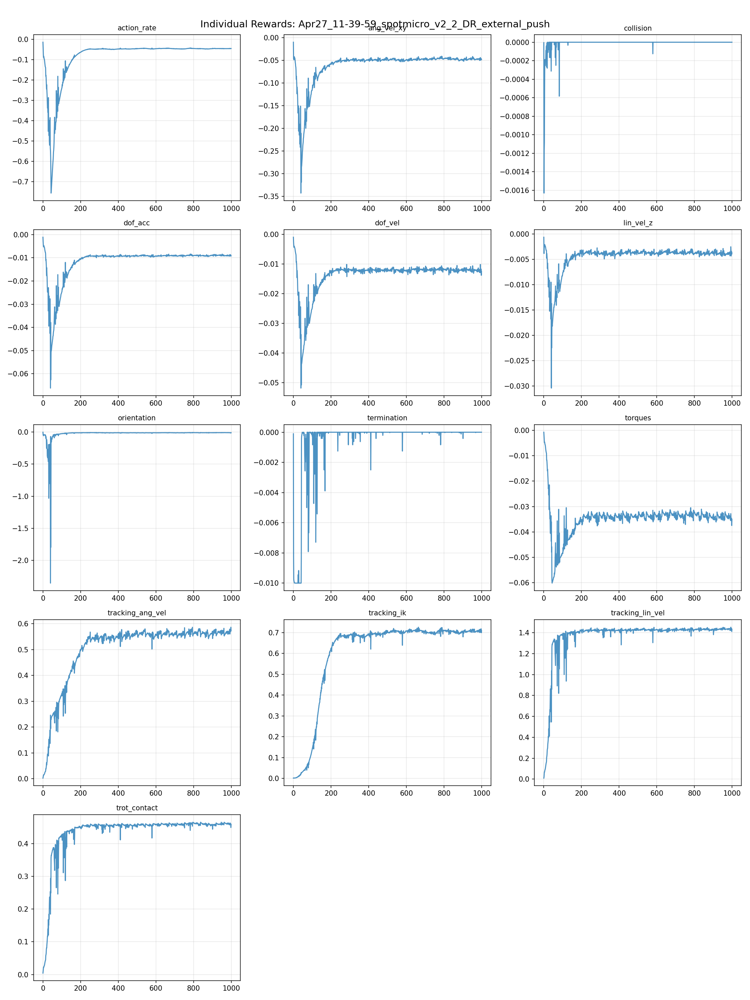
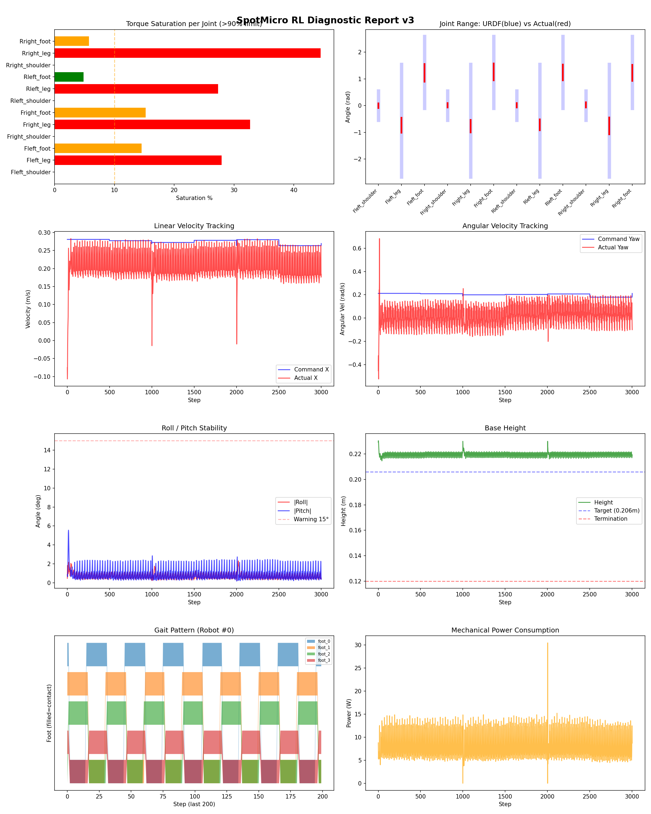
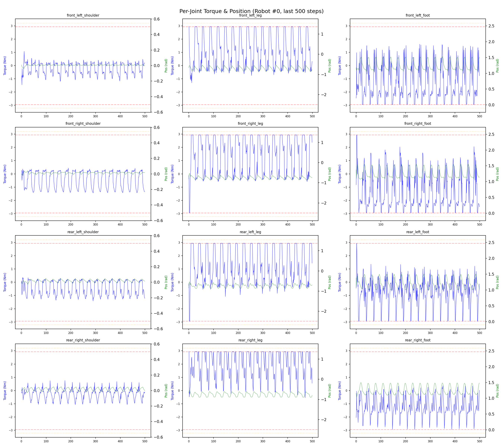
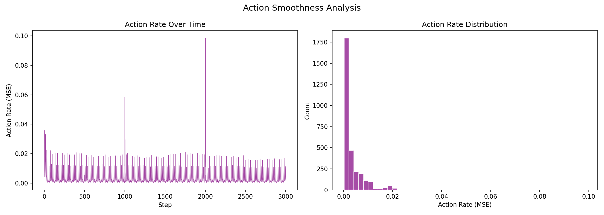

# 실험 009: spotmicro_v2_2_DR_external_push

- **날짜:** 2026-04-27 11:59
- **Task:** spotmicro_test
- **Run name:** `spotmicro_v2_2_DR_external_push`
- **판정:** ✅ PASS

---

## 실험 목적

V2.2: 외부의 충격량 적용.

---

## 변경점 (이전 커밋 대비)

```diff
diff --git a/ai_training/rl/legged_gym/legged_gym/envs/spotmicro_test/spotmicro_test_config.py b/ai_training/rl/legged_gym/legged_gym/envs/spotmicro_test/spotmicro_test_config.py
index 6161929..6005ec2 100644
--- a/ai_training/rl/legged_gym/legged_gym/envs/spotmicro_test/spotmicro_test_config.py
+++ b/ai_training/rl/legged_gym/legged_gym/envs/spotmicro_test/spotmicro_test_config.py
@@ -108,9 +108,9 @@ class SpotmicroTestCfg(LeggedRobotCfg):
         friction_range = [0.4, 1.2]
         randomize_base_mass = True
         added_mass_range = [-0.2, 0.2]
-        push_robots = False
+        push_robots = True
         push_interval_s = 15
-        max_push_vel_xy = 0.5
+        max_push_vel_xy = 0.2
 
 
 class SpotmicroTestCfgPPO(LeggedRobotCfgPPO):
@@ -119,7 +119,7 @@ class SpotmicroTestCfgPPO(LeggedRobotCfgPPO):
         entropy_coef = 0.01
 
     class runner(LeggedRobotCfgPPO.runner):
-        run_name = 'spotmicro_v2_1_DR_mass'
+        run_name = 'spotmicro_v2_2_DR_external_push'
         experiment_name = 'spotmicro_test'
         max_iterations = 1000
         save_interval = 100
```

**변경 요약:**
  - push_robots = False
  + push_robots = True
  - max_push_vel_xy = 0.5
  + max_push_vel_xy = 0.2
  - run_name = 'spotmicro_v2_1_DR_mass'
  + run_name = 'spotmicro_v2_2_DR_external_push'

---

## 현재 Reward Scales

| Reward | Scale |
|--------|-------|
| action_rate | -0.05 |
| ang_vel_xy | -0.2 |
| collision | -1.0 |
| dof_acc | -2.5e-07 |
| dof_vel | -0.001 |
| lin_vel_z | -2.0 |
| orientation | -4.0 |
| termination | -10.0 |
| torques | -0.001 |
| tracking_ang_vel | 0.9 |
| tracking_ik | 1.0 |
| tracking_lin_vel | 1.5 |
| trot_contact | 0.5 |

---

## 진단 결과 (Diagnostic)

### 핵심 지표

- ✅ Timeout: 100.0% (≥80%)
- ✅ 속도오차 X: 0.0697 m/s (<0.08)
- ⚠️ 토크포화: 14.4% (10~40%)
- ✅ 자세: roll 0.7°, pitch 1.0° (안정)
- ✅ 조기종료: 0.0% (<5%)

### 상세 수치

| 지표 | 값 |
|------|-----|
| Timeout% | 100.0 |
| 조기종료% | 0.0 |
| 속도오차 X | 0.06971453875303268 m/s |
| 속도오차 Y | 0.021179700270295143 m/s |
| 각속도오차 | 0.1001272052526474 rad/s |
| 토크포화% | 14.399229242979244 |
| 평균 높이 | 0.21967423891092275 m |
| Roll (평균) | 0.7260104417800903° |
| Pitch (평균) | 0.9553527235984802° |
| Action Rate | 0.0034509366378188133 |
| 평균 전력 | 8.121528625488281 W |
| CoT | 1.5304421399621164 |


## 학습 곡선 분석

| 지표 | 값 | 판정 |
|------|-----|------|
| 수렴 iter (90%) | 190 | 빠름 |
| 후반 안정성 (CV) | 0.005 | 안정 |
| 정체 구간 | 있음 (iter 214, 49 iter) | |


## Per-leg 분석

### 발별 접촉/공중 비율

| 발 | 접촉% | 공중% |
|-----|-------|------|
| foot_0 | 56.7% | 43.3% |
| foot_1 | 56.3% | 43.7% |
| foot_2 | 53.6% | 46.4% |
| foot_3 | 48.8% | 51.2% |

### 관절별 토크 포화

| 관절 | 포화% | 최대토크 | 한계 | 상태 |
|------|------|---------|------|------|
| front_left_shoulder | 0.0% | 1.728 | 2.940 | ✅ |
| front_left_leg | 27.9% | 2.940 | 2.940 | ❌ |
| front_left_foot | 14.5% | 2.940 | 2.940 | ⚠️ |
| front_right_shoulder | 0.0% | 2.372 | 2.940 | ✅ |
| front_right_leg | 32.7% | 2.940 | 2.940 | ❌ |
| front_right_foot | 15.2% | 2.940 | 2.940 | ⚠️ |
| rear_left_shoulder | 0.0% | 2.087 | 2.940 | ✅ |
| rear_left_leg | 27.3% | 2.940 | 2.940 | ❌ |
| rear_left_foot | 4.8% | 2.940 | 2.940 | ✅ |
| rear_right_shoulder | 0.0% | 2.224 | 2.940 | ✅ |
| rear_right_leg | 44.5% | 2.940 | 2.940 | ❌ |
| rear_right_foot | 5.8% | 2.940 | 2.940 | ⚠️ |


## Gait 분석

| 지표 | 값 |
|------|-----|
| Gait 주파수 | 0.42 Hz |
| Gait 주기 | 30 steps |
| 대각 동기화율 | 93.9% |
| L/R 비대칭 | 0.0%p |
| 판정 | ✅ Trot 패턴 / ✅ 대칭 |


## 관절별 상세

| 관절 | 토크포화% | 사용범위% | 편향(rad) | 한계근접% | 상태 |
|------|----------|----------|----------|----------|------|
| front_left_shoulder | 0.0% | 16% | -0.004 | 0.0% | ✅ |
| front_left_leg | 27.9% | 13% | -0.734 | 0.0% | ⚠️ |
| front_left_foot | 14.5% | 25% | +1.224 | 0.0% | ⚠️ |
| front_right_shoulder | 0.0% | 15% | +0.013 | 0.0% | ✅ |
| front_right_leg | 32.7% | 11% | -0.769 | 0.0% | ⚠️ |
| front_right_foot | 15.2% | 23% | +1.262 | 0.0% | ⚠️ |
| rear_left_shoulder | 0.0% | 15% | +0.018 | 0.0% | ✅ |
| rear_left_leg | 27.3% | 9% | -0.719 | 0.0% | ⚠️ |
| rear_left_foot | 4.8% | 22% | +1.243 | 0.0% | ⚠️ |
| rear_right_shoulder | 0.0% | 18% | +0.024 | 0.0% | ✅ |
| rear_right_leg | 44.5% | 15% | -0.757 | 0.0% | ⚠️ |
| rear_right_foot | 5.8% | 22% | +1.229 | 0.0% | ⚠️ |


## 에너지 효율 상세

| 지표 | 값 |
|------|-----|
| 평균 전력 | 8.12 W |
| 피크 전력 | 30.47 W |
| 피크/평균 비율 | 3.8x |
| CoT | 1.53 |

### 관절별 전력 분배

| 관절 | 평균전력(W) | 비율% |
|------|-----------|-------|
| front_right_foot | 1.720 | 21.2% |
| front_left_foot | 1.558 | 19.2% |
| rear_right_leg | 1.131 | 13.9% |
| rear_left_leg | 0.816 | 10.0% |
| rear_right_foot | 0.739 | 9.1% |
| front_left_leg | 0.718 | 8.8% |
| front_right_leg | 0.645 | 7.9% |
| rear_left_foot | 0.527 | 6.5% |
| rear_left_shoulder | 0.087 | 1.1% |
| front_right_shoulder | 0.071 | 0.9% |
| rear_right_shoulder | 0.062 | 0.8% |
| front_left_shoulder | 0.048 | 0.6% |


## 이전 실험 대비 비교

| 지표 | 이전 (exp008) | 현재 (exp009) | 변화 |
|------|-------|-------|------|
| Timeout% | 100.0% | 100.0% | → 유지 |
| 속도오차 X | 0.0635 | 0.0697 | ⚠️ ↑ 0.0063m/s |
| 토크포화 | 14.8% | 14.4% | ✅ ↓ 0.3829% |
| Roll | 1.0° | 0.7° | ✅ ↓ 0.3075° |
| Pitch | 0.9° | 1.0° | ⚠️ ↑ 0.0971° |
| 평균 전력 | 8.2166W | 8.1215W | ✅ ↓ 0.0950W |


## Tensorboard 학습 곡선 요약

| 스칼라 | 최종값 | 최대 | 최소 | 후반10% 평균 |
|--------|--------|------|------|-------------|
| rew_action_rate | -0.0453 | -0.0143 | -0.7556 | -0.0456 |
| rew_ang_vel_xy | -0.0481 | -0.0101 | -0.3430 | -0.0474 |
| rew_collision | 0.0000 | 0.0000 | -0.0016 | 0.0000 |
| rew_dof_acc | -0.0092 | -0.0011 | -0.0662 | -0.0090 |
| rew_dof_vel | -0.0124 | -0.0009 | -0.0518 | -0.0120 |
| rew_lin_vel_z | -0.0037 | -0.0006 | -0.0304 | -0.0038 |
| rew_orientation | -0.0106 | -0.0026 | -2.3522 | -0.0099 |
| rew_termination | 0.0000 | 0.0000 | -0.0100 | -0.0000 |
| rew_torques | -0.0351 | -0.0007 | -0.0602 | -0.0343 |
| rew_tracking_ang_vel | 0.5731 | 0.5863 | 0.0024 | 0.5664 |
| rew_tracking_ik | 0.7098 | 0.7260 | 0.0012 | 0.7069 |
| rew_tracking_lin_vel | 1.4310 | 1.4528 | 0.0094 | 1.4338 |
| rew_trot_contact | 0.4588 | 0.4653 | 0.0044 | 0.4594 |
| learning_rate | 0.0003 | 0.0076 | 0.0000 | 0.0003 |
| surrogate | -0.0011 | 0.0027 | -0.0123 | -0.0020 |
| value_function | 0.0398 | 0.2827 | 0.0005 | 0.0412 |
| collection time | 0.7762 | 0.9042 | 0.7159 | 0.7687 |
| learning_time | 0.2873 | 0.3442 | 0.2754 | 0.2891 |
| total_fps | 92436.0000 | 98174.0000 | 78747.0000 | 92949.0100 |
| mean_noise_std | 0.1939 | 0.9991 | 0.1611 | 0.1838 |
| mean_episode_length | 1002.0000 | 1002.0000 | 13.0787 | 1001.5633 |
| time | 1002.0000 | 1002.0000 | 13.0787 | 1001.5633 |
| mean_reward | 60.2947 | 60.3988 | -0.1630 | 60.0629 |
| time | 60.2947 | 60.3988 | -0.1630 | 60.0629 |

총 학습 iteration: 999


---

## 그래프

### Tensorboard 학습 곡선



### Diagnostic 결과





---

## 결론 및 다음 실험 방향

**자동 판정:** ✅ PASS

대부분 기준을 통과했으나 일부 항목이 보통 수준입니다.
  - ⚠️ 토크포화: 14.4% (10~40%)

> 💡 위 결론은 자동 생성되었습니다. 필요시 수정하세요.

---

## 메모

_(추가 메모가 있으면 여기에 작성)_

