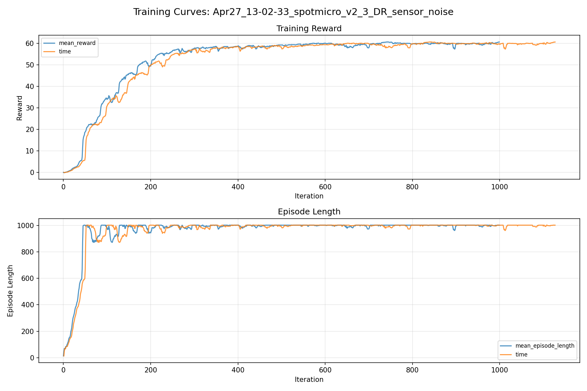
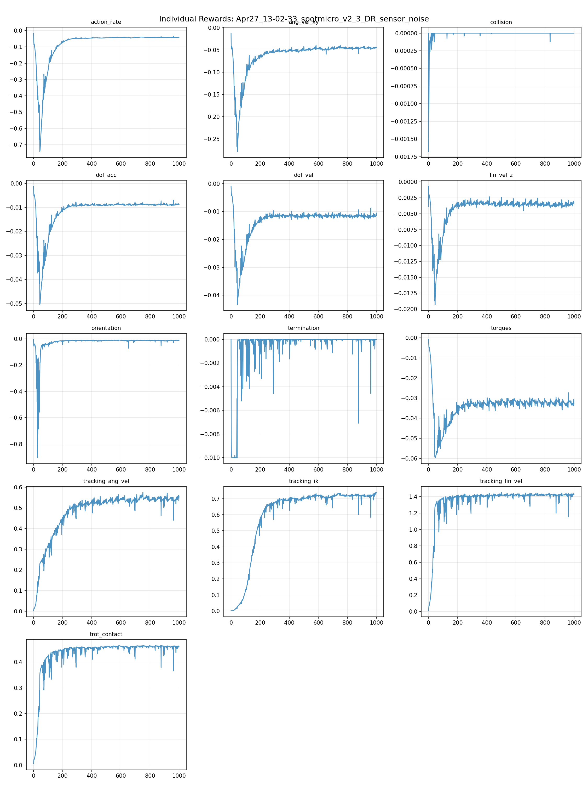
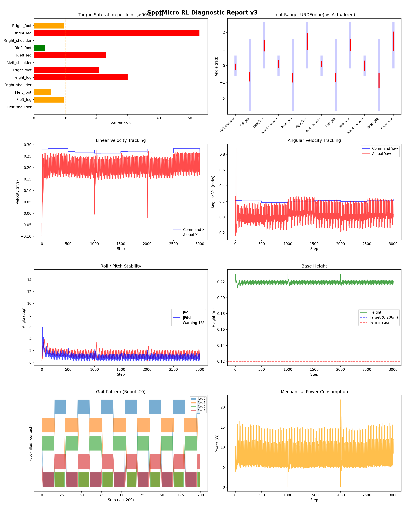
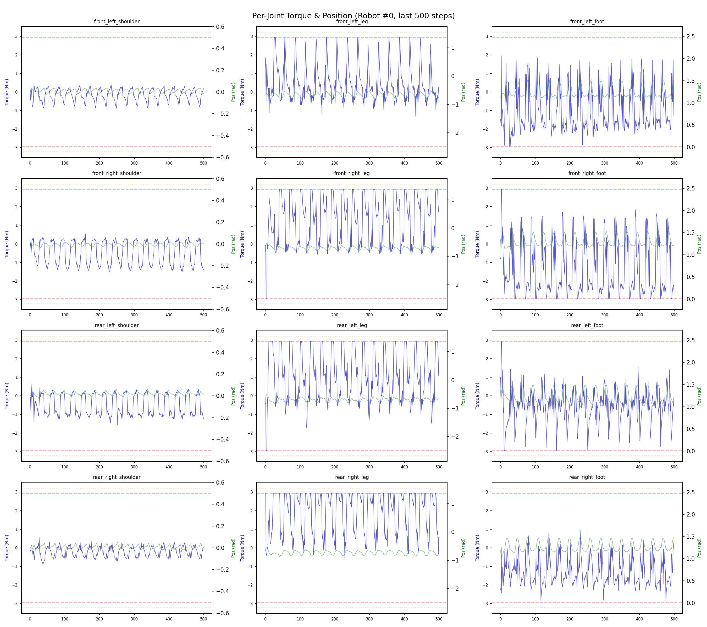
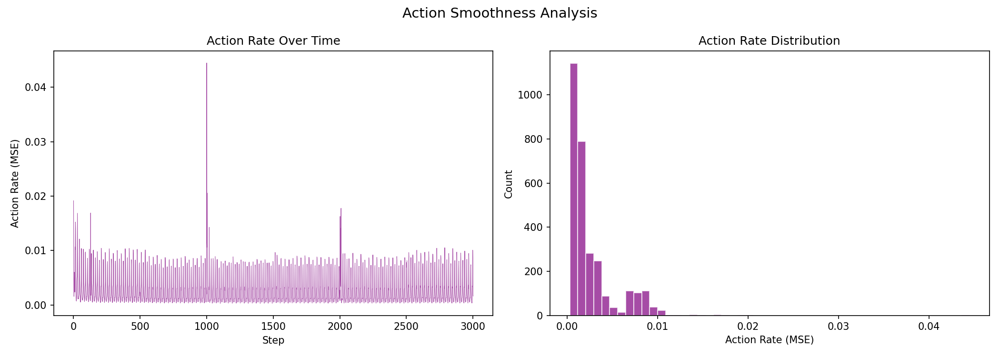

# 실험 010: spotmicro_v2_3_DR_sensor_noise

- **날짜:** 2026-04-27 13:23
- **Task:** spotmicro_test
- **Run name:** `spotmicro_v2_3_DR_sensor_noise`
- **판정:** ✅ PASS

---

## 실험 목적

V2.3: 센서 노이즈 값 추가.

---

## 변경점 (이전 커밋 대비)

```diff
diff --git a/ai_training/rl/legged_gym/legged_gym/envs/base/legged_robot.py b/ai_training/rl/legged_gym/legged_gym/envs/base/legged_robot.py
index e147ee7..a49c2cd 100644
--- a/ai_training/rl/legged_gym/legged_gym/envs/base/legged_robot.py
+++ b/ai_training/rl/legged_gym/legged_gym/envs/base/legged_robot.py
@@ -315,7 +315,8 @@ class LeggedRobot(BaseTask):
         # randomize base mass
         if self.cfg.domain_rand.randomize_base_mass:
             rng = self.cfg.domain_rand.added_mass_range
-            props[0].mass += np.random.uniform(rng[0], rng[1])
+            added = np.random.uniform(rng[0], rng[1])
+            props[0].mass += added
             if env_id < 5:  # 처음 5개 env만 출력
                 print(f"[DR] Env {env_id}: base mass = {props[0].mass:.3f} kg (added {added:+.3f})")
         return props
diff --git a/ai_training/rl/legged_gym/legged_gym/envs/spotmicro_test/spotmicro_test_config.py b/ai_training/rl/legged_gym/legged_gym/envs/spotmicro_test/spotmicro_test_config.py
index 6005ec2..03ed1b0 100644
--- a/ai_training/rl/legged_gym/legged_gym/envs/spotmicro_test/spotmicro_test_config.py
+++ b/ai_training/rl/legged_gym/legged_gym/envs/spotmicro_test/spotmicro_test_config.py
@@ -81,7 +81,7 @@ class SpotmicroTestCfg(LeggedRobotCfg):
             height_measurements = 5.0
 
     class noise(LeggedRobotCfg.noise):
-        add_noise = False
+        add_noise = True 
         noise_level = 1.0
         class noise_scales:
             dof_pos = 0.01
@@ -119,7 +119,7 @@ class SpotmicroTestCfgPPO(LeggedRobotCfgPPO):
         entropy_coef = 0.01
 
     class runner(LeggedRobotCfgPPO.runner):
-        run_name = 'spotmicro_v2_2_DR_external_push'
+        run_name = 'spotmicro_v2_3_DR_sensor_noise'
         experiment_name = 'spotmicro_test'
         max_iterations = 1000
         save_interval = 100
```

**변경 요약:**
  - props[0].mass += np.random.uniform(rng[0], rng[1])
  + added = np.random.uniform(rng[0], rng[1])
  + props[0].mass += added
  - add_noise = False
  + add_noise = True
  - run_name = 'spotmicro_v2_2_DR_external_push'
  + run_name = 'spotmicro_v2_3_DR_sensor_noise'

---

## 현재 Reward Scales

| Reward | Scale |
|--------|-------|
| action_rate | -0.05 |
| ang_vel_xy | -0.2 |
| collision | -1.0 |
| dof_acc | -2.5e-07 |
| dof_vel | -0.001 |
| lin_vel_z | -2.0 |
| orientation | -4.0 |
| termination | -10.0 |
| torques | -0.001 |
| tracking_ang_vel | 0.9 |
| tracking_ik | 1.0 |
| tracking_lin_vel | 1.5 |
| trot_contact | 0.5 |

---

## 진단 결과 (Diagnostic)

### 핵심 지표

- ✅ Timeout: 99.2% (≥80%)
- ✅ 속도오차 X: 0.0768 m/s (<0.08)
- ⚠️ 토크포화: 12.9% (10~40%)
- ✅ 자세: roll 1.4°, pitch 0.9° (안정)
- ✅ 조기종료: 0.0% (<5%)

### 상세 수치

| 지표 | 값 |
|------|-----|
| Timeout% | 99.2248062015504 |
| 조기종료% | 0.0 |
| 속도오차 X | 0.07675094902515411 m/s |
| 속도오차 Y | 0.022429009899497032 m/s |
| 각속도오차 | 0.11968803405761719 rad/s |
| 토크포화% | 12.905237123987126 |
| 평균 높이 | 0.21972547228380795 m |
| Roll (평균) | 1.430236577987671° |
| Pitch (평균) | 0.9360892176628113° |
| Action Rate | 0.002551209880039096 |
| 평균 전력 | 7.7637858390808105 W |
| CoT | 1.5455069418158351 |


## 학습 곡선 분석

| 지표 | 값 | 판정 |
|------|-----|------|
| 수렴 iter (90%) | 216 | 빠름 |
| 후반 안정성 (CV) | 0.009 | 안정 |
| 정체 구간 | 있음 (iter 896, 49 iter) | |


## Per-leg 분석

### 발별 접촉/공중 비율

| 발 | 접촉% | 공중% |
|-----|-------|------|
| foot_0 | 50.9% | 49.1% |
| foot_1 | 59.5% | 40.5% |
| foot_2 | 54.1% | 45.9% |
| foot_3 | 51.1% | 48.9% |

### 관절별 토크 포화

| 관절 | 포화% | 최대토크 | 한계 | 상태 |
|------|------|---------|------|------|
| front_left_shoulder | 0.0% | 1.645 | 2.940 | ✅ |
| front_left_leg | 9.5% | 2.940 | 2.940 | ⚠️ |
| front_left_foot | 5.5% | 2.940 | 2.940 | ⚠️ |
| front_right_shoulder | 0.0% | 2.511 | 2.940 | ✅ |
| front_right_leg | 30.0% | 2.940 | 2.940 | ❌ |
| front_right_foot | 20.7% | 2.940 | 2.940 | ❌ |
| rear_left_shoulder | 0.0% | 2.142 | 2.940 | ✅ |
| rear_left_leg | 23.0% | 2.940 | 2.940 | ❌ |
| rear_left_foot | 3.5% | 2.940 | 2.940 | ✅ |
| rear_right_shoulder | 0.0% | 2.940 | 2.940 | ✅ |
| rear_right_leg | 53.1% | 2.940 | 2.940 | ❌ |
| rear_right_foot | 9.6% | 2.940 | 2.940 | ⚠️ |


## Gait 분석

| 지표 | 값 |
|------|-----|
| Gait 주파수 | 0.42 Hz |
| Gait 주기 | 30 steps |
| 대각 동기화율 | 94.8% |
| L/R 비대칭 | 0.0%p |
| 판정 | ✅ Trot 패턴 / ✅ 대칭 |


## 관절별 상세

| 관절 | 토크포화% | 사용범위% | 편향(rad) | 한계근접% | 상태 |
|------|----------|----------|----------|----------|------|
| front_left_shoulder | 0.0% | 29% | -0.060 | 0.0% | ✅ |
| front_left_leg | 9.5% | 12% | -0.663 | 0.0% | ⚠️ |
| front_left_foot | 5.5% | 24% | +1.209 | 0.0% | ⚠️ |
| front_right_shoulder | 0.0% | 35% | +0.107 | 0.0% | ⚠️ |
| front_right_leg | 30.0% | 12% | -0.737 | 0.0% | ⚠️ |
| front_right_foot | 20.7% | 36% | +1.454 | 0.0% | ⚠️ |
| rear_left_shoulder | 0.0% | 28% | +0.115 | 0.0% | ⚠️ |
| rear_left_leg | 23.0% | 12% | -0.698 | 0.0% | ⚠️ |
| rear_left_foot | 3.5% | 23% | +1.252 | 0.0% | ⚠️ |
| rear_right_shoulder | 0.0% | 53% | -0.007 | 0.0% | ✅ |
| rear_right_leg | 53.1% | 21% | -0.891 | 0.0% | ⚠️ |
| rear_right_foot | 9.6% | 40% | +1.485 | 0.0% | ⚠️ |


## 에너지 효율 상세

| 지표 | 값 |
|------|-----|
| 평균 전력 | 7.76 W |
| 피크 전력 | 21.89 W |
| 피크/평균 비율 | 2.8x |
| CoT | 1.55 |

### 관절별 전력 분배

| 관절 | 평균전력(W) | 비율% |
|------|-----------|-------|
| front_right_foot | 1.749 | 22.5% |
| front_left_foot | 1.235 | 15.9% |
| rear_right_leg | 1.057 | 13.6% |
| rear_left_leg | 0.859 | 11.1% |
| rear_right_foot | 0.843 | 10.9% |
| front_right_leg | 0.637 | 8.2% |
| rear_left_foot | 0.573 | 7.4% |
| front_left_leg | 0.559 | 7.2% |
| rear_left_shoulder | 0.109 | 1.4% |
| front_right_shoulder | 0.067 | 0.9% |
| rear_right_shoulder | 0.047 | 0.6% |
| front_left_shoulder | 0.029 | 0.4% |


## 이전 실험 대비 비교

| 지표 | 이전 (exp009) | 현재 (exp010) | 변화 |
|------|-------|-------|------|
| Timeout% | 100.0% | 99.2% | ⚠️ ↓ 0.7752% |
| 속도오차 X | 0.0697 | 0.0768 | ⚠️ ↑ 0.0070m/s |
| 토크포화 | 14.4% | 12.9% | ✅ ↓ 1.4940% |
| Roll | 0.7° | 1.4° | ⚠️ ↑ 0.7042° |
| Pitch | 1.0° | 0.9° | ✅ ↓ 0.0193° |
| 평균 전력 | 8.1215W | 7.7638W | ✅ ↓ 0.3577W |


## Tensorboard 학습 곡선 요약

| 스칼라 | 최종값 | 최대 | 최소 | 후반10% 평균 |
|--------|--------|------|------|-------------|
| rew_action_rate | -0.0405 | -0.0151 | -0.7424 | -0.0417 |
| rew_ang_vel_xy | -0.0447 | -0.0124 | -0.2786 | -0.0453 |
| rew_collision | 0.0000 | 0.0000 | -0.0017 | 0.0000 |
| rew_dof_acc | -0.0087 | -0.0012 | -0.0505 | -0.0088 |
| rew_dof_vel | -0.0115 | -0.0009 | -0.0434 | -0.0117 |
| rew_lin_vel_z | -0.0033 | -0.0007 | -0.0193 | -0.0035 |
| rew_orientation | -0.0116 | -0.0035 | -0.9039 | -0.0136 |
| rew_termination | 0.0000 | 0.0000 | -0.0100 | -0.0001 |
| rew_torques | -0.0328 | -0.0007 | -0.0597 | -0.0326 |
| rew_tracking_ang_vel | 0.5580 | 0.5758 | 0.0026 | 0.5436 |
| rew_tracking_ik | 0.7363 | 0.7396 | 0.0012 | 0.7198 |
| rew_tracking_lin_vel | 1.4301 | 1.4533 | 0.0083 | 1.4210 |
| rew_trot_contact | 0.4602 | 0.4649 | 0.0044 | 0.4586 |
| learning_rate | 0.0002 | 0.0076 | 0.0000 | 0.0005 |
| surrogate | -0.0012 | 0.0027 | -0.0124 | -0.0018 |
| value_function | 0.0296 | 0.5911 | 0.0007 | 0.0386 |
| collection time | 0.8138 | 1.0039 | 0.7644 | 0.8170 |
| learning_time | 0.2922 | 0.3791 | 0.2811 | 0.2946 |
| total_fps | 88884.0000 | 92898.0000 | 75125.0000 | 88469.3500 |
| mean_noise_std | 0.1812 | 0.9980 | 0.1544 | 0.1758 |
| mean_episode_length | 1002.0000 | 1002.0000 | 12.9670 | 1000.1648 |
| time | 1002.0000 | 1002.0000 | 12.9670 | 1000.1648 |
| mean_reward | 60.5388 | 60.5955 | -0.1432 | 59.8149 |
| time | 60.5388 | 60.5955 | -0.1432 | 59.8149 |

총 학습 iteration: 999


---

## 그래프

### Tensorboard 학습 곡선



### Diagnostic 결과





---

## 결론 및 다음 실험 방향

**자동 판정:** ✅ PASS

대부분 기준을 통과했으나 일부 항목이 보통 수준입니다.
  - ⚠️ 토크포화: 12.9% (10~40%)

> 💡 위 결론은 자동 생성되었습니다. 필요시 수정하세요.

---

## 메모

_(추가 메모가 있으면 여기에 작성)_

