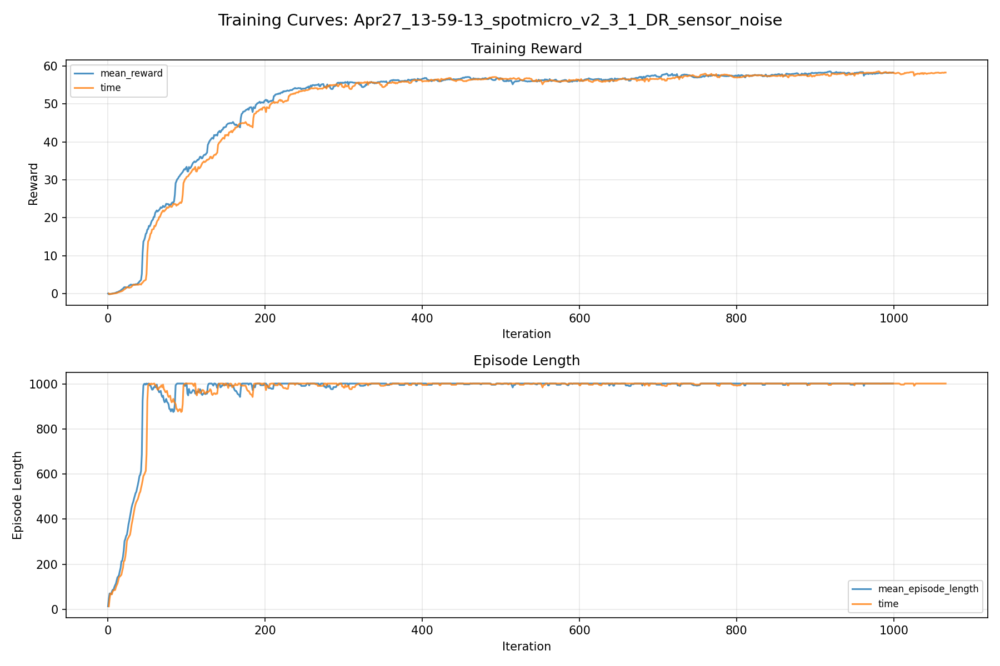
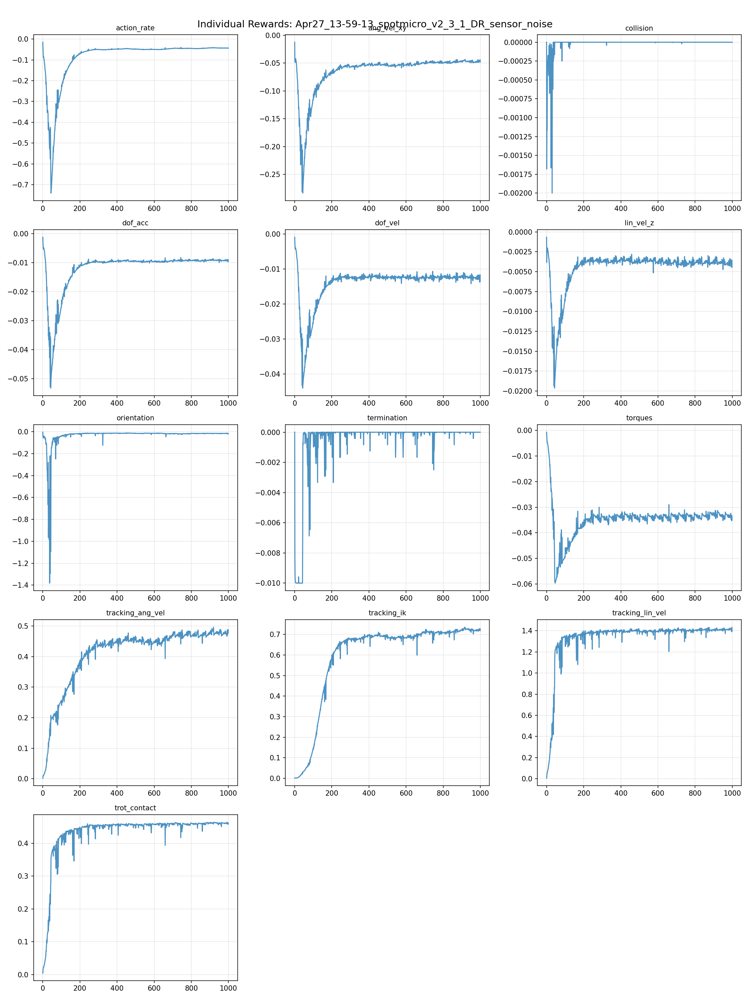
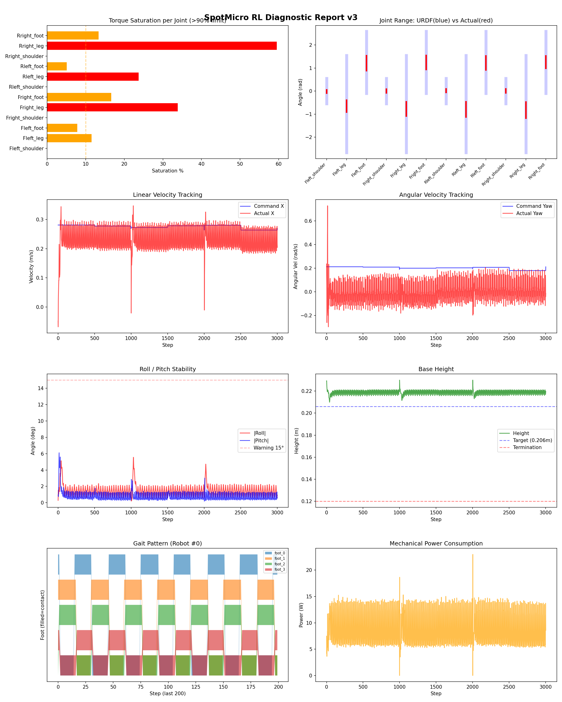
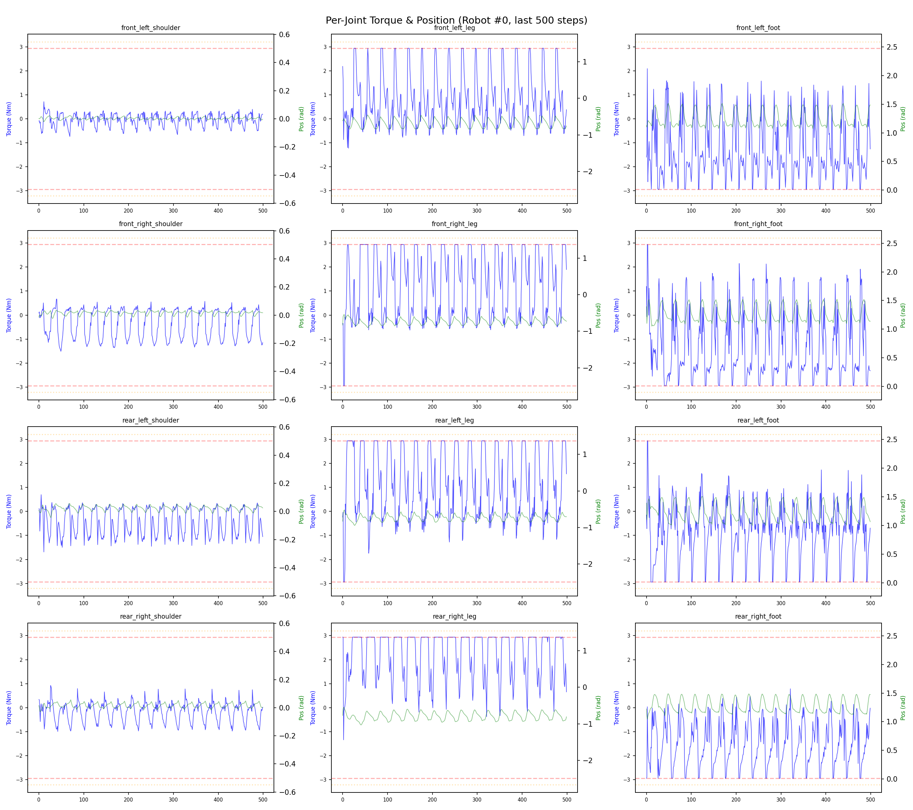
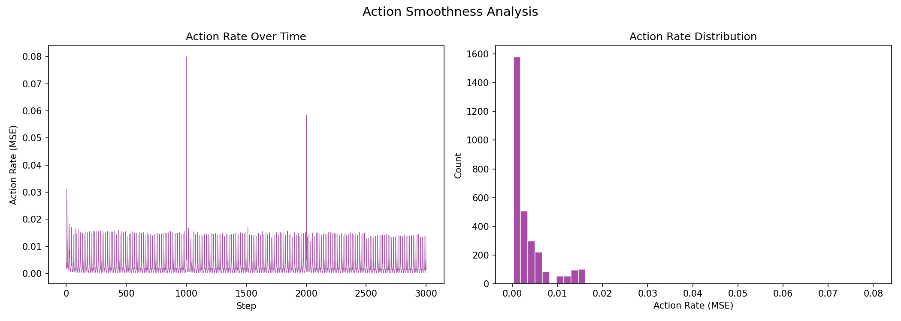

# 실험 011: spotmicro_v2_3_1_DR_sensor_noise

- **날짜:** 2026-04-27 14:18
- **Task:** spotmicro_test
- **Run name:** `spotmicro_v2_3_1_DR_sensor_noise`
- **판정:** ✅ PASS

---

## 실험 목적

V2.3.1: sigma값 낮춰서 노이즈 환경에서 성능이 좋아지는지 확인.

---

## 변경점 (이전 커밋 대비)

```diff
diff --git a/ai_training/rl/legged_gym/legged_gym/envs/spotmicro_test/spotmicro_test_config.py b/ai_training/rl/legged_gym/legged_gym/envs/spotmicro_test/spotmicro_test_config.py
index 03ed1b0..53e0442 100644
--- a/ai_training/rl/legged_gym/legged_gym/envs/spotmicro_test/spotmicro_test_config.py
+++ b/ai_training/rl/legged_gym/legged_gym/envs/spotmicro_test/spotmicro_test_config.py
@@ -70,7 +70,7 @@ class SpotmicroTestCfg(LeggedRobotCfg):
             tracking_ik = 1.0
         soft_dof_pos_limit = 0.9
         base_height_target = 0.206
-        tracking_sigma = 0.15
+        tracking_sigma = 0.1
 
     class normalization(LeggedRobotCfg.normalization):
         class obs_scales:
@@ -119,7 +119,7 @@ class SpotmicroTestCfgPPO(LeggedRobotCfgPPO):
         entropy_coef = 0.01
 
     class runner(LeggedRobotCfgPPO.runner):
-        run_name = 'spotmicro_v2_3_DR_sensor_noise'
+        run_name = 'spotmicro_v2_3_1_DR_sensor_noise'
         experiment_name = 'spotmicro_test'
         max_iterations = 1000
         save_interval = 100
```

**변경 요약:**
  - tracking_sigma = 0.15
  + tracking_sigma = 0.1
  - run_name = 'spotmicro_v2_3_DR_sensor_noise'
  + run_name = 'spotmicro_v2_3_1_DR_sensor_noise'

---

## 현재 Reward Scales

| Reward | Scale |
|--------|-------|
| action_rate | -0.05 |
| ang_vel_xy | -0.2 |
| collision | -1.0 |
| dof_acc | -2.5e-07 |
| dof_vel | -0.001 |
| lin_vel_z | -2.0 |
| orientation | -4.0 |
| termination | -10.0 |
| torques | -0.001 |
| tracking_ang_vel | 0.9 |
| tracking_ik | 1.0 |
| tracking_lin_vel | 1.5 |
| trot_contact | 0.5 |

---

## 진단 결과 (Diagnostic)

### 핵심 지표

- ✅ Timeout: 100.0% (≥80%)
- ✅ 속도오차 X: 0.0528 m/s (<0.08)
- ⚠️ 토크포화: 14.3% (10~40%)
- ✅ 자세: roll 1.4°, pitch 0.8° (안정)
- ✅ 조기종료: 0.0% (<5%)

### 상세 수치

| 지표 | 값 |
|------|-----|
| Timeout% | 100.0 |
| 조기종료% | 0.0 |
| 속도오차 X | 0.052789486944675446 m/s |
| 속도오차 Y | 0.02150571532547474 m/s |
| 각속도오차 | 0.1075124591588974 rad/s |
| 토크포화% | 14.293172105672106 |
| 평균 높이 | 0.21895193883946368 m |
| Roll (평균) | 1.4469703435897827° |
| Pitch (평균) | 0.8053951859474182° |
| Action Rate | 0.0034107849933207035 |
| 평균 전력 | 8.543943405151367 W |
| CoT | 1.4693491817315465 |


## 학습 곡선 분석

| 지표 | 값 | 판정 |
|------|-----|------|
| 수렴 iter (90%) | 218 | 빠름 |
| 후반 안정성 (CV) | 0.014 | 안정 |
| 정체 구간 | 있음 (iter 279, 49 iter) | |


## Per-leg 분석

### 발별 접촉/공중 비율

| 발 | 접촉% | 공중% |
|-----|-------|------|
| foot_0 | 52.9% | 47.1% |
| foot_1 | 57.7% | 42.3% |
| foot_2 | 53.2% | 46.8% |
| foot_3 | 50.9% | 49.1% |

### 관절별 토크 포화

| 관절 | 포화% | 최대토크 | 한계 | 상태 |
|------|------|---------|------|------|
| front_left_shoulder | 0.0% | 1.315 | 2.940 | ✅ |
| front_left_leg | 11.5% | 2.940 | 2.940 | ⚠️ |
| front_left_foot | 7.8% | 2.940 | 2.940 | ⚠️ |
| front_right_shoulder | 0.0% | 2.094 | 2.940 | ✅ |
| front_right_leg | 33.9% | 2.940 | 2.940 | ❌ |
| front_right_foot | 16.6% | 2.940 | 2.940 | ⚠️ |
| rear_left_shoulder | 0.0% | 2.136 | 2.940 | ✅ |
| rear_left_leg | 23.7% | 2.940 | 2.940 | ❌ |
| rear_left_foot | 5.1% | 2.940 | 2.940 | ⚠️ |
| rear_right_shoulder | 0.0% | 2.327 | 2.940 | ✅ |
| rear_right_leg | 59.5% | 2.940 | 2.940 | ❌ |
| rear_right_foot | 13.4% | 2.940 | 2.940 | ⚠️ |


## Gait 분석

| 지표 | 값 |
|------|-----|
| Gait 주파수 | 0.42 Hz |
| Gait 주기 | 30 steps |
| 대각 동기화율 | 95.1% |
| L/R 비대칭 | 0.0%p |
| 판정 | ✅ Trot 패턴 / ✅ 대칭 |


## 관절별 상세

| 관절 | 토크포화% | 사용범위% | 편향(rad) | 한계근접% | 상태 |
|------|----------|----------|----------|----------|------|
| front_left_shoulder | 0.0% | 13% | -0.013 | 0.0% | ✅ |
| front_left_leg | 11.5% | 12% | -0.651 | 0.0% | ⚠️ |
| front_left_foot | 7.8% | 24% | +1.210 | 0.0% | ⚠️ |
| front_right_shoulder | 0.0% | 15% | +0.000 | 0.0% | ✅ |
| front_right_leg | 33.9% | 15% | -0.771 | 0.0% | ⚠️ |
| front_right_foot | 16.6% | 23% | +1.244 | 0.0% | ⚠️ |
| rear_left_shoulder | 0.0% | 13% | +0.019 | 0.0% | ✅ |
| rear_left_leg | 23.7% | 16% | -0.796 | 0.0% | ⚠️ |
| rear_left_foot | 5.1% | 23% | +1.227 | 0.0% | ⚠️ |
| rear_right_shoulder | 0.0% | 16% | +0.008 | 0.0% | ✅ |
| rear_right_leg | 59.5% | 17% | -0.823 | 0.0% | ⚠️ |
| rear_right_foot | 13.4% | 20% | +1.257 | 0.0% | ⚠️ |


## 에너지 효율 상세

| 지표 | 값 |
|------|-----|
| 평균 전력 | 8.54 W |
| 피크 전력 | 22.98 W |
| 피크/평균 비율 | 2.7x |
| CoT | 1.47 |

### 관절별 전력 분배

| 관절 | 평균전력(W) | 비율% |
|------|-----------|-------|
| front_right_foot | 1.665 | 19.5% |
| front_left_foot | 1.366 | 16.0% |
| rear_right_leg | 1.262 | 14.8% |
| rear_right_foot | 1.034 | 12.1% |
| rear_left_leg | 0.899 | 10.5% |
| front_right_leg | 0.731 | 8.6% |
| front_left_leg | 0.692 | 8.1% |
| rear_left_foot | 0.664 | 7.8% |
| rear_left_shoulder | 0.085 | 1.0% |
| front_right_shoulder | 0.064 | 0.7% |
| rear_right_shoulder | 0.059 | 0.7% |
| front_left_shoulder | 0.023 | 0.3% |


## 이전 실험 대비 비교

| 지표 | 이전 (exp010) | 현재 (exp011) | 변화 |
|------|-------|-------|------|
| Timeout% | 99.2% | 100.0% | ✅ ↑ 0.7752% |
| 속도오차 X | 0.0768 | 0.0528 | ✅ ↓ 0.0240m/s |
| 토크포화 | 12.9% | 14.3% | ⚠️ ↑ 1.3879% |
| Roll | 1.4° | 1.4° | ⚠️ ↑ 0.0167° |
| Pitch | 0.9° | 0.8° | ✅ ↓ 0.1307° |
| 평균 전력 | 7.7638W | 8.5439W | ⚠️ ↑ 0.7802W |


## Tensorboard 학습 곡선 요약

| 스칼라 | 최종값 | 최대 | 최소 | 후반10% 평균 |
|--------|--------|------|------|-------------|
| rew_action_rate | -0.0433 | -0.0151 | -0.7402 | -0.0427 |
| rew_ang_vel_xy | -0.0478 | -0.0124 | -0.2838 | -0.0469 |
| rew_collision | 0.0000 | 0.0000 | -0.0020 | 0.0000 |
| rew_dof_acc | -0.0095 | -0.0012 | -0.0532 | -0.0091 |
| rew_dof_vel | -0.0136 | -0.0009 | -0.0440 | -0.0124 |
| rew_lin_vel_z | -0.0044 | -0.0007 | -0.0196 | -0.0038 |
| rew_orientation | -0.0171 | -0.0035 | -1.3820 | -0.0150 |
| rew_termination | 0.0000 | 0.0000 | -0.0100 | -0.0000 |
| rew_torques | -0.0349 | -0.0007 | -0.0596 | -0.0333 |
| rew_tracking_ang_vel | 0.4870 | 0.4960 | 0.0022 | 0.4782 |
| rew_tracking_ik | 0.7188 | 0.7351 | 0.0012 | 0.7228 |
| rew_tracking_lin_vel | 1.3974 | 1.4339 | 0.0062 | 1.4113 |
| rew_trot_contact | 0.4588 | 0.4641 | 0.0044 | 0.4611 |
| learning_rate | 0.0004 | 0.0100 | 0.0000 | 0.0005 |
| surrogate | 0.0002 | 0.0022 | -0.0106 | -0.0019 |
| value_function | 0.0330 | 0.1039 | 0.0007 | 0.0174 |
| collection time | 0.7743 | 0.9043 | 0.7236 | 0.7713 |
| learning_time | 0.2835 | 0.3565 | 0.2788 | 0.2900 |
| total_fps | 92931.0000 | 97109.0000 | 78977.0000 | 92657.5700 |
| mean_noise_std | 0.1895 | 1.0006 | 0.1604 | 0.1769 |
| mean_episode_length | 1002.0000 | 1002.0000 | 12.9670 | 1001.6471 |
| time | 1002.0000 | 1002.0000 | 12.9670 | 1001.6471 |
| mean_reward | 58.2978 | 58.6081 | -0.1516 | 58.1885 |
| time | 58.2978 | 58.6081 | -0.1516 | 58.1885 |

총 학습 iteration: 999


---

## 그래프

### Tensorboard 학습 곡선



### Diagnostic 결과





---

## 결론 및 다음 실험 방향

**자동 판정:** ✅ PASS

대부분 기준을 통과했으나 일부 항목이 보통 수준입니다.
  - ⚠️ 토크포화: 14.3% (10~40%)

> 💡 위 결론은 자동 생성되었습니다. 필요시 수정하세요.

---

## 메모

속도오차 확실히 좋아짐. 각속도 오차를 좀 잡고 싶으니 reward를 속도랑 비슷하게 줘보는게 어떨까

