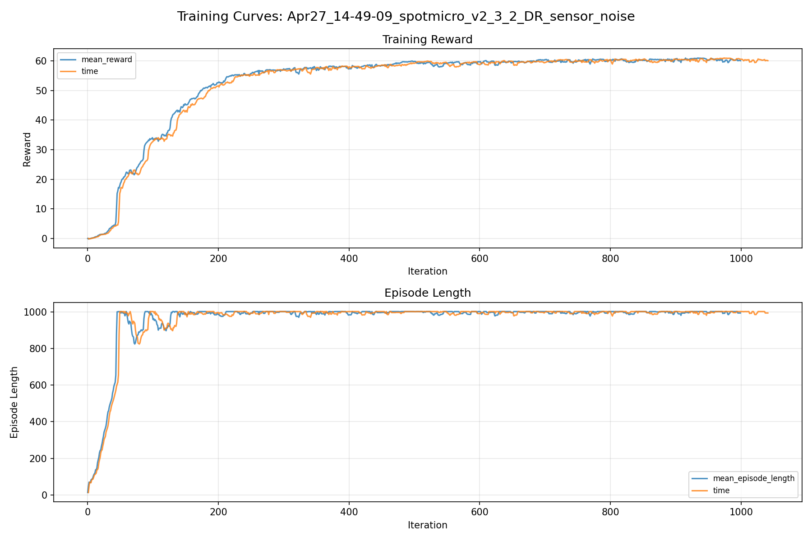
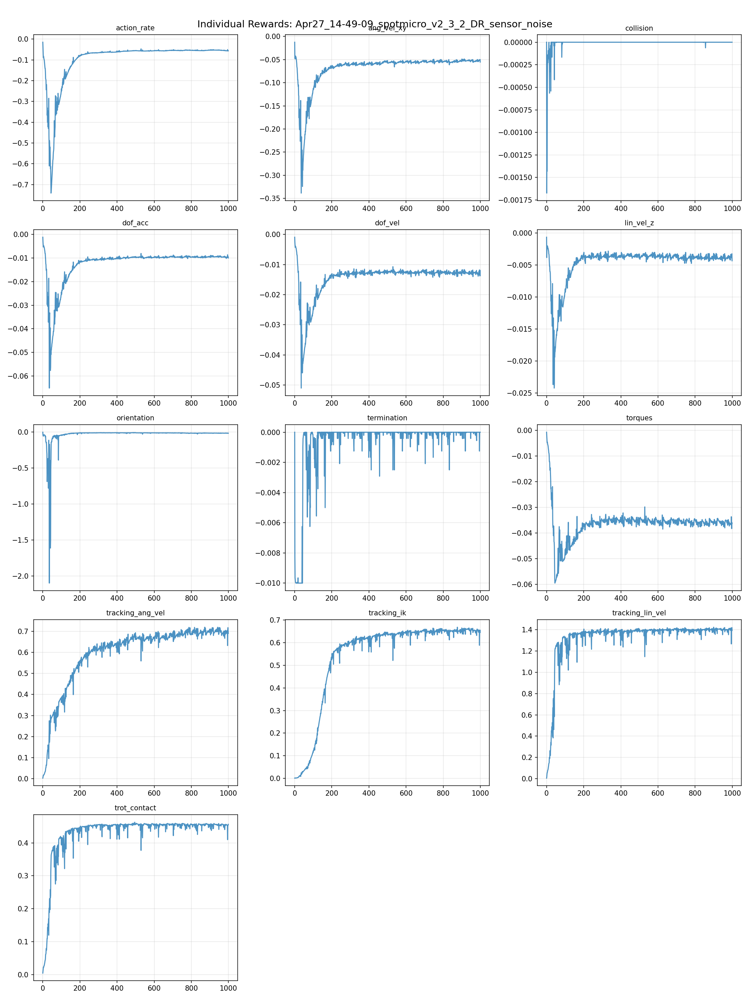
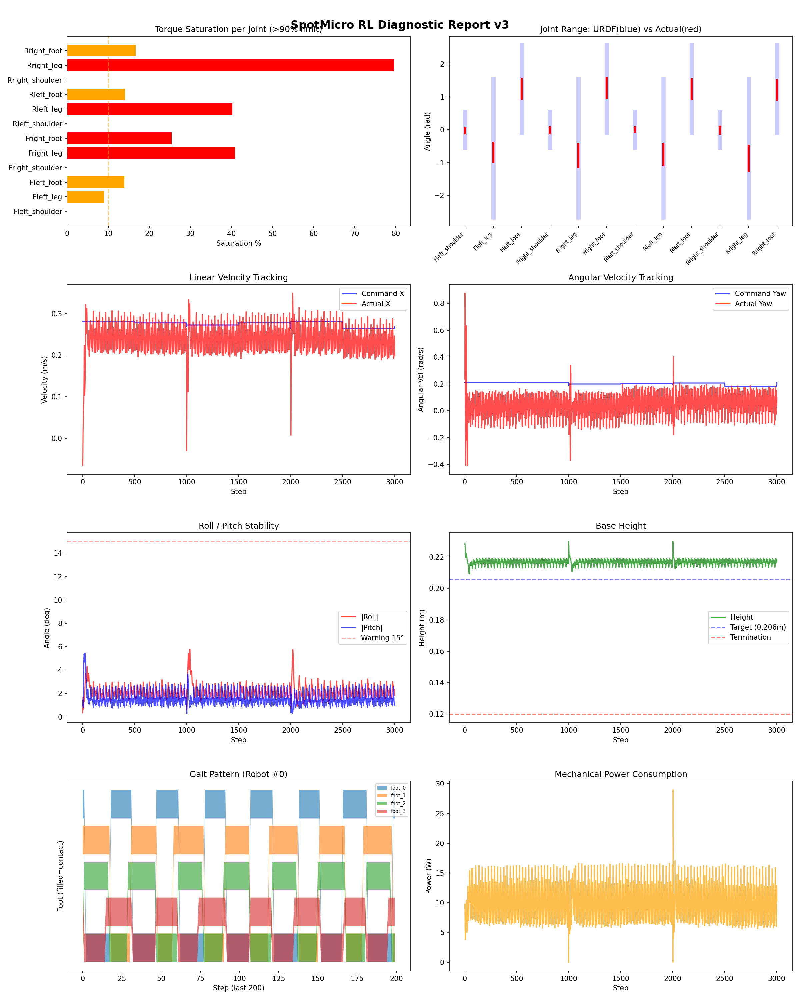
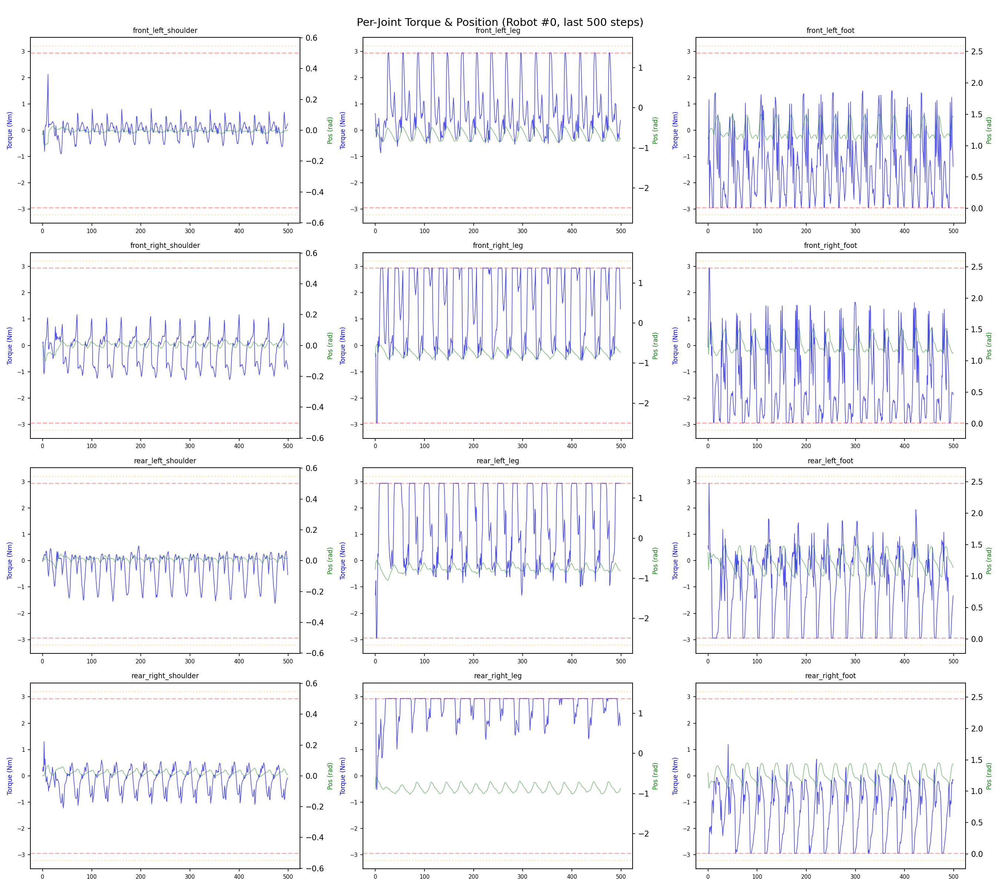
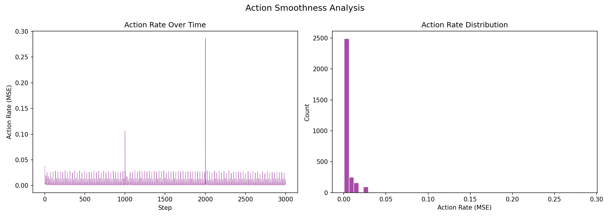

# 실험 012: spotmicro_v2_3_2_DR_sensor_noise

- **날짜:** 2026-04-27 15:08
- **Task:** spotmicro_test
- **Run name:** `spotmicro_v2_3_2_DR_sensor_noise`
- **판정:** ✅ PASS

---

## 실험 목적

V2.3.2: 각속도 추종 reward를 직선속도 추종 reward랑 비슷하게 조정, 오차 감소를 확인.

---

## 변경점 (이전 커밋 대비)

```diff
diff --git a/ai_training/rl/legged_gym/legged_gym/envs/spotmicro_test/spotmicro_test_config.py b/ai_training/rl/legged_gym/legged_gym/envs/spotmicro_test/spotmicro_test_config.py
index 03ed1b0..2085f8e 100644
--- a/ai_training/rl/legged_gym/legged_gym/envs/spotmicro_test/spotmicro_test_config.py
+++ b/ai_training/rl/legged_gym/legged_gym/envs/spotmicro_test/spotmicro_test_config.py
@@ -50,7 +50,7 @@ class SpotmicroTestCfg(LeggedRobotCfg):
     class rewards(LeggedRobotCfg.rewards):
         class scales:
             tracking_lin_vel = 1.5
-            tracking_ang_vel = 0.9 
+            tracking_ang_vel = 1.3 
             termination = -10.0
             lin_vel_z = -2.0
             ang_vel_xy = -0.2
@@ -70,7 +70,7 @@ class SpotmicroTestCfg(LeggedRobotCfg):
             tracking_ik = 1.0
         soft_dof_pos_limit = 0.9
         base_height_target = 0.206
-        tracking_sigma = 0.15
+        tracking_sigma = 0.1
 
     class normalization(LeggedRobotCfg.normalization):
         class obs_scales:
@@ -119,7 +119,7 @@ class SpotmicroTestCfgPPO(LeggedRobotCfgPPO):
         entropy_coef = 0.01
 
     class runner(LeggedRobotCfgPPO.runner):
-        run_name = 'spotmicro_v2_3_DR_sensor_noise'
+        run_name = 'spotmicro_v2_3_2_DR_sensor_noise'
         experiment_name = 'spotmicro_test'
         max_iterations = 1000
         save_interval = 100
```

**변경 요약:**
  - tracking_ang_vel = 0.9
  + tracking_ang_vel = 1.3
  - tracking_sigma = 0.15
  + tracking_sigma = 0.1
  - run_name = 'spotmicro_v2_3_DR_sensor_noise'
  + run_name = 'spotmicro_v2_3_2_DR_sensor_noise'

---

## 현재 Reward Scales

| Reward | Scale |
|--------|-------|
| action_rate | -0.05 |
| ang_vel_xy | -0.2 |
| collision | -1.0 |
| dof_acc | -2.5e-07 |
| dof_vel | -0.001 |
| lin_vel_z | -2.0 |
| orientation | -4.0 |
| termination | -10.0 |
| torques | -0.001 |
| tracking_ang_vel | 1.3 |
| tracking_ik | 1.0 |
| tracking_lin_vel | 1.5 |
| trot_contact | 0.5 |

---

## 진단 결과 (Diagnostic)

### 핵심 지표

- ✅ Timeout: 100.0% (≥80%)
- ✅ 속도오차 X: 0.0509 m/s (<0.08)
- ⚠️ 토크포화: 20.0% (10~40%)
- ✅ 자세: roll 2.1°, pitch 1.6° (안정)
- ✅ 조기종료: 0.0% (<5%)

### 상세 수치

| 지표 | 값 |
|------|-----|
| Timeout% | 100.0 |
| 조기종료% | 0.0 |
| 속도오차 X | 0.05085860565304756 m/s |
| 속도오차 Y | 0.024858754128217697 m/s |
| 각속도오차 | 0.11684275418519974 rad/s |
| 토크포화% | 19.979586385836388 |
| 평균 높이 | 0.21694725424874992 m |
| Roll (평균) | 2.1427979469299316° |
| Pitch (평균) | 1.5628836154937744° |
| Action Rate | 0.004577930551022291 |
| 평균 전력 | 9.787220001220703 W |
| CoT | 1.6383406707019823 |


## 학습 곡선 분석

| 지표 | 값 | 판정 |
|------|-----|------|
| 수렴 iter (90%) | 219 | 빠름 |
| 후반 안정성 (CV) | 0.010 | 안정 |
| 정체 구간 | 있음 (iter 496, 49 iter) | |


## Per-leg 분석

### 발별 접촉/공중 비율

| 발 | 접촉% | 공중% |
|-----|-------|------|
| foot_0 | 51.3% | 48.7% |
| foot_1 | 60.1% | 39.9% |
| foot_2 | 55.5% | 44.5% |
| foot_3 | 53.0% | 47.0% |

### 관절별 토크 포화

| 관절 | 포화% | 최대토크 | 한계 | 상태 |
|------|------|---------|------|------|
| front_left_shoulder | 0.0% | 2.293 | 2.940 | ✅ |
| front_left_leg | 9.0% | 2.940 | 2.940 | ⚠️ |
| front_left_foot | 13.9% | 2.940 | 2.940 | ⚠️ |
| front_right_shoulder | 0.0% | 2.281 | 2.940 | ✅ |
| front_right_leg | 40.8% | 2.940 | 2.940 | ❌ |
| front_right_foot | 25.4% | 2.940 | 2.940 | ❌ |
| rear_left_shoulder | 0.0% | 1.842 | 2.940 | ✅ |
| rear_left_leg | 40.2% | 2.940 | 2.940 | ❌ |
| rear_left_foot | 14.1% | 2.940 | 2.940 | ⚠️ |
| rear_right_shoulder | 0.0% | 1.565 | 2.940 | ✅ |
| rear_right_leg | 79.6% | 2.940 | 2.940 | ❌ |
| rear_right_foot | 16.7% | 2.940 | 2.940 | ⚠️ |


## Gait 분석

| 지표 | 값 |
|------|-----|
| Gait 주파수 | 0.42 Hz |
| Gait 주기 | 30 steps |
| 대각 동기화율 | 92.9% |
| L/R 비대칭 | 0.0%p |
| 판정 | ✅ Trot 패턴 / ✅ 대칭 |


## 관절별 상세

| 관절 | 토크포화% | 사용범위% | 편향(rad) | 한계근접% | 상태 |
|------|----------|----------|----------|----------|------|
| front_left_shoulder | 0.0% | 14% | -0.027 | 0.0% | ✅ |
| front_left_leg | 9.0% | 13% | -0.684 | 0.0% | ⚠️ |
| front_left_foot | 13.9% | 22% | +1.244 | 0.0% | ⚠️ |
| front_right_shoulder | 0.0% | 17% | -0.016 | 0.0% | ✅ |
| front_right_leg | 40.8% | 17% | -0.780 | 0.0% | ⚠️ |
| front_right_foot | 25.4% | 22% | +1.267 | 0.0% | ⚠️ |
| rear_left_shoulder | 0.0% | 13% | +0.007 | 0.0% | ✅ |
| rear_left_leg | 40.2% | 15% | -0.745 | 0.0% | ⚠️ |
| rear_left_foot | 14.1% | 22% | +1.237 | 0.0% | ⚠️ |
| rear_right_shoulder | 0.0% | 19% | -0.011 | 0.0% | ✅ |
| rear_right_leg | 79.6% | 18% | -0.871 | 0.0% | ⚠️ |
| rear_right_foot | 16.7% | 22% | +1.213 | 0.0% | ⚠️ |


## 에너지 효율 상세

| 지표 | 값 |
|------|-----|
| 평균 전력 | 9.79 W |
| 피크 전력 | 29.00 W |
| 피크/평균 비율 | 3.0x |
| CoT | 1.64 |

### 관절별 전력 분배

| 관절 | 평균전력(W) | 비율% |
|------|-----------|-------|
| front_right_foot | 1.861 | 19.0% |
| rear_right_leg | 1.665 | 17.0% |
| front_left_foot | 1.432 | 14.6% |
| rear_right_foot | 1.124 | 11.5% |
| rear_left_leg | 1.000 | 10.2% |
| rear_left_foot | 0.919 | 9.4% |
| front_right_leg | 0.867 | 8.9% |
| front_left_leg | 0.633 | 6.5% |
| rear_left_shoulder | 0.098 | 1.0% |
| front_right_shoulder | 0.089 | 0.9% |
| rear_right_shoulder | 0.070 | 0.7% |
| front_left_shoulder | 0.027 | 0.3% |


## 이전 실험 대비 비교

| 지표 | 이전 (exp011) | 현재 (exp012) | 변화 |
|------|-------|-------|------|
| Timeout% | 100.0% | 100.0% | → 유지 |
| 속도오차 X | 0.0528 | 0.0509 | ✅ ↓ 0.0019m/s |
| 토크포화 | 14.3% | 20.0% | ⚠️ ↑ 5.6864% |
| Roll | 1.4° | 2.1° | ⚠️ ↑ 0.6958° |
| Pitch | 0.8° | 1.6° | ⚠️ ↑ 0.7575° |
| 평균 전력 | 8.5439W | 9.7872W | ⚠️ ↑ 1.2433W |


## Tensorboard 학습 곡선 요약

| 스칼라 | 최종값 | 최대 | 최소 | 후반10% 평균 |
|--------|--------|------|------|-------------|
| rew_action_rate | -0.0564 | -0.0151 | -0.7407 | -0.0538 |
| rew_ang_vel_xy | -0.0552 | -0.0124 | -0.3386 | -0.0523 |
| rew_collision | 0.0000 | 0.0000 | -0.0017 | 0.0000 |
| rew_dof_acc | -0.0100 | -0.0012 | -0.0651 | -0.0095 |
| rew_dof_vel | -0.0137 | -0.0009 | -0.0510 | -0.0127 |
| rew_lin_vel_z | -0.0043 | -0.0007 | -0.0242 | -0.0038 |
| rew_orientation | -0.0177 | -0.0035 | -2.1003 | -0.0166 |
| rew_termination | 0.0000 | 0.0000 | -0.0100 | -0.0001 |
| rew_torques | -0.0363 | -0.0007 | -0.0596 | -0.0359 |
| rew_tracking_ang_vel | 0.6899 | 0.7191 | 0.0032 | 0.6981 |
| rew_tracking_ik | 0.6458 | 0.6687 | 0.0012 | 0.6547 |
| rew_tracking_lin_vel | 1.3922 | 1.4232 | 0.0062 | 1.3987 |
| rew_trot_contact | 0.4565 | 0.4629 | 0.0044 | 0.4535 |
| learning_rate | 0.0004 | 0.0076 | 0.0000 | 0.0005 |
| surrogate | -0.0003 | 0.0035 | -0.0114 | -0.0016 |
| value_function | 0.0495 | 0.4026 | 0.0011 | 0.0296 |
| collection time | 0.7498 | 0.8534 | 0.7012 | 0.7491 |
| learning_time | 0.2871 | 0.3604 | 0.2676 | 0.2890 |
| total_fps | 94804.0000 | 99363.0000 | 80989.0000 | 94722.0600 |
| mean_noise_std | 0.2118 | 0.9988 | 0.1795 | 0.1978 |
| mean_episode_length | 994.1800 | 1002.0000 | 12.9670 | 998.7817 |
| time | 994.1800 | 1002.0000 | 12.9670 | 998.7817 |
| mean_reward | 60.0911 | 61.0083 | -0.1450 | 60.4481 |
| time | 60.0911 | 61.0083 | -0.1450 | 60.4481 |

총 학습 iteration: 999


---

## 그래프

### Tensorboard 학습 곡선



### Diagnostic 결과





---

## 결론 및 다음 실험 방향

**자동 판정:** ✅ PASS

대부분 기준을 통과했으나 일부 항목이 보통 수준입니다.
  - ⚠️ 토크포화: 20.0% (10~40%)

> 💡 위 결론은 자동 생성되었습니다. 필요시 수정하세요.

---

## 메모

각속도오차는 오히려 늘고 안정성이 떨어짐. rew_ang_vel이 똑같이 0.7에서 수렴하는거 보니까 이 이상 값 주는건 의미가 없나?

