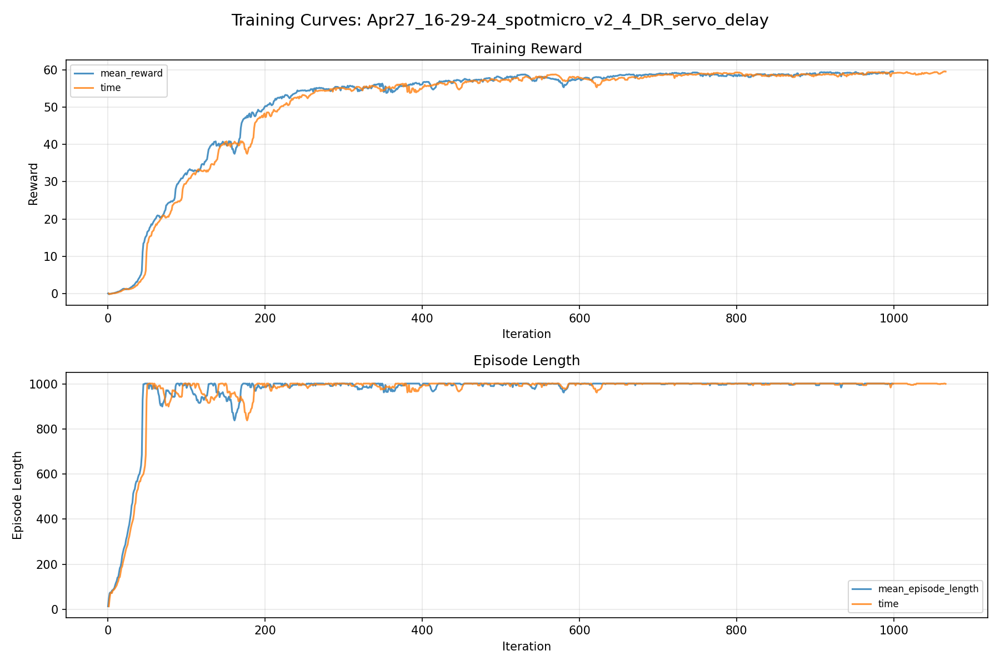
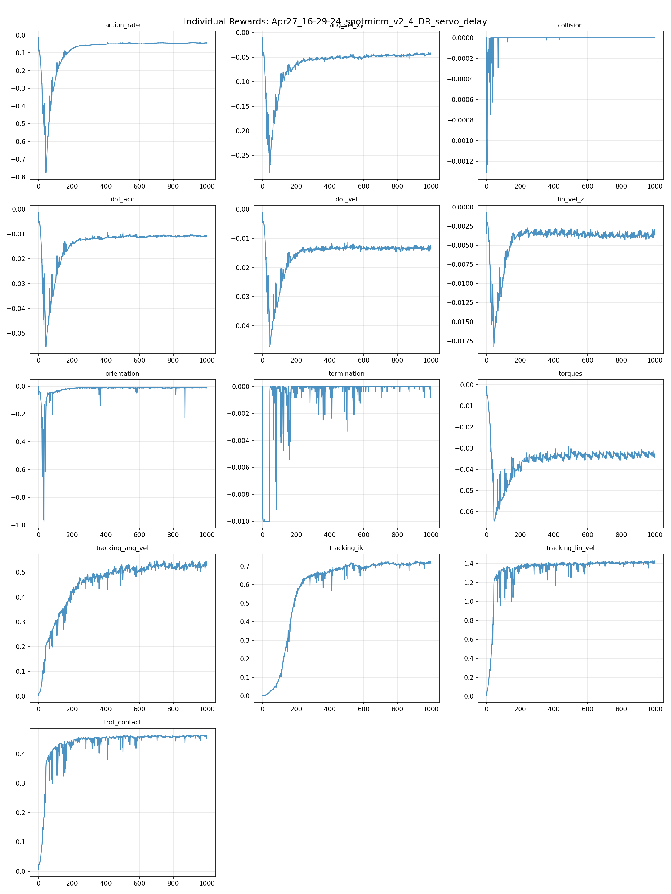
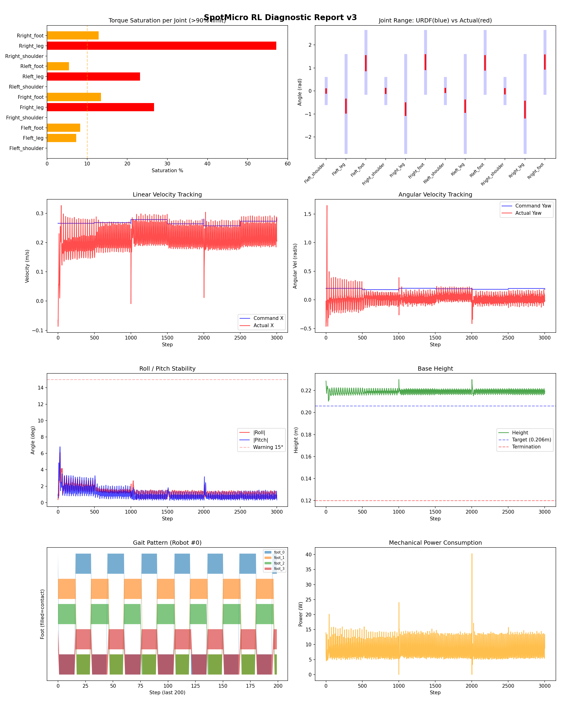
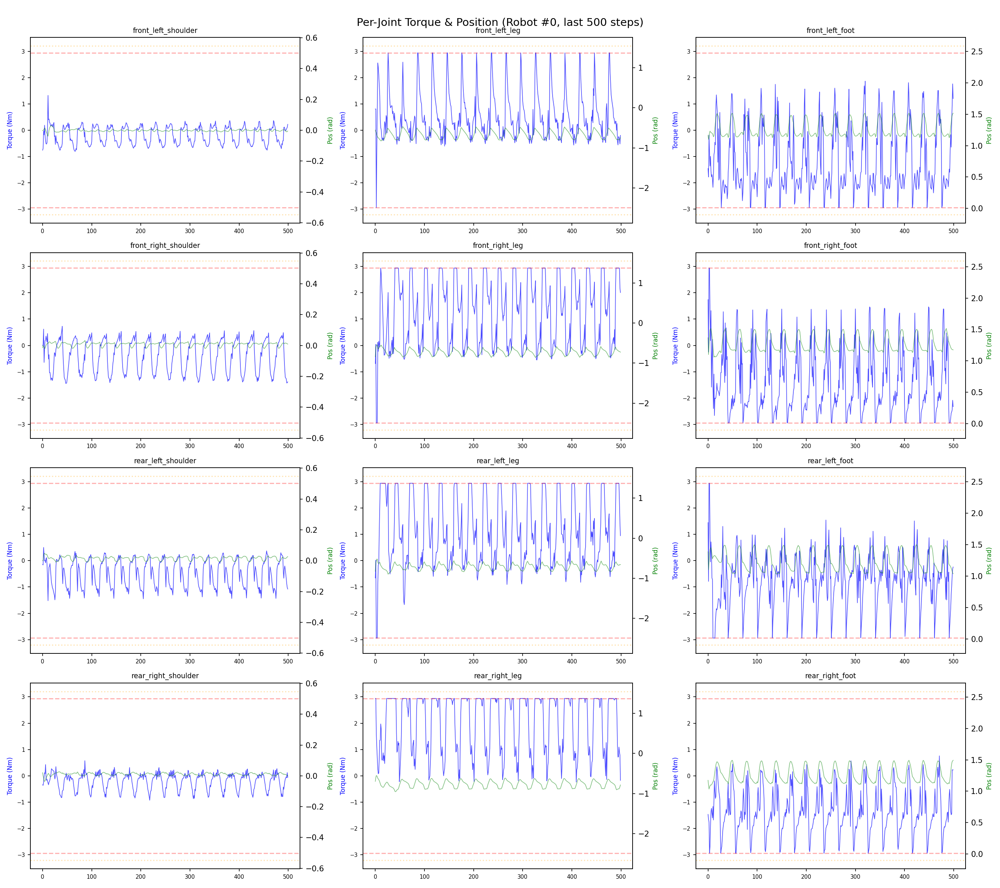
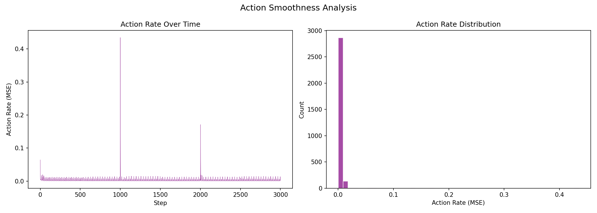

# 실험 013: spotmicro_v2_4_DR_servo_delay

- **날짜:** 2026-04-27 16:48
- **Task:** spotmicro_test
- **Run name:** `spotmicro_v2_4_DR_servo_delay`
- **판정:** ✅ PASS

---

## 실험 목적

V2.4: 실제로 서보모터 응답의 지연을 이전 step의 액션을 적용하는 것으로 반영, 수치가 유지되는지 확인

---

## 변경점 (이전 커밋 대비)

```diff
diff --git a/ai_training/rl/legged_gym/legged_gym/envs/spotmicro_test/spotmicro_test_config.py b/ai_training/rl/legged_gym/legged_gym/envs/spotmicro_test/spotmicro_test_config.py
index edc327d..71d059e 100644
--- a/ai_training/rl/legged_gym/legged_gym/envs/spotmicro_test/spotmicro_test_config.py
+++ b/ai_training/rl/legged_gym/legged_gym/envs/spotmicro_test/spotmicro_test_config.py
@@ -50,7 +50,7 @@ class SpotmicroTestCfg(LeggedRobotCfg):
     class rewards(LeggedRobotCfg.rewards):
         class scales:
             tracking_lin_vel = 1.5
-            tracking_ang_vel = 1.3 
+            tracking_ang_vel = 0.9 
             termination = -10.0
             lin_vel_z = -2.0
             ang_vel_xy = -0.2
@@ -121,7 +121,7 @@ class SpotmicroTestCfgPPO(LeggedRobotCfgPPO):
         entropy_coef = 0.01
 
     class runner(LeggedRobotCfgPPO.runner):
-        run_name = 'spotmicro_v2_3_2_DR_sensor_noise'
+        run_name = 'spotmicro_v2_4_DR_servo_delay'
         experiment_name = 'spotmicro_test'
         max_iterations = 1000
         save_interval = 100
```

**변경 요약:**
  - tracking_ang_vel = 1.3
  + tracking_ang_vel = 0.9
  - run_name = 'spotmicro_v2_3_2_DR_sensor_noise'
  + run_name = 'spotmicro_v2_4_DR_servo_delay'

---

## 현재 Reward Scales

| Reward | Scale |
|--------|-------|
| action_rate | -0.05 |
| ang_vel_xy | -0.2 |
| collision | -1.0 |
| dof_acc | -2.5e-07 |
| dof_vel | -0.001 |
| lin_vel_z | -2.0 |
| orientation | -4.0 |
| termination | -10.0 |
| torques | -0.001 |
| tracking_ang_vel | 0.9 |
| tracking_ik | 1.0 |
| tracking_lin_vel | 1.5 |
| trot_contact | 0.5 |

---

## 진단 결과 (Diagnostic)

### 핵심 지표

- ✅ Timeout: 100.0% (≥80%)
- ✅ 속도오차 X: 0.0610 m/s (<0.08)
- ⚠️ 토크포화: 12.9% (10~40%)
- ✅ 자세: roll 1.3°, pitch 1.0° (안정)
- ✅ 조기종료: 0.0% (<5%)

### 상세 수치

| 지표 | 값 |
|------|-----|
| Timeout% | 100.0 |
| 조기종료% | 0.0 |
| 속도오차 X | 0.06099073588848114 m/s |
| 속도오차 Y | 0.022426022216677666 m/s |
| 각속도오차 | 0.12049461901187897 rad/s |
| 토크포화% | 12.862571456321456 |
| 평균 높이 | 0.21925304331384102 m |
| Roll (평균) | 1.2587755918502808° |
| Pitch (평균) | 1.0201668739318848° |
| Action Rate | 0.003201621351763606 |
| 평균 전력 | 8.261615753173828 W |
| CoT | 1.5338760196798364 |


## 학습 곡선 분석

| 지표 | 값 | 판정 |
|------|-----|------|
| 수렴 iter (90%) | 238 | 빠름 |
| 후반 안정성 (CV) | 0.011 | 안정 |
| 정체 구간 | 있음 (iter 581, 49 iter) | |


## Per-leg 분석

### 발별 접촉/공중 비율

| 발 | 접촉% | 공중% |
|-----|-------|------|
| foot_0 | 51.0% | 49.0% |
| foot_1 | 57.9% | 42.1% |
| foot_2 | 55.5% | 44.5% |
| foot_3 | 51.3% | 48.7% |

### 관절별 토크 포화

| 관절 | 포화% | 최대토크 | 한계 | 상태 |
|------|------|---------|------|------|
| front_left_shoulder | 0.0% | 2.940 | 2.940 | ✅ |
| front_left_leg | 7.3% | 2.940 | 2.940 | ⚠️ |
| front_left_foot | 8.3% | 2.940 | 2.940 | ⚠️ |
| front_right_shoulder | 0.0% | 2.077 | 2.940 | ✅ |
| front_right_leg | 26.7% | 2.940 | 2.940 | ❌ |
| front_right_foot | 13.4% | 2.940 | 2.940 | ⚠️ |
| rear_left_shoulder | 0.0% | 2.662 | 2.940 | ✅ |
| rear_left_leg | 23.2% | 2.940 | 2.940 | ❌ |
| rear_left_foot | 5.5% | 2.940 | 2.940 | ⚠️ |
| rear_right_shoulder | 0.0% | 1.986 | 2.940 | ✅ |
| rear_right_leg | 57.2% | 2.940 | 2.940 | ❌ |
| rear_right_foot | 12.9% | 2.940 | 2.940 | ⚠️ |


## Gait 분석

| 지표 | 값 |
|------|-----|
| Gait 주파수 | 0.42 Hz |
| Gait 주기 | 30 steps |
| 대각 동기화율 | 96.0% |
| L/R 비대칭 | 0.0%p |
| 판정 | ✅ Trot 패턴 / ✅ 대칭 |


## 관절별 상세

| 관절 | 토크포화% | 사용범위% | 편향(rad) | 한계근접% | 상태 |
|------|----------|----------|----------|----------|------|
| front_left_shoulder | 0.0% | 16% | +0.001 | 0.0% | ✅ |
| front_left_leg | 7.3% | 14% | -0.655 | 0.0% | ⚠️ |
| front_left_foot | 8.3% | 24% | +1.206 | 0.0% | ⚠️ |
| front_right_shoulder | 0.0% | 18% | +0.004 | 0.0% | ✅ |
| front_right_leg | 26.7% | 13% | -0.785 | 0.0% | ⚠️ |
| front_right_foot | 13.4% | 23% | +1.253 | 0.0% | ⚠️ |
| rear_left_shoulder | 0.0% | 14% | +0.024 | 0.0% | ✅ |
| rear_left_leg | 23.2% | 12% | -0.664 | 0.0% | ⚠️ |
| rear_left_foot | 5.5% | 23% | +1.227 | 0.0% | ⚠️ |
| rear_right_shoulder | 0.0% | 20% | -0.010 | 0.0% | ✅ |
| rear_right_leg | 57.2% | 17% | -0.809 | 0.0% | ⚠️ |
| rear_right_foot | 12.9% | 23% | +1.259 | 0.0% | ⚠️ |


## 에너지 효율 상세

| 지표 | 값 |
|------|-----|
| 평균 전력 | 8.26 W |
| 피크 전력 | 40.31 W |
| 피크/평균 비율 | 4.9x |
| CoT | 1.53 |

### 관절별 전력 분배

| 관절 | 평균전력(W) | 비율% |
|------|-----------|-------|
| front_right_foot | 1.616 | 19.6% |
| front_left_foot | 1.466 | 17.7% |
| rear_right_leg | 1.173 | 14.2% |
| rear_right_foot | 0.961 | 11.6% |
| rear_left_leg | 0.845 | 10.2% |
| front_right_leg | 0.695 | 8.4% |
| rear_left_foot | 0.664 | 8.0% |
| front_left_leg | 0.568 | 6.9% |
| rear_left_shoulder | 0.096 | 1.2% |
| front_right_shoulder | 0.079 | 1.0% |
| rear_right_shoulder | 0.061 | 0.7% |
| front_left_shoulder | 0.040 | 0.5% |


## 이전 실험 대비 비교

| 지표 | 이전 (exp012) | 현재 (exp013) | 변화 |
|------|-------|-------|------|
| Timeout% | 100.0% | 100.0% | → 유지 |
| 속도오차 X | 0.0509 | 0.0610 | ⚠️ ↑ 0.0101m/s |
| 토크포화 | 20.0% | 12.9% | ✅ ↓ 7.1170% |
| Roll | 2.1° | 1.3° | ✅ ↓ 0.8840° |
| Pitch | 1.6° | 1.0° | ✅ ↓ 0.5427° |
| 평균 전력 | 9.7872W | 8.2616W | ✅ ↓ 1.5256W |


## Tensorboard 학습 곡선 요약

| 스칼라 | 최종값 | 최대 | 최소 | 후반10% 평균 |
|--------|--------|------|------|-------------|
| rew_action_rate | -0.0433 | -0.0147 | -0.7760 | -0.0438 |
| rew_ang_vel_xy | -0.0428 | -0.0104 | -0.2852 | -0.0440 |
| rew_collision | 0.0000 | 0.0000 | -0.0013 | 0.0000 |
| rew_dof_acc | -0.0105 | -0.0012 | -0.0555 | -0.0108 |
| rew_dof_vel | -0.0130 | -0.0010 | -0.0473 | -0.0133 |
| rew_lin_vel_z | -0.0031 | -0.0007 | -0.0183 | -0.0036 |
| rew_orientation | -0.0127 | -0.0022 | -0.9724 | -0.0116 |
| rew_termination | -0.0008 | 0.0000 | -0.0100 | -0.0000 |
| rew_torques | -0.0334 | -0.0008 | -0.0645 | -0.0329 |
| rew_tracking_ang_vel | 0.5363 | 0.5467 | 0.0024 | 0.5282 |
| rew_tracking_ik | 0.7172 | 0.7294 | 0.0012 | 0.7183 |
| rew_tracking_lin_vel | 1.4015 | 1.4296 | 0.0062 | 1.4127 |
| rew_trot_contact | 0.4526 | 0.4640 | 0.0043 | 0.4608 |
| learning_rate | 0.0004 | 0.0051 | 0.0000 | 0.0005 |
| surrogate | -0.0013 | 0.0030 | -0.0109 | -0.0016 |
| value_function | 0.0187 | 0.1353 | 0.0009 | 0.0153 |
| collection time | 0.8057 | 1.0578 | 0.7010 | 0.7873 |
| learning_time | 0.2865 | 0.3676 | 0.2683 | 0.2890 |
| total_fps | 90008.0000 | 99460.0000 | 72088.0000 | 91484.1400 |
| mean_noise_std | 0.1846 | 1.0013 | 0.1621 | 0.1776 |
| mean_episode_length | 1000.6000 | 1002.0000 | 12.8864 | 1000.7327 |
| time | 1000.6000 | 1002.0000 | 12.8864 | 1000.7327 |
| mean_reward | 59.5798 | 59.6371 | -0.1826 | 59.1720 |
| time | 59.5798 | 59.6371 | -0.1826 | 59.1720 |

총 학습 iteration: 999


---

## 그래프

### Tensorboard 학습 곡선



### Diagnostic 결과





---

## 결론 및 다음 실험 방향

**자동 판정:** ✅ PASS

대부분 기준을 통과했으나 일부 항목이 보통 수준입니다.
  - ⚠️ 토크포화: 12.9% (10~40%)

> 💡 위 결론은 자동 생성되었습니다. 필요시 수정하세요.

---

## 메모

_(추가 메모가 있으면 여기에 작성)_

