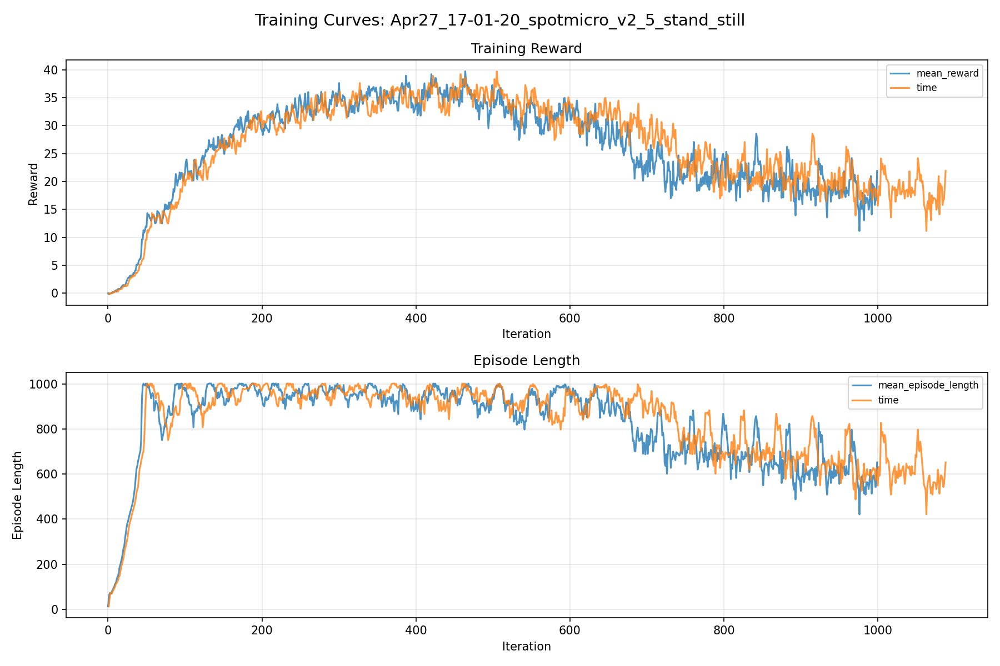
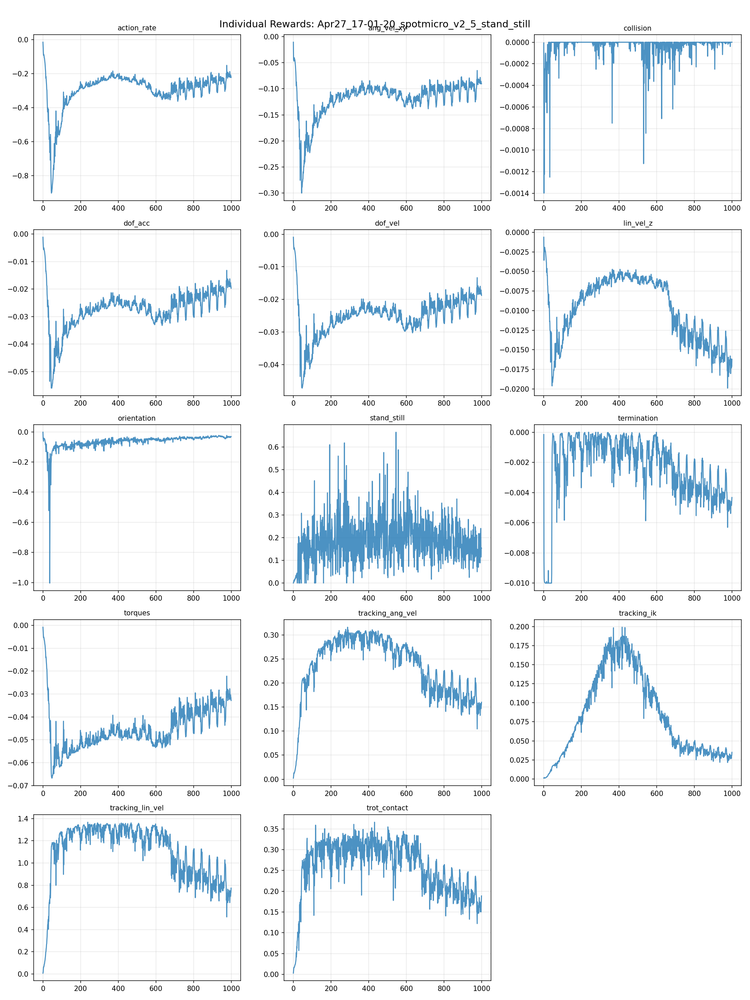
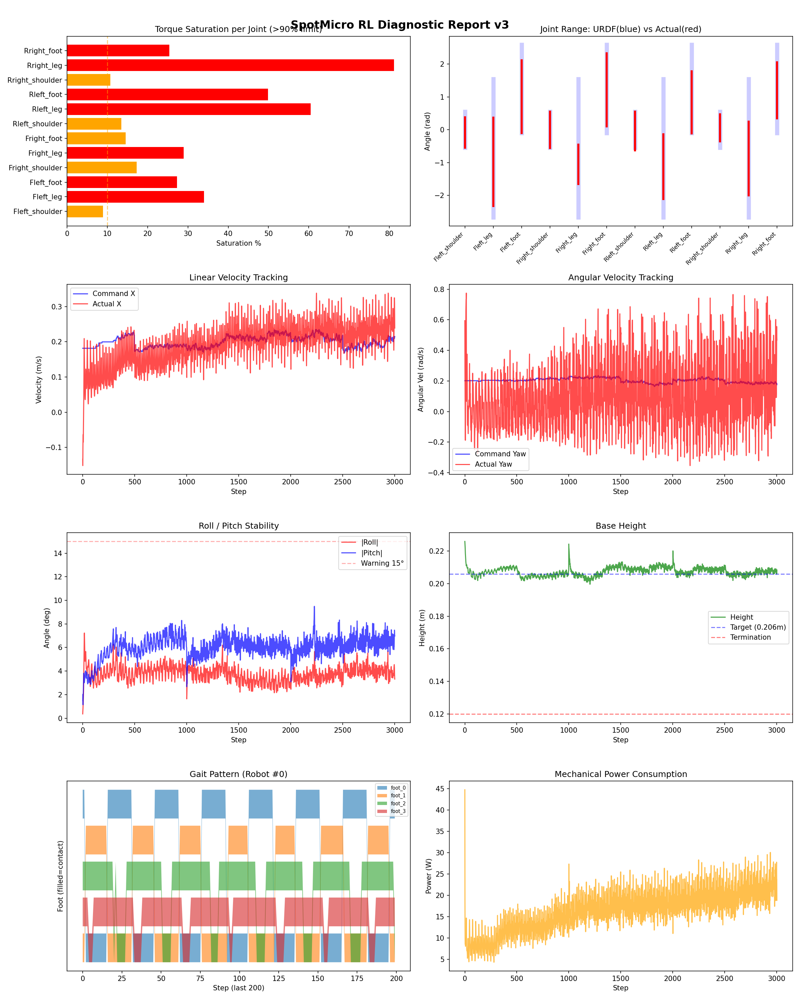
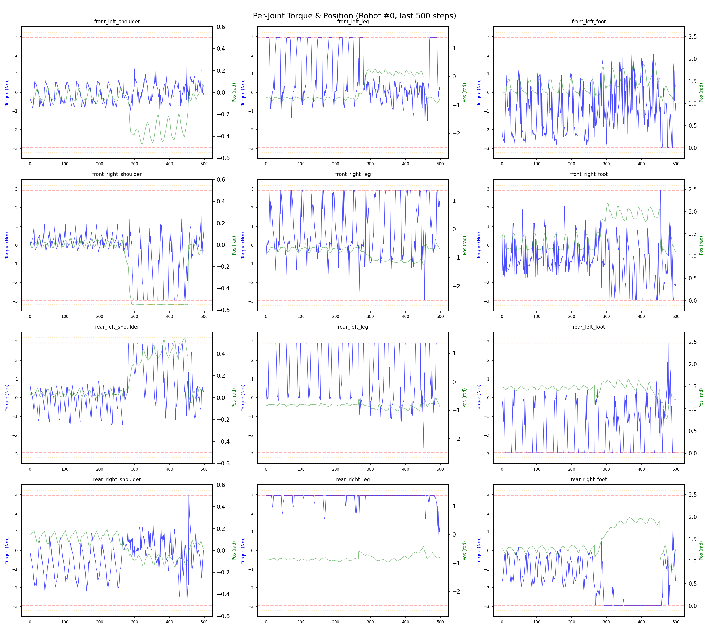
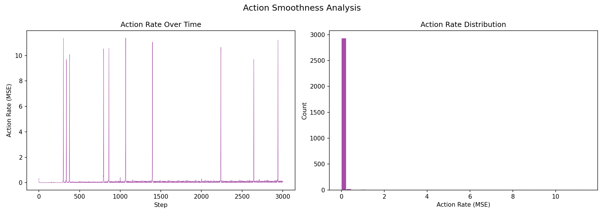

# 실험 014: spotmicro_v2_5_stand_still

- **날짜:** 2026-04-27 17:21
- **Task:** spotmicro_test
- **Run name:** `spotmicro_v2_5_stand_still`
- **판정:** ❌ FAIL (일부 기준 미달)

---

## 실험 목적

V2.5: 속도 범위를 0.0 포함하는 범위로 수정, 가만히 있는 동작 학습시키기

---

## 변경점 (이전 커밋 대비)

```diff
diff --git a/ai_training/rl/legged_gym/legged_gym/envs/spotmicro_test/spotmicro_test_config.py b/ai_training/rl/legged_gym/legged_gym/envs/spotmicro_test/spotmicro_test_config.py
index 71d059e..0eaf0b6 100644
--- a/ai_training/rl/legged_gym/legged_gym/envs/spotmicro_test/spotmicro_test_config.py
+++ b/ai_training/rl/legged_gym/legged_gym/envs/spotmicro_test/spotmicro_test_config.py
@@ -68,6 +68,7 @@ class SpotmicroTestCfg(LeggedRobotCfg):
             feet_clearance = 0.0
             trot_contact = 0.5
             tracking_ik = 1.0
+            stand_still = 1.0
         soft_dof_pos_limit = 0.9
         base_height_target = 0.206
         tracking_sigma = 0.1
@@ -98,7 +99,7 @@ class SpotmicroTestCfg(LeggedRobotCfg):
         resampling_time = 10.0
         heading_command = False
         class ranges:
-            lin_vel_x = [0.15, 0.4]
+            lin_vel_x = [0.0, 0.4]
             lin_vel_y = [0.0, 0.0]
             ang_vel_yaw = [-0.4, 0.4]
             heading = [-3.14, 3.14]
@@ -121,7 +122,7 @@ class SpotmicroTestCfgPPO(LeggedRobotCfgPPO):
         entropy_coef = 0.01
 
     class runner(LeggedRobotCfgPPO.runner):
-        run_name = 'spotmicro_v2_4_DR_servo_delay'
+        run_name = 'spotmicro_v2_5_stand_still'
         experiment_name = 'spotmicro_test'
         max_iterations = 1000
         save_interval = 100
```

**변경 요약:**
  + stand_still = 1.0
  - lin_vel_x = [0.15, 0.4]
  + lin_vel_x = [0.0, 0.4]
  - run_name = 'spotmicro_v2_4_DR_servo_delay'
  + run_name = 'spotmicro_v2_5_stand_still'

---

## 현재 Reward Scales

| Reward | Scale |
|--------|-------|
| action_rate | -0.05 |
| ang_vel_xy | -0.2 |
| collision | -1.0 |
| dof_acc | -2.5e-07 |
| dof_vel | -0.001 |
| lin_vel_z | -2.0 |
| orientation | -4.0 |
| stand_still | 1.0 |
| termination | -10.0 |
| torques | -0.001 |
| tracking_ang_vel | 0.9 |
| tracking_ik | 1.0 |
| tracking_lin_vel | 1.5 |
| trot_contact | 0.5 |

---

## 진단 결과 (Diagnostic)

### 핵심 지표

- ❌ Timeout: 5.7% (<60%, 미달)
- ❌ 속도오차 X: 0.1558 m/s (>0.12, 미달)
- ⚠️ 토크포화: 31.0% (10~40%)
- ✅ 자세: roll 3.8°, pitch 6.0° (안정)
- ❌ 조기종료: 90.7% (>20%)

### 상세 수치

| 지표 | 값 |
|------|-----|
| Timeout% | 5.718954248366013 |
| 조기종료% | 90.68627450980392 |
| 속도오차 X | 0.15575939416885376 m/s |
| 속도오차 Y | 0.05264030024409294 m/s |
| 각속도오차 | 0.4247061610221863 rad/s |
| 토크포화% | 31.00358842546343 |
| 평균 높이 | 0.20745891557409094 m |
| Roll (평균) | 3.764181137084961° |
| Pitch (평균) | 6.03154182434082° |
| Action Rate | 0.14210258424282074 |
| 평균 전력 | 16.574724197387695 W |
| CoT | 3.3875463676212028 |


## 학습 곡선 분석

| 지표 | 값 | 판정 |
|------|-----|------|
| 수렴 iter (90%) | 256 | 빠름 |
| 후반 안정성 (CV) | 0.236 | 불안정 |
| 정체 구간 | 없음 | |


## Per-leg 분석

### 발별 접촉/공중 비율

| 발 | 접촉% | 공중% |
|-----|-------|------|
| foot_0 | 45.7% | 54.3% |
| foot_1 | 49.8% | 50.2% |
| foot_2 | 75.2% | 24.8% |
| foot_3 | 78.3% | 21.7% |

### 관절별 토크 포화

| 관절 | 포화% | 최대토크 | 한계 | 상태 |
|------|------|---------|------|------|
| front_left_shoulder | 8.9% | 2.940 | 2.940 | ⚠️ |
| front_left_leg | 34.0% | 2.940 | 2.940 | ❌ |
| front_left_foot | 27.3% | 2.940 | 2.940 | ❌ |
| front_right_shoulder | 17.3% | 2.940 | 2.940 | ⚠️ |
| front_right_leg | 28.9% | 2.940 | 2.940 | ❌ |
| front_right_foot | 14.6% | 2.940 | 2.940 | ⚠️ |
| rear_left_shoulder | 13.5% | 2.940 | 2.940 | ⚠️ |
| rear_left_leg | 60.5% | 2.940 | 2.940 | ❌ |
| rear_left_foot | 49.9% | 2.940 | 2.940 | ❌ |
| rear_right_shoulder | 10.7% | 2.940 | 2.940 | ⚠️ |
| rear_right_leg | 81.2% | 2.940 | 2.940 | ❌ |
| rear_right_foot | 25.4% | 2.940 | 2.940 | ❌ |


## Gait 분석

| 지표 | 값 |
|------|-----|
| Gait 주파수 | 0.42 Hz |
| Gait 주기 | 30 steps |
| 대각 동기화율 | 70.0% |
| L/R 비대칭 | 0.0%p |
| 판정 | ✅ Trot 패턴 / ✅ 대칭 |


## 관절별 상세

| 관절 | 토크포화% | 사용범위% | 편향(rad) | 한계근접% | 상태 |
|------|----------|----------|----------|----------|------|
| front_left_shoulder | 8.9% | 85% | -0.083 | 2.4% | ✅ |
| front_left_leg | 34.0% | 64% | -0.978 | 0.2% | ⚠️ |
| front_left_foot | 27.3% | 83% | +1.010 | 3.7% | ⚠️ |
| front_right_shoulder | 17.3% | 101% | -0.003 | 19.2% | ⚠️ |
| front_right_leg | 28.9% | 29% | -1.053 | 0.0% | ⚠️ |
| front_right_foot | 14.6% | 83% | +1.218 | 0.2% | ⚠️ |
| rear_left_shoulder | 13.5% | 108% | -0.036 | 13.4% | ⚠️ |
| rear_left_leg | 60.5% | 47% | -1.128 | 0.0% | ⚠️ |
| rear_left_foot | 49.9% | 70% | +0.838 | 0.0% | ⚠️ |
| rear_right_shoulder | 10.7% | 76% | +0.061 | 1.1% | ✅ |
| rear_right_leg | 81.2% | 53% | -0.871 | 0.0% | ⚠️ |
| rear_right_foot | 25.4% | 63% | +1.200 | 0.0% | ⚠️ |


## 에너지 효율 상세

| 지표 | 값 |
|------|-----|
| 평균 전력 | 16.57 W |
| 피크 전력 | 44.77 W |
| 피크/평균 비율 | 2.7x |
| CoT | 3.39 |

### 관절별 전력 분배

| 관절 | 평균전력(W) | 비율% |
|------|-----------|-------|
| front_left_leg | 2.503 | 15.1% |
| rear_left_leg | 2.088 | 12.6% |
| front_left_foot | 1.870 | 11.3% |
| rear_right_leg | 1.664 | 10.0% |
| rear_right_foot | 1.537 | 9.3% |
| rear_left_foot | 1.456 | 8.8% |
| front_right_foot | 1.431 | 8.6% |
| front_right_leg | 1.292 | 7.8% |
| front_left_shoulder | 0.984 | 5.9% |
| rear_left_shoulder | 0.748 | 4.5% |
| rear_right_shoulder | 0.551 | 3.3% |
| front_right_shoulder | 0.451 | 2.7% |


## 이전 실험 대비 비교

| 지표 | 이전 (exp013) | 현재 (exp014) | 변화 |
|------|-------|-------|------|
| Timeout% | 100.0% | 5.7% | ⚠️ ↓ 94.2810% |
| 속도오차 X | 0.0610 | 0.1558 | ⚠️ ↑ 0.0948m/s |
| 토크포화 | 12.9% | 31.0% | ⚠️ ↑ 18.1410% |
| Roll | 1.3° | 3.8° | ⚠️ ↑ 2.5054° |
| Pitch | 1.0° | 6.0° | ⚠️ ↑ 5.0114° |
| 평균 전력 | 8.2616W | 16.5747W | ⚠️ ↑ 8.3131W |


## Tensorboard 학습 곡선 요약

| 스칼라 | 최종값 | 최대 | 최소 | 후반10% 평균 |
|--------|--------|------|------|-------------|
| rew_action_rate | -0.2217 | -0.0147 | -0.9018 | -0.2357 |
| rew_ang_vel_xy | -0.0902 | -0.0105 | -0.3001 | -0.0950 |
| rew_collision | 0.0000 | 0.0000 | -0.0014 | -0.0000 |
| rew_dof_acc | -0.0197 | -0.0012 | -0.0560 | -0.0205 |
| rew_dof_vel | -0.0188 | -0.0009 | -0.0472 | -0.0194 |
| rew_lin_vel_z | -0.0162 | -0.0006 | -0.0199 | -0.0157 |
| rew_orientation | -0.0313 | -0.0025 | -1.0030 | -0.0325 |
| rew_stand_still | 0.1539 | 0.6653 | 0.0000 | 0.1532 |
| rew_termination | -0.0043 | 0.0000 | -0.0100 | -0.0043 |
| rew_torques | -0.0328 | -0.0008 | -0.0667 | -0.0340 |
| rew_tracking_ang_vel | 0.1601 | 0.3163 | 0.0022 | 0.1633 |
| rew_tracking_ik | 0.0350 | 0.1991 | 0.0012 | 0.0317 |
| rew_tracking_lin_vel | 0.7737 | 1.3671 | 0.0085 | 0.7987 |
| rew_trot_contact | 0.1887 | 0.3660 | 0.0032 | 0.1843 |
| learning_rate | 0.0000 | 0.0100 | 0.0000 | 0.0000 |
| surrogate | -0.0005 | 0.0399 | -0.0092 | -0.0006 |
| value_function | 0.0450 | 3.8468 | 0.0075 | 0.0522 |
| collection time | 0.7888 | 0.9587 | 0.7268 | 0.8094 |
| learning_time | 0.2853 | 0.3376 | 0.2724 | 0.2897 |
| total_fps | 91524.0000 | 97648.0000 | 77980.0000 | 89568.6100 |
| mean_noise_std | 0.5800 | 1.0006 | 0.4217 | 0.5821 |
| mean_episode_length | 652.3400 | 1002.0000 | 13.1111 | 612.4650 |
| time | 652.3400 | 1002.0000 | 13.1111 | 612.4650 |
| mean_reward | 21.9112 | 39.7233 | -0.1597 | 18.3715 |
| time | 21.9112 | 39.7233 | -0.1597 | 18.3715 |

총 학습 iteration: 999


---

## 그래프

### Tensorboard 학습 곡선



### Diagnostic 결과





---

## 결론 및 다음 실험 방향

**자동 판정:** ❌ FAIL (일부 기준 미달)

일부 기준을 통과하지 못했습니다. 조정이 필요합니다.
  - ❌ Timeout: 5.7% (<60%, 미달)
  - ❌ 속도오차 X: 0.1558 m/s (>0.12, 미달)
  - ❌ 조기종료: 90.7% (>20%)

**제안:** Timeout이 낮습니다. 최근 추가한 페널티를 절반으로 줄여보세요.

> 💡 위 결론은 자동 생성되었습니다. 필요시 수정하세요.

---

## 메모

가만히 서있으려는 reward와 IK모방 reward가 충돌하는듯. IK를 속도 명령 있을때만 모방하거나 stand_still reward를 엄청 늘리는 거 시도해봐야 할듯?

