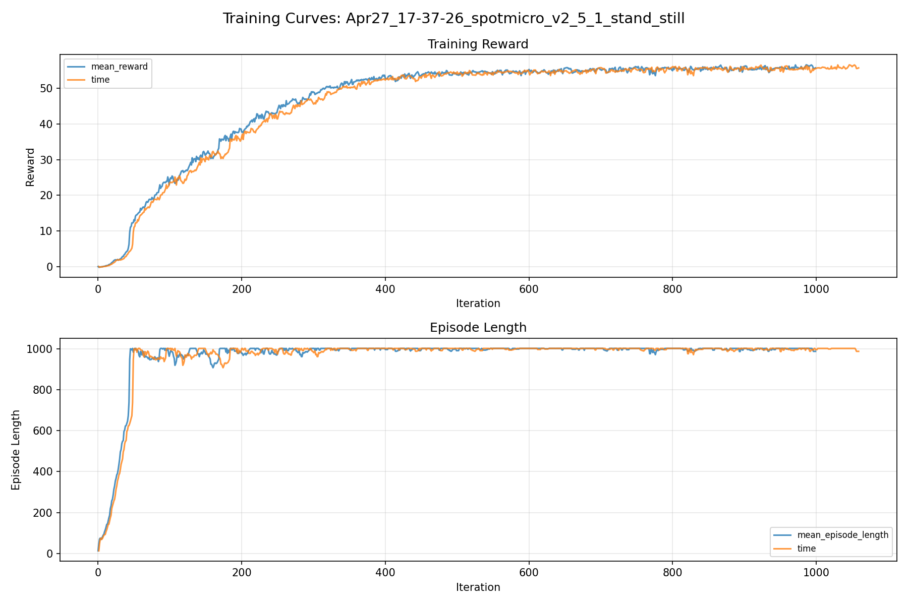
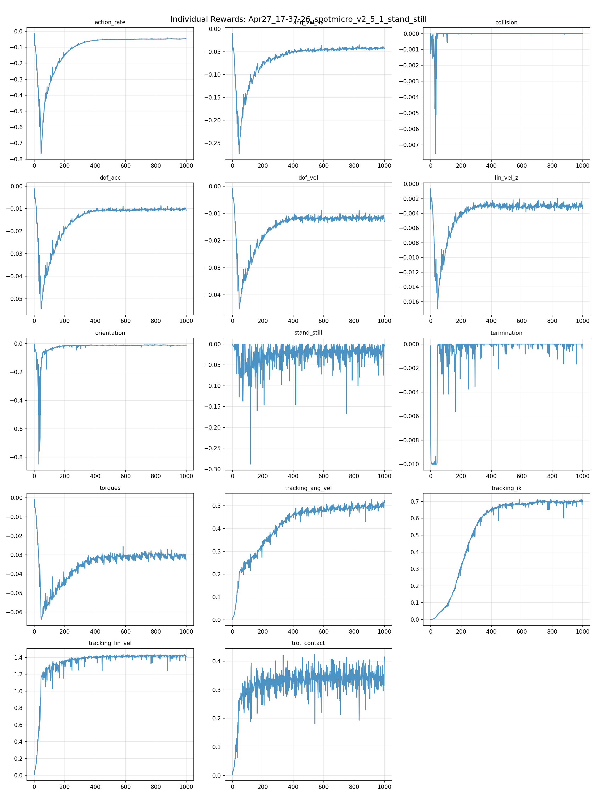
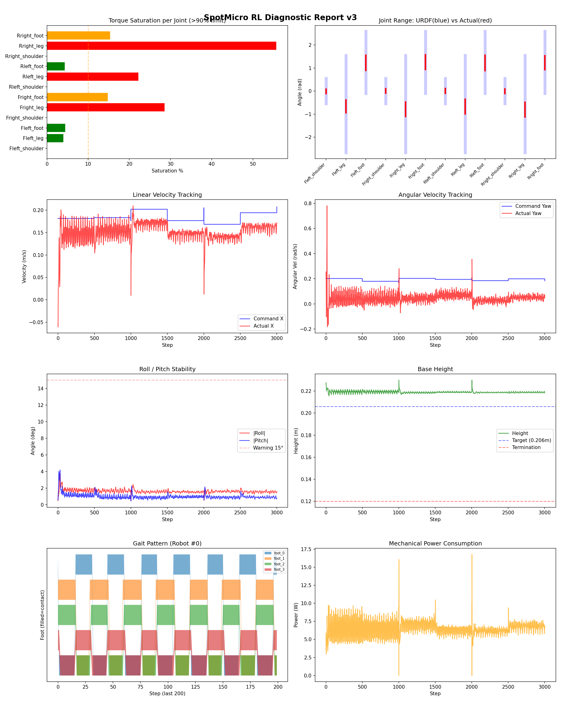
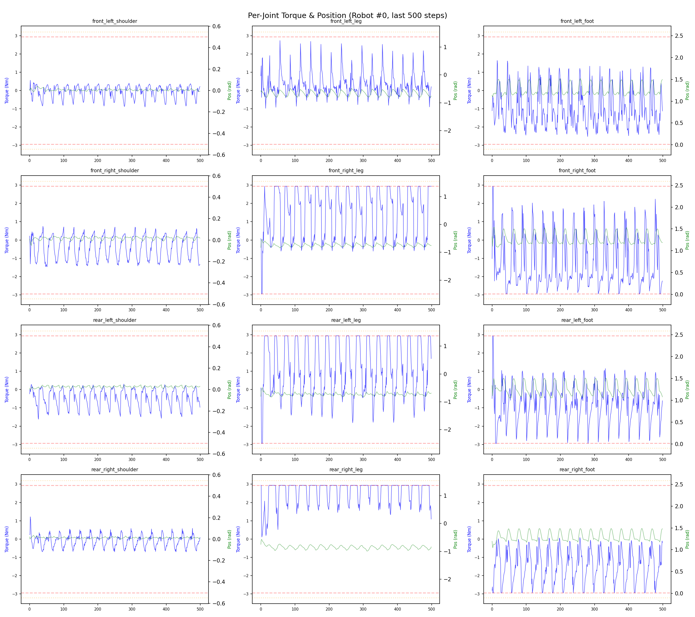
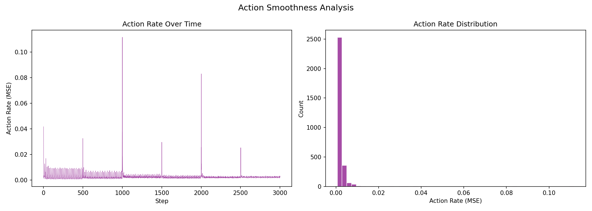

# 실험 015: spotmicro_v2_5_1_stand_still

- **날짜:** 2026-04-27 17:56
- **Task:** spotmicro_test
- **Run name:** `spotmicro_v2_5_1_stand_still`
- **판정:** ✅ PASS

---

## 실험 목적

V2.5.1: gait 진행을 속도 비례로 수정, 정지 명령 때 trot 궤적 생성 중지, stand_still 가중치 페널티로 적용

---

## 변경점 (이전 커밋 대비)

```diff
diff --git a/ai_training/rl/legged_gym/legged_gym/envs/spotmicro_test/spotmicro_test.py b/ai_training/rl/legged_gym/legged_gym/envs/spotmicro_test/spotmicro_test.py
index 6eac9ab..22866ff 100644
--- a/ai_training/rl/legged_gym/legged_gym/envs/spotmicro_test/spotmicro_test.py
+++ b/ai_training/rl/legged_gym/legged_gym/envs/spotmicro_test/spotmicro_test.py
@@ -89,8 +89,13 @@ class SpotmicroTest(LeggedRobot):
 
     def post_physics_step(self):
         self.gym.refresh_rigid_body_state_tensor(self.sim)
+
+            # 속도 명령 크기에 비례하여 gait phase 진행
+        cmd_norm = torch.norm(self.commands[:, :2], dim=1, keepdim=True)  # [num_envs, 1]
+        phase_scale = torch.clamp(cmd_norm / 0.1, 0.0, 1.0)  # 0.1 이하면 감속→정지
+
         dt_phase = self.dt / self.gait_period
-        self.gait_phase = (self.gait_phase + dt_phase) % 1.0
+        self.gait_phase = (self.gait_phase + dt_phase * phase_scale) % 1.0
         super().post_physics_step()
               
     def _reset_dofs(self, env_ids):
@@ -270,6 +275,12 @@ class SpotmicroTest(LeggedRobot):
         ref_dof_pos = torch.zeros((self.num_envs, 12), device=self.device)
         ref_dof_pos[:, 1::3] = theta_leg  
         ref_dof_pos[:, 2::3] = theta_foot 
+
+        # 정지 시 default pose로 블렌딩
+        cmd_norm = torch.norm(self.commands[:, :2], dim=1, keepdim=True)  # [num_envs, 1]
+        blend = torch.clamp(cmd_norm / 0.1, 0.0, 1.0)  # 0=정지→default, 1=이동→IK
+        ref_dof_pos = blend * ref_dof_pos + (1.0 - blend) * self.default_dof_pos
+    
         return ref_dof_pos
         
     def _compute_torques(self, actions):
diff --git a/ai_training/rl/legged_gym/legged_gym/envs/spotmicro_test/spotmicro_test_config.py b/ai_training/rl/legged_gym/legged_gym/envs/spotmicro_test/spotmicro_test_config.py
index 0eaf0b6..ca0a40c 100644
--- a/ai_training/rl/legged_gym/legged_gym/envs/spotmicro_test/spotmicro_test_config.py
+++ b/ai_training/rl/legged_gym/legged_gym/envs/spotmicro_test/spotmicro_test_config.py
@@ -68,7 +68,7 @@ class SpotmicroTestCfg(LeggedRobotCfg):
             feet_clearance = 0.0
             trot_contact = 0.5
             tracking_ik = 1.0
-            stand_still = 1.0
+            stand_still = -0.5
         soft_dof_pos_limit = 0.9
         base_height_target = 0.206
         tracking_sigma = 0.1
@@ -122,7 +122,7 @@ class SpotmicroTestCfgPPO(LeggedRobotCfgPPO):
         entropy_coef = 0.01
 
     class runner(LeggedRobotCfgPPO.runner):
-        run_name = 'spotmicro_v2_5_stand_still'
+        run_name = 'spotmicro_v2_5_1_stand_still'
         experiment_name = 'spotmicro_test'
         max_iterations = 1000
         save_interval = 100
```

**변경 요약:**
  + cmd_norm = torch.norm(self.commands[:, :2], dim=1, keepdim=True)  # [num_envs, 1]
  + phase_scale = torch.clamp(cmd_norm / 0.1, 0.0, 1.0)  # 0.1 이하면 감속→정지
  - self.gait_phase = (self.gait_phase + dt_phase) % 1.0
  + self.gait_phase = (self.gait_phase + dt_phase * phase_scale) % 1.0
  + cmd_norm = torch.norm(self.commands[:, :2], dim=1, keepdim=True)  # [num_envs, 1]
  + blend = torch.clamp(cmd_norm / 0.1, 0.0, 1.0)  # 0=정지→default, 1=이동→IK
  + ref_dof_pos = blend * ref_dof_pos + (1.0 - blend) * self.default_dof_pos
  - stand_still = 1.0
  + stand_still = -0.5
  - run_name = 'spotmicro_v2_5_stand_still'
  + run_name = 'spotmicro_v2_5_1_stand_still'

---

## 현재 Reward Scales

| Reward | Scale |
|--------|-------|
| action_rate | -0.05 |
| ang_vel_xy | -0.2 |
| collision | -1.0 |
| dof_acc | -2.5e-07 |
| dof_vel | -0.001 |
| lin_vel_z | -2.0 |
| orientation | -4.0 |
| stand_still | -0.5 |
| termination | -10.0 |
| torques | -0.001 |
| tracking_ang_vel | 0.9 |
| tracking_ik | 1.0 |
| tracking_lin_vel | 1.5 |
| trot_contact | 0.5 |

---

## 진단 결과 (Diagnostic)

### 핵심 지표

- ✅ Timeout: 100.0% (≥80%)
- ✅ 속도오차 X: 0.0419 m/s (<0.08)
- ⚠️ 토크포화: 12.4% (10~40%)
- ✅ 자세: roll 1.6°, pitch 1.0° (안정)
- ✅ 조기종료: 0.0% (<5%)

### 상세 수치

| 지표 | 값 |
|------|-----|
| Timeout% | 100.0 |
| 조기종료% | 0.0 |
| 속도오차 X | 0.04186474531888962 m/s |
| 속도오차 Y | 0.019235746935009956 m/s |
| 각속도오차 | 0.12703905999660492 rad/s |
| 토크포화% | 12.430885087135087 |
| 평균 높이 | 0.21907152077217243 m |
| Roll (평균) | 1.6149662733078003° |
| Pitch (평균) | 0.9796706438064575° |
| Action Rate | 0.0024995096027851105 |
| 평균 전력 | 6.497564792633057 W |
| CoT | 1.6881241458857976 |


## 학습 곡선 분석

| 지표 | 값 | 판정 |
|------|-----|------|
| 수렴 iter (90%) | 338 | 보통 |
| 후반 안정성 (CV) | 0.011 | 안정 |
| 정체 구간 | 있음 (iter 765, 49 iter) | |


## Per-leg 분석

### 발별 접촉/공중 비율

| 발 | 접촉% | 공중% |
|-----|-------|------|
| foot_0 | 60.3% | 39.7% |
| foot_1 | 67.2% | 32.8% |
| foot_2 | 63.6% | 36.4% |
| foot_3 | 59.8% | 40.2% |

### 관절별 토크 포화

| 관절 | 포화% | 최대토크 | 한계 | 상태 |
|------|------|---------|------|------|
| front_left_shoulder | 0.0% | 1.989 | 2.940 | ✅ |
| front_left_leg | 3.9% | 2.940 | 2.940 | ✅ |
| front_left_foot | 4.4% | 2.940 | 2.940 | ✅ |
| front_right_shoulder | 0.0% | 2.348 | 2.940 | ✅ |
| front_right_leg | 28.5% | 2.940 | 2.940 | ❌ |
| front_right_foot | 14.8% | 2.940 | 2.940 | ⚠️ |
| rear_left_shoulder | 0.0% | 2.297 | 2.940 | ✅ |
| rear_left_leg | 22.2% | 2.940 | 2.940 | ❌ |
| rear_left_foot | 4.3% | 2.940 | 2.940 | ✅ |
| rear_right_shoulder | 0.0% | 2.271 | 2.940 | ✅ |
| rear_right_leg | 55.7% | 2.940 | 2.940 | ❌ |
| rear_right_foot | 15.3% | 2.940 | 2.940 | ⚠️ |


## Gait 분석

| 지표 | 값 |
|------|-----|
| Gait 주파수 | 0.42 Hz |
| Gait 주기 | 30 steps |
| 대각 동기화율 | 94.8% |
| L/R 비대칭 | 0.0%p |
| 판정 | ✅ Trot 패턴 / ✅ 대칭 |


## 관절별 상세

| 관절 | 토크포화% | 사용범위% | 편향(rad) | 한계근접% | 상태 |
|------|----------|----------|----------|----------|------|
| front_left_shoulder | 0.0% | 17% | -0.009 | 0.0% | ✅ |
| front_left_leg | 3.9% | 13% | -0.662 | 0.0% | ⚠️ |
| front_left_foot | 4.4% | 25% | +1.228 | 0.0% | ⚠️ |
| front_right_shoulder | 0.0% | 17% | +0.009 | 0.0% | ✅ |
| front_right_leg | 28.5% | 15% | -0.788 | 0.0% | ⚠️ |
| front_right_foot | 14.8% | 24% | +1.258 | 0.0% | ⚠️ |
| rear_left_shoulder | 0.0% | 19% | +0.012 | 0.0% | ✅ |
| rear_left_leg | 22.2% | 15% | -0.675 | 0.0% | ⚠️ |
| rear_left_foot | 4.3% | 25% | +1.223 | 0.0% | ⚠️ |
| rear_right_shoulder | 0.0% | 18% | -0.004 | 0.0% | ✅ |
| rear_right_leg | 55.7% | 15% | -0.801 | 0.0% | ⚠️ |
| rear_right_foot | 15.3% | 22% | +1.235 | 0.0% | ⚠️ |


## 에너지 효율 상세

| 지표 | 값 |
|------|-----|
| 평균 전력 | 6.50 W |
| 피크 전력 | 16.77 W |
| 피크/평균 비율 | 2.6x |
| CoT | 1.69 |

### 관절별 전력 분배

| 관절 | 평균전력(W) | 비율% |
|------|-----------|-------|
| front_right_foot | 1.368 | 21.1% |
| rear_right_leg | 0.971 | 14.9% |
| front_left_foot | 0.909 | 14.0% |
| rear_right_foot | 0.798 | 12.3% |
| rear_left_leg | 0.654 | 10.1% |
| rear_left_foot | 0.552 | 8.5% |
| front_right_leg | 0.529 | 8.1% |
| front_left_leg | 0.479 | 7.4% |
| rear_left_shoulder | 0.093 | 1.4% |
| front_right_shoulder | 0.073 | 1.1% |
| rear_right_shoulder | 0.049 | 0.7% |
| front_left_shoulder | 0.022 | 0.3% |


## 이전 실험 대비 비교

| 지표 | 이전 (exp014) | 현재 (exp015) | 변화 |
|------|-------|-------|------|
| Timeout% | 5.7% | 100.0% | ✅ ↑ 94.2810% |
| 속도오차 X | 0.1558 | 0.0419 | ✅ ↓ 0.1139m/s |
| 토크포화 | 31.0% | 12.4% | ✅ ↓ 18.5727% |
| Roll | 3.8° | 1.6° | ✅ ↓ 2.1492° |
| Pitch | 6.0° | 1.0° | ✅ ↓ 5.0519° |
| 평균 전력 | 16.5747W | 6.4976W | ✅ ↓ 10.0772W |


## Tensorboard 학습 곡선 요약

| 스칼라 | 최종값 | 최대 | 최소 | 후반10% 평균 |
|--------|--------|------|------|-------------|
| rew_action_rate | -0.0477 | -0.0147 | -0.7660 | -0.0480 |
| rew_ang_vel_xy | -0.0434 | -0.0104 | -0.2737 | -0.0428 |
| rew_collision | 0.0000 | 0.0000 | -0.0076 | 0.0000 |
| rew_dof_acc | -0.0107 | -0.0012 | -0.0546 | -0.0103 |
| rew_dof_vel | -0.0130 | -0.0009 | -0.0452 | -0.0118 |
| rew_lin_vel_z | -0.0033 | -0.0007 | -0.0170 | -0.0030 |
| rew_orientation | -0.0112 | -0.0023 | -0.8495 | -0.0103 |
| rew_stand_still | -0.0046 | 0.0000 | -0.2884 | -0.0183 |
| rew_termination | 0.0000 | 0.0000 | -0.0100 | -0.0001 |
| rew_torques | -0.0327 | -0.0008 | -0.0638 | -0.0307 |
| rew_tracking_ang_vel | 0.5140 | 0.5284 | 0.0023 | 0.4995 |
| rew_tracking_ik | 0.6989 | 0.7126 | 0.0012 | 0.6988 |
| rew_tracking_lin_vel | 1.4119 | 1.4360 | 0.0088 | 1.4179 |
| rew_trot_contact | 0.4152 | 0.4238 | 0.0031 | 0.3428 |
| learning_rate | 0.0009 | 0.0076 | 0.0000 | 0.0007 |
| surrogate | -0.0036 | 0.0009 | -0.0103 | -0.0031 |
| value_function | 0.0102 | 0.1509 | 0.0024 | 0.0134 |
| collection time | 0.7325 | 0.9736 | 0.7084 | 0.7440 |
| learning_time | 0.2866 | 0.3427 | 0.2716 | 0.2853 |
| total_fps | 96461.0000 | 98951.0000 | 77569.0000 | 95527.6600 |
| mean_noise_std | 0.1856 | 1.0007 | 0.1777 | 0.1847 |
| mean_episode_length | 987.7100 | 1002.0000 | 13.1111 | 999.3741 |
| time | 987.7100 | 1002.0000 | 13.1111 | 999.3741 |
| mean_reward | 55.7424 | 56.5980 | -0.1759 | 55.7032 |
| time | 55.7424 | 56.5980 | -0.1759 | 55.7032 |

총 학습 iteration: 999


---

## 그래프

### Tensorboard 학습 곡선



### Diagnostic 결과





---

## 결론 및 다음 실험 방향

**자동 판정:** ✅ PASS

대부분 기준을 통과했으나 일부 항목이 보통 수준입니다.
  - ⚠️ 토크포화: 12.4% (10~40%)

> 💡 위 결론은 자동 생성되었습니다. 필요시 수정하세요.

---

## 메모

_(추가 메모가 있으면 여기에 작성)_

