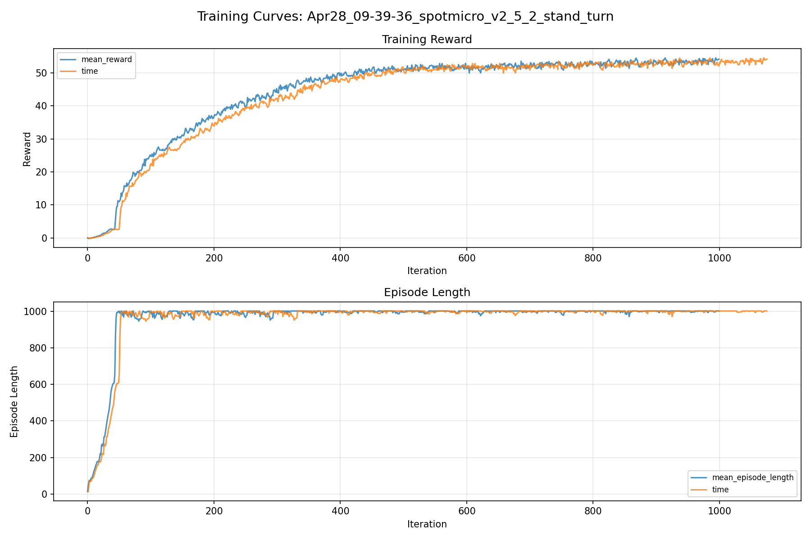
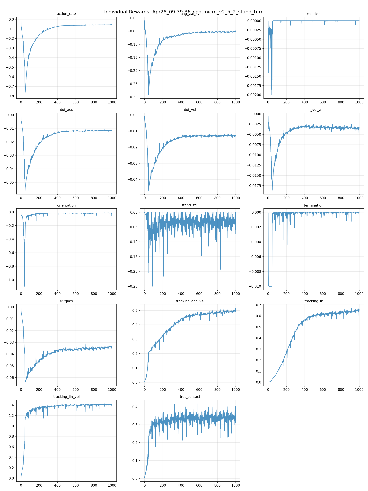
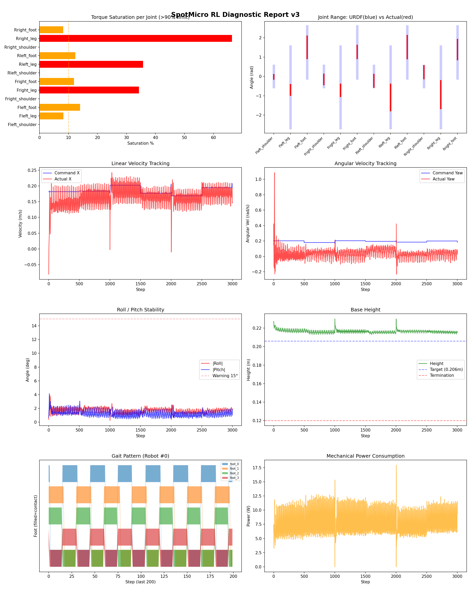
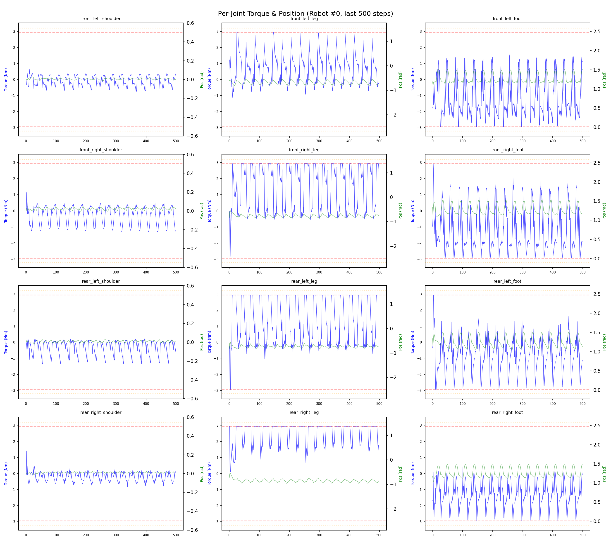
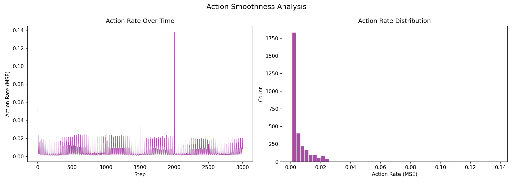

# 실험 016: spotmicro_v2_5_2_stand_turn

- **날짜:** 2026-04-28 09:59
- **Task:** spotmicro_test
- **Run name:** `spotmicro_v2_5_2_stand_turn`
- **판정:** ✅ PASS

---

## 실험 목적

V2.5.2: 제자리에서 회전할 수 있도록 설정

---

## 변경점 (이전 커밋 대비)

```diff
diff --git a/ai_training/rl/legged_gym/legged_gym/envs/spotmicro_test/spotmicro_test.py b/ai_training/rl/legged_gym/legged_gym/envs/spotmicro_test/spotmicro_test.py
index 22866ff..c35f8b2 100644
--- a/ai_training/rl/legged_gym/legged_gym/envs/spotmicro_test/spotmicro_test.py
+++ b/ai_training/rl/legged_gym/legged_gym/envs/spotmicro_test/spotmicro_test.py
@@ -90,8 +90,8 @@ class SpotmicroTest(LeggedRobot):
     def post_physics_step(self):
         self.gym.refresh_rigid_body_state_tensor(self.sim)
 
-            # 속도 명령 크기에 비례하여 gait phase 진행
-        cmd_norm = torch.norm(self.commands[:, :2], dim=1, keepdim=True)  # [num_envs, 1]
+        # 속도 명령 크기에 비례하여 gait phase 진행
+        cmd_norm = torch.norm(self.commands[:, :3], dim=1, keepdim=True)  # [num_envs, 1]
         phase_scale = torch.clamp(cmd_norm / 0.1, 0.0, 1.0)  # 0.1 이하면 감속→정지
 
         dt_phase = self.dt / self.gait_period
@@ -120,6 +120,7 @@ class SpotmicroTest(LeggedRobot):
                 delay_range[0], delay_range[1] + 1,
                 (len(env_ids),), device=self.device)
 
+    
     def _reset_root_states(self, env_ids):
         """base 속도를 0으로 리셋"""
         self.root_states[env_ids] = self.base_init_state
@@ -131,6 +132,7 @@ class SpotmicroTest(LeggedRobot):
             self.sim,
             gymtorch.unwrap_tensor(self.root_states),
             gymtorch.unwrap_tensor(env_ids_int32), len(env_ids_int32))
+    
 
     def check_termination(self):
         super().check_termination()
@@ -277,7 +279,7 @@ class SpotmicroTest(LeggedRobot):
         ref_dof_pos[:, 2::3] = theta_foot 
 
         # 정지 시 default pose로 블렌딩
-        cmd_norm = torch.norm(self.commands[:, :2], dim=1, keepdim=True)  # [num_envs, 1]
+        cmd_norm = torch.norm(self.commands[:, :3], dim=1, keepdim=True)  # [num_envs, 1]
         blend = torch.clamp(cmd_norm / 0.1, 0.0, 1.0)  # 0=정지→default, 1=이동→IK
         ref_dof_pos = blend * ref_dof_pos + (1.0 - blend) * self.default_dof_pos
     
diff --git a/ai_training/rl/legged_gym/legged_gym/envs/spotmicro_test/spotmicro_test_config.py b/ai_training/rl/legged_gym/legged_gym/envs/spotmicro_test/spotmicro_test_config.py
index ca0a40c..967fe09 100644
--- a/ai_training/rl/legged_gym/legged_gym/envs/spotmicro_test/spotmicro_test_config.py
+++ b/ai_training/rl/legged_gym/legged_gym/envs/spotmicro_test/spotmicro_test_config.py
@@ -122,7 +122,7 @@ class SpotmicroTestCfgPPO(LeggedRobotCfgPPO):
         entropy_coef = 0.01
 
     class runner(LeggedRobotCfgPPO.runner):
-        run_name = 'spotmicro_v2_5_1_stand_still'
+        run_name = 'spotmicro_v2_5_2_stand_turn'
         experiment_name = 'spotmicro_test'
         max_iterations = 1000
         save_interval = 100
```

**변경 요약:**
  - cmd_norm = torch.norm(self.commands[:, :2], dim=1, keepdim=True)  # [num_envs, 1]
  + cmd_norm = torch.norm(self.commands[:, :3], dim=1, keepdim=True)  # [num_envs, 1]
  - cmd_norm = torch.norm(self.commands[:, :2], dim=1, keepdim=True)  # [num_envs, 1]
  + cmd_norm = torch.norm(self.commands[:, :3], dim=1, keepdim=True)  # [num_envs, 1]
  - run_name = 'spotmicro_v2_5_1_stand_still'
  + run_name = 'spotmicro_v2_5_2_stand_turn'

---

## 현재 Reward Scales

| Reward | Scale |
|--------|-------|
| action_rate | -0.05 |
| ang_vel_xy | -0.2 |
| collision | -1.0 |
| dof_acc | -2.5e-07 |
| dof_vel | -0.001 |
| lin_vel_z | -2.0 |
| orientation | -4.0 |
| stand_still | -0.5 |
| termination | -10.0 |
| torques | -0.001 |
| tracking_ang_vel | 0.9 |
| tracking_ik | 1.0 |
| tracking_lin_vel | 1.5 |
| trot_contact | 0.5 |

---

## 진단 결과 (Diagnostic)

### 핵심 지표

- ✅ Timeout: 100.0% (≥80%)
- ✅ 속도오차 X: 0.0455 m/s (<0.08)
- ⚠️ 토크포화: 15.9% (10~40%)
- ✅ 자세: roll 1.7°, pitch 1.2° (안정)
- ✅ 조기종료: 0.0% (<5%)

### 상세 수치

| 지표 | 값 |
|------|-----|
| Timeout% | 100.0 |
| 조기종료% | 0.0 |
| 속도오차 X | 0.04548497125506401 m/s |
| 속도오차 Y | 0.025052888318896294 m/s |
| 각속도오차 | 0.11412515491247177 rad/s |
| 토크포화% | 15.933415542790543 |
| 평균 높이 | 0.2164964332476958 m |
| Roll (평균) | 1.6662615537643433° |
| Pitch (평균) | 1.1945264339447021° |
| Action Rate | 0.005489966832101345 |
| 평균 전력 | 7.8420491218566895 W |
| CoT | 1.9060058132771582 |


## 학습 곡선 분석

| 지표 | 값 | 판정 |
|------|-----|------|
| 수렴 iter (90%) | 379 | 보통 |
| 후반 안정성 (CV) | 0.017 | 안정 |
| 정체 구간 | 없음 | |


## Per-leg 분석

### 발별 접촉/공중 비율

| 발 | 접촉% | 공중% |
|-----|-------|------|
| foot_0 | 54.3% | 45.7% |
| foot_1 | 60.8% | 39.2% |
| foot_2 | 58.7% | 41.3% |
| foot_3 | 49.8% | 50.2% |

### 관절별 토크 포화

| 관절 | 포화% | 최대토크 | 한계 | 상태 |
|------|------|---------|------|------|
| front_left_shoulder | 0.0% | 1.926 | 2.940 | ✅ |
| front_left_leg | 8.2% | 2.940 | 2.940 | ⚠️ |
| front_left_foot | 14.0% | 2.940 | 2.940 | ⚠️ |
| front_right_shoulder | 0.0% | 2.364 | 2.940 | ✅ |
| front_right_leg | 34.3% | 2.940 | 2.940 | ❌ |
| front_right_foot | 11.9% | 2.940 | 2.940 | ⚠️ |
| rear_left_shoulder | 0.1% | 2.940 | 2.940 | ✅ |
| rear_left_leg | 35.7% | 2.940 | 2.940 | ❌ |
| rear_left_foot | 12.4% | 2.940 | 2.940 | ⚠️ |
| rear_right_shoulder | 0.0% | 2.940 | 2.940 | ✅ |
| rear_right_leg | 66.4% | 2.940 | 2.940 | ❌ |
| rear_right_foot | 8.1% | 2.940 | 2.940 | ⚠️ |


## Gait 분석

| 지표 | 값 |
|------|-----|
| Gait 주파수 | 0.42 Hz |
| Gait 주기 | 30 steps |
| 대각 동기화율 | 94.3% |
| L/R 비대칭 | 0.0%p |
| 판정 | ✅ Trot 패턴 / ✅ 대칭 |


## 관절별 상세

| 관절 | 토크포화% | 사용범위% | 편향(rad) | 한계근접% | 상태 |
|------|----------|----------|----------|----------|------|
| front_left_shoulder | 0.0% | 21% | -0.021 | 0.0% | ✅ |
| front_left_leg | 8.2% | 13% | -0.695 | 0.0% | ⚠️ |
| front_left_foot | 14.0% | 43% | +1.511 | 0.0% | ⚠️ |
| front_right_shoulder | 0.0% | 49% | -0.153 | 0.0% | ⚠️ |
| front_right_leg | 34.3% | 15% | -0.717 | 0.0% | ⚠️ |
| front_right_foot | 11.9% | 25% | +1.267 | 0.0% | ⚠️ |
| rear_left_shoulder | 0.1% | 60% | -0.222 | 0.1% | ⚠️ |
| rear_left_leg | 35.7% | 32% | -1.089 | 0.0% | ⚠️ |
| rear_left_foot | 12.4% | 45% | +1.517 | 0.0% | ⚠️ |
| rear_right_shoulder | 0.0% | 61% | +0.214 | 0.1% | ⚠️ |
| rear_right_leg | 66.4% | 34% | -0.942 | 0.0% | ⚠️ |
| rear_right_foot | 8.1% | 39% | +1.390 | 0.0% | ⚠️ |


## 에너지 효율 상세

| 지표 | 값 |
|------|-----|
| 평균 전력 | 7.84 W |
| 피크 전력 | 17.95 W |
| 피크/평균 비율 | 2.3x |
| CoT | 1.91 |

### 관절별 전력 분배

| 관절 | 평균전력(W) | 비율% |
|------|-----------|-------|
| front_right_foot | 1.434 | 18.3% |
| front_left_foot | 1.390 | 17.7% |
| rear_right_leg | 1.341 | 17.1% |
| rear_right_foot | 0.777 | 9.9% |
| rear_left_foot | 0.736 | 9.4% |
| rear_left_leg | 0.722 | 9.2% |
| front_right_leg | 0.606 | 7.7% |
| front_left_leg | 0.567 | 7.2% |
| rear_right_shoulder | 0.086 | 1.1% |
| rear_left_shoulder | 0.086 | 1.1% |
| front_right_shoulder | 0.062 | 0.8% |
| front_left_shoulder | 0.036 | 0.5% |


## 이전 실험 대비 비교

| 지표 | 이전 (exp015) | 현재 (exp016) | 변화 |
|------|-------|-------|------|
| Timeout% | 100.0% | 100.0% | → 유지 |
| 속도오차 X | 0.0419 | 0.0455 | ⚠️ ↑ 0.0036m/s |
| 토크포화 | 12.4% | 15.9% | ⚠️ ↑ 3.5025% |
| Roll | 1.6° | 1.7° | ⚠️ ↑ 0.0513° |
| Pitch | 1.0° | 1.2° | ⚠️ ↑ 0.2149° |
| 평균 전력 | 6.4976W | 7.8420W | ⚠️ ↑ 1.3445W |


## Tensorboard 학습 곡선 요약

| 스칼라 | 최종값 | 최대 | 최소 | 후반10% 평균 |
|--------|--------|------|------|-------------|
| rew_action_rate | -0.0555 | -0.0147 | -0.7879 | -0.0576 |
| rew_ang_vel_xy | -0.0489 | -0.0105 | -0.2919 | -0.0524 |
| rew_collision | 0.0000 | 0.0000 | -0.0020 | -0.0000 |
| rew_dof_acc | -0.0111 | -0.0012 | -0.0561 | -0.0115 |
| rew_dof_vel | -0.0124 | -0.0009 | -0.0469 | -0.0128 |
| rew_lin_vel_z | -0.0033 | -0.0006 | -0.0187 | -0.0035 |
| rew_orientation | -0.0126 | -0.0025 | -1.0958 | -0.0139 |
| rew_stand_still | -0.0597 | 0.0000 | -0.2504 | -0.0329 |
| rew_termination | 0.0000 | 0.0000 | -0.0100 | -0.0000 |
| rew_torques | -0.0348 | -0.0008 | -0.0638 | -0.0343 |
| rew_tracking_ang_vel | 0.4994 | 0.5169 | 0.0022 | 0.4935 |
| rew_tracking_ik | 0.6575 | 0.6718 | 0.0012 | 0.6438 |
| rew_tracking_lin_vel | 1.4108 | 1.4254 | 0.0084 | 1.4096 |
| rew_trot_contact | 0.3106 | 0.4179 | 0.0032 | 0.3378 |
| learning_rate | 0.0009 | 0.0100 | 0.0000 | 0.0007 |
| surrogate | -0.0045 | 0.0055 | -0.0103 | -0.0037 |
| value_function | 0.0120 | 0.4693 | 0.0020 | 0.0140 |
| collection time | 0.7780 | 1.0621 | 0.7254 | 0.7714 |
| learning_time | 0.2842 | 0.3861 | 0.2694 | 0.2864 |
| total_fps | 92548.0000 | 96968.0000 | 72285.0000 | 92947.1600 |
| mean_noise_std | 0.1947 | 1.0012 | 0.1912 | 0.1982 |
| mean_episode_length | 1002.0000 | 1002.0000 | 13.1111 | 1000.8794 |
| time | 1002.0000 | 1002.0000 | 13.1111 | 1000.8794 |
| mean_reward | 54.1324 | 54.5166 | -0.1773 | 53.3477 |
| time | 54.1324 | 54.5166 | -0.1773 | 53.3477 |

총 학습 iteration: 999


---

## 그래프

### Tensorboard 학습 곡선



### Diagnostic 결과





---

## 결론 및 다음 실험 방향

**자동 판정:** ✅ PASS

대부분 기준을 통과했으나 일부 항목이 보통 수준입니다.
  - ⚠️ 토크포화: 15.9% (10~40%)

> 💡 위 결론은 자동 생성되었습니다. 필요시 수정하세요.

---

## 메모

육안 상 제자리 회전 함. 몇몇개 안되는게 보이는데 아마 학습 더 돌리면 될듯

