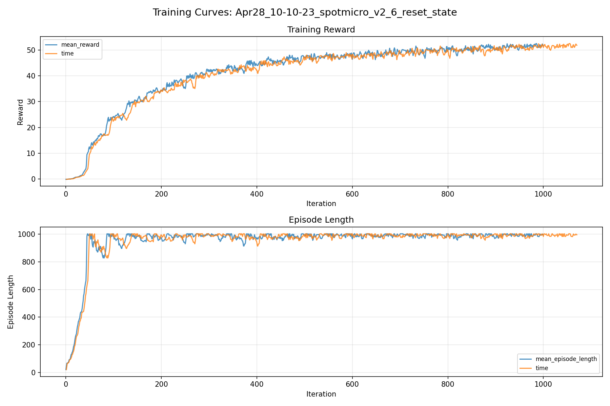
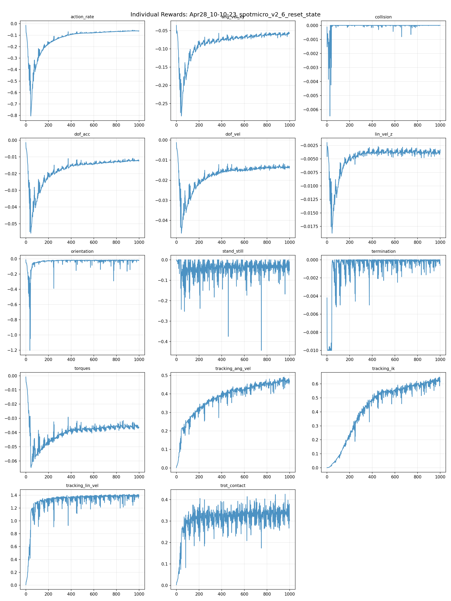
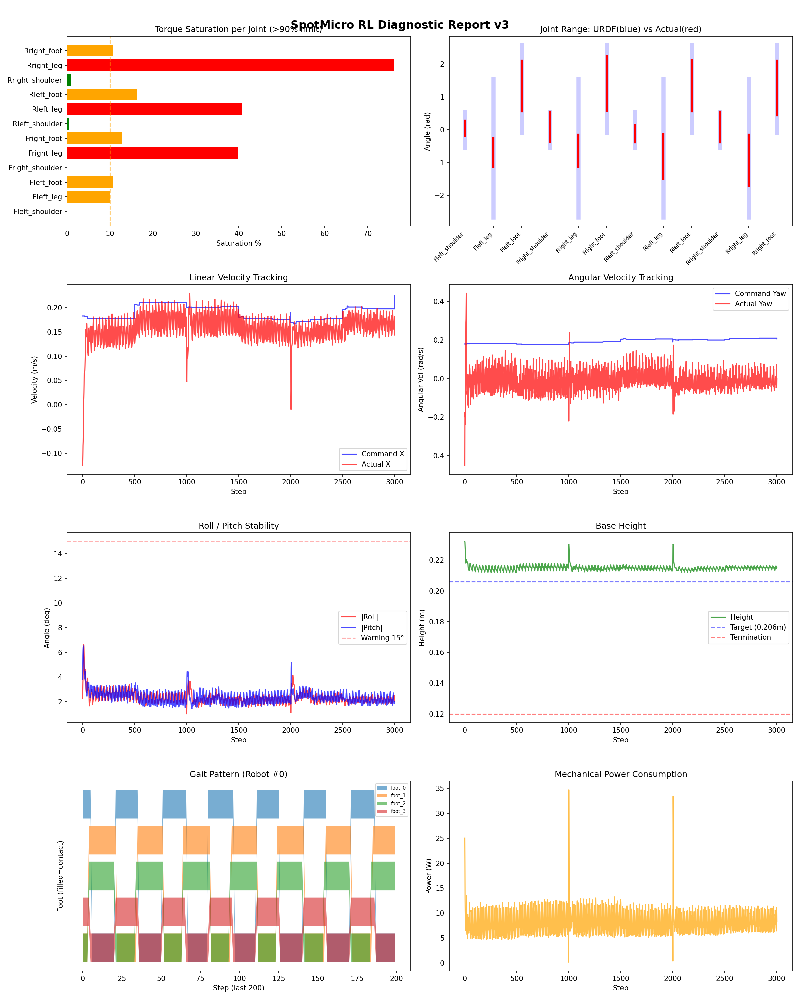
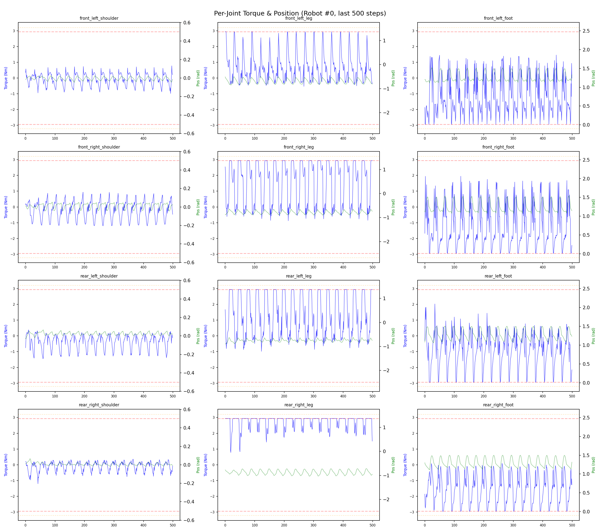
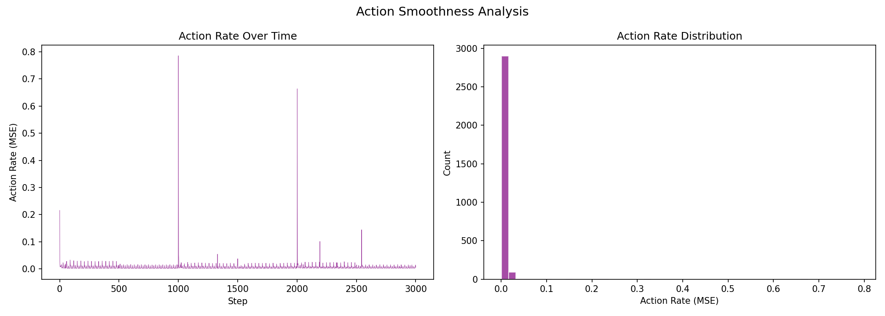

# 실험 017: spotmicro_v2_6_reset_state

- **날짜:** 2026-04-28 10:30
- **Task:** spotmicro_test
- **Run name:** `spotmicro_v2_6_reset_state`
- **판정:** ✅ PASS

---

## 실험 목적

V2.6: 리셋 상태 랜덤화

---

## 변경점 (이전 커밋 대비)

```diff
diff --git a/ai_training/rl/legged_gym/legged_gym/envs/spotmicro_test/spotmicro_test.py b/ai_training/rl/legged_gym/legged_gym/envs/spotmicro_test/spotmicro_test.py
index c35f8b2..6883c23 100644
--- a/ai_training/rl/legged_gym/legged_gym/envs/spotmicro_test/spotmicro_test.py
+++ b/ai_training/rl/legged_gym/legged_gym/envs/spotmicro_test/spotmicro_test.py
@@ -99,8 +99,8 @@ class SpotmicroTest(LeggedRobot):
         super().post_physics_step()
               
     def _reset_dofs(self, env_ids):
-        """관절을 정확히 default 위치로 리셋"""
-        self.dof_pos[env_ids] = self.default_dof_pos
+        self.dof_pos[env_ids] = self.default_dof_pos * torch_rand_float(
+            0.5, 1.5, (len(env_ids), self.num_dof), device=self.device)
         self.dof_vel[env_ids] = 0.
 
         env_ids_int32 = env_ids.to(dtype=torch.int32)
@@ -125,7 +125,8 @@ class SpotmicroTest(LeggedRobot):
         """base 속도를 0으로 리셋"""
         self.root_states[env_ids] = self.base_init_state
         self.root_states[env_ids, :3] += self.env_origins[env_ids]
-        self.root_states[env_ids, 7:13] = 0.
+        self.root_states[env_ids, 7:13] = torch_rand_float(
+            -0.3, 0.3, (len(env_ids), 6), device=self.device)
 
         env_ids_int32 = env_ids.to(dtype=torch.int32)
         self.gym.set_actor_root_state_tensor_indexed(
diff --git a/ai_training/rl/legged_gym/legged_gym/envs/spotmicro_test/spotmicro_test_config.py b/ai_training/rl/legged_gym/legged_gym/envs/spotmicro_test/spotmicro_test_config.py
index 967fe09..a8085dd 100644
--- a/ai_training/rl/legged_gym/legged_gym/envs/spotmicro_test/spotmicro_test_config.py
+++ b/ai_training/rl/legged_gym/legged_gym/envs/spotmicro_test/spotmicro_test_config.py
@@ -122,7 +122,7 @@ class SpotmicroTestCfgPPO(LeggedRobotCfgPPO):
         entropy_coef = 0.01
 
     class runner(LeggedRobotCfgPPO.runner):
-        run_name = 'spotmicro_v2_5_2_stand_turn'
+        run_name = 'spotmicro_v2_6_reset_state'
         experiment_name = 'spotmicro_test'
         max_iterations = 1000
         save_interval = 100
```

**변경 요약:**
  - """관절을 정확히 default 위치로 리셋"""
  - self.dof_pos[env_ids] = self.default_dof_pos
  + self.dof_pos[env_ids] = self.default_dof_pos * torch_rand_float(
  + 0.5, 1.5, (len(env_ids), self.num_dof), device=self.device)
  - self.root_states[env_ids, 7:13] = 0.
  + self.root_states[env_ids, 7:13] = torch_rand_float(
  + -0.3, 0.3, (len(env_ids), 6), device=self.device)
  - run_name = 'spotmicro_v2_5_2_stand_turn'
  + run_name = 'spotmicro_v2_6_reset_state'

---

## 현재 Reward Scales

| Reward | Scale |
|--------|-------|
| action_rate | -0.05 |
| ang_vel_xy | -0.2 |
| collision | -1.0 |
| dof_acc | -2.5e-07 |
| dof_vel | -0.001 |
| lin_vel_z | -2.0 |
| orientation | -4.0 |
| stand_still | -0.5 |
| termination | -10.0 |
| torques | -0.001 |
| tracking_ang_vel | 0.9 |
| tracking_ik | 1.0 |
| tracking_lin_vel | 1.5 |
| trot_contact | 0.5 |

---

## 진단 결과 (Diagnostic)

### 핵심 지표

- ✅ Timeout: 96.2% (≥80%)
- ✅ 속도오차 X: 0.0525 m/s (<0.08)
- ⚠️ 토크포화: 18.2% (10~40%)
- ✅ 자세: roll 2.3°, pitch 2.4° (안정)
- ✅ 조기종료: 0.8% (<5%)

### 상세 수치

| 지표 | 값 |
|------|-----|
| Timeout% | 96.2406015037594 |
| 조기종료% | 0.7518796992481203 |
| 속도오차 X | 0.05252287536859512 m/s |
| 속도오차 Y | 0.029545573517680168 m/s |
| 각속도오차 | 0.12873201072216034 rad/s |
| 토크포화% | 18.2205815018315 |
| 평균 높이 | 0.215013392465614 m |
| Roll (평균) | 2.334960460662842° |
| Pitch (평균) | 2.356818437576294° |
| Action Rate | 0.006066011730581522 |
| 평균 전력 | 7.9653096199035645 W |
| CoT | 2.0034543288420643 |


## 학습 곡선 분석

| 지표 | 값 | 판정 |
|------|-----|------|
| 수렴 iter (90%) | 424 | 보통 |
| 후반 안정성 (CV) | 0.032 | 안정 |
| 정체 구간 | 있음 (iter 949, 49 iter) | |


## Per-leg 분석

### 발별 접촉/공중 비율

| 발 | 접촉% | 공중% |
|-----|-------|------|
| foot_0 | 52.0% | 48.0% |
| foot_1 | 61.2% | 38.8% |
| foot_2 | 60.0% | 40.0% |
| foot_3 | 53.4% | 46.6% |

### 관절별 토크 포화

| 관절 | 포화% | 최대토크 | 한계 | 상태 |
|------|------|---------|------|------|
| front_left_shoulder | 0.0% | 2.940 | 2.940 | ✅ |
| front_left_leg | 9.9% | 2.940 | 2.940 | ⚠️ |
| front_left_foot | 10.8% | 2.940 | 2.940 | ⚠️ |
| front_right_shoulder | 0.0% | 2.940 | 2.940 | ✅ |
| front_right_leg | 39.8% | 2.940 | 2.940 | ❌ |
| front_right_foot | 12.8% | 2.940 | 2.940 | ⚠️ |
| rear_left_shoulder | 0.4% | 2.940 | 2.940 | ✅ |
| rear_left_leg | 40.7% | 2.940 | 2.940 | ❌ |
| rear_left_foot | 16.3% | 2.940 | 2.940 | ⚠️ |
| rear_right_shoulder | 1.0% | 2.940 | 2.940 | ✅ |
| rear_right_leg | 76.2% | 2.940 | 2.940 | ❌ |
| rear_right_foot | 10.8% | 2.940 | 2.940 | ⚠️ |


## Gait 분석

| 지표 | 값 |
|------|-----|
| Gait 주파수 | 0.42 Hz |
| Gait 주기 | 30 steps |
| 대각 동기화율 | 89.5% |
| L/R 비대칭 | 0.0%p |
| 판정 | ✅ Trot 패턴 / ✅ 대칭 |


## 관절별 상세

| 관절 | 토크포화% | 사용범위% | 편향(rad) | 한계근접% | 상태 |
|------|----------|----------|----------|----------|------|
| front_left_shoulder | 0.0% | 41% | +0.047 | 0.0% | ✅ |
| front_left_leg | 9.9% | 21% | -0.699 | 0.0% | ⚠️ |
| front_left_foot | 10.8% | 57% | +1.331 | 0.0% | ⚠️ |
| front_right_shoulder | 0.0% | 83% | +0.090 | 0.0% | ✅ |
| front_right_leg | 39.8% | 23% | -0.634 | 0.0% | ⚠️ |
| front_right_foot | 12.8% | 63% | +1.412 | 0.0% | ⚠️ |
| rear_left_shoulder | 0.4% | 47% | -0.124 | 0.0% | ⚠️ |
| rear_left_leg | 40.7% | 32% | -0.816 | 0.0% | ⚠️ |
| rear_left_foot | 16.3% | 58% | +1.345 | 0.0% | ⚠️ |
| rear_right_shoulder | 1.0% | 85% | +0.085 | 0.6% | ✅ |
| rear_right_leg | 76.2% | 37% | -0.925 | 0.0% | ⚠️ |
| rear_right_foot | 10.8% | 62% | +1.270 | 0.0% | ⚠️ |


## 에너지 효율 상세

| 지표 | 값 |
|------|-----|
| 평균 전력 | 7.97 W |
| 피크 전력 | 34.72 W |
| 피크/평균 비율 | 4.4x |
| CoT | 2.00 |

### 관절별 전력 분배

| 관절 | 평균전력(W) | 비율% |
|------|-----------|-------|
| front_right_foot | 1.402 | 17.6% |
| front_left_foot | 1.328 | 16.7% |
| rear_right_leg | 1.211 | 15.2% |
| rear_left_foot | 0.851 | 10.7% |
| rear_right_foot | 0.816 | 10.2% |
| rear_left_leg | 0.772 | 9.7% |
| front_right_leg | 0.670 | 8.4% |
| front_left_leg | 0.547 | 6.9% |
| rear_right_shoulder | 0.132 | 1.7% |
| rear_left_shoulder | 0.103 | 1.3% |
| front_right_shoulder | 0.097 | 1.2% |
| front_left_shoulder | 0.036 | 0.5% |


## 이전 실험 대비 비교

| 지표 | 이전 (exp016) | 현재 (exp017) | 변화 |
|------|-------|-------|------|
| Timeout% | 100.0% | 96.2% | ⚠️ ↓ 3.7594% |
| 속도오차 X | 0.0455 | 0.0525 | ⚠️ ↑ 0.0070m/s |
| 토크포화 | 15.9% | 18.2% | ⚠️ ↑ 2.2872% |
| Roll | 1.7° | 2.3° | ⚠️ ↑ 0.6687° |
| Pitch | 1.2° | 2.4° | ⚠️ ↑ 1.1623° |
| 평균 전력 | 7.8420W | 7.9653W | ⚠️ ↑ 0.1233W |


## Tensorboard 학습 곡선 요약

| 스칼라 | 최종값 | 최대 | 최소 | 후반10% 평균 |
|--------|--------|------|------|-------------|
| rew_action_rate | -0.0626 | -0.0145 | -0.8051 | -0.0627 |
| rew_ang_vel_xy | -0.0568 | -0.0355 | -0.2845 | -0.0595 |
| rew_collision | 0.0000 | 0.0000 | -0.0065 | -0.0000 |
| rew_dof_acc | -0.0121 | -0.0014 | -0.0557 | -0.0121 |
| rew_dof_vel | -0.0132 | -0.0012 | -0.0464 | -0.0134 |
| rew_lin_vel_z | -0.0033 | -0.0020 | -0.0188 | -0.0038 |
| rew_orientation | -0.0202 | -0.0115 | -1.2043 | -0.0208 |
| rew_stand_still | -0.0506 | 0.0000 | -0.4433 | -0.0364 |
| rew_termination | -0.0006 | 0.0000 | -0.0100 | -0.0002 |
| rew_torques | -0.0363 | -0.0009 | -0.0647 | -0.0359 |
| rew_tracking_ang_vel | 0.4684 | 0.4918 | 0.0017 | 0.4700 |
| rew_tracking_ik | 0.6184 | 0.6491 | 0.0011 | 0.6178 |
| rew_tracking_lin_vel | 1.3792 | 1.4152 | 0.0055 | 1.3866 |
| rew_trot_contact | 0.3077 | 0.4254 | 0.0028 | 0.3312 |
| learning_rate | 0.0009 | 0.0100 | 0.0000 | 0.0007 |
| surrogate | -0.0039 | 0.0057 | -0.0098 | -0.0030 |
| value_function | 0.0114 | 0.0920 | 0.0021 | 0.0167 |
| collection time | 0.8315 | 1.0321 | 0.7082 | 0.7739 |
| learning_time | 0.2925 | 0.3470 | 0.2707 | 0.2870 |
| total_fps | 87462.0000 | 98943.0000 | 74300.0000 | 92701.3800 |
| mean_noise_std | 0.2130 | 1.0014 | 0.2052 | 0.2111 |
| mean_episode_length | 995.0200 | 1002.0000 | 21.0700 | 992.0903 |
| time | 995.0200 | 1002.0000 | 21.0700 | 992.0903 |
| mean_reward | 51.8800 | 52.5852 | -0.1581 | 51.3906 |
| time | 51.8800 | 52.5852 | -0.1581 | 51.3906 |

총 학습 iteration: 999


---

## 그래프

### Tensorboard 학습 곡선



### Diagnostic 결과





---

## 결론 및 다음 실험 방향

**자동 판정:** ✅ PASS

대부분 기준을 통과했으나 일부 항목이 보통 수준입니다.
  - ⚠️ 토크포화: 18.2% (10~40%)

> 💡 위 결론은 자동 생성되었습니다. 필요시 수정하세요.

---

## 메모

_(추가 메모가 있으면 여기에 작성)_

