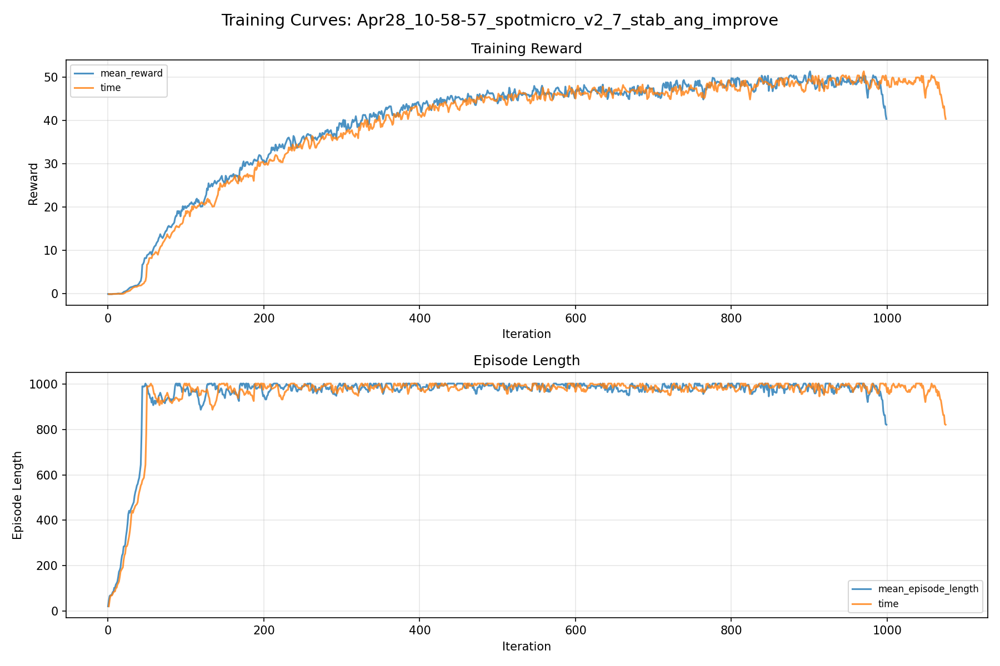
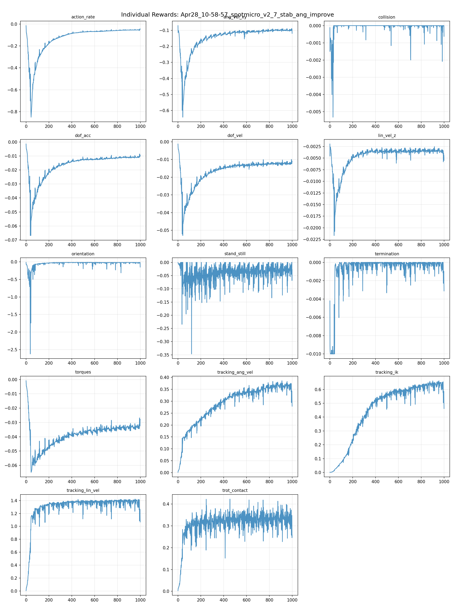
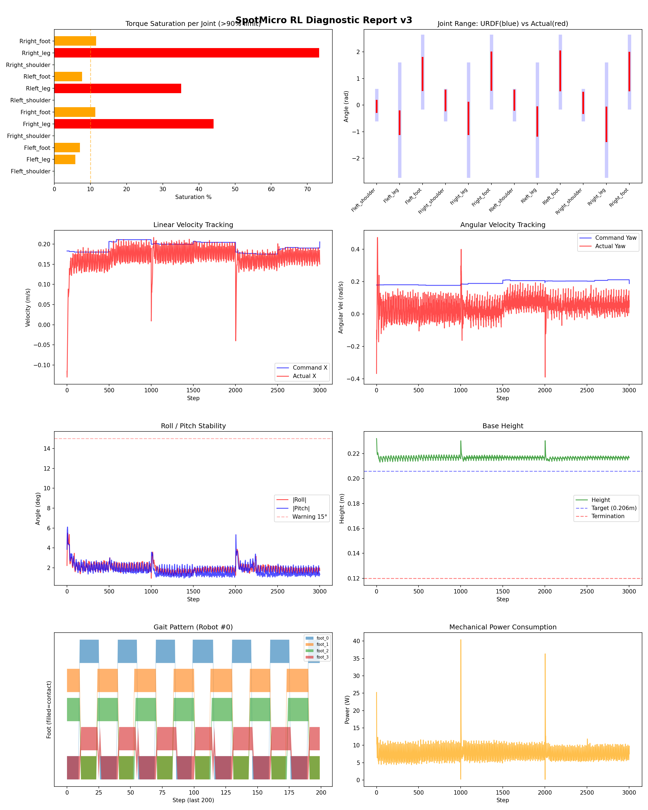
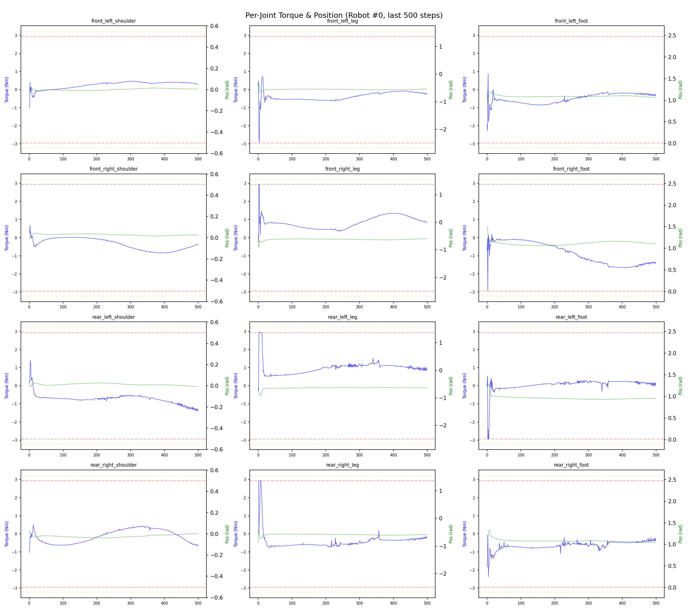
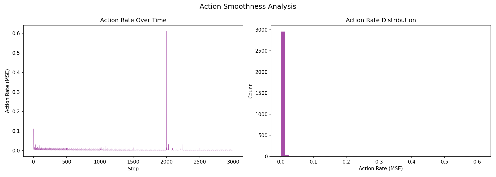

# 실험 018: spotmicro_v2_7_stab_ang_improve

- **날짜:** 2026-04-28 11:18
- **Task:** spotmicro_test
- **Run name:** `spotmicro_v2_7_stab_ang_improve`
- **판정:** ✅ PASS

---

## 실험 목적

V2.7: 나빠진 안정성, 각속도 오차 성능 향상

---

## 변경점 (이전 커밋 대비)

```diff
diff --git a/ai_training/rl/legged_gym/legged_gym/envs/spotmicro_test/spotmicro_test.py b/ai_training/rl/legged_gym/legged_gym/envs/spotmicro_test/spotmicro_test.py
index 6883c23..e17ee6e 100644
--- a/ai_training/rl/legged_gym/legged_gym/envs/spotmicro_test/spotmicro_test.py
+++ b/ai_training/rl/legged_gym/legged_gym/envs/spotmicro_test/spotmicro_test.py
@@ -296,6 +296,12 @@ class SpotmicroTest(LeggedRobot):
         error = torch.sum(torch.square(self.actions), dim=1)
         sigma = 2.0 
         return torch.exp(-error / sigma)
+        
+    def _reward_tracking_ang_vel(self):
+        ang_vel_error = torch.square(
+            self.commands[:, 2] - self.base_ang_vel[:, 2])
+        return torch.exp(
+            -ang_vel_error / self.cfg.rewards.tracking_sigma_ang_vel)
 
     def _reward_trot_contact(self):
         offsets = torch.tensor([0.0, 0.5, 0.5, 0.0], device=self.device)
diff --git a/ai_training/rl/legged_gym/legged_gym/envs/spotmicro_test/spotmicro_test_config.py b/ai_training/rl/legged_gym/legged_gym/envs/spotmicro_test/spotmicro_test_config.py
index a8085dd..2d536db 100644
--- a/ai_training/rl/legged_gym/legged_gym/envs/spotmicro_test/spotmicro_test_config.py
+++ b/ai_training/rl/legged_gym/legged_gym/envs/spotmicro_test/spotmicro_test_config.py
@@ -53,8 +53,8 @@ class SpotmicroTestCfg(LeggedRobotCfg):
             tracking_ang_vel = 0.9 
             termination = -10.0
             lin_vel_z = -2.0
-            ang_vel_xy = -0.2
-            orientation = -4.0
+            ang_vel_xy = -0.4
+            orientation = -6.0
             torques = -0.001
             dof_vel = -0.001
             dof_acc = -2.5e-7
@@ -72,6 +72,7 @@ class SpotmicroTestCfg(LeggedRobotCfg):
         soft_dof_pos_limit = 0.9
         base_height_target = 0.206
         tracking_sigma = 0.1
+        tracking_sigma_ang_vel = 0.05
 
     class normalization(LeggedRobotCfg.normalization):
         class obs_scales:
@@ -122,7 +123,7 @@ class SpotmicroTestCfgPPO(LeggedRobotCfgPPO):
         entropy_coef = 0.01
 
     class runner(LeggedRobotCfgPPO.runner):
-        run_name = 'spotmicro_v2_6_reset_state'
+        run_name = 'spotmicro_v2_7_stab_ang_improve'
         experiment_name = 'spotmicro_test'
         max_iterations = 1000
         save_interval = 100
```

**변경 요약:**
  + def _reward_tracking_ang_vel(self):
  + ang_vel_error = torch.square(
  + self.commands[:, 2] - self.base_ang_vel[:, 2])
  + return torch.exp(
  + -ang_vel_error / self.cfg.rewards.tracking_sigma_ang_vel)
  - ang_vel_xy = -0.2
  - orientation = -4.0
  + ang_vel_xy = -0.4
  + orientation = -6.0
  + tracking_sigma_ang_vel = 0.05
  - run_name = 'spotmicro_v2_6_reset_state'
  + run_name = 'spotmicro_v2_7_stab_ang_improve'

---

## 현재 Reward Scales

| Reward | Scale |
|--------|-------|
| action_rate | -0.05 |
| ang_vel_xy | -0.4 |
| collision | -1.0 |
| dof_acc | -2.5e-07 |
| dof_vel | -0.001 |
| lin_vel_z | -2.0 |
| orientation | -6.0 |
| stand_still | -0.5 |
| termination | -10.0 |
| torques | -0.001 |
| tracking_ang_vel | 0.9 |
| tracking_ik | 1.0 |
| tracking_lin_vel | 1.5 |
| trot_contact | 0.5 |

---

## 진단 결과 (Diagnostic)

### 핵심 지표

- ✅ Timeout: 97.7% (≥80%)
- ✅ 속도오차 X: 0.0490 m/s (<0.08)
- ⚠️ 토크포화: 16.3% (10~40%)
- ✅ 자세: roll 2.0°, pitch 1.8° (안정)
- ✅ 조기종료: 0.8% (<5%)

### 상세 수치

| 지표 | 값 |
|------|-----|
| Timeout% | 97.70992366412213 |
| 조기종료% | 0.7633587786259541 |
| 속도오차 X | 0.04899183660745621 m/s |
| 속도오차 Y | 0.024866409599781036 m/s |
| 각속도오차 | 0.12900744378566742 rad/s |
| 토크포화% | 16.331194846819848 |
| 평균 높이 | 0.2167653965574878 m |
| Roll (평균) | 1.9614970684051514° |
| Pitch (평균) | 1.7906831502914429° |
| Action Rate | 0.004085798282176256 |
| 평균 전력 | 7.62639045715332 W |
| CoT | 1.806374994589169 |


## 학습 곡선 분석

| 지표 | 값 | 판정 |
|------|-----|------|
| 수렴 iter (90%) | 487 | 보통 |
| 후반 안정성 (CV) | 0.032 | 안정 |
| 정체 구간 | 없음 | |


## Per-leg 분석

### 발별 접촉/공중 비율

| 발 | 접촉% | 공중% |
|-----|-------|------|
| foot_0 | 50.6% | 49.4% |
| foot_1 | 61.5% | 38.5% |
| foot_2 | 58.3% | 41.7% |
| foot_3 | 53.0% | 47.0% |

### 관절별 토크 포화

| 관절 | 포화% | 최대토크 | 한계 | 상태 |
|------|------|---------|------|------|
| front_left_shoulder | 0.0% | 2.940 | 2.940 | ✅ |
| front_left_leg | 5.8% | 2.940 | 2.940 | ⚠️ |
| front_left_foot | 7.1% | 2.940 | 2.940 | ⚠️ |
| front_right_shoulder | 0.0% | 2.940 | 2.940 | ✅ |
| front_right_leg | 44.0% | 2.940 | 2.940 | ❌ |
| front_right_foot | 11.3% | 2.940 | 2.940 | ⚠️ |
| rear_left_shoulder | 0.0% | 2.940 | 2.940 | ✅ |
| rear_left_leg | 35.1% | 2.940 | 2.940 | ❌ |
| rear_left_foot | 7.6% | 2.940 | 2.940 | ⚠️ |
| rear_right_shoulder | 0.0% | 2.940 | 2.940 | ✅ |
| rear_right_leg | 73.3% | 2.940 | 2.940 | ❌ |
| rear_right_foot | 11.6% | 2.940 | 2.940 | ⚠️ |


## Gait 분석

| 지표 | 값 |
|------|-----|
| Gait 주파수 | 0.42 Hz |
| Gait 주기 | 30 steps |
| 대각 동기화율 | 92.8% |
| L/R 비대칭 | 0.0%p |
| 판정 | ✅ Trot 패턴 / ✅ 대칭 |


## 관절별 상세

| 관절 | 토크포화% | 사용범위% | 편향(rad) | 한계근접% | 상태 |
|------|----------|----------|----------|----------|------|
| front_left_shoulder | 0.0% | 38% | -0.045 | 0.0% | ✅ |
| front_left_leg | 5.8% | 20% | -0.660 | 0.0% | ⚠️ |
| front_left_foot | 7.1% | 45% | +1.169 | 0.0% | ⚠️ |
| front_right_shoulder | 0.0% | 68% | +0.175 | 0.0% | ⚠️ |
| front_right_leg | 44.0% | 28% | -0.501 | 0.0% | ⚠️ |
| front_right_foot | 11.3% | 53% | +1.278 | 0.0% | ⚠️ |
| rear_left_shoulder | 0.0% | 67% | +0.184 | 0.0% | ⚠️ |
| rear_left_leg | 35.1% | 26% | -0.615 | 0.0% | ⚠️ |
| rear_left_foot | 7.6% | 55% | +1.289 | 0.0% | ⚠️ |
| rear_right_shoulder | 0.0% | 71% | +0.083 | 0.0% | ✅ |
| rear_right_leg | 73.3% | 30% | -0.724 | 0.0% | ⚠️ |
| rear_right_foot | 11.6% | 53% | +1.266 | 0.0% | ⚠️ |


## 에너지 효율 상세

| 지표 | 값 |
|------|-----|
| 평균 전력 | 7.63 W |
| 피크 전력 | 40.40 W |
| 피크/평균 비율 | 5.3x |
| CoT | 1.81 |

### 관절별 전력 분배

| 관절 | 평균전력(W) | 비율% |
|------|-----------|-------|
| front_right_foot | 1.418 | 18.6% |
| front_left_foot | 1.196 | 15.7% |
| rear_right_leg | 1.162 | 15.2% |
| rear_right_foot | 0.896 | 11.8% |
| rear_left_leg | 0.773 | 10.1% |
| rear_left_foot | 0.703 | 9.2% |
| front_right_leg | 0.698 | 9.2% |
| front_left_leg | 0.503 | 6.6% |
| rear_left_shoulder | 0.102 | 1.3% |
| front_right_shoulder | 0.077 | 1.0% |
| rear_right_shoulder | 0.067 | 0.9% |
| front_left_shoulder | 0.031 | 0.4% |


## 이전 실험 대비 비교

| 지표 | 이전 (exp017) | 현재 (exp018) | 변화 |
|------|-------|-------|------|
| Timeout% | 96.2% | 97.7% | ✅ ↑ 1.4693% |
| 속도오차 X | 0.0525 | 0.0490 | ✅ ↓ 0.0035m/s |
| 토크포화 | 18.2% | 16.3% | ✅ ↓ 1.8894% |
| Roll | 2.3° | 2.0° | ✅ ↓ 0.3735° |
| Pitch | 2.4° | 1.8° | ✅ ↓ 0.5661° |
| 평균 전력 | 7.9653W | 7.6264W | ✅ ↓ 0.3389W |


## Tensorboard 학습 곡선 요약

| 스칼라 | 최종값 | 최대 | 최소 | 후반10% 평균 |
|--------|--------|------|------|-------------|
| rew_action_rate | -0.0457 | -0.0145 | -0.8505 | -0.0539 |
| rew_ang_vel_xy | -0.1194 | -0.0710 | -0.6418 | -0.0986 |
| rew_collision | -0.0006 | 0.0000 | -0.0053 | -0.0001 |
| rew_dof_acc | -0.0096 | -0.0014 | -0.0669 | -0.0108 |
| rew_dof_vel | -0.0111 | -0.0012 | -0.0530 | -0.0121 |
| rew_lin_vel_z | -0.0055 | -0.0020 | -0.0217 | -0.0035 |
| rew_orientation | -0.1494 | -0.0147 | -2.6239 | -0.0256 |
| rew_stand_still | -0.0275 | 0.0000 | -0.3466 | -0.0294 |
| rew_termination | -0.0031 | 0.0000 | -0.0100 | -0.0004 |
| rew_torques | -0.0279 | -0.0009 | -0.0648 | -0.0331 |
| rew_tracking_ang_vel | 0.2789 | 0.3862 | 0.0012 | 0.3599 |
| rew_tracking_ik | 0.4612 | 0.6627 | 0.0011 | 0.6268 |
| rew_tracking_lin_vel | 1.0676 | 1.4218 | 0.0055 | 1.3622 |
| rew_trot_contact | 0.2584 | 0.4227 | 0.0028 | 0.3303 |
| learning_rate | 0.0000 | 0.0100 | 0.0000 | 0.0005 |
| surrogate | 0.0111 | 0.0123 | -0.0087 | -0.0019 |
| value_function | 0.0449 | 0.1769 | 0.0011 | 0.0189 |
| collection time | 0.7854 | 0.8922 | 0.7317 | 0.7823 |
| learning_time | 0.2883 | 0.3412 | 0.2722 | 0.2883 |
| total_fps | 91552.0000 | 96421.0000 | 82832.0000 | 91843.7600 |
| mean_noise_std | 0.1953 | 1.0051 | 0.1923 | 0.1968 |
| mean_episode_length | 820.9000 | 1002.0000 | 21.0700 | 974.0232 |
| time | 820.9000 | 1002.0000 | 21.0700 | 974.0232 |
| mean_reward | 40.3792 | 51.3908 | -0.1693 | 48.5499 |
| time | 40.3792 | 51.3908 | -0.1693 | 48.5499 |

총 학습 iteration: 999


---

## 그래프

### Tensorboard 학습 곡선



### Diagnostic 결과





---

## 결론 및 다음 실험 방향

**자동 판정:** ✅ PASS

대부분 기준을 통과했으나 일부 항목이 보통 수준입니다.
  - ⚠️ 토크포화: 16.3% (10~40%)

> 💡 위 결론은 자동 생성되었습니다. 필요시 수정하세요.

---

## 메모

조금 개선되었으나 큰 차이 없고 각속도 오차는 개선 안됨

