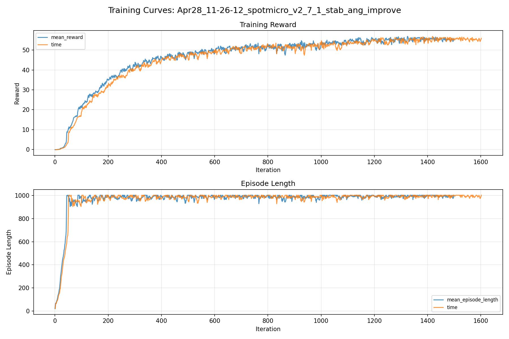
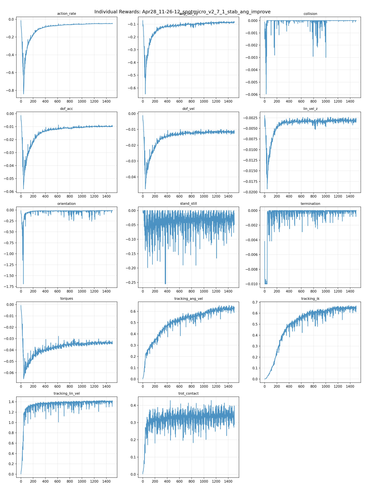
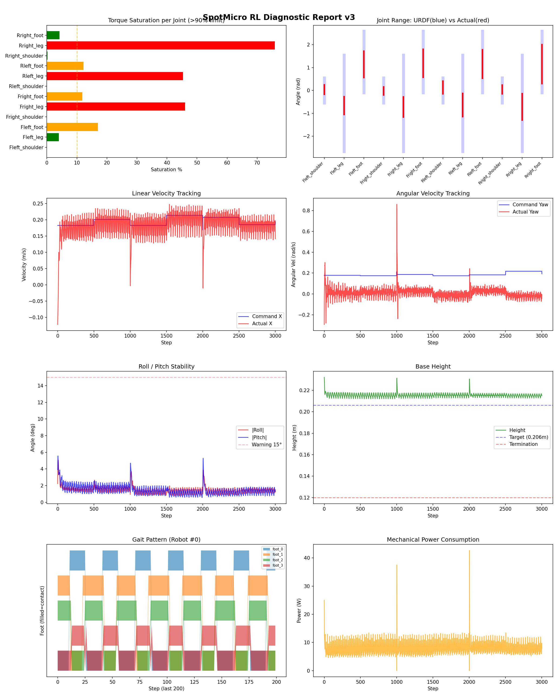
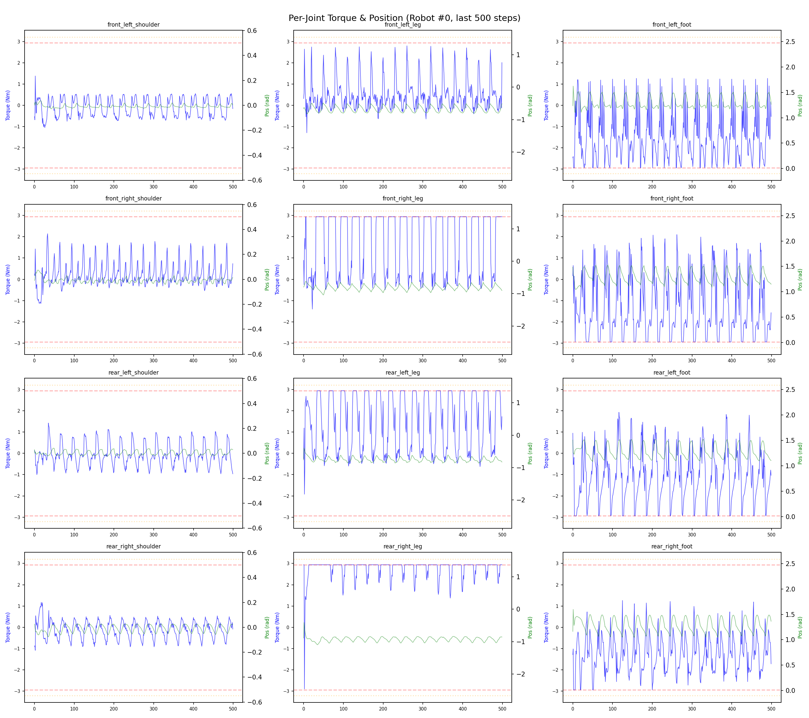
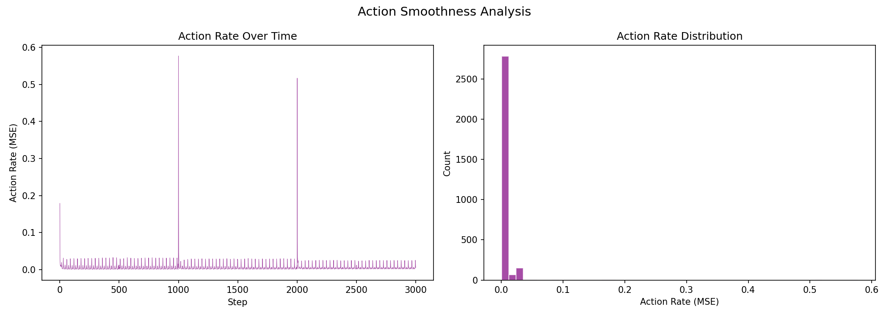

# 실험 019: spotmicro_v2_7_1_stab_ang_improve

- **날짜:** 2026-04-28 11:54
- **Task:** spotmicro_test
- **Run name:** `spotmicro_v2_7_1_stab_ang_improve`
- **판정:** ✅ PASS

---

## 실험 목적

V2.7.1: 나빠진 안정성, 각속도 오차 성능 향상, iteration 늘림

---

## 변경점 (이전 커밋 대비)

```diff
diff --git a/ai_training/rl/legged_gym/legged_gym/envs/spotmicro_test/spotmicro_test_config.py b/ai_training/rl/legged_gym/legged_gym/envs/spotmicro_test/spotmicro_test_config.py
index 2d536db..ec40f09 100644
--- a/ai_training/rl/legged_gym/legged_gym/envs/spotmicro_test/spotmicro_test_config.py
+++ b/ai_training/rl/legged_gym/legged_gym/envs/spotmicro_test/spotmicro_test_config.py
@@ -50,7 +50,7 @@ class SpotmicroTestCfg(LeggedRobotCfg):
     class rewards(LeggedRobotCfg.rewards):
         class scales:
             tracking_lin_vel = 1.5
-            tracking_ang_vel = 0.9 
+            tracking_ang_vel = 1.3 
             termination = -10.0
             lin_vel_z = -2.0
             ang_vel_xy = -0.4
@@ -123,7 +123,7 @@ class SpotmicroTestCfgPPO(LeggedRobotCfgPPO):
         entropy_coef = 0.01
 
     class runner(LeggedRobotCfgPPO.runner):
-        run_name = 'spotmicro_v2_7_stab_ang_improve'
+        run_name = 'spotmicro_v2_7_1_stab_ang_improve'
         experiment_name = 'spotmicro_test'
-        max_iterations = 1000
+        max_iterations = 1500
         save_interval = 100
```

**변경 요약:**
  - tracking_ang_vel = 0.9
  + tracking_ang_vel = 1.3
  - run_name = 'spotmicro_v2_7_stab_ang_improve'
  + run_name = 'spotmicro_v2_7_1_stab_ang_improve'
  - max_iterations = 1000
  + max_iterations = 1500

---

## 현재 Reward Scales

| Reward | Scale |
|--------|-------|
| action_rate | -0.05 |
| ang_vel_xy | -0.4 |
| collision | -1.0 |
| dof_acc | -2.5e-07 |
| dof_vel | -0.001 |
| lin_vel_z | -2.0 |
| orientation | -6.0 |
| stand_still | -0.5 |
| termination | -10.0 |
| torques | -0.001 |
| tracking_ang_vel | 1.3 |
| tracking_ik | 1.0 |
| tracking_lin_vel | 1.5 |
| trot_contact | 0.5 |

---

## 진단 결과 (Diagnostic)

### 핵심 지표

- ✅ Timeout: 100.0% (≥80%)
- ✅ 속도오차 X: 0.0471 m/s (<0.08)
- ⚠️ 토크포화: 18.1% (10~40%)
- ✅ 자세: roll 1.5°, pitch 1.5° (안정)
- ✅ 조기종료: 0.0% (<5%)

### 상세 수치

| 지표 | 값 |
|------|-----|
| Timeout% | 100.0 |
| 조기종료% | 0.0 |
| 속도오차 X | 0.04712238162755966 m/s |
| 속도오차 Y | 0.02485625259578228 m/s |
| 각속도오차 | 0.10333861410617828 rad/s |
| 토크포화% | 18.05616258741259 |
| 평균 높이 | 0.2154177639222804 m |
| Roll (평균) | 1.4527863264083862° |
| Pitch (평균) | 1.45259690284729° |
| Action Rate | 0.005825397092849016 |
| 평균 전력 | 8.121455192565918 W |
| CoT | 1.7713017343660813 |


## 학습 곡선 분석

| 지표 | 값 | 판정 |
|------|-----|------|
| 수렴 iter (90%) | 614 | 보통 |
| 후반 안정성 (CV) | 0.033 | 안정 |
| 정체 구간 | 있음 (iter 1368, 74 iter) | |


## Per-leg 분석

### 발별 접촉/공중 비율

| 발 | 접촉% | 공중% |
|-----|-------|------|
| foot_0 | 52.1% | 47.9% |
| foot_1 | 63.1% | 36.9% |
| foot_2 | 59.8% | 40.2% |
| foot_3 | 50.9% | 49.1% |

### 관절별 토크 포화

| 관절 | 포화% | 최대토크 | 한계 | 상태 |
|------|------|---------|------|------|
| front_left_shoulder | 0.0% | 2.940 | 2.940 | ✅ |
| front_left_leg | 4.0% | 2.940 | 2.940 | ✅ |
| front_left_foot | 17.0% | 2.940 | 2.940 | ⚠️ |
| front_right_shoulder | 0.0% | 2.940 | 2.940 | ✅ |
| front_right_leg | 46.0% | 2.940 | 2.940 | ❌ |
| front_right_foot | 11.8% | 2.940 | 2.940 | ⚠️ |
| rear_left_shoulder | 0.0% | 2.940 | 2.940 | ✅ |
| rear_left_leg | 45.3% | 2.940 | 2.940 | ❌ |
| rear_left_foot | 12.2% | 2.940 | 2.940 | ⚠️ |
| rear_right_shoulder | 0.2% | 2.940 | 2.940 | ✅ |
| rear_right_leg | 75.9% | 2.940 | 2.940 | ❌ |
| rear_right_foot | 4.3% | 2.940 | 2.940 | ✅ |


## Gait 분석

| 지표 | 값 |
|------|-----|
| Gait 주파수 | 0.42 Hz |
| Gait 주기 | 30 steps |
| 대각 동기화율 | 91.3% |
| L/R 비대칭 | 0.0%p |
| 판정 | ✅ Trot 패턴 / ✅ 대칭 |


## 관절별 상세

| 관절 | 토크포화% | 사용범위% | 편향(rad) | 한계근접% | 상태 |
|------|----------|----------|----------|----------|------|
| front_left_shoulder | 0.0% | 38% | +0.038 | 0.0% | ✅ |
| front_left_leg | 4.0% | 19% | -0.659 | 0.0% | ⚠️ |
| front_left_foot | 17.0% | 43% | +1.140 | 0.0% | ⚠️ |
| front_right_shoulder | 0.0% | 32% | -0.024 | 0.0% | ✅ |
| front_right_leg | 46.0% | 21% | -0.722 | 0.0% | ⚠️ |
| front_right_foot | 11.8% | 46% | +1.188 | 0.0% | ⚠️ |
| rear_left_shoulder | 0.0% | 51% | +0.129 | 0.0% | ⚠️ |
| rear_left_leg | 45.3% | 24% | -0.636 | 0.0% | ⚠️ |
| rear_left_foot | 12.2% | 47% | +1.159 | 0.0% | ⚠️ |
| rear_right_shoulder | 0.2% | 35% | +0.042 | 0.0% | ✅ |
| rear_right_leg | 75.9% | 27% | -0.720 | 0.0% | ⚠️ |
| rear_right_foot | 4.3% | 64% | +1.153 | 0.0% | ⚠️ |


## 에너지 효율 상세

| 지표 | 값 |
|------|-----|
| 평균 전력 | 8.12 W |
| 피크 전력 | 42.64 W |
| 피크/평균 비율 | 5.2x |
| CoT | 1.77 |

### 관절별 전력 분배

| 관절 | 평균전력(W) | 비율% |
|------|-----------|-------|
| front_right_foot | 1.395 | 17.2% |
| front_left_foot | 1.358 | 16.7% |
| rear_right_leg | 1.155 | 14.2% |
| rear_left_foot | 0.971 | 12.0% |
| rear_left_leg | 0.945 | 11.6% |
| front_right_leg | 0.839 | 10.3% |
| rear_right_foot | 0.781 | 9.6% |
| front_left_leg | 0.429 | 5.3% |
| rear_right_shoulder | 0.090 | 1.1% |
| front_right_shoulder | 0.066 | 0.8% |
| rear_left_shoulder | 0.062 | 0.8% |
| front_left_shoulder | 0.030 | 0.4% |


## 이전 실험 대비 비교

| 지표 | 이전 (exp018) | 현재 (exp019) | 변화 |
|------|-------|-------|------|
| Timeout% | 97.7% | 100.0% | ✅ ↑ 2.2901% |
| 속도오차 X | 0.0490 | 0.0471 | ✅ ↓ 0.0019m/s |
| 토크포화 | 16.3% | 18.1% | ⚠️ ↑ 1.7250% |
| Roll | 2.0° | 1.5° | ✅ ↓ 0.5087° |
| Pitch | 1.8° | 1.5° | ✅ ↓ 0.3381° |
| 평균 전력 | 7.6264W | 8.1215W | ⚠️ ↑ 0.4951W |


## Tensorboard 학습 곡선 요약

| 스칼라 | 최종값 | 최대 | 최소 | 후반10% 평균 |
|--------|--------|------|------|-------------|
| rew_action_rate | -0.0491 | -0.0145 | -0.8412 | -0.0488 |
| rew_ang_vel_xy | -0.0857 | -0.0710 | -0.6477 | -0.0860 |
| rew_collision | 0.0000 | 0.0000 | -0.0060 | -0.0000 |
| rew_dof_acc | -0.0096 | -0.0014 | -0.0581 | -0.0098 |
| rew_dof_vel | -0.0112 | -0.0012 | -0.0476 | -0.0116 |
| rew_lin_vel_z | -0.0028 | -0.0020 | -0.0193 | -0.0032 |
| rew_orientation | -0.0152 | -0.0116 | -1.6902 | -0.0169 |
| rew_stand_still | -0.0479 | 0.0000 | -0.2552 | -0.0306 |
| rew_termination | 0.0000 | 0.0000 | -0.0100 | -0.0001 |
| rew_torques | -0.0339 | -0.0009 | -0.0655 | -0.0338 |
| rew_tracking_ang_vel | 0.6375 | 0.6515 | 0.0017 | 0.6248 |
| rew_tracking_ik | 0.6393 | 0.6704 | 0.0011 | 0.6479 |
| rew_tracking_lin_vel | 1.4074 | 1.4273 | 0.0055 | 1.4029 |
| rew_trot_contact | 0.2893 | 0.4282 | 0.0028 | 0.3369 |
| learning_rate | 0.0006 | 0.0100 | 0.0000 | 0.0005 |
| surrogate | -0.0022 | 0.0019 | -0.0095 | -0.0026 |
| value_function | 0.0203 | 0.1293 | 0.0014 | 0.0162 |
| collection time | 0.7620 | 0.9727 | 0.7189 | 0.7608 |
| learning_time | 0.2818 | 0.3961 | 0.2787 | 0.2861 |
| total_fps | 94177.0000 | 97908.0000 | 76555.0000 | 93919.7733 |
| mean_noise_std | 0.1779 | 1.0038 | 0.1733 | 0.1789 |
| mean_episode_length | 1002.0000 | 1002.0000 | 21.0700 | 995.6020 |
| time | 1002.0000 | 1002.0000 | 21.0700 | 995.6020 |
| mean_reward | 55.9524 | 56.9610 | -0.1642 | 55.5518 |
| time | 55.9524 | 56.9610 | -0.1642 | 55.5518 |

총 학습 iteration: 1499


---

## 그래프

### Tensorboard 학습 곡선



### Diagnostic 결과





---

## 결론 및 다음 실험 방향

**자동 판정:** ✅ PASS

대부분 기준을 통과했으나 일부 항목이 보통 수준입니다.
  - ⚠️ 토크포화: 18.1% (10~40%)

> 💡 위 결론은 자동 생성되었습니다. 필요시 수정하세요.

---

## 메모

_(추가 메모가 있으면 여기에 작성)_

