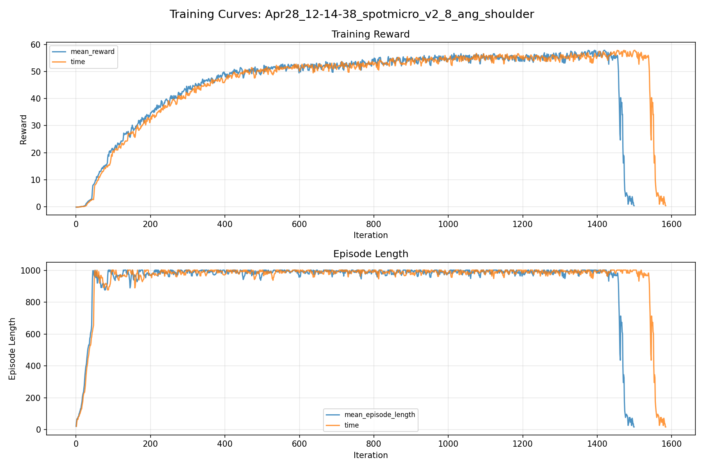
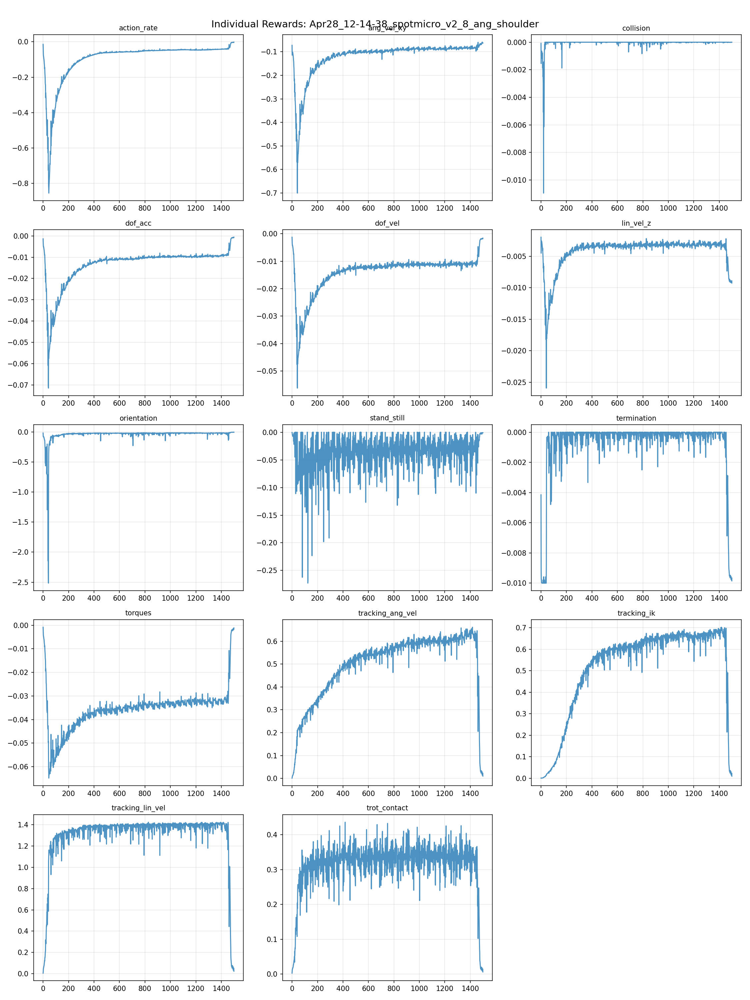
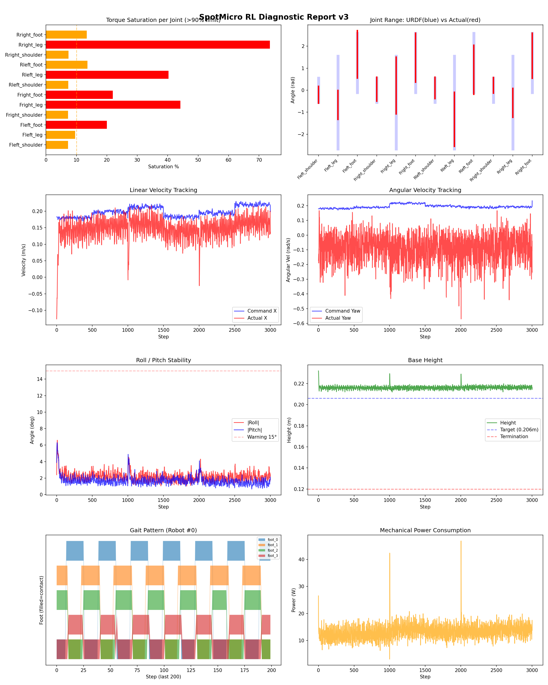
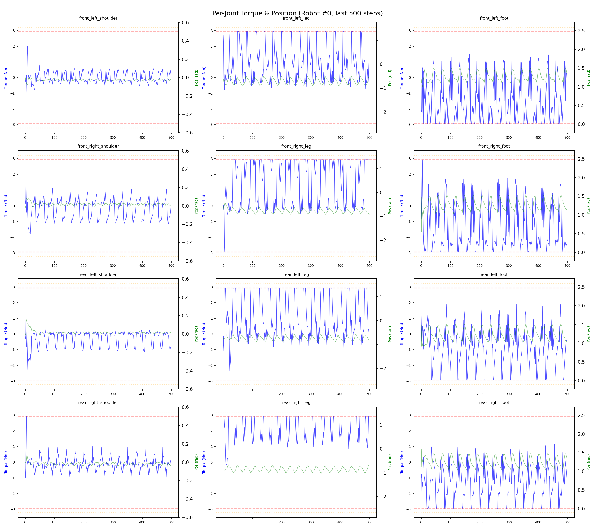
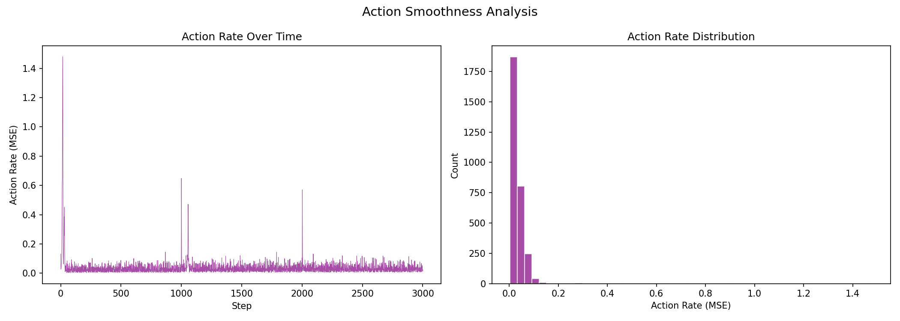

# 실험 020: spotmicro_v2_8_ang_shoulder

- **날짜:** 2026-04-28 12:42
- **Task:** spotmicro_test
- **Run name:** `spotmicro_v2_8_ang_shoulder`
- **판정:** ❌ FAIL (일부 기준 미달)

---

## 실험 목적

V2.8: ik shoulder 관절 목표값 설정, 회전 오차 감소하는지 확인

---

## 변경점 (이전 커밋 대비)

```diff
diff --git a/ai_training/rl/legged_gym/legged_gym/envs/spotmicro_test/spotmicro_test.py b/ai_training/rl/legged_gym/legged_gym/envs/spotmicro_test/spotmicro_test.py
index e17ee6e..62141c1 100644
--- a/ai_training/rl/legged_gym/legged_gym/envs/spotmicro_test/spotmicro_test.py
+++ b/ai_training/rl/legged_gym/legged_gym/envs/spotmicro_test/spotmicro_test.py
@@ -249,6 +249,8 @@ class SpotmicroTest(LeggedRobot):
     def _get_ik_target(self):
         vx = self.commands[:, 0]
         wz = self.commands[:, 2] 
+        shoulder_angle = wz * 0.15  # 스케일은 튜닝 필요
+
         v_left = vx - (wz * self.robot_width / 2.0)
         v_right = vx + (wz * self.robot_width / 2.0)
         stance_time = self.gait_period * self.duty_factor
@@ -276,6 +278,11 @@ class SpotmicroTest(LeggedRobot):
         theta_leg = q1 - self.ALPHA
         theta_foot = q2 + self.ALPHA
         ref_dof_pos = torch.zeros((self.num_envs, 12), device=self.device)
+        # FL, RR은 +방향, FR, RL은 -방향 (대각 쌍)
+        ref_dof_pos[:, 0] = shoulder_angle   # front_left
+        ref_dof_pos[:, 3] = -shoulder_angle  # front_right  
+        ref_dof_pos[:, 6] = -shoulder_angle  # rear_left
+        ref_dof_pos[:, 9] = shoulder_angle   # rear_right
         ref_dof_pos[:, 1::3] = theta_leg  
         ref_dof_pos[:, 2::3] = theta_foot 
 
diff --git a/ai_training/rl/legged_gym/legged_gym/envs/spotmicro_test/spotmicro_test_config.py b/ai_training/rl/legged_gym/legged_gym/envs/spotmicro_test/spotmicro_test_config.py
index ec40f09..670e4ca 100644
--- a/ai_training/rl/legged_gym/legged_gym/envs/spotmicro_test/spotmicro_test_config.py
+++ b/ai_training/rl/legged_gym/legged_gym/envs/spotmicro_test/spotmicro_test_config.py
@@ -123,7 +123,7 @@ class SpotmicroTestCfgPPO(LeggedRobotCfgPPO):
         entropy_coef = 0.01
 
     class runner(LeggedRobotCfgPPO.runner):
-        run_name = 'spotmicro_v2_7_1_stab_ang_improve'
+        run_name = 'spotmicro_v2_8_ang_shoulder'
         experiment_name = 'spotmicro_test'
         max_iterations = 1500
         save_interval = 100
```

**변경 요약:**
  + shoulder_angle = wz * 0.15  # 스케일은 튜닝 필요
  + ref_dof_pos[:, 0] = shoulder_angle   # front_left
  + ref_dof_pos[:, 3] = -shoulder_angle  # front_right
  + ref_dof_pos[:, 6] = -shoulder_angle  # rear_left
  + ref_dof_pos[:, 9] = shoulder_angle   # rear_right
  - run_name = 'spotmicro_v2_7_1_stab_ang_improve'
  + run_name = 'spotmicro_v2_8_ang_shoulder'

---

## 현재 Reward Scales

| Reward | Scale |
|--------|-------|
| action_rate | -0.05 |
| ang_vel_xy | -0.4 |
| collision | -1.0 |
| dof_acc | -2.5e-07 |
| dof_vel | -0.001 |
| lin_vel_z | -2.0 |
| orientation | -6.0 |
| stand_still | -0.5 |
| termination | -10.0 |
| torques | -0.001 |
| tracking_ang_vel | 1.3 |
| tracking_ik | 1.0 |
| tracking_lin_vel | 1.5 |
| trot_contact | 0.5 |

---

## 진단 결과 (Diagnostic)

### 핵심 지표

- ❌ Timeout: 5.7% (<60%, 미달)
- ✅ 속도오차 X: 0.0772 m/s (<0.08)
- ⚠️ 토크포화: 22.2% (10~40%)
- ✅ 자세: roll 2.2°, pitch 1.7° (안정)
- ❌ 조기종료: 94.3% (>20%)

### 상세 수치

| 지표 | 값 |
|------|-----|
| Timeout% | 5.726660250240616 |
| 조기종료% | 94.27333974975939 |
| 속도오차 X | 0.0772211104631424 m/s |
| 속도오차 Y | 0.03687449172139168 m/s |
| 각속도오차 | 0.231538325548172 rad/s |
| 토크포화% | 22.15523192085692 |
| 평균 높이 | 0.2161914959396079 m |
| Roll (평균) | 2.1777641773223877° |
| Pitch (평균) | 1.689588189125061° |
| Action Rate | 0.03556104376912117 |
| 평균 전력 | 13.399977684020996 W |
| CoT | 3.58791669345115 |


## 학습 곡선 분석

| 지표 | 값 | 판정 |
|------|-----|------|
| 수렴 iter (90%) | 505 | 보통 |
| 후반 안정성 (CV) | 0.195 | 불안정 |
| 정체 구간 | 없음 | |


## Per-leg 분석

### 발별 접촉/공중 비율

| 발 | 접촉% | 공중% |
|-----|-------|------|
| foot_0 | 52.5% | 47.5% |
| foot_1 | 57.4% | 42.6% |
| foot_2 | 53.1% | 46.9% |
| foot_3 | 48.6% | 51.4% |

### 관절별 토크 포화

| 관절 | 포화% | 최대토크 | 한계 | 상태 |
|------|------|---------|------|------|
| front_left_shoulder | 7.3% | 2.940 | 2.940 | ⚠️ |
| front_left_leg | 9.6% | 2.940 | 2.940 | ⚠️ |
| front_left_foot | 20.0% | 2.940 | 2.940 | ❌ |
| front_right_shoulder | 7.3% | 2.940 | 2.940 | ⚠️ |
| front_right_leg | 44.1% | 2.940 | 2.940 | ❌ |
| front_right_foot | 21.9% | 2.940 | 2.940 | ❌ |
| rear_left_shoulder | 7.3% | 2.940 | 2.940 | ⚠️ |
| rear_left_leg | 40.3% | 2.940 | 2.940 | ❌ |
| rear_left_foot | 13.6% | 2.940 | 2.940 | ⚠️ |
| rear_right_shoulder | 7.4% | 2.940 | 2.940 | ⚠️ |
| rear_right_leg | 73.6% | 2.940 | 2.940 | ❌ |
| rear_right_foot | 13.4% | 2.940 | 2.940 | ⚠️ |


## Gait 분석

| 지표 | 값 |
|------|-----|
| Gait 주파수 | 0.42 Hz |
| Gait 주기 | 30 steps |
| 대각 동기화율 | 89.7% |
| L/R 비대칭 | 0.0%p |
| 판정 | ✅ Trot 패턴 / ✅ 대칭 |


## 관절별 상세

| 관절 | 토크포화% | 사용범위% | 편향(rad) | 한계근접% | 상태 |
|------|----------|----------|----------|----------|------|
| front_left_shoulder | 7.3% | 70% | -0.203 | 1.0% | ⚠️ |
| front_left_leg | 9.6% | 31% | -0.668 | 0.0% | ⚠️ |
| front_left_foot | 20.0% | 80% | +1.628 | 0.2% | ⚠️ |
| front_right_shoulder | 7.3% | 100% | +0.049 | 1.5% | ✅ |
| front_right_leg | 44.1% | 62% | +0.214 | 0.0% | ⚠️ |
| front_right_foot | 21.9% | 83% | +1.477 | 0.1% | ⚠️ |
| rear_left_shoulder | 7.3% | 89% | +0.103 | 2.0% | ⚠️ |
| rear_left_leg | 40.3% | 58% | -1.320 | 0.0% | ⚠️ |
| rear_left_foot | 13.6% | 83% | +0.931 | 0.1% | ⚠️ |
| rear_right_shoulder | 7.4% | 65% | +0.221 | 0.9% | ⚠️ |
| rear_right_leg | 73.6% | 31% | -0.578 | 0.0% | ⚠️ |
| rear_right_foot | 13.4% | 76% | +1.564 | 0.0% | ⚠️ |


## 에너지 효율 상세

| 지표 | 값 |
|------|-----|
| 평균 전력 | 13.40 W |
| 피크 전력 | 46.82 W |
| 피크/평균 비율 | 3.5x |
| CoT | 3.59 |

### 관절별 전력 분배

| 관절 | 평균전력(W) | 비율% |
|------|-----------|-------|
| front_right_foot | 1.948 | 14.5% |
| front_left_foot | 1.892 | 14.1% |
| front_right_leg | 1.709 | 12.8% |
| rear_left_leg | 1.672 | 12.5% |
| rear_right_leg | 1.313 | 9.8% |
| rear_left_foot | 0.974 | 7.3% |
| rear_right_foot | 0.922 | 6.9% |
| rear_left_shoulder | 0.901 | 6.7% |
| front_left_leg | 0.761 | 5.7% |
| front_right_shoulder | 0.554 | 4.1% |
| rear_right_shoulder | 0.424 | 3.2% |
| front_left_shoulder | 0.331 | 2.5% |


## 이전 실험 대비 비교

| 지표 | 이전 (exp019) | 현재 (exp020) | 변화 |
|------|-------|-------|------|
| Timeout% | 100.0% | 5.7% | ⚠️ ↓ 94.2733% |
| 속도오차 X | 0.0471 | 0.0772 | ⚠️ ↑ 0.0301m/s |
| 토크포화 | 18.1% | 22.2% | ⚠️ ↑ 4.0991% |
| Roll | 1.5° | 2.2° | ⚠️ ↑ 0.7250° |
| Pitch | 1.5° | 1.7° | ⚠️ ↑ 0.2370° |
| 평균 전력 | 8.1215W | 13.4000W | ⚠️ ↑ 5.2785W |


## Tensorboard 학습 곡선 요약

| 스칼라 | 최종값 | 최대 | 최소 | 후반10% 평균 |
|--------|--------|------|------|-------------|
| rew_action_rate | -0.0026 | -0.0026 | -0.8546 | -0.0336 |
| rew_ang_vel_xy | -0.0628 | -0.0596 | -0.7002 | -0.0792 |
| rew_collision | -0.0000 | 0.0000 | -0.0110 | -0.0000 |
| rew_dof_acc | -0.0006 | -0.0006 | -0.0715 | -0.0073 |
| rew_dof_vel | -0.0016 | -0.0012 | -0.0562 | -0.0089 |
| rew_lin_vel_z | -0.0092 | -0.0020 | -0.0259 | -0.0045 |
| rew_orientation | -0.0037 | -0.0034 | -2.5154 | -0.0182 |
| rew_stand_still | -0.0009 | 0.0000 | -0.2728 | -0.0240 |
| rew_termination | -0.0099 | 0.0000 | -0.0100 | -0.0023 |
| rew_torques | -0.0012 | -0.0009 | -0.0648 | -0.0252 |
| rew_tracking_ang_vel | 0.0104 | 0.6611 | 0.0017 | 0.4908 |
| rew_tracking_ik | 0.0102 | 0.7022 | 0.0011 | 0.5296 |
| rew_tracking_lin_vel | 0.0231 | 1.4240 | 0.0054 | 1.0926 |
| rew_trot_contact | 0.0061 | 0.4358 | 0.0028 | 0.2619 |
| learning_rate | 0.0000 | 0.0076 | 0.0000 | 0.0003 |
| surrogate | 0.0184 | 0.0425 | -0.0093 | 0.0047 |
| value_function | 0.0171 | 0.1694 | 0.0015 | 0.0229 |
| collection time | 0.7845 | 0.8681 | 0.7270 | 0.7667 |
| learning_time | 0.2871 | 0.3404 | 0.2738 | 0.2859 |
| total_fps | 91738.0000 | 97091.0000 | 81343.0000 | 93410.2667 |
| mean_noise_std | 0.1660 | 1.0053 | 0.1606 | 0.1656 |
| mean_episode_length | 17.2300 | 1002.0000 | 16.8700 | 779.3638 |
| time | 17.2300 | 1002.0000 | 16.8700 | 779.3638 |
| mean_reward | 0.3688 | 57.8567 | -0.1590 | 44.1860 |
| time | 0.3688 | 57.8567 | -0.1590 | 44.1860 |

총 학습 iteration: 1499


---

## 그래프

### Tensorboard 학습 곡선



### Diagnostic 결과





---

## 결론 및 다음 실험 방향

**자동 판정:** ❌ FAIL (일부 기준 미달)

일부 기준을 통과하지 못했습니다. 조정이 필요합니다.
  - ❌ Timeout: 5.7% (<60%, 미달)
  - ❌ 조기종료: 94.3% (>20%)

**제안:** Timeout이 낮습니다. 최근 추가한 페널티를 절반으로 줄여보세요.

> 💡 위 결론은 자동 생성되었습니다. 필요시 수정하세요.

---

## 메모

어깨 관절이 같은 방향으로 움직여서 생긴 문제라고 추정, 추가로 단순히 어깨 관절을 특정 각도로 고정시켜버리니까 문제가 생긴다.

