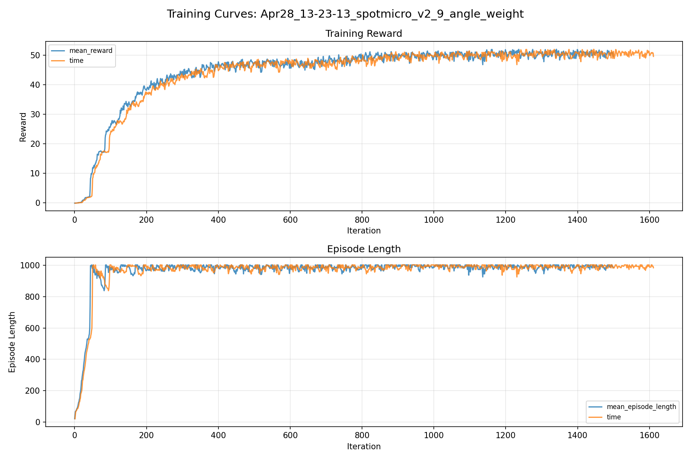
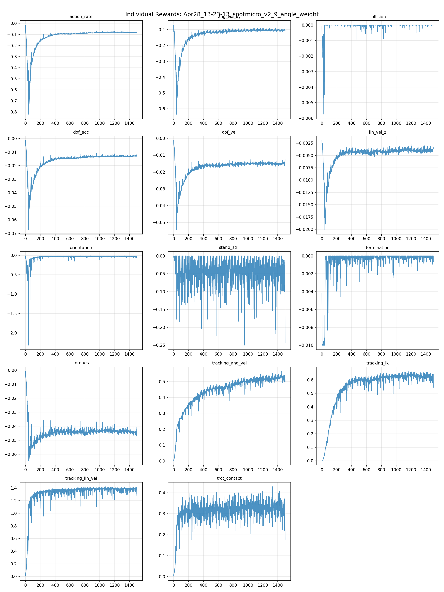
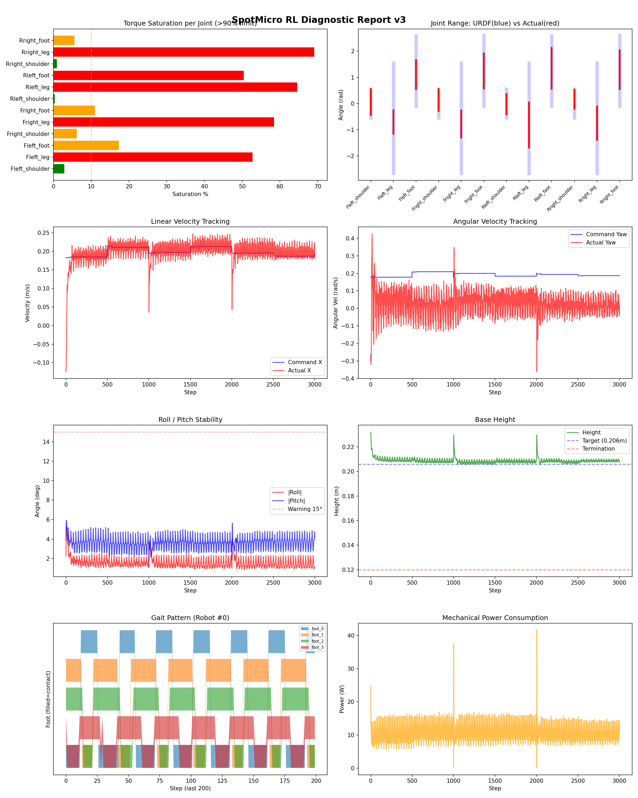
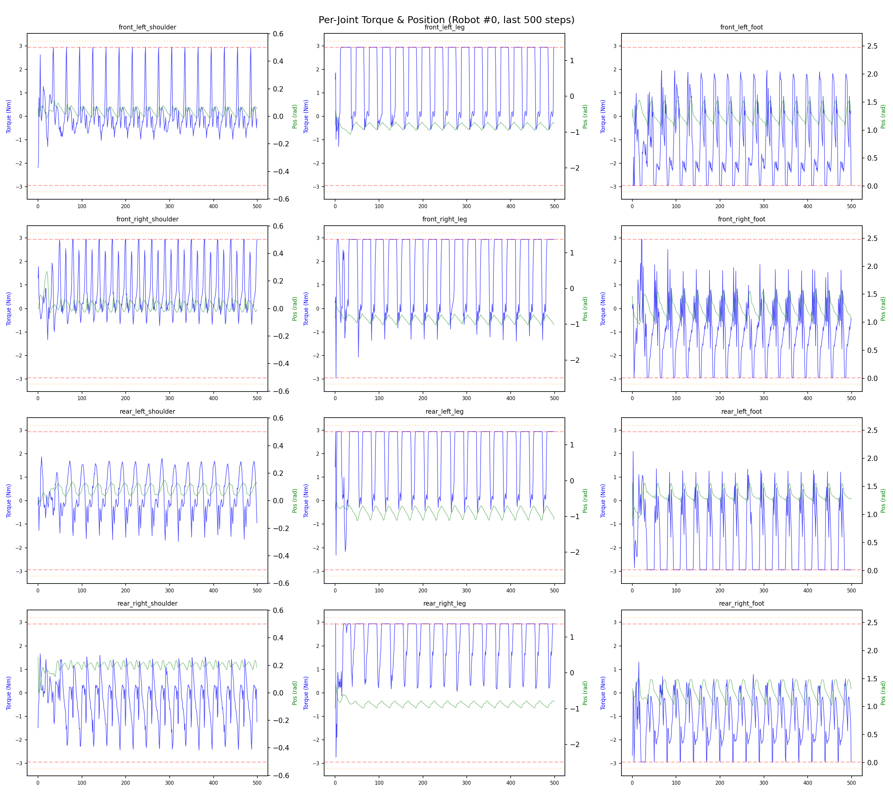
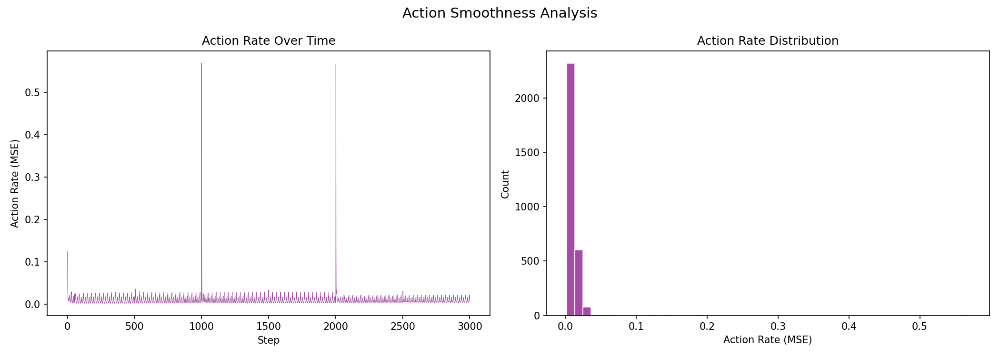

# 실험 021: spotmicro_v2_9_angle_weight

- **날짜:** 2026-04-28 13:51
- **Task:** spotmicro_test
- **Run name:** `spotmicro_v2_9_angle_weight`
- **판정:** ✅ PASS

---

## 실험 목적

V2.9: tracking_ik의 관절 각도 가중치 설정, 어깨 관절에 자유도 늘려 회전 오차 줄어드는지 확인

---

## 변경점 (이전 커밋 대비)

```diff
diff --git a/ai_training/rl/legged_gym/legged_gym/envs/spotmicro_test/spotmicro_test.py b/ai_training/rl/legged_gym/legged_gym/envs/spotmicro_test/spotmicro_test.py
index 62141c1..e57dd95 100644
--- a/ai_training/rl/legged_gym/legged_gym/envs/spotmicro_test/spotmicro_test.py
+++ b/ai_training/rl/legged_gym/legged_gym/envs/spotmicro_test/spotmicro_test.py
@@ -249,7 +249,6 @@ class SpotmicroTest(LeggedRobot):
     def _get_ik_target(self):
         vx = self.commands[:, 0]
         wz = self.commands[:, 2] 
-        shoulder_angle = wz * 0.15  # 스케일은 튜닝 필요
 
         v_left = vx - (wz * self.robot_width / 2.0)
         v_right = vx + (wz * self.robot_width / 2.0)
@@ -278,11 +277,6 @@ class SpotmicroTest(LeggedRobot):
         theta_leg = q1 - self.ALPHA
         theta_foot = q2 + self.ALPHA
         ref_dof_pos = torch.zeros((self.num_envs, 12), device=self.device)
-        # FL, RR은 +방향, FR, RL은 -방향 (대각 쌍)
-        ref_dof_pos[:, 0] = shoulder_angle   # front_left
-        ref_dof_pos[:, 3] = -shoulder_angle  # front_right  
-        ref_dof_pos[:, 6] = -shoulder_angle  # rear_left
-        ref_dof_pos[:, 9] = shoulder_angle   # rear_right
         ref_dof_pos[:, 1::3] = theta_leg  
         ref_dof_pos[:, 2::3] = theta_foot 
 
@@ -300,7 +294,13 @@ class SpotmicroTest(LeggedRobot):
         return torch.clip(torques, -self.torque_limits, self.torque_limits)
         
     def _reward_tracking_ik(self):
-        error = torch.sum(torch.square(self.actions), dim=1)
+        # 관절별 페널티 가중치: [Shoulder, Leg, Foot] 순서
+        # 어깨(0.1)는 자유롭게 움직이도록 허용하고, Leg와 Foot(1.0)은 IK를 잘 따르도록 강제함
+        weights = torch.tensor([0.3, 1.0, 1.0] * 4, device=self.device)
+    
+        # action에 가중치를 곱해서 에러 계산
+        weighted_actions = self.actions * weights
+        error = torch.sum(torch.square(weighted_actions), dim=1)
         sigma = 2.0 
         return torch.exp(-error / sigma)
         
diff --git a/ai_training/rl/legged_gym/legged_gym/envs/spotmicro_test/spotmicro_test_config.py b/ai_training/rl/legged_gym/legged_gym/envs/spotmicro_test/spotmicro_test_config.py
index 670e4ca..3b52308 100644
--- a/ai_training/rl/legged_gym/legged_gym/envs/spotmicro_test/spotmicro_test_config.py
+++ b/ai_training/rl/legged_gym/legged_gym/envs/spotmicro_test/spotmicro_test_config.py
@@ -123,7 +123,7 @@ class SpotmicroTestCfgPPO(LeggedRobotCfgPPO):
         entropy_coef = 0.01
 
     class runner(LeggedRobotCfgPPO.runner):
-        run_name = 'spotmicro_v2_8_ang_shoulder'
+        run_name = 'spotmicro_v2_9_angle_weight'
         experiment_name = 'spotmicro_test'
         max_iterations = 1500
         save_interval = 100
```

**변경 요약:**
  - shoulder_angle = wz * 0.15  # 스케일은 튜닝 필요
  - ref_dof_pos[:, 0] = shoulder_angle   # front_left
  - ref_dof_pos[:, 3] = -shoulder_angle  # front_right
  - ref_dof_pos[:, 6] = -shoulder_angle  # rear_left
  - ref_dof_pos[:, 9] = shoulder_angle   # rear_right
  - error = torch.sum(torch.square(self.actions), dim=1)
  + weights = torch.tensor([0.3, 1.0, 1.0] * 4, device=self.device)
  + weighted_actions = self.actions * weights
  + error = torch.sum(torch.square(weighted_actions), dim=1)
  - run_name = 'spotmicro_v2_8_ang_shoulder'
  + run_name = 'spotmicro_v2_9_angle_weight'

---

## 현재 Reward Scales

| Reward | Scale |
|--------|-------|
| action_rate | -0.05 |
| ang_vel_xy | -0.4 |
| collision | -1.0 |
| dof_acc | -2.5e-07 |
| dof_vel | -0.001 |
| lin_vel_z | -2.0 |
| orientation | -6.0 |
| stand_still | -0.5 |
| termination | -10.0 |
| torques | -0.001 |
| tracking_ang_vel | 1.3 |
| tracking_ik | 1.0 |
| tracking_lin_vel | 1.5 |
| trot_contact | 0.5 |

---

## 진단 결과 (Diagnostic)

### 핵심 지표

- ✅ Timeout: 98.5% (≥80%)
- ✅ 속도오차 X: 0.0518 m/s (<0.08)
- ⚠️ 토크포화: 28.3% (10~40%)
- ✅ 자세: roll 1.6°, pitch 3.6° (안정)
- ✅ 조기종료: 0.0% (<5%)

### 상세 수치

| 지표 | 값 |
|------|-----|
| Timeout% | 98.46153846153847 |
| 조기종료% | 0.0 |
| 속도오차 X | 0.05177343264222145 m/s |
| 속도오차 Y | 0.03235375136137009 m/s |
| 각속도오차 | 0.13366758823394775 rad/s |
| 토크포화% | 28.275110306360308 |
| 평균 높이 | 0.2088620431753464 m |
| Roll (평균) | 1.5798410177230835° |
| Pitch (평균) | 3.589850664138794° |
| Action Rate | 0.00957552157342434 |
| 평균 전력 | 10.449432373046875 W |
| CoT | 2.055813840648939 |


## 학습 곡선 분석

| 지표 | 값 | 판정 |
|------|-----|------|
| 수렴 iter (90%) | 355 | 빠름 |
| 후반 안정성 (CV) | 0.019 | 안정 |
| 정체 구간 | 없음 | |


## Per-leg 분석

### 발별 접촉/공중 비율

| 발 | 접촉% | 공중% |
|-----|-------|------|
| foot_0 | 56.1% | 43.9% |
| foot_1 | 63.7% | 36.3% |
| foot_2 | 62.9% | 37.1% |
| foot_3 | 55.9% | 44.1% |

### 관절별 토크 포화

| 관절 | 포화% | 최대토크 | 한계 | 상태 |
|------|------|---------|------|------|
| front_left_shoulder | 2.8% | 2.940 | 2.940 | ✅ |
| front_left_leg | 52.7% | 2.940 | 2.940 | ❌ |
| front_left_foot | 17.3% | 2.940 | 2.940 | ⚠️ |
| front_right_shoulder | 6.2% | 2.940 | 2.940 | ⚠️ |
| front_right_leg | 58.5% | 2.940 | 2.940 | ❌ |
| front_right_foot | 11.0% | 2.940 | 2.940 | ⚠️ |
| rear_left_shoulder | 0.3% | 2.940 | 2.940 | ✅ |
| rear_left_leg | 64.6% | 2.940 | 2.940 | ❌ |
| rear_left_foot | 50.4% | 2.940 | 2.940 | ❌ |
| rear_right_shoulder | 0.9% | 2.940 | 2.940 | ✅ |
| rear_right_leg | 69.1% | 2.940 | 2.940 | ❌ |
| rear_right_foot | 5.5% | 2.940 | 2.940 | ⚠️ |


## Gait 분석

| 지표 | 값 |
|------|-----|
| Gait 주파수 | 0.42 Hz |
| Gait 주기 | 30 steps |
| 대각 동기화율 | 87.4% |
| L/R 비대칭 | 0.0%p |
| 판정 | ✅ Trot 패턴 / ✅ 대칭 |


## 관절별 상세

| 관절 | 토크포화% | 사용범위% | 편향(rad) | 한계근접% | 상태 |
|------|----------|----------|----------|----------|------|
| front_left_shoulder | 2.8% | 90% | +0.056 | 0.1% | ✅ |
| front_left_leg | 52.7% | 21% | -0.704 | 0.0% | ⚠️ |
| front_left_foot | 17.3% | 41% | +1.104 | 0.0% | ⚠️ |
| front_right_shoulder | 6.2% | 76% | +0.132 | 0.1% | ⚠️ |
| front_right_leg | 58.5% | 25% | -0.778 | 0.0% | ⚠️ |
| front_right_foot | 11.0% | 50% | +1.241 | 0.0% | ⚠️ |
| rear_left_shoulder | 0.3% | 71% | -0.022 | 0.0% | ✅ |
| rear_left_leg | 64.6% | 41% | -0.818 | 0.0% | ⚠️ |
| rear_left_foot | 50.4% | 58% | +1.348 | 0.0% | ⚠️ |
| rear_right_shoulder | 0.9% | 66% | +0.168 | 0.1% | ⚠️ |
| rear_right_leg | 69.1% | 30% | -0.748 | 0.0% | ⚠️ |
| rear_right_foot | 5.5% | 55% | +1.295 | 0.0% | ⚠️ |


## 에너지 효율 상세

| 지표 | 값 |
|------|-----|
| 평균 전력 | 10.45 W |
| 피크 전력 | 41.62 W |
| 피크/평균 비율 | 4.0x |
| CoT | 2.06 |

### 관절별 전력 분배

| 관절 | 평균전력(W) | 비율% |
|------|-----------|-------|
| front_left_foot | 1.624 | 15.5% |
| rear_left_foot | 1.623 | 15.5% |
| front_right_leg | 1.280 | 12.2% |
| front_right_foot | 1.213 | 11.6% |
| rear_right_leg | 1.118 | 10.7% |
| rear_left_leg | 1.098 | 10.5% |
| rear_right_foot | 0.869 | 8.3% |
| front_left_leg | 0.850 | 8.1% |
| rear_right_shoulder | 0.259 | 2.5% |
| front_right_shoulder | 0.239 | 2.3% |
| rear_left_shoulder | 0.174 | 1.7% |
| front_left_shoulder | 0.102 | 1.0% |


## 이전 실험 대비 비교

| 지표 | 이전 (exp020) | 현재 (exp021) | 변화 |
|------|-------|-------|------|
| Timeout% | 5.7% | 98.5% | ✅ ↑ 92.7349% |
| 속도오차 X | 0.0772 | 0.0518 | ✅ ↓ 0.0254m/s |
| 토크포화 | 22.2% | 28.3% | ⚠️ ↑ 6.1199% |
| Roll | 2.2° | 1.6° | ✅ ↓ 0.5979° |
| Pitch | 1.7° | 3.6° | ⚠️ ↑ 1.9003° |
| 평균 전력 | 13.4000W | 10.4494W | ✅ ↓ 2.9505W |


## Tensorboard 학습 곡선 요약

| 스칼라 | 최종값 | 최대 | 최소 | 후반10% 평균 |
|--------|--------|------|------|-------------|
| rew_action_rate | -0.0798 | -0.0145 | -0.8215 | -0.0814 |
| rew_ang_vel_xy | -0.1066 | -0.0710 | -0.6347 | -0.1037 |
| rew_collision | 0.0000 | 0.0000 | -0.0057 | -0.0000 |
| rew_dof_acc | -0.0117 | -0.0014 | -0.0673 | -0.0130 |
| rew_dof_vel | -0.0128 | -0.0012 | -0.0543 | -0.0151 |
| rew_lin_vel_z | -0.0037 | -0.0020 | -0.0201 | -0.0040 |
| rew_orientation | -0.0478 | -0.0151 | -2.3170 | -0.0331 |
| rew_stand_still | -0.2437 | 0.0000 | -0.2499 | -0.0461 |
| rew_termination | -0.0006 | 0.0000 | -0.0100 | -0.0001 |
| rew_torques | -0.0408 | -0.0009 | -0.0645 | -0.0442 |
| rew_tracking_ang_vel | 0.5016 | 0.5647 | 0.0017 | 0.5265 |
| rew_tracking_ik | 0.5446 | 0.6627 | 0.0016 | 0.6245 |
| rew_tracking_lin_vel | 1.3082 | 1.4185 | 0.0055 | 1.3808 |
| rew_trot_contact | 0.1780 | 0.4283 | 0.0028 | 0.3250 |
| learning_rate | 0.0006 | 0.0100 | 0.0000 | 0.0006 |
| surrogate | -0.0024 | 0.0022 | -0.0084 | -0.0038 |
| value_function | 0.0162 | 0.0951 | 0.0017 | 0.0207 |
| collection time | 0.8033 | 0.9723 | 0.7148 | 0.7644 |
| learning_time | 0.2883 | 0.3496 | 0.2758 | 0.2862 |
| total_fps | 90056.0000 | 98256.0000 | 77838.0000 | 93598.9200 |
| mean_noise_std | 0.2409 | 1.0024 | 0.2302 | 0.2385 |
| mean_episode_length | 983.7800 | 1002.0000 | 21.0700 | 992.0166 |
| time | 983.7800 | 1002.0000 | 21.0700 | 992.0166 |
| mean_reward | 49.6369 | 52.0513 | -0.1611 | 50.5423 |
| time | 49.6369 | 52.0513 | -0.1611 | 50.5423 |

총 학습 iteration: 1499


---

## 그래프

### Tensorboard 학습 곡선



### Diagnostic 결과





---

## 결론 및 다음 실험 방향

**자동 판정:** ✅ PASS

대부분 기준을 통과했으나 일부 항목이 보통 수준입니다.
  - ⚠️ 토크포화: 28.3% (10~40%)

> 💡 위 결론은 자동 생성되었습니다. 필요시 수정하세요.

---

## 메모

tracking_ik reward에서 관절마다 가중치를 둬 어깨 관절의 자유도를 높여서 회전 명령 시 어깨관절을 더 이용하게 유도해봄. 그러나 각속도 오차가 오히려 커짐. 

