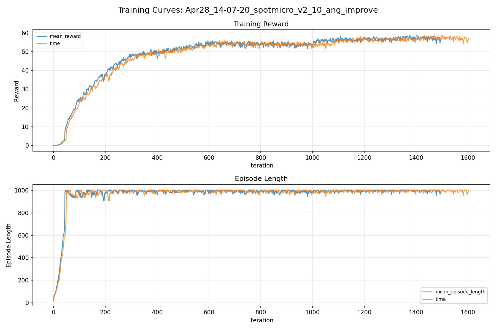
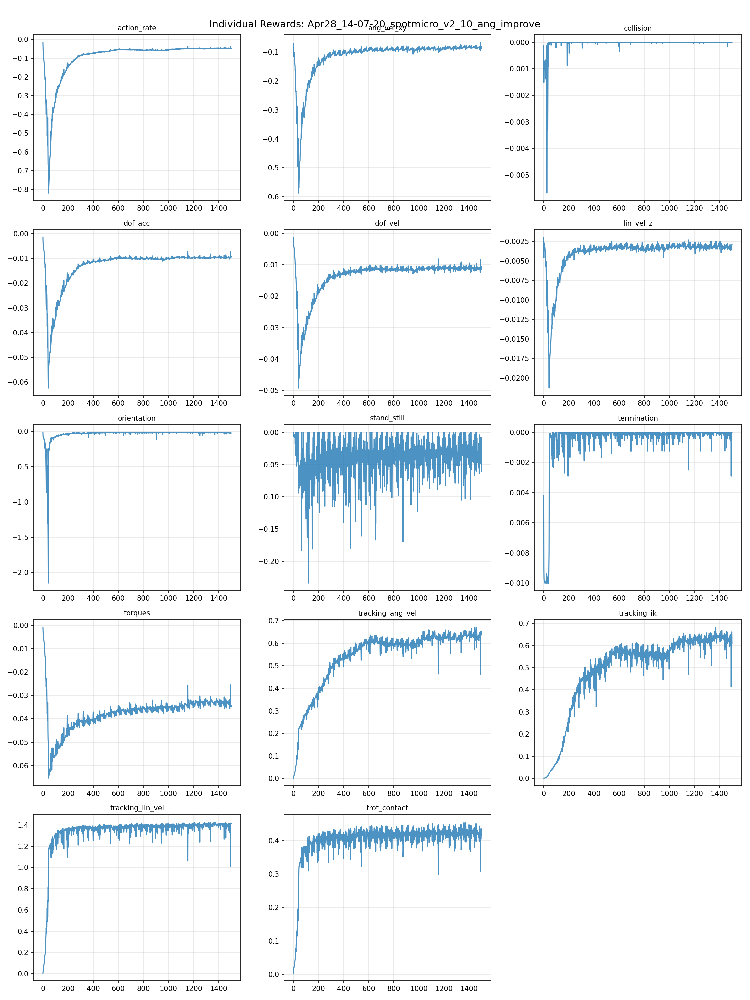
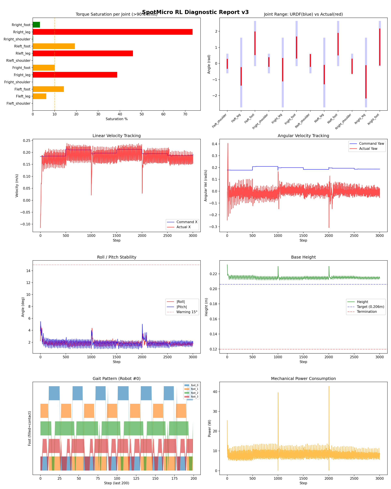
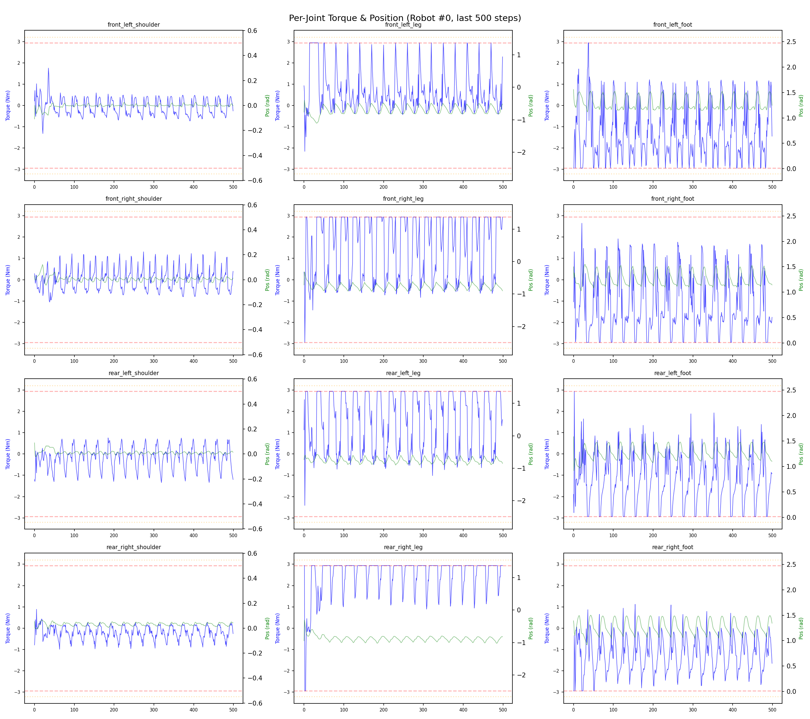
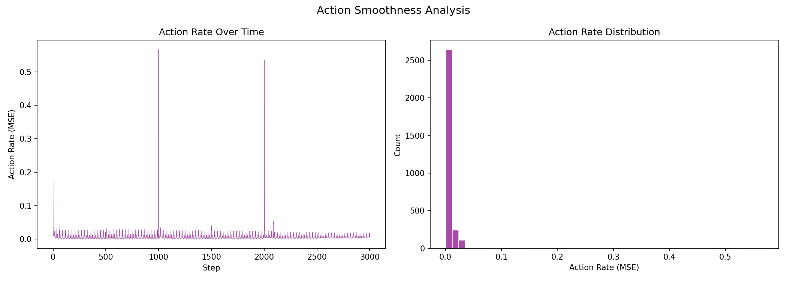

# 실험 022: spotmicro_v2_10_ang_improve

- **날짜:** 2026-04-28 14:35
- **Task:** spotmicro_test
- **Run name:** `spotmicro_v2_10_ang_improve`
- **판정:** ✅ PASS

---

## 실험 목적

V2.10: 가중치 복구, trot contact reward 제자리 회전 시 적용 안되는 문제 fix, 경과 관찰

---

## 변경점 (이전 커밋 대비)

```diff
diff --git a/ai_training/rl/legged_gym/legged_gym/envs/spotmicro_test/spotmicro_test.py b/ai_training/rl/legged_gym/legged_gym/envs/spotmicro_test/spotmicro_test.py
index e57dd95..054d51c 100644
--- a/ai_training/rl/legged_gym/legged_gym/envs/spotmicro_test/spotmicro_test.py
+++ b/ai_training/rl/legged_gym/legged_gym/envs/spotmicro_test/spotmicro_test.py
@@ -296,7 +296,7 @@ class SpotmicroTest(LeggedRobot):
     def _reward_tracking_ik(self):
         # 관절별 페널티 가중치: [Shoulder, Leg, Foot] 순서
         # 어깨(0.1)는 자유롭게 움직이도록 허용하고, Leg와 Foot(1.0)은 IK를 잘 따르도록 강제함
-        weights = torch.tensor([0.3, 1.0, 1.0] * 4, device=self.device)
+        weights = torch.tensor([1.0, 1.0, 1.0] * 4, device=self.device)
     
         # action에 가중치를 곱해서 에러 계산
         weighted_actions = self.actions * weights
@@ -316,6 +316,6 @@ class SpotmicroTest(LeggedRobot):
         desired_contact = phases < self.duty_factor
         actual_contact = self.contact_forces[:, self.feet_indices, 2] > 1.0
         match = (actual_contact == desired_contact).float()
-        cmd_norm = torch.norm(self.commands[:, :2], dim=1, keepdim=True)
+        cmd_norm = torch.norm(self.commands[:, :3], dim=1, keepdim=True)
         is_moving = (cmd_norm > 0.1).float()
         return torch.sum(match * is_moving, dim=1) / 4.0
diff --git a/ai_training/rl/legged_gym/legged_gym/envs/spotmicro_test/spotmicro_test_config.py b/ai_training/rl/legged_gym/legged_gym/envs/spotmicro_test/spotmicro_test_config.py
index 3b52308..2ca683e 100644
--- a/ai_training/rl/legged_gym/legged_gym/envs/spotmicro_test/spotmicro_test_config.py
+++ b/ai_training/rl/legged_gym/legged_gym/envs/spotmicro_test/spotmicro_test_config.py
@@ -123,7 +123,7 @@ class SpotmicroTestCfgPPO(LeggedRobotCfgPPO):
         entropy_coef = 0.01
 
     class runner(LeggedRobotCfgPPO.runner):
-        run_name = 'spotmicro_v2_9_angle_weight'
+        run_name = 'spotmicro_v2_10_ang_improve'
         experiment_name = 'spotmicro_test'
         max_iterations = 1500
         save_interval = 100
```

**변경 요약:**
  - weights = torch.tensor([0.3, 1.0, 1.0] * 4, device=self.device)
  + weights = torch.tensor([1.0, 1.0, 1.0] * 4, device=self.device)
  - cmd_norm = torch.norm(self.commands[:, :2], dim=1, keepdim=True)
  + cmd_norm = torch.norm(self.commands[:, :3], dim=1, keepdim=True)
  - run_name = 'spotmicro_v2_9_angle_weight'
  + run_name = 'spotmicro_v2_10_ang_improve'

---

## 현재 Reward Scales

| Reward | Scale |
|--------|-------|
| action_rate | -0.05 |
| ang_vel_xy | -0.4 |
| collision | -1.0 |
| dof_acc | -2.5e-07 |
| dof_vel | -0.001 |
| lin_vel_z | -2.0 |
| orientation | -6.0 |
| stand_still | -0.5 |
| termination | -10.0 |
| torques | -0.001 |
| tracking_ang_vel | 1.3 |
| tracking_ik | 1.0 |
| tracking_lin_vel | 1.5 |
| trot_contact | 0.5 |

---

## 진단 결과 (Diagnostic)

### 핵심 지표

- ✅ Timeout: 98.5% (≥80%)
- ✅ 속도오차 X: 0.0470 m/s (<0.08)
- ⚠️ 토크포화: 17.6% (10~40%)
- ✅ 자세: roll 1.8°, pitch 1.8° (안정)
- ✅ 조기종료: 0.0% (<5%)

### 상세 수치

| 지표 | 값 |
|------|-----|
| Timeout% | 98.46153846153847 |
| 조기종료% | 0.0 |
| 속도오차 X | 0.04698850214481354 m/s |
| 속도오차 Y | 0.022093867883086205 m/s |
| 각속도오차 | 0.10673219710588455 rad/s |
| 토크포화% | 17.61888285325785 |
| 평균 높이 | 0.21491105116648235 m |
| Roll (평균) | 1.8365609645843506° |
| Pitch (평균) | 1.8062703609466553° |
| Action Rate | 0.006648684851825237 |
| 평균 전력 | 8.14206600189209 W |
| CoT | 1.7979807151142129 |


## 학습 곡선 분석

| 지표 | 값 | 판정 |
|------|-----|------|
| 수렴 iter (90%) | 503 | 보통 |
| 후반 안정성 (CV) | 0.028 | 안정 |
| 정체 구간 | 없음 | |


## Per-leg 분석

### 발별 접촉/공중 비율

| 발 | 접촉% | 공중% |
|-----|-------|------|
| foot_0 | 49.7% | 50.3% |
| foot_1 | 62.3% | 37.7% |
| foot_2 | 61.7% | 38.3% |
| foot_3 | 50.6% | 49.4% |

### 관절별 토크 포화

| 관절 | 포화% | 최대토크 | 한계 | 상태 |
|------|------|---------|------|------|
| front_left_shoulder | 0.0% | 2.940 | 2.940 | ✅ |
| front_left_leg | 6.2% | 2.940 | 2.940 | ⚠️ |
| front_left_foot | 14.3% | 2.940 | 2.940 | ⚠️ |
| front_right_shoulder | 0.0% | 2.940 | 2.940 | ✅ |
| front_right_leg | 38.8% | 2.940 | 2.940 | ❌ |
| front_right_foot | 10.0% | 2.940 | 2.940 | ⚠️ |
| rear_left_shoulder | 0.0% | 2.940 | 2.940 | ✅ |
| rear_left_leg | 46.0% | 2.940 | 2.940 | ❌ |
| rear_left_foot | 19.3% | 2.940 | 2.940 | ⚠️ |
| rear_right_shoulder | 0.1% | 2.940 | 2.940 | ✅ |
| rear_right_leg | 73.4% | 2.940 | 2.940 | ❌ |
| rear_right_foot | 3.2% | 2.940 | 2.940 | ✅ |


## Gait 분석

| 지표 | 값 |
|------|-----|
| Gait 주파수 | 0.42 Hz |
| Gait 주기 | 30 steps |
| 대각 동기화율 | 87.3% |
| L/R 비대칭 | 0.0%p |
| 판정 | ✅ Trot 패턴 / ✅ 대칭 |


## 관절별 상세

| 관절 | 토크포화% | 사용범위% | 편향(rad) | 한계근접% | 상태 |
|------|----------|----------|----------|----------|------|
| front_left_shoulder | 0.0% | 51% | -0.024 | 0.0% | ✅ |
| front_left_leg | 6.2% | 26% | -0.808 | 0.0% | ⚠️ |
| front_left_foot | 14.3% | 53% | +1.259 | 0.0% | ⚠️ |
| front_right_shoulder | 0.0% | 50% | +0.090 | 0.0% | ✅ |
| front_right_leg | 38.8% | 33% | -0.391 | 0.0% | ⚠️ |
| front_right_foot | 10.0% | 49% | +0.990 | 0.0% | ⚠️ |
| rear_left_shoulder | 0.0% | 66% | +0.188 | 0.0% | ⚠️ |
| rear_left_leg | 46.0% | 27% | -0.696 | 0.0% | ⚠️ |
| rear_left_foot | 19.3% | 50% | +1.199 | 0.0% | ⚠️ |
| rear_right_shoulder | 0.1% | 81% | -0.179 | 0.0% | ⚠️ |
| rear_right_leg | 73.4% | 48% | -1.148 | 0.0% | ⚠️ |
| rear_right_foot | 3.2% | 83% | +1.021 | 0.0% | ⚠️ |


## 에너지 효율 상세

| 지표 | 값 |
|------|-----|
| 평균 전력 | 8.14 W |
| 피크 전력 | 42.75 W |
| 피크/평균 비율 | 5.3x |
| CoT | 1.80 |

### 관절별 전력 분배

| 관절 | 평균전력(W) | 비율% |
|------|-----------|-------|
| front_left_foot | 1.357 | 16.7% |
| front_right_foot | 1.349 | 16.6% |
| rear_right_leg | 1.132 | 13.9% |
| rear_left_foot | 1.019 | 12.5% |
| rear_left_leg | 0.913 | 11.2% |
| front_right_leg | 0.852 | 10.5% |
| rear_right_foot | 0.791 | 9.7% |
| front_left_leg | 0.443 | 5.4% |
| rear_right_shoulder | 0.090 | 1.1% |
| rear_left_shoulder | 0.077 | 0.9% |
| front_right_shoulder | 0.075 | 0.9% |
| front_left_shoulder | 0.044 | 0.5% |


## 이전 실험 대비 비교

| 지표 | 이전 (exp021) | 현재 (exp022) | 변화 |
|------|-------|-------|------|
| Timeout% | 98.5% | 98.5% | → 유지 |
| 속도오차 X | 0.0518 | 0.0470 | ✅ ↓ 0.0048m/s |
| 토크포화 | 28.3% | 17.6% | ✅ ↓ 10.6562% |
| Roll | 1.6° | 1.8° | ⚠️ ↑ 0.2567° |
| Pitch | 3.6° | 1.8° | ✅ ↓ 1.7836° |
| 평균 전력 | 10.4494W | 8.1421W | ✅ ↓ 2.3074W |


## Tensorboard 학습 곡선 요약

| 스칼라 | 최종값 | 최대 | 최소 | 후반10% 평균 |
|--------|--------|------|------|-------------|
| rew_action_rate | -0.0482 | -0.0145 | -0.8202 | -0.0467 |
| rew_ang_vel_xy | -0.0813 | -0.0660 | -0.5874 | -0.0831 |
| rew_collision | 0.0000 | 0.0000 | -0.0057 | -0.0000 |
| rew_dof_acc | -0.0093 | -0.0014 | -0.0625 | -0.0095 |
| rew_dof_vel | -0.0106 | -0.0012 | -0.0493 | -0.0111 |
| rew_lin_vel_z | -0.0029 | -0.0020 | -0.0213 | -0.0032 |
| rew_orientation | -0.0241 | -0.0122 | -2.1506 | -0.0192 |
| rew_stand_still | -0.0215 | 0.0000 | -0.2336 | -0.0307 |
| rew_termination | 0.0000 | 0.0000 | -0.0100 | -0.0001 |
| rew_torques | -0.0342 | -0.0009 | -0.0654 | -0.0333 |
| rew_tracking_ang_vel | 0.6394 | 0.6708 | 0.0017 | 0.6359 |
| rew_tracking_ik | 0.6088 | 0.6828 | 0.0011 | 0.6344 |
| rew_tracking_lin_vel | 1.4157 | 1.4260 | 0.0055 | 1.3991 |
| rew_trot_contact | 0.4169 | 0.4551 | 0.0036 | 0.4237 |
| learning_rate | 0.0004 | 0.0100 | 0.0000 | 0.0004 |
| surrogate | -0.0022 | 0.0030 | -0.0086 | -0.0022 |
| value_function | 0.0123 | 0.0741 | 0.0013 | 0.0160 |
| collection time | 0.8013 | 0.9423 | 0.7131 | 0.7851 |
| learning_time | 0.2914 | 0.3402 | 0.2747 | 0.2886 |
| total_fps | 89967.0000 | 98540.0000 | 78255.0000 | 91626.2267 |
| mean_noise_std | 0.1774 | 1.0029 | 0.1673 | 0.1744 |
| mean_episode_length | 1002.0000 | 1002.0000 | 21.0700 | 994.8129 |
| time | 1002.0000 | 1002.0000 | 21.0700 | 994.8129 |
| mean_reward | 57.0380 | 58.7355 | -0.1690 | 57.2612 |
| time | 57.0380 | 58.7355 | -0.1690 | 57.2612 |

총 학습 iteration: 1499


---

## 그래프

### Tensorboard 학습 곡선



### Diagnostic 결과





---

## 결론 및 다음 실험 방향

**자동 판정:** ✅ PASS

대부분 기준을 통과했으나 일부 항목이 보통 수준입니다.
  - ⚠️ 토크포화: 17.6% (10~40%)

> 💡 위 결론은 자동 생성되었습니다. 필요시 수정하세요.

---

## 메모

_(추가 메모가 있으면 여기에 작성)_

