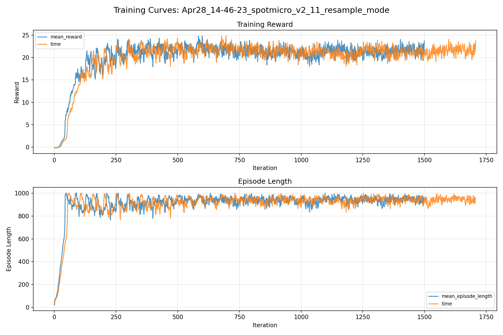
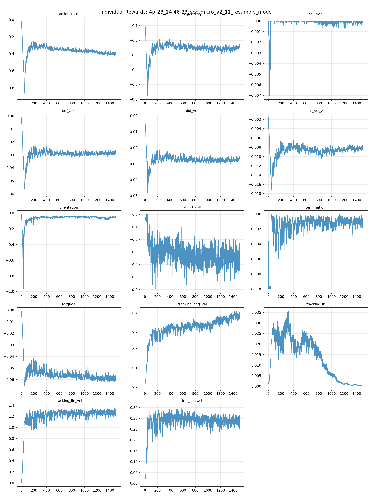
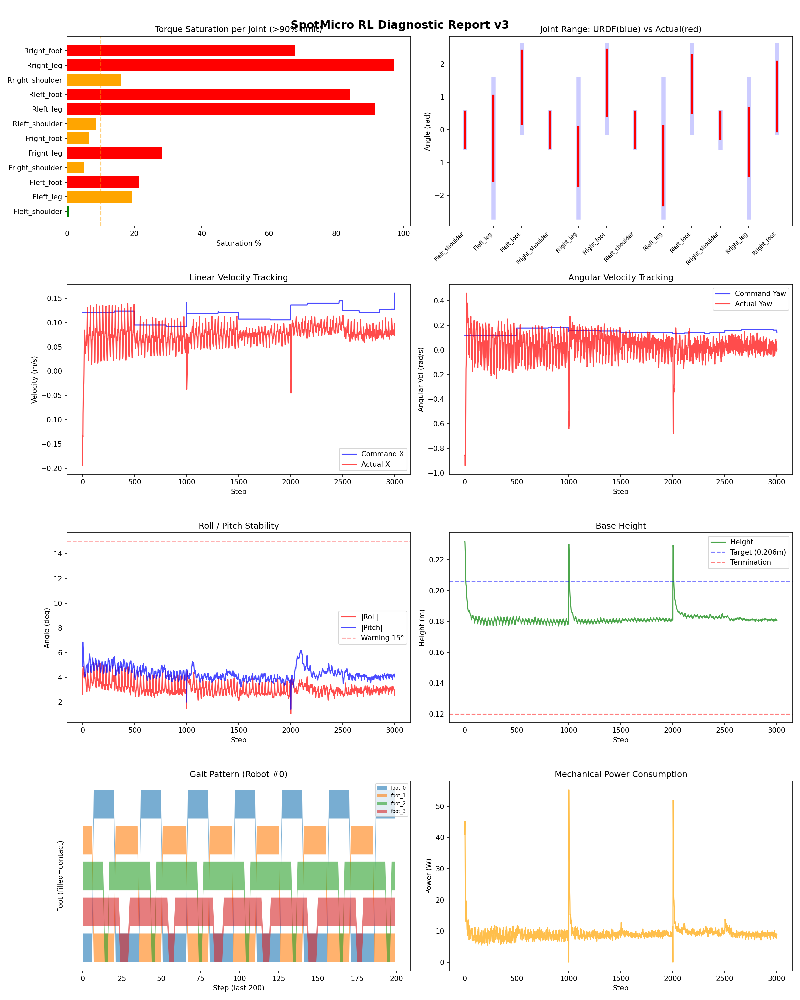
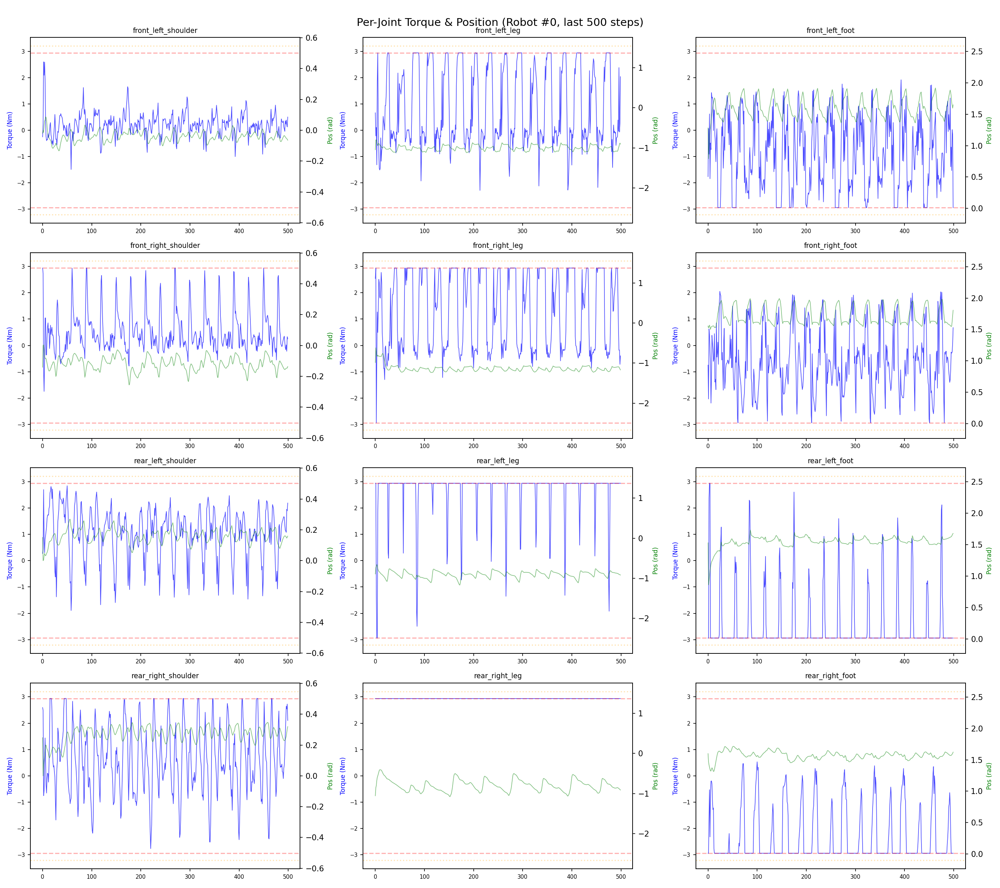
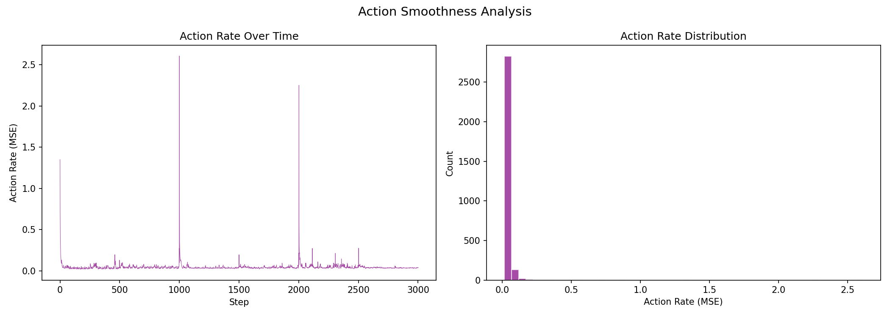

# 실험 023: spotmicro_v2_11_resample_mode

- **날짜:** 2026-04-28 15:16
- **Task:** spotmicro_test
- **Run name:** `spotmicro_v2_11_resample_mode`
- **판정:** ✅ PASS

---

## 실험 목적

V2.11: 여러 경우의 동작을 mode로 구분하여 학습시킴

---

## 변경점 (이전 커밋 대비)

```diff
diff --git a/ai_training/rl/legged_gym/legged_gym/envs/spotmicro_test/spotmicro_test.py b/ai_training/rl/legged_gym/legged_gym/envs/spotmicro_test/spotmicro_test.py
index 054d51c..0385fc1 100644
--- a/ai_training/rl/legged_gym/legged_gym/envs/spotmicro_test/spotmicro_test.py
+++ b/ai_training/rl/legged_gym/legged_gym/envs/spotmicro_test/spotmicro_test.py
@@ -140,7 +140,8 @@ class SpotmicroTest(LeggedRobot):
         base_height = self.root_states[:, 2]
         self.reset_buf |= (base_height < 0.155)
         self.reset_buf |= (self.projected_gravity[:, 2] > 0.0)
-        
+    
+    '''
     def _resample_commands(self, env_ids):
         self.commands[env_ids, 0] = torch_rand_float(
             self.command_ranges["lin_vel_x"][0], self.command_ranges["lin_vel_x"][1],
@@ -157,6 +158,37 @@ class SpotmicroTest(LeggedRobot):
                 self.command_ranges["ang_vel_yaw"][0], self.command_ranges["ang_vel_yaw"][1],
                 (len(env_ids), 1), device=self.device).squeeze(1)
         self.commands[env_ids, :2] *= (torch.norm(self.commands[env_ids, :2], dim=1) > 0.05).unsqueeze(1)
+    '''
+    def _resample_commands(self, env_ids):
+        n = len(env_ids)
+        r = torch.rand(n, device=self.device)
+
+        vx = torch.zeros(n, device=self.device)
+        vy = torch.zeros(n, device=self.device)
+        wz = torch.zeros(n, device=self.device)
+
+        # 15%: 완전 정지
+        stand = r < 0.15
+
+        # 35%: 직진 위주
+        forward = (r >= 0.15) & (r < 0.50)
+        vx[forward] = torch_rand_float(0.05, 0.40, (forward.sum(), 1), device=self.device).squeeze(1)
+        wz[forward] = torch_rand_float(-0.10, 0.10, (forward.sum(), 1), device=self.device).squeeze(1)
+
+        # 30%: 제자리 회전
+        turn = (r >= 0.50) & (r < 0.80)
+        wz_abs = torch_rand_float(0.15, 0.40, (turn.sum(), 1), device=self.device).squeeze(1)
+        wz_sign = torch.where(torch.rand(turn.sum(), device=self.device) > 0.5, 1.0, -1.0)
+        wz[turn] = wz_abs * wz_sign
+
+        # 20%: 전진 + 회전 arc
+        arc = r >= 0.80
+        vx[arc] = torch_rand_float(0.05, 0.35, (arc.sum(), 1), device=self.device).squeeze(1)
+        wz[arc] = torch_rand_float(-0.40, 0.40, (arc.sum(), 1), device=self.device).squeeze(1)
+
+        self.commands[env_ids, 0] = vx
+        self.commands[env_ids, 1] = vy
+        self.commands[env_ids, 2] = wz
         
     def compute_observations(self):
         ref_dof_pos = self._get_ik_target()
diff --git a/ai_training/rl/legged_gym/legged_gym/envs/spotmicro_test/spotmicro_test_config.py b/ai_training/rl/legged_gym/legged_gym/envs/spotmicro_test/spotmicro_test_config.py
index 2ca683e..fbeee8e 100644
--- a/ai_training/rl/legged_gym/legged_gym/envs/spotmicro_test/spotmicro_test_config.py
+++ b/ai_training/rl/legged_gym/legged_gym/envs/spotmicro_test/spotmicro_test_config.py
@@ -123,7 +123,7 @@ class SpotmicroTestCfgPPO(LeggedRobotCfgPPO):
         entropy_coef = 0.01
 
     class runner(LeggedRobotCfgPPO.runner):
-        run_name 
```

**변경 요약:**
  + '''
  + '''
  + def _resample_commands(self, env_ids):
  + n = len(env_ids)
  + r = torch.rand(n, device=self.device)
  + vx = torch.zeros(n, device=self.device)
  + vy = torch.zeros(n, device=self.device)
  + wz = torch.zeros(n, device=self.device)
  + stand = r < 0.15
  + forward = (r >= 0.15) & (r < 0.50)
  + vx[forward] = torch_rand_float(0.05, 0.40, (forward.sum(), 1), device=self.device).squeeze(1)
  + wz[forward] = torch_rand_float(-0.10, 0.10, (forward.sum(), 1), device=self.device).squeeze(1)
  + turn = (r >= 0.50) & (r < 0.80)
  + wz_abs = torch_rand_float(0.15, 0.40, (turn.sum(), 1), device=self.device).squeeze(1)
  + wz_sign = torch.where(torch.rand(turn.sum(), device=self.device) > 0.5, 1.0, -1.0)
  + wz[turn] = wz_abs * wz_sign
  + arc = r >= 0.80
  + vx[arc] = torch_rand_float(0.05, 0.35, (arc.sum(), 1), device=self.device).squeeze(1)
  + wz[arc] = torch_rand_float(-0.40, 0.40, (arc.sum(), 1), device=self.device).squeeze(1)
  + self.commands[env_ids, 0] = vx
  + self.commands[env_ids, 1] = vy
  + self.commands[env_ids, 2] = wz
  - run_name = 'spotmicro_v2_10_ang_improve'
  + run_name = 'spotmicro_v2_11_resample_mode'

---

## 현재 Reward Scales

| Reward | Scale |
|--------|-------|
| action_rate | -0.05 |
| ang_vel_xy | -0.4 |
| collision | -1.0 |
| dof_acc | -2.5e-07 |
| dof_vel | -0.001 |
| lin_vel_z | -2.0 |
| orientation | -6.0 |
| stand_still | -0.5 |
| termination | -10.0 |
| torques | -0.001 |
| tracking_ang_vel | 1.3 |
| tracking_ik | 1.0 |
| tracking_lin_vel | 1.5 |
| trot_contact | 0.5 |

---

## 진단 결과 (Diagnostic)

### 핵심 지표

- ✅ Timeout: 96.2% (≥80%)
- ✅ 속도오차 X: 0.0744 m/s (<0.08)
- ⚠️ 토크포화: 37.2% (10~40%)
- ✅ 자세: roll 3.1°, pitch 4.3° (안정)
- ✅ 조기종료: 0.0% (<5%)

### 상세 수치

| 지표 | 값 |
|------|-----|
| Timeout% | 96.2406015037594 |
| 조기종료% | 0.0 |
| 속도오차 X | 0.07440464198589325 m/s |
| 속도오차 Y | 0.035436224192380905 m/s |
| 각속도오차 | 0.22734344005584717 rad/s |
| 토크포화% | 37.19249500499501 |
| 평균 높이 | 0.18182292650570045 m |
| Roll (평균) | 3.1162965297698975° |
| Pitch (평균) | 4.310858726501465° |
| Action Rate | 0.044919587671756744 |
| 평균 전력 | 9.319442749023438 W |
| CoT | 4.821681451364142 |


## 학습 곡선 분석

| 지표 | 값 | 판정 |
|------|-----|------|
| 수렴 iter (90%) | 212 | 빠름 |
| 후반 안정성 (CV) | 0.047 | 안정 |
| 정체 구간 | 없음 | |


## Per-leg 분석

### 발별 접촉/공중 비율

| 발 | 접촉% | 공중% |
|-----|-------|------|
| foot_0 | 52.5% | 47.5% |
| foot_1 | 50.4% | 49.6% |
| foot_2 | 91.0% | 9.0% |
| foot_3 | 83.0% | 17.0% |

### 관절별 토크 포화

| 관절 | 포화% | 최대토크 | 한계 | 상태 |
|------|------|---------|------|------|
| front_left_shoulder | 0.4% | 2.940 | 2.940 | ✅ |
| front_left_leg | 19.4% | 2.940 | 2.940 | ⚠️ |
| front_left_foot | 21.3% | 2.940 | 2.940 | ❌ |
| front_right_shoulder | 5.1% | 2.940 | 2.940 | ⚠️ |
| front_right_leg | 28.2% | 2.940 | 2.940 | ❌ |
| front_right_foot | 6.4% | 2.940 | 2.940 | ⚠️ |
| rear_left_shoulder | 8.5% | 2.940 | 2.940 | ⚠️ |
| rear_left_leg | 91.6% | 2.940 | 2.940 | ❌ |
| rear_left_foot | 84.2% | 2.940 | 2.940 | ❌ |
| rear_right_shoulder | 16.1% | 2.940 | 2.940 | ⚠️ |
| rear_right_leg | 97.2% | 2.940 | 2.940 | ❌ |
| rear_right_foot | 67.9% | 2.940 | 2.940 | ❌ |


## Gait 분석

| 지표 | 값 |
|------|-----|
| Gait 주파수 | 0.41 Hz |
| Gait 주기 | 30 steps |
| 대각 동기화율 | 63.2% |
| L/R 비대칭 | 0.0%p |
| 판정 | ⚠️ 부분적 Trot / ✅ 대칭 |


## 관절별 상세

| 관절 | 토크포화% | 사용범위% | 편향(rad) | 한계근접% | 상태 |
|------|----------|----------|----------|----------|------|
| front_left_shoulder | 0.4% | 100% | -0.000 | 8.6% | ✅ |
| front_left_leg | 19.4% | 61% | -0.258 | 0.0% | ⚠️ |
| front_left_foot | 21.3% | 83% | +1.300 | 0.6% | ⚠️ |
| front_right_shoulder | 5.1% | 100% | -0.001 | 1.1% | ✅ |
| front_right_leg | 28.2% | 42% | -0.810 | 0.0% | ⚠️ |
| front_right_foot | 6.4% | 75% | +1.428 | 0.0% | ⚠️ |
| rear_left_shoulder | 8.5% | 102% | -0.002 | 0.6% | ✅ |
| rear_left_leg | 91.6% | 57% | -1.097 | 0.0% | ⚠️ |
| rear_left_foot | 84.2% | 65% | +1.394 | 0.0% | ⚠️ |
| rear_right_shoulder | 16.1% | 75% | +0.141 | 0.5% | ⚠️ |
| rear_right_leg | 97.2% | 49% | -0.378 | 0.0% | ⚠️ |
| rear_right_foot | 67.9% | 79% | +1.014 | 0.0% | ⚠️ |


## 에너지 효율 상세

| 지표 | 값 |
|------|-----|
| 평균 전력 | 9.32 W |
| 피크 전력 | 55.26 W |
| 피크/평균 비율 | 5.9x |
| CoT | 4.82 |

### 관절별 전력 분배

| 관절 | 평균전력(W) | 비율% |
|------|-----------|-------|
| rear_right_leg | 1.628 | 17.5% |
| front_left_foot | 1.318 | 14.1% |
| rear_left_foot | 1.138 | 12.2% |
| rear_right_foot | 0.997 | 10.7% |
| rear_left_leg | 0.993 | 10.7% |
| front_right_foot | 0.936 | 10.0% |
| front_right_leg | 0.805 | 8.6% |
| front_left_leg | 0.501 | 5.4% |
| rear_right_shoulder | 0.461 | 4.9% |
| rear_left_shoulder | 0.266 | 2.9% |
| front_right_shoulder | 0.179 | 1.9% |
| front_left_shoulder | 0.099 | 1.1% |


## 이전 실험 대비 비교

| 지표 | 이전 (exp022) | 현재 (exp023) | 변화 |
|------|-------|-------|------|
| Timeout% | 98.5% | 96.2% | ⚠️ ↓ 2.2209% |
| 속도오차 X | 0.0470 | 0.0744 | ⚠️ ↑ 0.0274m/s |
| 토크포화 | 17.6% | 37.2% | ⚠️ ↑ 19.5736% |
| Roll | 1.8° | 3.1° | ⚠️ ↑ 1.2797° |
| Pitch | 1.8° | 4.3° | ⚠️ ↑ 2.5046° |
| 평균 전력 | 8.1421W | 9.3194W | ⚠️ ↑ 1.1774W |


## Tensorboard 학습 곡선 요약

| 스칼라 | 최종값 | 최대 | 최소 | 후반10% 평균 |
|--------|--------|------|------|-------------|
| rew_action_rate | -0.3904 | -0.0144 | -0.8925 | -0.3988 |
| rew_ang_vel_xy | -0.2309 | -0.0682 | -0.5770 | -0.2522 |
| rew_collision | -0.0000 | 0.0000 | -0.0070 | -0.0001 |
| rew_dof_acc | -0.0276 | -0.0013 | -0.0589 | -0.0288 |
| rew_dof_vel | -0.0268 | -0.0012 | -0.0479 | -0.0276 |
| rew_lin_vel_z | -0.0077 | -0.0016 | -0.0177 | -0.0083 |
| rew_orientation | -0.0461 | -0.0160 | -0.9701 | -0.0566 |
| rew_stand_still | -0.2316 | 0.0000 | -0.5966 | -0.3391 |
| rew_termination | -0.0008 | -0.0001 | -0.0100 | -0.0009 |
| rew_torques | -0.0591 | -0.0008 | -0.0655 | -0.0592 |
| rew_tracking_ang_vel | 0.4007 | 0.4108 | 0.0015 | 0.3835 |
| rew_tracking_ik | 0.0002 | 0.0356 | 0.0002 | 0.0005 |
| rew_tracking_lin_vel | 1.2843 | 1.3529 | 0.0068 | 1.2738 |
| rew_trot_contact | 0.3130 | 0.3488 | 0.0032 | 0.2909 |
| learning_rate | 0.0003 | 0.0076 | 0.0000 | 0.0005 |
| surrogate | -0.0046 | 0.0004 | -0.0106 | -0.0052 |
| value_function | 0.0345 | 0.0505 | 0.0013 | 0.0294 |
| collection time | 0.8312 | 1.1587 | 0.7919 | 0.8375 |
| learning_time | 0.2859 | 0.3754 | 0.2793 | 0.2882 |
| total_fps | 88000.0000 | 91086.0000 | 67132.0000 | 87351.1333 |
| mean_noise_std | 0.5836 | 1.0079 | 0.5294 | 0.5810 |
| mean_episode_length | 957.0900 | 1002.0000 | 20.6800 | 947.9635 |
| time | 957.0900 | 1002.0000 | 20.6800 | 947.9635 |
| mean_reward | 23.7313 | 24.8241 | -0.1724 | 21.6190 |
| time | 23.7313 | 24.8241 | -0.1724 | 21.6190 |

총 학습 iteration: 1499


---

## 그래프

### Tensorboard 학습 곡선



### Diagnostic 결과





---

## 결론 및 다음 실험 방향

**자동 판정:** ✅ PASS

대부분 기준을 통과했으나 일부 항목이 보통 수준입니다.
  - ⚠️ 토크포화: 37.2% (10~40%)

> 💡 위 결론은 자동 생성되었습니다. 필요시 수정하세요.

---

## 메모

_(추가 메모가 있으면 여기에 작성)_

