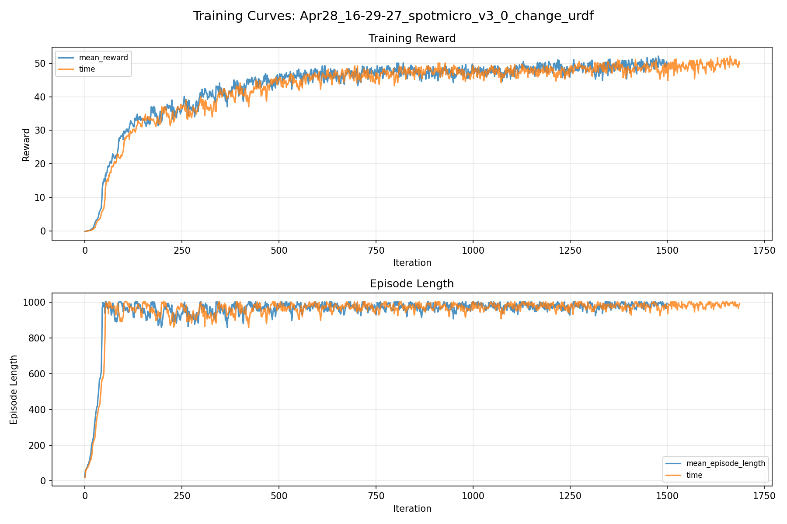
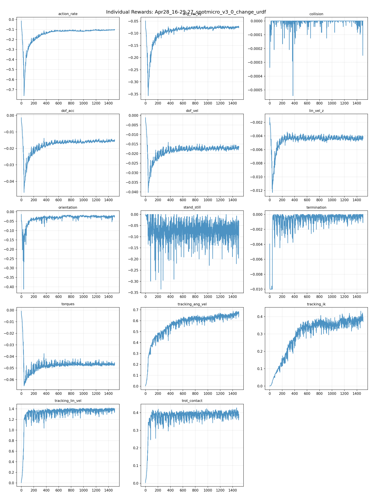
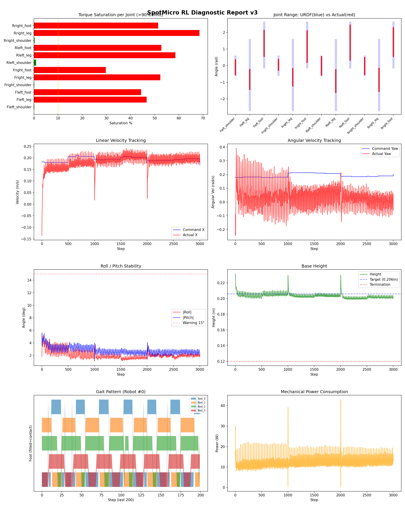
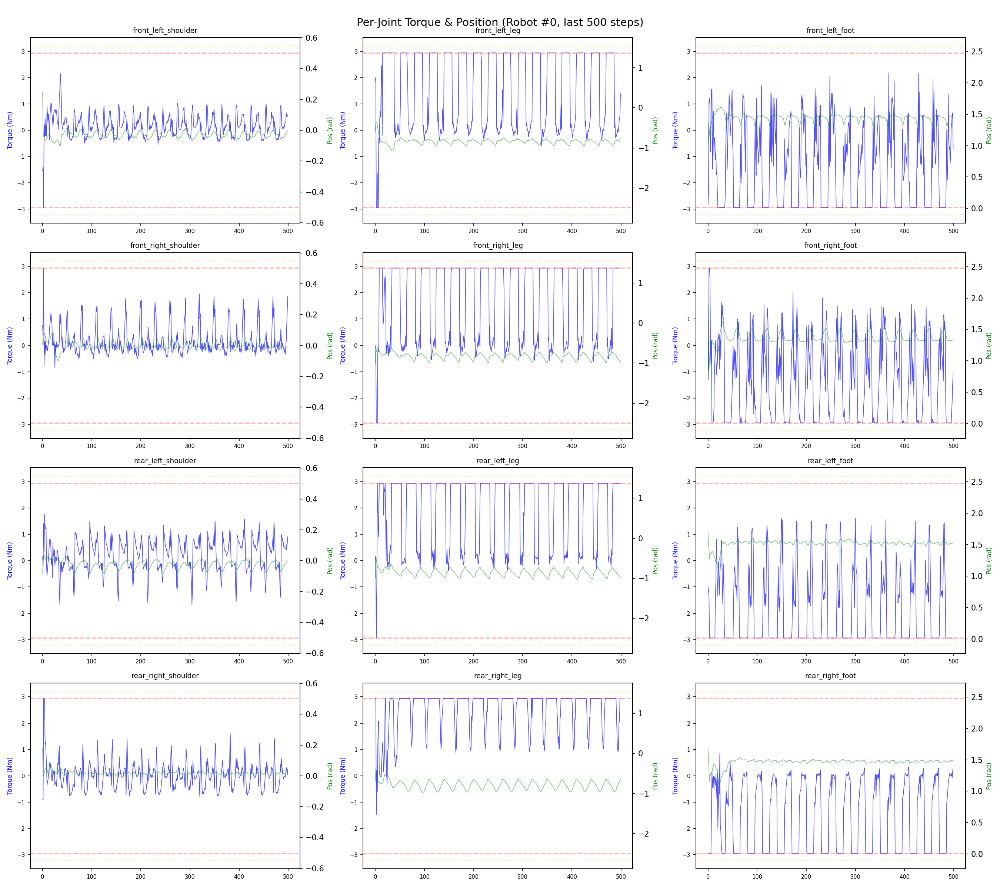
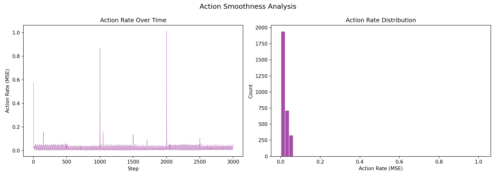

# 실험 024: spotmicro_v3_0_change_urdf

- **날짜:** 2026-04-28 16:59
- **Task:** spotmicro_test
- **Run name:** `spotmicro_v3_0_change_urdf`
- **판정:** ✅ PASS

---

## 실험 목적

V3.0: urdf 실제 무게 반영

---

## 변경점 (이전 커밋 대비)

```diff
diff --git a/ai_training/rl/legged_gym/legged_gym/envs/spotmicro_test/spotmicro_test_config.py b/ai_training/rl/legged_gym/legged_gym/envs/spotmicro_test/spotmicro_test_config.py
index fbeee8e..3088f52 100644
--- a/ai_training/rl/legged_gym/legged_gym/envs/spotmicro_test/spotmicro_test_config.py
+++ b/ai_training/rl/legged_gym/legged_gym/envs/spotmicro_test/spotmicro_test_config.py
@@ -123,7 +123,7 @@ class SpotmicroTestCfgPPO(LeggedRobotCfgPPO):
         entropy_coef = 0.01
 
     class runner(LeggedRobotCfgPPO.runner):
-        run_name = 'spotmicro_v2_11_resample_mode'
+        run_name = 'spotmicro_v3_0_change_urdf'
         experiment_name = 'spotmicro_test'
         max_iterations = 1500
         save_interval = 100
```

**변경 요약:**
  - run_name = 'spotmicro_v2_11_resample_mode'
  + run_name = 'spotmicro_v3_0_change_urdf'

---

## 현재 Reward Scales

| Reward | Scale |
|--------|-------|
| action_rate | -0.05 |
| ang_vel_xy | -0.4 |
| collision | -1.0 |
| dof_acc | -2.5e-07 |
| dof_vel | -0.001 |
| lin_vel_z | -2.0 |
| orientation | -6.0 |
| stand_still | -0.5 |
| termination | -10.0 |
| torques | -0.001 |
| tracking_ang_vel | 1.3 |
| tracking_ik | 1.0 |
| tracking_lin_vel | 1.5 |
| trot_contact | 0.5 |

---

## 진단 결과 (Diagnostic)

### 핵심 지표

- ✅ Timeout: 97.7% (≥80%)
- ✅ 속도오차 X: 0.0528 m/s (<0.08)
- ⚠️ 토크포화: 33.8% (10~40%)
- ✅ 자세: roll 2.1°, pitch 2.8° (안정)
- ✅ 조기종료: 0.8% (<5%)

### 상세 수치

| 지표 | 값 |
|------|-----|
| Timeout% | 97.70992366412213 |
| 조기종료% | 0.7633587786259541 |
| 속도오차 X | 0.05282993242144585 m/s |
| 속도오차 Y | 0.03721718117594719 m/s |
| 각속도오차 | 0.18011033535003662 rad/s |
| 토크포화% | 33.8096799034299 |
| 평균 높이 | 0.20374793596776614 m |
| Roll (평균) | 2.0891196727752686° |
| Pitch (평균) | 2.7976951599121094° |
| Action Rate | 0.021524515002965927 |
| 평균 전력 | 12.362709999084473 W |
| CoT | 2.6573510651056442 |

        ## Command Mode별 회전 추종 분석

        | 모드 | 비율 | 샘플 수 | 평균 abs(cmd_wz) | 평균 abs(actual_wz) | yaw 오차 | 상태 |
        |------|------|---------|------------------|---------------------|----------|------|
        | 정지 | 0.6% | 1153 | 0.0331 | 0.2718 | 0.2732 | ❌ |
| 직진/저회전 | 33.9% | 65122 | 0.0702 | 0.1907 | 0.1789 | ❌ |
| 제자리 회전 | 7.8% | 15021 | 0.2576 | 0.2720 | 0.1500 | ❌ |
| 전진+회전 | 54.1% | 103892 | 0.2677 | 0.2796 | 0.1827 | ❌ |
| 큰 회전명령 | 22.3% | 42846 | 0.3528 | 0.3247 | 0.1766 | ❌ |

        > 해석 기준: `제자리 회전`만 나쁘면 pure turn 학습/보행 패턴 문제, `큰 회전명령`만 나쁘면 yaw 명령 범위가 현재 토크/보폭 한계보다 큰 문제, `정지`가 나쁘면 stop drift 문제로 보면 됩니다.
        


## 학습 곡선 분석

| 지표 | 값 | 판정 |
|------|-----|------|
| 수렴 iter (90%) | 519 | 보통 |
| 후반 안정성 (CV) | 0.029 | 안정 |
| 정체 구간 | 없음 | |


## Per-leg 분석

### 발별 접촉/공중 비율

| 발 | 접촉% | 공중% |
|-----|-------|------|
| foot_0 | 56.0% | 44.0% |
| foot_1 | 62.0% | 38.0% |
| foot_2 | 68.3% | 31.7% |
| foot_3 | 60.3% | 39.7% |

### 관절별 토크 포화

| 관절 | 포화% | 최대토크 | 한계 | 상태 |
|------|------|---------|------|------|
| front_left_shoulder | 0.1% | 2.940 | 2.940 | ✅ |
| front_left_leg | 46.6% | 2.940 | 2.940 | ❌ |
| front_left_foot | 44.4% | 2.940 | 2.940 | ❌ |
| front_right_shoulder | 0.1% | 2.940 | 2.940 | ✅ |
| front_right_leg | 52.3% | 2.940 | 2.940 | ❌ |
| front_right_foot | 29.8% | 2.940 | 2.940 | ❌ |
| rear_left_shoulder | 0.9% | 2.940 | 2.940 | ✅ |
| rear_left_leg | 58.5% | 2.940 | 2.940 | ❌ |
| rear_left_foot | 52.7% | 2.940 | 2.940 | ❌ |
| rear_right_shoulder | 0.3% | 2.940 | 2.940 | ✅ |
| rear_right_leg | 68.5% | 2.940 | 2.940 | ❌ |
| rear_right_foot | 51.4% | 2.940 | 2.940 | ❌ |


## Gait 분석

| 지표 | 값 |
|------|-----|
| Gait 주파수 | 0.42 Hz |
| Gait 주기 | 30 steps |
| 대각 동기화율 | 80.7% |
| L/R 비대칭 | 0.0%p |
| 판정 | ✅ Trot 패턴 / ✅ 대칭 |


## 관절별 상세

| 관절 | 토크포화% | 사용범위% | 편향(rad) | 한계근접% | 상태 |
|------|----------|----------|----------|----------|------|
| front_left_shoulder | 0.1% | 83% | -0.094 | 0.0% | ✅ |
| front_left_leg | 46.6% | 29% | -0.828 | 0.0% | ⚠️ |
| front_left_foot | 44.4% | 58% | +1.344 | 0.0% | ⚠️ |
| front_right_shoulder | 0.1% | 61% | +0.046 | 0.0% | ✅ |
| front_right_leg | 52.3% | 25% | -0.704 | 0.0% | ⚠️ |
| front_right_foot | 29.8% | 71% | +1.149 | 0.0% | ⚠️ |
| rear_left_shoulder | 0.9% | 101% | -0.016 | 0.5% | ✅ |
| rear_left_leg | 58.5% | 33% | -0.923 | 0.0% | ⚠️ |
| rear_left_foot | 52.7% | 79% | +1.383 | 0.2% | ⚠️ |
| rear_right_shoulder | 0.3% | 94% | -0.024 | 0.0% | ✅ |
| rear_right_leg | 68.5% | 33% | -0.850 | 0.0% | ⚠️ |
| rear_right_foot | 51.4% | 65% | +1.424 | 0.0% | ⚠️ |


## 에너지 효율 상세

| 지표 | 값 |
|------|-----|
| 평균 전력 | 12.36 W |
| 피크 전력 | 42.96 W |
| 피크/평균 비율 | 3.5x |
| CoT | 2.66 |

### 관절별 전력 분배

| 관절 | 평균전력(W) | 비율% |
|------|-----------|-------|
| front_left_foot | 1.978 | 16.0% |
| rear_right_leg | 1.975 | 16.0% |
| rear_left_foot | 1.756 | 14.2% |
| front_right_foot | 1.629 | 13.2% |
| rear_right_foot | 1.305 | 10.6% |
| rear_left_leg | 1.269 | 10.3% |
| front_right_leg | 1.133 | 9.2% |
| front_left_leg | 0.892 | 7.2% |
| rear_left_shoulder | 0.126 | 1.0% |
| front_right_shoulder | 0.111 | 0.9% |
| rear_right_shoulder | 0.099 | 0.8% |
| front_left_shoulder | 0.090 | 0.7% |


## 이전 실험 대비 비교

| 지표 | 이전 (exp023) | 현재 (exp024) | 변화 |
|------|-------|-------|------|
| Timeout% | 96.2% | 97.7% | ✅ ↑ 1.4693% |
| 속도오차 X | 0.0744 | 0.0528 | ✅ ↓ 0.0216m/s |
| 토크포화 | 37.2% | 33.8% | ✅ ↓ 3.3828% |
| Roll | 3.1° | 2.1° | ✅ ↓ 1.0272° |
| Pitch | 4.3° | 2.8° | ✅ ↓ 1.5132° |
| 평균 전력 | 9.3194W | 12.3627W | ⚠️ ↑ 3.0433W |


## Tensorboard 학습 곡선 요약

| 스칼라 | 최종값 | 최대 | 최소 | 후반10% 평균 |
|--------|--------|------|------|-------------|
| rew_action_rate | -0.1026 | -0.0146 | -0.7623 | -0.1052 |
| rew_ang_vel_xy | -0.0770 | -0.0494 | -0.3570 | -0.0762 |
| rew_collision | 0.0000 | 0.0000 | -0.0005 | -0.0000 |
| rew_dof_acc | -0.0147 | -0.0013 | -0.0467 | -0.0155 |
| rew_dof_vel | -0.0162 | -0.0012 | -0.0403 | -0.0170 |
| rew_lin_vel_z | -0.0041 | -0.0013 | -0.0123 | -0.0044 |
| rew_orientation | -0.0221 | -0.0135 | -0.4127 | -0.0260 |
| rew_stand_still | -0.0929 | 0.0000 | -0.3352 | -0.0760 |
| rew_termination | -0.0004 | 0.0000 | -0.0100 | -0.0003 |
| rew_torques | -0.0457 | -0.0009 | -0.0655 | -0.0468 |
| rew_tracking_ang_vel | 0.6487 | 0.6879 | 0.0021 | 0.6572 |
| rew_tracking_ik | 0.3702 | 0.4313 | 0.0011 | 0.3799 |
| rew_tracking_lin_vel | 1.3489 | 1.4203 | 0.0061 | 1.3839 |
| rew_trot_contact | 0.3714 | 0.4271 | 0.0036 | 0.3957 |
| learning_rate | 0.0006 | 0.0100 | 0.0000 | 0.0004 |
| surrogate | -0.0040 | 0.0031 | -0.0076 | -0.0037 |
| value_function | 0.0203 | 0.0557 | 0.0033 | 0.0227 |
| collection time | 0.8344 | 0.9837 | 0.7854 | 0.8270 |
| learning_time | 0.2882 | 0.3612 | 0.2722 | 0.2883 |
| total_fps | 87568.0000 | 91665.0000 | 77088.0000 | 88163.6200 |
| mean_noise_std | 0.2616 | 1.0013 | 0.2574 | 0.2630 |
| mean_episode_length | 992.1900 | 1002.0000 | 21.8500 | 984.6930 |
| time | 992.1900 | 1002.0000 | 21.8500 | 984.6930 |
| mean_reward | 49.7735 | 52.1162 | -0.1517 | 49.5106 |
| time | 49.7735 | 52.1162 | -0.1517 | 49.5106 |

총 학습 iteration: 1499


---

## 그래프

### Tensorboard 학습 곡선



### Diagnostic 결과





---

## 결론 및 다음 실험 방향

**자동 판정:** ✅ PASS

대부분 기준을 통과했으나 일부 항목이 보통 수준입니다.
  - ⚠️ 토크포화: 33.8% (10~40%)

> 💡 위 결론은 자동 생성되었습니다. 필요시 수정하세요.

---

## 메모

_(추가 메모가 있으면 여기에 작성)_

