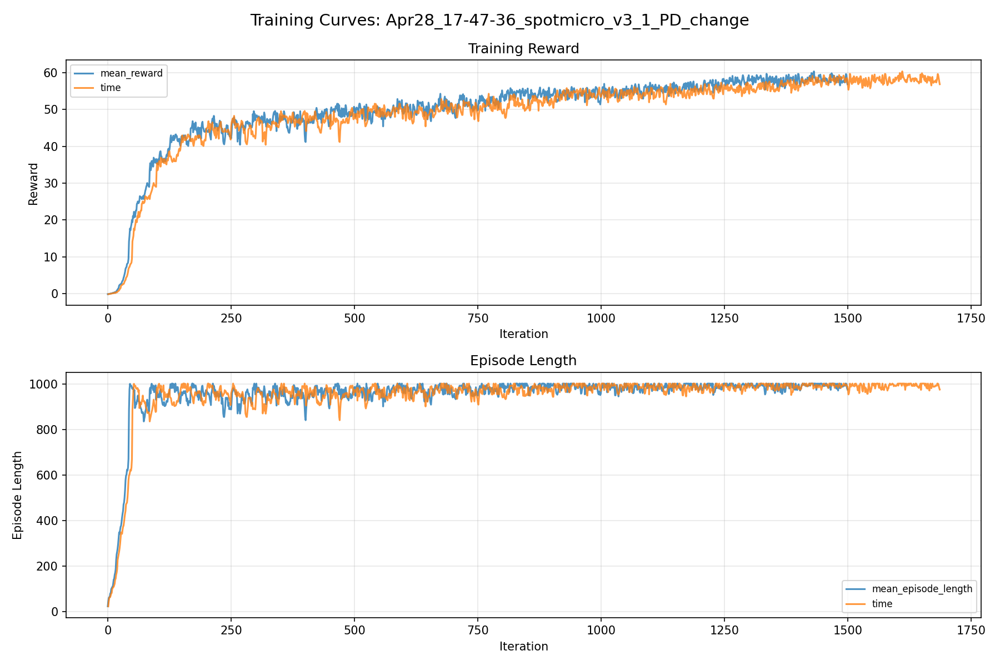
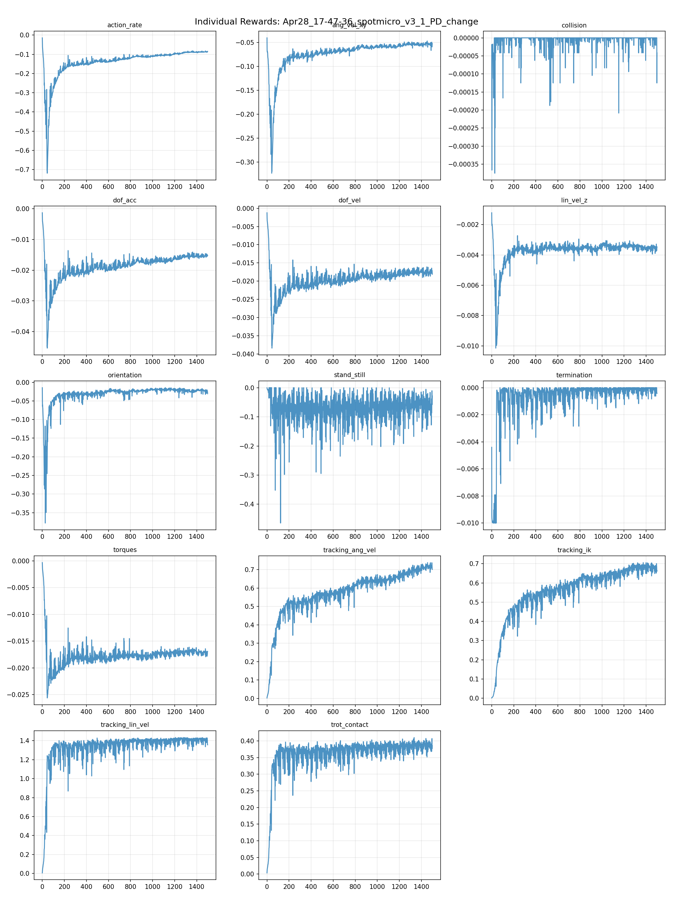
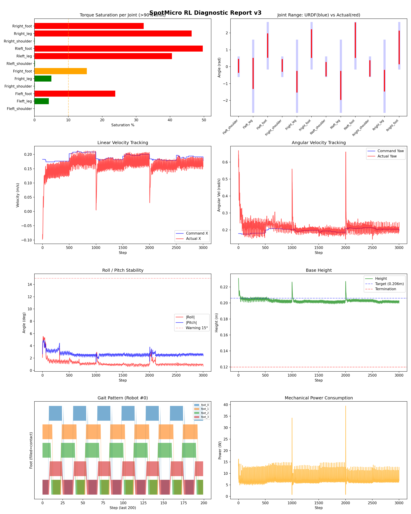
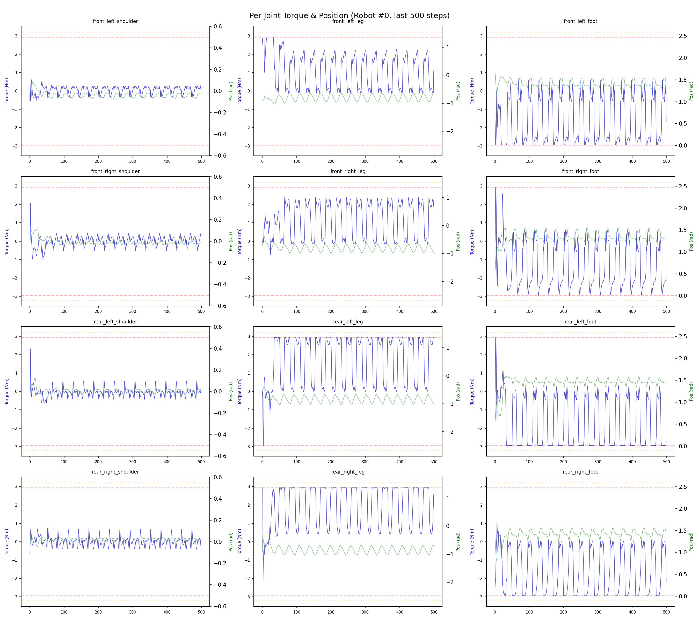
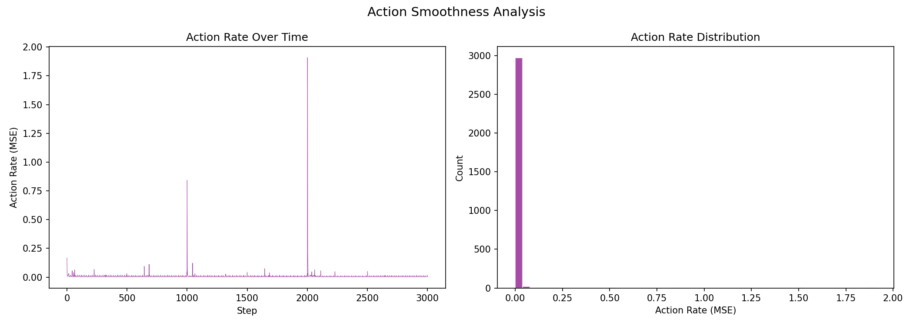

# 실험 025: spotmicro_v3_1_PD_change

- **날짜:** 2026-04-28 18:17
- **Task:** spotmicro_test
- **Run name:** `spotmicro_v3_1_PD_change`
- **판정:** ✅ PASS

---

## 실험 목적

V3.1: urdf 변경으로 인한 변경점을 보정하기 위한 PD 변경.

---

## 변경점 (이전 커밋 대비)

```diff
diff --git a/ai_training/rl/legged_gym/legged_gym/envs/spotmicro_test/spotmicro_test.py b/ai_training/rl/legged_gym/legged_gym/envs/spotmicro_test/spotmicro_test.py
index f21fdf1..c737d39 100644
--- a/ai_training/rl/legged_gym/legged_gym/envs/spotmicro_test/spotmicro_test.py
+++ b/ai_training/rl/legged_gym/legged_gym/envs/spotmicro_test/spotmicro_test.py
@@ -302,7 +302,7 @@ class SpotmicroTest(LeggedRobot):
         # action에 가중치를 곱해서 에러 계산
         weighted_actions = self.actions * weights
         error = torch.sum(torch.square(weighted_actions), dim=1)
-        sigma = 2.0 
+        sigma = 3.5 
         return torch.exp(-error / sigma)
         
     def _reward_tracking_ang_vel(self):
diff --git a/ai_training/rl/legged_gym/legged_gym/envs/spotmicro_test/spotmicro_test_config.py b/ai_training/rl/legged_gym/legged_gym/envs/spotmicro_test/spotmicro_test_config.py
index 3088f52..8acc0f4 100644
--- a/ai_training/rl/legged_gym/legged_gym/envs/spotmicro_test/spotmicro_test_config.py
+++ b/ai_training/rl/legged_gym/legged_gym/envs/spotmicro_test/spotmicro_test_config.py
@@ -32,9 +32,9 @@ class SpotmicroTestCfg(LeggedRobotCfg):
 
     class control(LeggedRobotCfg.control):
         control_type = 'P'
-        stiffness = {'shoulder': 20.0, 'leg': 20.0, 'foot': 20.0}
-        damping = {'shoulder': 0.5, 'leg': 0.5, 'foot': 0.5}
-        action_scale = 0.22
+        stiffness = {'shoulder': 8.0, 'leg': 8.0, 'foot': 8.0}
+        damping = {'shoulder': 0.2, 'leg': 0.2, 'foot': 0.2}
+        action_scale = 0.35
         decimation = 4
 
     class asset(LeggedRobotCfg.asset):
@@ -54,8 +54,8 @@ class SpotmicroTestCfg(LeggedRobotCfg):
             termination = -10.0
             lin_vel_z = -2.0
             ang_vel_xy = -0.4
-            orientation = -6.0
-            torques = -0.001
+            orientation = -8.0
+            torques = -0.0005
             dof_vel = -0.001
             dof_acc = -2.5e-7
             action_rate = -0.05
@@ -123,7 +123,7 @@ class SpotmicroTestCfgPPO(LeggedRobotCfgPPO):
         entropy_coef = 0.01
 
     class runner(LeggedRobotCfgPPO.runner):
-        run_name = 'spotmicro_v3_0_change_urdf'
+        run_name = 'spotmicro_v3_1_PD_change'
         experiment_name = 'spotmicro_test'
         max_iterations = 1500
         save_interval = 100
```

**변경 요약:**
  - sigma = 2.0
  + sigma = 3.5
  - stiffness = {'shoulder': 20.0, 'leg': 20.0, 'foot': 20.0}
  - damping = {'shoulder': 0.5, 'leg': 0.5, 'foot': 0.5}
  - action_scale = 0.22
  + stiffness = {'shoulder': 8.0, 'leg': 8.0, 'foot': 8.0}
  + damping = {'shoulder': 0.2, 'leg': 0.2, 'foot': 0.2}
  + action_scale = 0.35
  - orientation = -6.0
  - torques = -0.001
  + orientation = -8.0
  + torques = -0.0005
  - run_name = 'spotmicro_v3_0_change_urdf'
  + run_name = 'spotmicro_v3_1_PD_change'

---

## 현재 Reward Scales

| Reward | Scale |
|--------|-------|
| action_rate | -0.05 |
| ang_vel_xy | -0.4 |
| collision | -1.0 |
| dof_acc | -2.5e-07 |
| dof_vel | -0.001 |
| lin_vel_z | -2.0 |
| orientation | -8.0 |
| stand_still | -0.5 |
| termination | -10.0 |
| torques | -0.0005 |
| tracking_ang_vel | 1.3 |
| tracking_ik | 1.0 |
| tracking_lin_vel | 1.5 |
| trot_contact | 0.5 |

---

## 진단 결과 (Diagnostic)

### 핵심 지표

- ✅ Timeout: 92.1% (≥80%)
- ✅ 속도오차 X: 0.0429 m/s (<0.08)
- ⚠️ 토크포화: 18.1% (10~40%)
- ✅ 자세: roll 1.2°, pitch 2.6° (안정)
- ✅ 조기종료: 1.4% (<5%)

### 상세 수치

| 지표 | 값 |
|------|-----|
| Timeout% | 92.08633093525181 |
| 조기종료% | 1.4388489208633095 |
| 속도오차 X | 0.04286655783653259 m/s |
| 속도오차 Y | 0.023275425657629967 m/s |
| 각속도오차 | 0.09977609664201736 rad/s |
| 토크포화% | 18.141927516927517 |
| 평균 높이 | 0.20283699806753572 m |
| Roll (평균) | 1.2035466432571411° |
| Pitch (평균) | 2.6499929428100586° |
| Action Rate | 0.007829658687114716 |
| 평균 전력 | 7.40646505355835 W |
| CoT | 1.8189044266553605 |

## Command Mode별 회전 추종 분석

| 모드 | 비율 | 샘플 수 | 평균 abs(cmd_wz) | 평균 abs(actual_wz) | yaw 오차 | 상태 |
|------|------|---------|------------------|---------------------|----------|------|
| 정지 | 1.2% | 2374 | 0.0264 | 0.1135 | 0.1161 | ❌ |
| 직진/저회전 | 33.4% | 64177 | 0.0689 | 0.1217 | 0.0926 | ⚠️ |
| 제자리 회전 | 8.2% | 15695 | 0.2776 | 0.2711 | 0.1321 | ⚠️ |
| 전진+회전 | 53.4% | 102621 | 0.2773 | 0.2685 | 0.0955 | ⚠️ |
| 큰 회전명령 | 26.8% | 51559 | 0.3487 | 0.3130 | 0.0996 | ⚠️ |

> 해석 기준: `제자리 회전`만 나쁘면 pure turn 학습/보행 패턴 문제, `큰 회전명령`만 나쁘면 yaw 명령 범위가 현재 토크/보폭 한계보다 큰 문제, `정지`가 나쁘면 stop drift 문제로 보면 됩니다.
        


## 학습 곡선 분석

| 지표 | 값 | 판정 |
|------|-----|------|
| 수렴 iter (90%) | 799 | 보통 |
| 후반 안정성 (CV) | 0.037 | 안정 |
| 정체 구간 | 없음 | |


## Per-leg 분석

### 발별 접촉/공중 비율

| 발 | 접촉% | 공중% |
|-----|-------|------|
| foot_0 | 64.0% | 36.0% |
| foot_1 | 66.2% | 33.8% |
| foot_2 | 71.2% | 28.8% |
| foot_3 | 68.1% | 31.9% |

### 관절별 토크 포화

| 관절 | 포화% | 최대토크 | 한계 | 상태 |
|------|------|---------|------|------|
| front_left_shoulder | 0.0% | 2.940 | 2.940 | ✅ |
| front_left_leg | 4.3% | 2.940 | 2.940 | ✅ |
| front_left_foot | 23.9% | 2.940 | 2.940 | ❌ |
| front_right_shoulder | 0.1% | 2.940 | 2.940 | ✅ |
| front_right_leg | 5.0% | 2.940 | 2.940 | ✅ |
| front_right_foot | 15.4% | 2.940 | 2.940 | ⚠️ |
| rear_left_shoulder | 0.2% | 2.940 | 2.940 | ✅ |
| rear_left_leg | 40.6% | 2.940 | 2.940 | ❌ |
| rear_left_foot | 49.7% | 2.940 | 2.940 | ❌ |
| rear_right_shoulder | 0.1% | 2.940 | 2.940 | ✅ |
| rear_right_leg | 46.4% | 2.940 | 2.940 | ❌ |
| rear_right_foot | 32.2% | 2.940 | 2.940 | ❌ |


## Gait 분석

| 지표 | 값 |
|------|-----|
| Gait 주파수 | 0.42 Hz |
| Gait 주기 | 30 steps |
| 대각 동기화율 | 87.3% |
| L/R 비대칭 | 0.0%p |
| 판정 | ✅ Trot 패턴 / ✅ 대칭 |


## 관절별 상세

| 관절 | 토크포화% | 사용범위% | 편향(rad) | 한계근접% | 상태 |
|------|----------|----------|----------|----------|------|
| front_left_shoulder | 0.0% | 70% | +0.048 | 0.0% | ✅ |
| front_left_leg | 4.3% | 42% | -0.397 | 0.0% | ⚠️ |
| front_left_foot | 23.9% | 52% | +1.253 | 0.0% | ⚠️ |
| front_right_shoulder | 0.1% | 63% | +0.071 | 0.0% | ✅ |
| front_right_leg | 5.0% | 29% | -0.889 | 0.0% | ⚠️ |
| front_right_foot | 15.4% | 61% | +1.370 | 0.0% | ⚠️ |
| rear_left_shoulder | 0.2% | 73% | -0.148 | 0.0% | ⚠️ |
| rear_left_leg | 40.6% | 39% | -1.109 | 0.0% | ⚠️ |
| rear_left_foot | 49.7% | 76% | +1.570 | 0.0% | ⚠️ |
| rear_right_shoulder | 0.1% | 83% | -0.104 | 0.0% | ⚠️ |
| rear_right_leg | 46.4% | 29% | -0.829 | 0.0% | ⚠️ |
| rear_right_foot | 32.2% | 72% | +1.141 | 0.0% | ⚠️ |


## 에너지 효율 상세

| 지표 | 값 |
|------|-----|
| 평균 전력 | 7.41 W |
| 피크 전력 | 39.48 W |
| 피크/평균 비율 | 5.3x |
| CoT | 1.82 |

### 관절별 전력 분배

| 관절 | 평균전력(W) | 비율% |
|------|-----------|-------|
| rear_left_foot | 1.220 | 16.5% |
| front_left_foot | 1.162 | 15.7% |
| rear_right_foot | 1.147 | 15.5% |
| front_right_foot | 0.966 | 13.0% |
| rear_right_leg | 0.859 | 11.6% |
| rear_left_leg | 0.742 | 10.0% |
| front_right_leg | 0.579 | 7.8% |
| front_left_leg | 0.542 | 7.3% |
| front_right_shoulder | 0.058 | 0.8% |
| rear_right_shoulder | 0.049 | 0.7% |
| rear_left_shoulder | 0.046 | 0.6% |
| front_left_shoulder | 0.035 | 0.5% |


## 이전 실험 대비 비교

| 지표 | 이전 (exp024) | 현재 (exp025) | 변화 |
|------|-------|-------|------|
| Timeout% | 97.7% | 92.1% | ⚠️ ↓ 5.6236% |
| 속도오차 X | 0.0528 | 0.0429 | ✅ ↓ 0.0100m/s |
| 토크포화 | 33.8% | 18.1% | ✅ ↓ 15.6678% |
| Roll | 2.1° | 1.2° | ✅ ↓ 0.8856° |
| Pitch | 2.8° | 2.6° | ✅ ↓ 0.1477° |
| 평균 전력 | 12.3627W | 7.4065W | ✅ ↓ 4.9562W |


## Tensorboard 학습 곡선 요약

| 스칼라 | 최종값 | 최대 | 최소 | 후반10% 평균 |
|--------|--------|------|------|-------------|
| rew_action_rate | -0.0848 | -0.0146 | -0.7185 | -0.0880 |
| rew_ang_vel_xy | -0.0525 | -0.0403 | -0.3235 | -0.0536 |
| rew_collision | -0.0000 | 0.0000 | -0.0004 | -0.0000 |
| rew_dof_acc | -0.0152 | -0.0013 | -0.0454 | -0.0153 |
| rew_dof_vel | -0.0181 | -0.0012 | -0.0384 | -0.0175 |
| rew_lin_vel_z | -0.0035 | -0.0012 | -0.0101 | -0.0036 |
| rew_orientation | -0.0307 | -0.0145 | -0.3778 | -0.0224 |
| rew_stand_still | -0.0282 | 0.0000 | -0.4644 | -0.0614 |
| rew_termination | -0.0004 | 0.0000 | -0.0100 | -0.0001 |
| rew_torques | -0.0169 | -0.0003 | -0.0256 | -0.0171 |
| rew_tracking_ang_vel | 0.7013 | 0.7386 | 0.0021 | 0.7112 |
| rew_tracking_ik | 0.6635 | 0.7056 | 0.0017 | 0.6776 |
| rew_tracking_lin_vel | 1.3572 | 1.4342 | 0.0058 | 1.4065 |
| rew_trot_contact | 0.3859 | 0.4100 | 0.0037 | 0.3841 |
| learning_rate | 0.0006 | 0.0100 | 0.0000 | 0.0005 |
| surrogate | -0.0037 | 0.0034 | -0.0079 | -0.0046 |
| value_function | 0.0166 | 0.0763 | 0.0035 | 0.0185 |
| collection time | 0.8338 | 1.0144 | 0.7770 | 0.8177 |
| learning_time | 0.2874 | 0.3744 | 0.2745 | 0.2885 |
| total_fps | 87677.0000 | 92869.0000 | 75002.0000 | 88883.0000 |
| mean_noise_std | 0.2437 | 1.0003 | 0.2371 | 0.2433 |
| mean_episode_length | 975.5100 | 1002.0000 | 23.3500 | 991.4466 |
| time | 975.5100 | 1002.0000 | 23.3500 | 991.4466 |
| mean_reward | 56.8814 | 60.3873 | -0.1765 | 58.0801 |
| time | 56.8814 | 60.3873 | -0.1765 | 58.0801 |

총 학습 iteration: 1499


---

## 그래프

### Tensorboard 학습 곡선



### Diagnostic 결과





---

## 결론 및 다음 실험 방향

**자동 판정:** ✅ PASS

대부분 기준을 통과했으나 일부 항목이 보통 수준입니다.
  - ⚠️ 토크포화: 18.1% (10~40%)

> 💡 위 결론은 자동 생성되었습니다. 필요시 수정하세요.

---

## 메모

_(추가 메모가 있으면 여기에 작성)_

