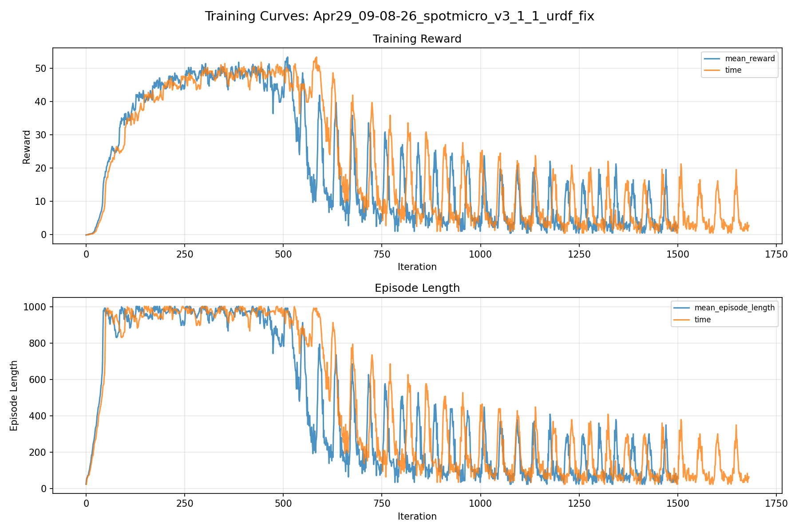
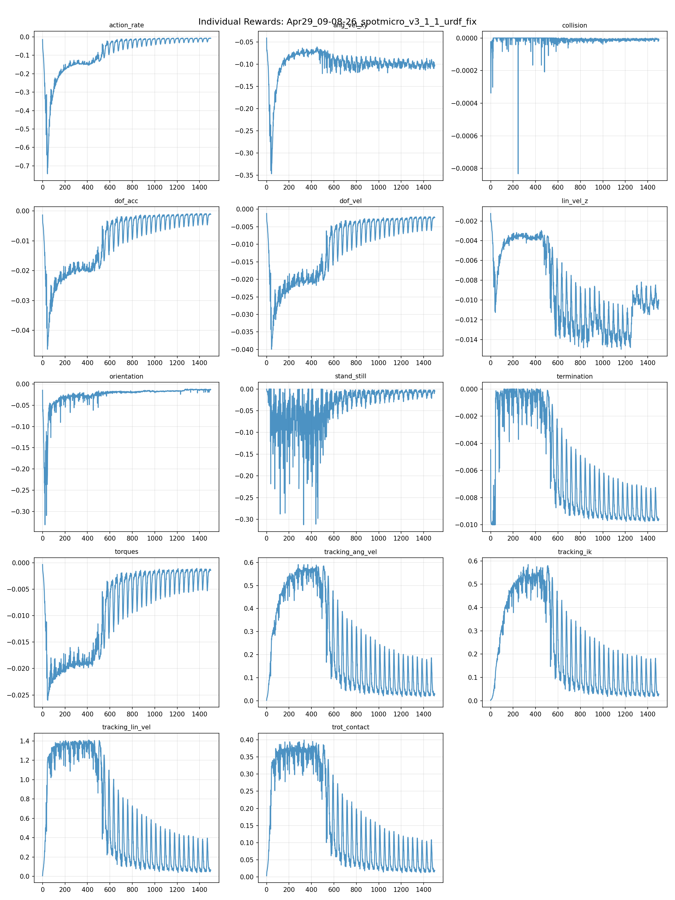
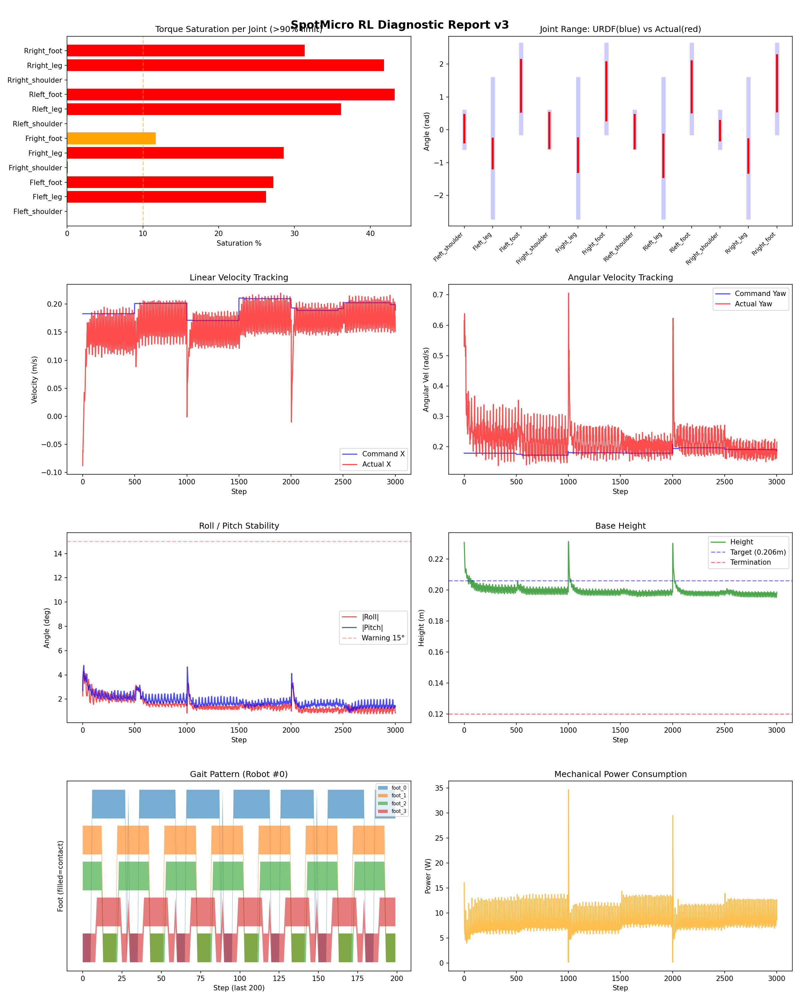
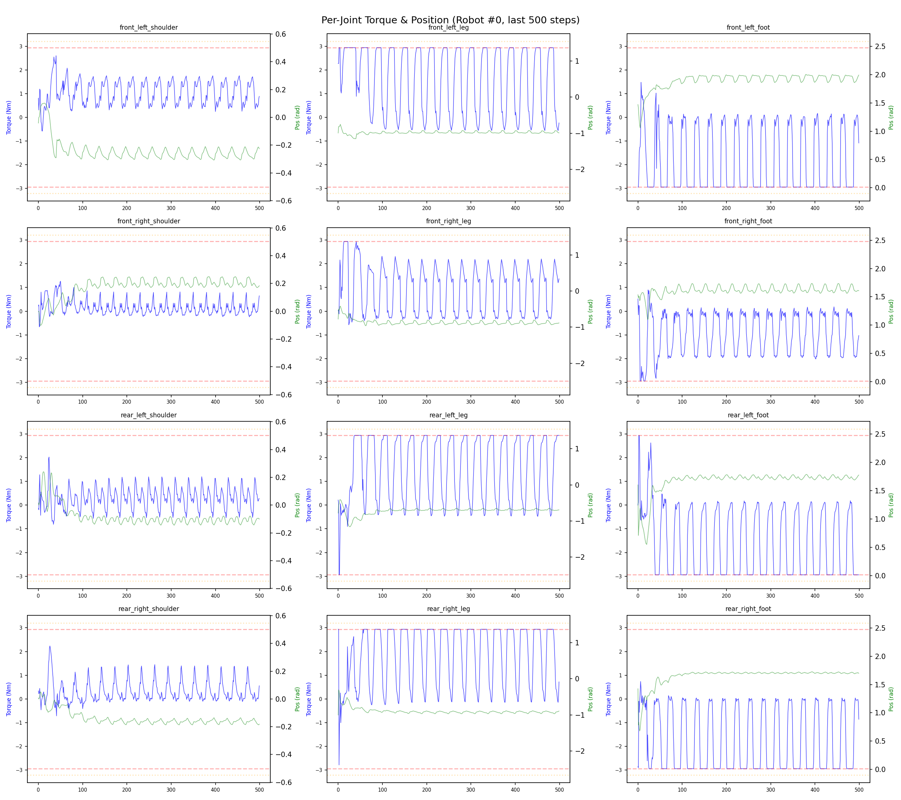
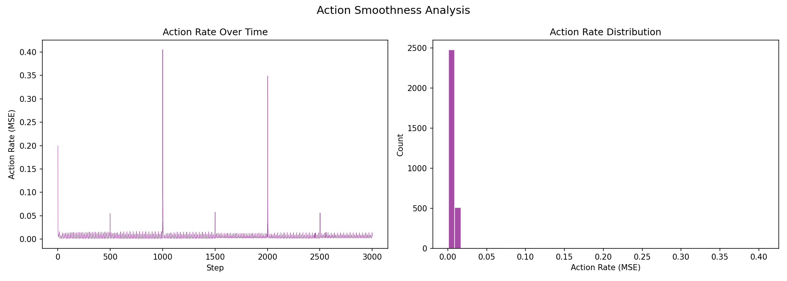

# 실험 026: spotmicro_v3_1_1_urdf_fix

- **날짜:** 2026-04-29 09:38
- **Task:** spotmicro_test
- **Run name:** `spotmicro_v3_1_1_urdf_fix`
- **판정:** ✅ PASS

---

## 실험 목적

V3.1.1: urdf inertia 오류 수정.

---

## 변경점 (이전 커밋 대비)

```diff
diff --git a/ai_training/rl/legged_gym/legged_gym/envs/spotmicro_test/spotmicro_test_config.py b/ai_training/rl/legged_gym/legged_gym/envs/spotmicro_test/spotmicro_test_config.py
index 8acc0f4..691f89a 100644
--- a/ai_training/rl/legged_gym/legged_gym/envs/spotmicro_test/spotmicro_test_config.py
+++ b/ai_training/rl/legged_gym/legged_gym/envs/spotmicro_test/spotmicro_test_config.py
@@ -123,7 +123,7 @@ class SpotmicroTestCfgPPO(LeggedRobotCfgPPO):
         entropy_coef = 0.01
 
     class runner(LeggedRobotCfgPPO.runner):
-        run_name = 'spotmicro_v3_1_PD_change'
+        run_name = 'spotmicro_v3_1_1_urdf_fix'
         experiment_name = 'spotmicro_test'
         max_iterations = 1500
         save_interval = 100
```

**변경 요약:**
  - run_name = 'spotmicro_v3_1_PD_change'
  + run_name = 'spotmicro_v3_1_1_urdf_fix'

---

## 현재 Reward Scales

| Reward | Scale |
|--------|-------|
| action_rate | -0.05 |
| ang_vel_xy | -0.4 |
| collision | -1.0 |
| dof_acc | -2.5e-07 |
| dof_vel | -0.001 |
| lin_vel_z | -2.0 |
| orientation | -8.0 |
| stand_still | -0.5 |
| termination | -10.0 |
| torques | -0.0005 |
| tracking_ang_vel | 1.3 |
| tracking_ik | 1.0 |
| tracking_lin_vel | 1.5 |
| trot_contact | 0.5 |

---

## 진단 결과 (Diagnostic)

### 핵심 지표

- ✅ Timeout: 98.5% (≥80%)
- ✅ 속도오차 X: 0.0497 m/s (<0.08)
- ⚠️ 토크포화: 20.5% (10~40%)
- ✅ 자세: roll 1.5°, pitch 1.9° (안정)
- ✅ 조기종료: 0.0% (<5%)

### 상세 수치

| 지표 | 값 |
|------|-----|
| Timeout% | 98.46153846153847 |
| 조기종료% | 0.0 |
| 속도오차 X | 0.0496874637901783 m/s |
| 속도오차 Y | 0.026286838576197624 m/s |
| 각속도오차 | 0.14245633780956268 rad/s |
| 토크포화% | 20.527389277389275 |
| 평균 높이 | 0.19944453129282483 m |
| Roll (평균) | 1.5365369319915771° |
| Pitch (평균) | 1.8635447025299072° |
| Action Rate | 0.006031809840351343 |
| 평균 전력 | 8.259357452392578 W |
| CoT | 1.9957385826213385 |

## Command Mode별 회전 추종 분석

| 모드 | 비율 | 샘플 수 | 평균 abs(cmd_wz) | 평균 abs(actual_wz) | yaw 오차 | 상태 |
|------|------|---------|------------------|---------------------|----------|------|
| 정지 | 1.3% | 2502 | 0.0283 | 0.1517 | 0.1529 | ❌ |
| 직진/저회전 | 38.8% | 74551 | 0.0710 | 0.1538 | 0.1372 | ⚠️ |
| 제자리 회전 | 8.0% | 15458 | 0.2778 | 0.2459 | 0.1669 | ❌ |
| 전진+회전 | 48.7% | 93665 | 0.2656 | 0.2664 | 0.1397 | ⚠️ |
| 큰 회전명령 | 19.5% | 37549 | 0.3479 | 0.3177 | 0.1551 | ❌ |

> 해석 기준: `제자리 회전`만 나쁘면 pure turn 학습/보행 패턴 문제, `큰 회전명령`만 나쁘면 yaw 명령 범위가 현재 토크/보폭 한계보다 큰 문제, `정지`가 나쁘면 stop drift 문제로 보면 됩니다.
        


## 학습 곡선 분석

| 지표 | 값 | 판정 |
|------|-----|------|
| 수렴 iter (90%) | 225 | 빠름 |
| 후반 안정성 (CV) | 0.885 | 불안정 |
| 정체 구간 | 없음 | |


## Per-leg 분석

### 발별 접촉/공중 비율

| 발 | 접촉% | 공중% |
|-----|-------|------|
| foot_0 | 70.2% | 29.8% |
| foot_1 | 70.5% | 29.5% |
| foot_2 | 67.3% | 32.7% |
| foot_3 | 64.7% | 35.3% |

### 관절별 토크 포화

| 관절 | 포화% | 최대토크 | 한계 | 상태 |
|------|------|---------|------|------|
| front_left_shoulder | 0.0% | 2.940 | 2.940 | ✅ |
| front_left_leg | 26.2% | 2.940 | 2.940 | ❌ |
| front_left_foot | 27.2% | 2.940 | 2.940 | ❌ |
| front_right_shoulder | 0.1% | 2.940 | 2.940 | ✅ |
| front_right_leg | 28.6% | 2.940 | 2.940 | ❌ |
| front_right_foot | 11.7% | 2.940 | 2.940 | ⚠️ |
| rear_left_shoulder | 0.0% | 2.940 | 2.940 | ✅ |
| rear_left_leg | 36.1% | 2.940 | 2.940 | ❌ |
| rear_left_foot | 43.2% | 2.940 | 2.940 | ❌ |
| rear_right_shoulder | 0.0% | 2.940 | 2.940 | ✅ |
| rear_right_leg | 41.8% | 2.940 | 2.940 | ❌ |
| rear_right_foot | 31.3% | 2.940 | 2.940 | ❌ |


## Gait 분석

| 지표 | 값 |
|------|-----|
| Gait 주파수 | 0.42 Hz |
| Gait 주기 | 30 steps |
| 대각 동기화율 | 84.1% |
| L/R 비대칭 | 0.0%p |
| 판정 | ✅ Trot 패턴 / ✅ 대칭 |


## 관절별 상세

| 관절 | 토크포화% | 사용범위% | 편향(rad) | 한계근접% | 상태 |
|------|----------|----------|----------|----------|------|
| front_left_shoulder | 0.0% | 76% | +0.037 | 0.0% | ✅ |
| front_left_leg | 26.2% | 21% | -0.723 | 0.0% | ⚠️ |
| front_left_foot | 27.2% | 58% | +1.338 | 0.0% | ⚠️ |
| front_right_shoulder | 0.1% | 97% | -0.021 | 0.0% | ✅ |
| front_right_leg | 28.6% | 24% | -0.771 | 0.0% | ⚠️ |
| front_right_foot | 11.7% | 66% | +1.172 | 0.0% | ⚠️ |
| rear_left_shoulder | 0.0% | 92% | -0.055 | 0.0% | ✅ |
| rear_left_leg | 36.1% | 30% | -0.795 | 0.0% | ⚠️ |
| rear_left_foot | 43.2% | 58% | +1.311 | 0.0% | ⚠️ |
| rear_right_shoulder | 0.0% | 54% | -0.025 | 0.0% | ✅ |
| rear_right_leg | 41.8% | 24% | -0.796 | 0.0% | ⚠️ |
| rear_right_foot | 31.3% | 63% | +1.413 | 0.0% | ⚠️ |


## 에너지 효율 상세

| 지표 | 값 |
|------|-----|
| 평균 전력 | 8.26 W |
| 피크 전력 | 34.65 W |
| 피크/평균 비율 | 4.2x |
| CoT | 2.00 |

### 관절별 전력 분배

| 관절 | 평균전력(W) | 비율% |
|------|-----------|-------|
| front_left_foot | 1.427 | 17.3% |
| rear_left_foot | 1.312 | 15.9% |
| rear_right_foot | 1.246 | 15.1% |
| front_right_foot | 1.095 | 13.3% |
| rear_right_leg | 0.816 | 9.9% |
| front_right_leg | 0.768 | 9.3% |
| front_left_leg | 0.750 | 9.1% |
| rear_left_leg | 0.656 | 7.9% |
| front_right_shoulder | 0.051 | 0.6% |
| rear_left_shoulder | 0.050 | 0.6% |
| rear_right_shoulder | 0.047 | 0.6% |
| front_left_shoulder | 0.041 | 0.5% |


## 이전 실험 대비 비교

| 지표 | 이전 (exp025) | 현재 (exp026) | 변화 |
|------|-------|-------|------|
| Timeout% | 92.1% | 98.5% | ✅ ↑ 6.3752% |
| 속도오차 X | 0.0429 | 0.0497 | ⚠️ ↑ 0.0068m/s |
| 토크포화 | 18.1% | 20.5% | ⚠️ ↑ 2.3855% |
| Roll | 1.2° | 1.5° | ⚠️ ↑ 0.3330° |
| Pitch | 2.6° | 1.9° | ✅ ↓ 0.7864° |
| 평균 전력 | 7.4065W | 8.2594W | ⚠️ ↑ 0.8529W |


## Tensorboard 학습 곡선 요약

| 스칼라 | 최종값 | 최대 | 최소 | 후반10% 평균 |
|--------|--------|------|------|-------------|
| rew_action_rate | -0.0080 | -0.0063 | -0.7430 | -0.0124 |
| rew_ang_vel_xy | -0.1031 | -0.0409 | -0.3468 | -0.1010 |
| rew_collision | -0.0000 | 0.0000 | -0.0008 | -0.0000 |
| rew_dof_acc | -0.0011 | -0.0009 | -0.0463 | -0.0019 |
| rew_dof_vel | -0.0024 | -0.0012 | -0.0399 | -0.0032 |
| rew_lin_vel_z | -0.0100 | -0.0012 | -0.0150 | -0.0102 |
| rew_orientation | -0.0130 | -0.0117 | -0.3316 | -0.0135 |
| rew_stand_still | -0.0044 | 0.0000 | -0.3125 | -0.0077 |
| rew_termination | -0.0096 | 0.0000 | -0.0100 | -0.0091 |
| rew_torques | -0.0014 | -0.0003 | -0.0260 | -0.0022 |
| rew_tracking_ang_vel | 0.0298 | 0.5909 | 0.0022 | 0.0614 |
| rew_tracking_ik | 0.0283 | 0.5846 | 0.0017 | 0.0596 |
| rew_tracking_lin_vel | 0.0657 | 1.4093 | 0.0058 | 0.1328 |
| rew_trot_contact | 0.0194 | 0.3992 | 0.0037 | 0.0372 |
| learning_rate | 0.0000 | 0.0100 | 0.0000 | 0.0000 |
| surrogate | 0.0010 | 0.0059 | -0.0085 | -0.0003 |
| value_function | 0.0113 | 0.0802 | 0.0034 | 0.0161 |
| collection time | 0.8213 | 1.1394 | 0.7769 | 0.8163 |
| learning_time | 0.2865 | 0.3309 | 0.2708 | 0.2886 |
| total_fps | 88737.0000 | 92628.0000 | 68023.0000 | 88989.1933 |
| mean_noise_std | 0.2484 | 1.0009 | 0.2484 | 0.2515 |
| mean_episode_length | 63.6000 | 1002.0000 | 22.6100 | 100.3313 |
| time | 63.6000 | 1002.0000 | 22.6100 | 100.3313 |
| mean_reward | 2.6734 | 53.4236 | -0.1763 | 4.8418 |
| time | 2.6734 | 53.4236 | -0.1763 | 4.8418 |

총 학습 iteration: 1499


---

## 그래프

### Tensorboard 학습 곡선



### Diagnostic 결과





---

## 결론 및 다음 실험 방향

**자동 판정:** ✅ PASS

대부분 기준을 통과했으나 일부 항목이 보통 수준입니다.
  - ⚠️ 토크포화: 20.5% (10~40%)

> 💡 위 결론은 자동 생성되었습니다. 필요시 수정하세요.

---

## 메모

_(추가 메모가 있으면 여기에 작성)_

