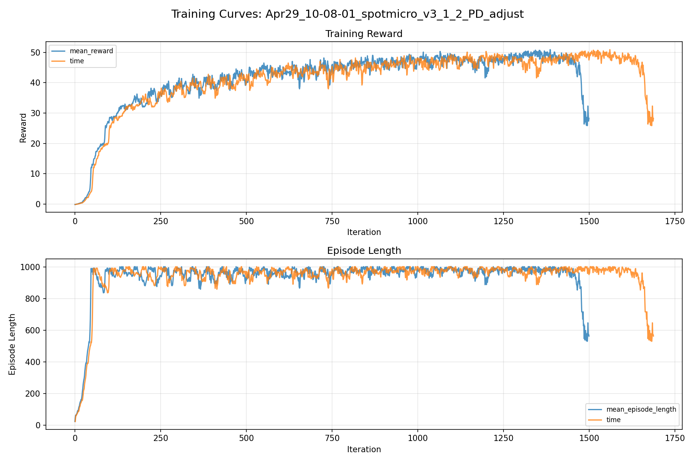
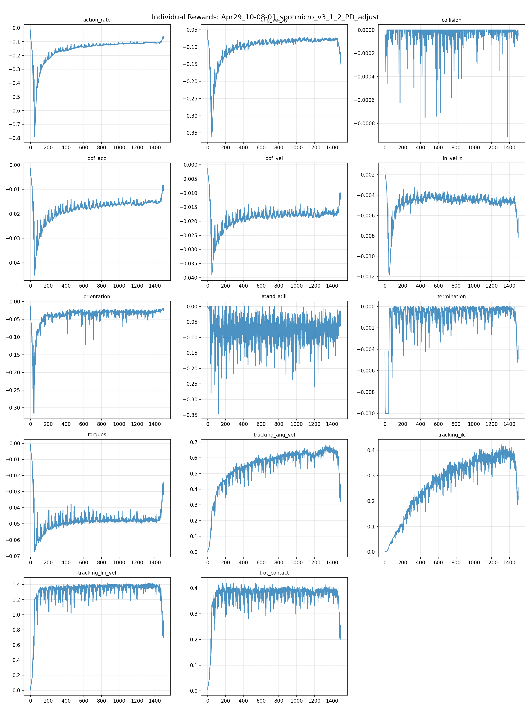
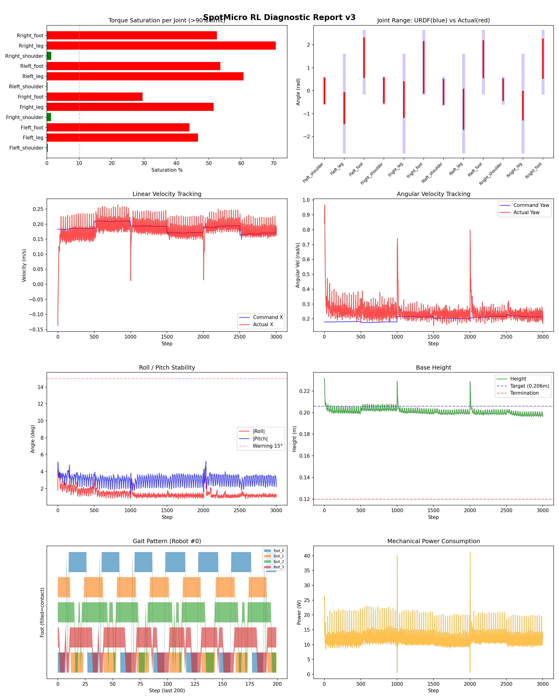
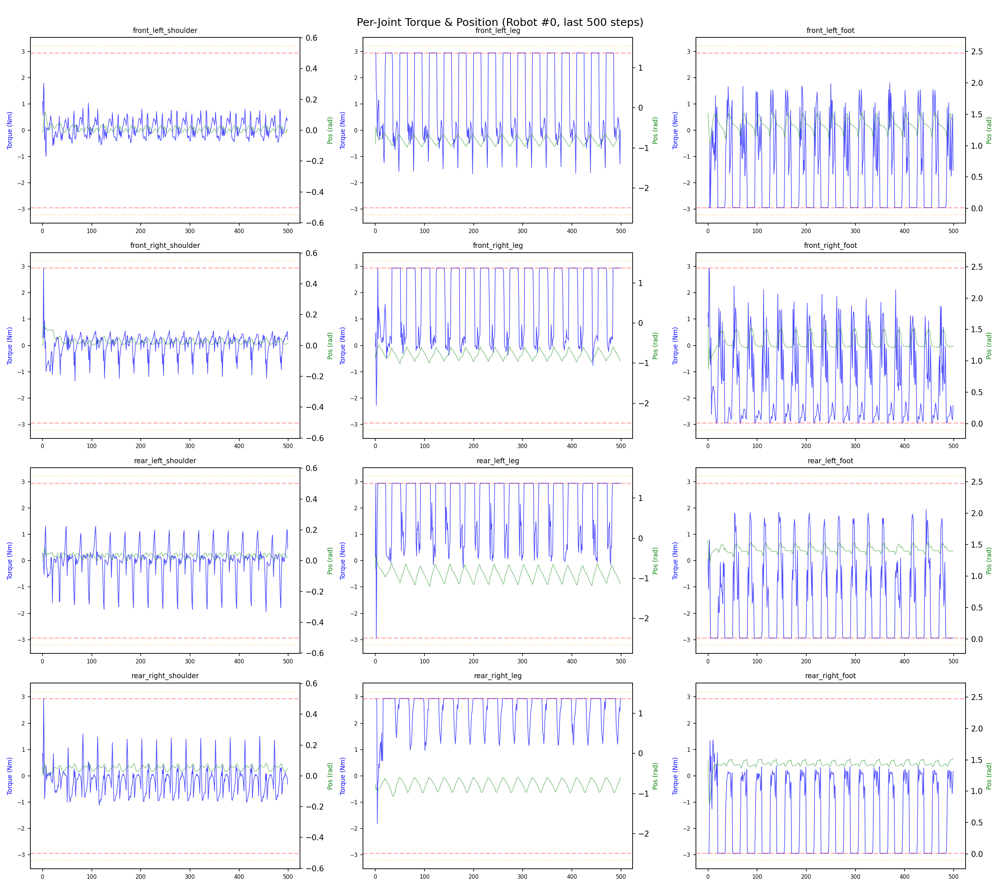
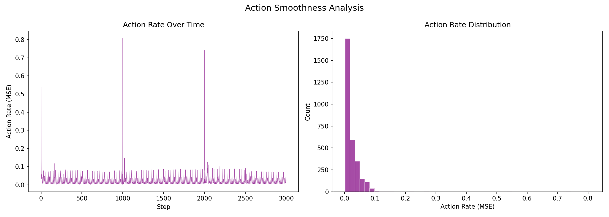

# 실험 027: spotmicro_v3_1_2_PD_adjust

- **날짜:** 2026-04-29 10:38
- **Task:** spotmicro_test
- **Run name:** `spotmicro_v3_1_2_PD_adjust`
- **판정:** ✅ PASS

---

## 실험 목적

V3.1.2: 수정했던 PD를 원복.

---

## 변경점 (이전 커밋 대비)

```diff
diff --git a/ai_training/rl/legged_gym/legged_gym/envs/spotmicro_test/spotmicro_test.py b/ai_training/rl/legged_gym/legged_gym/envs/spotmicro_test/spotmicro_test.py
index c737d39..9aa61e5 100644
--- a/ai_training/rl/legged_gym/legged_gym/envs/spotmicro_test/spotmicro_test.py
+++ b/ai_training/rl/legged_gym/legged_gym/envs/spotmicro_test/spotmicro_test.py
@@ -302,7 +302,7 @@ class SpotmicroTest(LeggedRobot):
         # action에 가중치를 곱해서 에러 계산
         weighted_actions = self.actions * weights
         error = torch.sum(torch.square(weighted_actions), dim=1)
-        sigma = 3.5 
+        sigma = 2.0
         return torch.exp(-error / sigma)
         
     def _reward_tracking_ang_vel(self):
diff --git a/ai_training/rl/legged_gym/legged_gym/envs/spotmicro_test/spotmicro_test_config.py b/ai_training/rl/legged_gym/legged_gym/envs/spotmicro_test/spotmicro_test_config.py
index 691f89a..07ecdd1 100644
--- a/ai_training/rl/legged_gym/legged_gym/envs/spotmicro_test/spotmicro_test_config.py
+++ b/ai_training/rl/legged_gym/legged_gym/envs/spotmicro_test/spotmicro_test_config.py
@@ -32,9 +32,9 @@ class SpotmicroTestCfg(LeggedRobotCfg):
 
     class control(LeggedRobotCfg.control):
         control_type = 'P'
-        stiffness = {'shoulder': 8.0, 'leg': 8.0, 'foot': 8.0}
-        damping = {'shoulder': 0.2, 'leg': 0.2, 'foot': 0.2}
-        action_scale = 0.35
+        stiffness = {'shoulder': 20.0, 'leg': 20.0, 'foot': 20.0}
+        damping = {'shoulder': 0.5, 'leg': 0.5, 'foot': 0.5}
+        action_scale = 0.22
         decimation = 4
 
     class asset(LeggedRobotCfg.asset):
@@ -54,8 +54,8 @@ class SpotmicroTestCfg(LeggedRobotCfg):
             termination = -10.0
             lin_vel_z = -2.0
             ang_vel_xy = -0.4
-            orientation = -8.0
-            torques = -0.0005
+            orientation = -6.0
+            torques = -0.001
             dof_vel = -0.001
             dof_acc = -2.5e-7
             action_rate = -0.05
@@ -123,7 +123,7 @@ class SpotmicroTestCfgPPO(LeggedRobotCfgPPO):
         entropy_coef = 0.01
 
     class runner(LeggedRobotCfgPPO.runner):
-        run_name = 'spotmicro_v3_1_1_urdf_fix'
+        run_name = 'spotmicro_v3_1_2_PD_adjust'
         experiment_name = 'spotmicro_test'
         max_iterations = 1500
         save_interval = 100
```

**변경 요약:**
  - sigma = 3.5
  + sigma = 2.0
  - stiffness = {'shoulder': 8.0, 'leg': 8.0, 'foot': 8.0}
  - damping = {'shoulder': 0.2, 'leg': 0.2, 'foot': 0.2}
  - action_scale = 0.35
  + stiffness = {'shoulder': 20.0, 'leg': 20.0, 'foot': 20.0}
  + damping = {'shoulder': 0.5, 'leg': 0.5, 'foot': 0.5}
  + action_scale = 0.22
  - orientation = -8.0
  - torques = -0.0005
  + orientation = -6.0
  + torques = -0.001
  - run_name = 'spotmicro_v3_1_1_urdf_fix'
  + run_name = 'spotmicro_v3_1_2_PD_adjust'

---

## 현재 Reward Scales

| Reward | Scale |
|--------|-------|
| action_rate | -0.05 |
| ang_vel_xy | -0.4 |
| collision | -1.0 |
| dof_acc | -2.5e-07 |
| dof_vel | -0.001 |
| lin_vel_z | -2.0 |
| orientation | -6.0 |
| stand_still | -0.5 |
| termination | -10.0 |
| torques | -0.001 |
| tracking_ang_vel | 1.3 |
| tracking_ik | 1.0 |
| tracking_lin_vel | 1.5 |
| trot_contact | 0.5 |

---

## 진단 결과 (Diagnostic)

### 핵심 지표

- ✅ Timeout: 92.1% (≥80%)
- ✅ 속도오차 X: 0.0498 m/s (<0.08)
- ⚠️ 토크포화: 34.3% (10~40%)
- ✅ 자세: roll 1.4°, pitch 3.0° (안정)
- ✅ 조기종료: 4.3% (<5%)

### 상세 수치

| 지표 | 값 |
|------|-----|
| Timeout% | 92.08633093525181 |
| 조기종료% | 4.316546762589928 |
| 속도오차 X | 0.04975736513733864 m/s |
| 속도오차 Y | 0.03407929092645645 m/s |
| 각속도오차 | 0.17507070302963257 rad/s |
| 토크포화% | 34.34473512598512 |
| 평균 높이 | 0.20135336509951346 m |
| Roll (평균) | 1.4139759540557861° |
| Pitch (평균) | 3.035675287246704° |
| Action Rate | 0.02319229021668434 |
| 평균 전력 | 12.15652847290039 W |
| CoT | 2.62699489256603 |

## Command Mode별 회전 추종 분석

| 모드 | 비율 | 샘플 수 | 평균 abs(cmd_wz) | 평균 abs(actual_wz) | yaw 오차 | 상태 |
|------|------|---------|------------------|---------------------|----------|------|
| 정지 | 0.5% | 973 | 0.0289 | 0.3097 | 0.3151 | ❌ |
| 직진/저회전 | 33.4% | 64254 | 0.0688 | 0.1784 | 0.1684 | ❌ |
| 제자리 회전 | 8.6% | 16574 | 0.2723 | 0.2301 | 0.2180 | ❌ |
| 전진+회전 | 54.3% | 104359 | 0.2779 | 0.2885 | 0.1699 | ❌ |
| 큰 회전명령 | 26.3% | 50615 | 0.3535 | 0.3319 | 0.1755 | ❌ |

> 해석 기준: `제자리 회전`만 나쁘면 pure turn 학습/보행 패턴 문제, `큰 회전명령`만 나쁘면 yaw 명령 범위가 현재 토크/보폭 한계보다 큰 문제, `정지`가 나쁘면 stop drift 문제로 보면 됩니다.
        


## 학습 곡선 분석

| 지표 | 값 | 판정 |
|------|-----|------|
| 수렴 iter (90%) | 551 | 보통 |
| 후반 안정성 (CV) | 0.073 | 보통 |
| 정체 구간 | 없음 | |


## Per-leg 분석

### 발별 접촉/공중 비율

| 발 | 접촉% | 공중% |
|-----|-------|------|
| foot_0 | 55.7% | 44.3% |
| foot_1 | 61.4% | 38.6% |
| foot_2 | 68.3% | 31.7% |
| foot_3 | 60.1% | 39.9% |

### 관절별 토크 포화

| 관절 | 포화% | 최대토크 | 한계 | 상태 |
|------|------|---------|------|------|
| front_left_shoulder | 0.3% | 2.940 | 2.940 | ✅ |
| front_left_leg | 46.6% | 2.940 | 2.940 | ❌ |
| front_left_foot | 44.0% | 2.940 | 2.940 | ❌ |
| front_right_shoulder | 1.3% | 2.940 | 2.940 | ✅ |
| front_right_leg | 51.5% | 2.940 | 2.940 | ❌ |
| front_right_foot | 29.5% | 2.940 | 2.940 | ❌ |
| rear_left_shoulder | 0.2% | 2.940 | 2.940 | ✅ |
| rear_left_leg | 60.7% | 2.940 | 2.940 | ❌ |
| rear_left_foot | 53.6% | 2.940 | 2.940 | ❌ |
| rear_right_shoulder | 1.4% | 2.940 | 2.940 | ✅ |
| rear_right_leg | 70.7% | 2.940 | 2.940 | ❌ |
| rear_right_foot | 52.5% | 2.940 | 2.940 | ❌ |


## Gait 분석

| 지표 | 값 |
|------|-----|
| Gait 주파수 | 0.42 Hz |
| Gait 주기 | 30 steps |
| 대각 동기화율 | 78.6% |
| L/R 비대칭 | 0.0%p |
| 판정 | ✅ Trot 패턴 / ✅ 대칭 |


## 관절별 상세

| 관절 | 토크포화% | 사용범위% | 편향(rad) | 한계근접% | 상태 |
|------|----------|----------|----------|----------|------|
| front_left_shoulder | 0.3% | 100% | -0.003 | 6.5% | ✅ |
| front_left_leg | 46.6% | 32% | -0.760 | 0.0% | ⚠️ |
| front_left_foot | 44.0% | 63% | +1.433 | 0.0% | ⚠️ |
| front_right_shoulder | 1.3% | 98% | +0.016 | 4.4% | ✅ |
| front_right_leg | 51.5% | 36% | -0.388 | 0.0% | ⚠️ |
| front_right_foot | 29.5% | 83% | +1.019 | 0.0% | ⚠️ |
| rear_left_shoulder | 0.2% | 98% | -0.054 | 0.0% | ✅ |
| rear_left_leg | 60.7% | 41% | -0.809 | 0.0% | ⚠️ |
| rear_left_foot | 53.6% | 59% | +1.370 | 0.0% | ⚠️ |
| rear_right_shoulder | 1.4% | 84% | +0.045 | 0.0% | ✅ |
| rear_right_leg | 70.7% | 29% | -0.652 | 0.0% | ⚠️ |
| rear_right_foot | 52.5% | 63% | +1.396 | 0.0% | ⚠️ |


## 에너지 효율 상세

| 지표 | 값 |
|------|-----|
| 평균 전력 | 12.16 W |
| 피크 전력 | 41.22 W |
| 피크/평균 비율 | 3.4x |
| CoT | 2.63 |

### 관절별 전력 분배

| 관절 | 평균전력(W) | 비율% |
|------|-----------|-------|
| rear_right_leg | 1.973 | 16.2% |
| front_left_foot | 1.922 | 15.8% |
| rear_left_foot | 1.744 | 14.3% |
| front_right_foot | 1.549 | 12.7% |
| rear_right_foot | 1.338 | 11.0% |
| rear_left_leg | 1.253 | 10.3% |
| front_right_leg | 1.125 | 9.3% |
| front_left_leg | 0.864 | 7.1% |
| rear_right_shoulder | 0.117 | 1.0% |
| rear_left_shoulder | 0.100 | 0.8% |
| front_right_shoulder | 0.091 | 0.8% |
| front_left_shoulder | 0.079 | 0.7% |


## 이전 실험 대비 비교

| 지표 | 이전 (exp026) | 현재 (exp027) | 변화 |
|------|-------|-------|------|
| Timeout% | 98.5% | 92.1% | ⚠️ ↓ 6.3752% |
| 속도오차 X | 0.0497 | 0.0498 | → 유지 |
| 토크포화 | 20.5% | 34.3% | ⚠️ ↑ 13.8173% |
| Roll | 1.5° | 1.4° | ✅ ↓ 0.1226° |
| Pitch | 1.9° | 3.0° | ⚠️ ↑ 1.1721° |
| 평균 전력 | 8.2594W | 12.1565W | ⚠️ ↑ 3.8972W |


## Tensorboard 학습 곡선 요약

| 스칼라 | 최종값 | 최대 | 최소 | 후반10% 평균 |
|--------|--------|------|------|-------------|
| rew_action_rate | -0.0679 | -0.0144 | -0.7912 | -0.1012 |
| rew_ang_vel_xy | -0.1455 | -0.0505 | -0.3616 | -0.0858 |
| rew_collision | -0.0000 | 0.0000 | -0.0009 | -0.0000 |
| rew_dof_acc | -0.0091 | -0.0013 | -0.0451 | -0.0143 |
| rew_dof_vel | -0.0108 | -0.0012 | -0.0391 | -0.0162 |
| rew_lin_vel_z | -0.0076 | -0.0014 | -0.0119 | -0.0050 |
| rew_orientation | -0.0234 | -0.0138 | -0.3159 | -0.0268 |
| rew_stand_still | -0.0226 | 0.0000 | -0.3452 | -0.0672 |
| rew_termination | -0.0049 | 0.0000 | -0.0100 | -0.0010 |
| rew_torques | -0.0268 | -0.0009 | -0.0673 | -0.0444 |
| rew_tracking_ang_vel | 0.3580 | 0.6835 | 0.0020 | 0.5995 |
| rew_tracking_ik | 0.2178 | 0.4215 | 0.0011 | 0.3543 |
| rew_tracking_lin_vel | 0.7636 | 1.4194 | 0.0061 | 1.2796 |
| rew_trot_contact | 0.2222 | 0.4201 | 0.0036 | 0.3594 |
| learning_rate | 0.0000 | 0.0100 | 0.0000 | 0.0003 |
| surrogate | 0.0023 | 0.0188 | -0.0080 | -0.0007 |
| value_function | 0.0299 | 0.1107 | 0.0030 | 0.0273 |
| collection time | 0.8180 | 0.9068 | 0.7904 | 0.8370 |
| learning_time | 0.2865 | 0.3461 | 0.2773 | 0.2877 |
| total_fps | 88997.0000 | 91675.0000 | 78601.0000 | 87415.7800 |
| mean_noise_std | 0.2703 | 1.0024 | 0.2609 | 0.2691 |
| mean_episode_length | 562.9400 | 1002.0000 | 22.0700 | 912.7185 |
| time | 562.9400 | 1002.0000 | 22.0700 | 912.7185 |
| mean_reward | 28.2554 | 50.9230 | -0.1540 | 45.1907 |
| time | 28.2554 | 50.9230 | -0.1540 | 45.1907 |

총 학습 iteration: 1499


---

## 그래프

### Tensorboard 학습 곡선



### Diagnostic 결과





---

## 결론 및 다음 실험 방향

**자동 판정:** ✅ PASS

대부분 기준을 통과했으나 일부 항목이 보통 수준입니다.
  - ⚠️ 토크포화: 34.3% (10~40%)

> 💡 위 결론은 자동 생성되었습니다. 필요시 수정하세요.

---

## 메모

_(추가 메모가 있으면 여기에 작성)_

