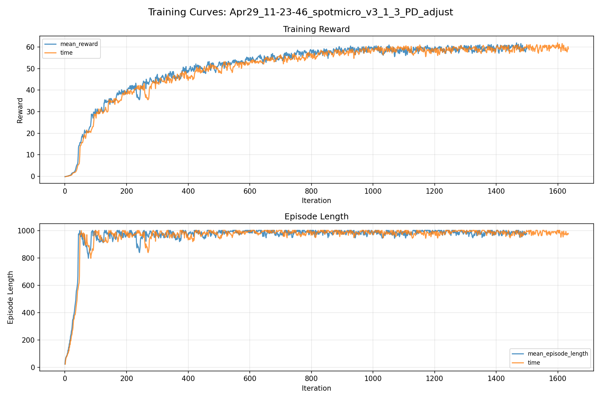
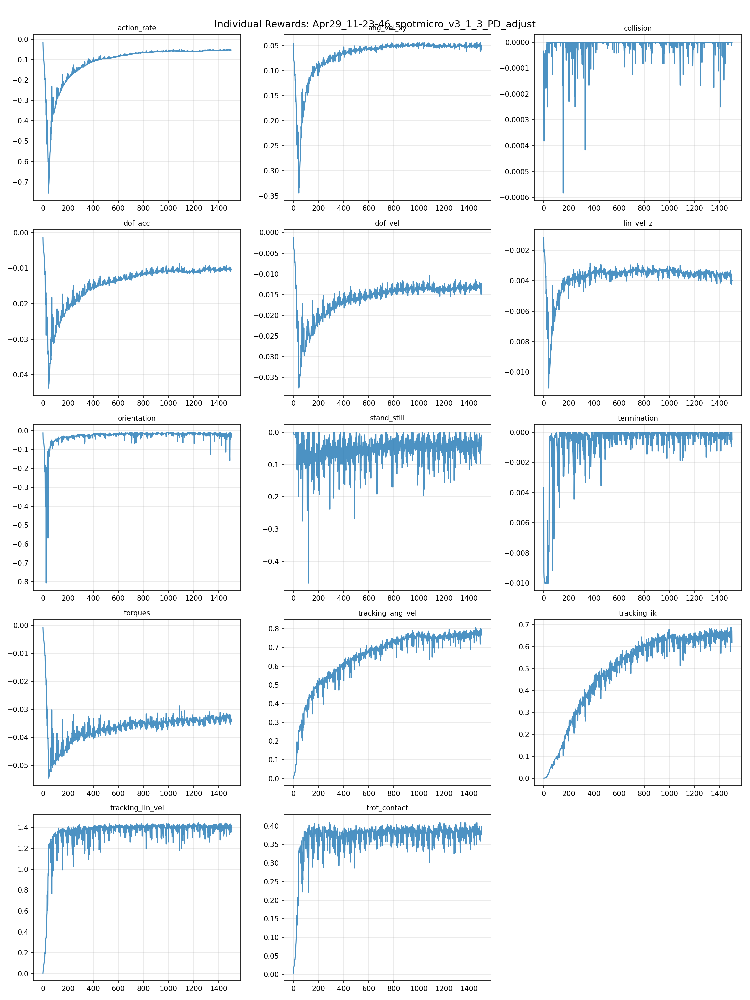
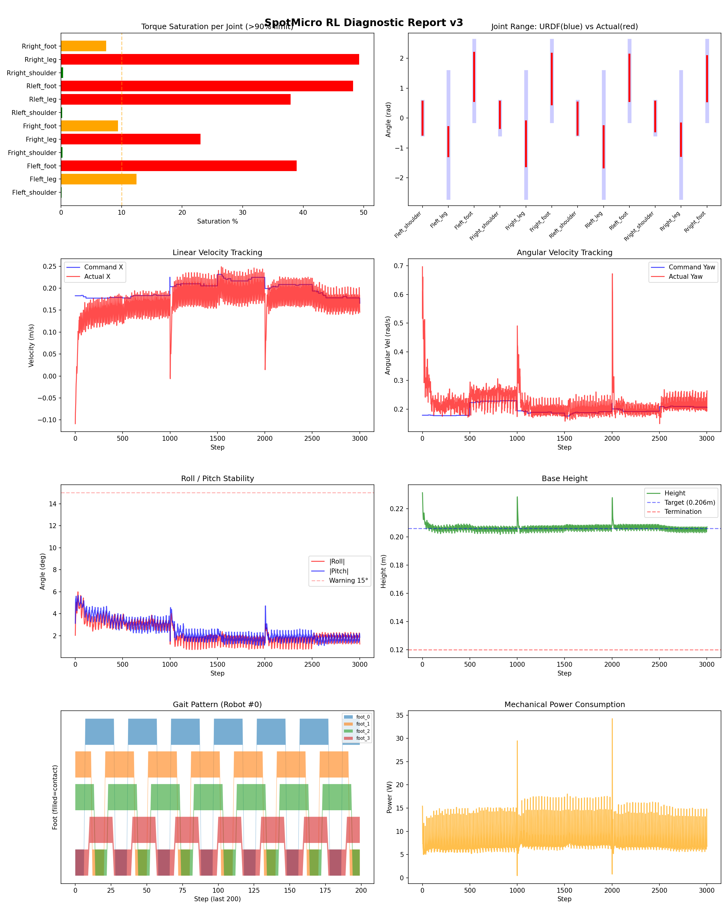
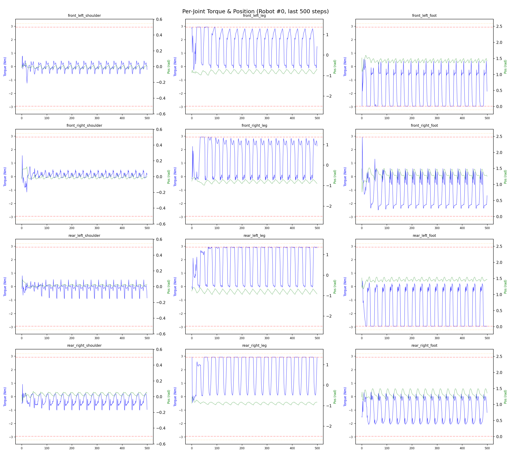
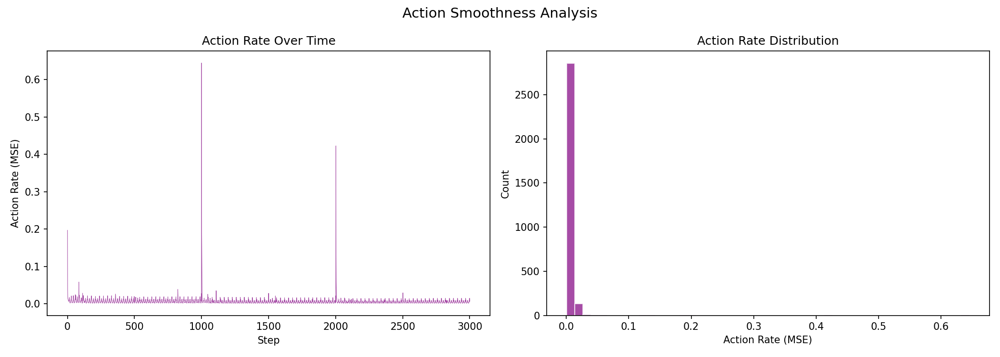

# 실험 028: spotmicro_v3_1_3_PD_adjust

- **날짜:** 2026-04-29 11:52
- **Task:** spotmicro_test
- **Run name:** `spotmicro_v3_1_3_PD_adjust`
- **판정:** ✅ PASS

---

## 실험 목적

V3.1.3: PD수치 조정을 통해 토크 포화 보정 시도.

---

## 변경점 (이전 커밋 대비)

```diff
diff --git a/ai_training/rl/legged_gym/legged_gym/envs/spotmicro_test/spotmicro_test_config.py b/ai_training/rl/legged_gym/legged_gym/envs/spotmicro_test/spotmicro_test_config.py
index 07ecdd1..c1aa8d7 100644
--- a/ai_training/rl/legged_gym/legged_gym/envs/spotmicro_test/spotmicro_test_config.py
+++ b/ai_training/rl/legged_gym/legged_gym/envs/spotmicro_test/spotmicro_test_config.py
@@ -32,9 +32,9 @@ class SpotmicroTestCfg(LeggedRobotCfg):
 
     class control(LeggedRobotCfg.control):
         control_type = 'P'
-        stiffness = {'shoulder': 20.0, 'leg': 20.0, 'foot': 20.0}
-        damping = {'shoulder': 0.5, 'leg': 0.5, 'foot': 0.5}
-        action_scale = 0.22
+        stiffness = {'shoulder': 15.0, 'leg': 10.0, 'foot': 10.0}
+        damping = {'shoulder': 0.3, 'leg': 0.3, 'foot': 0.2}
+        action_scale = 0.25
         decimation = 4
 
     class asset(LeggedRobotCfg.asset):
@@ -123,7 +123,7 @@ class SpotmicroTestCfgPPO(LeggedRobotCfgPPO):
         entropy_coef = 0.01
 
     class runner(LeggedRobotCfgPPO.runner):
-        run_name = 'spotmicro_v3_1_2_PD_adjust'
+        run_name = 'spotmicro_v3_1_3_PD_adjust'
         experiment_name = 'spotmicro_test'
         max_iterations = 1500
         save_interval = 100
```

**변경 요약:**
  - stiffness = {'shoulder': 20.0, 'leg': 20.0, 'foot': 20.0}
  - damping = {'shoulder': 0.5, 'leg': 0.5, 'foot': 0.5}
  - action_scale = 0.22
  + stiffness = {'shoulder': 15.0, 'leg': 10.0, 'foot': 10.0}
  + damping = {'shoulder': 0.3, 'leg': 0.3, 'foot': 0.2}
  + action_scale = 0.25
  - run_name = 'spotmicro_v3_1_2_PD_adjust'
  + run_name = 'spotmicro_v3_1_3_PD_adjust'

---

## 현재 Reward Scales

| Reward | Scale |
|--------|-------|
| action_rate | -0.05 |
| ang_vel_xy | -0.4 |
| collision | -1.0 |
| dof_acc | -2.5e-07 |
| dof_vel | -0.001 |
| lin_vel_z | -2.0 |
| orientation | -6.0 |
| stand_still | -0.5 |
| termination | -10.0 |
| torques | -0.001 |
| tracking_ang_vel | 1.3 |
| tracking_ik | 1.0 |
| tracking_lin_vel | 1.5 |
| trot_contact | 0.5 |

---

## 진단 결과 (Diagnostic)

### 핵심 지표

- ✅ Timeout: 93.4% (≥80%)
- ✅ 속도오차 X: 0.0479 m/s (<0.08)
- ⚠️ 토크포화: 19.0% (10~40%)
- ✅ 자세: roll 2.2°, pitch 2.4° (안정)
- ✅ 조기종료: 0.7% (<5%)

### 상세 수치

| 지표 | 값 |
|------|-----|
| Timeout% | 93.43065693430657 |
| 조기종료% | 0.7299270072992701 |
| 속도오차 X | 0.047929797321558 m/s |
| 속도오차 Y | 0.02101409062743187 m/s |
| 각속도오차 | 0.09587715566158295 rad/s |
| 토크포화% | 18.958081848706847 |
| 평균 높이 | 0.20634219357064673 m |
| Roll (평균) | 2.238065004348755° |
| Pitch (평균) | 2.4090890884399414° |
| Action Rate | 0.005998924840241671 |
| 평균 전력 | 8.102069854736328 W |
| CoT | 1.867986490869246 |

## Command Mode별 회전 추종 분석

| 모드 | 비율 | 샘플 수 | 평균 abs(cmd_wz) | 평균 abs(actual_wz) | yaw 오차 | 상태 |
|------|------|---------|------------------|---------------------|----------|------|
| 정지 | 1.0% | 1999 | 0.0226 | 0.0688 | 0.0726 | ❌ |
| 직진/저회전 | 35.6% | 68367 | 0.0765 | 0.1212 | 0.0855 | ⚠️ |
| 제자리 회전 | 8.7% | 16706 | 0.2574 | 0.3003 | 0.1249 | ⚠️ |
| 전진+회전 | 51.9% | 99757 | 0.2789 | 0.2807 | 0.0962 | ⚠️ |
| 큰 회전명령 | 24.2% | 46484 | 0.3480 | 0.3304 | 0.0973 | ⚠️ |

> 해석 기준: `제자리 회전`만 나쁘면 pure turn 학습/보행 패턴 문제, `큰 회전명령`만 나쁘면 yaw 명령 범위가 현재 토크/보폭 한계보다 큰 문제, `정지`가 나쁘면 stop drift 문제로 보면 됩니다.
        


## 학습 곡선 분석

| 지표 | 값 | 판정 |
|------|-----|------|
| 수렴 iter (90%) | 630 | 보통 |
| 후반 안정성 (CV) | 0.020 | 안정 |
| 정체 구간 | 없음 | |


## Per-leg 분석

### 발별 접촉/공중 비율

| 발 | 접촉% | 공중% |
|-----|-------|------|
| foot_0 | 65.9% | 34.1% |
| foot_1 | 68.0% | 32.0% |
| foot_2 | 68.2% | 31.8% |
| foot_3 | 63.5% | 36.5% |

### 관절별 토크 포화

| 관절 | 포화% | 최대토크 | 한계 | 상태 |
|------|------|---------|------|------|
| front_left_shoulder | 0.1% | 2.940 | 2.940 | ✅ |
| front_left_leg | 12.5% | 2.940 | 2.940 | ⚠️ |
| front_left_foot | 38.9% | 2.940 | 2.940 | ❌ |
| front_right_shoulder | 0.2% | 2.940 | 2.940 | ✅ |
| front_right_leg | 23.0% | 2.940 | 2.940 | ❌ |
| front_right_foot | 9.4% | 2.940 | 2.940 | ⚠️ |
| rear_left_shoulder | 0.2% | 2.940 | 2.940 | ✅ |
| rear_left_leg | 37.9% | 2.940 | 2.940 | ❌ |
| rear_left_foot | 48.2% | 2.940 | 2.940 | ❌ |
| rear_right_shoulder | 0.3% | 2.940 | 2.940 | ✅ |
| rear_right_leg | 49.2% | 2.940 | 2.940 | ❌ |
| rear_right_foot | 7.4% | 2.940 | 2.940 | ⚠️ |


## Gait 분석

| 지표 | 값 |
|------|-----|
| Gait 주파수 | 0.42 Hz |
| Gait 주기 | 30 steps |
| 대각 동기화율 | 83.3% |
| L/R 비대칭 | 0.0%p |
| 판정 | ✅ Trot 패턴 / ✅ 대칭 |


## 관절별 상세

| 관절 | 토크포화% | 사용범위% | 편향(rad) | 한계근접% | 상태 |
|------|----------|----------|----------|----------|------|
| front_left_shoulder | 0.1% | 100% | -0.000 | 0.5% | ✅ |
| front_left_leg | 12.5% | 23% | -0.792 | 0.0% | ⚠️ |
| front_left_foot | 38.9% | 60% | +1.378 | 0.0% | ⚠️ |
| front_right_shoulder | 0.2% | 80% | +0.112 | 1.2% | ⚠️ |
| front_right_leg | 23.0% | 36% | -0.859 | 0.0% | ⚠️ |
| front_right_foot | 9.4% | 63% | +1.309 | 0.0% | ⚠️ |
| rear_left_shoulder | 0.2% | 99% | -0.015 | 0.1% | ✅ |
| rear_left_leg | 37.9% | 33% | -0.964 | 0.0% | ⚠️ |
| rear_left_foot | 48.2% | 58% | +1.349 | 0.0% | ⚠️ |
| rear_right_shoulder | 0.3% | 90% | +0.055 | 0.0% | ✅ |
| rear_right_leg | 49.2% | 26% | -0.724 | 0.0% | ⚠️ |
| rear_right_foot | 7.4% | 56% | +1.319 | 0.0% | ⚠️ |


## 에너지 효율 상세

| 지표 | 값 |
|------|-----|
| 평균 전력 | 8.10 W |
| 피크 전력 | 34.26 W |
| 피크/평균 비율 | 4.2x |
| CoT | 1.87 |

### 관절별 전력 분배

| 관절 | 평균전력(W) | 비율% |
|------|-----------|-------|
| front_left_foot | 1.480 | 18.3% |
| rear_left_foot | 1.283 | 15.8% |
| front_right_foot | 1.157 | 14.3% |
| rear_right_foot | 0.928 | 11.4% |
| rear_right_leg | 0.785 | 9.7% |
| rear_left_leg | 0.780 | 9.6% |
| front_right_leg | 0.743 | 9.2% |
| front_left_leg | 0.684 | 8.4% |
| rear_right_shoulder | 0.094 | 1.2% |
| front_right_shoulder | 0.061 | 0.8% |
| rear_left_shoulder | 0.056 | 0.7% |
| front_left_shoulder | 0.053 | 0.6% |


## 이전 실험 대비 비교

| 지표 | 이전 (exp027) | 현재 (exp028) | 변화 |
|------|-------|-------|------|
| Timeout% | 92.1% | 93.4% | ✅ ↑ 1.3443% |
| 속도오차 X | 0.0498 | 0.0479 | ✅ ↓ 0.0018m/s |
| 토크포화 | 34.3% | 19.0% | ✅ ↓ 15.3867% |
| Roll | 1.4° | 2.2° | ⚠️ ↑ 0.8241° |
| Pitch | 3.0° | 2.4° | ✅ ↓ 0.6266° |
| 평균 전력 | 12.1565W | 8.1021W | ✅ ↓ 4.0545W |


## Tensorboard 학습 곡선 요약

| 스칼라 | 최종값 | 최대 | 최소 | 후반10% 평균 |
|--------|--------|------|------|-------------|
| rew_action_rate | -0.0532 | -0.0147 | -0.7550 | -0.0541 |
| rew_ang_vel_xy | -0.0558 | -0.0431 | -0.3445 | -0.0502 |
| rew_collision | 0.0000 | 0.0000 | -0.0006 | -0.0000 |
| rew_dof_acc | -0.0105 | -0.0013 | -0.0438 | -0.0104 |
| rew_dof_vel | -0.0141 | -0.0011 | -0.0376 | -0.0132 |
| rew_lin_vel_z | -0.0040 | -0.0011 | -0.0111 | -0.0037 |
| rew_orientation | -0.0347 | -0.0089 | -0.8068 | -0.0228 |
| rew_stand_still | -0.0395 | 0.0000 | -0.4672 | -0.0419 |
| rew_termination | -0.0005 | 0.0000 | -0.0100 | -0.0002 |
| rew_torques | -0.0336 | -0.0007 | -0.0546 | -0.0334 |
| rew_tracking_ang_vel | 0.7665 | 0.8082 | 0.0023 | 0.7706 |
| rew_tracking_ik | 0.6188 | 0.6880 | 0.0011 | 0.6500 |
| rew_tracking_lin_vel | 1.3572 | 1.4498 | 0.0060 | 1.4003 |
| rew_trot_contact | 0.3768 | 0.4099 | 0.0036 | 0.3827 |
| learning_rate | 0.0004 | 0.0100 | 0.0000 | 0.0004 |
| surrogate | -0.0014 | 0.0027 | -0.0076 | -0.0032 |
| value_function | 0.0157 | 0.0600 | 0.0036 | 0.0157 |
| collection time | 0.7928 | 0.9885 | 0.7532 | 0.7941 |
| learning_time | 0.2862 | 0.3452 | 0.2702 | 0.2863 |
| total_fps | 91104.0000 | 94894.0000 | 76766.0000 | 91010.2133 |
| mean_noise_std | 0.1922 | 1.0017 | 0.1865 | 0.1915 |
| mean_episode_length | 975.7200 | 1002.0000 | 22.3100 | 984.2639 |
| time | 975.7200 | 1002.0000 | 22.3100 | 984.2639 |
| mean_reward | 59.1458 | 61.9404 | -0.1659 | 59.6412 |
| time | 59.1458 | 61.9404 | -0.1659 | 59.6412 |

총 학습 iteration: 1499


---

## 그래프

### Tensorboard 학습 곡선



### Diagnostic 결과





---

## 결론 및 다음 실험 방향

**자동 판정:** ✅ PASS

대부분 기준을 통과했으나 일부 항목이 보통 수준입니다.
  - ⚠️ 토크포화: 19.0% (10~40%)

> 💡 위 결론은 자동 생성되었습니다. 필요시 수정하세요.

---

## 메모

_(추가 메모가 있으면 여기에 작성)_

