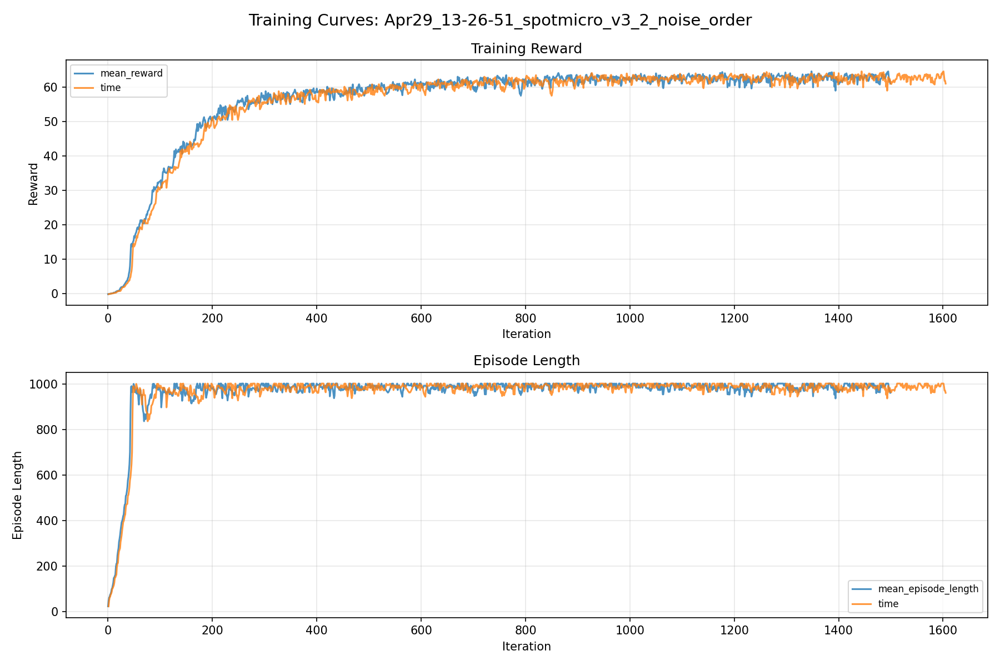
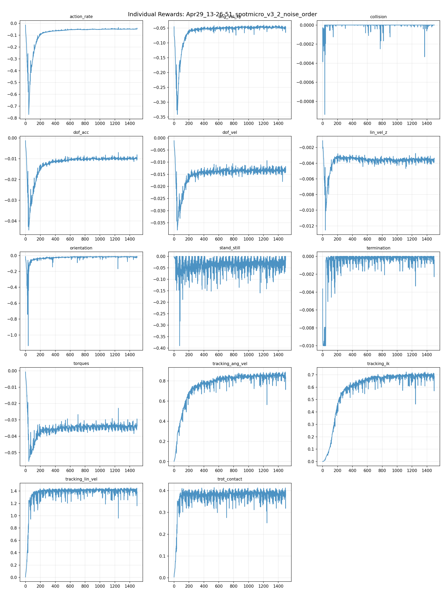
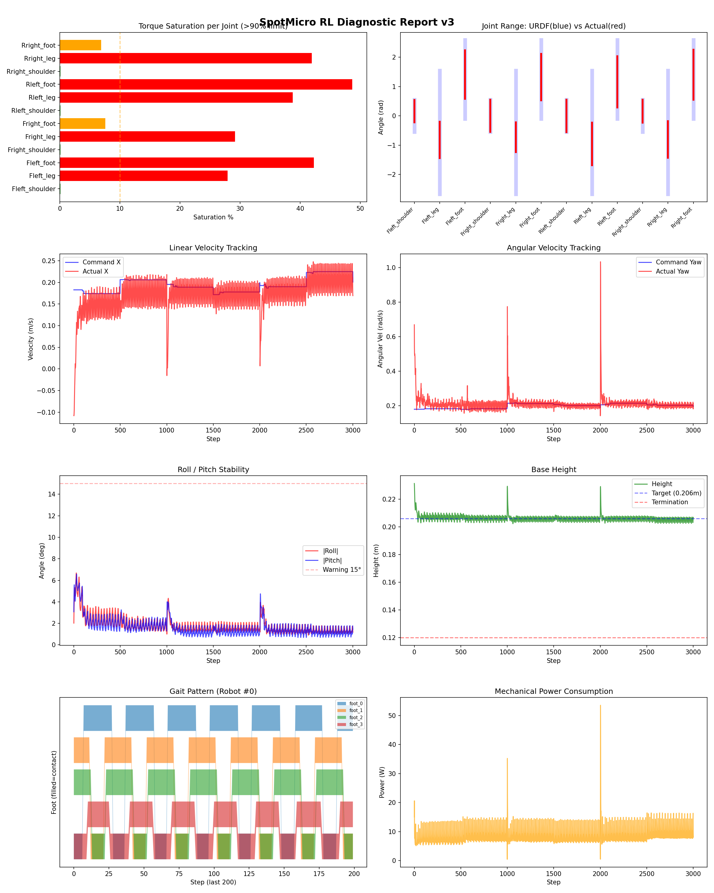
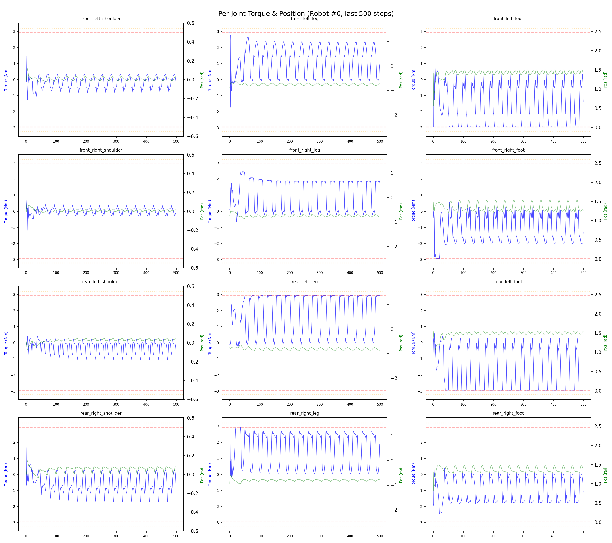
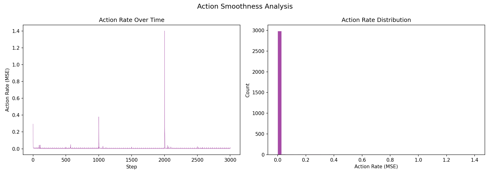

# 실험 029: spotmicro_v3_2_noise_order

- **날짜:** 2026-04-29 13:55
- **Task:** spotmicro_test
- **Run name:** `spotmicro_v3_2_noise_order`
- **판정:** ✅ PASS

---

## 실험 목적

V3.2: observation 조정으로 인한 노이즈 함수 순서 조정 처리.

---

## 변경점 (이전 커밋 대비)

```diff
diff --git a/ai_training/rl/legged_gym/legged_gym/envs/spotmicro_test/spotmicro_test.py b/ai_training/rl/legged_gym/legged_gym/envs/spotmicro_test/spotmicro_test.py
index 9aa61e5..7afb952 100644
--- a/ai_training/rl/legged_gym/legged_gym/envs/spotmicro_test/spotmicro_test.py
+++ b/ai_training/rl/legged_gym/legged_gym/envs/spotmicro_test/spotmicro_test.py
@@ -175,6 +175,33 @@ class SpotmicroTest(LeggedRobot):
         if self.add_noise:
             self.obs_buf += (2 * torch.rand_like(self.obs_buf) - 1) * self.noise_scale_vec
             
+    def _get_noise_scale_vec(self, cfg):
+        noise_vec = torch.zeros_like(self.obs_buf[0])
+        self.add_noise = self.cfg.noise.add_noise
+        noise_scales = self.cfg.noise.noise_scales
+        noise_level = self.cfg.noise.noise_level
+
+        # obs layout:
+        # 0:3   base_ang_vel
+        # 3:6   projected_gravity
+        # 6:9   commands
+        # 9:21  dof_pos - ref_dof_pos
+        # 21:33 dof_vel
+        # 33:45 actions
+        # 45:47 phase_sin, phase_cos
+
+        noise_vec[:3] = noise_scales.ang_vel * noise_level * self.obs_scales.ang_vel
+        noise_vec[3:6] = noise_scales.gravity * noise_level
+        noise_vec[6:9] = 0.0
+        noise_vec[9:21] = noise_scales.dof_pos * noise_level * self.obs_scales.dof_pos
+        noise_vec[21:33] = noise_scales.dof_vel * noise_level * self.obs_scales.dof_vel
+        noise_vec[33:45] = 0.0
+        noise_vec[45:47] = 0.0
+        if self.cfg.terrain.measure_heights:
+            noise_vec[48:235] = noise_scales.height_measurements* noise_level * self.obs_scales.height_measurements
+
+        return noise_vec
+        
     def _reward_feet_air_time(self):
         contact = self.contact_forces[:, self.feet_indices, 2] > 1.
         contact_filt = torch.logical_or(contact, self.last_contacts)
diff --git a/ai_training/rl/legged_gym/legged_gym/envs/spotmicro_test/spotmicro_test_config.py b/ai_training/rl/legged_gym/legged_gym/envs/spotmicro_test/spotmicro_test_config.py
index c1aa8d7..af8ced3 100644
--- a/ai_training/rl/legged_gym/legged_gym/envs/spotmicro_test/spotmicro_test_config.py
+++ b/ai_training/rl/legged_gym/legged_gym/envs/spotmicro_test/spotmicro_test_config.py
@@ -123,7 +123,7 @@ class SpotmicroTestCfgPPO(LeggedRobotCfgPPO):
         entropy_coef = 0.01
 
     class runner(LeggedRobotCfgPPO.runner):
-        run_name = 'spotmicro_v3_1_3_PD_adjust'
+        run_name = 'spotmicro_v3_2_noise_order'
         experiment_name = 'spotmicro_test'
         max_iterations = 1500
         save_interval = 100
diff --git a/ai_training/rl/legged_gym/legged_gym/scripts/play_diagnostic.py b/ai_training/rl/legged_gym/legged_gym/scripts/play_diagnostic.py
index 4a9bb59..5d5b770 100644
--- a/ai_training/rl/legged_gym/legged_gym/scripts/play_diagnostic.py
+++ b/ai_training/rl/legged_gym/legged_gym/scripts/play_diagnostic.py
@@ -416,7 +416,7 @@ def run_diagnostic(args, checkpoint_path=None, lightweight=False, with_dr=False)
         signal = co
```

**변경 요약:**
  + def _get_noise_scale_vec(self, cfg):
  + noise_vec = torch.zeros_like(self.obs_buf[0])
  + self.add_noise = self.cfg.noise.add_noise
  + noise_scales = self.cfg.noise.noise_scales
  + noise_level = self.cfg.noise.noise_level
  + noise_vec[:3] = noise_scales.ang_vel * noise_level * self.obs_scales.ang_vel
  + noise_vec[3:6] = noise_scales.gravity * noise_level
  + noise_vec[6:9] = 0.0
  + noise_vec[9:21] = noise_scales.dof_pos * noise_level * self.obs_scales.dof_pos
  + noise_vec[21:33] = noise_scales.dof_vel * noise_level * self.obs_scales.dof_vel
  + noise_vec[33:45] = 0.0
  + noise_vec[45:47] = 0.0
  + if self.cfg.terrain.measure_heights:
  + noise_vec[48:235] = noise_scales.height_measurements* noise_level * self.obs_scales.height_measurements
  + return noise_vec
  - run_name = 'spotmicro_v3_1_3_PD_adjust'
  + run_name = 'spotmicro_v3_2_noise_order'
  - dt_step = env.dt * env.cfg.control.decimation  # 1 step의 실제 시간(초)
  + dt_step = env.dt  # 1 step의 실제 시간(초)

---

## 현재 Reward Scales

| Reward | Scale |
|--------|-------|
| action_rate | -0.05 |
| ang_vel_xy | -0.4 |
| collision | -1.0 |
| dof_acc | -2.5e-07 |
| dof_vel | -0.001 |
| lin_vel_z | -2.0 |
| orientation | -6.0 |
| stand_still | -0.5 |
| termination | -10.0 |
| torques | -0.001 |
| tracking_ang_vel | 1.3 |
| tracking_ik | 1.0 |
| tracking_lin_vel | 1.5 |
| trot_contact | 0.5 |

---

## 진단 결과 (Diagnostic)

### 핵심 지표

- ✅ Timeout: 96.2% (≥80%)
- ✅ 속도오차 X: 0.0462 m/s (<0.08)
- ⚠️ 토크포화: 20.3% (10~40%)
- ✅ 자세: roll 1.8°, pitch 1.6° (안정)
- ✅ 조기종료: 0.8% (<5%)

### 상세 수치

| 지표 | 값 |
|------|-----|
| Timeout% | 96.2406015037594 |
| 조기종료% | 0.7518796992481203 |
| 속도오차 X | 0.04619809612631798 m/s |
| 속도오차 Y | 0.022846009582281113 m/s |
| 각속도오차 | 0.07202443480491638 rad/s |
| 토크포화% | 20.29086365023865 |
| 평균 높이 | 0.20622781368640514 m |
| Roll (평균) | 1.804773211479187° |
| Pitch (평균) | 1.6187095642089844° |
| Action Rate | 0.005046014674007893 |
| 평균 전력 | 8.52746868133545 W |
| CoT | 1.9451599304661273 |

## Command Mode별 회전 추종 분석

| 모드 | 비율 | 샘플 수 | 평균 abs(cmd_wz) | 평균 abs(actual_wz) | yaw 오차 | 상태 |
|------|------|---------|------------------|---------------------|----------|------|
| 정지 | 1.0% | 2001 | 0.0239 | 0.0543 | 0.0585 | ⚠️ |
| 직진/저회전 | 33.4% | 64223 | 0.0684 | 0.1019 | 0.0736 | ✅ |
| 제자리 회전 | 7.5% | 14457 | 0.2642 | 0.2369 | 0.0628 | ✅ |
| 전진+회전 | 55.4% | 106501 | 0.2756 | 0.2827 | 0.0726 | ✅ |
| 큰 회전명령 | 24.9% | 47946 | 0.3517 | 0.3489 | 0.0699 | ✅ |

> 해석 기준: `제자리 회전`만 나쁘면 pure turn 학습/보행 패턴 문제, `큰 회전명령`만 나쁘면 yaw 명령 범위가 현재 토크/보폭 한계보다 큰 문제, `정지`가 나쁘면 stop drift 문제로 보면 됩니다.
        


## 학습 곡선 분석

| 지표 | 값 | 판정 |
|------|-----|------|
| 수렴 iter (90%) | 294 | 빠름 |
| 후반 안정성 (CV) | 0.016 | 안정 |
| 정체 구간 | 없음 | |


## Per-leg 분석

### 발별 접촉/공중 비율

| 발 | 접촉% | 공중% |
|-----|-------|------|
| foot_0 | 69.2% | 30.8% |
| foot_1 | 68.5% | 31.5% |
| foot_2 | 66.6% | 33.4% |
| foot_3 | 59.3% | 40.7% |

### 관절별 토크 포화

| 관절 | 포화% | 최대토크 | 한계 | 상태 |
|------|------|---------|------|------|
| front_left_shoulder | 0.1% | 2.940 | 2.940 | ✅ |
| front_left_leg | 27.9% | 2.940 | 2.940 | ❌ |
| front_left_foot | 42.3% | 2.940 | 2.940 | ❌ |
| front_right_shoulder | 0.1% | 2.940 | 2.940 | ✅ |
| front_right_leg | 29.1% | 2.940 | 2.940 | ❌ |
| front_right_foot | 7.6% | 2.940 | 2.940 | ⚠️ |
| rear_left_shoulder | 0.1% | 2.940 | 2.940 | ✅ |
| rear_left_leg | 38.8% | 2.940 | 2.940 | ❌ |
| rear_left_foot | 48.7% | 2.940 | 2.940 | ❌ |
| rear_right_shoulder | 0.1% | 2.940 | 2.940 | ✅ |
| rear_right_leg | 41.9% | 2.940 | 2.940 | ❌ |
| rear_right_foot | 6.9% | 2.940 | 2.940 | ⚠️ |


## Gait 분석

| 지표 | 값 |
|------|-----|
| Gait 주파수 | 1.67 Hz |
| Gait 주기 | 30 steps |
| 대각 동기화율 | 89.1% |
| L/R 비대칭 | 0.0%p |
| 판정 | ✅ Trot 패턴 / ✅ 대칭 |


## 관절별 상세

| 관절 | 토크포화% | 사용범위% | 편향(rad) | 한계근접% | 상태 |
|------|----------|----------|----------|----------|------|
| front_left_shoulder | 0.1% | 70% | +0.161 | 0.0% | ⚠️ |
| front_left_leg | 27.9% | 30% | -0.818 | 0.0% | ⚠️ |
| front_left_foot | 42.3% | 62% | +1.412 | 0.0% | ⚠️ |
| front_right_shoulder | 0.1% | 100% | +0.000 | 0.0% | ✅ |
| front_right_leg | 29.1% | 24% | -0.728 | 0.0% | ⚠️ |
| front_right_foot | 7.6% | 59% | +1.323 | 0.0% | ⚠️ |
| rear_left_shoulder | 0.1% | 101% | -0.002 | 0.0% | ✅ |
| rear_left_leg | 38.8% | 35% | -0.953 | 0.0% | ⚠️ |
| rear_left_foot | 48.7% | 65% | +1.162 | 0.0% | ⚠️ |
| rear_right_shoulder | 0.1% | 71% | +0.164 | 0.1% | ⚠️ |
| rear_right_leg | 41.9% | 30% | -0.804 | 0.0% | ⚠️ |
| rear_right_foot | 6.9% | 63% | +1.402 | 0.0% | ⚠️ |


## 에너지 효율 상세

| 지표 | 값 |
|------|-----|
| 평균 전력 | 8.53 W |
| 피크 전력 | 53.53 W |
| 피크/평균 비율 | 6.3x |
| CoT | 1.95 |

### 관절별 전력 분배

| 관절 | 평균전력(W) | 비율% |
|------|-----------|-------|
| front_left_foot | 1.600 | 18.8% |
| rear_left_foot | 1.436 | 16.8% |
| front_right_foot | 1.121 | 13.1% |
| rear_right_foot | 1.013 | 11.9% |
| front_right_leg | 0.814 | 9.5% |
| rear_right_leg | 0.778 | 9.1% |
| rear_left_leg | 0.758 | 8.9% |
| front_left_leg | 0.744 | 8.7% |
| rear_right_shoulder | 0.098 | 1.2% |
| rear_left_shoulder | 0.058 | 0.7% |
| front_left_shoulder | 0.055 | 0.6% |
| front_right_shoulder | 0.053 | 0.6% |


## 이전 실험 대비 비교

| 지표 | 이전 (exp028) | 현재 (exp029) | 변화 |
|------|-------|-------|------|
| Timeout% | 93.4% | 96.2% | ✅ ↑ 2.8099% |
| 속도오차 X | 0.0479 | 0.0462 | ✅ ↓ 0.0017m/s |
| 토크포화 | 19.0% | 20.3% | ⚠️ ↑ 1.3328% |
| Roll | 2.2° | 1.8° | ✅ ↓ 0.4333° |
| Pitch | 2.4° | 1.6° | ✅ ↓ 0.7904° |
| 평균 전력 | 8.1021W | 8.5275W | ⚠️ ↑ 0.4254W |


## Tensorboard 학습 곡선 요약

| 스칼라 | 최종값 | 최대 | 최소 | 후반10% 평균 |
|--------|--------|------|------|-------------|
| rew_action_rate | -0.0468 | -0.0146 | -0.7700 | -0.0487 |
| rew_ang_vel_xy | -0.0457 | -0.0395 | -0.3413 | -0.0473 |
| rew_collision | 0.0000 | 0.0000 | -0.0009 | -0.0000 |
| rew_dof_acc | -0.0097 | -0.0013 | -0.0444 | -0.0099 |
| rew_dof_vel | -0.0129 | -0.0011 | -0.0380 | -0.0135 |
| rew_lin_vel_z | -0.0034 | -0.0011 | -0.0125 | -0.0036 |
| rew_orientation | -0.0137 | -0.0096 | -1.1363 | -0.0169 |
| rew_stand_still | -0.0165 | 0.0000 | -0.3896 | -0.0317 |
| rew_termination | -0.0004 | 0.0000 | -0.0100 | -0.0002 |
| rew_torques | -0.0329 | -0.0007 | -0.0554 | -0.0344 |
| rew_tracking_ang_vel | 0.8214 | 0.8880 | 0.0023 | 0.8512 |
| rew_tracking_ik | 0.6763 | 0.7229 | 0.0011 | 0.6924 |
| rew_tracking_lin_vel | 1.3795 | 1.4564 | 0.0060 | 1.4094 |
| rew_trot_contact | 0.3783 | 0.4140 | 0.0036 | 0.3825 |
| learning_rate | 0.0004 | 0.0100 | 0.0000 | 0.0004 |
| surrogate | -0.0025 | 0.0045 | -0.0087 | -0.0028 |
| value_function | 0.0113 | 0.1438 | 0.0026 | 0.0179 |
| collection time | 0.7774 | 0.8768 | 0.7402 | 0.7811 |
| learning_time | 0.2881 | 0.3413 | 0.2675 | 0.2872 |
| total_fps | 92254.0000 | 95881.0000 | 80704.0000 | 92046.3467 |
| mean_noise_std | 0.1803 | 1.0015 | 0.1723 | 0.1828 |
| mean_episode_length | 961.1700 | 1002.0000 | 22.2400 | 987.0712 |
| time | 961.1700 | 1002.0000 | 22.2400 | 987.0712 |
| mean_reward | 61.0601 | 64.6216 | -0.1659 | 62.7230 |
| time | 61.0601 | 64.6216 | -0.1659 | 62.7230 |

총 학습 iteration: 1499


---

## 그래프

### Tensorboard 학습 곡선



### Diagnostic 결과





---

## 결론 및 다음 실험 방향

**자동 판정:** ✅ PASS

대부분 기준을 통과했으나 일부 항목이 보통 수준입니다.
  - ⚠️ 토크포화: 20.3% (10~40%)

> 💡 위 결론은 자동 생성되었습니다. 필요시 수정하세요.

---

## 메모

_(추가 메모가 있으면 여기에 작성)_

