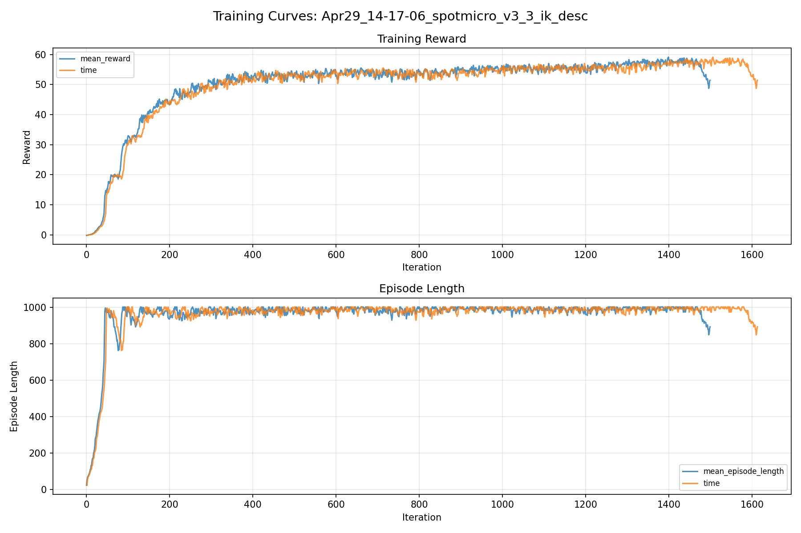
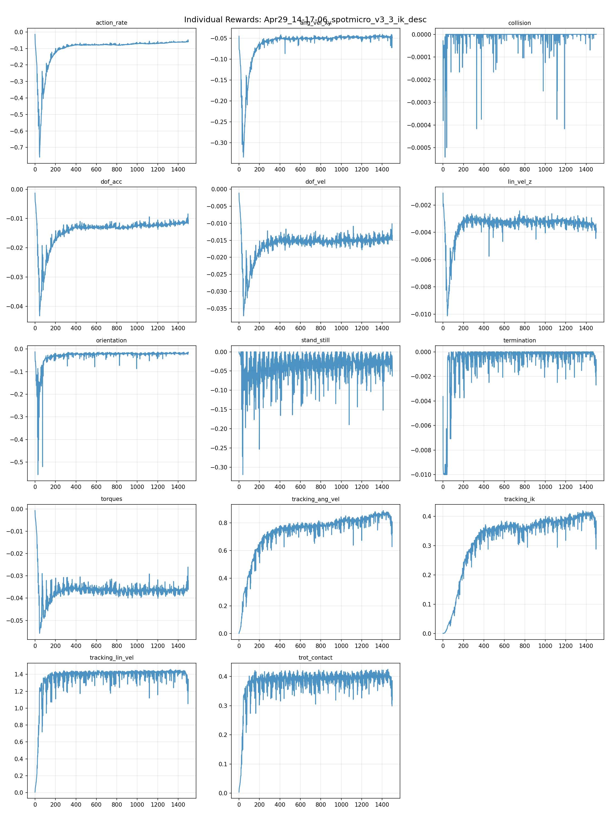
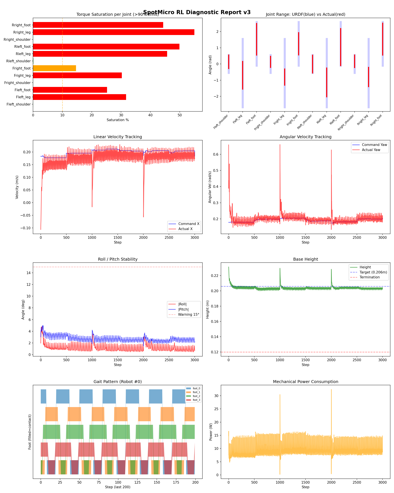
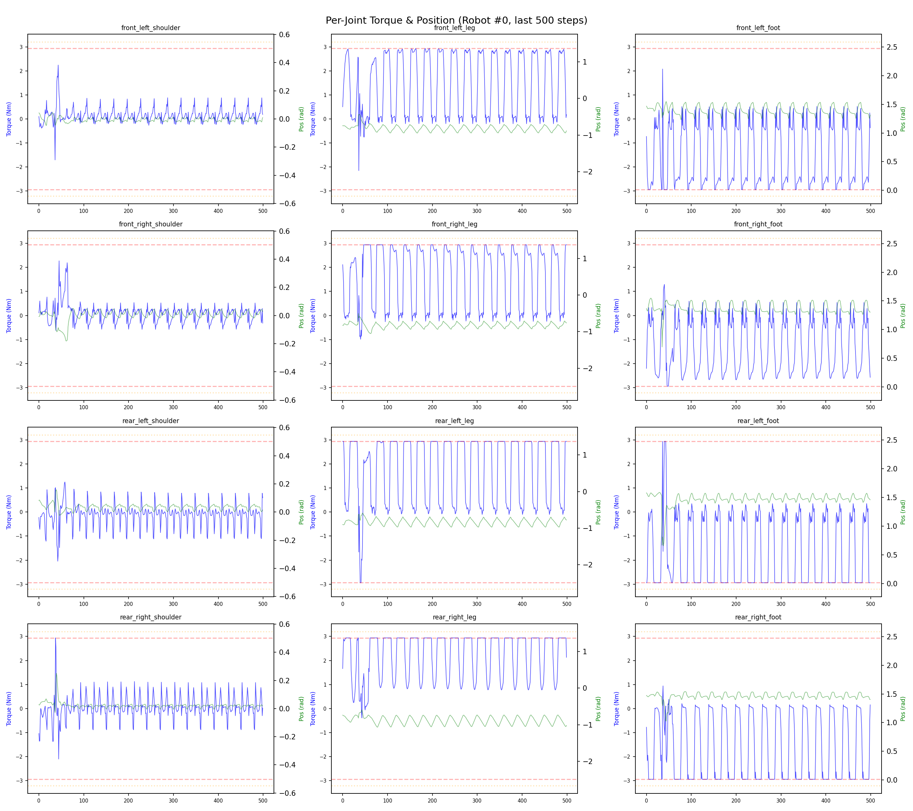
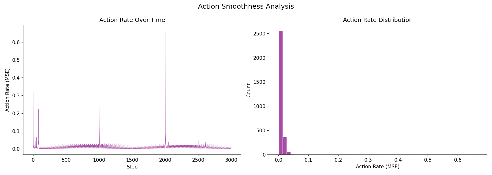

# 실험 030: spotmicro_v3_3_ik_desc

- **날짜:** 2026-04-29 14:45
- **Task:** spotmicro_test
- **Run name:** `spotmicro_v3_3_ik_desc`
- **판정:** ✅ PASS

---

## 실험 목적

V3.3: IK 구조가 토크를 과도하게 먹는 구조인지 확인하기 위한 IK tracking reward 감소.

---

## 변경점 (이전 커밋 대비)

```diff
diff --git a/ai_training/rl/legged_gym/legged_gym/envs/spotmicro_test/spotmicro_test_config.py b/ai_training/rl/legged_gym/legged_gym/envs/spotmicro_test/spotmicro_test_config.py
index af8ced3..18f4c61 100644
--- a/ai_training/rl/legged_gym/legged_gym/envs/spotmicro_test/spotmicro_test_config.py
+++ b/ai_training/rl/legged_gym/legged_gym/envs/spotmicro_test/spotmicro_test_config.py
@@ -67,7 +67,7 @@ class SpotmicroTestCfg(LeggedRobotCfg):
             symmetric_gait = 0.0
             feet_clearance = 0.0
             trot_contact = 0.5
-            tracking_ik = 1.0
+            tracking_ik = 0.7
             stand_still = -0.5
         soft_dof_pos_limit = 0.9
         base_height_target = 0.206
@@ -123,7 +123,7 @@ class SpotmicroTestCfgPPO(LeggedRobotCfgPPO):
         entropy_coef = 0.01
 
     class runner(LeggedRobotCfgPPO.runner):
-        run_name = 'spotmicro_v3_2_noise_order'
+        run_name = 'spotmicro_v3_3_ik_desc'
         experiment_name = 'spotmicro_test'
         max_iterations = 1500
         save_interval = 100
```

**변경 요약:**
  - tracking_ik = 1.0
  + tracking_ik = 0.7
  - run_name = 'spotmicro_v3_2_noise_order'
  + run_name = 'spotmicro_v3_3_ik_desc'

---

## 현재 Reward Scales

| Reward | Scale |
|--------|-------|
| action_rate | -0.05 |
| ang_vel_xy | -0.4 |
| collision | -1.0 |
| dof_acc | -2.5e-07 |
| dof_vel | -0.001 |
| lin_vel_z | -2.0 |
| orientation | -6.0 |
| stand_still | -0.5 |
| termination | -10.0 |
| torques | -0.001 |
| tracking_ang_vel | 1.3 |
| tracking_ik | 0.7 |
| tracking_lin_vel | 1.5 |
| trot_contact | 0.5 |

---

## 진단 결과 (Diagnostic)

### 핵심 지표

- ✅ Timeout: 94.8% (≥80%)
- ✅ 속도오차 X: 0.0442 m/s (<0.08)
- ⚠️ 토크포화: 24.7% (10~40%)
- ✅ 자세: roll 1.2°, pitch 2.7° (안정)
- ✅ 조기종료: 1.5% (<5%)

### 상세 수치

| 지표 | 값 |
|------|-----|
| Timeout% | 94.81481481481482 |
| 조기종료% | 1.4814814814814816 |
| 속도오차 X | 0.044202886521816254 m/s |
| 속도오차 Y | 0.019737381488084793 m/s |
| 각속도오차 | 0.07023651152849197 rad/s |
| 토크포화% | 24.749425921300926 |
| 평균 높이 | 0.20391321668039747 m |
| Roll (평균) | 1.2069333791732788° |
| Pitch (평균) | 2.7381296157836914° |
| Action Rate | 0.009656516835093498 |
| 평균 전력 | 9.31376838684082 W |
| CoT | 2.069441904637245 |

## Command Mode별 회전 추종 분석

| 모드 | 비율 | 샘플 수 | 평균 abs(cmd_wz) | 평균 abs(actual_wz) | yaw 오차 | 상태 |
|------|------|---------|------------------|---------------------|----------|------|
| 정지 | 1.0% | 1885 | 0.0369 | 0.0928 | 0.0975 | ❌ |
| 직진/저회전 | 36.0% | 69178 | 0.0733 | 0.1017 | 0.0695 | ✅ |
| 제자리 회전 | 7.6% | 14668 | 0.2792 | 0.2601 | 0.0747 | ✅ |
| 전진+회전 | 52.3% | 100446 | 0.2692 | 0.2692 | 0.0681 | ✅ |
| 큰 회전명령 | 21.6% | 41454 | 0.3518 | 0.3457 | 0.0648 | ✅ |

> 해석 기준: `제자리 회전`만 나쁘면 pure turn 학습/보행 패턴 문제, `큰 회전명령`만 나쁘면 yaw 명령 범위가 현재 토크/보폭 한계보다 큰 문제, `정지`가 나쁘면 stop drift 문제로 보면 됩니다.
        


## 학습 곡선 분석

| 지표 | 값 | 판정 |
|------|-----|------|
| 수렴 iter (90%) | 339 | 빠름 |
| 후반 안정성 (CV) | 0.029 | 안정 |
| 정체 구간 | 없음 | |


## Per-leg 분석

### 발별 접촉/공중 비율

| 발 | 접촉% | 공중% |
|-----|-------|------|
| foot_0 | 63.9% | 36.1% |
| foot_1 | 66.3% | 33.7% |
| foot_2 | 66.1% | 33.9% |
| foot_3 | 60.6% | 39.4% |

### 관절별 토크 포화

| 관절 | 포화% | 최대토크 | 한계 | 상태 |
|------|------|---------|------|------|
| front_left_shoulder | 0.0% | 2.940 | 2.940 | ✅ |
| front_left_leg | 31.7% | 2.940 | 2.940 | ❌ |
| front_left_foot | 25.2% | 2.940 | 2.940 | ❌ |
| front_right_shoulder | 0.0% | 2.940 | 2.940 | ✅ |
| front_right_leg | 30.3% | 2.940 | 2.940 | ❌ |
| front_right_foot | 14.6% | 2.940 | 2.940 | ⚠️ |
| rear_left_shoulder | 0.1% | 2.940 | 2.940 | ✅ |
| rear_left_leg | 45.7% | 2.940 | 2.940 | ❌ |
| rear_left_foot | 49.9% | 2.940 | 2.940 | ❌ |
| rear_right_shoulder | 0.0% | 2.940 | 2.940 | ✅ |
| rear_right_leg | 55.0% | 2.940 | 2.940 | ❌ |
| rear_right_foot | 44.3% | 2.940 | 2.940 | ❌ |


## Gait 분석

| 지표 | 값 |
|------|-----|
| Gait 주파수 | 1.67 Hz |
| Gait 주기 | 30 steps |
| 대각 동기화율 | 88.8% |
| L/R 비대칭 | 0.0%p |
| 판정 | ✅ Trot 패턴 / ✅ 대칭 |


## 관절별 상세

| 관절 | 토크포화% | 사용범위% | 편향(rad) | 한계근접% | 상태 |
|------|----------|----------|----------|----------|------|
| front_left_shoulder | 0.0% | 75% | +0.136 | 0.0% | ⚠️ |
| front_left_leg | 31.7% | 41% | -0.699 | 0.0% | ⚠️ |
| front_left_foot | 25.2% | 72% | +1.526 | 0.0% | ⚠️ |
| front_right_shoulder | 0.0% | 62% | +0.132 | 0.0% | ⚠️ |
| front_right_leg | 30.3% | 24% | -0.805 | 0.0% | ⚠️ |
| front_right_foot | 14.6% | 51% | +1.249 | 0.0% | ⚠️ |
| rear_left_shoulder | 0.1% | 100% | -0.004 | 0.0% | ✅ |
| rear_left_leg | 45.7% | 42% | -1.142 | 0.0% | ⚠️ |
| rear_left_foot | 49.9% | 85% | +1.046 | 0.0% | ⚠️ |
| rear_right_shoulder | 0.0% | 71% | +0.166 | 0.0% | ⚠️ |
| rear_right_leg | 55.0% | 28% | -0.806 | 0.0% | ⚠️ |
| rear_right_foot | 44.3% | 73% | +1.536 | 0.0% | ⚠️ |


## 에너지 효율 상세

| 지표 | 값 |
|------|-----|
| 평균 전력 | 9.31 W |
| 피크 전력 | 32.43 W |
| 피크/평균 비율 | 3.5x |
| CoT | 2.07 |

### 관절별 전력 분배

| 관절 | 평균전력(W) | 비율% |
|------|-----------|-------|
| rear_right_foot | 1.504 | 16.2% |
| front_left_foot | 1.482 | 15.9% |
| rear_right_leg | 1.249 | 13.4% |
| rear_left_foot | 1.241 | 13.3% |
| front_right_foot | 1.049 | 11.3% |
| front_right_leg | 0.871 | 9.3% |
| rear_left_leg | 0.844 | 9.1% |
| front_left_leg | 0.814 | 8.7% |
| front_right_shoulder | 0.071 | 0.8% |
| rear_right_shoulder | 0.071 | 0.8% |
| rear_left_shoulder | 0.067 | 0.7% |
| front_left_shoulder | 0.050 | 0.5% |


## 이전 실험 대비 비교

| 지표 | 이전 (exp029) | 현재 (exp030) | 변화 |
|------|-------|-------|------|
| Timeout% | 96.2% | 94.8% | ⚠️ ↓ 1.4258% |
| 속도오차 X | 0.0462 | 0.0442 | ✅ ↓ 0.0020m/s |
| 토크포화 | 20.3% | 24.7% | ⚠️ ↑ 4.4586% |
| Roll | 1.8° | 1.2° | ✅ ↓ 0.5978° |
| Pitch | 1.6° | 2.7° | ⚠️ ↑ 1.1194° |
| 평균 전력 | 8.5275W | 9.3138W | ⚠️ ↑ 0.7863W |


## Tensorboard 학습 곡선 요약

| 스칼라 | 최종값 | 최대 | 최소 | 후반10% 평균 |
|--------|--------|------|------|-------------|
| rew_action_rate | -0.0547 | -0.0146 | -0.7589 | -0.0608 |
| rew_ang_vel_xy | -0.0467 | -0.0407 | -0.3348 | -0.0469 |
| rew_collision | 0.0000 | 0.0000 | -0.0005 | -0.0000 |
| rew_dof_acc | -0.0104 | -0.0013 | -0.0433 | -0.0114 |
| rew_dof_vel | -0.0136 | -0.0011 | -0.0372 | -0.0144 |
| rew_lin_vel_z | -0.0040 | -0.0011 | -0.0101 | -0.0035 |
| rew_orientation | -0.0146 | -0.0127 | -0.5549 | -0.0193 |
| rew_stand_still | -0.0631 | 0.0000 | -0.3196 | -0.0281 |
| rew_termination | -0.0016 | 0.0000 | -0.0100 | -0.0002 |
| rew_torques | -0.0322 | -0.0007 | -0.0558 | -0.0363 |
| rew_tracking_ang_vel | 0.7274 | 0.8899 | 0.0023 | 0.8489 |
| rew_tracking_ik | 0.3412 | 0.4199 | 0.0008 | 0.3995 |
| rew_tracking_lin_vel | 1.2031 | 1.4598 | 0.0060 | 1.4062 |
| rew_trot_contact | 0.3195 | 0.4248 | 0.0036 | 0.3950 |
| learning_rate | 0.0000 | 0.0100 | 0.0000 | 0.0003 |
| surrogate | -0.0016 | 0.0103 | -0.0076 | -0.0023 |
| value_function | 0.0083 | 0.1000 | 0.0024 | 0.0131 |
| collection time | 0.7589 | 0.8813 | 0.7494 | 0.7888 |
| learning_time | 0.2851 | 0.3416 | 0.2741 | 0.2866 |
| total_fps | 94155.0000 | 95128.0000 | 81010.0000 | 91439.3133 |
| mean_noise_std | 0.2028 | 1.0019 | 0.1934 | 0.2033 |
| mean_episode_length | 892.7100 | 1002.0000 | 22.2400 | 979.9051 |
| time | 892.7100 | 1002.0000 | 22.2400 | 979.9051 |
| mean_reward | 51.4208 | 59.1193 | -0.1660 | 56.7289 |
| time | 51.4208 | 59.1193 | -0.1660 | 56.7289 |

총 학습 iteration: 1499


---

## 그래프

### Tensorboard 학습 곡선



### Diagnostic 결과





---

## 결론 및 다음 실험 방향

**자동 판정:** ✅ PASS

대부분 기준을 통과했으나 일부 항목이 보통 수준입니다.
  - ⚠️ 토크포화: 24.7% (10~40%)

> 💡 위 결론은 자동 생성되었습니다. 필요시 수정하세요.

---

## 메모

의도했던 토크 감소 실패. 토크 포화 증가와 action_rate 가 증가했다. 실패

