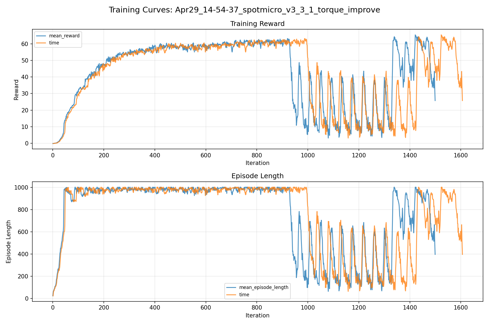
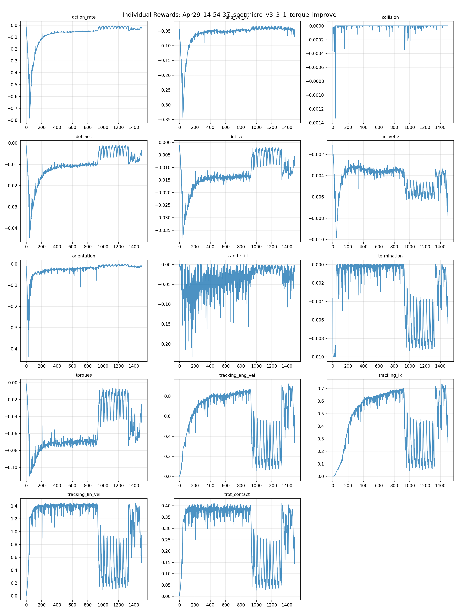
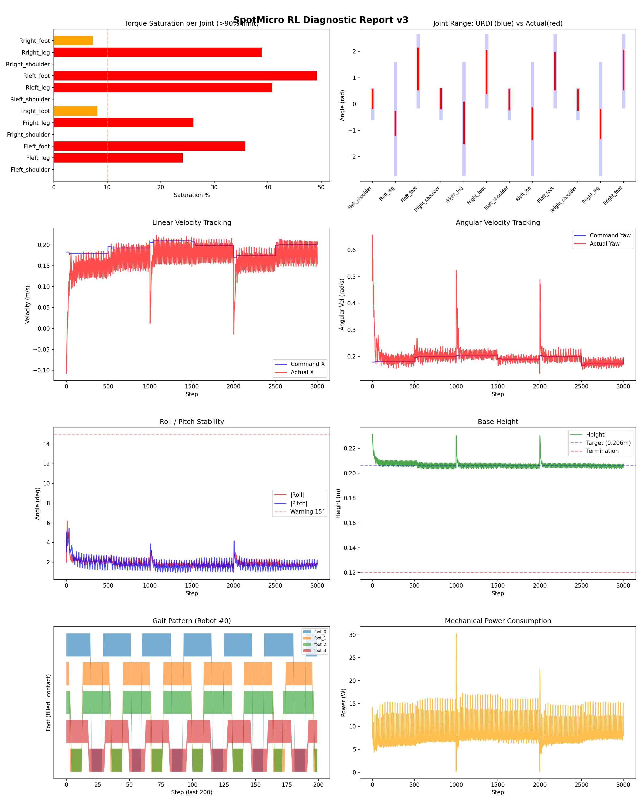
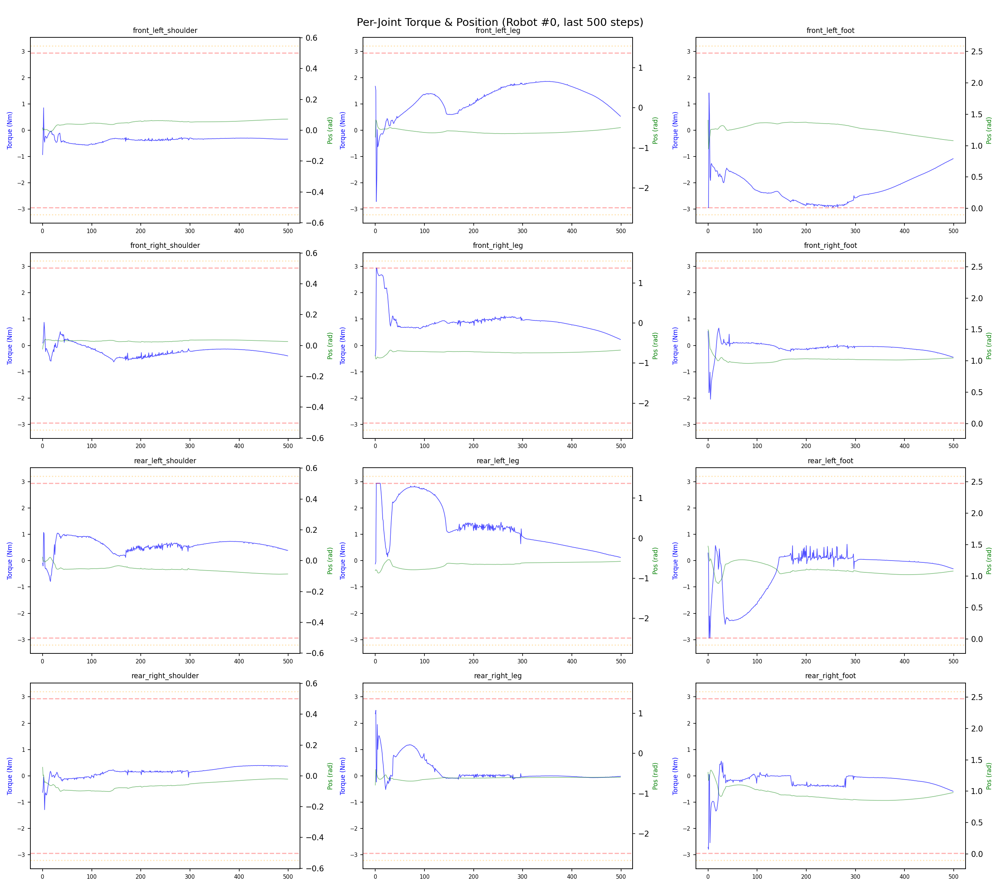
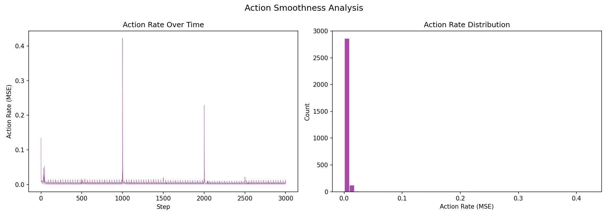

# 실험 031: spotmicro_v3_3_1_torque_improve

- **날짜:** 2026-04-29 15:23
- **Task:** spotmicro_test
- **Run name:** `spotmicro_v3_3_1_torque_improve`
- **판정:** ✅ PASS

---

## 실험 목적

V3.3.1: torque 페널티 증가시켜 leg, foot 토크 완화 시도.

---

## 변경점 (이전 커밋 대비)

```diff
diff --git a/ai_training/rl/legged_gym/legged_gym/envs/spotmicro_test/spotmicro_test_config.py b/ai_training/rl/legged_gym/legged_gym/envs/spotmicro_test/spotmicro_test_config.py
index 18f4c61..367e74f 100644
--- a/ai_training/rl/legged_gym/legged_gym/envs/spotmicro_test/spotmicro_test_config.py
+++ b/ai_training/rl/legged_gym/legged_gym/envs/spotmicro_test/spotmicro_test_config.py
@@ -55,7 +55,7 @@ class SpotmicroTestCfg(LeggedRobotCfg):
             lin_vel_z = -2.0
             ang_vel_xy = -0.4
             orientation = -6.0
-            torques = -0.001
+            torques = -0.002
             dof_vel = -0.001
             dof_acc = -2.5e-7
             action_rate = -0.05
@@ -67,7 +67,7 @@ class SpotmicroTestCfg(LeggedRobotCfg):
             symmetric_gait = 0.0
             feet_clearance = 0.0
             trot_contact = 0.5
-            tracking_ik = 0.7
+            tracking_ik = 1.0
             stand_still = -0.5
         soft_dof_pos_limit = 0.9
         base_height_target = 0.206
@@ -123,7 +123,7 @@ class SpotmicroTestCfgPPO(LeggedRobotCfgPPO):
         entropy_coef = 0.01
 
     class runner(LeggedRobotCfgPPO.runner):
-        run_name = 'spotmicro_v3_3_ik_desc'
+        run_name = 'spotmicro_v3_3_1_torque_improve'
         experiment_name = 'spotmicro_test'
         max_iterations = 1500
         save_interval = 100
```

**변경 요약:**
  - torques = -0.001
  + torques = -0.002
  - tracking_ik = 0.7
  + tracking_ik = 1.0
  - run_name = 'spotmicro_v3_3_ik_desc'
  + run_name = 'spotmicro_v3_3_1_torque_improve'

---

## 현재 Reward Scales

| Reward | Scale |
|--------|-------|
| action_rate | -0.05 |
| ang_vel_xy | -0.4 |
| collision | -1.0 |
| dof_acc | -2.5e-07 |
| dof_vel | -0.001 |
| lin_vel_z | -2.0 |
| orientation | -6.0 |
| stand_still | -0.5 |
| termination | -10.0 |
| torques | -0.002 |
| tracking_ang_vel | 1.3 |
| tracking_ik | 1.0 |
| tracking_lin_vel | 1.5 |
| trot_contact | 0.5 |

---

## 진단 결과 (Diagnostic)

### 핵심 지표

- ✅ Timeout: 97.0% (≥80%)
- ✅ 속도오차 X: 0.0469 m/s (<0.08)
- ⚠️ 토크포화: 19.2% (10~40%)
- ✅ 자세: roll 1.9°, pitch 1.8° (안정)
- ✅ 조기종료: 2.3% (<5%)

### 상세 수치

| 지표 | 값 |
|------|-----|
| Timeout% | 96.96969696969697 |
| 조기종료% | 2.272727272727273 |
| 속도오차 X | 0.046864572912454605 m/s |
| 속도오차 Y | 0.021360648795962334 m/s |
| 각속도오차 | 0.0691101998090744 rad/s |
| 토크포화% | 19.199853965478965 |
| 평균 높이 | 0.20669517683716881 m |
| Roll (평균) | 1.9351392984390259° |
| Pitch (평균) | 1.8052961826324463° |
| Action Rate | 0.004179686773568392 |
| 평균 전력 | 8.369754791259766 W |
| CoT | 1.9529956895947596 |

## Command Mode별 회전 추종 분석

| 모드 | 비율 | 샘플 수 | 평균 abs(cmd_wz) | 평균 abs(actual_wz) | yaw 오차 | 상태 |
|------|------|---------|------------------|---------------------|----------|------|
| 정지 | 1.6% | 3000 | 0.0272 | 0.0552 | 0.0580 | ⚠️ |
| 직진/저회전 | 35.2% | 67602 | 0.0712 | 0.1052 | 0.0720 | ✅ |
| 제자리 회전 | 9.6% | 18478 | 0.2559 | 0.2351 | 0.0676 | ✅ |
| 전진+회전 | 50.8% | 97601 | 0.2704 | 0.2665 | 0.0672 | ✅ |
| 큰 회전명령 | 21.3% | 41023 | 0.3453 | 0.3329 | 0.0691 | ✅ |

> 해석 기준: `제자리 회전`만 나쁘면 pure turn 학습/보행 패턴 문제, `큰 회전명령`만 나쁘면 yaw 명령 범위가 현재 토크/보폭 한계보다 큰 문제, `정지`가 나쁘면 stop drift 문제로 보면 됩니다.
        


## 학습 곡선 분석

| 지표 | 값 | 판정 |
|------|-----|------|
| 수렴 iter (90%) | 391 | 빠름 |
| 후반 안정성 (CV) | 0.572 | 불안정 |
| 정체 구간 | 없음 | |


## Per-leg 분석

### 발별 접촉/공중 비율

| 발 | 접촉% | 공중% |
|-----|-------|------|
| foot_0 | 68.9% | 31.1% |
| foot_1 | 69.5% | 30.5% |
| foot_2 | 68.8% | 31.2% |
| foot_3 | 57.9% | 42.1% |

### 관절별 토크 포화

| 관절 | 포화% | 최대토크 | 한계 | 상태 |
|------|------|---------|------|------|
| front_left_shoulder | 0.0% | 2.940 | 2.940 | ✅ |
| front_left_leg | 24.1% | 2.940 | 2.940 | ❌ |
| front_left_foot | 35.8% | 2.940 | 2.940 | ❌ |
| front_right_shoulder | 0.0% | 2.940 | 2.940 | ✅ |
| front_right_leg | 26.1% | 2.940 | 2.940 | ❌ |
| front_right_foot | 8.1% | 2.940 | 2.940 | ⚠️ |
| rear_left_shoulder | 0.0% | 2.940 | 2.940 | ✅ |
| rear_left_leg | 40.9% | 2.940 | 2.940 | ❌ |
| rear_left_foot | 49.2% | 2.940 | 2.940 | ❌ |
| rear_right_shoulder | 0.0% | 2.940 | 2.940 | ✅ |
| rear_right_leg | 38.9% | 2.940 | 2.940 | ❌ |
| rear_right_foot | 7.3% | 2.940 | 2.940 | ⚠️ |


## Gait 분석

| 지표 | 값 |
|------|-----|
| Gait 주파수 | 1.67 Hz |
| Gait 주기 | 30 steps |
| 대각 동기화율 | 85.0% |
| L/R 비대칭 | 0.0%p |
| 판정 | ✅ Trot 패턴 / ✅ 대칭 |


## 관절별 상세

| 관절 | 토크포화% | 사용범위% | 편향(rad) | 한계근접% | 상태 |
|------|----------|----------|----------|----------|------|
| front_left_shoulder | 0.0% | 64% | +0.206 | 0.0% | ⚠️ |
| front_left_leg | 24.1% | 22% | -0.734 | 0.0% | ⚠️ |
| front_left_foot | 35.8% | 58% | +1.334 | 0.0% | ⚠️ |
| front_right_shoulder | 0.0% | 68% | +0.209 | 0.0% | ⚠️ |
| front_right_leg | 26.1% | 37% | -0.719 | 0.0% | ⚠️ |
| front_right_foot | 8.1% | 60% | +1.209 | 0.0% | ⚠️ |
| rear_left_shoulder | 0.0% | 69% | +0.171 | 0.0% | ⚠️ |
| rear_left_leg | 40.9% | 28% | -0.747 | 0.0% | ⚠️ |
| rear_left_foot | 49.2% | 51% | +1.242 | 0.0% | ⚠️ |
| rear_right_shoulder | 0.0% | 71% | +0.160 | 0.0% | ⚠️ |
| rear_right_leg | 38.9% | 26% | -0.765 | 0.0% | ⚠️ |
| rear_right_foot | 7.3% | 55% | +1.295 | 0.0% | ⚠️ |


## 에너지 효율 상세

| 지표 | 값 |
|------|-----|
| 평균 전력 | 8.37 W |
| 피크 전력 | 30.32 W |
| 피크/평균 비율 | 3.6x |
| CoT | 1.95 |

### 관절별 전력 분배

| 관절 | 평균전력(W) | 비율% |
|------|-----------|-------|
| front_left_foot | 1.531 | 18.3% |
| rear_left_foot | 1.404 | 16.8% |
| front_right_foot | 1.090 | 13.0% |
| rear_right_foot | 1.040 | 12.4% |
| rear_right_leg | 0.792 | 9.5% |
| front_right_leg | 0.790 | 9.4% |
| rear_left_leg | 0.755 | 9.0% |
| front_left_leg | 0.741 | 8.9% |
| rear_right_shoulder | 0.081 | 1.0% |
| rear_left_shoulder | 0.057 | 0.7% |
| front_right_shoulder | 0.052 | 0.6% |
| front_left_shoulder | 0.035 | 0.4% |


## 이전 실험 대비 비교

| 지표 | 이전 (exp030) | 현재 (exp031) | 변화 |
|------|-------|-------|------|
| Timeout% | 94.8% | 97.0% | ✅ ↑ 2.1549% |
| 속도오차 X | 0.0442 | 0.0469 | ⚠️ ↑ 0.0027m/s |
| 토크포화 | 24.7% | 19.2% | ✅ ↓ 5.5496% |
| Roll | 1.2° | 1.9° | ⚠️ ↑ 0.7282° |
| Pitch | 2.7° | 1.8° | ✅ ↓ 0.9328° |
| 평균 전력 | 9.3138W | 8.3698W | ✅ ↓ 0.9440W |


## Tensorboard 학습 곡선 요약

| 스칼라 | 최종값 | 최대 | 최소 | 후반10% 평균 |
|--------|--------|------|------|-------------|
| rew_action_rate | -0.0183 | -0.0052 | -0.7832 | -0.0320 |
| rew_ang_vel_xy | -0.0632 | -0.0327 | -0.3452 | -0.0448 |
| rew_collision | 0.0000 | 0.0000 | -0.0013 | -0.0000 |
| rew_dof_acc | -0.0045 | -0.0010 | -0.0444 | -0.0073 |
| rew_dof_vel | -0.0069 | -0.0011 | -0.0379 | -0.0106 |
| rew_lin_vel_z | -0.0065 | -0.0011 | -0.0098 | -0.0044 |
| rew_orientation | -0.0145 | -0.0030 | -0.4382 | -0.0125 |
| rew_stand_still | -0.0023 | 0.0000 | -0.2327 | -0.0279 |
| rew_termination | -0.0056 | 0.0000 | -0.0100 | -0.0021 |
| rew_torques | -0.0330 | -0.0014 | -0.1104 | -0.0551 |
| rew_tracking_ang_vel | 0.4094 | 0.9218 | 0.0023 | 0.7221 |
| rew_tracking_ik | 0.3330 | 0.7379 | 0.0011 | 0.5814 |
| rew_tracking_lin_vel | 0.6368 | 1.4434 | 0.0060 | 1.1402 |
| rew_trot_contact | 0.1812 | 0.4115 | 0.0036 | 0.3080 |
| learning_rate | 0.0000 | 0.0100 | 0.0000 | 0.0000 |
| surrogate | -0.0019 | 0.0429 | -0.0085 | -0.0010 |
| value_function | 0.0052 | 2.4363 | 0.0030 | 0.0107 |
| collection time | 0.7794 | 0.8844 | 0.7416 | 0.7807 |
| learning_time | 0.2888 | 0.3448 | 0.2744 | 0.2868 |
| total_fps | 92025.0000 | 95647.0000 | 79974.0000 | 92108.5600 |
| mean_noise_std | 0.1545 | 1.0020 | 0.1545 | 0.1602 |
| mean_episode_length | 395.8300 | 1002.0000 | 22.2400 | 804.8518 |
| time | 395.8300 | 1002.0000 | 22.2400 | 804.8518 |
| mean_reward | 25.7489 | 65.4627 | -0.1664 | 52.0085 |
| time | 25.7489 | 65.4627 | -0.1664 | 52.0085 |

총 학습 iteration: 1499


---

## 그래프

### Tensorboard 학습 곡선



### Diagnostic 결과





---

## 결론 및 다음 실험 방향

**자동 판정:** ✅ PASS

대부분 기준을 통과했으나 일부 항목이 보통 수준입니다.
  - ⚠️ 토크포화: 19.2% (10~40%)

> 💡 위 결론은 자동 생성되었습니다. 필요시 수정하세요.

---

## 메모

900 iter 이후, 학습 후반부에 전략이 변경됨. tracking 포기하고 torque를 줄이는 방향으로 변경한걸로 보인다. torque 페널티 2배는 너무 쎘다. 중간값 1.5배로 해보자. 

