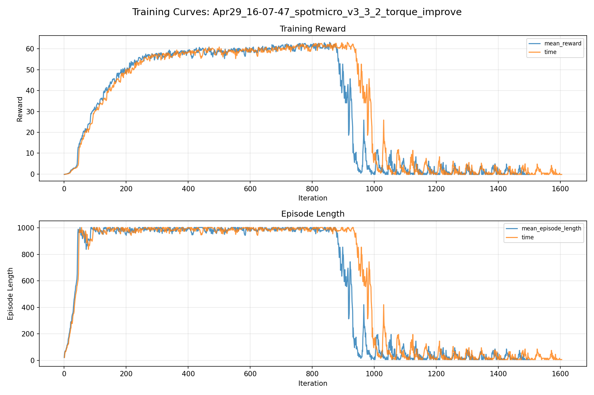
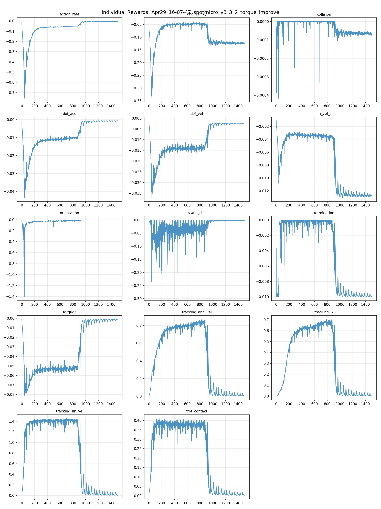
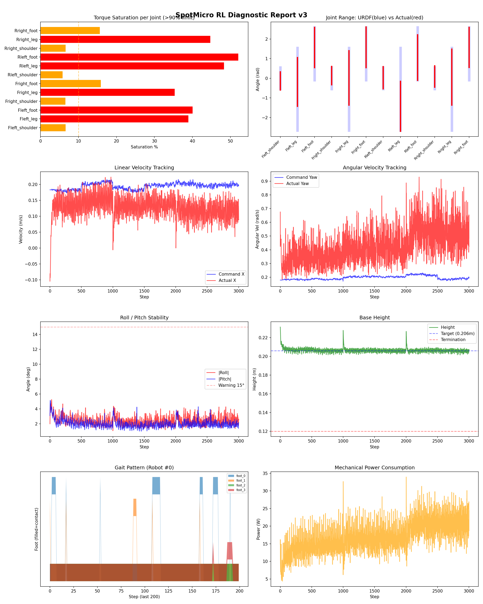
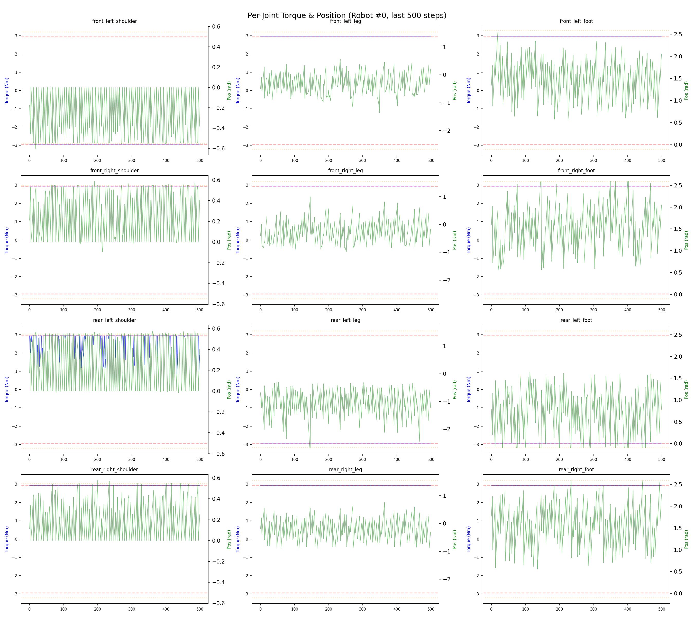
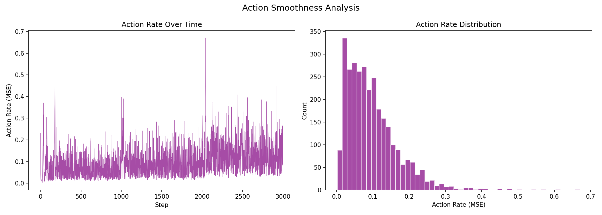

# 실험 032: spotmicro_v3_3_2_torque_improve

- **날짜:** 2026-04-29 16:36
- **Task:** spotmicro_test
- **Run name:** `spotmicro_v3_3_2_torque_improve`
- **판정:** ❌ FAIL (일부 기준 미달)

---

## 실험 목적

V3.3.2: torque  페널티 적당히 조절, leg, foot 토크 완화 시도.

---

## 변경점 (이전 커밋 대비)

```diff
diff --git a/ai_training/rl/legged_gym/legged_gym/envs/spotmicro_test/spotmicro_test_config.py b/ai_training/rl/legged_gym/legged_gym/envs/spotmicro_test/spotmicro_test_config.py
index 367e74f..a8c6bfc 100644
--- a/ai_training/rl/legged_gym/legged_gym/envs/spotmicro_test/spotmicro_test_config.py
+++ b/ai_training/rl/legged_gym/legged_gym/envs/spotmicro_test/spotmicro_test_config.py
@@ -55,7 +55,7 @@ class SpotmicroTestCfg(LeggedRobotCfg):
             lin_vel_z = -2.0
             ang_vel_xy = -0.4
             orientation = -6.0
-            torques = -0.002
+            torques = -0.0015
             dof_vel = -0.001
             dof_acc = -2.5e-7
             action_rate = -0.05
@@ -123,7 +123,7 @@ class SpotmicroTestCfgPPO(LeggedRobotCfgPPO):
         entropy_coef = 0.01
 
     class runner(LeggedRobotCfgPPO.runner):
-        run_name = 'spotmicro_v3_3_1_torque_improve'
+        run_name = 'spotmicro_v3_3_2_torque_improve'
         experiment_name = 'spotmicro_test'
         max_iterations = 1500
         save_interval = 100
```

**변경 요약:**
  - torques = -0.002
  + torques = -0.0015
  - run_name = 'spotmicro_v3_3_1_torque_improve'
  + run_name = 'spotmicro_v3_3_2_torque_improve'

---

## 현재 Reward Scales

| Reward | Scale |
|--------|-------|
| action_rate | -0.05 |
| ang_vel_xy | -0.4 |
| collision | -1.0 |
| dof_acc | -2.5e-07 |
| dof_vel | -0.001 |
| lin_vel_z | -2.0 |
| orientation | -6.0 |
| stand_still | -0.5 |
| termination | -10.0 |
| torques | -0.0015 |
| tracking_ang_vel | 1.3 |
| tracking_ik | 1.0 |
| tracking_lin_vel | 1.5 |
| trot_contact | 0.5 |

---

## 진단 결과 (Diagnostic)

### 핵심 지표

- ❌ Timeout: 6.0% (<60%, 미달)
- ⚠️ 속도오차 X: 0.0955 m/s (0.08~0.12, 보통)
- ⚠️ 토크포화: 26.4% (10~40%)
- ✅ 자세: roll 2.4°, pitch 2.0° (안정)
- ❌ 조기종료: 93.7% (>20%)

### 상세 수치

| 지표 | 값 |
|------|-----|
| Timeout% | 5.957656326932546 |
| 조기종료% | 93.69768586903004 |
| 속도오차 X | 0.0955418273806572 m/s |
| 속도오차 Y | 0.03891317918896675 m/s |
| 각속도오차 | 0.31163328886032104 rad/s |
| 토크포화% | 26.37046113608614 |
| 평균 높이 | 0.20646062302283752 m |
| Roll (평균) | 2.4414515495300293° |
| Pitch (평균) | 1.9942221641540527° |
| Action Rate | 0.09763669222593307 |
| 평균 전력 | 17.277624130249023 W |
| CoT | 5.265994347433756 |

## Command Mode별 회전 추종 분석

| 모드 | 비율 | 샘플 수 | 평균 abs(cmd_wz) | 평균 abs(actual_wz) | yaw 오차 | 상태 |
|------|------|---------|------------------|---------------------|----------|------|
| 정지 | 2.7% | 5227 | 0.0311 | 0.2351 | 0.2377 | ❌ |
| 직진/저회전 | 33.0% | 63361 | 0.0707 | 0.3244 | 0.2971 | ❌ |
| 제자리 회전 | 8.0% | 15421 | 0.2682 | 0.4464 | 0.2889 | ❌ |
| 전진+회전 | 52.9% | 101734 | 0.2782 | 0.5098 | 0.3277 | ❌ |
| 큰 회전명령 | 25.8% | 49535 | 0.3526 | 0.5673 | 0.3232 | ❌ |

> 해석 기준: `제자리 회전`만 나쁘면 pure turn 학습/보행 패턴 문제, `큰 회전명령`만 나쁘면 yaw 명령 범위가 현재 토크/보폭 한계보다 큰 문제, `정지`가 나쁘면 stop drift 문제로 보면 됩니다.
        


## 학습 곡선 분석

| 지표 | 값 | 판정 |
|------|-----|------|
| 수렴 iter (90%) | 263 | 빠름 |
| 후반 안정성 (CV) | 1.596 | 불안정 |
| 정체 구간 | 없음 | |


## Per-leg 분석

### 발별 접촉/공중 비율

| 발 | 접촉% | 공중% |
|-----|-------|------|
| foot_0 | 67.5% | 32.5% |
| foot_1 | 67.4% | 32.6% |
| foot_2 | 62.7% | 37.3% |
| foot_3 | 53.6% | 46.4% |

### 관절별 토크 포화

| 관절 | 포화% | 최대토크 | 한계 | 상태 |
|------|------|---------|------|------|
| front_left_shoulder | 6.6% | 2.940 | 2.940 | ⚠️ |
| front_left_leg | 38.9% | 2.940 | 2.940 | ❌ |
| front_left_foot | 40.1% | 2.940 | 2.940 | ❌ |
| front_right_shoulder | 6.6% | 2.940 | 2.940 | ⚠️ |
| front_right_leg | 35.3% | 2.940 | 2.940 | ❌ |
| front_right_foot | 15.9% | 2.940 | 2.940 | ⚠️ |
| rear_left_shoulder | 5.8% | 2.940 | 2.940 | ⚠️ |
| rear_left_leg | 48.3% | 2.940 | 2.940 | ❌ |
| rear_left_foot | 52.1% | 2.940 | 2.940 | ❌ |
| rear_right_shoulder | 6.6% | 2.940 | 2.940 | ⚠️ |
| rear_right_leg | 44.7% | 2.940 | 2.940 | ❌ |
| rear_right_foot | 15.6% | 2.940 | 2.940 | ⚠️ |


## Gait 분석

| 지표 | 값 |
|------|-----|
| Gait 주파수 | 2.35 Hz |
| Gait 주기 | 21 steps |
| 대각 동기화율 | 87.4% |
| L/R 비대칭 | 0.0%p |
| 판정 | ✅ Trot 패턴 / ✅ 대칭 |


## 관절별 상세

| 관절 | 토크포화% | 사용범위% | 편향(rad) | 한계근접% | 상태 |
|------|----------|----------|----------|----------|------|
| front_left_shoulder | 6.6% | 84% | -0.139 | 1.5% | ⚠️ |
| front_left_leg | 38.9% | 59% | -0.188 | 0.0% | ⚠️ |
| front_left_foot | 40.1% | 76% | +1.569 | 0.1% | ⚠️ |
| front_right_shoulder | 6.6% | 85% | +0.133 | 1.5% | ⚠️ |
| front_right_leg | 35.3% | 66% | +0.016 | 0.0% | ⚠️ |
| front_right_foot | 15.9% | 77% | +1.577 | 0.2% | ⚠️ |
| rear_left_shoulder | 5.8% | 104% | +0.029 | 1.8% | ✅ |
| rear_left_leg | 48.3% | 60% | -1.427 | 0.1% | ⚠️ |
| rear_left_foot | 52.1% | 86% | +1.055 | 1.0% | ⚠️ |
| rear_right_shoulder | 6.6% | 100% | +0.090 | 0.8% | ✅ |
| rear_right_leg | 44.7% | 68% | +0.055 | 0.0% | ⚠️ |
| rear_right_foot | 15.6% | 76% | +1.573 | 0.3% | ⚠️ |


## 에너지 효율 상세

| 지표 | 값 |
|------|-----|
| 평균 전력 | 17.28 W |
| 피크 전력 | 33.94 W |
| 피크/평균 비율 | 2.0x |
| CoT | 5.27 |

### 관절별 전력 분배

| 관절 | 평균전력(W) | 비율% |
|------|-----------|-------|
| rear_left_foot | 2.157 | 12.5% |
| front_left_foot | 2.041 | 11.8% |
| rear_left_leg | 2.017 | 11.7% |
| front_right_leg | 1.780 | 10.3% |
| rear_right_leg | 1.775 | 10.3% |
| front_right_foot | 1.671 | 9.7% |
| front_left_leg | 1.638 | 9.5% |
| rear_right_foot | 1.576 | 9.1% |
| rear_left_shoulder | 0.833 | 4.8% |
| front_right_shoulder | 0.665 | 3.9% |
| front_left_shoulder | 0.572 | 3.3% |
| rear_right_shoulder | 0.553 | 3.2% |


## 이전 실험 대비 비교

| 지표 | 이전 (exp031) | 현재 (exp032) | 변화 |
|------|-------|-------|------|
| Timeout% | 97.0% | 6.0% | ⚠️ ↓ 91.0120% |
| 속도오차 X | 0.0469 | 0.0955 | ⚠️ ↑ 0.0487m/s |
| 토크포화 | 19.2% | 26.4% | ⚠️ ↑ 7.1706% |
| Roll | 1.9° | 2.4° | ⚠️ ↑ 0.5063° |
| Pitch | 1.8° | 2.0° | ⚠️ ↑ 0.1889° |
| 평균 전력 | 8.3698W | 17.2776W | ⚠️ ↑ 8.9079W |


## Tensorboard 학습 곡선 요약

| 스칼라 | 최종값 | 최대 | 최소 | 후반10% 평균 |
|--------|--------|------|------|-------------|
| rew_action_rate | -0.0057 | -0.0057 | -0.7555 | -0.0062 |
| rew_ang_vel_xy | -0.1258 | -0.0386 | -0.3403 | -0.1236 |
| rew_collision | -0.0001 | 0.0000 | -0.0004 | -0.0001 |
| rew_dof_acc | -0.0006 | -0.0006 | -0.0434 | -0.0007 |
| rew_dof_vel | -0.0022 | -0.0011 | -0.0370 | -0.0024 |
| rew_lin_vel_z | -0.0128 | -0.0011 | -0.0130 | -0.0127 |
| rew_orientation | -0.0047 | -0.0043 | -1.4064 | -0.0047 |
| rew_stand_still | -0.0010 | 0.0000 | -0.2930 | -0.0014 |
| rew_termination | -0.0100 | 0.0000 | -0.0100 | -0.0099 |
| rew_torques | -0.0011 | -0.0010 | -0.0816 | -0.0016 |
| rew_tracking_ang_vel | 0.0014 | 0.8701 | 0.0012 | 0.0107 |
| rew_tracking_ik | 0.0010 | 0.7048 | 0.0008 | 0.0085 |
| rew_tracking_lin_vel | 0.0030 | 1.4516 | 0.0025 | 0.0185 |
| rew_trot_contact | 0.0021 | 0.4104 | 0.0020 | 0.0064 |
| learning_rate | 0.0000 | 0.0100 | 0.0000 | 0.0000 |
| surrogate | 0.0035 | 0.0258 | -0.0074 | 0.0045 |
| value_function | 0.0024 | 0.4086 | 0.0018 | 0.0077 |
| collection time | 0.7633 | 0.9508 | 0.7346 | 0.7938 |
| learning_time | 0.2848 | 0.3693 | 0.2733 | 0.2864 |
| total_fps | 93790.0000 | 96759.0000 | 79532.0000 | 91038.6000 |
| mean_noise_std | 0.1857 | 1.0019 | 0.1799 | 0.1866 |
| mean_episode_length | 6.8600 | 1002.0000 | 6.1500 | 20.9551 |
| time | 6.8600 | 1002.0000 | 6.1500 | 20.9551 |
| mean_reward | -0.2000 | 63.1429 | -0.2000 | 0.7145 |
| time | -0.2000 | 63.1429 | -0.2000 | 0.7145 |

총 학습 iteration: 1499


---

## 그래프

### Tensorboard 학습 곡선



### Diagnostic 결과





---

## 결론 및 다음 실험 방향

**자동 판정:** ❌ FAIL (일부 기준 미달)

일부 기준을 통과하지 못했습니다. 조정이 필요합니다.
  - ❌ Timeout: 6.0% (<60%, 미달)
  - ❌ 조기종료: 93.7% (>20%)

**제안:** Timeout이 낮습니다. 최근 추가한 페널티를 절반으로 줄여보세요.

> 💡 위 결론은 자동 생성되었습니다. 필요시 수정하세요.

---

## 메모

_(추가 메모가 있으면 여기에 작성)_

