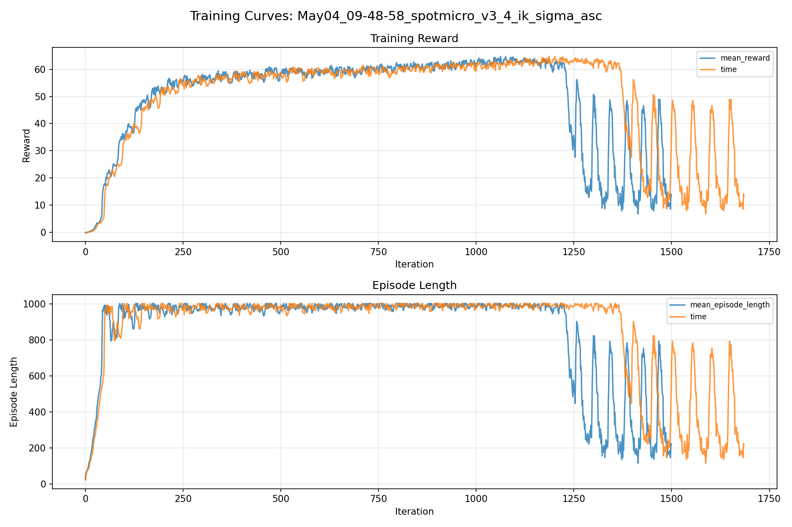
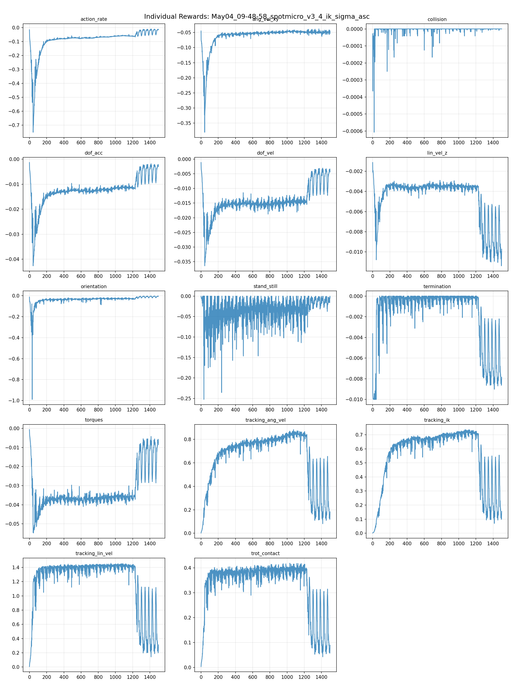
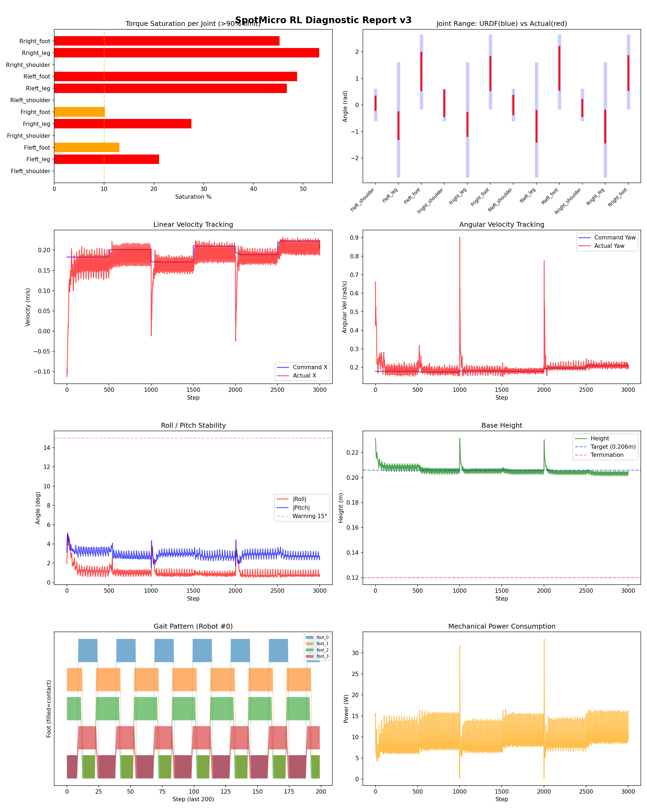
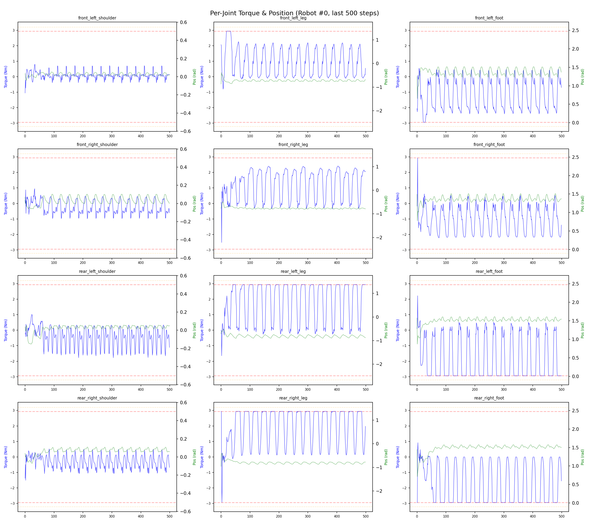
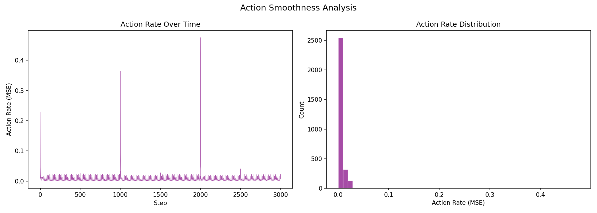

# 실험 033: spotmicro_v3_4_ik_sigma_asc

- **날짜:** 2026-05-04 10:18
- **Task:** spotmicro_test
- **Run name:** `spotmicro_v3_4_ik_sigma_asc`
- **판정:** ✅ PASS

---

## 실험 목적

V3.4: tracking_ik 의 sigma를 감소한 pd gain 값에 맞게 조정.

---

## 변경점 (이전 커밋 대비)

```diff
diff --git a/ai_training/rl/legged_gym/legged_gym/envs/spotmicro_test/spotmicro_test.py b/ai_training/rl/legged_gym/legged_gym/envs/spotmicro_test/spotmicro_test.py
index 7afb952..c83b05e 100644
--- a/ai_training/rl/legged_gym/legged_gym/envs/spotmicro_test/spotmicro_test.py
+++ b/ai_training/rl/legged_gym/legged_gym/envs/spotmicro_test/spotmicro_test.py
@@ -329,7 +329,7 @@ class SpotmicroTest(LeggedRobot):
         # action에 가중치를 곱해서 에러 계산
         weighted_actions = self.actions * weights
         error = torch.sum(torch.square(weighted_actions), dim=1)
-        sigma = 2.0
+        sigma = 3.0
         return torch.exp(-error / sigma)
         
     def _reward_tracking_ang_vel(self):
diff --git a/ai_training/rl/legged_gym/legged_gym/envs/spotmicro_test/spotmicro_test_config.py b/ai_training/rl/legged_gym/legged_gym/envs/spotmicro_test/spotmicro_test_config.py
index a8c6bfc..1d76f2b 100644
--- a/ai_training/rl/legged_gym/legged_gym/envs/spotmicro_test/spotmicro_test_config.py
+++ b/ai_training/rl/legged_gym/legged_gym/envs/spotmicro_test/spotmicro_test_config.py
@@ -55,7 +55,7 @@ class SpotmicroTestCfg(LeggedRobotCfg):
             lin_vel_z = -2.0
             ang_vel_xy = -0.4
             orientation = -6.0
-            torques = -0.0015
+            torques = -0.001
             dof_vel = -0.001
             dof_acc = -2.5e-7
             action_rate = -0.05
@@ -123,7 +123,7 @@ class SpotmicroTestCfgPPO(LeggedRobotCfgPPO):
         entropy_coef = 0.01
 
     class runner(LeggedRobotCfgPPO.runner):
-        run_name = 'spotmicro_v3_3_2_torque_improve'
+        run_name = 'spotmicro_v3_4_ik_sigma_asc'
         experiment_name = 'spotmicro_test'
         max_iterations = 1500
         save_interval = 100
```

**변경 요약:**
  - sigma = 2.0
  + sigma = 3.0
  - torques = -0.0015
  + torques = -0.001
  - run_name = 'spotmicro_v3_3_2_torque_improve'
  + run_name = 'spotmicro_v3_4_ik_sigma_asc'

---

## 현재 Reward Scales

| Reward | Scale |
|--------|-------|
| action_rate | -0.05 |
| ang_vel_xy | -0.4 |
| collision | -1.0 |
| dof_acc | -2.5e-07 |
| dof_vel | -0.001 |
| lin_vel_z | -2.0 |
| orientation | -6.0 |
| stand_still | -0.5 |
| termination | -10.0 |
| torques | -0.001 |
| tracking_ang_vel | 1.3 |
| tracking_ik | 1.0 |
| tracking_lin_vel | 1.5 |
| trot_contact | 0.5 |

---

## 진단 결과 (Diagnostic)

### 핵심 지표

- ✅ Timeout: 99.2% (≥80%)
- ✅ 속도오차 X: 0.0415 m/s (<0.08)
- ⚠️ 토크포화: 22.2% (10~40%)
- ✅ 자세: roll 1.0°, pitch 2.9° (안정)
- ✅ 조기종료: 0.0% (<5%)

### 상세 수치

| 지표 | 값 |
|------|-----|
| Timeout% | 99.2248062015504 |
| 조기종료% | 0.0 |
| 속도오차 X | 0.04149514064192772 m/s |
| 속도오차 Y | 0.023415401577949524 m/s |
| 각속도오차 | 0.07597436755895615 rad/s |
| 토크포화% | 22.160088175713174 |
| 평균 높이 | 0.20573696586893592 m |
| Roll (평균) | 1.009453535079956° |
| Pitch (평균) | 2.9411325454711914° |
| Action Rate | 0.00677996501326561 |
| 평균 전력 | 9.017000198364258 W |
| CoT | 1.9900395773093378 |

## Command Mode별 회전 추종 분석

| 모드 | 비율 | 샘플 수 | 평균 abs(cmd_wz) | 평균 abs(actual_wz) | yaw 오차 | 상태 |
|------|------|---------|------------------|---------------------|----------|------|
| 정지 | 1.3% | 2504 | 0.0283 | 0.0567 | 0.0607 | ❌ |
| 직진/저회전 | 38.3% | 73548 | 0.0702 | 0.1058 | 0.0770 | ✅ |
| 제자리 회전 | 7.6% | 14511 | 0.2900 | 0.2588 | 0.0651 | ✅ |
| 전진+회전 | 49.5% | 95115 | 0.2707 | 0.2661 | 0.0767 | ✅ |
| 큰 회전명령 | 22.7% | 43550 | 0.3490 | 0.3358 | 0.0768 | ✅ |

> 해석 기준: `제자리 회전`만 나쁘면 pure turn 학습/보행 패턴 문제, `큰 회전명령`만 나쁘면 yaw 명령 범위가 현재 토크/보폭 한계보다 큰 문제, `정지`가 나쁘면 stop drift 문제로 보면 됩니다.
        


## 학습 곡선 분석

| 지표 | 값 | 판정 |
|------|-----|------|
| 수렴 iter (90%) | 336 | 빠름 |
| 후반 안정성 (CV) | 0.395 | 불안정 |
| 정체 구간 | 없음 | |


## Per-leg 분석

### 발별 접촉/공중 비율

| 발 | 접촉% | 공중% |
|-----|-------|------|
| foot_0 | 61.3% | 38.7% |
| foot_1 | 68.8% | 31.2% |
| foot_2 | 67.3% | 32.7% |
| foot_3 | 59.5% | 40.5% |

### 관절별 토크 포화

| 관절 | 포화% | 최대토크 | 한계 | 상태 |
|------|------|---------|------|------|
| front_left_shoulder | 0.0% | 2.940 | 2.940 | ✅ |
| front_left_leg | 21.0% | 2.940 | 2.940 | ❌ |
| front_left_foot | 13.1% | 2.940 | 2.940 | ⚠️ |
| front_right_shoulder | 0.0% | 2.940 | 2.940 | ✅ |
| front_right_leg | 27.6% | 2.940 | 2.940 | ❌ |
| front_right_foot | 10.2% | 2.940 | 2.940 | ⚠️ |
| rear_left_shoulder | 0.0% | 2.940 | 2.940 | ✅ |
| rear_left_leg | 46.7% | 2.940 | 2.940 | ❌ |
| rear_left_foot | 48.8% | 2.940 | 2.940 | ❌ |
| rear_right_shoulder | 0.0% | 2.940 | 2.940 | ✅ |
| rear_right_leg | 53.2% | 2.940 | 2.940 | ❌ |
| rear_right_foot | 45.3% | 2.940 | 2.940 | ❌ |


## Gait 분석

| 지표 | 값 |
|------|-----|
| Gait 주파수 | 1.67 Hz |
| Gait 주기 | 30 steps |
| 대각 동기화율 | 88.7% |
| L/R 비대칭 | 0.0%p |
| 판정 | ✅ Trot 패턴 / ✅ 대칭 |


## 관절별 상세

| 관절 | 토크포화% | 사용범위% | 편향(rad) | 한계근접% | 상태 |
|------|----------|----------|----------|----------|------|
| front_left_shoulder | 0.0% | 46% | +0.062 | 0.0% | ✅ |
| front_left_leg | 21.0% | 24% | -0.776 | 0.0% | ⚠️ |
| front_left_foot | 13.1% | 53% | +1.266 | 0.0% | ⚠️ |
| front_right_shoulder | 0.0% | 88% | +0.064 | 0.0% | ✅ |
| front_right_leg | 27.6% | 21% | -0.730 | 0.0% | ⚠️ |
| front_right_foot | 10.2% | 47% | +1.188 | 0.0% | ⚠️ |
| rear_left_shoulder | 0.0% | 64% | +0.003 | 0.0% | ✅ |
| rear_left_leg | 46.7% | 28% | -0.806 | 0.0% | ⚠️ |
| rear_left_foot | 48.8% | 60% | +1.380 | 0.0% | ⚠️ |
| rear_right_shoulder | 0.0% | 57% | -0.111 | 0.0% | ⚠️ |
| rear_right_leg | 53.2% | 29% | -0.814 | 0.0% | ⚠️ |
| rear_right_foot | 45.3% | 47% | +1.199 | 0.0% | ⚠️ |


## 에너지 효율 상세

| 지표 | 값 |
|------|-----|
| 평균 전력 | 9.02 W |
| 피크 전력 | 33.30 W |
| 피크/평균 비율 | 3.7x |
| CoT | 1.99 |

### 관절별 전력 분배

| 관절 | 평균전력(W) | 비율% |
|------|-----------|-------|
| rear_right_foot | 1.494 | 16.6% |
| front_left_foot | 1.391 | 15.4% |
| rear_left_foot | 1.312 | 14.6% |
| rear_right_leg | 1.169 | 13.0% |
| front_right_foot | 1.001 | 11.1% |
| front_right_leg | 0.873 | 9.7% |
| rear_left_leg | 0.832 | 9.2% |
| front_left_leg | 0.736 | 8.2% |
| rear_left_shoulder | 0.064 | 0.7% |
| front_right_shoulder | 0.061 | 0.7% |
| rear_right_shoulder | 0.057 | 0.6% |
| front_left_shoulder | 0.028 | 0.3% |


## 이전 실험 대비 비교

| 지표 | 이전 (exp032) | 현재 (exp033) | 변화 |
|------|-------|-------|------|
| Timeout% | 6.0% | 99.2% | ✅ ↑ 93.2671% |
| 속도오차 X | 0.0955 | 0.0415 | ✅ ↓ 0.0540m/s |
| 토크포화 | 26.4% | 22.2% | ✅ ↓ 4.2104% |
| Roll | 2.4° | 1.0° | ✅ ↓ 1.4320° |
| Pitch | 2.0° | 2.9° | ⚠️ ↑ 0.9469° |
| 평균 전력 | 17.2776W | 9.0170W | ✅ ↓ 8.2606W |


## Tensorboard 학습 곡선 요약

| 스칼라 | 최종값 | 최대 | 최소 | 후반10% 평균 |
|--------|--------|------|------|-------------|
| rew_action_rate | -0.0150 | -0.0085 | -0.7516 | -0.0248 |
| rew_ang_vel_xy | -0.0486 | -0.0382 | -0.3804 | -0.0494 |
| rew_collision | 0.0000 | 0.0000 | -0.0006 | -0.0000 |
| rew_dof_acc | -0.0030 | -0.0013 | -0.0427 | -0.0045 |
| rew_dof_vel | -0.0044 | -0.0011 | -0.0364 | -0.0062 |
| rew_lin_vel_z | -0.0097 | -0.0011 | -0.0114 | -0.0088 |
| rew_orientation | -0.0054 | -0.0030 | -0.9894 | -0.0091 |
| rew_stand_still | -0.0051 | 0.0000 | -0.2523 | -0.0119 |
| rew_termination | -0.0078 | 0.0000 | -0.0100 | -0.0065 |
| rew_torques | -0.0086 | -0.0007 | -0.0548 | -0.0131 |
| rew_tracking_ang_vel | 0.1835 | 0.8831 | 0.0023 | 0.2879 |
| rew_tracking_ik | 0.1553 | 0.7362 | 0.0015 | 0.2449 |
| rew_tracking_lin_vel | 0.3125 | 1.4595 | 0.0060 | 0.4995 |
| rew_trot_contact | 0.0898 | 0.4189 | 0.0036 | 0.1397 |
| learning_rate | 0.0000 | 0.0100 | 0.0000 | 0.0000 |
| surrogate | 0.0036 | 0.3228 | -0.0086 | 0.0086 |
| value_function | 0.0085 | 5.6486 | 0.0027 | 0.0102 |
| collection time | 0.8055 | 1.0710 | 0.7514 | 0.8700 |
| learning_time | 0.2865 | 0.3944 | 0.2698 | 0.2914 |
| total_fps | 90020.0000 | 94762.0000 | 70715.0000 | 84711.6267 |
| mean_noise_std | 0.2065 | 1.0012 | 0.1879 | 0.2146 |
| mean_episode_length | 214.7400 | 1002.0000 | 22.2400 | 351.8936 |
| time | 214.7400 | 1002.0000 | 22.2400 | 351.8936 |
| mean_reward | 13.2411 | 64.7072 | -0.1653 | 21.6509 |
| time | 13.2411 | 64.7072 | -0.1653 | 21.6509 |

총 학습 iteration: 1499


---

## 그래프

### Tensorboard 학습 곡선



### Diagnostic 결과





---

## 결론 및 다음 실험 방향

**자동 판정:** ✅ PASS

대부분 기준을 통과했으나 일부 항목이 보통 수준입니다.
  - ⚠️ 토크포화: 22.2% (10~40%)

> 💡 위 결론은 자동 생성되었습니다. 필요시 수정하세요.

---

## 메모

_(추가 메모가 있으면 여기에 작성)_

