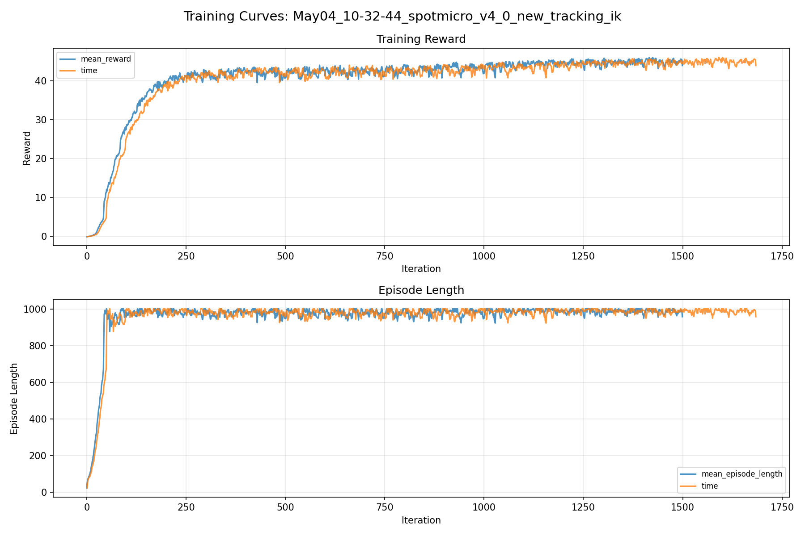
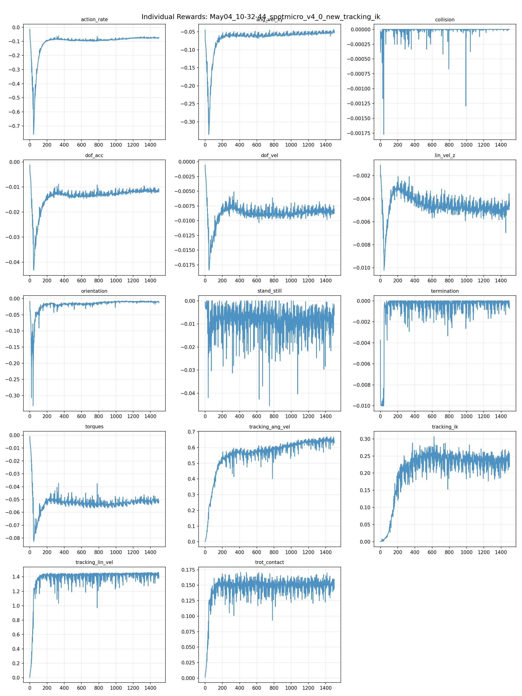
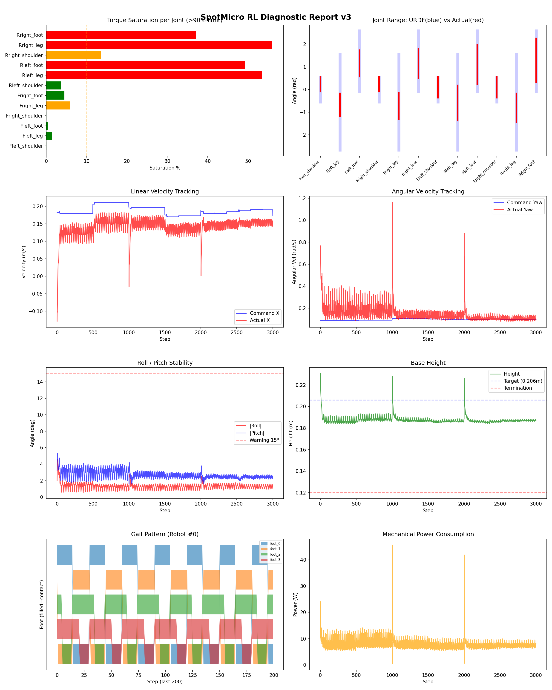
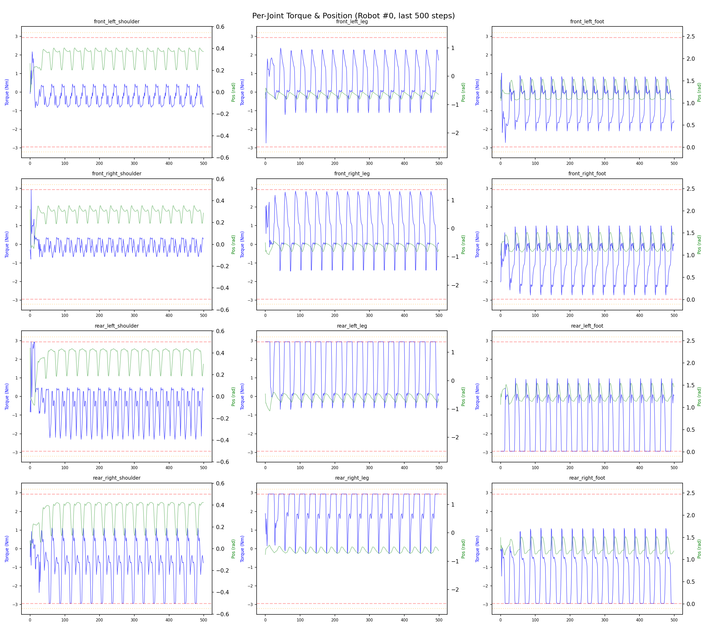
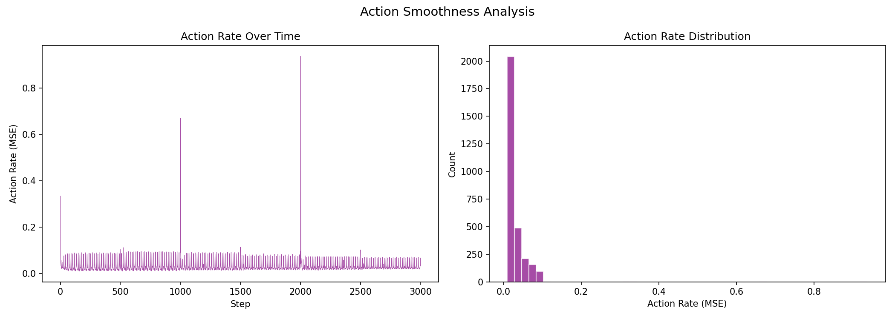

# 실험 034: spotmicro_v4_0_new_tracking_ik

- **날짜:** 2026-05-04 11:02
- **Task:** spotmicro_test
- **Run name:** `spotmicro_v4_0_new_tracking_ik`
- **판정:** ✅ PASS

---

## 실험 목적

V4.0: tracking_ik 의 방식을 action에 따른 reward에서 직접 관절각도를 비교하는 방식으로 변경.

---

## 변경점 (이전 커밋 대비)

```diff
diff --git a/ai_training/rl/legged_gym/legged_gym/envs/spotmicro_test/spotmicro_test.py b/ai_training/rl/legged_gym/legged_gym/envs/spotmicro_test/spotmicro_test.py
index b1df0ea..c99e8c9 100644
--- a/ai_training/rl/legged_gym/legged_gym/envs/spotmicro_test/spotmicro_test.py
+++ b/ai_training/rl/legged_gym/legged_gym/envs/spotmicro_test/spotmicro_test.py
@@ -272,7 +272,15 @@ class SpotmicroTest(LeggedRobot):
         
     def _reward_stand_still(self):
         cmd_norm = torch.norm(self.commands[:, :3], dim=1)
-        return torch.sum(torch.abs(self.dof_pos - self.default_dof_pos), dim=1) * (cmd_norm < 0.1)
+        is_stand = (cmd_norm < 0.08).float()
+
+        lin_penalty = torch.sum(torch.square(self.base_lin_vel[:, :2]), dim=1)
+        yaw_penalty = torch.square(self.base_ang_vel[:, 2])
+        pose_penalty = 0.2 * torch.sum(
+            torch.square(self.dof_pos - self.default_dof_pos), dim=1
+        )
+
+        return (lin_penalty + 0.5 * yaw_penalty + pose_penalty) * is_stand
 
     def _get_ik_target(self):
         vx = self.commands[:, 0]
@@ -322,6 +330,21 @@ class SpotmicroTest(LeggedRobot):
         return torch.clip(torques, -self.torque_limits, self.torque_limits)
 
     def _reward_tracking_ik(self):
+        ref_dof_pos = self._get_ik_target()
+
+        # shoulder는 yaw/균형 보정 자유도를 남김
+        weights = torch.tensor([0.3, 1.0, 1.0] * 4, device=self.device)
+
+        joint_error = (self.dof_pos - ref_dof_pos) * weights
+        error = torch.sum(torch.square(joint_error), dim=1)
+
+        cmd_norm = torch.norm(self.commands[:, :3], dim=1)
+        is_moving = (cmd_norm > 0.08).float()
+
+        sigma = 0.15
+        return torch.exp(-error / sigma) * is_moving
+    
+    def _reward_residual_action(self):
         # 관절별 페널티 가중치: [Shoulder, Leg, Foot] 순서
         # 어깨(0.1)는 자유롭게 움직이도록 허용하고, Leg와 Foot(1.0)은 IK를 잘 따르도록 강제함
         weights = torch.tensor([1.0, 1.0, 1.0] * 4, device=self.device)
diff --git a/ai_training/rl/legged_gym/legged_gym/envs/spotmicro_test/spotmicro_test_config.py b/ai_training/rl/legged_gym/legged_gym/envs/spotmicro_test/spotmicro_test_config.py
index 1d76f2b..1a29e88 100644
--- a/ai_training/rl/legged_gym/legged_gym/envs/spotmicro_test/spotmicro_test_config.py
+++ b/ai_training/rl/legged_gym/legged_gym/envs/spotmicro_test/spotmicro_test_config.py
@@ -50,25 +50,22 @@ class SpotmicroTestCfg(LeggedRobotCfg):
     class rewards(LeggedRobotCfg.rewards):
         class scales:
             tracking_lin_vel = 1.5
-            tracking_ang_vel = 1.3 
+            tracking_ang_vel = 1.0 
             termination = -10.0
             lin_vel_z = -2.0
             ang_vel_xy = -0.4
-            orientation = -6.0
-            torques = -0.001
-            dof_vel = -0.001
+            orientation = -4.0
+            torques = -0.0015
+            dof_vel = -0.0005
             dof_acc = -2.5e-7
             action_rate = -0.05
             feet_air_time = 0.0
             dof_pos_limits = 0.0
             col
```

**변경 요약:**
  - return torch.sum(torch.abs(self.dof_pos - self.default_dof_pos), dim=1) * (cmd_norm < 0.1)
  + is_stand = (cmd_norm < 0.08).float()
  + lin_penalty = torch.sum(torch.square(self.base_lin_vel[:, :2]), dim=1)
  + yaw_penalty = torch.square(self.base_ang_vel[:, 2])
  + pose_penalty = 0.2 * torch.sum(
  + torch.square(self.dof_pos - self.default_dof_pos), dim=1
  + )
  + return (lin_penalty + 0.5 * yaw_penalty + pose_penalty) * is_stand
  + ref_dof_pos = self._get_ik_target()
  + weights = torch.tensor([0.3, 1.0, 1.0] * 4, device=self.device)
  + joint_error = (self.dof_pos - ref_dof_pos) * weights
  + error = torch.sum(torch.square(joint_error), dim=1)
  + cmd_norm = torch.norm(self.commands[:, :3], dim=1)
  + is_moving = (cmd_norm > 0.08).float()
  + sigma = 0.15
  + return torch.exp(-error / sigma) * is_moving
  + def _reward_residual_action(self):
  - tracking_ang_vel = 1.3
  + tracking_ang_vel = 1.0
  - orientation = -6.0
  - torques = -0.001
  - dof_vel = -0.001
  + orientation = -4.0
  + torques = -0.0015
  + dof_vel = -0.0005
  - trot_symmetry = 0.0
  - no_stuck_feet = 0.0
  - symmetric_gait = 0.0
  - feet_clearance = 0.0
  - trot_contact = 0.5
  - tracking_ik = 1.0
  + trot_contact = 0.2
  + tracking_ik = 0.5
  + residual_action = 0.0
  - ang_vel_yaw = [-0.4, 0.4]
  + ang_vel_yaw = [-0.2, 0.2]
  - run_name = 'spotmicro_v3_4_ik_sigma_asc'
  + run_name = 'spotmicro_v4_0_new_tracking_ik'

---

## 현재 Reward Scales

| Reward | Scale |
|--------|-------|
| action_rate | -0.05 |
| ang_vel_xy | -0.4 |
| collision | -1.0 |
| dof_acc | -2.5e-07 |
| dof_vel | -0.0005 |
| lin_vel_z | -2.0 |
| orientation | -4.0 |
| stand_still | -0.5 |
| termination | -10.0 |
| torques | -0.0015 |
| tracking_ang_vel | 1.0 |
| tracking_ik | 0.5 |
| tracking_lin_vel | 1.5 |
| trot_contact | 0.2 |

---

## 진단 결과 (Diagnostic)

### 핵심 지표

- ✅ Timeout: 94.8% (≥80%)
- ✅ 속도오차 X: 0.0534 m/s (<0.08)
- ⚠️ 토크포화: 18.8% (10~40%)
- ✅ 자세: roll 1.3°, pitch 2.7° (안정)
- ✅ 조기종료: 2.2% (<5%)

### 상세 수치

| 지표 | 값 |
|------|-----|
| Timeout% | 94.81481481481482 |
| 조기종료% | 2.2222222222222223 |
| 속도오차 X | 0.053437042981386185 m/s |
| 속도오차 Y | 0.020585058256983757 m/s |
| 각속도오차 | 0.10655348747968674 rad/s |
| 토크포화% | 18.785164488289492 |
| 평균 높이 | 0.1876316655488003 m |
| Roll (평균) | 1.324427843093872° |
| Pitch (평균) | 2.6835718154907227° |
| Action Rate | 0.030830876901745796 |
| 평균 전력 | 7.879738807678223 W |
| CoT | 2.171266618067217 |

## Command Mode별 회전 추종 분석

| 모드 | 비율 | 샘플 수 | 평균 abs(cmd_wz) | 평균 abs(actual_wz) | yaw 오차 | 상태 |
|------|------|---------|------------------|---------------------|----------|------|
| 정지 | 2.4% | 4584 | 0.0215 | 0.0585 | 0.0609 | ❌ |
| 직진/저회전 | 67.6% | 130011 | 0.0739 | 0.1361 | 0.1098 | ⚠️ |
| 제자리 회전 | 1.3% | 2504 | 0.1701 | 0.1224 | 0.1043 | ⚠️ |
| 전진+회전 | 20.7% | 39859 | 0.1771 | 0.2003 | 0.1059 | ⚠️ |
| 큰 회전명령 | 0.0% | 0 | N/A | N/A | N/A | N/A |

> 해석 기준: `제자리 회전`만 나쁘면 pure turn 학습/보행 패턴 문제, `큰 회전명령`만 나쁘면 yaw 명령 범위가 현재 토크/보폭 한계보다 큰 문제, `정지`가 나쁘면 stop drift 문제로 보면 됩니다.
        


## 학습 곡선 분석

| 지표 | 값 | 판정 |
|------|-----|------|
| 수렴 iter (90%) | 234 | 빠름 |
| 후반 안정성 (CV) | 0.024 | 안정 |
| 정체 구간 | 없음 | |


## Per-leg 분석

### 발별 접촉/공중 비율

| 발 | 접촉% | 공중% |
|-----|-------|------|
| foot_0 | 54.2% | 45.8% |
| foot_1 | 57.7% | 42.3% |
| foot_2 | 71.1% | 28.9% |
| foot_3 | 76.8% | 23.2% |

### 관절별 토크 포화

| 관절 | 포화% | 최대토크 | 한계 | 상태 |
|------|------|---------|------|------|
| front_left_shoulder | 0.0% | 2.940 | 2.940 | ✅ |
| front_left_leg | 1.5% | 2.940 | 2.940 | ✅ |
| front_left_foot | 0.4% | 2.940 | 2.940 | ✅ |
| front_right_shoulder | 0.1% | 2.940 | 2.940 | ✅ |
| front_right_leg | 5.9% | 2.940 | 2.940 | ⚠️ |
| front_right_foot | 4.5% | 2.940 | 2.940 | ✅ |
| rear_left_shoulder | 3.6% | 2.940 | 2.940 | ✅ |
| rear_left_leg | 53.5% | 2.940 | 2.940 | ❌ |
| rear_left_foot | 49.2% | 2.940 | 2.940 | ❌ |
| rear_right_shoulder | 13.5% | 2.940 | 2.940 | ⚠️ |
| rear_right_leg | 56.0% | 2.940 | 2.940 | ❌ |
| rear_right_foot | 37.1% | 2.940 | 2.940 | ❌ |


## Gait 분석

| 지표 | 값 |
|------|-----|
| Gait 주파수 | 1.67 Hz |
| Gait 주기 | 30 steps |
| 대각 동기화율 | 80.5% |
| L/R 비대칭 | 0.0%p |
| 판정 | ✅ Trot 패턴 / ✅ 대칭 |


## 관절별 상세

| 관절 | 토크포화% | 사용범위% | 편향(rad) | 한계근접% | 상태 |
|------|----------|----------|----------|----------|------|
| front_left_shoulder | 0.0% | 58% | +0.231 | 2.2% | ⚠️ |
| front_left_leg | 1.5% | 24% | -0.675 | 0.0% | ⚠️ |
| front_left_foot | 0.4% | 43% | +1.156 | 0.0% | ⚠️ |
| front_right_shoulder | 0.1% | 59% | +0.231 | 4.8% | ⚠️ |
| front_right_leg | 5.9% | 28% | -0.726 | 0.0% | ⚠️ |
| front_right_foot | 4.5% | 49% | +1.148 | 0.0% | ⚠️ |
| rear_left_shoulder | 3.6% | 83% | +0.098 | 25.4% | ⚠️ |
| rear_left_leg | 53.5% | 37% | -0.591 | 0.0% | ⚠️ |
| rear_left_foot | 49.2% | 65% | +1.117 | 0.0% | ⚠️ |
| rear_right_shoulder | 13.5% | 84% | +0.096 | 3.9% | ✅ |
| rear_right_leg | 56.0% | 30% | -0.808 | 0.0% | ⚠️ |
| rear_right_foot | 37.1% | 72% | +1.293 | 0.0% | ⚠️ |


## 에너지 효율 상세

| 지표 | 값 |
|------|-----|
| 평균 전력 | 7.88 W |
| 피크 전력 | 45.68 W |
| 피크/평균 비율 | 5.8x |
| CoT | 2.17 |

### 관절별 전력 분배

| 관절 | 평균전력(W) | 비율% |
|------|-----------|-------|
| rear_right_leg | 1.300 | 16.5% |
| rear_left_leg | 1.099 | 13.9% |
| rear_left_foot | 0.878 | 11.1% |
| rear_right_shoulder | 0.792 | 10.1% |
| front_right_foot | 0.697 | 8.8% |
| rear_right_foot | 0.694 | 8.8% |
| front_right_leg | 0.665 | 8.4% |
| front_left_foot | 0.467 | 5.9% |
| rear_left_shoulder | 0.458 | 5.8% |
| front_left_leg | 0.457 | 5.8% |
| front_left_shoulder | 0.192 | 2.4% |
| front_right_shoulder | 0.181 | 2.3% |


## 이전 실험 대비 비교

| 지표 | 이전 (exp033) | 현재 (exp034) | 변화 |
|------|-------|-------|------|
| Timeout% | 99.2% | 94.8% | ⚠️ ↓ 4.4100% |
| 속도오차 X | 0.0415 | 0.0534 | ⚠️ ↑ 0.0119m/s |
| 토크포화 | 22.2% | 18.8% | ✅ ↓ 3.3749% |
| Roll | 1.0° | 1.3° | ⚠️ ↑ 0.3150° |
| Pitch | 2.9° | 2.7° | ✅ ↓ 0.2576° |
| 평균 전력 | 9.0170W | 7.8797W | ✅ ↓ 1.1373W |


## Tensorboard 학습 곡선 요약

| 스칼라 | 최종값 | 최대 | 최소 | 후반10% 평균 |
|--------|--------|------|------|-------------|
| rew_action_rate | -0.0724 | -0.0147 | -0.7601 | -0.0750 |
| rew_ang_vel_xy | -0.0505 | -0.0432 | -0.3352 | -0.0515 |
| rew_collision | 0.0000 | 0.0000 | -0.0018 | -0.0000 |
| rew_dof_acc | -0.0109 | -0.0013 | -0.0431 | -0.0115 |
| rew_dof_vel | -0.0081 | -0.0006 | -0.0184 | -0.0084 |
| rew_lin_vel_z | -0.0046 | -0.0011 | -0.0102 | -0.0049 |
| rew_orientation | -0.0129 | -0.0066 | -0.3322 | -0.0094 |
| rew_stand_still | -0.0062 | 0.0000 | -0.0455 | -0.0081 |
| rew_termination | -0.0007 | 0.0000 | -0.0100 | -0.0002 |
| rew_torques | -0.0511 | -0.0010 | -0.0827 | -0.0514 |
| rew_tracking_ang_vel | 0.6298 | 0.6698 | 0.0018 | 0.6458 |
| rew_tracking_ik | 0.2183 | 0.3067 | 0.0007 | 0.2348 |
| rew_tracking_lin_vel | 1.3784 | 1.4637 | 0.0060 | 1.4344 |
| rew_trot_contact | 0.1447 | 0.1709 | 0.0014 | 0.1511 |
| learning_rate | 0.0002 | 0.0100 | 0.0000 | 0.0003 |
| surrogate | -0.0025 | 0.0050 | -0.0092 | -0.0021 |
| value_function | 0.0097 | 0.0523 | 0.0012 | 0.0061 |
| collection time | 0.8231 | 0.9309 | 0.7856 | 0.8304 |
| learning_time | 0.2868 | 0.3419 | 0.2696 | 0.2885 |
| total_fps | 88568.0000 | 91822.0000 | 77312.0000 | 87876.3133 |
| mean_noise_std | 0.2152 | 1.0033 | 0.2034 | 0.2114 |
| mean_episode_length | 958.0500 | 1002.0000 | 22.0900 | 987.8271 |
| time | 958.0500 | 1002.0000 | 22.0900 | 987.8271 |
| mean_reward | 43.9820 | 46.0808 | -0.1671 | 44.9945 |
| time | 43.9820 | 46.0808 | -0.1671 | 44.9945 |

총 학습 iteration: 1499


---

## 그래프

### Tensorboard 학습 곡선



### Diagnostic 결과





---

## 결론 및 다음 실험 방향

**자동 판정:** ✅ PASS

대부분 기준을 통과했으나 일부 항목이 보통 수준입니다.
  - ⚠️ 토크포화: 18.8% (10~40%)

> 💡 위 결론은 자동 생성되었습니다. 필요시 수정하세요.

---

## 메모

_(추가 메모가 있으면 여기에 작성)_

