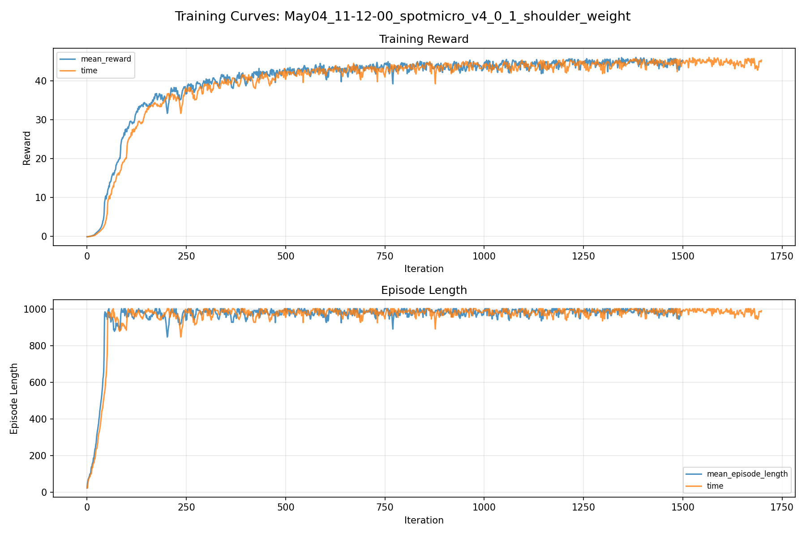
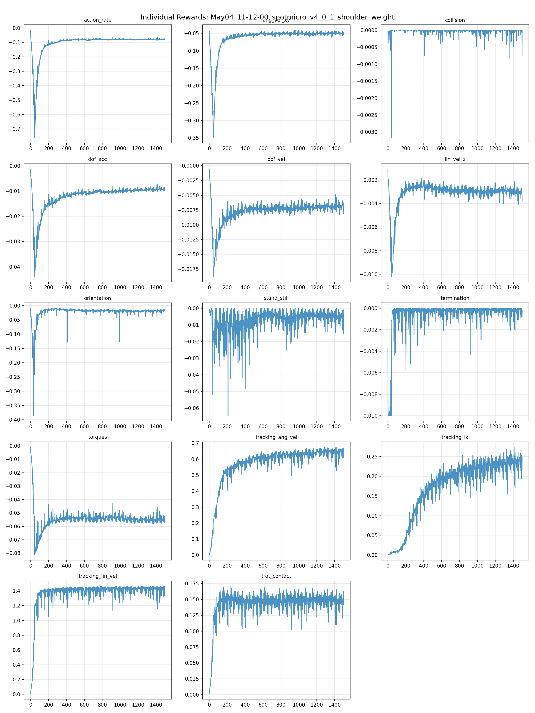
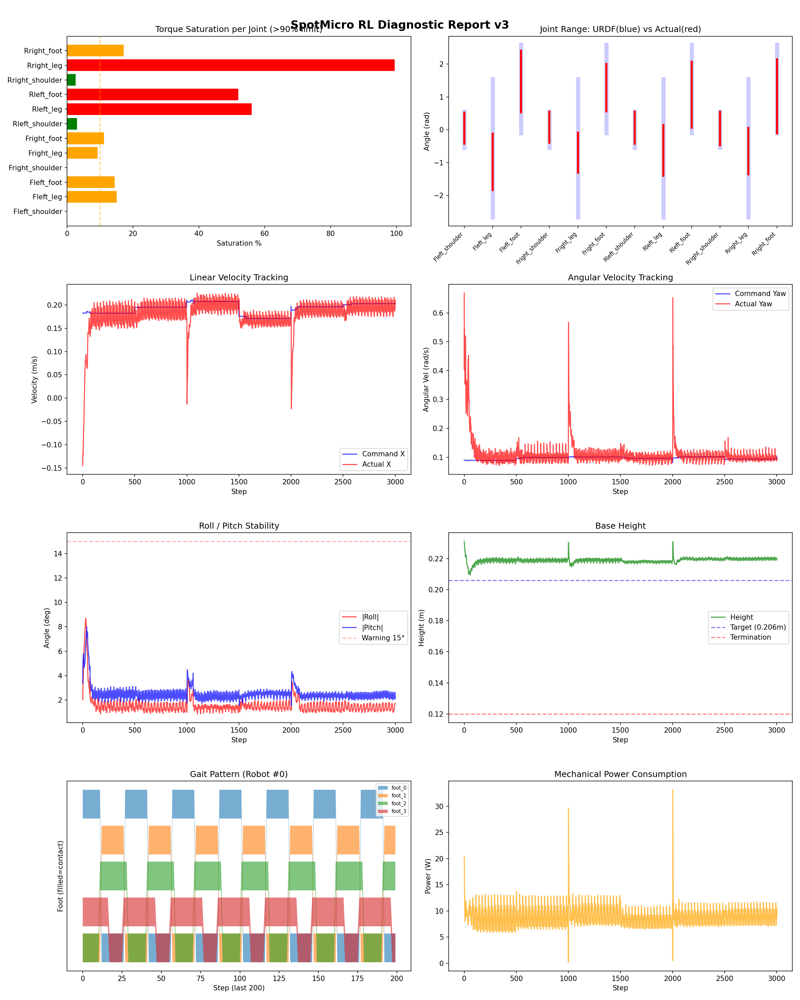
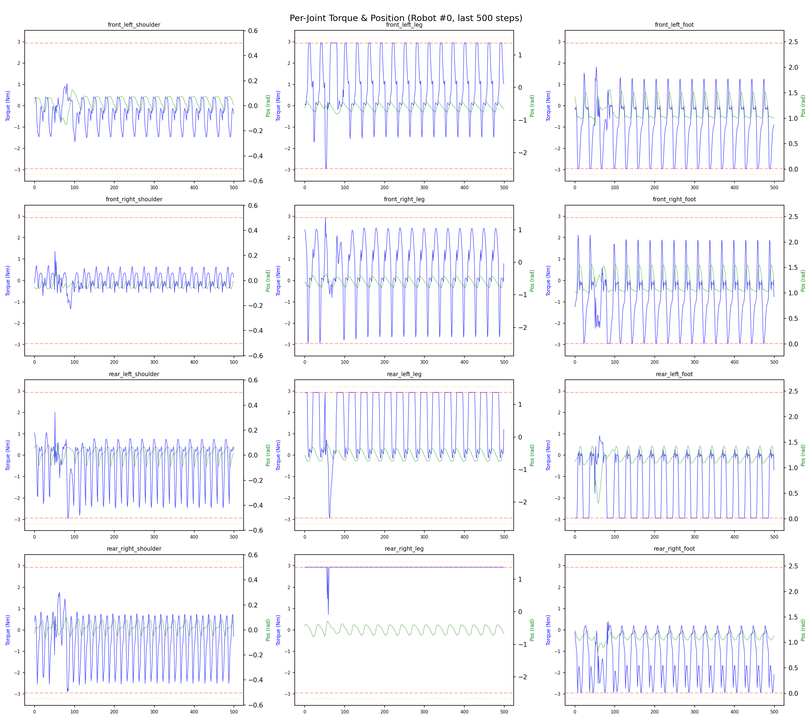
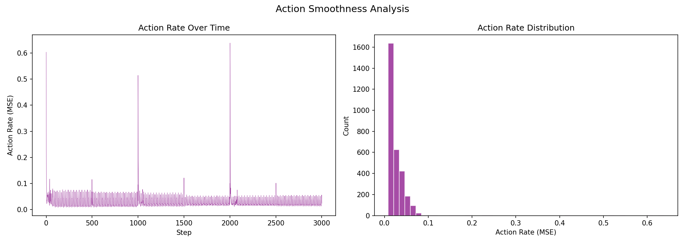

# 실험 035: spotmicro_v4_0_1_shoulder_weight

- **날짜:** 2026-05-04 11:42
- **Task:** spotmicro_test
- **Run name:** `spotmicro_v4_0_1_shoulder_weight`
- **판정:** ✅ PASS

---

## 실험 목적

V4.0.11: shoulder 관절 weight를 0.9로 변경. 좀 더 IK에 맞게.

---

## 변경점 (이전 커밋 대비)

```diff
diff --git a/ai_training/rl/legged_gym/legged_gym/envs/spotmicro_test/spotmicro_test.py b/ai_training/rl/legged_gym/legged_gym/envs/spotmicro_test/spotmicro_test.py
index c99e8c9..d1d25d5 100644
--- a/ai_training/rl/legged_gym/legged_gym/envs/spotmicro_test/spotmicro_test.py
+++ b/ai_training/rl/legged_gym/legged_gym/envs/spotmicro_test/spotmicro_test.py
@@ -333,7 +333,7 @@ class SpotmicroTest(LeggedRobot):
         ref_dof_pos = self._get_ik_target()
 
         # shoulder는 yaw/균형 보정 자유도를 남김
-        weights = torch.tensor([0.3, 1.0, 1.0] * 4, device=self.device)
+        weights = torch.tensor([0.9, 1.0, 1.0] * 4, device=self.device)
 
         joint_error = (self.dof_pos - ref_dof_pos) * weights
         error = torch.sum(torch.square(joint_error), dim=1)
diff --git a/ai_training/rl/legged_gym/legged_gym/envs/spotmicro_test/spotmicro_test_config.py b/ai_training/rl/legged_gym/legged_gym/envs/spotmicro_test/spotmicro_test_config.py
index 1a29e88..59231c2 100644
--- a/ai_training/rl/legged_gym/legged_gym/envs/spotmicro_test/spotmicro_test_config.py
+++ b/ai_training/rl/legged_gym/legged_gym/envs/spotmicro_test/spotmicro_test_config.py
@@ -120,7 +120,7 @@ class SpotmicroTestCfgPPO(LeggedRobotCfgPPO):
         entropy_coef = 0.01
 
     class runner(LeggedRobotCfgPPO.runner):
-        run_name = 'spotmicro_v4_0_new_tracking_ik'
+        run_name = 'spotmicro_v4_0_1_shoulder_weight'
         experiment_name = 'spotmicro_test'
         max_iterations = 1500
         save_interval = 100
```

**변경 요약:**
  - weights = torch.tensor([0.3, 1.0, 1.0] * 4, device=self.device)
  + weights = torch.tensor([0.9, 1.0, 1.0] * 4, device=self.device)
  - run_name = 'spotmicro_v4_0_new_tracking_ik'
  + run_name = 'spotmicro_v4_0_1_shoulder_weight'

---

## 현재 Reward Scales

| Reward | Scale |
|--------|-------|
| action_rate | -0.05 |
| ang_vel_xy | -0.4 |
| collision | -1.0 |
| dof_acc | -2.5e-07 |
| dof_vel | -0.0005 |
| lin_vel_z | -2.0 |
| orientation | -4.0 |
| stand_still | -0.5 |
| termination | -10.0 |
| torques | -0.0015 |
| tracking_ang_vel | 1.0 |
| tracking_ik | 0.5 |
| tracking_lin_vel | 1.5 |
| trot_contact | 0.2 |

---

## 진단 결과 (Diagnostic)

### 핵심 지표

- ✅ Timeout: 96.2% (≥80%)
- ✅ 속도오차 X: 0.0334 m/s (<0.08)
- ⚠️ 토크포화: 23.3% (10~40%)
- ✅ 자세: roll 1.6°, pitch 2.5° (안정)
- ✅ 조기종료: 1.5% (<5%)

### 상세 수치

| 지표 | 값 |
|------|-----|
| Timeout% | 96.2406015037594 |
| 조기종료% | 1.5037593984962405 |
| 속도오차 X | 0.03337269276380539 m/s |
| 속도오차 Y | 0.021004337817430496 m/s |
| 각속도오차 | 0.06519967317581177 rad/s |
| 토크포화% | 23.34536123598624 |
| 평균 높이 | 0.21902093110662518 m |
| Roll (평균) | 1.5858687162399292° |
| Pitch (평균) | 2.4899213314056396° |
| Action Rate | 0.027108751237392426 |
| 평균 전력 | 8.836374282836914 W |
| CoT | 1.9166163484554977 |

## Command Mode별 회전 추종 분석

| 모드 | 비율 | 샘플 수 | 평균 abs(cmd_wz) | 평균 abs(actual_wz) | yaw 오차 | 상태 |
|------|------|---------|------------------|---------------------|----------|------|
| 정지 | 3.1% | 6008 | 0.0258 | 0.0714 | 0.0703 | ❌ |
| 직진/저회전 | 65.7% | 126206 | 0.0715 | 0.0898 | 0.0622 | ✅ |
| 제자리 회전 | 3.4% | 6501 | 0.1737 | 0.1682 | 0.0860 | ⚠️ |
| 전진+회전 | 20.8% | 39928 | 0.1737 | 0.1595 | 0.0634 | ✅ |
| 큰 회전명령 | 0.0% | 0 | N/A | N/A | N/A | N/A |

> 해석 기준: `제자리 회전`만 나쁘면 pure turn 학습/보행 패턴 문제, `큰 회전명령`만 나쁘면 yaw 명령 범위가 현재 토크/보폭 한계보다 큰 문제, `정지`가 나쁘면 stop drift 문제로 보면 됩니다.
        


## 학습 곡선 분석

| 지표 | 값 | 판정 |
|------|-----|------|
| 수렴 iter (90%) | 338 | 빠름 |
| 후반 안정성 (CV) | 0.020 | 안정 |
| 정체 구간 | 없음 | |


## Per-leg 분석

### 발별 접촉/공중 비율

| 발 | 접촉% | 공중% |
|-----|-------|------|
| foot_0 | 55.3% | 44.7% |
| foot_1 | 56.1% | 43.9% |
| foot_2 | 66.1% | 33.9% |
| foot_3 | 76.1% | 23.9% |

### 관절별 토크 포화

| 관절 | 포화% | 최대토크 | 한계 | 상태 |
|------|------|---------|------|------|
| front_left_shoulder | 0.0% | 2.940 | 2.940 | ✅ |
| front_left_leg | 15.0% | 2.940 | 2.940 | ⚠️ |
| front_left_foot | 14.5% | 2.940 | 2.940 | ⚠️ |
| front_right_shoulder | 0.1% | 2.940 | 2.940 | ✅ |
| front_right_leg | 9.3% | 2.940 | 2.940 | ⚠️ |
| front_right_foot | 11.2% | 2.940 | 2.940 | ⚠️ |
| rear_left_shoulder | 3.0% | 2.940 | 2.940 | ✅ |
| rear_left_leg | 56.0% | 2.940 | 2.940 | ❌ |
| rear_left_foot | 51.9% | 2.940 | 2.940 | ❌ |
| rear_right_shoulder | 2.6% | 2.940 | 2.940 | ✅ |
| rear_right_leg | 99.4% | 2.940 | 2.940 | ❌ |
| rear_right_foot | 17.1% | 2.940 | 2.940 | ⚠️ |


## Gait 분석

| 지표 | 값 |
|------|-----|
| Gait 주파수 | 1.67 Hz |
| Gait 주기 | 30 steps |
| 대각 동기화율 | 79.1% |
| L/R 비대칭 | 0.0%p |
| 판정 | ✅ Trot 패턴 / ✅ 대칭 |


## 관절별 상세

| 관절 | 토크포화% | 사용범위% | 편향(rad) | 한계근접% | 상태 |
|------|----------|----------|----------|----------|------|
| front_left_shoulder | 0.0% | 86% | +0.050 | 0.0% | ✅ |
| front_left_leg | 15.0% | 41% | -0.979 | 0.0% | ⚠️ |
| front_left_foot | 14.5% | 70% | +1.469 | 0.0% | ⚠️ |
| front_right_shoulder | 0.1% | 86% | +0.079 | 0.3% | ✅ |
| front_right_leg | 9.3% | 29% | -0.698 | 0.0% | ⚠️ |
| front_right_foot | 11.2% | 54% | +1.285 | 0.0% | ⚠️ |
| rear_left_shoulder | 3.0% | 89% | +0.063 | 0.0% | ✅ |
| rear_left_leg | 56.0% | 37% | -0.625 | 0.0% | ⚠️ |
| rear_left_foot | 51.9% | 74% | +1.069 | 0.0% | ⚠️ |
| rear_right_shoulder | 2.6% | 94% | +0.040 | 0.0% | ✅ |
| rear_right_leg | 99.4% | 33% | -0.653 | 0.0% | ⚠️ |
| rear_right_foot | 17.1% | 84% | +1.023 | 0.0% | ⚠️ |


## 에너지 효율 상세

| 지표 | 값 |
|------|-----|
| 평균 전력 | 8.84 W |
| 피크 전력 | 33.17 W |
| 피크/평균 비율 | 3.8x |
| CoT | 1.92 |

### 관절별 전력 분배

| 관절 | 평균전력(W) | 비율% |
|------|-----------|-------|
| rear_right_leg | 2.071 | 23.4% |
| rear_left_leg | 1.037 | 11.7% |
| rear_left_foot | 0.972 | 11.0% |
| front_left_foot | 0.936 | 10.6% |
| front_right_leg | 0.921 | 10.4% |
| front_right_foot | 0.892 | 10.1% |
| rear_right_foot | 0.702 | 7.9% |
| front_left_leg | 0.676 | 7.6% |
| rear_left_shoulder | 0.237 | 2.7% |
| rear_right_shoulder | 0.229 | 2.6% |
| front_left_shoulder | 0.101 | 1.1% |
| front_right_shoulder | 0.063 | 0.7% |


## 이전 실험 대비 비교

| 지표 | 이전 (exp034) | 현재 (exp035) | 변화 |
|------|-------|-------|------|
| Timeout% | 94.8% | 96.2% | ✅ ↑ 1.4258% |
| 속도오차 X | 0.0534 | 0.0334 | ✅ ↓ 0.0201m/s |
| 토크포화 | 18.8% | 23.3% | ⚠️ ↑ 4.5602% |
| Roll | 1.3° | 1.6° | ⚠️ ↑ 0.2614° |
| Pitch | 2.7° | 2.5° | ✅ ↓ 0.1937° |
| 평균 전력 | 7.8797W | 8.8364W | ⚠️ ↑ 0.9566W |


## Tensorboard 학습 곡선 요약

| 스칼라 | 최종값 | 최대 | 최소 | 후반10% 평균 |
|--------|--------|------|------|-------------|
| rew_action_rate | -0.0812 | -0.0147 | -0.7608 | -0.0810 |
| rew_ang_vel_xy | -0.0538 | -0.0407 | -0.3493 | -0.0494 |
| rew_collision | 0.0000 | 0.0000 | -0.0032 | -0.0000 |
| rew_dof_acc | -0.0098 | -0.0013 | -0.0439 | -0.0093 |
| rew_dof_vel | -0.0080 | -0.0006 | -0.0188 | -0.0069 |
| rew_lin_vel_z | -0.0037 | -0.0011 | -0.0102 | -0.0030 |
| rew_orientation | -0.0155 | -0.0085 | -0.3857 | -0.0175 |
| rew_stand_still | -0.0049 | 0.0000 | -0.0646 | -0.0049 |
| rew_termination | -0.0002 | 0.0000 | -0.0100 | -0.0003 |
| rew_torques | -0.0573 | -0.0010 | -0.0812 | -0.0553 |
| rew_tracking_ang_vel | 0.6692 | 0.6745 | 0.0018 | 0.6458 |
| rew_tracking_ik | 0.2485 | 0.2738 | 0.0006 | 0.2332 |
| rew_tracking_lin_vel | 1.4447 | 1.4634 | 0.0060 | 1.4241 |
| rew_trot_contact | 0.1582 | 0.1707 | 0.0014 | 0.1472 |
| learning_rate | 0.0001 | 0.0100 | 0.0001 | 0.0002 |
| surrogate | -0.0001 | 0.0018 | -0.0086 | -0.0020 |
| value_function | 0.0180 | 0.0624 | 0.0012 | 0.0069 |
| collection time | 0.8682 | 1.0283 | 0.7927 | 0.8397 |
| learning_time | 0.2878 | 0.3444 | 0.2697 | 0.2888 |
| total_fps | 85041.0000 | 91157.0000 | 74064.0000 | 87141.1600 |
| mean_noise_std | 0.2223 | 1.0034 | 0.2203 | 0.2273 |
| mean_episode_length | 990.4700 | 1002.0000 | 22.0900 | 984.8086 |
| time | 990.4700 | 1002.0000 | 22.0900 | 984.8086 |
| mean_reward | 45.2900 | 46.0087 | -0.1663 | 44.7440 |
| time | 45.2900 | 46.0087 | -0.1663 | 44.7440 |

총 학습 iteration: 1499


---

## 그래프

### Tensorboard 학습 곡선



### Diagnostic 결과





---

## 결론 및 다음 실험 방향

**자동 판정:** ✅ PASS

대부분 기준을 통과했으나 일부 항목이 보통 수준입니다.
  - ⚠️ 토크포화: 23.3% (10~40%)

> 💡 위 결론은 자동 생성되었습니다. 필요시 수정하세요.

---

## 메모

_(추가 메모가 있으면 여기에 작성)_

