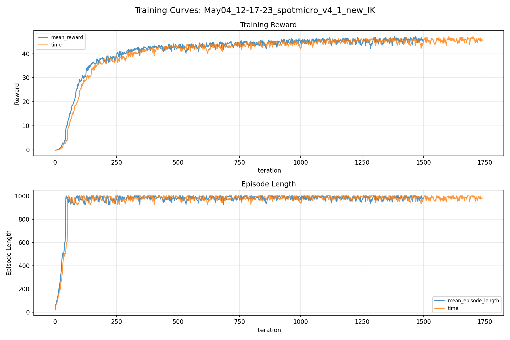
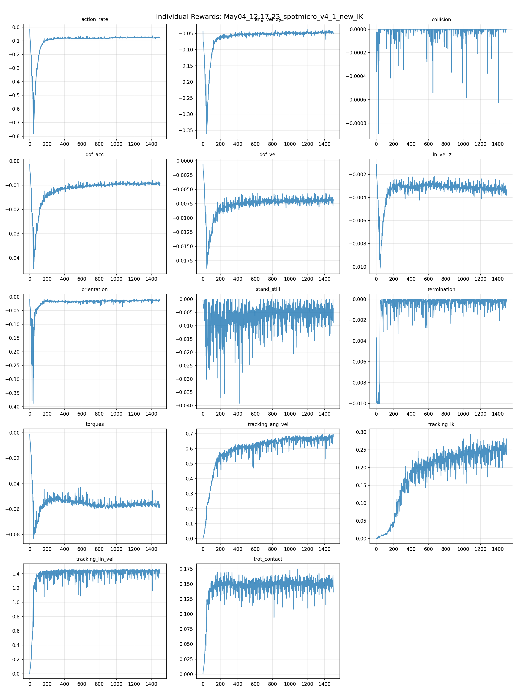
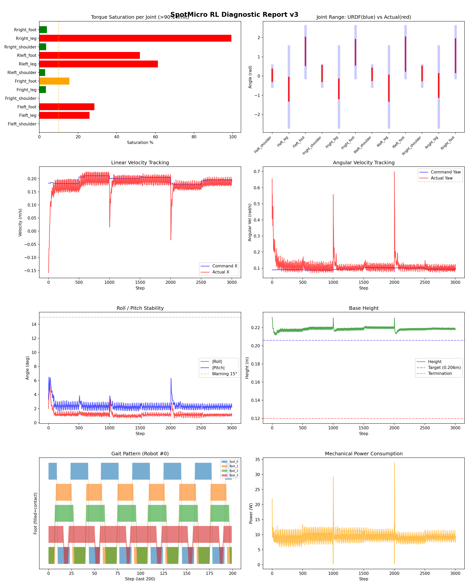
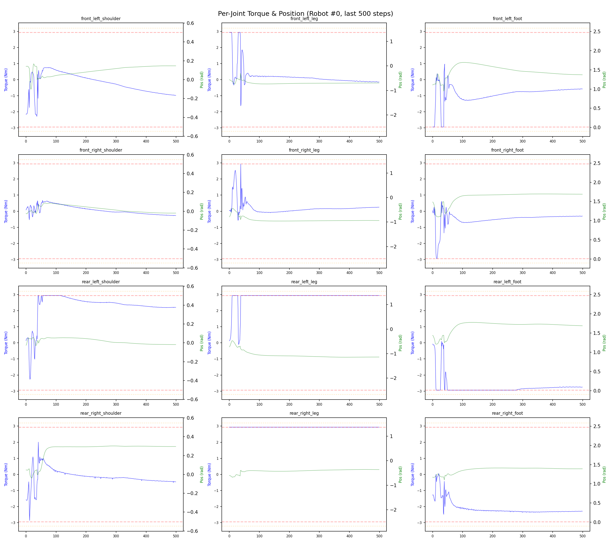
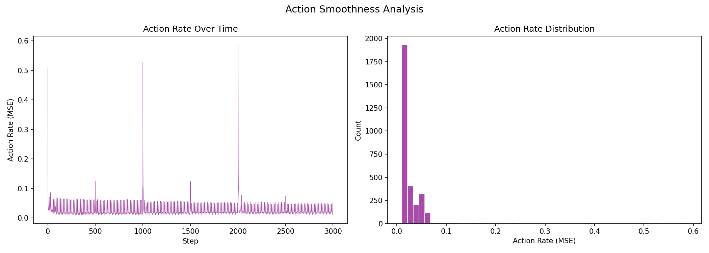

# 실험 036: spotmicro_v4_1_new_IK

- **날짜:** 2026-05-04 12:48
- **Task:** spotmicro_test
- **Run name:** `spotmicro_v4_1_new_IK`
- **판정:** ✅ PASS

---

## 실험 목적

V4.1: IK를 2D에서 quasi-3D로 변경.

---

## 변경점 (이전 커밋 대비)

```diff
diff --git a/ai_training/rl/legged_gym/legged_gym/envs/spotmicro_test/spotmicro_test.py b/ai_training/rl/legged_gym/legged_gym/envs/spotmicro_test/spotmicro_test.py
index d1d25d5..8279bbe 100644
--- a/ai_training/rl/legged_gym/legged_gym/envs/spotmicro_test/spotmicro_test.py
+++ b/ai_training/rl/legged_gym/legged_gym/envs/spotmicro_test/spotmicro_test.py
@@ -48,6 +48,32 @@ class SpotmicroTest(LeggedRobot):
             print(f"[Action Delay] 활성화: "
                   f"substep 단위, dt={dt_ms:.1f}ms, "
                   f"range={delay_range[0]*dt_ms:.0f}~{delay_range[1]*dt_ms:.0f}ms")
+                  
+                  
+        # leg origin in base frame: FL, FR, RL, RR
+        self.leg_origin_x = torch.tensor(
+            [0.093, 0.093, -0.093, -0.093],
+            device=self.device,
+            dtype=torch.float,
+        )
+
+        self.leg_origin_y = torch.tensor(
+            [0.036, -0.036, 0.036, -0.036],
+            device=self.device,
+            dtype=torch.float,
+        )
+
+        # shoulder joint numeric sign.
+        # 먼저 [1, 1, 1, 1]로 시작 추천.
+        # 실제 좌우 부호가 반대로 나가면 [1, -1, 1, -1]로 바꿔서 검증.
+        self.shoulder_sign = torch.tensor(
+            [1.0, 1.0, 1.0, 1.0],
+            device=self.device,
+            dtype=torch.float,
+        )
+
+        self.shoulder_ref_limit = 0.15
+        self.shoulder_y_gain = 2.0
 
     def step(self, actions):
         """서보 응답 지연을 substep 단위로 적용
@@ -282,6 +308,7 @@ class SpotmicroTest(LeggedRobot):
 
         return (lin_penalty + 0.5 * yaw_penalty + pose_penalty) * is_stand
 
+    '''
     def _get_ik_target(self):
         vx = self.commands[:, 0]
         wz = self.commands[:, 2] 
@@ -322,7 +349,121 @@ class SpotmicroTest(LeggedRobot):
         ref_dof_pos = blend * ref_dof_pos + (1.0 - blend) * self.default_dof_pos
     
         return ref_dof_pos
-        
+        '''
+    
+    def _get_ik_target(self):
+        vx = self.commands[:, 0]  # [num_envs]
+        vy = self.commands[:, 1]  # 현재는 0이지만 future-proof
+        wz = self.commands[:, 2]
+
+        # ------------------------------------------------------------
+        # 1. 각 발 위치 기준으로 body twist -> foot velocity 계산
+        # ------------------------------------------------------------
+        leg_x = self.leg_origin_x.unsqueeze(0)  # [1, 4]
+        leg_y = self.leg_origin_y.unsqueeze(0)  # [1, 4]
+
+        vx_b = vx.unsqueeze(1)  # [N, 1]
+        vy_b = vy.unsqueeze(1)
+        wz_b = wz.unsqueeze(1)
+
+        # body point velocity at each foot:
+        # v_point = [vx - wz*y_i, vy + wz*x_i]
+        foot_vx = vx_b - wz_b * leg_y      # [N, 4]
+        foot_vy = vy_b + wz_b * leg_x      # [N, 4]
+
+        stance_time = self.gait_period * self.duty_factor
+
+        stride_x = foot_vx * stance_time
+        stride_y = foot_vy * stance_time
+
+        # ------------------------------------------------------------
+        # 2. phase 생성
+        # --------------------------------------------------------
```

**변경 요약:**
  + self.leg_origin_x = torch.tensor(
  + [0.093, 0.093, -0.093, -0.093],
  + device=self.device,
  + dtype=torch.float,
  + )
  + self.leg_origin_y = torch.tensor(
  + [0.036, -0.036, 0.036, -0.036],
  + device=self.device,
  + dtype=torch.float,
  + )
  + self.shoulder_sign = torch.tensor(
  + [1.0, 1.0, 1.0, 1.0],
  + device=self.device,
  + dtype=torch.float,
  + )
  + self.shoulder_ref_limit = 0.15
  + self.shoulder_y_gain = 2.0
  + '''
  + '''
  + def _get_ik_target(self):
  + vx = self.commands[:, 0]  # [num_envs]
  + vy = self.commands[:, 1]  # 현재는 0이지만 future-proof
  + wz = self.commands[:, 2]
  + leg_x = self.leg_origin_x.unsqueeze(0)  # [1, 4]
  + leg_y = self.leg_origin_y.unsqueeze(0)  # [1, 4]
  + vx_b = vx.unsqueeze(1)  # [N, 1]
  + vy_b = vy.unsqueeze(1)
  + wz_b = wz.unsqueeze(1)
  + foot_vx = vx_b - wz_b * leg_y      # [N, 4]
  + foot_vy = vy_b + wz_b * leg_x      # [N, 4]
  + stance_time = self.gait_period * self.duty_factor
  + stride_x = foot_vx * stance_time
  + stride_y = foot_vy * stance_time
  + offsets = torch.tensor([0.0, 0.5, 0.5, 0.0], device=self.device)
  + phases = (self.gait_phase + offsets) % 1.0
  + x = torch.zeros((self.num_envs, 4), device=self.device)
  + y = torch.zeros((self.num_envs, 4), device=self.device)
  + z = torch.full((self.num_envs, 4), -self.body_height, device=self.device)
  + is_stance = phases < self.duty_factor
  + is_swing = ~is_stance
  + t_stance = phases / self.duty_factor
  + t_swing = (phases - self.duty_factor) / (1.0 - self.duty_factor)
  + x[is_stance] = stride_x[is_stance] * (0.5 - t_stance[is_stance])
  + y[is_stance] = stride_y[is_stance] * (0.5 - t_stance[is_stance])
  + x[is_swing] = stride_x[is_swing] * (-0.5 + t_swing[is_swing])
  + y[is_swing] = stride_y[is_swing] * (-0.5 + t_swing[is_swing])
  + z[is_swing] = (
  + -self.body_height
  + + self.step_height * torch.sin(torch.pi * t_swing[is_swing])
  + )
  + shoulder_raw = self.shoulder_y_gain * torch.atan2(y, -z)
  + shoulder_ref = torch.clamp(
  + shoulder_raw,
  + -self.shoulder_ref_limit,
  + self.shoulder_ref_limit,
  + )
  + shoulder_ref = shoulder_ref * self.shoulder_sign.unsqueeze(0)
  + z_eff = -torch.sqrt(torch.clamp(z * z + y * y, min=1e-6))
  + d = torch.sqrt(x**2 + z_eff**2)
  + cos_q2 = (d**2 - self.L1_EFF**2 - self.L2**2) / (
  + 2 * self.L1_EFF * self.L2
  + )
  + cos_q2 = torch.clamp(cos_q2, -0.999, 0.999)
  + q2 = torch.acos(cos_q2)
  + beta = torch.atan2(x, -z_eff)
  + alpha_k = torch.atan2(
  + self.L2 * torch.sin(q2),
  + self.L1_EFF + self.L2 * torch.cos(q2),
  + )
  + q1 = beta - alpha_k
  + theta_leg = q1 - self.ALPHA
  + theta_foot = q2 + self.ALPHA
  + ref_dof_pos = torch.zeros((self.num_envs, 12), device=self.device)
  + ref_dof_pos[:, 0::3] = shoulder_ref
  + ref_dof_pos[:, 1::3] = theta_leg
  + ref_dof_pos[:, 2::3] = theta_foot
  + cmd_norm = torch.norm(self.commands[:, :3], dim=1, keepdim=True)
  + blend = torch.clamp(cmd_norm / 0.1, 0.0, 1.0)
  + ref_dof_pos = blend * ref_dof_pos + (1.0 - blend) * self.default_dof_pos
  + return ref_dof_pos
  - weights = torch.tensor([0.9, 1.0, 1.0] * 4, device=self.device)
  + weights = torch.tensor([0.7, 1.0, 1.0] * 4, device=self.device)
  - run_name = 'spotmicro_v4_0_1_shoulder_weight'
  + run_name = 'spotmicro_v4_1_new_IK'

---

## 현재 Reward Scales

| Reward | Scale |
|--------|-------|
| action_rate | -0.05 |
| ang_vel_xy | -0.4 |
| collision | -1.0 |
| dof_acc | -2.5e-07 |
| dof_vel | -0.0005 |
| lin_vel_z | -2.0 |
| orientation | -4.0 |
| stand_still | -0.5 |
| termination | -10.0 |
| torques | -0.0015 |
| tracking_ang_vel | 1.0 |
| tracking_ik | 0.5 |
| tracking_lin_vel | 1.5 |
| trot_contact | 0.2 |

---

## 진단 결과 (Diagnostic)

### 핵심 지표

- ✅ Timeout: 98.5% (≥80%)
- ✅ 속도오차 X: 0.0323 m/s (<0.08)
- ⚠️ 토크포화: 24.7% (10~40%)
- ✅ 자세: roll 1.2°, pitch 2.4° (안정)
- ✅ 조기종료: 0.8% (<5%)

### 상세 수치

| 지표 | 값 |
|------|-----|
| Timeout% | 98.46153846153847 |
| 조기종료% | 0.7692307692307693 |
| 속도오차 X | 0.03234819695353508 m/s |
| 속도오차 Y | 0.020991293713450432 m/s |
| 각속도오차 | 0.06747526675462723 rad/s |
| 토크포화% | 24.700559856809857 |
| 평균 높이 | 0.21855427726205096 m |
| Roll (평균) | 1.1941293478012085° |
| Pitch (평균) | 2.37400221824646° |
| Action Rate | 0.026141198351979256 |
| 평균 전력 | 9.347467422485352 W |
| CoT | 2.040110137227976 |

## Command Mode별 회전 추종 분석

| 모드 | 비율 | 샘플 수 | 평균 abs(cmd_wz) | 평균 abs(actual_wz) | yaw 오차 | 상태 |
|------|------|---------|------------------|---------------------|----------|------|
| 정지 | 2.9% | 5512 | 0.0298 | 0.0648 | 0.0667 | ❌ |
| 직진/저회전 | 68.2% | 131134 | 0.0704 | 0.0939 | 0.0664 | ✅ |
| 제자리 회전 | 2.1% | 4006 | 0.1751 | 0.1534 | 0.0731 | ✅ |
| 전진+회전 | 20.3% | 39031 | 0.1770 | 0.1705 | 0.0678 | ✅ |
| 큰 회전명령 | 0.0% | 0 | N/A | N/A | N/A | N/A |

> 해석 기준: `제자리 회전`만 나쁘면 pure turn 학습/보행 패턴 문제, `큰 회전명령`만 나쁘면 yaw 명령 범위가 현재 토크/보폭 한계보다 큰 문제, `정지`가 나쁘면 stop drift 문제로 보면 됩니다.
        


## 학습 곡선 분석

| 지표 | 값 | 판정 |
|------|-----|------|
| 수렴 iter (90%) | 336 | 빠름 |
| 후반 안정성 (CV) | 0.019 | 안정 |
| 정체 구간 | 없음 | |


## Per-leg 분석

### 발별 접촉/공중 비율

| 발 | 접촉% | 공중% |
|-----|-------|------|
| foot_0 | 57.0% | 43.0% |
| foot_1 | 55.5% | 44.5% |
| foot_2 | 62.8% | 37.2% |
| foot_3 | 77.5% | 22.5% |

### 관절별 토크 포화

| 관절 | 포화% | 최대토크 | 한계 | 상태 |
|------|------|---------|------|------|
| front_left_shoulder | 0.1% | 2.940 | 2.940 | ✅ |
| front_left_leg | 26.0% | 2.940 | 2.940 | ❌ |
| front_left_foot | 28.5% | 2.940 | 2.940 | ❌ |
| front_right_shoulder | 0.0% | 2.940 | 2.940 | ✅ |
| front_right_leg | 3.4% | 2.940 | 2.940 | ✅ |
| front_right_foot | 15.5% | 2.940 | 2.940 | ⚠️ |
| rear_left_shoulder | 3.0% | 2.940 | 2.940 | ✅ |
| rear_left_leg | 61.3% | 2.940 | 2.940 | ❌ |
| rear_left_foot | 52.0% | 2.940 | 2.940 | ❌ |
| rear_right_shoulder | 3.5% | 2.940 | 2.940 | ✅ |
| rear_right_leg | 99.3% | 2.940 | 2.940 | ❌ |
| rear_right_foot | 3.9% | 2.940 | 2.940 | ✅ |


## Gait 분석

| 지표 | 값 |
|------|-----|
| Gait 주파수 | 1.67 Hz |
| Gait 주기 | 30 steps |
| 대각 동기화율 | 81.8% |
| L/R 비대칭 | 0.0%p |
| 판정 | ✅ Trot 패턴 / ✅ 대칭 |


## 관절별 상세

| 관절 | 토크포화% | 사용범위% | 편향(rad) | 한계근접% | 상태 |
|------|----------|----------|----------|----------|------|
| front_left_shoulder | 0.1% | 58% | +0.038 | 0.0% | ✅ |
| front_left_leg | 26.0% | 29% | -0.683 | 0.0% | ⚠️ |
| front_left_foot | 28.5% | 54% | +1.281 | 0.0% | ⚠️ |
| front_right_shoulder | 0.0% | 76% | +0.133 | 0.0% | ⚠️ |
| front_right_leg | 3.4% | 24% | -0.665 | 0.0% | ⚠️ |
| front_right_foot | 15.5% | 49% | +1.231 | 0.0% | ⚠️ |
| rear_left_shoulder | 3.0% | 59% | +0.093 | 0.0% | ✅ |
| rear_left_leg | 61.3% | 32% | -0.633 | 0.0% | ⚠️ |
| rear_left_foot | 52.0% | 66% | +1.142 | 0.0% | ⚠️ |
| rear_right_shoulder | 3.5% | 68% | +0.126 | 0.0% | ⚠️ |
| rear_right_leg | 99.3% | 29% | -0.488 | 0.0% | ⚠️ |
| rear_right_foot | 3.9% | 65% | +1.060 | 0.0% | ⚠️ |


## 에너지 효율 상세

| 지표 | 값 |
|------|-----|
| 평균 전력 | 9.35 W |
| 피크 전력 | 33.85 W |
| 피크/평균 비율 | 3.6x |
| CoT | 2.04 |

### 관절별 전력 분배

| 관절 | 평균전력(W) | 비율% |
|------|-----------|-------|
| rear_right_leg | 2.087 | 22.3% |
| rear_left_leg | 1.344 | 14.4% |
| front_left_foot | 1.230 | 13.2% |
| front_right_foot | 0.979 | 10.5% |
| rear_left_foot | 0.945 | 10.1% |
| front_right_leg | 0.852 | 9.1% |
| front_left_leg | 0.689 | 7.4% |
| rear_right_foot | 0.506 | 5.4% |
| rear_right_shoulder | 0.308 | 3.3% |
| rear_left_shoulder | 0.169 | 1.8% |
| front_left_shoulder | 0.169 | 1.8% |
| front_right_shoulder | 0.068 | 0.7% |


## 이전 실험 대비 비교

| 지표 | 이전 (exp035) | 현재 (exp036) | 변화 |
|------|-------|-------|------|
| Timeout% | 96.2% | 98.5% | ✅ ↑ 2.2209% |
| 속도오차 X | 0.0334 | 0.0323 | ✅ ↓ 0.0010m/s |
| 토크포화 | 23.3% | 24.7% | ⚠️ ↑ 1.3552% |
| Roll | 1.6° | 1.2° | ✅ ↓ 0.3917° |
| Pitch | 2.5° | 2.4° | ✅ ↓ 0.1159° |
| 평균 전력 | 8.8364W | 9.3475W | ⚠️ ↑ 0.5111W |


## Tensorboard 학습 곡선 요약

| 스칼라 | 최종값 | 최대 | 최소 | 후반10% 평균 |
|--------|--------|------|------|-------------|
| rew_action_rate | -0.0800 | -0.0147 | -0.7809 | -0.0766 |
| rew_ang_vel_xy | -0.0511 | -0.0371 | -0.3604 | -0.0467 |
| rew_collision | 0.0000 | 0.0000 | -0.0009 | -0.0000 |
| rew_dof_acc | -0.0092 | -0.0013 | -0.0444 | -0.0093 |
| rew_dof_vel | -0.0070 | -0.0006 | -0.0189 | -0.0069 |
| rew_lin_vel_z | -0.0036 | -0.0011 | -0.0102 | -0.0033 |
| rew_orientation | -0.0102 | -0.0084 | -0.3884 | -0.0126 |
| rew_stand_still | -0.0035 | 0.0000 | -0.0393 | -0.0048 |
| rew_termination | 0.0000 | 0.0000 | -0.0100 | -0.0002 |
| rew_torques | -0.0589 | -0.0010 | -0.0831 | -0.0564 |
| rew_tracking_ang_vel | 0.6969 | 0.6969 | 0.0017 | 0.6695 |
| rew_tracking_ik | 0.2393 | 0.2942 | 0.0007 | 0.2486 |
| rew_tracking_lin_vel | 1.4541 | 1.4652 | 0.0058 | 1.4273 |
| rew_trot_contact | 0.1365 | 0.1749 | 0.0014 | 0.1502 |
| learning_rate | 0.0001 | 0.0100 | 0.0000 | 0.0002 |
| surrogate | -0.0014 | 0.0095 | -0.0088 | -0.0019 |
| value_function | 0.0235 | 0.0808 | 0.0014 | 0.0064 |
| collection time | 0.8688 | 0.9483 | 0.8241 | 0.8717 |
| learning_time | 0.3142 | 0.3662 | 0.2779 | 0.2890 |
| total_fps | 83098.0000 | 88595.0000 | 74783.0000 | 84723.7667 |
| mean_noise_std | 0.2201 | 1.0059 | 0.2124 | 0.2210 |
| mean_episode_length | 982.8800 | 1002.0000 | 22.1000 | 984.6489 |
| time | 982.8800 | 1002.0000 | 22.1000 | 984.6489 |
| mean_reward | 45.5951 | 47.1878 | -0.1659 | 45.7232 |
| time | 45.5951 | 47.1878 | -0.1659 | 45.7232 |

총 학습 iteration: 1499


---

## 그래프

### Tensorboard 학습 곡선



### Diagnostic 결과





---

## 결론 및 다음 실험 방향

**자동 판정:** ✅ PASS

대부분 기준을 통과했으나 일부 항목이 보통 수준입니다.
  - ⚠️ 토크포화: 24.7% (10~40%)

> 💡 위 결론은 자동 생성되었습니다. 필요시 수정하세요.

---

## 메모

_(추가 메모가 있으면 여기에 작성)_

