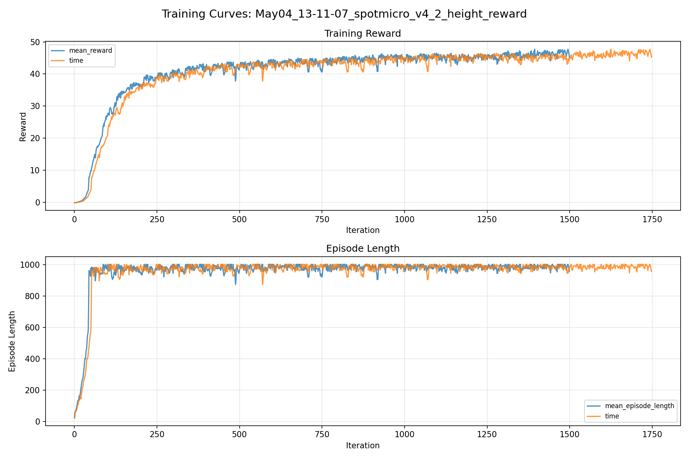
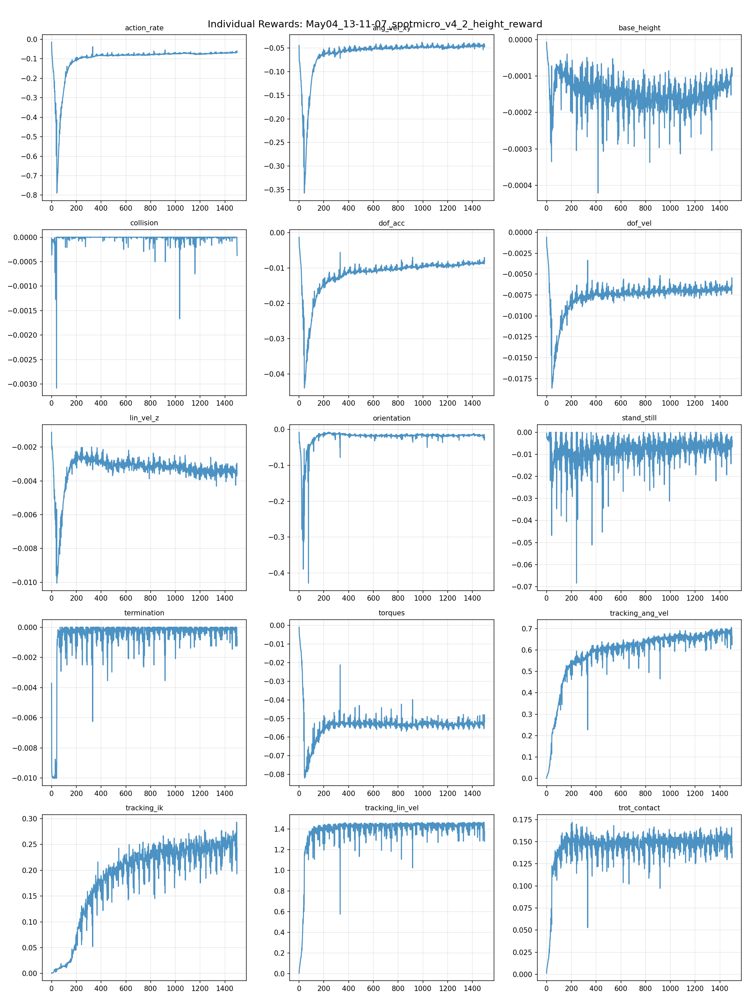
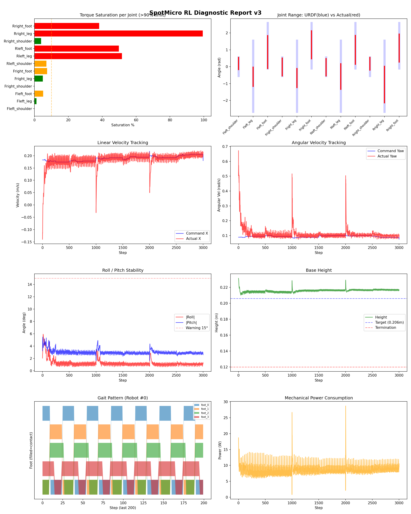
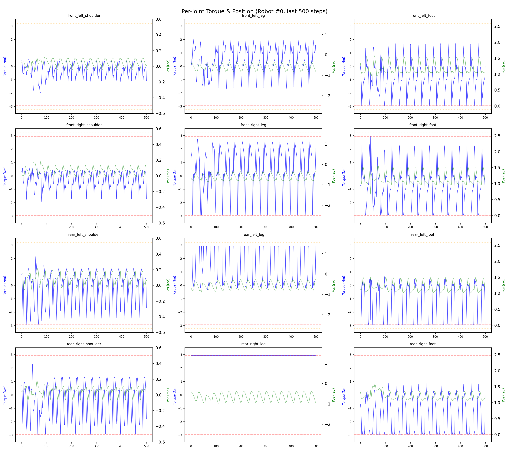
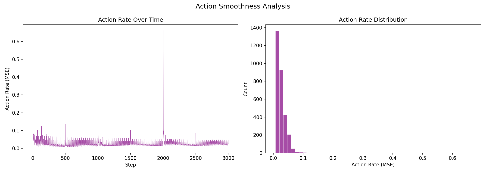

# 실험 037: spotmicro_v4_2_height_reward

- **날짜:** 2026-05-04 13:42
- **Task:** spotmicro_test
- **Run name:** `spotmicro_v4_2_height_reward`
- **판정:** ✅ PASS

---

## 실험 목적

V4.2: 높이 reward 추가하여 뒷다리 토크 문제 해결 시도

---

## 변경점 (이전 커밋 대비)

```diff
diff --git a/ai_training/rl/legged_gym/legged_gym/envs/spotmicro_test/spotmicro_test_config.py b/ai_training/rl/legged_gym/legged_gym/envs/spotmicro_test/spotmicro_test_config.py
index 8f37cc5..7480059 100644
--- a/ai_training/rl/legged_gym/legged_gym/envs/spotmicro_test/spotmicro_test_config.py
+++ b/ai_training/rl/legged_gym/legged_gym/envs/spotmicro_test/spotmicro_test_config.py
@@ -66,6 +66,7 @@ class SpotmicroTestCfg(LeggedRobotCfg):
             tracking_ik = 0.5
             stand_still = -0.5
             residual_action = 0.0
+            base_height = -0.8
         soft_dof_pos_limit = 0.9
         base_height_target = 0.206
         tracking_sigma = 0.1
@@ -120,7 +121,7 @@ class SpotmicroTestCfgPPO(LeggedRobotCfgPPO):
         entropy_coef = 0.01
 
     class runner(LeggedRobotCfgPPO.runner):
-        run_name = 'spotmicro_v4_1_new_IK'
+        run_name = 'spotmicro_v4_2_height_reward'
         experiment_name = 'spotmicro_test'
         max_iterations = 1500
         save_interval = 100
```

**변경 요약:**
  + base_height = -0.8
  - run_name = 'spotmicro_v4_1_new_IK'
  + run_name = 'spotmicro_v4_2_height_reward'

---

## 현재 Reward Scales

| Reward | Scale |
|--------|-------|
| action_rate | -0.05 |
| ang_vel_xy | -0.4 |
| base_height | -0.8 |
| collision | -1.0 |
| dof_acc | -2.5e-07 |
| dof_vel | -0.0005 |
| lin_vel_z | -2.0 |
| orientation | -4.0 |
| stand_still | -0.5 |
| termination | -10.0 |
| torques | -0.0015 |
| tracking_ang_vel | 1.0 |
| tracking_ik | 0.5 |
| tracking_lin_vel | 1.5 |
| trot_contact | 0.2 |

---

## 진단 결과 (Diagnostic)

### 핵심 지표

- ✅ Timeout: 90.8% (≥80%)
- ✅ 속도오차 X: 0.0318 m/s (<0.08)
- ⚠️ 토크포화: 22.4% (10~40%)
- ✅ 자세: roll 1.3°, pitch 3.0° (안정)
- ✅ 조기종료: 2.8% (<5%)

### 상세 수치

| 지표 | 값 |
|------|-----|
| Timeout% | 90.78014184397163 |
| 조기종료% | 2.8368794326241136 |
| 속도오차 X | 0.0318203940987587 m/s |
| 속도오차 Y | 0.019309982657432556 m/s |
| 각속도오차 | 0.06896975636482239 rad/s |
| 토크포화% | 22.3968305999556 |
| 평균 높이 | 0.2157814386652741 m |
| Roll (평균) | 1.2754309177398682° |
| Pitch (평균) | 3.024834632873535° |
| Action Rate | 0.02642161026597023 |
| 평균 전력 | 8.916094779968262 W |
| CoT | 1.9126357220749557 |

## Command Mode별 회전 추종 분석

| 모드 | 비율 | 샘플 수 | 평균 abs(cmd_wz) | 평균 abs(actual_wz) | yaw 오차 | 상태 |
|------|------|---------|------------------|---------------------|----------|------|
| 정지 | 2.9% | 5512 | 0.0295 | 0.0797 | 0.0819 | ❌ |
| 직진/저회전 | 68.2% | 131048 | 0.0714 | 0.0953 | 0.0686 | ✅ |
| 제자리 회전 | 2.1% | 4003 | 0.1785 | 0.1737 | 0.0667 | ✅ |
| 전진+회전 | 18.5% | 35616 | 0.1752 | 0.1688 | 0.0675 | ✅ |
| 큰 회전명령 | 0.0% | 0 | N/A | N/A | N/A | N/A |

> 해석 기준: `제자리 회전`만 나쁘면 pure turn 학습/보행 패턴 문제, `큰 회전명령`만 나쁘면 yaw 명령 범위가 현재 토크/보폭 한계보다 큰 문제, `정지`가 나쁘면 stop drift 문제로 보면 됩니다.
        


## 학습 곡선 분석

| 지표 | 값 | 판정 |
|------|-----|------|
| 수렴 iter (90%) | 379 | 빠름 |
| 후반 안정성 (CV) | 0.022 | 안정 |
| 정체 구간 | 없음 | |


## Per-leg 분석

### 발별 접촉/공중 비율

| 발 | 접촉% | 공중% |
|-----|-------|------|
| foot_0 | 56.2% | 43.8% |
| foot_1 | 56.4% | 43.6% |
| foot_2 | 67.7% | 32.3% |
| foot_3 | 74.8% | 25.2% |

### 관절별 토크 포화

| 관절 | 포화% | 최대토크 | 한계 | 상태 |
|------|------|---------|------|------|
| front_left_shoulder | 0.0% | 2.940 | 2.940 | ✅ |
| front_left_leg | 1.2% | 2.940 | 2.940 | ✅ |
| front_left_foot | 5.1% | 2.940 | 2.940 | ⚠️ |
| front_right_shoulder | 0.0% | 2.940 | 2.940 | ✅ |
| front_right_leg | 4.9% | 2.940 | 2.940 | ✅ |
| front_right_foot | 7.5% | 2.940 | 2.940 | ⚠️ |
| rear_left_shoulder | 7.0% | 2.940 | 2.940 | ⚠️ |
| rear_left_leg | 51.7% | 2.940 | 2.940 | ❌ |
| rear_left_foot | 49.8% | 2.940 | 2.940 | ❌ |
| rear_right_shoulder | 3.9% | 2.940 | 2.940 | ✅ |
| rear_right_leg | 99.4% | 2.940 | 2.940 | ❌ |
| rear_right_foot | 38.2% | 2.940 | 2.940 | ❌ |


## Gait 분석

| 지표 | 값 |
|------|-----|
| Gait 주파수 | 1.67 Hz |
| Gait 주기 | 30 steps |
| 대각 동기화율 | 85.1% |
| L/R 비대칭 | 0.0%p |
| 판정 | ✅ Trot 패턴 / ✅ 대칭 |


## 관절별 상세

| 관절 | 토크포화% | 사용범위% | 편향(rad) | 한계근접% | 상태 |
|------|----------|----------|----------|----------|------|
| front_left_shoulder | 0.0% | 65% | +0.191 | 0.0% | ⚠️ |
| front_left_leg | 1.2% | 27% | -0.593 | 0.0% | ⚠️ |
| front_left_foot | 5.1% | 73% | +0.871 | 0.0% | ⚠️ |
| front_right_shoulder | 0.0% | 96% | -0.018 | 0.0% | ✅ |
| front_right_leg | 4.9% | 27% | -0.673 | 0.0% | ⚠️ |
| front_right_foot | 7.5% | 62% | +1.299 | 0.0% | ⚠️ |
| rear_left_shoulder | 7.0% | 94% | -0.034 | 0.0% | ✅ |
| rear_left_leg | 51.7% | 36% | -0.583 | 0.0% | ⚠️ |
| rear_left_foot | 49.8% | 64% | +0.999 | 0.0% | ⚠️ |
| rear_right_shoulder | 3.9% | 69% | +0.174 | 0.0% | ⚠️ |
| rear_right_leg | 99.4% | 51% | -1.057 | 0.0% | ⚠️ |
| rear_right_foot | 38.2% | 62% | +1.105 | 0.0% | ⚠️ |


## 에너지 효율 상세

| 지표 | 값 |
|------|-----|
| 평균 전력 | 8.92 W |
| 피크 전력 | 28.72 W |
| 피크/평균 비율 | 3.2x |
| CoT | 1.91 |

### 관절별 전력 분배

| 관절 | 평균전력(W) | 비율% |
|------|-----------|-------|
| rear_right_leg | 2.154 | 24.2% |
| rear_left_foot | 0.993 | 11.1% |
| front_right_leg | 0.912 | 10.2% |
| rear_right_foot | 0.896 | 10.0% |
| rear_left_leg | 0.878 | 9.8% |
| front_right_foot | 0.878 | 9.8% |
| front_left_foot | 0.830 | 9.3% |
| front_left_leg | 0.642 | 7.2% |
| rear_left_shoulder | 0.289 | 3.2% |
| rear_right_shoulder | 0.269 | 3.0% |
| front_right_shoulder | 0.088 | 1.0% |
| front_left_shoulder | 0.087 | 1.0% |


## 이전 실험 대비 비교

| 지표 | 이전 (exp036) | 현재 (exp037) | 변화 |
|------|-------|-------|------|
| Timeout% | 98.5% | 90.8% | ⚠️ ↓ 7.6814% |
| 속도오차 X | 0.0323 | 0.0318 | ✅ ↓ 0.0005m/s |
| 토크포화 | 24.7% | 22.4% | ✅ ↓ 2.3037% |
| Roll | 1.2° | 1.3° | ⚠️ ↑ 0.0813° |
| Pitch | 2.4° | 3.0° | ⚠️ ↑ 0.6508° |
| 평균 전력 | 9.3475W | 8.9161W | ✅ ↓ 0.4314W |


## Tensorboard 학습 곡선 요약

| 스칼라 | 최종값 | 최대 | 최소 | 후반10% 평균 |
|--------|--------|------|------|-------------|
| rew_action_rate | -0.0650 | -0.0147 | -0.7895 | -0.0690 |
| rew_ang_vel_xy | -0.0469 | -0.0376 | -0.3573 | -0.0448 |
| rew_base_height | -0.0001 | -0.0000 | -0.0004 | -0.0001 |
| rew_collision | -0.0004 | 0.0000 | -0.0031 | -0.0000 |
| rew_dof_acc | -0.0082 | -0.0013 | -0.0440 | -0.0087 |
| rew_dof_vel | -0.0065 | -0.0006 | -0.0186 | -0.0067 |
| rew_lin_vel_z | -0.0036 | -0.0011 | -0.0100 | -0.0034 |
| rew_orientation | -0.0232 | -0.0081 | -0.4277 | -0.0165 |
| rew_stand_still | -0.0066 | 0.0000 | -0.0684 | -0.0063 |
| rew_termination | -0.0006 | 0.0000 | -0.0100 | -0.0002 |
| rew_torques | -0.0516 | -0.0010 | -0.0820 | -0.0529 |
| rew_tracking_ang_vel | 0.6616 | 0.7063 | 0.0017 | 0.6783 |
| rew_tracking_ik | 0.2433 | 0.2931 | 0.0007 | 0.2493 |
| rew_tracking_lin_vel | 1.3725 | 1.4641 | 0.0058 | 1.4297 |
| rew_trot_contact | 0.1317 | 0.1719 | 0.0014 | 0.1505 |
| learning_rate | 0.0002 | 0.0100 | 0.0000 | 0.0002 |
| surrogate | -0.0023 | 0.0082 | -0.0093 | -0.0023 |
| value_function | 0.0058 | 0.6706 | 0.0014 | 0.0056 |
| collection time | 0.8971 | 0.9525 | 0.8261 | 0.8769 |
| learning_time | 0.2894 | 0.3327 | 0.2718 | 0.2894 |
| total_fps | 82852.0000 | 88401.0000 | 76624.0000 | 84318.0667 |
| mean_noise_std | 0.1998 | 1.0060 | 0.1931 | 0.2025 |
| mean_episode_length | 956.2700 | 1002.0000 | 22.1000 | 985.9996 |
| time | 956.2700 | 1002.0000 | 22.1000 | 985.9996 |
| mean_reward | 45.2324 | 47.7365 | -0.1659 | 46.2531 |
| time | 45.2324 | 47.7365 | -0.1659 | 46.2531 |

총 학습 iteration: 1499


---

## 그래프

### Tensorboard 학습 곡선



### Diagnostic 결과





---

## 결론 및 다음 실험 방향

**자동 판정:** ✅ PASS

대부분 기준을 통과했으나 일부 항목이 보통 수준입니다.
  - ⚠️ 토크포화: 22.4% (10~40%)

> 💡 위 결론은 자동 생성되었습니다. 필요시 수정하세요.

---

## 메모

_(추가 메모가 있으면 여기에 작성)_

