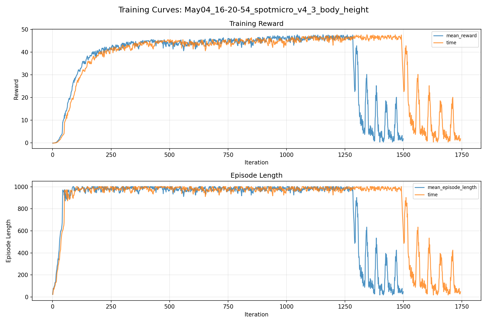
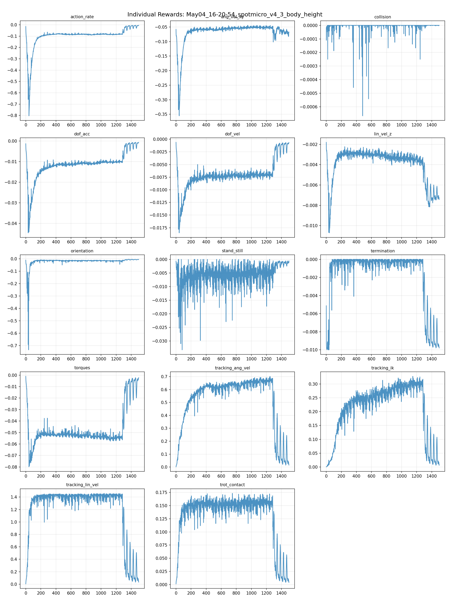
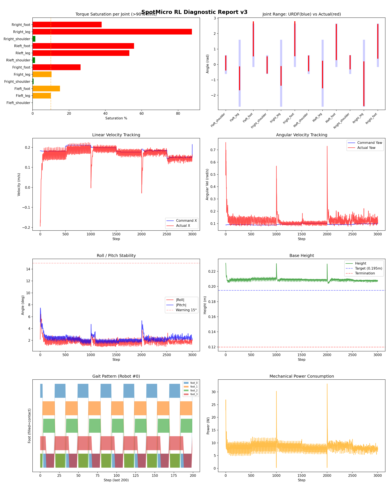
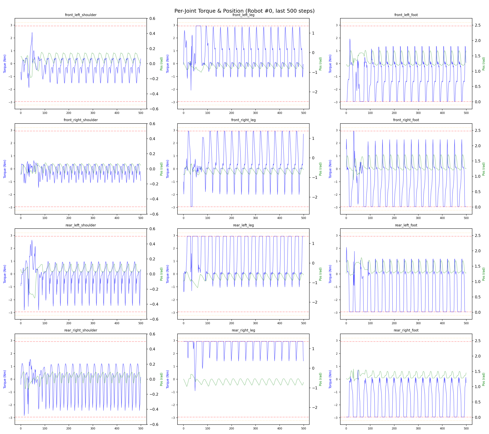
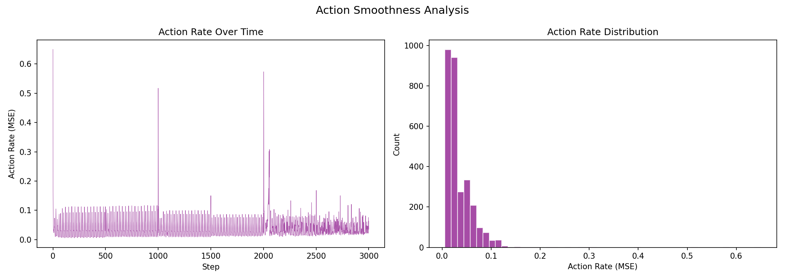

# 실험 038: spotmicro_v4_3_body_height

- **날짜:** 2026-05-04 16:52
- **Task:** spotmicro_test
- **Run name:** `spotmicro_v4_3_body_height`
- **판정:** ❌ FAIL (일부 기준 미달)

---

## 실험 목적

V4.3: IK의 body height를 낮춰 토크 포화 감소 시도

---

## 변경점 (이전 커밋 대비)

```diff
diff --git a/ai_training/rl/legged_gym/legged_gym/envs/spotmicro_test/spotmicro_test.py b/ai_training/rl/legged_gym/legged_gym/envs/spotmicro_test/spotmicro_test.py
index 8279bbe..bbcf43d 100644
--- a/ai_training/rl/legged_gym/legged_gym/envs/spotmicro_test/spotmicro_test.py
+++ b/ai_training/rl/legged_gym/legged_gym/envs/spotmicro_test/spotmicro_test.py
@@ -23,7 +23,7 @@ class SpotmicroTest(LeggedRobot):
         self.gait_period = 0.6
         self.duty_factor = 0.5
         self.step_height = 0.03
-        self.body_height = 0.206
+        self.body_height = 0.195
 
         self.gait_phase = torch.zeros(self.num_envs, 1, dtype=torch.float, device=self.device)
         self.commands_scale = torch.tensor(
diff --git a/ai_training/rl/legged_gym/legged_gym/envs/spotmicro_test/spotmicro_test_config.py b/ai_training/rl/legged_gym/legged_gym/envs/spotmicro_test/spotmicro_test_config.py
index 7480059..1039a1d 100644
--- a/ai_training/rl/legged_gym/legged_gym/envs/spotmicro_test/spotmicro_test_config.py
+++ b/ai_training/rl/legged_gym/legged_gym/envs/spotmicro_test/spotmicro_test_config.py
@@ -66,9 +66,9 @@ class SpotmicroTestCfg(LeggedRobotCfg):
             tracking_ik = 0.5
             stand_still = -0.5
             residual_action = 0.0
-            base_height = -0.8
+            base_height = 0.0
         soft_dof_pos_limit = 0.9
-        base_height_target = 0.206
+        base_height_target = 0.195
         tracking_sigma = 0.1
         tracking_sigma_ang_vel = 0.05
 
@@ -121,7 +121,7 @@ class SpotmicroTestCfgPPO(LeggedRobotCfgPPO):
         entropy_coef = 0.01
 
     class runner(LeggedRobotCfgPPO.runner):
-        run_name = 'spotmicro_v4_2_height_reward'
+        run_name = 'spotmicro_v4_3_body_height'
         experiment_name = 'spotmicro_test'
         max_iterations = 1500
         save_interval = 100
```

**변경 요약:**
  - self.body_height = 0.206
  + self.body_height = 0.195
  - base_height = -0.8
  + base_height = 0.0
  - base_height_target = 0.206
  + base_height_target = 0.195
  - run_name = 'spotmicro_v4_2_height_reward'
  + run_name = 'spotmicro_v4_3_body_height'

---

## 현재 Reward Scales

| Reward | Scale |
|--------|-------|
| action_rate | -0.05 |
| ang_vel_xy | -0.4 |
| collision | -1.0 |
| dof_acc | -2.5e-07 |
| dof_vel | -0.0005 |
| lin_vel_z | -2.0 |
| orientation | -4.0 |
| stand_still | -0.5 |
| termination | -10.0 |
| torques | -0.0015 |
| tracking_ang_vel | 1.0 |
| tracking_ik | 0.5 |
| tracking_lin_vel | 1.5 |
| trot_contact | 0.2 |

---

## 진단 결과 (Diagnostic)

### 핵심 지표

- ❌ Timeout: 49.6% (<60%, 미달)
- ✅ 속도오차 X: 0.0386 m/s (<0.08)
- ⚠️ 토크포화: 25.0% (10~40%)
- ✅ 자세: roll 1.9°, pitch 2.3° (안정)
- ❌ 조기종료: 50.0% (>20%)

### 상세 수치

| 지표 | 값 |
|------|-----|
| Timeout% | 49.6124031007752 |
| 조기종료% | 50.0 |
| 속도오차 X | 0.03857134282588959 m/s |
| 속도오차 Y | 0.020504934713244438 m/s |
| 각속도오차 | 0.07386118918657303 rad/s |
| 토크포화% | 24.981528887778886 |
| 평균 높이 | 0.2089176920754013 m |
| Roll (평균) | 1.8599878549575806° |
| Pitch (평균) | 2.3180747032165527° |
| Action Rate | 0.03463703393936157 |
| 평균 전력 | 8.273795127868652 W |
| CoT | 1.9054999084956548 |

## Command Mode별 회전 추종 분석

| 모드 | 비율 | 샘플 수 | 평균 abs(cmd_wz) | 평균 abs(actual_wz) | yaw 오차 | 상태 |
|------|------|---------|------------------|---------------------|----------|------|
| 정지 | 4.2% | 8027 | 0.0216 | 0.0779 | 0.0814 | ❌ |
| 직진/저회전 | 64.2% | 123391 | 0.0713 | 0.1063 | 0.0743 | ✅ |
| 제자리 회전 | 2.1% | 4035 | 0.1666 | 0.1684 | 0.0668 | ✅ |
| 전진+회전 | 20.4% | 39166 | 0.1723 | 0.1794 | 0.0723 | ✅ |
| 큰 회전명령 | 0.0% | 0 | N/A | N/A | N/A | N/A |

> 해석 기준: `제자리 회전`만 나쁘면 pure turn 학습/보행 패턴 문제, `큰 회전명령`만 나쁘면 yaw 명령 범위가 현재 토크/보폭 한계보다 큰 문제, `정지`가 나쁘면 stop drift 문제로 보면 됩니다.
        


## 학습 곡선 분석

| 지표 | 값 | 판정 |
|------|-----|------|
| 수렴 iter (90%) | 255 | 빠름 |
| 후반 안정성 (CV) | 0.476 | 불안정 |
| 정체 구간 | 없음 | |


## Per-leg 분석

### 발별 접촉/공중 비율

| 발 | 접촉% | 공중% |
|-----|-------|------|
| foot_0 | 53.2% | 46.8% |
| foot_1 | 58.1% | 41.9% |
| foot_2 | 62.0% | 38.0% |
| foot_3 | 72.3% | 27.7% |

### 관절별 토크 포화

| 관절 | 포화% | 최대토크 | 한계 | 상태 |
|------|------|---------|------|------|
| front_left_shoulder | 0.1% | 2.940 | 2.940 | ✅ |
| front_left_leg | 10.1% | 2.940 | 2.940 | ⚠️ |
| front_left_foot | 15.0% | 2.940 | 2.940 | ⚠️ |
| front_right_shoulder | 0.5% | 2.940 | 2.940 | ✅ |
| front_right_leg | 10.4% | 2.940 | 2.940 | ⚠️ |
| front_right_foot | 26.4% | 2.940 | 2.940 | ❌ |
| rear_left_shoulder | 1.3% | 2.940 | 2.940 | ✅ |
| rear_left_leg | 53.2% | 2.940 | 2.940 | ❌ |
| rear_left_foot | 55.8% | 2.940 | 2.940 | ❌ |
| rear_right_shoulder | 1.5% | 2.940 | 2.940 | ✅ |
| rear_right_leg | 87.6% | 2.940 | 2.940 | ❌ |
| rear_right_foot | 38.0% | 2.940 | 2.940 | ❌ |


## Gait 분석

| 지표 | 값 |
|------|-----|
| Gait 주파수 | 1.67 Hz |
| Gait 주기 | 30 steps |
| 대각 동기화율 | 87.9% |
| L/R 비대칭 | 0.0%p |
| 판정 | ✅ Trot 패턴 / ✅ 대칭 |


## 관절별 상세

| 관절 | 토크포화% | 사용범위% | 편향(rad) | 한계근접% | 상태 |
|------|----------|----------|----------|----------|------|
| front_left_shoulder | 0.1% | 83% | +0.092 | 0.1% | ✅ |
| front_left_leg | 10.1% | 35% | -0.897 | 0.0% | ⚠️ |
| front_left_foot | 15.0% | 82% | +1.661 | 0.0% | ⚠️ |
| front_right_shoulder | 0.5% | 96% | -0.030 | 0.0% | ✅ |
| front_right_leg | 10.4% | 29% | -0.739 | 0.0% | ⚠️ |
| front_right_foot | 26.4% | 82% | +1.665 | 0.1% | ⚠️ |
| rear_left_shoulder | 1.3% | 88% | +0.069 | 0.1% | ✅ |
| rear_left_leg | 53.2% | 41% | -0.649 | 0.0% | ⚠️ |
| rear_left_foot | 55.8% | 84% | +1.454 | 0.0% | ⚠️ |
| rear_right_shoulder | 1.5% | 77% | +0.137 | 0.3% | ⚠️ |
| rear_right_leg | 87.6% | 67% | -1.248 | 0.0% | ⚠️ |
| rear_right_foot | 38.0% | 81% | +1.499 | 0.0% | ⚠️ |


## 에너지 효율 상세

| 지표 | 값 |
|------|-----|
| 평균 전력 | 8.27 W |
| 피크 전력 | 33.17 W |
| 피크/평균 비율 | 4.0x |
| CoT | 1.91 |

### 관절별 전력 분배

| 관절 | 평균전력(W) | 비율% |
|------|-----------|-------|
| rear_right_leg | 1.610 | 19.5% |
| rear_left_foot | 1.091 | 13.2% |
| front_right_foot | 0.961 | 11.6% |
| front_left_foot | 0.910 | 11.0% |
| rear_left_leg | 0.873 | 10.5% |
| front_right_leg | 0.840 | 10.2% |
| rear_right_foot | 0.777 | 9.4% |
| front_left_leg | 0.596 | 7.2% |
| rear_right_shoulder | 0.321 | 3.9% |
| rear_left_shoulder | 0.131 | 1.6% |
| front_left_shoulder | 0.090 | 1.1% |
| front_right_shoulder | 0.074 | 0.9% |


## 이전 실험 대비 비교

| 지표 | 이전 (exp037) | 현재 (exp038) | 변화 |
|------|-------|-------|------|
| Timeout% | 90.8% | 49.6% | ⚠️ ↓ 41.1677% |
| 속도오차 X | 0.0318 | 0.0386 | ⚠️ ↑ 0.0068m/s |
| 토크포화 | 22.4% | 25.0% | ⚠️ ↑ 2.5847% |
| Roll | 1.3° | 1.9° | ⚠️ ↑ 0.5846° |
| Pitch | 3.0° | 2.3° | ✅ ↓ 0.7068° |
| 평균 전력 | 8.9161W | 8.2738W | ✅ ↓ 0.6423W |


## Tensorboard 학습 곡선 요약

| 스칼라 | 최종값 | 최대 | 최소 | 후반10% 평균 |
|--------|--------|------|------|-------------|
| rew_action_rate | -0.0046 | -0.0045 | -0.8035 | -0.0134 |
| rew_ang_vel_xy | -0.0672 | -0.0442 | -0.3555 | -0.0650 |
| rew_collision | 0.0000 | 0.0000 | -0.0007 | -0.0000 |
| rew_dof_acc | -0.0006 | -0.0006 | -0.0446 | -0.0017 |
| rew_dof_vel | -0.0006 | -0.0006 | -0.0185 | -0.0014 |
| rew_lin_vel_z | -0.0074 | -0.0018 | -0.0107 | -0.0072 |
| rew_orientation | -0.0048 | -0.0038 | -0.7346 | -0.0060 |
| rew_stand_still | -0.0006 | 0.0000 | -0.0332 | -0.0014 |
| rew_termination | -0.0098 | 0.0000 | -0.0100 | -0.0087 |
| rew_torques | -0.0022 | -0.0011 | -0.0799 | -0.0081 |
| rew_tracking_ang_vel | 0.0152 | 0.7020 | 0.0017 | 0.0913 |
| rew_tracking_ik | 0.0066 | 0.3277 | 0.0004 | 0.0399 |
| rew_tracking_lin_vel | 0.0323 | 1.4602 | 0.0047 | 0.1910 |
| rew_trot_contact | 0.0044 | 0.1733 | 0.0014 | 0.0214 |
| learning_rate | 0.0000 | 0.0100 | 0.0000 | 0.0000 |
| surrogate | 0.0146 | 0.0259 | -0.0097 | 0.0105 |
| value_function | 0.0016 | 0.0485 | 0.0013 | 0.0054 |
| collection time | 0.8882 | 0.9799 | 0.8267 | 0.8813 |
| learning_time | 0.2863 | 0.3391 | 0.2712 | 0.2876 |
| total_fps | 83697.0000 | 88465.0000 | 74530.0000 | 84136.0867 |
| mean_noise_std | 0.2202 | 1.0056 | 0.2202 | 0.2216 |
| mean_episode_length | 47.6400 | 1002.0000 | 17.9000 | 137.6103 |
| time | 47.6400 | 1002.0000 | 17.9000 | 137.6103 |
| mean_reward | 1.7692 | 47.6348 | -0.1702 | 6.0611 |
| time | 1.7692 | 47.6348 | -0.1702 | 6.0611 |

총 학습 iteration: 1499


---

## 그래프

### Tensorboard 학습 곡선



### Diagnostic 결과





---

## 결론 및 다음 실험 방향

**자동 판정:** ❌ FAIL (일부 기준 미달)

일부 기준을 통과하지 못했습니다. 조정이 필요합니다.
  - ❌ Timeout: 49.6% (<60%, 미달)
  - ❌ 조기종료: 50.0% (>20%)

**제안:** Timeout이 낮습니다. 최근 추가한 페널티를 절반으로 줄여보세요.

> 💡 위 결론은 자동 생성되었습니다. 필요시 수정하세요.

---

## 메모

_(추가 메모가 있으면 여기에 작성)_

