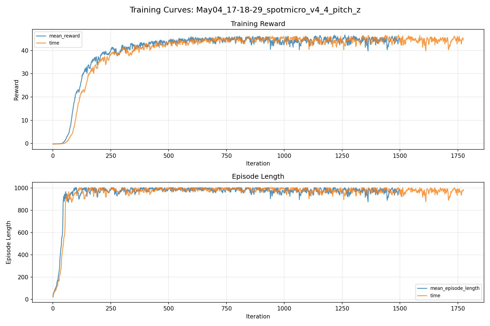
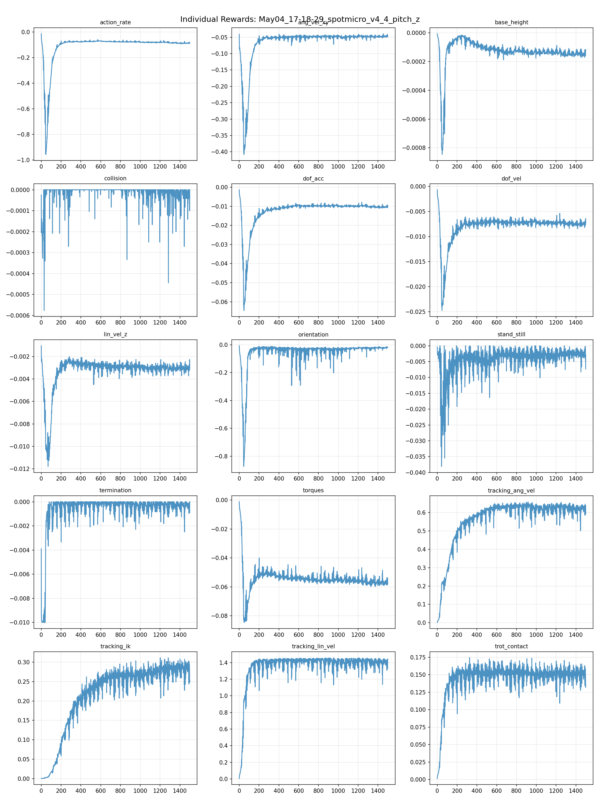
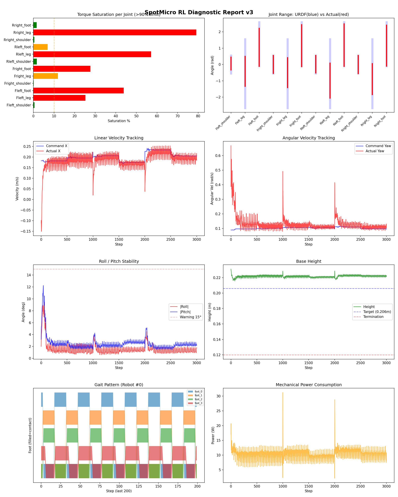
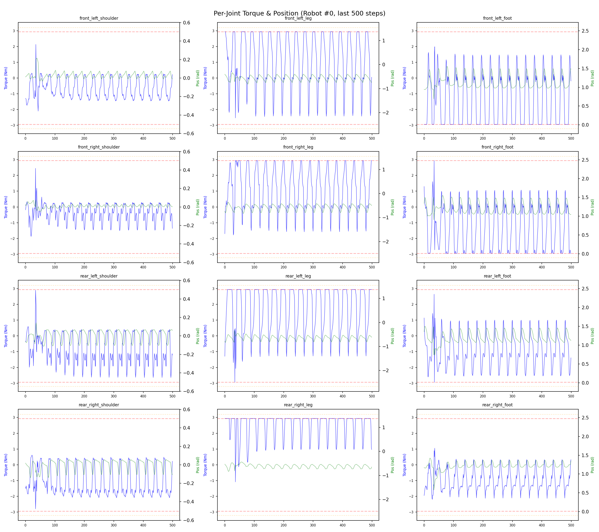
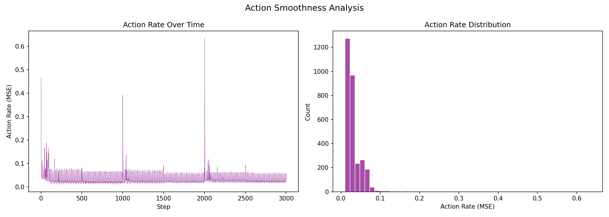

# 실험 039: spotmicro_v4_4_pitch_z

- **날짜:** 2026-05-04 17:50
- **Task:** spotmicro_test
- **Run name:** `spotmicro_v4_4_pitch_z`
- **판정:** ✅ PASS

---

## 실험 목적

V4.4: pitch/roll 에 따라 leg의 z값 보정, 균형 맞춰서 토크포화 감소 시도

---

## 변경점 (이전 커밋 대비)

```diff
diff --git a/ai_training/rl/legged_gym/legged_gym/envs/spotmicro_test/spotmicro_test.py b/ai_training/rl/legged_gym/legged_gym/envs/spotmicro_test/spotmicro_test.py
index bbcf43d..23a08fb 100644
--- a/ai_training/rl/legged_gym/legged_gym/envs/spotmicro_test/spotmicro_test.py
+++ b/ai_training/rl/legged_gym/legged_gym/envs/spotmicro_test/spotmicro_test.py
@@ -23,7 +23,7 @@ class SpotmicroTest(LeggedRobot):
         self.gait_period = 0.6
         self.duty_factor = 0.5
         self.step_height = 0.03
-        self.body_height = 0.195
+        self.body_height = 0.206
 
         self.gait_phase = torch.zeros(self.num_envs, 1, dtype=torch.float, device=self.device)
         self.commands_scale = torch.tensor(
@@ -350,7 +350,25 @@ class SpotmicroTest(LeggedRobot):
     
         return ref_dof_pos
         '''
-    
+
+    def _get_leg_height_targets(self):
+        # body frame에서 world-up normal 추정
+        # projected_gravity는 body frame 기준 gravity direction, 보통 [0, 0, -1] 근처
+        n = -self.projected_gravity  # ground normal/up direction in body frame
+
+        nx = n[:, 0].unsqueeze(1)  # [N, 1]
+        ny = n[:, 1].unsqueeze(1)
+        nz = torch.clamp(n[:, 2].unsqueeze(1), min=0.3)
+
+        leg_x = self.leg_origin_x.unsqueeze(0)  # [1, 4]
+        leg_y = self.leg_origin_y.unsqueeze(0)  # [1, 4]
+
+        # 수평 지면이 body frame에서 기울어져 보이는 것을 보정
+        # flat이면 nx=0, ny=0, nz=1 -> z = -body_height
+        z_stance = (-self.body_height - nx * leg_x - ny * leg_y) / nz
+
+        return z_stance
+        
     def _get_ik_target(self):
         vx = self.commands[:, 0]  # [num_envs]
         vy = self.commands[:, 1]  # 현재는 0이지만 future-proof
@@ -384,7 +402,8 @@ class SpotmicroTest(LeggedRobot):
 
         x = torch.zeros((self.num_envs, 4), device=self.device)
         y = torch.zeros((self.num_envs, 4), device=self.device)
-        z = torch.full((self.num_envs, 4), -self.body_height, device=self.device)
+        z_stance = self._get_leg_height_targets()
+        z = z_stance.clone()
 
         is_stance = phases < self.duty_factor
         is_swing = ~is_stance
@@ -401,7 +420,7 @@ class SpotmicroTest(LeggedRobot):
         y[is_swing] = stride_y[is_swing] * (-0.5 + t_swing[is_swing])
 
         z[is_swing] = (
-            -self.body_height
+            z_stance[is_swing]
             + self.step_height * torch.sin(torch.pi * t_swing[is_swing])
         )
 
diff --git a/ai_training/rl/legged_gym/legged_gym/envs/spotmicro_test/spotmicro_test_config.py b/ai_training/rl/legged_gym/legged_gym/envs/spotmicro_test/spotmicro_test_config.py
index 1039a1d..7262484 100644
--- a/ai_training/rl/legged_gym/legged_gym/envs/spotmicro_test/spotmicro_test_config.py
+++ b/ai_training/rl/legged_gym/legged_gym/envs/spotmicro_test/spotmicro_test_config.py
@@ -66,9 +66,9 @@ class SpotmicroTestCfg(LeggedRobotCfg):
             tracking_ik = 0.5
             stand_still = -0.5
             residual_action = 0.0
-            base_height = 0.0
+            base_h
```

**변경 요약:**
  - self.body_height = 0.195
  + self.body_height = 0.206
  + def _get_leg_height_targets(self):
  + n = -self.projected_gravity  # ground normal/up direction in body frame
  + nx = n[:, 0].unsqueeze(1)  # [N, 1]
  + ny = n[:, 1].unsqueeze(1)
  + nz = torch.clamp(n[:, 2].unsqueeze(1), min=0.3)
  + leg_x = self.leg_origin_x.unsqueeze(0)  # [1, 4]
  + leg_y = self.leg_origin_y.unsqueeze(0)  # [1, 4]
  + z_stance = (-self.body_height - nx * leg_x - ny * leg_y) / nz
  + return z_stance
  - z = torch.full((self.num_envs, 4), -self.body_height, device=self.device)
  + z_stance = self._get_leg_height_targets()
  + z = z_stance.clone()
  - -self.body_height
  + z_stance[is_swing]
  - base_height = 0.0
  + base_height = -0.8
  - base_height_target = 0.195
  + base_height_target = 0.206
  - run_name = 'spotmicro_v4_3_body_height'
  + run_name = 'spotmicro_v4_4_pitch_z'

---

## 현재 Reward Scales

| Reward | Scale |
|--------|-------|
| action_rate | -0.05 |
| ang_vel_xy | -0.4 |
| base_height | -0.8 |
| collision | -1.0 |
| dof_acc | -2.5e-07 |
| dof_vel | -0.0005 |
| lin_vel_z | -2.0 |
| orientation | -4.0 |
| stand_still | -0.5 |
| termination | -10.0 |
| torques | -0.0015 |
| tracking_ang_vel | 1.0 |
| tracking_ik | 0.5 |
| tracking_lin_vel | 1.5 |
| trot_contact | 0.2 |

---

## 진단 결과 (Diagnostic)

### 핵심 지표

- ✅ Timeout: 87.1% (≥80%)
- ✅ 속도오차 X: 0.0372 m/s (<0.08)
- ⚠️ 토크포화: 21.3% (10~40%)
- ✅ 자세: roll 1.6°, pitch 2.5° (안정)
- ✅ 조기종료: 2.7% (<5%)

### 상세 수치

| 지표 | 값 |
|------|-----|
| Timeout% | 87.07482993197279 |
| 조기종료% | 2.7210884353741496 |
| 속도오차 X | 0.037248194217681885 m/s |
| 속도오차 Y | 0.01954568736255169 m/s |
| 각속도오차 | 0.08786923438310623 rad/s |
| 토크포화% | 21.34861666111666 |
| 평균 높이 | 0.22176780316716943 m |
| Roll (평균) | 1.6154558658599854° |
| Pitch (평균) | 2.4823739528656006° |
| Action Rate | 0.03232456371188164 |
| 평균 전력 | 10.152070999145508 W |
| CoT | 2.1679089545628716 |

## Command Mode별 회전 추종 분석

| 모드 | 비율 | 샘플 수 | 평균 abs(cmd_wz) | 평균 abs(actual_wz) | yaw 오차 | 상태 |
|------|------|---------|------------------|---------------------|----------|------|
| 정지 | 2.1% | 4040 | 0.0285 | 0.0762 | 0.0790 | ❌ |
| 직진/저회전 | 65.4% | 125653 | 0.0753 | 0.1118 | 0.0860 | ⚠️ |
| 제자리 회전 | 3.1% | 6007 | 0.1818 | 0.1666 | 0.0908 | ⚠️ |
| 전진+회전 | 22.4% | 43053 | 0.1768 | 0.1810 | 0.0898 | ⚠️ |
| 큰 회전명령 | 0.0% | 0 | N/A | N/A | N/A | N/A |

> 해석 기준: `제자리 회전`만 나쁘면 pure turn 학습/보행 패턴 문제, `큰 회전명령`만 나쁘면 yaw 명령 범위가 현재 토크/보폭 한계보다 큰 문제, `정지`가 나쁘면 stop drift 문제로 보면 됩니다.
        


## 학습 곡선 분석

| 지표 | 값 | 판정 |
|------|-----|------|
| 수렴 iter (90%) | 298 | 빠름 |
| 후반 안정성 (CV) | 0.024 | 안정 |
| 정체 구간 | 없음 | |


## Per-leg 분석

### 발별 접촉/공중 비율

| 발 | 접촉% | 공중% |
|-----|-------|------|
| foot_0 | 56.9% | 43.1% |
| foot_1 | 55.5% | 44.5% |
| foot_2 | 57.4% | 42.6% |
| foot_3 | 67.8% | 32.2% |

### 관절별 토크 포화

| 관절 | 포화% | 최대토크 | 한계 | 상태 |
|------|------|---------|------|------|
| front_left_shoulder | 0.5% | 2.940 | 2.940 | ✅ |
| front_left_leg | 25.3% | 2.940 | 2.940 | ❌ |
| front_left_foot | 43.9% | 2.940 | 2.940 | ❌ |
| front_right_shoulder | 0.1% | 2.940 | 2.940 | ✅ |
| front_right_leg | 11.9% | 2.940 | 2.940 | ⚠️ |
| front_right_foot | 27.7% | 2.940 | 2.940 | ❌ |
| rear_left_shoulder | 1.6% | 2.940 | 2.940 | ✅ |
| rear_left_leg | 57.1% | 2.940 | 2.940 | ❌ |
| rear_left_foot | 6.9% | 2.940 | 2.940 | ⚠️ |
| rear_right_shoulder | 0.5% | 2.940 | 2.940 | ✅ |
| rear_right_leg | 79.1% | 2.940 | 2.940 | ❌ |
| rear_right_foot | 1.6% | 2.940 | 2.940 | ✅ |


## Gait 분석

| 지표 | 값 |
|------|-----|
| Gait 주파수 | 1.67 Hz |
| Gait 주기 | 30 steps |
| 대각 동기화율 | 90.9% |
| L/R 비대칭 | 0.0%p |
| 판정 | ✅ Trot 패턴 / ✅ 대칭 |


## 관절별 상세

| 관절 | 토크포화% | 사용범위% | 편향(rad) | 한계근접% | 상태 |
|------|----------|----------|----------|----------|------|
| front_left_shoulder | 0.5% | 72% | +0.058 | 0.0% | ✅ |
| front_left_leg | 25.3% | 44% | -0.421 | 0.0% | ⚠️ |
| front_left_foot | 43.9% | 86% | +1.054 | 0.1% | ⚠️ |
| front_right_shoulder | 0.1% | 100% | +0.001 | 0.0% | ✅ |
| front_right_leg | 11.9% | 44% | -0.498 | 0.0% | ⚠️ |
| front_right_foot | 27.7% | 96% | +1.155 | 0.1% | ⚠️ |
| rear_left_shoulder | 1.6% | 97% | +0.017 | 0.0% | ✅ |
| rear_left_leg | 57.1% | 51% | -0.987 | 0.0% | ⚠️ |
| rear_left_foot | 6.9% | 97% | +1.189 | 0.1% | ⚠️ |
| rear_right_shoulder | 0.5% | 101% | -0.001 | 0.0% | ✅ |
| rear_right_leg | 79.1% | 45% | -0.896 | 0.0% | ⚠️ |
| rear_right_foot | 1.6% | 93% | +1.153 | 0.1% | ⚠️ |


## 에너지 효율 상세

| 지표 | 값 |
|------|-----|
| 평균 전력 | 10.15 W |
| 피크 전력 | 31.23 W |
| 피크/평균 비율 | 3.1x |
| CoT | 2.17 |

### 관절별 전력 분배

| 관절 | 평균전력(W) | 비율% |
|------|-----------|-------|
| rear_right_leg | 2.206 | 21.7% |
| rear_left_leg | 1.695 | 16.7% |
| front_left_foot | 1.649 | 16.2% |
| front_right_foot | 1.244 | 12.3% |
| front_left_leg | 0.786 | 7.7% |
| front_right_leg | 0.765 | 7.5% |
| rear_left_foot | 0.558 | 5.5% |
| rear_right_foot | 0.535 | 5.3% |
| rear_right_shoulder | 0.280 | 2.8% |
| rear_left_shoulder | 0.189 | 1.9% |
| front_left_shoulder | 0.132 | 1.3% |
| front_right_shoulder | 0.112 | 1.1% |


## 이전 실험 대비 비교

| 지표 | 이전 (exp038) | 현재 (exp039) | 변화 |
|------|-------|-------|------|
| Timeout% | 49.6% | 87.1% | ✅ ↑ 37.4624% |
| 속도오차 X | 0.0386 | 0.0372 | ✅ ↓ 0.0013m/s |
| 토크포화 | 25.0% | 21.3% | ✅ ↓ 3.6329% |
| Roll | 1.9° | 1.6° | ✅ ↓ 0.2445° |
| Pitch | 2.3° | 2.5° | ⚠️ ↑ 0.1643° |
| 평균 전력 | 8.2738W | 10.1521W | ⚠️ ↑ 1.8783W |


## Tensorboard 학습 곡선 요약

| 스칼라 | 최종값 | 최대 | 최소 | 후반10% 평균 |
|--------|--------|------|------|-------------|
| rew_action_rate | -0.0893 | -0.0147 | -0.9573 | -0.0879 |
| rew_ang_vel_xy | -0.0485 | -0.0395 | -0.4081 | -0.0477 |
| rew_base_height | -0.0001 | -0.0000 | -0.0008 | -0.0001 |
| rew_collision | 0.0000 | 0.0000 | -0.0006 | -0.0000 |
| rew_dof_acc | -0.0103 | -0.0014 | -0.0645 | -0.0104 |
| rew_dof_vel | -0.0073 | -0.0007 | -0.0247 | -0.0074 |
| rew_lin_vel_z | -0.0031 | -0.0010 | -0.0118 | -0.0030 |
| rew_orientation | -0.0221 | -0.0077 | -0.8737 | -0.0223 |
| rew_stand_still | -0.0073 | 0.0000 | -0.0381 | -0.0026 |
| rew_termination | 0.0000 | 0.0000 | -0.0100 | -0.0003 |
| rew_torques | -0.0582 | -0.0012 | -0.0846 | -0.0569 |
| rew_tracking_ang_vel | 0.6373 | 0.6583 | 0.0016 | 0.6189 |
| rew_tracking_ik | 0.2533 | 0.3112 | 0.0005 | 0.2822 |
| rew_tracking_lin_vel | 1.4430 | 1.4577 | 0.0058 | 1.4011 |
| rew_trot_contact | 0.1348 | 0.1743 | 0.0015 | 0.1506 |
| learning_rate | 0.0003 | 0.0100 | 0.0000 | 0.0003 |
| surrogate | -0.0023 | 0.0068 | -0.0100 | -0.0029 |
| value_function | 0.0170 | 0.0896 | 0.0001 | 0.0083 |
| collection time | 0.8934 | 1.2391 | 0.8296 | 0.8978 |
| learning_time | 0.2880 | 0.3394 | 0.2744 | 0.2874 |
| total_fps | 83208.0000 | 88515.0000 | 63618.0000 | 82974.1133 |
| mean_noise_std | 0.2300 | 1.0151 | 0.2084 | 0.2333 |
| mean_episode_length | 983.1400 | 1002.0000 | 23.2200 | 969.2651 |
| time | 983.1400 | 1002.0000 | 23.2200 | 969.2651 |
| mean_reward | 44.4575 | 46.6599 | -0.1799 | 44.2520 |
| time | 44.4575 | 46.6599 | -0.1799 | 44.2520 |

총 학습 iteration: 1499


---

## 그래프

### Tensorboard 학습 곡선



### Diagnostic 결과





---

## 결론 및 다음 실험 방향

**자동 판정:** ✅ PASS

대부분 기준을 통과했으나 일부 항목이 보통 수준입니다.
  - ⚠️ 토크포화: 21.3% (10~40%)

> 💡 위 결론은 자동 생성되었습니다. 필요시 수정하세요.

---

## 메모

_(추가 메모가 있으면 여기에 작성)_

