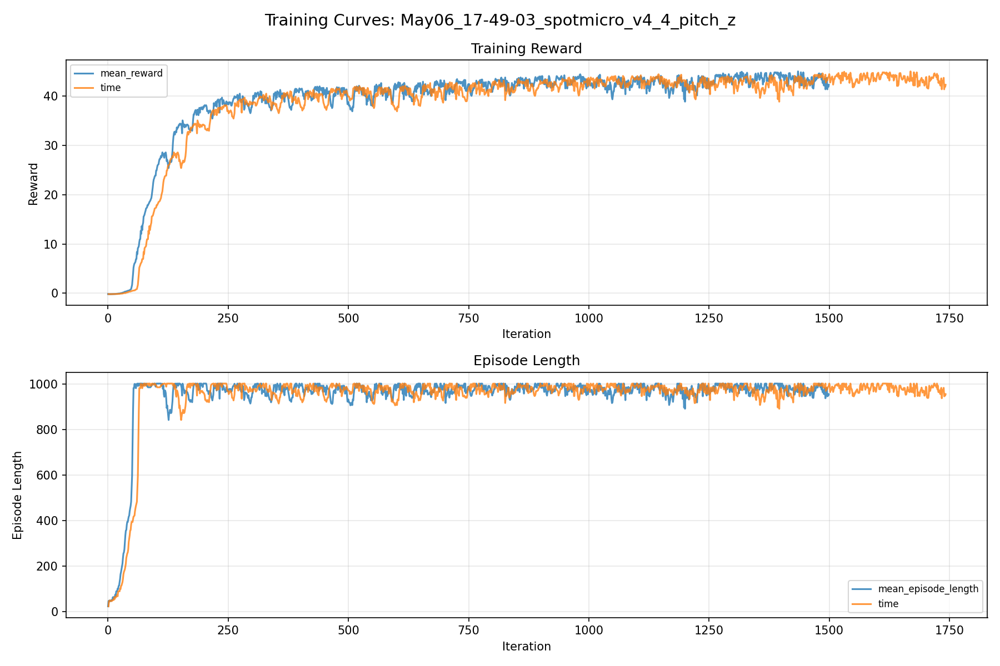
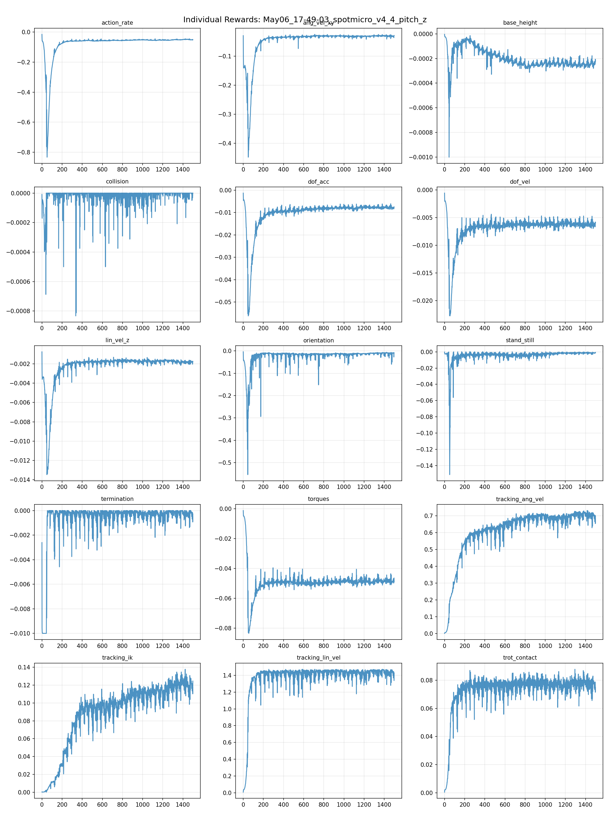
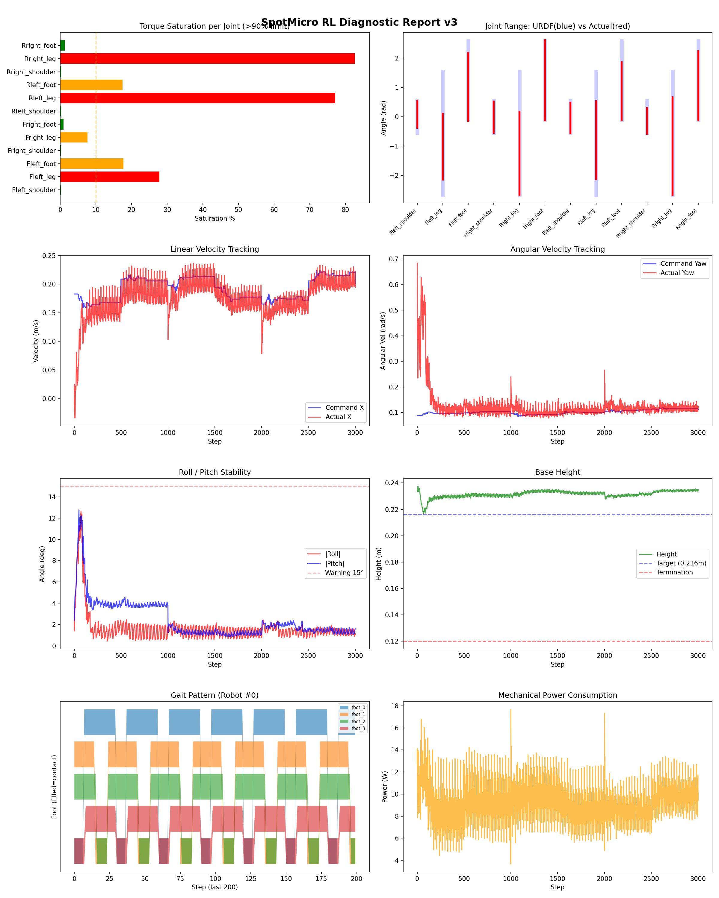
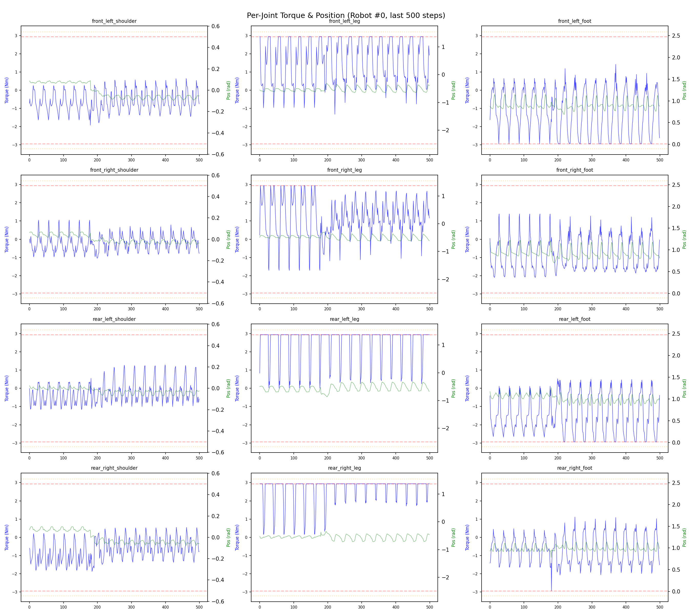
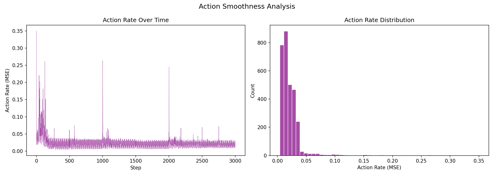

# 실험 040: spotmicro_v4_4_pitch_z

- **날짜:** 2026-05-06 18:20
- **Task:** spotmicro_test
- **Run name:** `spotmicro_v4_4_pitch_z`
- **판정:** ❌ FAIL (일부 기준 미달)

---

## 실험 목적

V4.5: IK를 좀 덜 공격적이게 변경, 추종도 낮춰서 토크 포화 해결 가능한지 확인

---

## 변경점 (이전 커밋 대비)

```diff
diff --git a/ai_training/rl/legged_gym/legged_gym/envs/spotmicro_test/spotmicro_test.py b/ai_training/rl/legged_gym/legged_gym/envs/spotmicro_test/spotmicro_test.py
index 5468063..fc3373a 100644
--- a/ai_training/rl/legged_gym/legged_gym/envs/spotmicro_test/spotmicro_test.py
+++ b/ai_training/rl/legged_gym/legged_gym/envs/spotmicro_test/spotmicro_test.py
@@ -21,9 +21,10 @@ class SpotmicroTest(LeggedRobot):
         self.robot_width = 0.15 
 
         self.gait_period = 0.6
-        self.duty_factor = 0.5
-        self.step_height = 0.03
-        self.body_height = 0.206
+        self.duty_factor = 0.75
+        self.step_height = 0.02
+        self.body_height = 0.216
+        self.stride_scale = 0.3
 
         self.gait_phase = torch.zeros(self.num_envs, 1, dtype=torch.float, device=self.device)
         self.commands_scale = torch.tensor(
@@ -80,7 +81,7 @@ class SpotmicroTest(LeggedRobot):
         zero_actions = torch.zeros_like(actions)
         return super().step(zero_actions)
    
-    '''    
+    '''
     def step(self, actions):
         """서보 응답 지연을 substep 단위로 적용
         
@@ -131,8 +132,9 @@ class SpotmicroTest(LeggedRobot):
         super().post_physics_step()
               
     def _reset_dofs(self, env_ids):
+        #self.dof_pos[env_ids] = self.default_dof_pos
         self.dof_pos[env_ids] = self.default_dof_pos * torch_rand_float(
-            0.5, 1.5, (len(env_ids), self.num_dof), device=self.device)
+            0.6, 1.4, (len(env_ids), self.num_dof), device=self.device)
         self.dof_vel[env_ids] = 0.
 
         env_ids_int32 = env_ids.to(dtype=torch.int32)
@@ -157,8 +159,9 @@ class SpotmicroTest(LeggedRobot):
         """base 속도를 0으로 리셋"""
         self.root_states[env_ids] = self.base_init_state
         self.root_states[env_ids, :3] += self.env_origins[env_ids]
+        #self.root_states[env_ids, 7:13] = 0.
         self.root_states[env_ids, 7:13] = torch_rand_float(
-            -0.3, 0.3, (len(env_ids), 6), device=self.device)
+            -0.2, 0.2, (len(env_ids), 6), device=self.device)
 
         env_ids_int32 = env_ids.to(dtype=torch.int32)
         self.gym.set_actor_root_state_tensor_indexed(
@@ -397,8 +400,8 @@ class SpotmicroTest(LeggedRobot):
 
         stance_time = self.gait_period * self.duty_factor
 
-        stride_x = foot_vx * stance_time
-        stride_y = foot_vy * stance_time
+        stride_x = foot_vx * stance_time * self.stride_scale
+        stride_y = foot_vy * stance_time * self.stride_scale
 
         # ------------------------------------------------------------
         # 2. phase 생성
@@ -409,6 +412,11 @@ class SpotmicroTest(LeggedRobot):
         x = torch.zeros((self.num_envs, 4), device=self.device)
         y = torch.zeros((self.num_envs, 4), device=self.device)
         z_stance = self._get_leg_height_targets()
+        #z_stance = torch.full(
+        #    (self.num_envs, 4),
+        #    -self.body_height,
+        #    device=self.device,
+        #)
         z = z_stance.clo
```

**변경 요약:**
  - self.duty_factor = 0.5
  - self.step_height = 0.03
  - self.body_height = 0.206
  + self.duty_factor = 0.75
  + self.step_height = 0.02
  + self.body_height = 0.216
  + self.stride_scale = 0.3
  - '''
  + '''
  - 0.5, 1.5, (len(env_ids), self.num_dof), device=self.device)
  + 0.6, 1.4, (len(env_ids), self.num_dof), device=self.device)
  - -0.3, 0.3, (len(env_ids), 6), device=self.device)
  + -0.2, 0.2, (len(env_ids), 6), device=self.device)
  - stride_x = foot_vx * stance_time
  - stride_y = foot_vy * stance_time
  + stride_x = foot_vx * stance_time * self.stride_scale
  + stride_y = foot_vy * stance_time * self.stride_scale
  - trot_contact = 0.2
  - tracking_ik = 0.5
  + trot_contact = 0.1
  + tracking_ik = 0.25
  - base_height_target = 0.206
  + base_height_target = 0.216
  - add_noise = True
  + add_noise = True

---

## 현재 Reward Scales

| Reward | Scale |
|--------|-------|
| action_rate | -0.05 |
| ang_vel_xy | -0.4 |
| base_height | -0.8 |
| collision | -1.0 |
| dof_acc | -2.5e-07 |
| dof_vel | -0.0005 |
| lin_vel_z | -2.0 |
| orientation | -4.0 |
| stand_still | -0.5 |
| termination | -10.0 |
| torques | -0.0015 |
| tracking_ang_vel | 1.0 |
| tracking_ik | 0.25 |
| tracking_lin_vel | 1.5 |
| trot_contact | 0.1 |

---

## 진단 결과 (Diagnostic)

### 핵심 지표

- ⚠️ Timeout: 74.9% (60~80%, 보통)
- ✅ 속도오차 X: 0.0346 m/s (<0.08)
- ⚠️ 토크포화: 19.4% (10~40%)
- ✅ 자세: roll 1.7°, pitch 2.5° (안정)
- ✅ 조기종료: 4.1% (<5%)

### 상세 수치

| 지표 | 값 |
|------|-----|
| Timeout% | 74.85380116959064 |
| 조기종료% | 4.093567251461988 |
| 속도오차 X | 0.03464725986123085 m/s |
| 속도오차 Y | 0.018982363864779472 m/s |
| 각속도오차 | 0.0767216607928276 rad/s |
| 토크포화% | 19.444531163281162 |
| 평균 높이 | 0.23164309298261737 m |
| Roll (평균) | 1.65479576587677° |
| Pitch (평균) | 2.466804265975952° |
| Action Rate | 0.020864617079496384 |
| 평균 전력 | 8.876529693603516 W |
| CoT | 2.0186113617396773 |

## Command Mode별 회전 추종 분석

| 모드 | 비율 | 샘플 수 | 평균 abs(cmd_wz) | 평균 abs(actual_wz) | yaw 오차 | 상태 |
|------|------|---------|------------------|---------------------|----------|------|
| 정지 | 2.6% | 5003 | 0.0297 | 0.0764 | 0.0735 | ❌ |
| 직진/저회전 | 64.6% | 124224 | 0.0745 | 0.1040 | 0.0753 | ✅ |
| 제자리 회전 | 3.6% | 7014 | 0.1799 | 0.1914 | 0.0783 | ✅ |
| 전진+회전 | 22.8% | 43729 | 0.1762 | 0.1773 | 0.0794 | ✅ |
| 큰 회전명령 | 0.0% | 0 | N/A | N/A | N/A | N/A |

> 해석 기준: `제자리 회전`만 나쁘면 pure turn 학습/보행 패턴 문제, `큰 회전명령`만 나쁘면 yaw 명령 범위가 현재 토크/보폭 한계보다 큰 문제, `정지`가 나쁘면 stop drift 문제로 보면 됩니다.
        


## 학습 곡선 분석

| 지표 | 값 | 판정 |
|------|-----|------|
| 수렴 iter (90%) | 306 | 빠름 |
| 후반 안정성 (CV) | 0.024 | 안정 |
| 정체 구간 | 없음 | |


## Per-leg 분석

### 발별 접촉/공중 비율

| 발 | 접촉% | 공중% |
|-----|-------|------|
| foot_0 | 72.6% | 27.4% |
| foot_1 | 73.4% | 26.6% |
| foot_2 | 70.1% | 29.9% |
| foot_3 | 72.0% | 28.0% |

### 관절별 토크 포화

| 관절 | 포화% | 최대토크 | 한계 | 상태 |
|------|------|---------|------|------|
| front_left_shoulder | 0.1% | 2.940 | 2.940 | ✅ |
| front_left_leg | 27.8% | 2.940 | 2.940 | ❌ |
| front_left_foot | 17.7% | 2.940 | 2.940 | ⚠️ |
| front_right_shoulder | 0.1% | 2.940 | 2.940 | ✅ |
| front_right_leg | 7.6% | 2.940 | 2.940 | ⚠️ |
| front_right_foot | 0.9% | 2.940 | 2.940 | ✅ |
| rear_left_shoulder | 0.2% | 2.940 | 2.940 | ✅ |
| rear_left_leg | 77.2% | 2.940 | 2.940 | ❌ |
| rear_left_foot | 17.5% | 2.940 | 2.940 | ⚠️ |
| rear_right_shoulder | 0.2% | 2.940 | 2.940 | ✅ |
| rear_right_leg | 82.6% | 2.940 | 2.940 | ❌ |
| rear_right_foot | 1.3% | 2.940 | 2.940 | ✅ |


## Gait 분석

| 지표 | 값 |
|------|-----|
| Gait 주파수 | 1.67 Hz |
| Gait 주기 | 30 steps |
| 대각 동기화율 | 86.9% |
| L/R 비대칭 | 0.0%p |
| 판정 | ✅ Trot 패턴 / ✅ 대칭 |


## 관절별 상세

| 관절 | 토크포화% | 사용범위% | 편향(rad) | 한계근접% | 상태 |
|------|----------|----------|----------|----------|------|
| front_left_shoulder | 0.1% | 84% | +0.087 | 0.7% | ✅ |
| front_left_leg | 27.8% | 53% | -1.020 | 0.0% | ⚠️ |
| front_left_foot | 17.7% | 86% | +1.023 | 1.3% | ⚠️ |
| front_right_shoulder | 0.1% | 98% | -0.012 | 0.2% | ✅ |
| front_right_leg | 7.6% | 67% | -1.248 | 0.0% | ⚠️ |
| front_right_foot | 0.9% | 101% | +1.249 | 0.6% | ⚠️ |
| rear_left_shoulder | 0.2% | 95% | -0.033 | 0.2% | ✅ |
| rear_left_leg | 77.2% | 63% | -0.789 | 0.0% | ⚠️ |
| rear_left_foot | 17.5% | 73% | +0.879 | 1.0% | ⚠️ |
| rear_right_shoulder | 0.2% | 80% | -0.137 | 0.2% | ⚠️ |
| rear_right_leg | 82.6% | 79% | -1.002 | 0.0% | ⚠️ |
| rear_right_foot | 1.3% | 87% | +1.065 | 0.7% | ⚠️ |


## 에너지 효율 상세

| 지표 | 값 |
|------|-----|
| 평균 전력 | 8.88 W |
| 피크 전력 | 17.69 W |
| 피크/평균 비율 | 2.0x |
| CoT | 2.02 |

### 관절별 전력 분배

| 관절 | 평균전력(W) | 비율% |
|------|-----------|-------|
| rear_right_leg | 1.820 | 20.5% |
| front_left_foot | 1.291 | 14.5% |
| rear_left_foot | 1.274 | 14.3% |
| rear_left_leg | 1.212 | 13.7% |
| front_right_leg | 0.832 | 9.4% |
| front_left_leg | 0.772 | 8.7% |
| front_right_foot | 0.719 | 8.1% |
| rear_right_foot | 0.632 | 7.1% |
| rear_right_shoulder | 0.107 | 1.2% |
| rear_left_shoulder | 0.087 | 1.0% |
| front_right_shoulder | 0.066 | 0.7% |
| front_left_shoulder | 0.065 | 0.7% |


## 이전 실험 대비 비교

| 지표 | 이전 (exp039) | 현재 (exp040) | 변화 |
|------|-------|-------|------|
| Timeout% | 87.1% | 74.9% | ⚠️ ↓ 12.2210% |
| 속도오차 X | 0.0372 | 0.0346 | ✅ ↓ 0.0026m/s |
| 토크포화 | 21.3% | 19.4% | ✅ ↓ 1.9041% |
| Roll | 1.6° | 1.7° | ⚠️ ↑ 0.0393° |
| Pitch | 2.5° | 2.5° | ✅ ↓ 0.0156° |
| 평균 전력 | 10.1521W | 8.8765W | ✅ ↓ 1.2755W |


## Tensorboard 학습 곡선 요약

| 스칼라 | 최종값 | 최대 | 최소 | 후반10% 평균 |
|--------|--------|------|------|-------------|
| rew_action_rate | -0.0511 | -0.0148 | -0.8338 | -0.0497 |
| rew_ang_vel_xy | -0.0284 | -0.0245 | -0.4481 | -0.0299 |
| rew_base_height | -0.0002 | -0.0000 | -0.0010 | -0.0002 |
| rew_collision | 0.0000 | 0.0000 | -0.0008 | -0.0000 |
| rew_dof_acc | -0.0075 | -0.0013 | -0.0562 | -0.0077 |
| rew_dof_vel | -0.0059 | -0.0006 | -0.0227 | -0.0062 |
| rew_lin_vel_z | -0.0018 | -0.0008 | -0.0135 | -0.0018 |
| rew_orientation | -0.0089 | -0.0041 | -0.5540 | -0.0112 |
| rew_stand_still | -0.0009 | 0.0000 | -0.1512 | -0.0013 |
| rew_termination | -0.0003 | 0.0000 | -0.0100 | -0.0002 |
| rew_torques | -0.0490 | -0.0011 | -0.0836 | -0.0485 |
| rew_tracking_ang_vel | 0.6987 | 0.7313 | 0.0019 | 0.7039 |
| rew_tracking_ik | 0.1246 | 0.1377 | 0.0002 | 0.1210 |
| rew_tracking_lin_vel | 1.4276 | 1.4714 | 0.0089 | 1.4323 |
| rew_trot_contact | 0.0749 | 0.0878 | 0.0005 | 0.0776 |
| learning_rate | 0.0003 | 0.0100 | 0.0000 | 0.0002 |
| surrogate | -0.0022 | 0.0057 | -0.0117 | -0.0016 |
| value_function | 0.0016 | 0.1074 | 0.0003 | 0.0036 |
| collection time | 0.8764 | 1.0710 | 0.8052 | 0.8715 |
| learning_time | 0.2890 | 0.3529 | 0.2707 | 0.2901 |
| total_fps | 84352.0000 | 89927.0000 | 71919.0000 | 84697.4267 |
| mean_noise_std | 0.1742 | 1.0215 | 0.1638 | 0.1697 |
| mean_episode_length | 955.3400 | 1002.0000 | 22.8800 | 979.0177 |
| time | 955.3400 | 1002.0000 | 22.8800 | 979.0177 |
| mean_reward | 42.3029 | 45.0303 | -0.1805 | 43.5730 |
| time | 42.3029 | 45.0303 | -0.1805 | 43.5730 |

총 학습 iteration: 1499


---

## 그래프

### Tensorboard 학습 곡선



### Diagnostic 결과





---

## 결론 및 다음 실험 방향

**자동 판정:** ❌ FAIL (일부 기준 미달)

대부분 기준을 통과했으나 일부 항목이 보통 수준입니다.
  - ⚠️ Timeout: 74.9% (60~80%, 보통)
  - ⚠️ 토크포화: 19.4% (10~40%)

> 💡 위 결론은 자동 생성되었습니다. 필요시 수정하세요.

---

## 메모

_(추가 메모가 있으면 여기에 작성)_

