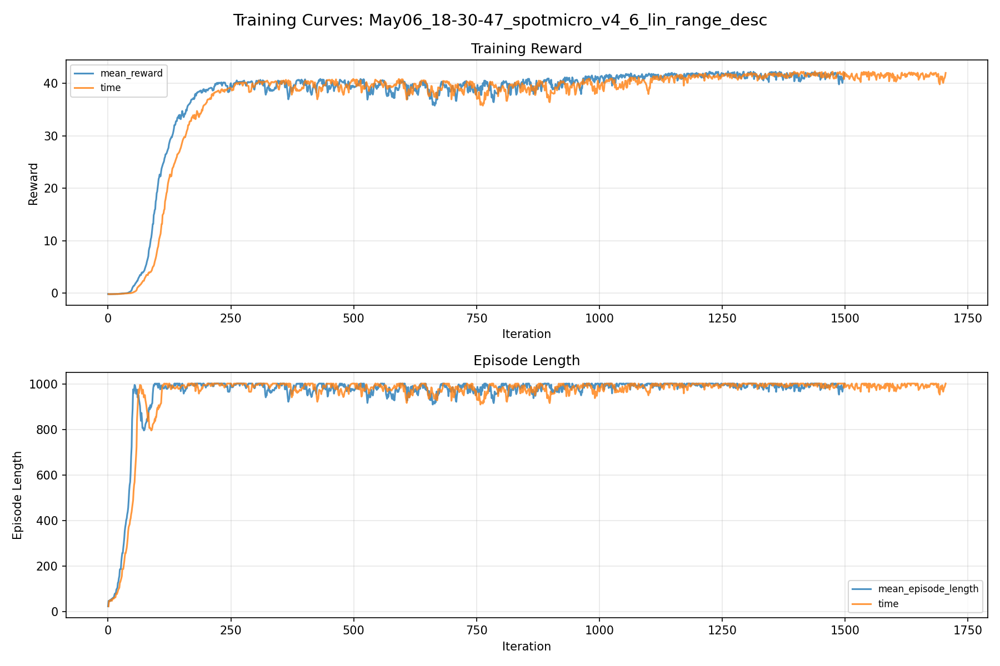
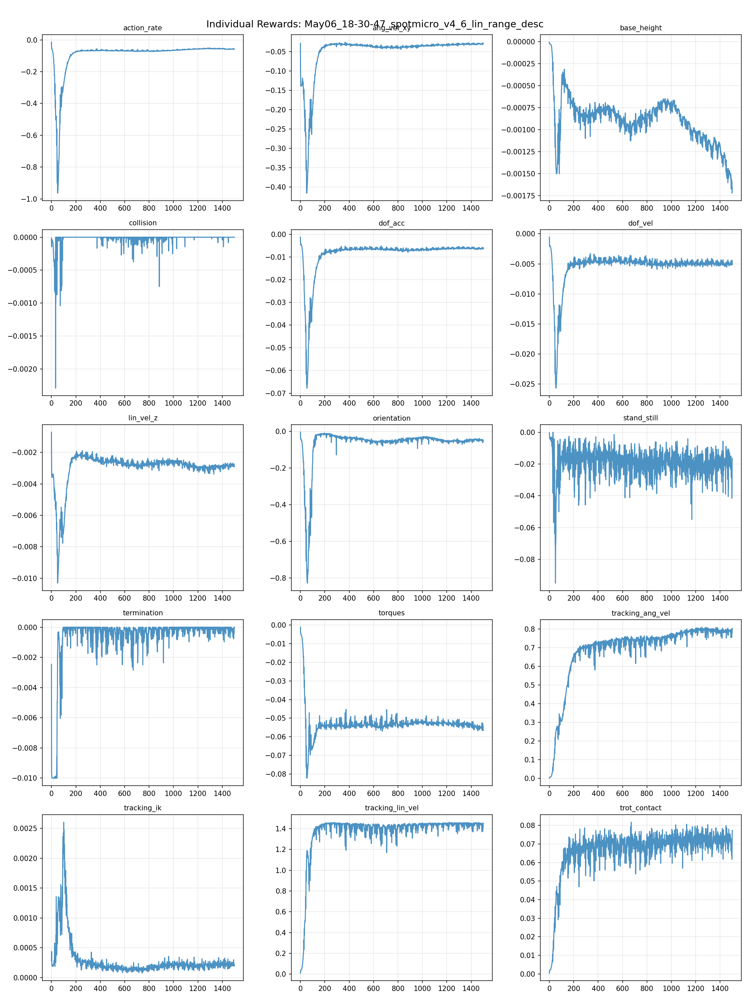
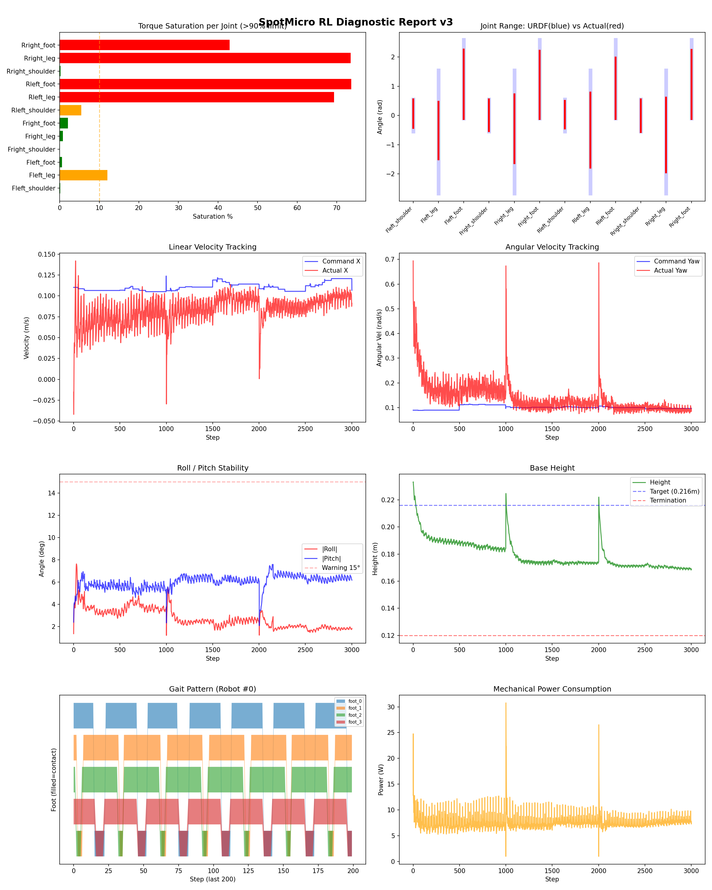
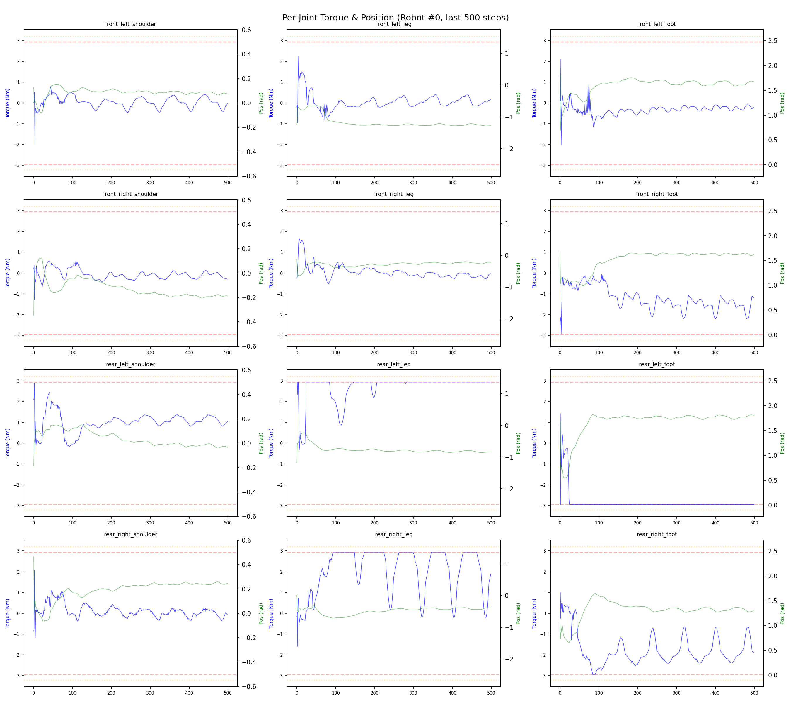
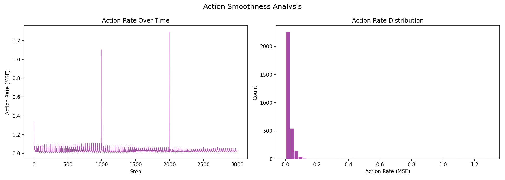

# 실험 041: spotmicro_v4_6_lin_range_desc

- **날짜:** 2026-05-06 19:01
- **Task:** spotmicro_test
- **Run name:** `spotmicro_v4_6_lin_range_desc`
- **판정:** ✅ PASS

---

## 실험 목적

V4.6: 속도 범위 감소시켜 토크에 영향 있는지 확인

---

## 변경점 (이전 커밋 대비)

```diff
diff --git a/ai_training/rl/legged_gym/legged_gym/envs/spotmicro_test/spotmicro_test_config.py b/ai_training/rl/legged_gym/legged_gym/envs/spotmicro_test/spotmicro_test_config.py
index 32bb8bc..ce094d6 100644
--- a/ai_training/rl/legged_gym/legged_gym/envs/spotmicro_test/spotmicro_test_config.py
+++ b/ai_training/rl/legged_gym/legged_gym/envs/spotmicro_test/spotmicro_test_config.py
@@ -98,7 +98,7 @@ class SpotmicroTestCfg(LeggedRobotCfg):
         resampling_time = 10.0
         heading_command = False
         class ranges:
-            lin_vel_x = [0.0, 0.4]
+            lin_vel_x = [0.0, 0.25]
             lin_vel_y = [0.0, 0.0]
             ang_vel_yaw = [-0.2, 0.2]
             heading = [-3.14, 3.14]
@@ -121,7 +121,7 @@ class SpotmicroTestCfgPPO(LeggedRobotCfgPPO):
         entropy_coef = 0.01
 
     class runner(LeggedRobotCfgPPO.runner):
-        run_name = 'spotmicro_v4_4_pitch_z'
+        run_name = 'spotmicro_v4_6_lin_range_desc'
         experiment_name = 'spotmicro_test'
         max_iterations = 1500
         save_interval = 100
```

**변경 요약:**
  - lin_vel_x = [0.0, 0.4]
  + lin_vel_x = [0.0, 0.25]
  - run_name = 'spotmicro_v4_4_pitch_z'
  + run_name = 'spotmicro_v4_6_lin_range_desc'

---

## 현재 Reward Scales

| Reward | Scale |
|--------|-------|
| action_rate | -0.05 |
| ang_vel_xy | -0.4 |
| base_height | -0.8 |
| collision | -1.0 |
| dof_acc | -2.5e-07 |
| dof_vel | -0.0005 |
| lin_vel_z | -2.0 |
| orientation | -4.0 |
| stand_still | -0.5 |
| termination | -10.0 |
| torques | -0.0015 |
| tracking_ang_vel | 1.0 |
| tracking_ik | 0.25 |
| tracking_lin_vel | 1.5 |
| trot_contact | 0.1 |

---

## 진단 결과 (Diagnostic)

### 핵심 지표

- ✅ Timeout: 92.1% (≥80%)
- ✅ 속도오차 X: 0.0423 m/s (<0.08)
- ⚠️ 토크포화: 23.4% (10~40%)
- ✅ 자세: roll 2.8°, pitch 6.0° (안정)
- ✅ 조기종료: 1.4% (<5%)

### 상세 수치

| 지표 | 값 |
|------|-----|
| Timeout% | 92.08633093525181 |
| 조기종료% | 1.4388489208633095 |
| 속도오차 X | 0.04228400066494942 m/s |
| 속도오차 Y | 0.03105980157852173 m/s |
| 각속도오차 | 0.10241620242595673 rad/s |
| 토크포화% | 23.39717574092574 |
| 평균 높이 | 0.17942518166530302 m |
| Roll (평균) | 2.7523224353790283° |
| Pitch (평균) | 6.0107879638671875° |
| Action Rate | 0.02822934463620186 |
| 평균 전력 | 7.555883407592773 W |
| CoT | 3.539122743206652 |

## Command Mode별 회전 추종 분석

| 모드 | 비율 | 샘플 수 | 평균 abs(cmd_wz) | 평균 abs(actual_wz) | yaw 오차 | 상태 |
|------|------|---------|------------------|---------------------|----------|------|
| 정지 | 4.2% | 8016 | 0.0276 | 0.0711 | 0.0753 | ❌ |
| 직진/저회전 | 56.8% | 109205 | 0.0742 | 0.1203 | 0.0927 | ⚠️ |
| 제자리 회전 | 4.5% | 8657 | 0.1684 | 0.1877 | 0.1463 | ⚠️ |
| 전진+회전 | 20.2% | 38852 | 0.1770 | 0.1880 | 0.0998 | ⚠️ |
| 큰 회전명령 | 0.0% | 0 | N/A | N/A | N/A | N/A |

> 해석 기준: `제자리 회전`만 나쁘면 pure turn 학습/보행 패턴 문제, `큰 회전명령`만 나쁘면 yaw 명령 범위가 현재 토크/보폭 한계보다 큰 문제, `정지`가 나쁘면 stop drift 문제로 보면 됩니다.
        


## 학습 곡선 분석

| 지표 | 값 | 판정 |
|------|-----|------|
| 수렴 iter (90%) | 181 | 빠름 |
| 후반 안정성 (CV) | 0.025 | 안정 |
| 정체 구간 | 없음 | |


## Per-leg 분석

### 발별 접촉/공중 비율

| 발 | 접촉% | 공중% |
|-----|-------|------|
| foot_0 | 68.4% | 31.6% |
| foot_1 | 86.9% | 13.1% |
| foot_2 | 86.6% | 13.4% |
| foot_3 | 82.9% | 17.1% |

### 관절별 토크 포화

| 관절 | 포화% | 최대토크 | 한계 | 상태 |
|------|------|---------|------|------|
| front_left_shoulder | 0.1% | 2.940 | 2.940 | ✅ |
| front_left_leg | 12.1% | 2.940 | 2.940 | ⚠️ |
| front_left_foot | 0.6% | 2.940 | 2.940 | ✅ |
| front_right_shoulder | 0.1% | 2.940 | 2.940 | ✅ |
| front_right_leg | 0.8% | 2.940 | 2.940 | ✅ |
| front_right_foot | 2.1% | 2.940 | 2.940 | ✅ |
| rear_left_shoulder | 5.4% | 2.940 | 2.940 | ⚠️ |
| rear_left_leg | 69.3% | 2.940 | 2.940 | ❌ |
| rear_left_foot | 73.7% | 2.940 | 2.940 | ❌ |
| rear_right_shoulder | 0.2% | 2.940 | 2.940 | ✅ |
| rear_right_leg | 73.5% | 2.940 | 2.940 | ❌ |
| rear_right_foot | 42.9% | 2.940 | 2.940 | ❌ |


## Gait 분석

| 지표 | 값 |
|------|-----|
| Gait 주파수 | 0.02 Hz |
| Gait 주기 | 3003 steps |
| 대각 동기화율 | 78.2% |
| L/R 비대칭 | 0.0%p |
| 판정 | ✅ Trot 패턴 / ✅ 대칭 |


## 관절별 상세

| 관절 | 토크포화% | 사용범위% | 편향(rad) | 한계근접% | 상태 |
|------|----------|----------|----------|----------|------|
| front_left_shoulder | 0.1% | 88% | +0.065 | 0.1% | ✅ |
| front_left_leg | 12.1% | 47% | -0.514 | 0.0% | ⚠️ |
| front_left_foot | 0.6% | 88% | +1.070 | 0.1% | ⚠️ |
| front_right_shoulder | 0.1% | 99% | +0.010 | 4.3% | ✅ |
| front_right_leg | 0.8% | 56% | -0.452 | 0.0% | ⚠️ |
| front_right_foot | 2.1% | 87% | +1.050 | 0.2% | ⚠️ |
| rear_left_shoulder | 5.4% | 86% | +0.031 | 0.0% | ✅ |
| rear_left_leg | 69.3% | 61% | -0.499 | 0.0% | ⚠️ |
| rear_left_foot | 73.7% | 78% | +0.933 | 7.1% | ⚠️ |
| rear_right_shoulder | 0.2% | 102% | -0.008 | 10.4% | ⚠️ |
| rear_right_leg | 73.5% | 61% | -0.671 | 0.0% | ⚠️ |
| rear_right_foot | 42.9% | 88% | +1.065 | 0.5% | ⚠️ |


## 에너지 효율 상세

| 지표 | 값 |
|------|-----|
| 평균 전력 | 7.56 W |
| 피크 전력 | 30.76 W |
| 피크/평균 비율 | 4.1x |
| CoT | 3.54 |

### 관절별 전력 분배

| 관절 | 평균전력(W) | 비율% |
|------|-----------|-------|
| rear_left_foot | 1.671 | 22.1% |
| rear_right_leg | 1.559 | 20.6% |
| front_right_foot | 0.864 | 11.4% |
| rear_right_foot | 0.763 | 10.1% |
| front_right_leg | 0.707 | 9.4% |
| rear_left_leg | 0.697 | 9.2% |
| front_left_leg | 0.395 | 5.2% |
| front_left_foot | 0.355 | 4.7% |
| rear_left_shoulder | 0.216 | 2.9% |
| rear_right_shoulder | 0.145 | 1.9% |
| front_left_shoulder | 0.113 | 1.5% |
| front_right_shoulder | 0.071 | 0.9% |


## 이전 실험 대비 비교

| 지표 | 이전 (exp040) | 현재 (exp041) | 변화 |
|------|-------|-------|------|
| Timeout% | 74.9% | 92.1% | ✅ ↑ 17.2325% |
| 속도오차 X | 0.0346 | 0.0423 | ⚠️ ↑ 0.0076m/s |
| 토크포화 | 19.4% | 23.4% | ⚠️ ↑ 3.9526% |
| Roll | 1.7° | 2.8° | ⚠️ ↑ 1.0975° |
| Pitch | 2.5° | 6.0° | ⚠️ ↑ 3.5440° |
| 평균 전력 | 8.8765W | 7.5559W | ✅ ↓ 1.3206W |


## Tensorboard 학습 곡선 요약

| 스칼라 | 최종값 | 최대 | 최소 | 후반10% 평균 |
|--------|--------|------|------|-------------|
| rew_action_rate | -0.0596 | -0.0148 | -0.9633 | -0.0569 |
| rew_ang_vel_xy | -0.0295 | -0.0260 | -0.4154 | -0.0305 |
| rew_base_height | -0.0017 | -0.0000 | -0.0017 | -0.0013 |
| rew_collision | 0.0000 | 0.0000 | -0.0023 | -0.0000 |
| rew_dof_acc | -0.0064 | -0.0013 | -0.0678 | -0.0062 |
| rew_dof_vel | -0.0051 | -0.0006 | -0.0257 | -0.0050 |
| rew_lin_vel_z | -0.0029 | -0.0007 | -0.0103 | -0.0029 |
| rew_orientation | -0.0511 | -0.0040 | -0.8270 | -0.0472 |
| rew_stand_still | -0.0163 | 0.0000 | -0.0949 | -0.0201 |
| rew_termination | 0.0000 | 0.0000 | -0.0100 | -0.0002 |
| rew_torques | -0.0566 | -0.0011 | -0.0822 | -0.0544 |
| rew_tracking_ang_vel | 0.8010 | 0.8096 | 0.0018 | 0.7879 |
| rew_tracking_ik | 0.0002 | 0.0026 | 0.0001 | 0.0002 |
| rew_tracking_lin_vel | 1.4496 | 1.4627 | 0.0096 | 1.4391 |
| rew_trot_contact | 0.0773 | 0.0817 | 0.0005 | 0.0722 |
| learning_rate | 0.0001 | 0.0100 | 0.0000 | 0.0001 |
| surrogate | -0.0014 | 0.0119 | -0.0100 | -0.0003 |
| value_function | 0.0027 | 0.0311 | 0.0001 | 0.0033 |
| collection time | 0.8356 | 1.0095 | 0.7979 | 0.8344 |
| learning_time | 0.2887 | 0.3744 | 0.2674 | 0.2889 |
| total_fps | 87436.0000 | 90611.0000 | 74191.0000 | 87534.3067 |
| mean_noise_std | 0.1901 | 1.0202 | 0.1752 | 0.1835 |
| mean_episode_length | 1002.0000 | 1002.0000 | 22.7800 | 991.1910 |
| time | 1002.0000 | 1002.0000 | 22.7800 | 991.1910 |
| mean_reward | 42.0056 | 42.3015 | -0.1825 | 41.4959 |
| time | 42.0056 | 42.3015 | -0.1825 | 41.4959 |

총 학습 iteration: 1499


---

## 그래프

### Tensorboard 학습 곡선



### Diagnostic 결과





---

## 결론 및 다음 실험 방향

**자동 판정:** ✅ PASS

대부분 기준을 통과했으나 일부 항목이 보통 수준입니다.
  - ⚠️ 토크포화: 23.4% (10~40%)

> 💡 위 결론은 자동 생성되었습니다. 필요시 수정하세요.

---

## 메모

_(추가 메모가 있으면 여기에 작성)_

