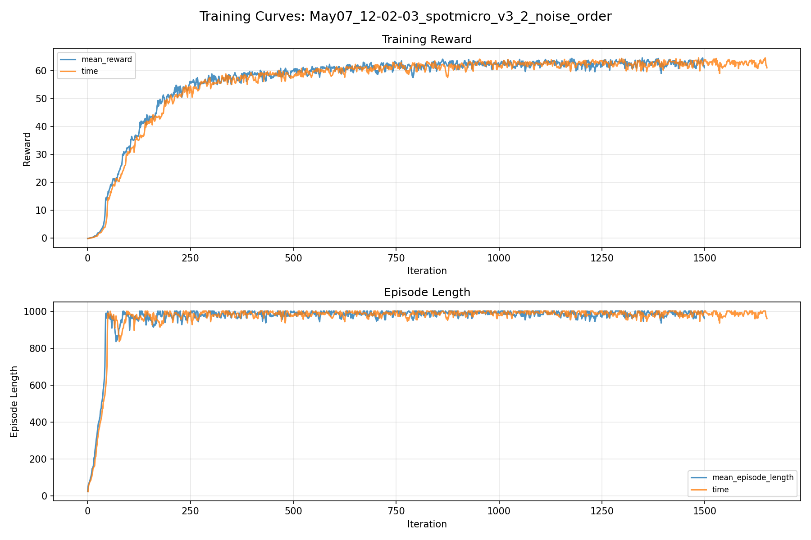
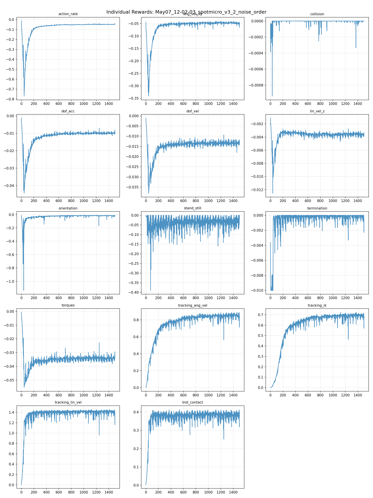
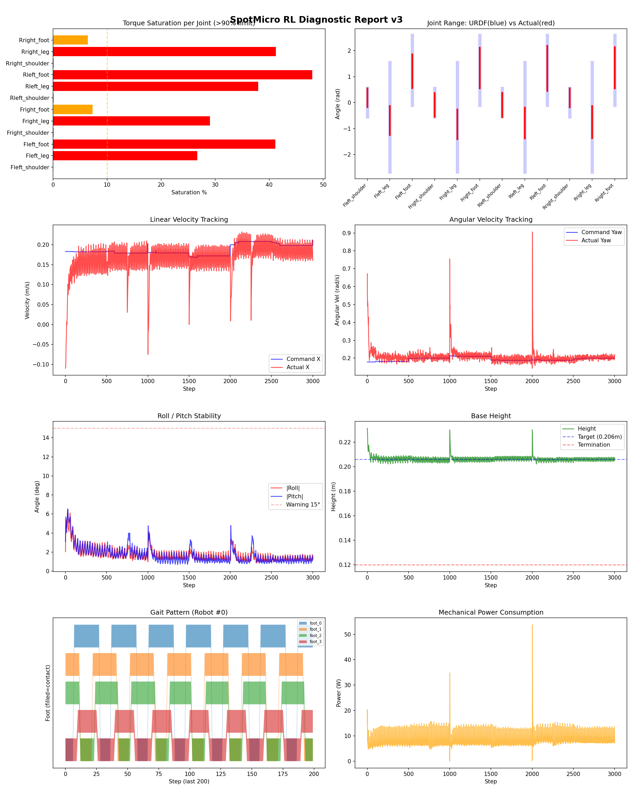
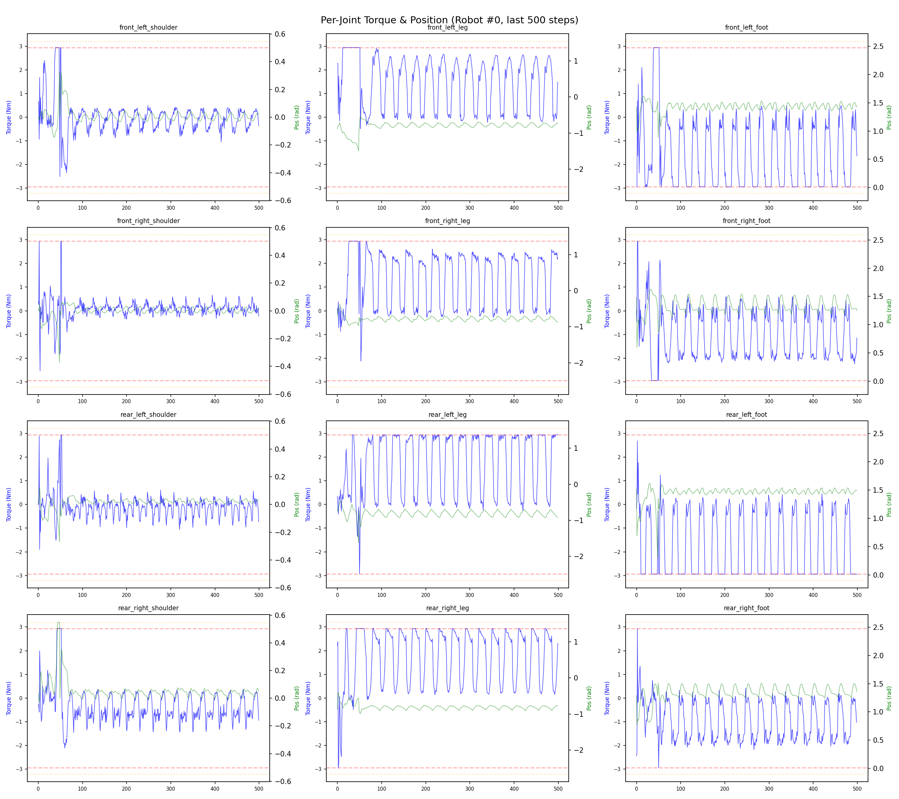
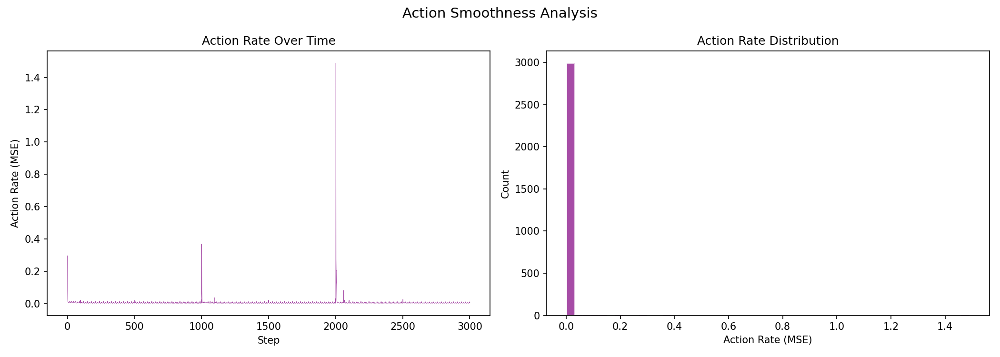

# 실험 043: spotmicro_v3_2_noise_order

- **날짜:** 2026-05-11 10:37
- **Task:** spotmicro_test
- **Run name:** `spotmicro_v3_2_noise_order`
- **판정:** ✅ PASS

---

## 실험 목적

V5: v3.2 버전으로 롤백, 초기 모델

---

## 변경점 (이전 커밋 대비)

```diff
diff --git a/ai_training/rl/legged_gym/legged_gym/envs/spotmicro_test/spotmicro_test.py b/ai_training/rl/legged_gym/legged_gym/envs/spotmicro_test/spotmicro_test.py
index fc3373a..7afb952 100644
--- a/ai_training/rl/legged_gym/legged_gym/envs/spotmicro_test/spotmicro_test.py
+++ b/ai_training/rl/legged_gym/legged_gym/envs/spotmicro_test/spotmicro_test.py
@@ -21,10 +21,9 @@ class SpotmicroTest(LeggedRobot):
         self.robot_width = 0.15 
 
         self.gait_period = 0.6
-        self.duty_factor = 0.75
-        self.step_height = 0.02
-        self.body_height = 0.216
-        self.stride_scale = 0.3
+        self.duty_factor = 0.5
+        self.step_height = 0.03
+        self.body_height = 0.206
 
         self.gait_phase = torch.zeros(self.num_envs, 1, dtype=torch.float, device=self.device)
         self.commands_scale = torch.tensor(
@@ -49,39 +48,7 @@ class SpotmicroTest(LeggedRobot):
             print(f"[Action Delay] 활성화: "
                   f"substep 단위, dt={dt_ms:.1f}ms, "
                   f"range={delay_range[0]*dt_ms:.0f}~{delay_range[1]*dt_ms:.0f}ms")
-                  
-                  
-        # leg origin in base frame: FL, FR, RL, RR
-        self.leg_origin_x = torch.tensor(
-            [0.093, 0.093, -0.093, -0.093],
-            device=self.device,
-            dtype=torch.float,
-        )
-
-        self.leg_origin_y = torch.tensor(
-            [0.036, -0.036, 0.036, -0.036],
-            device=self.device,
-            dtype=torch.float,
-        )
-
-        # shoulder joint numeric sign.
-        # 먼저 [1, 1, 1, 1]로 시작 추천.
-        # 실제 좌우 부호가 반대로 나가면 [1, -1, 1, -1]로 바꿔서 검증.
-        self.shoulder_sign = torch.tensor(
-            [1.0, 1.0, 1.0, 1.0],
-            device=self.device,
-            dtype=torch.float,
-        )
 
-        self.shoulder_ref_limit = 0.15
-        self.shoulder_y_gain = 2.0
-    '''
-    def step(self, actions):
-        # 모든 액션을 0으로 강제 → 순수 default_joint_angles만 적용
-        zero_actions = torch.zeros_like(actions)
-        return super().step(zero_actions)
-   
-    '''
     def step(self, actions):
         """서보 응답 지연을 substep 단위로 적용
         
@@ -119,7 +86,7 @@ class SpotmicroTest(LeggedRobot):
         if self.privileged_obs_buf is not None:
             self.privileged_obs_buf = torch.clip(self.privileged_obs_buf, -clip_obs, clip_obs)
         return self.obs_buf, self.privileged_obs_buf, self.rew_buf, self.reset_buf, self.extras
-    
+
     def post_physics_step(self):
         self.gym.refresh_rigid_body_state_tensor(self.sim)
 
@@ -132,9 +99,8 @@ class SpotmicroTest(LeggedRobot):
         super().post_physics_step()
               
     def _reset_dofs(self, env_ids):
-        #self.dof_pos[env_ids] = self.default_dof_pos
         self.dof_pos[env_ids] = self.default_dof_pos * torch_rand_float(
-            0.6, 1.4, (len(env_ids), self.num_dof), device=self.device)
+            0.5, 1.5, (len(env_ids), self.num_dof), device=self.device)
         self.dof_vel[env_ids] = 
```

**변경 요약:**
  - self.duty_factor = 0.75
  - self.step_height = 0.02
  - self.body_height = 0.216
  - self.stride_scale = 0.3
  + self.duty_factor = 0.5
  + self.step_height = 0.03
  + self.body_height = 0.206
  - self.leg_origin_x = torch.tensor(
  - [0.093, 0.093, -0.093, -0.093],
  - device=self.device,
  - dtype=torch.float,
  - )
  - self.leg_origin_y = torch.tensor(
  - [0.036, -0.036, 0.036, -0.036],
  - device=self.device,
  - dtype=torch.float,
  - )
  - self.shoulder_sign = torch.tensor(
  - [1.0, 1.0, 1.0, 1.0],
  - device=self.device,
  - dtype=torch.float,
  - )
  - self.shoulder_ref_limit = 0.15
  - self.shoulder_y_gain = 2.0
  - '''
  - def step(self, actions):
  - zero_actions = torch.zeros_like(actions)
  - return super().step(zero_actions)
  - '''
  - 0.6, 1.4, (len(env_ids), self.num_dof), device=self.device)
  + 0.5, 1.5, (len(env_ids), self.num_dof), device=self.device)
  - -0.2, 0.2, (len(env_ids), 6), device=self.device)
  + -0.3, 0.3, (len(env_ids), 6), device=self.device)
  - is_stand = (cmd_norm < 0.08).float()
  - lin_penalty = torch.sum(torch.square(self.base_lin_vel[:, :2]), dim=1)
  - yaw_penalty = torch.square(self.base_ang_vel[:, 2])
  - pose_penalty = 0.2 * torch.sum(
  - torch.square(self.dof_pos - self.default_dof_pos), dim=1
  - )
  + return torch.sum(torch.abs(self.dof_pos - self.default_dof_pos), dim=1) * (cmd_norm < 0.1)
  - return (lin_penalty + 0.5 * yaw_penalty + pose_penalty) * is_stand
  - '''
  - '''
  - def _get_leg_height_targets(self):
  - n = -self.projected_gravity  # ground normal/up direction in body frame
  - nx = n[:, 0].unsqueeze(1)  # [N, 1]
  - ny = n[:, 1].unsqueeze(1)
  - nz = torch.clamp(n[:, 2].unsqueeze(1), min=0.3)
  - leg_x = self.leg_origin_x.unsqueeze(0)  # [1, 4]
  - leg_y = self.leg_origin_y.unsqueeze(0)  # [1, 4]
  - z_stance = (-self.body_height - nx * leg_x - ny * leg_y) / nz
  - return z_stance
  - def _get_ik_target(self):
  - vx = self.commands[:, 0]  # [num_envs]
  - vy = self.commands[:, 1]  # 현재는 0이지만 future-proof
  - wz = self.commands[:, 2]
  - leg_x = self.leg_origin_x.unsqueeze(0)  # [1, 4]
  - leg_y = self.leg_origin_y.unsqueeze(0)  # [1, 4]
  - vx_b = vx.unsqueeze(1)  # [N, 1]
  - vy_b = vy.unsqueeze(1)
  - wz_b = wz.unsqueeze(1)
  - foot_vx = vx_b - wz_b * leg_y      # [N, 4]
  - foot_vy = vy_b + wz_b * leg_x      # [N, 4]
  - stance_time = self.gait_period * self.duty_factor
  - stride_x = foot_vx * stance_time * self.stride_scale
  - stride_y = foot_vy * stance_time * self.stride_scale
  - offsets = torch.tensor([0.0, 0.5, 0.5, 0.0], device=self.device)
  - phases = (self.gait_phase + offsets) % 1.0
  - x = torch.zeros((self.num_envs, 4), device=self.device)
  - y = torch.zeros((self.num_envs, 4), device=self.device)
  - z_stance = self._get_leg_height_targets()
  - z = z_stance.clone()
  - is_stance = phases < self.duty_factor
  - is_swing = ~is_stance
  - t_stance = phases / self.duty_factor
  - t_swing = (phases - self.duty_factor) / (1.0 - self.duty_factor)
  - x[is_stance] = stride_x[is_stance] * (0.5 - t_stance[is_stance])
  - y[is_stance] = stride_y[is_stance] * (0.5 - t_stance[is_stance])
  - x[is_swing] = stride_x[is_swing] * (-0.5 + t_swing[is_swing])
  - y[is_swing] = stride_y[is_swing] * (-0.5 + t_swing[is_swing])
  - z[is_swing] = (
  - z_stance[is_swing]
  - + self.step_height * torch.sin(torch.pi * t_swing[is_swing])
  - )
  - shoulder_raw = self.shoulder_y_gain * torch.atan2(y, -z)
  - shoulder_ref = torch.clamp(
  - shoulder_raw,
  - -self.shoulder_ref_limit,
  - self.shoulder_ref_limit,
  - )
  - shoulder_ref = shoulder_ref * self.shoulder_sign.unsqueeze(0)
  - z_eff = -torch.sqrt(torch.clamp(z * z + y * y, min=1e-6))
  - d = torch.sqrt(x**2 + z_eff**2)
  - cos_q2 = (d**2 - self.L1_EFF**2 - self.L2**2) / (
  - 2 * self.L1_EFF * self.L2
  - )
  - cos_q2 = torch.clamp(cos_q2, -0.999, 0.999)
  - q2 = torch.acos(cos_q2)
  - beta = torch.atan2(x, -z_eff)
  - alpha_k = torch.atan2(
  - self.L2 * torch.sin(q2),
  - self.L1_EFF + self.L2 * torch.cos(q2),
  - )
  - q1 = beta - alpha_k
  - theta_leg = q1 - self.ALPHA
  - theta_foot = q2 + self.ALPHA
  - ref_dof_pos = torch.zeros((self.num_envs, 12), device=self.device)
  - ref_dof_pos[:, 0::3] = shoulder_ref
  - ref_dof_pos[:, 1::3] = theta_leg
  - ref_dof_pos[:, 2::3] = theta_foot
  - cmd_norm = torch.norm(self.commands[:, :3], dim=1, keepdim=True)
  - blend = torch.clamp(cmd_norm / 0.1, 0.0, 1.0)
  - ref_dof_pos = blend * ref_dof_pos + (1.0 - blend) * self.default_dof_pos
  - return ref_dof_pos
  - ref_dof_pos = self._get_ik_target()
  - weights = torch.tensor([0.7, 1.0, 1.0] * 4, device=self.device)
  - joint_error = (self.dof_pos - ref_dof_pos) * weights
  - error = torch.sum(torch.square(joint_error), dim=1)
  - cmd_norm = torch.norm(self.commands[:, :3], dim=1)
  - is_moving = (cmd_norm > 0.08).float()
  - sigma = 0.15
  - return torch.exp(-error / sigma) * is_moving
  - def _reward_residual_action(self):
  - sigma = 3.0
  + sigma = 2.0
  - tracking_ang_vel = 1.0
  + tracking_ang_vel = 1.3
  - orientation = -4.0
  - torques = -0.0015
  - dof_vel = -0.0005
  + orientation = -6.0
  + torques = -0.001
  + dof_vel = -0.001
  - trot_contact = 0.1
  - tracking_ik = 0.25
  + trot_symmetry = 0.0
  + no_stuck_feet = 0.0
  + symmetric_gait = 0.0
  + feet_clearance = 0.0
  + trot_contact = 0.5
  + tracking_ik = 1.0
  - residual_action = 0.0
  - base_height = -0.8
  - base_height_target = 0.216
  + base_height_target = 0.206
  - add_noise = True
  + add_noise = True
  - lin_vel_x = [0.0, 0.25]
  + lin_vel_x = [0.0, 0.4]
  - ang_vel_yaw = [-0.2, 0.2]
  + ang_vel_yaw = [-0.4, 0.4]
  - run_name = 'spotmicro_v4_6_lin_range_desc'
  + run_name = 'spotmicro_v5_0_first_model'

---

## 현재 Reward Scales

| Reward | Scale |
|--------|-------|
| action_rate | -0.05 |
| ang_vel_xy | -0.4 |
| collision | -1.0 |
| dof_acc | -2.5e-07 |
| dof_vel | -0.001 |
| lin_vel_z | -2.0 |
| orientation | -6.0 |
| stand_still | -0.5 |
| termination | -10.0 |
| torques | -0.001 |
| tracking_ang_vel | 1.3 |
| tracking_ik | 1.0 |
| tracking_lin_vel | 1.5 |
| trot_contact | 0.5 |

---

## 진단 결과 (Diagnostic)

### 핵심 지표

- ✅ Timeout: 97.7% (≥80%)
- ✅ 속도오차 X: 0.0458 m/s (<0.08)
- ⚠️ 토크포화: 19.8% (10~40%)
- ✅ 자세: roll 1.7°, pitch 1.7° (안정)
- ✅ 조기종료: 0.0% (<5%)

### 상세 수치

| 지표 | 값 |
|------|-----|
| Timeout% | 97.70992366412213 |
| 조기종료% | 0.0 |
| 속도오차 X | 0.04577194154262543 m/s |
| 속도오차 Y | 0.022634418681263924 m/s |
| 각속도오차 | 0.0840025544166565 rad/s |
| 토크포화% | 19.843697968697967 |
| 평균 높이 | 0.20633040676702868 m |
| Roll (평균) | 1.7482051849365234° |
| Pitch (평균) | 1.6885141134262085° |
| Action Rate | 0.0067084236070513725 |
| 평균 전력 | 8.329960823059082 W |
| CoT | 1.9463578909458825 |

## Command Mode별 회전 추종 분석

| 모드 | 비율 | 샘플 수 | 평균 abs(cmd_wz) | 평균 abs(actual_wz) | yaw 오차 | 상태 |
|------|------|---------|------------------|---------------------|----------|------|
| 정지 | 1.9% | 3562 | 0.0233 | 0.0966 | 0.0997 | ❌ |
| 직진/저회전 | 32.8% | 63027 | 0.0726 | 0.1103 | 0.0849 | ⚠️ |
| 제자리 회전 | 9.9% | 19017 | 0.2799 | 0.2593 | 0.0829 | ⚠️ |
| 전진+회전 | 51.0% | 98083 | 0.2721 | 0.2753 | 0.0826 | ⚠️ |
| 큰 회전명령 | 25.2% | 48439 | 0.3486 | 0.3382 | 0.0835 | ⚠️ |

> 해석 기준: `제자리 회전`만 나쁘면 pure turn 학습/보행 패턴 문제, `큰 회전명령`만 나쁘면 yaw 명령 범위가 현재 토크/보폭 한계보다 큰 문제, `정지`가 나쁘면 stop drift 문제로 보면 됩니다.
        


## 학습 곡선 분석

| 지표 | 값 | 판정 |
|------|-----|------|
| 수렴 iter (90%) | 294 | 빠름 |
| 후반 안정성 (CV) | 0.016 | 안정 |
| 정체 구간 | 없음 | |


## Per-leg 분석

### 발별 접촉/공중 비율

| 발 | 접촉% | 공중% |
|-----|-------|------|
| foot_0 | 70.1% | 29.9% |
| foot_1 | 69.0% | 31.0% |
| foot_2 | 67.4% | 32.6% |
| foot_3 | 60.7% | 39.3% |

### 관절별 토크 포화

| 관절 | 포화% | 최대토크 | 한계 | 상태 |
|------|------|---------|------|------|
| front_left_shoulder | 0.1% | 2.940 | 2.940 | ✅ |
| front_left_leg | 26.7% | 2.940 | 2.940 | ❌ |
| front_left_foot | 41.2% | 2.940 | 2.940 | ❌ |
| front_right_shoulder | 0.1% | 2.940 | 2.940 | ✅ |
| front_right_leg | 29.1% | 2.940 | 2.940 | ❌ |
| front_right_foot | 7.3% | 2.940 | 2.940 | ⚠️ |
| rear_left_shoulder | 0.1% | 2.940 | 2.940 | ✅ |
| rear_left_leg | 38.0% | 2.940 | 2.940 | ❌ |
| rear_left_foot | 48.0% | 2.940 | 2.940 | ❌ |
| rear_right_shoulder | 0.1% | 2.940 | 2.940 | ✅ |
| rear_right_leg | 41.3% | 2.940 | 2.940 | ❌ |
| rear_right_foot | 6.4% | 2.940 | 2.940 | ⚠️ |


## Gait 분석

| 지표 | 값 |
|------|-----|
| Gait 주파수 | 1.67 Hz |
| Gait 주기 | 30 steps |
| 대각 동기화율 | 84.6% |
| L/R 비대칭 | 0.0%p |
| 판정 | ✅ Trot 패턴 / ✅ 대칭 |


## 관절별 상세

| 관절 | 토크포화% | 사용범위% | 편향(rad) | 한계근접% | 상태 |
|------|----------|----------|----------|----------|------|
| front_left_shoulder | 0.1% | 66% | +0.189 | 0.0% | ⚠️ |
| front_left_leg | 26.7% | 26% | -0.689 | 0.0% | ⚠️ |
| front_left_foot | 41.2% | 49% | +1.212 | 0.0% | ⚠️ |
| front_right_shoulder | 0.1% | 83% | -0.091 | 0.0% | ✅ |
| front_right_leg | 29.1% | 27% | -0.834 | 0.0% | ⚠️ |
| front_right_foot | 7.3% | 58% | +1.335 | 0.0% | ⚠️ |
| rear_left_shoulder | 0.1% | 85% | -0.087 | 0.1% | ✅ |
| rear_left_leg | 38.0% | 28% | -0.783 | 0.0% | ⚠️ |
| rear_left_foot | 48.0% | 64% | +1.320 | 0.0% | ⚠️ |
| rear_right_shoulder | 0.1% | 67% | +0.186 | 0.0% | ⚠️ |
| rear_right_leg | 41.3% | 29% | -0.749 | 0.0% | ⚠️ |
| rear_right_foot | 6.4% | 59% | +1.343 | 0.0% | ⚠️ |


## 에너지 효율 상세

| 지표 | 값 |
|------|-----|
| 평균 전력 | 8.33 W |
| 피크 전력 | 53.78 W |
| 피크/평균 비율 | 6.5x |
| CoT | 1.95 |

### 관절별 전력 분배

| 관절 | 평균전력(W) | 비율% |
|------|-----------|-------|
| front_left_foot | 1.570 | 18.9% |
| rear_left_foot | 1.422 | 17.1% |
| front_right_foot | 1.098 | 13.2% |
| rear_right_foot | 0.987 | 11.8% |
| front_right_leg | 0.795 | 9.5% |
| rear_right_leg | 0.756 | 9.1% |
| rear_left_leg | 0.722 | 8.7% |
| front_left_leg | 0.711 | 8.5% |
| rear_right_shoulder | 0.098 | 1.2% |
| rear_left_shoulder | 0.059 | 0.7% |
| front_left_shoulder | 0.058 | 0.7% |
| front_right_shoulder | 0.054 | 0.6% |


## 이전 실험 대비 비교

| 지표 | 이전 (exp042) | 현재 (exp043) | 변화 |
|------|-------|-------|------|
| Timeout% | 96.2% | 97.7% | ✅ ↑ 1.4693% |
| 속도오차 X | 0.0462 | 0.0458 | ✅ ↓ 0.0004m/s |
| 토크포화 | 20.3% | 19.8% | ✅ ↓ 0.4472% |
| Roll | 1.8° | 1.7° | ✅ ↓ 0.0566° |
| Pitch | 1.6° | 1.7° | ⚠️ ↑ 0.0698° |
| 평균 전력 | 8.5275W | 8.3300W | ✅ ↓ 0.1975W |


## Tensorboard 학습 곡선 요약

| 스칼라 | 최종값 | 최대 | 최소 | 후반10% 평균 |
|--------|--------|------|------|-------------|
| rew_action_rate | -0.0468 | -0.0146 | -0.7700 | -0.0487 |
| rew_ang_vel_xy | -0.0457 | -0.0395 | -0.3413 | -0.0473 |
| rew_collision | 0.0000 | 0.0000 | -0.0009 | -0.0000 |
| rew_dof_acc | -0.0097 | -0.0013 | -0.0444 | -0.0099 |
| rew_dof_vel | -0.0129 | -0.0011 | -0.0380 | -0.0135 |
| rew_lin_vel_z | -0.0034 | -0.0011 | -0.0125 | -0.0036 |
| rew_orientation | -0.0137 | -0.0096 | -1.1363 | -0.0169 |
| rew_stand_still | -0.0165 | 0.0000 | -0.3896 | -0.0317 |
| rew_termination | -0.0004 | 0.0000 | -0.0100 | -0.0002 |
| rew_torques | -0.0329 | -0.0007 | -0.0554 | -0.0344 |
| rew_tracking_ang_vel | 0.8214 | 0.8880 | 0.0023 | 0.8512 |
| rew_tracking_ik | 0.6763 | 0.7229 | 0.0011 | 0.6924 |
| rew_tracking_lin_vel | 1.3795 | 1.4564 | 0.0060 | 1.4094 |
| rew_trot_contact | 0.3783 | 0.4140 | 0.0036 | 0.3825 |
| learning_rate | 0.0004 | 0.0100 | 0.0000 | 0.0004 |
| surrogate | -0.0025 | 0.0045 | -0.0087 | -0.0028 |
| value_function | 0.0113 | 0.1438 | 0.0026 | 0.0179 |
| collection time | 0.7947 | 1.1447 | 0.7551 | 0.8083 |
| learning_time | 0.2919 | 0.3455 | 0.2763 | 0.2926 |
| total_fps | 90463.0000 | 93946.0000 | 67748.0000 | 89317.7600 |
| mean_noise_std | 0.1803 | 1.0015 | 0.1723 | 0.1828 |
| mean_episode_length | 961.1700 | 1002.0000 | 22.2400 | 987.0712 |
| time | 961.1700 | 1002.0000 | 22.2400 | 987.0712 |
| mean_reward | 61.0601 | 64.6216 | -0.1659 | 62.7230 |
| time | 61.0601 | 64.6216 | -0.1659 | 62.7230 |

총 학습 iteration: 1499


---

## 그래프

### Tensorboard 학습 곡선



### Diagnostic 결과





---

## 결론 및 다음 실험 방향

**자동 판정:** ✅ PASS

대부분 기준을 통과했으나 일부 항목이 보통 수준입니다.
  - ⚠️ 토크포화: 19.8% (10~40%)

> 💡 위 결론은 자동 생성되었습니다. 필요시 수정하세요.

---

## 메모

_(추가 메모가 있으면 여기에 작성)_

