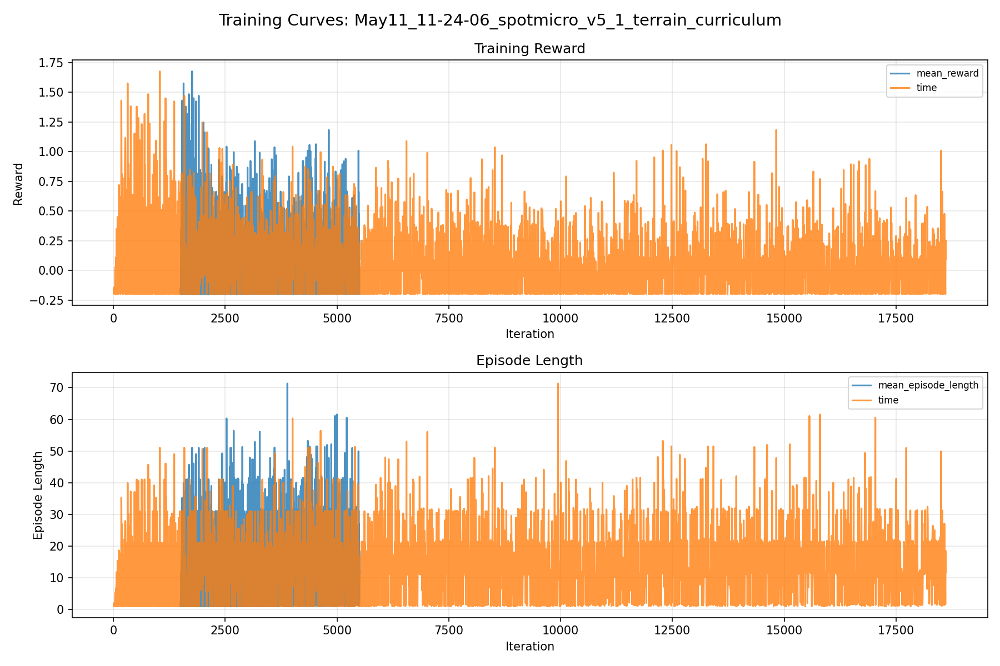
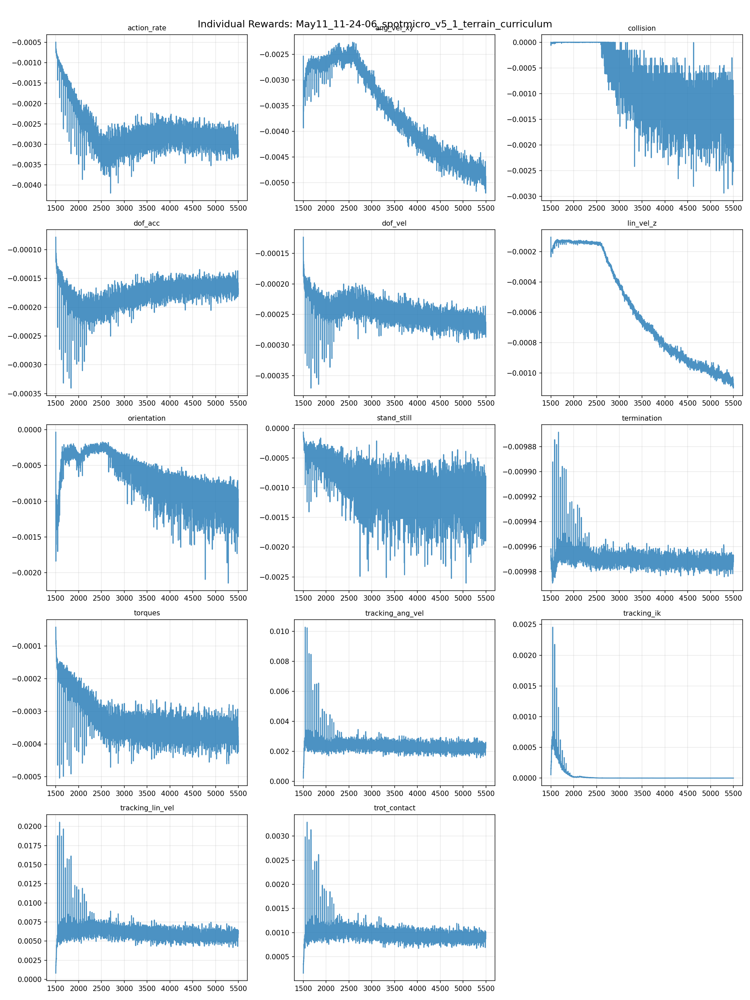
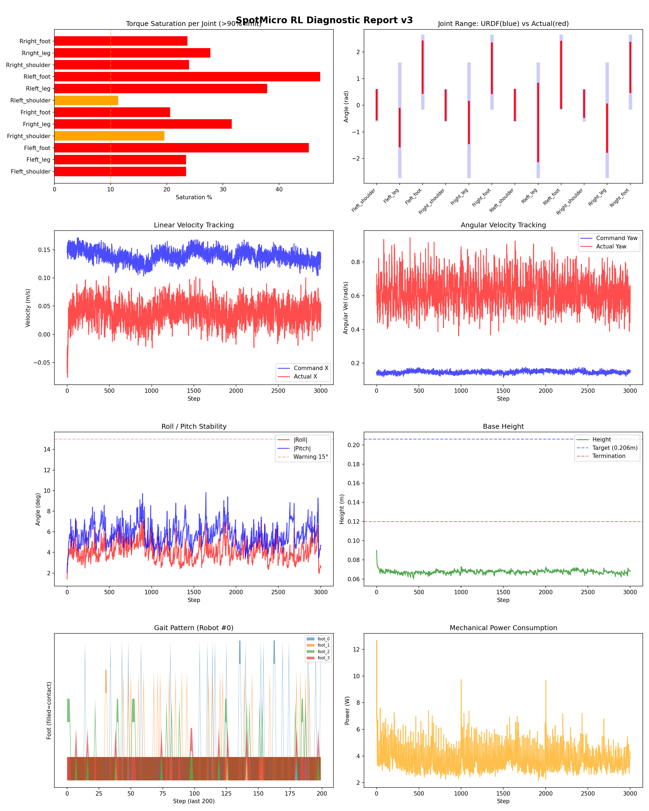
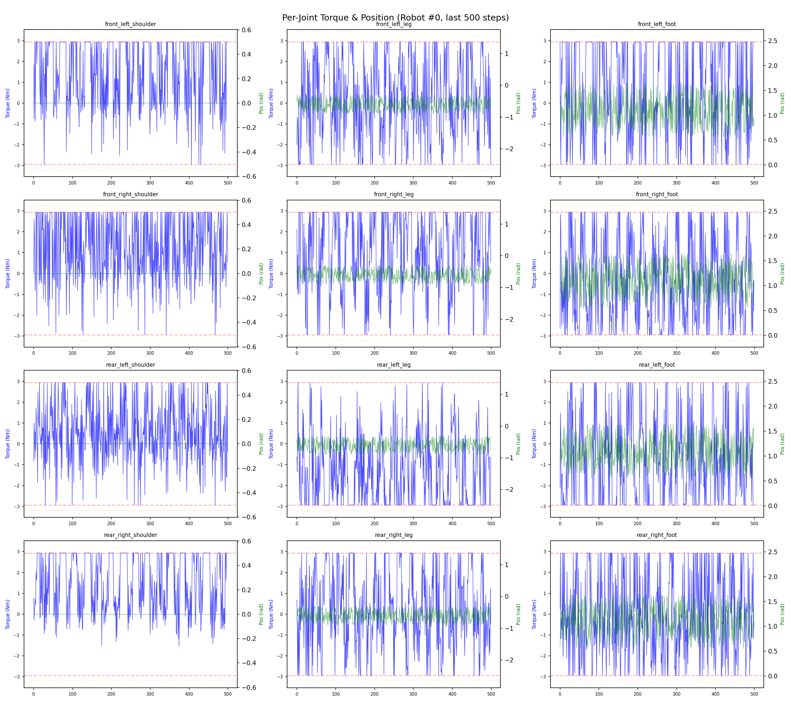
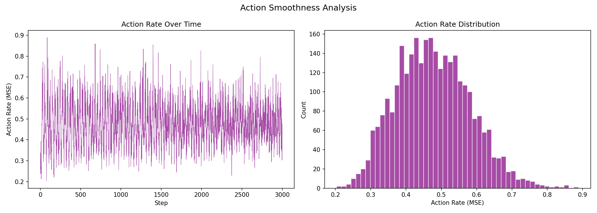

# 실험 044: spotmicro_v5_1_terrain_curriculum

- **날짜:** 2026-05-11 16:37
- **Task:** spotmicro_test
- **Run name:** `spotmicro_v5_1_terrain_curriculum`
- **판정:** ❌ FAIL (일부 기준 미달)

---

## 실험 목적

V5.1: 복잡한 지형 학습

---

## 변경점 (이전 커밋 대비)

```diff
diff --git a/ai_training/rl/legged_gym/legged_gym/envs/spotmicro_test/spotmicro_test_config.py b/ai_training/rl/legged_gym/legged_gym/envs/spotmicro_test/spotmicro_test_config.py
index eb5f026..4140436 100644
--- a/ai_training/rl/legged_gym/legged_gym/envs/spotmicro_test/spotmicro_test_config.py
+++ b/ai_training/rl/legged_gym/legged_gym/envs/spotmicro_test/spotmicro_test_config.py
@@ -9,9 +9,34 @@ class SpotmicroTestCfg(LeggedRobotCfg):
         num_actions = 12
 
     class terrain(LeggedRobotCfg.terrain):
-        mesh_type = 'plane'
-        curriculum = False
-        measure_heights = False
+        mesh_type = 'trimesh'           # 'plane' → 'trimesh'
+        curriculum = True               # False → True
+        measure_heights = True          # False → True
+        
+        # SpotMicro 스케일에 맞춘 높이 측정 범위 (몸체 ~0.22m)
+        # ANYmal 기본: [-0.8~0.8] x [-0.5~0.5] = 1.6m x 1.0m → 너무 큼
+        # SpotMicro용: [-0.25~0.25] x [-0.15~0.15] = 0.5m x 0.3m
+        measured_points_x = [-0.25, -0.2, -0.15, -0.1, -0.05, 0., 0.05, 0.1, 0.15, 0.2, 0.25]  # 11개
+        measured_points_y = [-0.15, -0.1, -0.05, 0., 0.05, 0.1, 0.15]                            # 7개
+        # → 11 x 7 = 77 포인트
+        
+        horizontal_scale = 0.05         # 0.1 → 0.05 (SpotMicro 발이 작으므로 지형 해상도 증가)
+        vertical_scale = 0.005          # 유지
+        
+        # SpotMicro 맞춤 지형 비율
+        # ANYmal: [0.1, 0.1, 0.35, 0.25, 0.2] = smooth_slope/rough_slope/stairs_up/stairs_down/discrete
+        # SpotMicro: 계단 비율 ↓, 경사/거친평지 ↑ (다리 짧고 토크 제한적)
+        terrain_proportions = [0.25, 0.25, 0.15, 0.15, 0.2]
+        
+        max_init_terrain_level = 3      # 5 → 3 (처음엔 쉬운 지형부터)
+        num_rows = 8                    # 10 → 8 (VRAM 절약)
+        num_cols = 16                   # 20 → 16
+        terrain_length = 6.             # 8 → 6
+        terrain_width = 6.              # 8 → 6
+        
+        static_friction = 1.0
+        dynamic_friction = 1.0
+        restitution = 0.0
 
     class init_state(LeggedRobotCfg.init_state):
         pos = [0.0, 0.0, 0.23]
@@ -66,8 +91,8 @@ class SpotmicroTestCfg(LeggedRobotCfg):
             no_stuck_feet = 0.0
             symmetric_gait = 0.0
             feet_clearance = 0.0
-            trot_contact = 0.5
-            tracking_ik = 1.0
+            trot_contact = 0.3
+            tracking_ik = 0.3
             stand_still = -0.5
         soft_dof_pos_limit = 0.9
         base_height_target = 0.206
@@ -95,14 +120,14 @@ class SpotmicroTestCfg(LeggedRobotCfg):
 
     class commands(LeggedRobotCfg.commands):
         curriculum = False
-        max_curriculum = 1.0
+        max_curriculum = 0.5
         num_commands = 4
         resampling_time = 10.0
         heading_command = False
         class ranges:
-            lin_vel_x = [0.0, 0.4]
+            lin_vel_x = [0.0, 0.3]
             lin_vel_y = [0.0, 0.0]
-            ang_vel_yaw = [-0.4, 0.4]
+            ang_vel_yaw = [-0.3, 0.3]
             heading = [-3.14, 3.14]
 
    
```

**변경 요약:**
  - mesh_type = 'plane'
  - curriculum = False
  - measure_heights = False
  + mesh_type = 'trimesh'           # 'plane' → 'trimesh'
  + curriculum = True               # False → True
  + measure_heights = True          # False → True
  + measured_points_x = [-0.25, -0.2, -0.15, -0.1, -0.05, 0., 0.05, 0.1, 0.15, 0.2, 0.25]  # 11개
  + measured_points_y = [-0.15, -0.1, -0.05, 0., 0.05, 0.1, 0.15]                            # 7개
  + horizontal_scale = 0.05         # 0.1 → 0.05 (SpotMicro 발이 작으므로 지형 해상도 증가)
  + vertical_scale = 0.005          # 유지
  + terrain_proportions = [0.25, 0.25, 0.15, 0.15, 0.2]
  + max_init_terrain_level = 3      # 5 → 3 (처음엔 쉬운 지형부터)
  + num_rows = 8                    # 10 → 8 (VRAM 절약)
  + num_cols = 16                   # 20 → 16
  + terrain_length = 6.             # 8 → 6
  + terrain_width = 6.              # 8 → 6
  + static_friction = 1.0
  + dynamic_friction = 1.0
  + restitution = 0.0
  - trot_contact = 0.5
  - tracking_ik = 1.0
  + trot_contact = 0.3
  + tracking_ik = 0.3
  - max_curriculum = 1.0
  + max_curriculum = 0.5
  - lin_vel_x = [0.0, 0.4]
  + lin_vel_x = [0.0, 0.3]
  - ang_vel_yaw = [-0.4, 0.4]
  + ang_vel_yaw = [-0.3, 0.3]
  - run_name = 'spotmicro_v5_0_first_model'
  + run_name = 'spotmicro_v5_1_terrain_curriculum'
  - max_iterations = 1500
  - save_interval = 100
  + max_iterations = 4000
  + save_interval = 200
  + resume = True
  + load_run = 'spotmicro_v5_0_first_model'
  + checkpoint = -1

---

## 현재 Reward Scales

| Reward | Scale |
|--------|-------|
| action_rate | -0.05 |
| ang_vel_xy | -0.4 |
| collision | -1.0 |
| dof_acc | -2.5e-07 |
| dof_vel | -0.001 |
| lin_vel_z | -2.0 |
| orientation | -6.0 |
| stand_still | -0.5 |
| termination | -10.0 |
| torques | -0.001 |
| tracking_ang_vel | 1.3 |
| tracking_ik | 0.3 |
| tracking_lin_vel | 1.5 |
| trot_contact | 0.3 |

---

## 진단 결과 (Diagnostic)

### 핵심 지표

- ❌ Timeout: 0.0% (<60%, 미달)
- ❌ 속도오차 X: 0.1459 m/s (>0.12, 미달)
- ⚠️ 토크포화: 28.0% (10~40%)
- ✅ 자세: roll 4.1°, pitch 5.7° (안정)
- ❌ 조기종료: 99.8% (>20%)

### 상세 수치

| 지표 | 값 |
|------|-----|
| Timeout% | 0.041795267489711935 |
| 조기종료% | 99.77494855967079 |
| 속도오차 X | 0.14588941633701324 m/s |
| 속도오차 Y | 0.0975525826215744 m/s |
| 각속도오차 | 0.6048128008842468 rad/s |
| 토크포화% | 27.98655337717838 |
| 평균 높이 | 0.06752928945071848 m |
| Roll (평균) | 4.10579252243042° |
| Pitch (평균) | 5.716395378112793° |
| Action Rate | 0.4773319959640503 |
| 평균 전력 | 3.7335574626922607 W |
| CoT | 3.687661193401644 |

## Command Mode별 회전 추종 분석

| 모드 | 비율 | 샘플 수 | 평균 abs(cmd_wz) | 평균 abs(actual_wz) | yaw 오차 | 상태 |
|------|------|---------|------------------|---------------------|----------|------|
| 정지 | 3.1% | 6013 | 0.0245 | 0.5392 | 0.5391 | ❌ |
| 직진/저회전 | 42.7% | 82059 | 0.0788 | 0.5989 | 0.5910 | ❌ |
| 제자리 회전 | 9.4% | 17972 | 0.2200 | 0.5883 | 0.5428 | ❌ |
| 전진+회전 | 38.5% | 73906 | 0.2229 | 0.6807 | 0.6542 | ❌ |
| 큰 회전명령 | 0.0% | 0 | N/A | N/A | N/A | N/A |

> 해석 기준: `제자리 회전`만 나쁘면 pure turn 학습/보행 패턴 문제, `큰 회전명령`만 나쁘면 yaw 명령 범위가 현재 토크/보폭 한계보다 큰 문제, `정지`가 나쁘면 stop drift 문제로 보면 됩니다.
        


## 학습 곡선 분석

| 지표 | 값 | 판정 |
|------|-----|------|
| 수렴 iter (90%) | 1568 | 빠름 |
| 후반 안정성 (CV) | 8.017 | 불안정 |
| 정체 구간 | 없음 | |


## Per-leg 분석

### 발별 접촉/공중 비율

| 발 | 접촉% | 공중% |
|-----|-------|------|
| foot_0 | 38.6% | 61.4% |
| foot_1 | 42.7% | 57.3% |
| foot_2 | 42.3% | 57.7% |
| foot_3 | 37.5% | 62.5% |

### 관절별 토크 포화

| 관절 | 포화% | 최대토크 | 한계 | 상태 |
|------|------|---------|------|------|
| front_left_shoulder | 23.4% | 2.940 | 2.940 | ❌ |
| front_left_leg | 23.4% | 2.940 | 2.940 | ❌ |
| front_left_foot | 45.3% | 2.940 | 2.940 | ❌ |
| front_right_shoulder | 19.6% | 2.940 | 2.940 | ⚠️ |
| front_right_leg | 31.6% | 2.940 | 2.940 | ❌ |
| front_right_foot | 20.6% | 2.940 | 2.940 | ❌ |
| rear_left_shoulder | 11.3% | 2.940 | 2.940 | ⚠️ |
| rear_left_leg | 37.9% | 2.940 | 2.940 | ❌ |
| rear_left_foot | 47.3% | 2.940 | 2.940 | ❌ |
| rear_right_shoulder | 24.0% | 2.940 | 2.940 | ❌ |
| rear_right_leg | 27.8% | 2.940 | 2.940 | ❌ |
| rear_right_foot | 23.7% | 2.940 | 2.940 | ❌ |


## Gait 분석

| 지표 | 값 |
|------|-----|
| Gait 주파수 | 1.60 Hz |
| Gait 주기 | 31 steps |
| 대각 동기화율 | 80.9% |
| L/R 비대칭 | 0.0%p |
| 판정 | ✅ Trot 패턴 / ✅ 대칭 |


## 관절별 상세

| 관절 | 토크포화% | 사용범위% | 편향(rad) | 한계근접% | 상태 |
|------|----------|----------|----------|----------|------|
| front_left_shoulder | 23.4% | 100% | +0.020 | 0.2% | ⚠️ |
| front_left_leg | 23.4% | 34% | -0.838 | 0.0% | ⚠️ |
| front_left_foot | 45.3% | 72% | +1.429 | 0.0% | ⚠️ |
| front_right_shoulder | 19.6% | 101% | +0.003 | 0.6% | ✅ |
| front_right_leg | 31.6% | 37% | -0.647 | 0.0% | ⚠️ |
| front_right_foot | 20.6% | 70% | +1.392 | 0.0% | ⚠️ |
| rear_left_shoulder | 11.3% | 105% | +0.011 | 1.1% | ✅ |
| rear_left_leg | 37.9% | 69% | -0.643 | 0.0% | ⚠️ |
| rear_left_foot | 47.3% | 93% | +1.141 | 0.1% | ⚠️ |
| rear_right_shoulder | 24.0% | 91% | +0.058 | 1.3% | ⚠️ |
| rear_right_leg | 27.8% | 42% | -0.864 | 0.0% | ⚠️ |
| rear_right_foot | 23.7% | 69% | +1.423 | 0.0% | ⚠️ |


## 에너지 효율 상세

| 지표 | 값 |
|------|-----|
| 평균 전력 | 3.73 W |
| 피크 전력 | 12.66 W |
| 피크/평균 비율 | 3.4x |
| CoT | 3.69 |

### 관절별 전력 분배

| 관절 | 평균전력(W) | 비율% |
|------|-----------|-------|
| front_left_foot | 0.614 | 16.5% |
| rear_left_foot | 0.569 | 15.2% |
| front_right_foot | 0.487 | 13.0% |
| rear_right_foot | 0.390 | 10.5% |
| front_left_leg | 0.339 | 9.1% |
| rear_left_leg | 0.335 | 9.0% |
| front_right_leg | 0.326 | 8.7% |
| rear_right_leg | 0.296 | 7.9% |
| rear_right_shoulder | 0.118 | 3.2% |
| rear_left_shoulder | 0.095 | 2.6% |
| front_left_shoulder | 0.085 | 2.3% |
| front_right_shoulder | 0.079 | 2.1% |


## 이전 실험 대비 비교

| 지표 | 이전 (exp043) | 현재 (exp044) | 변화 |
|------|-------|-------|------|
| Timeout% | 97.7% | 0.0% | ⚠️ ↓ 97.6681% |
| 속도오차 X | 0.0458 | 0.1459 | ⚠️ ↑ 0.1001m/s |
| 토크포화 | 19.8% | 28.0% | ⚠️ ↑ 8.1429% |
| Roll | 1.7° | 4.1° | ⚠️ ↑ 2.3576° |
| Pitch | 1.7° | 5.7° | ⚠️ ↑ 4.0279° |
| 평균 전력 | 8.3300W | 3.7336W | ✅ ↓ 4.5964W |


## Tensorboard 학습 곡선 요약

| 스칼라 | 최종값 | 최대 | 최소 | 후반10% 평균 |
|--------|--------|------|------|-------------|
| rew_action_rate | -0.0031 | -0.0005 | -0.0042 | -0.0029 |
| rew_ang_vel_xy | -0.0050 | -0.0023 | -0.0052 | -0.0048 |
| rew_collision | -0.0017 | 0.0000 | -0.0029 | -0.0014 |
| rew_dof_acc | -0.0002 | -0.0001 | -0.0003 | -0.0002 |
| rew_dof_vel | -0.0003 | -0.0001 | -0.0004 | -0.0003 |
| rew_lin_vel_z | -0.0011 | -0.0001 | -0.0011 | -0.0010 |
| rew_orientation | -0.0010 | -0.0000 | -0.0021 | -0.0010 |
| rew_stand_still | -0.0008 | -0.0001 | -0.0026 | -0.0012 |
| rew_termination | -0.0100 | -0.0099 | -0.0100 | -0.0100 |
| rew_torques | -0.0004 | -0.0000 | -0.0005 | -0.0004 |
| rew_tracking_ang_vel | 0.0025 | 0.0103 | 0.0002 | 0.0022 |
| rew_tracking_ik | 0.0000 | 0.0025 | 0.0000 | 0.0000 |
| rew_tracking_lin_vel | 0.0060 | 0.0206 | 0.0008 | 0.0056 |
| rew_trot_contact | 0.0010 | 0.0033 | 0.0002 | 0.0009 |
| terrain_level | 0.1761 | 1.1489 | 0.1176 | 0.1743 |
| learning_rate | 0.0000 | 0.0013 | 0.0000 | 0.0000 |
| surrogate | 0.0007 | 0.0107 | -0.0091 | 0.0001 |
| value_function | 0.0249 | 9.8652 | 0.0133 | 0.0216 |
| collection time | 5.3850 | 5.7127 | 3.2871 | 5.3008 |
| learning_time | 0.2866 | 0.4356 | 0.2711 | 0.2887 |
| total_fps | 17332.0000 | 27513.0000 | 16324.0000 | 17594.6125 |
| mean_noise_std | 0.6347 | 0.6934 | 0.1810 | 0.6344 |
| mean_episode_length | 11.7400 | 71.3000 | 1.0000 | 13.3877 |
| time | 11.7400 | 71.3000 | 1.0000 | 13.3877 |
| mean_reward | 0.0926 | 1.6752 | -0.1997 | 0.0122 |
| time | 0.0926 | 1.6752 | -0.1997 | 0.0122 |

총 학습 iteration: 5499


---

## 그래프

### Tensorboard 학습 곡선



### Diagnostic 결과





---

## 결론 및 다음 실험 방향

**자동 판정:** ❌ FAIL (일부 기준 미달)

일부 기준을 통과하지 못했습니다. 조정이 필요합니다.
  - ❌ Timeout: 0.0% (<60%, 미달)
  - ❌ 속도오차 X: 0.1459 m/s (>0.12, 미달)
  - ❌ 조기종료: 99.8% (>20%)

**제안:** Timeout이 낮습니다. 최근 추가한 페널티를 절반으로 줄여보세요.

> 💡 위 결론은 자동 생성되었습니다. 필요시 수정하세요.

---

## 메모

_(추가 메모가 있으면 여기에 작성)_

