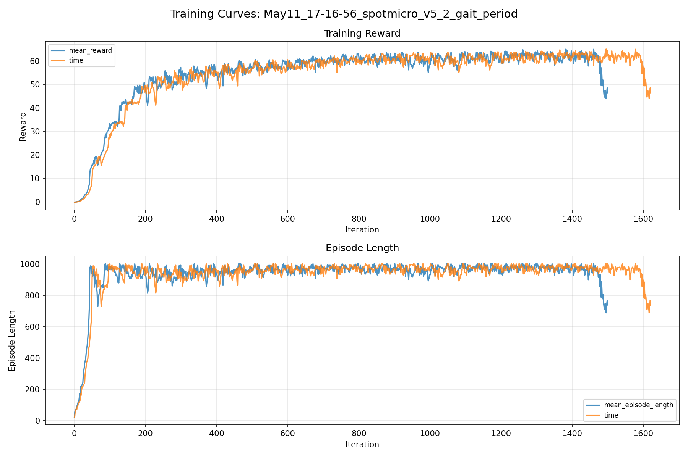
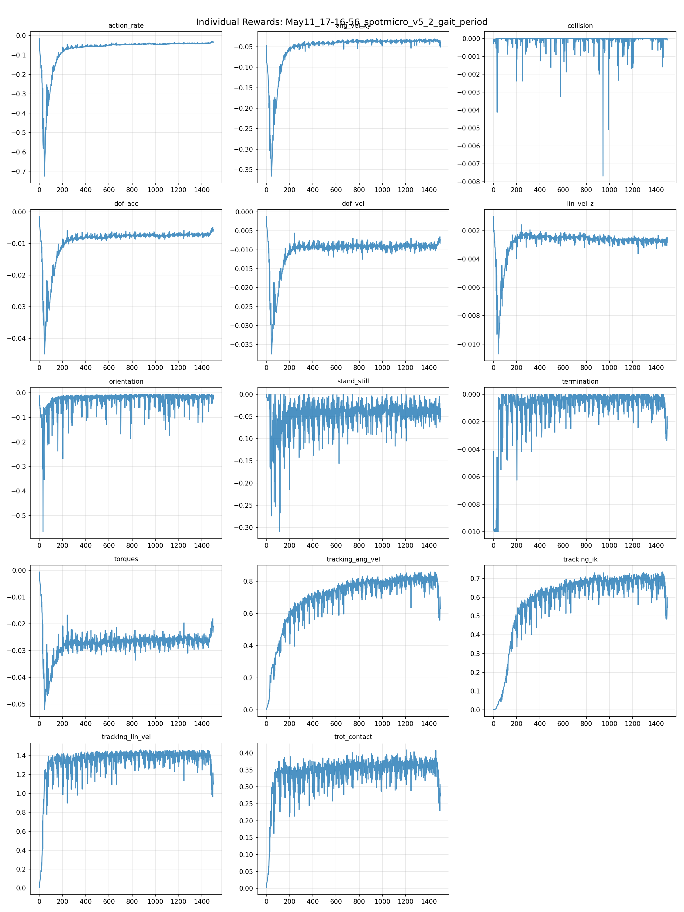
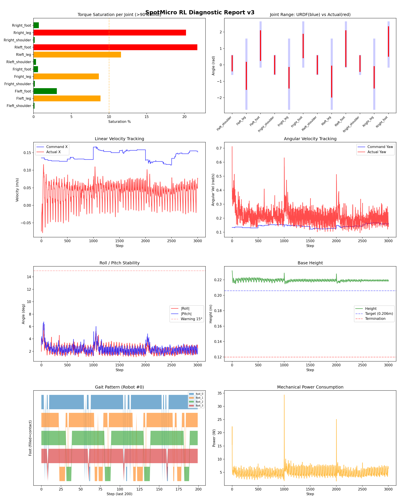
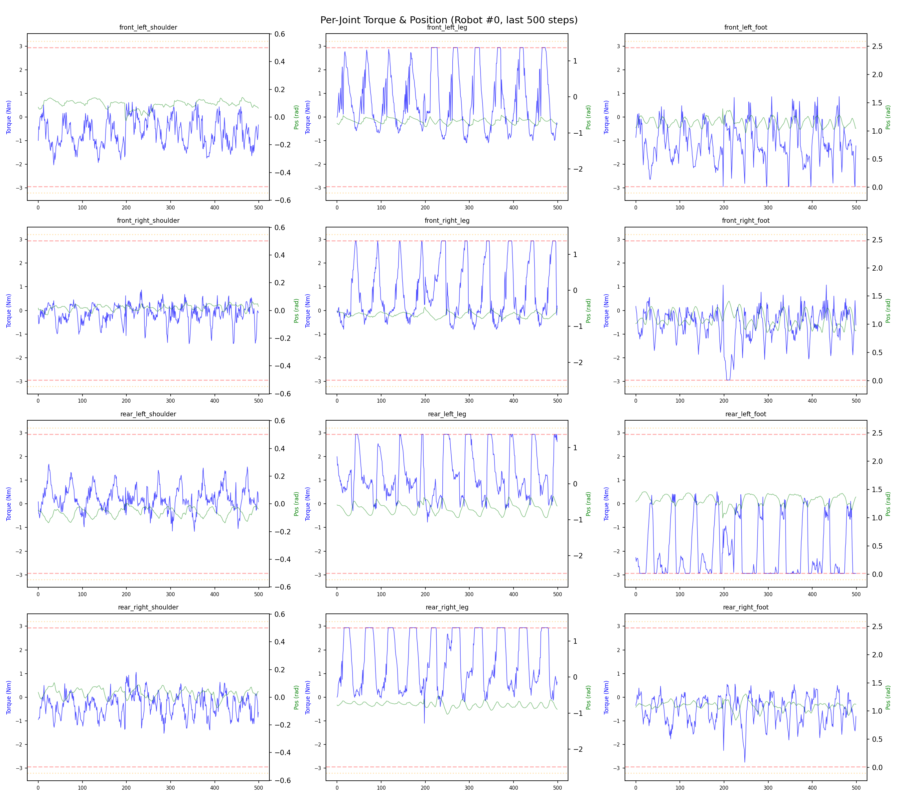
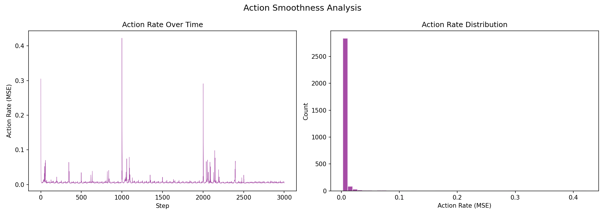

# 실험 045: spotmicro_v5_2_gait_period

- **날짜:** 2026-05-11 17:45
- **Task:** spotmicro_test
- **Run name:** `spotmicro_v5_2_gait_period`
- **판정:** ✅ PASS

---

## 실험 목적

V5.2: gait period, feet height 조정

---

## 변경점 (이전 커밋 대비)

```diff
diff --git a/ai_training/rl/legged_gym/legged_gym/envs/spotmicro_test/spotmicro_test.py b/ai_training/rl/legged_gym/legged_gym/envs/spotmicro_test/spotmicro_test.py
index 7afb952..7eda3af 100644
--- a/ai_training/rl/legged_gym/legged_gym/envs/spotmicro_test/spotmicro_test.py
+++ b/ai_training/rl/legged_gym/legged_gym/envs/spotmicro_test/spotmicro_test.py
@@ -18,11 +18,11 @@ class SpotmicroTest(LeggedRobot):
         self.L2 = 0.115
         self.L1_EFF = (0.01**2 + 0.12**2)**0.5
         self.ALPHA = torch.atan2(torch.tensor(0.01), torch.tensor(0.12)).item()
-        self.robot_width = 0.15 
+        self.robot_width = 0.15
 
-        self.gait_period = 0.6
-        self.duty_factor = 0.5
-        self.step_height = 0.03
+        self.gait_period = 1.0
+        self.duty_factor = 0.6
+        self.step_height = 0.015
         self.body_height = 0.206
 
         self.gait_phase = torch.zeros(self.num_envs, 1, dtype=torch.float, device=self.device)
diff --git a/ai_training/rl/legged_gym/legged_gym/envs/spotmicro_test/spotmicro_test_config.py b/ai_training/rl/legged_gym/legged_gym/envs/spotmicro_test/spotmicro_test_config.py
index 4140436..4524275 100644
--- a/ai_training/rl/legged_gym/legged_gym/envs/spotmicro_test/spotmicro_test_config.py
+++ b/ai_training/rl/legged_gym/legged_gym/envs/spotmicro_test/spotmicro_test_config.py
@@ -9,35 +9,10 @@ class SpotmicroTestCfg(LeggedRobotCfg):
         num_actions = 12
 
     class terrain(LeggedRobotCfg.terrain):
-        mesh_type = 'trimesh'           # 'plane' → 'trimesh'
-        curriculum = True               # False → True
-        measure_heights = True          # False → True
-        
-        # SpotMicro 스케일에 맞춘 높이 측정 범위 (몸체 ~0.22m)
-        # ANYmal 기본: [-0.8~0.8] x [-0.5~0.5] = 1.6m x 1.0m → 너무 큼
-        # SpotMicro용: [-0.25~0.25] x [-0.15~0.15] = 0.5m x 0.3m
-        measured_points_x = [-0.25, -0.2, -0.15, -0.1, -0.05, 0., 0.05, 0.1, 0.15, 0.2, 0.25]  # 11개
-        measured_points_y = [-0.15, -0.1, -0.05, 0., 0.05, 0.1, 0.15]                            # 7개
-        # → 11 x 7 = 77 포인트
-        
-        horizontal_scale = 0.05         # 0.1 → 0.05 (SpotMicro 발이 작으므로 지형 해상도 증가)
-        vertical_scale = 0.005          # 유지
-        
-        # SpotMicro 맞춤 지형 비율
-        # ANYmal: [0.1, 0.1, 0.35, 0.25, 0.2] = smooth_slope/rough_slope/stairs_up/stairs_down/discrete
-        # SpotMicro: 계단 비율 ↓, 경사/거친평지 ↑ (다리 짧고 토크 제한적)
-        terrain_proportions = [0.25, 0.25, 0.15, 0.15, 0.2]
-        
-        max_init_terrain_level = 3      # 5 → 3 (처음엔 쉬운 지형부터)
-        num_rows = 8                    # 10 → 8 (VRAM 절약)
-        num_cols = 16                   # 20 → 16
-        terrain_length = 6.             # 8 → 6
-        terrain_width = 6.              # 8 → 6
+        mesh_type = 'plane'
+        curriculum = False
+        measure_heights = False
         
-        static_friction = 1.0
-        dynamic_friction = 1.0
-        restitution = 0.0
-
     class init_state(LeggedRobotCfg.init_state
```

**변경 요약:**
  - self.robot_width = 0.15
  + self.robot_width = 0.15
  - self.gait_period = 0.6
  - self.duty_factor = 0.5
  - self.step_height = 0.03
  + self.gait_period = 1.0
  + self.duty_factor = 0.6
  + self.step_height = 0.015
  - mesh_type = 'trimesh'           # 'plane' → 'trimesh'
  - curriculum = True               # False → True
  - measure_heights = True          # False → True
  - measured_points_x = [-0.25, -0.2, -0.15, -0.1, -0.05, 0., 0.05, 0.1, 0.15, 0.2, 0.25]  # 11개
  - measured_points_y = [-0.15, -0.1, -0.05, 0., 0.05, 0.1, 0.15]                            # 7개
  - horizontal_scale = 0.05         # 0.1 → 0.05 (SpotMicro 발이 작으므로 지형 해상도 증가)
  - vertical_scale = 0.005          # 유지
  - terrain_proportions = [0.25, 0.25, 0.15, 0.15, 0.2]
  - max_init_terrain_level = 3      # 5 → 3 (처음엔 쉬운 지형부터)
  - num_rows = 8                    # 10 → 8 (VRAM 절약)
  - num_cols = 16                   # 20 → 16
  - terrain_length = 6.             # 8 → 6
  - terrain_width = 6.              # 8 → 6
  + mesh_type = 'plane'
  + curriculum = False
  + measure_heights = False
  - static_friction = 1.0
  - dynamic_friction = 1.0
  - restitution = 0.0
  - trot_contact = 0.3
  - tracking_ik = 0.3
  + trot_contact = 0.5
  + tracking_ik = 1.0
  - max_curriculum = 0.5
  + max_curriculum = 1.0
  - run_name = 'spotmicro_v5_1_terrain_curriculum'
  + run_name = 'spotmicro_v5_2_gait_period'
  - max_iterations = 4000
  - save_interval = 200
  - resume = True
  - load_run = 'spotmicro_v5_0_first_model'
  - checkpoint = -1
  + max_iterations = 1500
  + save_interval = 100
  - slope = difficulty * 0.4
  - step_height = 0.05 + 0.18 * difficulty
  - discrete_obstacles_height = 0.05 + difficulty * 0.2
  - stepping_stones_size = 1.5 * (1.05 - difficulty)
  + slope = difficulty * 0.2
  + step_height = 0.005 + 0.03 * difficulty
  + discrete_obstacles_height = 0.005 + difficulty * 0.03
  + stepping_stones_size = 0.12 + 0.18 * (1.0 - difficulty)
  - gap_size = 1. * difficulty
  - pit_depth = 1. * difficulty
  + gap_size = 0.01 + 0.04 * difficulty
  + pit_depth = 0.02 + 0.03 * difficulty
  - terrain_utils.random_uniform_terrain(terrain, min_height=-0.05, max_height=0.05, step=0.005, downsampled_scale=0.2)
  + terrain_utils.random_uniform_terrain(terrain, min_height=-0.015, max_height=0.015, step=0.005, downsampled_scale=0.2)
  - terrain_utils.pyramid_stairs_terrain(terrain, step_width=0.31, step_height=step_height, platform_size=3.)
  + terrain_utils.pyramid_stairs_terrain(terrain, step_width=0.12, step_height=step_height, platform_size=3.)
  - rectangle_min_size = 1.
  - rectangle_max_size = 2.
  + rectangle_min_size = 0.2
  + rectangle_max_size = 0.6

---

## 현재 Reward Scales

| Reward | Scale |
|--------|-------|
| action_rate | -0.05 |
| ang_vel_xy | -0.4 |
| collision | -1.0 |
| dof_acc | -2.5e-07 |
| dof_vel | -0.001 |
| lin_vel_z | -2.0 |
| orientation | -6.0 |
| stand_still | -0.5 |
| termination | -10.0 |
| torques | -0.001 |
| tracking_ang_vel | 1.3 |
| tracking_ik | 1.0 |
| tracking_lin_vel | 1.5 |
| trot_contact | 0.5 |

---

## 진단 결과 (Diagnostic)

### 핵심 지표

- ✅ Timeout: 81.5% (≥80%)
- ⚠️ 속도오차 X: 0.1121 m/s (0.08~0.12, 보통)
- ✅ 토크포화: 6.3% (<10%)
- ✅ 자세: roll 2.3°, pitch 2.4° (안정)
- ✅ 조기종료: 2.5% (<5%)

### 상세 수치

| 지표 | 값 |
|------|-----|
| Timeout% | 81.52866242038218 |
| 조기종료% | 2.547770700636943 |
| 속도오차 X | 0.1120615229010582 m/s |
| 속도오차 Y | 0.042947232723236084 m/s |
| 각속도오차 | 0.22921743988990784 rad/s |
| 토크포화% | 6.349683302808303 |
| 평균 높이 | 0.21938907879811306 m |
| Roll (평균) | 2.3044285774230957° |
| Pitch (평균) | 2.3509929180145264° |
| Action Rate | 0.007228878792375326 |
| 평균 전력 | 4.983323097229004 W |
| CoT | 4.767210733106457 |

## Command Mode별 회전 추종 분석

| 모드 | 비율 | 샘플 수 | 평균 abs(cmd_wz) | 평균 abs(actual_wz) | yaw 오차 | 상태 |
|------|------|---------|------------------|---------------------|----------|------|
| 정지 | 2.6% | 5004 | 0.0216 | 0.0818 | 0.0844 | ❌ |
| 직진/저회전 | 46.8% | 90010 | 0.0713 | 0.2079 | 0.2095 | ❌ |
| 제자리 회전 | 9.6% | 18462 | 0.2136 | 0.1221 | 0.1897 | ❌ |
| 전진+회전 | 36.0% | 69201 | 0.2323 | 0.2598 | 0.2902 | ❌ |
| 큰 회전명령 | 0.0% | 0 | N/A | N/A | N/A | N/A |

> 해석 기준: `제자리 회전`만 나쁘면 pure turn 학습/보행 패턴 문제, `큰 회전명령`만 나쁘면 yaw 명령 범위가 현재 토크/보폭 한계보다 큰 문제, `정지`가 나쁘면 stop drift 문제로 보면 됩니다.
        


## 학습 곡선 분석

| 지표 | 값 | 판정 |
|------|-----|------|
| 수렴 iter (90%) | 393 | 빠름 |
| 후반 안정성 (CV) | 0.043 | 안정 |
| 정체 구간 | 없음 | |


## Per-leg 분석

### 발별 접촉/공중 비율

| 발 | 접촉% | 공중% |
|-----|-------|------|
| foot_0 | 85.3% | 14.7% |
| foot_1 | 86.6% | 13.4% |
| foot_2 | 80.5% | 19.5% |
| foot_3 | 87.7% | 12.3% |

### 관절별 토크 포화

| 관절 | 포화% | 최대토크 | 한계 | 상태 |
|------|------|---------|------|------|
| front_left_shoulder | 0.1% | 2.940 | 2.940 | ✅ |
| front_left_leg | 8.9% | 2.940 | 2.940 | ⚠️ |
| front_left_foot | 3.1% | 2.940 | 2.940 | ✅ |
| front_right_shoulder | 0.2% | 2.940 | 2.940 | ✅ |
| front_right_leg | 8.7% | 2.940 | 2.940 | ⚠️ |
| front_right_foot | 0.6% | 2.940 | 2.940 | ✅ |
| rear_left_shoulder | 0.3% | 2.940 | 2.940 | ✅ |
| rear_left_leg | 11.6% | 2.940 | 2.940 | ⚠️ |
| rear_left_foot | 21.7% | 2.940 | 2.940 | ❌ |
| rear_right_shoulder | 0.1% | 2.940 | 2.940 | ✅ |
| rear_right_leg | 20.2% | 2.940 | 2.940 | ❌ |
| rear_right_foot | 0.7% | 2.940 | 2.940 | ✅ |


## Gait 분석

| 지표 | 값 |
|------|-----|
| Gait 주파수 | 1.00 Hz |
| Gait 주기 | 50 steps |
| 대각 동기화율 | 78.8% |
| L/R 비대칭 | 0.0%p |
| 판정 | ✅ Trot 패턴 / ✅ 대칭 |


## 관절별 상세

| 관절 | 토크포화% | 사용범위% | 편향(rad) | 한계근접% | 상태 |
|------|----------|----------|----------|----------|------|
| front_left_shoulder | 0.1% | 83% | +0.095 | 0.0% | ✅ |
| front_left_leg | 8.9% | 39% | -0.669 | 0.0% | ⚠️ |
| front_left_foot | 3.1% | 67% | +1.175 | 0.0% | ⚠️ |
| front_right_shoulder | 0.2% | 101% | -0.002 | 0.1% | ✅ |
| front_right_leg | 8.7% | 30% | -0.788 | 0.0% | ⚠️ |
| front_right_foot | 0.6% | 53% | +1.150 | 0.0% | ⚠️ |
| rear_left_shoulder | 0.3% | 101% | -0.003 | 0.1% | ✅ |
| rear_left_leg | 11.6% | 44% | -1.018 | 0.0% | ⚠️ |
| rear_left_foot | 21.7% | 81% | +0.990 | 0.0% | ⚠️ |
| rear_right_shoulder | 0.1% | 87% | +0.080 | 0.2% | ✅ |
| rear_right_leg | 20.2% | 31% | -0.761 | 0.0% | ⚠️ |
| rear_right_foot | 0.7% | 67% | +1.425 | 0.0% | ⚠️ |


## 에너지 효율 상세

| 지표 | 값 |
|------|-----|
| 평균 전력 | 4.98 W |
| 피크 전력 | 34.32 W |
| 피크/평균 비율 | 6.9x |
| CoT | 4.77 |

### 관절별 전력 분배

| 관절 | 평균전력(W) | 비율% |
|------|-----------|-------|
| rear_left_foot | 0.960 | 19.3% |
| front_left_foot | 0.865 | 17.3% |
| front_left_leg | 0.605 | 12.1% |
| rear_right_leg | 0.544 | 10.9% |
| rear_left_leg | 0.493 | 9.9% |
| front_right_foot | 0.461 | 9.2% |
| front_right_leg | 0.362 | 7.3% |
| rear_right_foot | 0.348 | 7.0% |
| rear_right_shoulder | 0.118 | 2.4% |
| front_left_shoulder | 0.088 | 1.8% |
| rear_left_shoulder | 0.083 | 1.7% |
| front_right_shoulder | 0.058 | 1.2% |


## 이전 실험 대비 비교

| 지표 | 이전 (exp044) | 현재 (exp045) | 변화 |
|------|-------|-------|------|
| Timeout% | 0.0% | 81.5% | ✅ ↑ 81.4869% |
| 속도오차 X | 0.1459 | 0.1121 | ✅ ↓ 0.0338m/s |
| 토크포화 | 28.0% | 6.3% | ✅ ↓ 21.6369% |
| Roll | 4.1° | 2.3° | ✅ ↓ 1.8014° |
| Pitch | 5.7° | 2.4° | ✅ ↓ 3.3654° |
| 평균 전력 | 3.7336W | 4.9833W | ⚠️ ↑ 1.2498W |


## Tensorboard 학습 곡선 요약

| 스칼라 | 최종값 | 최대 | 최소 | 후반10% 평균 |
|--------|--------|------|------|-------------|
| rew_action_rate | -0.0324 | -0.0146 | -0.7249 | -0.0386 |
| rew_ang_vel_xy | -0.0417 | -0.0298 | -0.3659 | -0.0355 |
| rew_collision | -0.0001 | 0.0000 | -0.0077 | -0.0001 |
| rew_dof_acc | -0.0056 | -0.0014 | -0.0450 | -0.0069 |
| rew_dof_vel | -0.0074 | -0.0012 | -0.0375 | -0.0088 |
| rew_lin_vel_z | -0.0025 | -0.0010 | -0.0107 | -0.0027 |
| rew_orientation | -0.0111 | -0.0058 | -0.5660 | -0.0191 |
| rew_stand_still | -0.0319 | 0.0000 | -0.3097 | -0.0377 |
| rew_termination | -0.0025 | 0.0000 | -0.0100 | -0.0008 |
| rew_torques | -0.0209 | -0.0007 | -0.0521 | -0.0253 |
| rew_tracking_ang_vel | 0.6299 | 0.8582 | 0.0021 | 0.7845 |
| rew_tracking_ik | 0.5468 | 0.7348 | 0.0012 | 0.6669 |
| rew_tracking_lin_vel | 1.0990 | 1.4606 | 0.0071 | 1.3527 |
| rew_trot_contact | 0.2796 | 0.4092 | 0.0027 | 0.3486 |
| learning_rate | 0.0000 | 0.0100 | 0.0000 | 0.0003 |
| surrogate | 0.0095 | 0.1851 | -0.0090 | 0.0012 |
| value_function | 0.0071 | 0.1518 | 0.0033 | 0.0194 |
| collection time | 0.7495 | 0.9532 | 0.7403 | 0.7809 |
| learning_time | 0.2868 | 0.3538 | 0.2779 | 0.2884 |
| total_fps | 94861.0000 | 95779.0000 | 78413.0000 | 91957.2533 |
| mean_noise_std | 0.1679 | 0.9999 | 0.1567 | 0.1653 |
| mean_episode_length | 738.2700 | 1002.0000 | 22.6200 | 938.5396 |
| time | 738.2700 | 1002.0000 | 22.6200 | 938.5396 |
| mean_reward | 46.4207 | 65.0246 | -0.1685 | 59.8169 |
| time | 46.4207 | 65.0246 | -0.1685 | 59.8169 |

총 학습 iteration: 1499


---

## 그래프

### Tensorboard 학습 곡선



### Diagnostic 결과





---

## 결론 및 다음 실험 방향

**자동 판정:** ✅ PASS

대부분 기준을 통과했으나 일부 항목이 보통 수준입니다.
  - ⚠️ 속도오차 X: 0.1121 m/s (0.08~0.12, 보통)

> 💡 위 결론은 자동 생성되었습니다. 필요시 수정하세요.

---

## 메모

_(추가 메모가 있으면 여기에 작성)_

