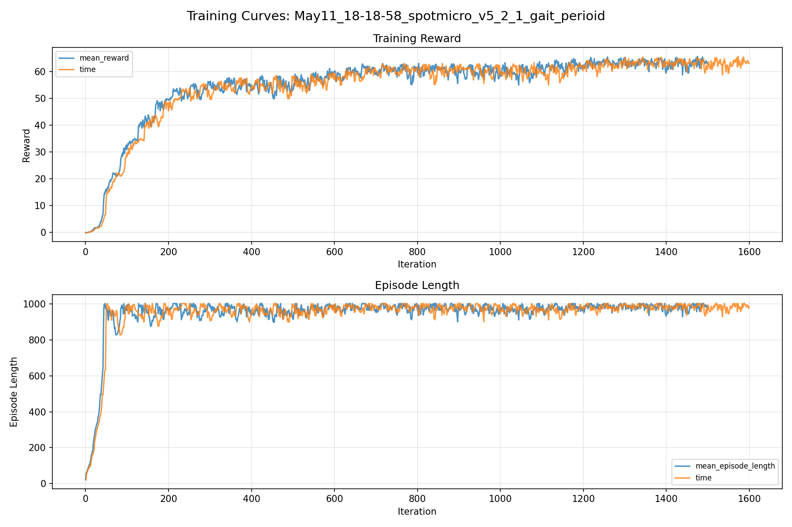
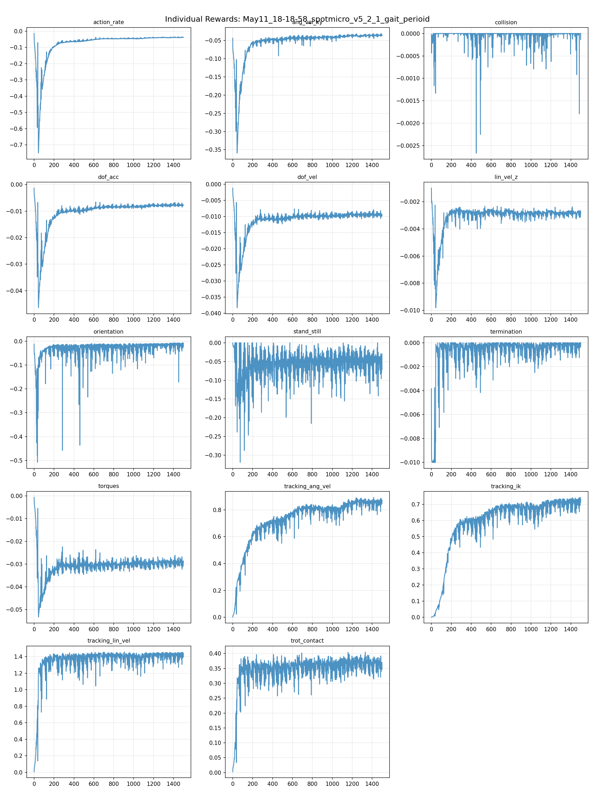
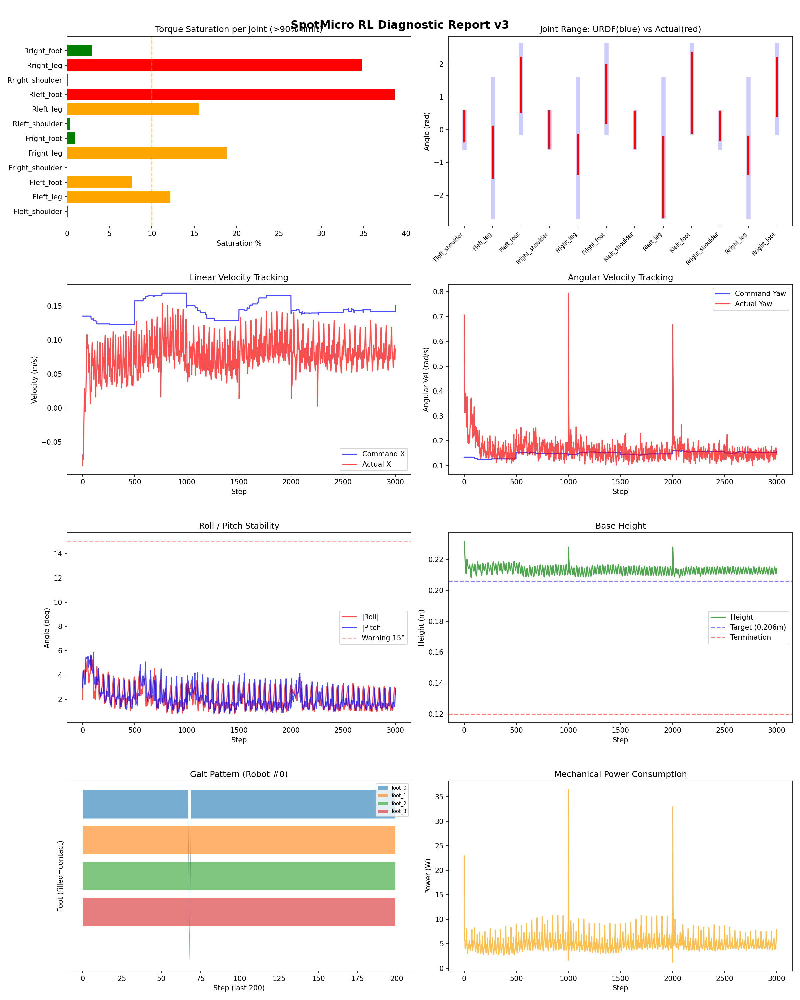

# 실험 046: spotmicro_v5_2_1_gait_perioid

- **날짜:** 2026-05-11 18:47
- **Task:** spotmicro_test
- **Run name:** `spotmicro_v5_2_1_gait_perioid`
- **판정:** ✅ PASS

---

## 실험 목적

V5.2.1: gait period 수치 조정

---

## 변경점 (이전 커밋 대비)

```diff
diff --git a/ai_training/rl/legged_gym/legged_gym/envs/spotmicro_test/spotmicro_test.py b/ai_training/rl/legged_gym/legged_gym/envs/spotmicro_test/spotmicro_test.py
index 7eda3af..06b31cc 100644
--- a/ai_training/rl/legged_gym/legged_gym/envs/spotmicro_test/spotmicro_test.py
+++ b/ai_training/rl/legged_gym/legged_gym/envs/spotmicro_test/spotmicro_test.py
@@ -21,8 +21,8 @@ class SpotmicroTest(LeggedRobot):
         self.robot_width = 0.15
 
         self.gait_period = 1.0
-        self.duty_factor = 0.6
-        self.step_height = 0.015
+        self.duty_factor = 0.55
+        self.step_height = 0.025
         self.body_height = 0.206
 
         self.gait_phase = torch.zeros(self.num_envs, 1, dtype=torch.float, device=self.device)
@@ -278,11 +278,15 @@ class SpotmicroTest(LeggedRobot):
         vx = self.commands[:, 0]
         wz = self.commands[:, 2] 
 
+        
         v_left = vx - (wz * self.robot_width / 2.0)
         v_right = vx + (wz * self.robot_width / 2.0)
         stance_time = self.gait_period * self.duty_factor
-        stride_l = v_left * stance_time
-        stride_r = v_right * stance_time
+        max_stride = 0.12
+        raw_stride_l = v_left * stance_time
+        stride_l = torch.clamp(raw_stride_l, -max_stride, max_stride)
+        raw_stride_r = v_right * stance_time
+        stride_r = torch.clamp(raw_stride_r, -max_stride, max_stride)
         strides = torch.stack([stride_l, stride_r, stride_l, stride_r], dim=1)
         offsets = torch.tensor([0.0, 0.5, 0.5, 0.0], device=self.device)
         phases = (self.gait_phase + offsets) % 1.0
diff --git a/ai_training/rl/legged_gym/legged_gym/envs/spotmicro_test/spotmicro_test_config.py b/ai_training/rl/legged_gym/legged_gym/envs/spotmicro_test/spotmicro_test_config.py
index 4524275..c9225b2 100644
--- a/ai_training/rl/legged_gym/legged_gym/envs/spotmicro_test/spotmicro_test_config.py
+++ b/ai_training/rl/legged_gym/legged_gym/envs/spotmicro_test/spotmicro_test_config.py
@@ -123,7 +123,7 @@ class SpotmicroTestCfgPPO(LeggedRobotCfgPPO):
         entropy_coef = 0.01
 
     class runner(LeggedRobotCfgPPO.runner):
-        run_name = 'spotmicro_v5_2_gait_period'
+        run_name = 'spotmicro_v5_2_1_gait_perioid'
         experiment_name = 'spotmicro_test'
         max_iterations = 1500
         save_interval = 100
```

**변경 요약:**
  - self.duty_factor = 0.6
  - self.step_height = 0.015
  + self.duty_factor = 0.55
  + self.step_height = 0.025
  - stride_l = v_left * stance_time
  - stride_r = v_right * stance_time
  + max_stride = 0.12
  + raw_stride_l = v_left * stance_time
  + stride_l = torch.clamp(raw_stride_l, -max_stride, max_stride)
  + raw_stride_r = v_right * stance_time
  + stride_r = torch.clamp(raw_stride_r, -max_stride, max_stride)
  - run_name = 'spotmicro_v5_2_gait_period'
  + run_name = 'spotmicro_v5_2_1_gait_perioid'

---

## 현재 Reward Scales

| Reward | Scale |
|--------|-------|
| action_rate | -0.05 |
| ang_vel_xy | -0.4 |
| collision | -1.0 |
| dof_acc | -2.5e-07 |
| dof_vel | -0.001 |
| lin_vel_z | -2.0 |
| orientation | -6.0 |
| stand_still | -0.5 |
| termination | -10.0 |
| torques | -0.001 |
| tracking_ang_vel | 1.3 |
| tracking_ik | 1.0 |
| tracking_lin_vel | 1.5 |
| trot_contact | 0.5 |

---

## 진단 결과 (Diagnostic)

### 핵심 지표

- ✅ Timeout: 90.7% (≥80%)
- ✅ 속도오차 X: 0.0778 m/s (<0.08)
- ⚠️ 토크포화: 11.0% (10~40%)
- ✅ 자세: roll 2.2°, pitch 2.2° (안정)
- ✅ 조기종료: 0.0% (<5%)

### 상세 수치

| 지표 | 값 |
|------|-----|
| Timeout% | 90.71428571428571 |
| 조기종료% | 0.0 |
| 속도오차 X | 0.0778280645608902 m/s |
| 속도오차 Y | 0.04146339371800423 m/s |
| 각속도오차 | 0.13913190364837646 rad/s |
| 토크포화% | 11.01064733877234 |
| 평균 높이 | 0.21302789142042092 m |
| Roll (평균) | 2.2118630409240723° |
| Pitch (평균) | 2.151259422302246° |
| Action Rate | 0.005558726377785206 |
| 평균 전력 | 5.078323841094971 W |
| CoT | 2.4737412863448722 |

## Command Mode별 회전 추종 분석

| 모드 | 비율 | 샘플 수 | 평균 abs(cmd_wz) | 평균 abs(actual_wz) | yaw 오차 | 상태 |
|------|------|---------|------------------|---------------------|----------|------|
| 정지 | 3.4% | 6506 | 0.0311 | 0.0906 | 0.0953 | ❌ |
| 직진/저회전 | 40.8% | 78445 | 0.0750 | 0.1444 | 0.1376 | ⚠️ |
| 제자리 회전 | 7.0% | 13515 | 0.2226 | 0.1465 | 0.1492 | ⚠️ |
| 전진+회전 | 42.9% | 82370 | 0.2194 | 0.1953 | 0.1461 | ⚠️ |
| 큰 회전명령 | 0.0% | 0 | N/A | N/A | N/A | N/A |

> 해석 기준: `제자리 회전`만 나쁘면 pure turn 학습/보행 패턴 문제, `큰 회전명령`만 나쁘면 yaw 명령 범위가 현재 토크/보폭 한계보다 큰 문제, `정지`가 나쁘면 stop drift 문제로 보면 됩니다.
        


## 학습 곡선 분석

| 지표 | 값 | 판정 |
|------|-----|------|
| 수렴 iter (90%) | 549 | 보통 |
| 후반 안정성 (CV) | 0.033 | 안정 |
| 정체 구간 | 없음 | |


## Per-leg 분석

### 발별 접촉/공중 비율

| 발 | 접촉% | 공중% |
|-----|-------|------|
| foot_0 | 81.6% | 18.4% |
| foot_1 | 81.7% | 18.3% |
| foot_2 | 74.6% | 25.4% |
| foot_3 | 79.1% | 20.9% |

### 관절별 토크 포화

| 관절 | 포화% | 최대토크 | 한계 | 상태 |
|------|------|---------|------|------|
| front_left_shoulder | 0.1% | 2.940 | 2.940 | ✅ |
| front_left_leg | 12.2% | 2.940 | 2.940 | ⚠️ |
| front_left_foot | 7.6% | 2.940 | 2.940 | ⚠️ |
| front_right_shoulder | 0.0% | 2.940 | 2.940 | ✅ |
| front_right_leg | 18.8% | 2.940 | 2.940 | ⚠️ |
| front_right_foot | 0.9% | 2.940 | 2.940 | ✅ |
| rear_left_shoulder | 0.4% | 2.940 | 2.940 | ✅ |
| rear_left_leg | 15.6% | 2.940 | 2.940 | ⚠️ |
| rear_left_foot | 38.7% | 2.940 | 2.940 | ❌ |
| rear_right_shoulder | 0.1% | 2.940 | 2.940 | ✅ |
| rear_right_leg | 34.8% | 2.940 | 2.940 | ❌ |
| rear_right_foot | 2.9% | 2.940 | 2.940 | ✅ |


## Gait 분석

| 지표 | 값 |
|------|-----|
| Gait 주파수 | 1.00 Hz |
| Gait 주기 | 50 steps |
| 대각 동기화율 | 86.6% |
| L/R 비대칭 | 0.0%p |
| 판정 | ✅ Trot 패턴 / ✅ 대칭 |


## 관절별 상세

| 관절 | 토크포화% | 사용범위% | 편향(rad) | 한계근접% | 상태 |
|------|----------|----------|----------|----------|------|
| front_left_shoulder | 0.1% | 83% | +0.098 | 0.1% | ✅ |
| front_left_leg | 12.2% | 37% | -0.691 | 0.0% | ⚠️ |
| front_left_foot | 7.6% | 61% | +1.375 | 0.0% | ⚠️ |
| front_right_shoulder | 0.0% | 101% | +0.005 | 0.1% | ✅ |
| front_right_leg | 18.8% | 28% | -0.759 | 0.0% | ⚠️ |
| front_right_foot | 0.9% | 65% | +1.088 | 0.0% | ⚠️ |
| rear_left_shoulder | 0.4% | 101% | -0.003 | 0.4% | ✅ |
| rear_left_leg | 15.6% | 58% | -1.455 | 0.0% | ⚠️ |
| rear_left_foot | 38.7% | 91% | +1.124 | 0.0% | ⚠️ |
| rear_right_shoulder | 0.1% | 79% | +0.119 | 0.2% | ⚠️ |
| rear_right_leg | 34.8% | 27% | -0.784 | 0.0% | ⚠️ |
| rear_right_foot | 2.9% | 66% | +1.296 | 0.0% | ⚠️ |


## 에너지 효율 상세

| 지표 | 값 |
|------|-----|
| 평균 전력 | 5.08 W |
| 피크 전력 | 36.42 W |
| 피크/평균 비율 | 7.2x |
| CoT | 2.47 |

### 관절별 전력 분배

| 관절 | 평균전력(W) | 비율% |
|------|-----------|-------|
| rear_left_foot | 0.923 | 18.2% |
| front_left_foot | 0.893 | 17.6% |
| rear_right_foot | 0.577 | 11.4% |
| front_right_foot | 0.557 | 11.0% |
| rear_right_leg | 0.491 | 9.7% |
| front_right_leg | 0.482 | 9.5% |
| rear_left_leg | 0.472 | 9.3% |
| front_left_leg | 0.432 | 8.5% |
| rear_right_shoulder | 0.076 | 1.5% |
| front_left_shoulder | 0.074 | 1.5% |
| rear_left_shoulder | 0.052 | 1.0% |
| front_right_shoulder | 0.048 | 0.9% |


## 이전 실험 대비 비교

| 지표 | 이전 (exp045) | 현재 (exp046) | 변화 |
|------|-------|-------|------|
| Timeout% | 81.5% | 90.7% | ✅ ↑ 9.1856% |
| 속도오차 X | 0.1121 | 0.0778 | ✅ ↓ 0.0342m/s |
| 토크포화 | 6.3% | 11.0% | ⚠️ ↑ 4.6610% |
| Roll | 2.3° | 2.2° | ✅ ↓ 0.0926° |
| Pitch | 2.4° | 2.2° | ✅ ↓ 0.1997° |
| 평균 전력 | 4.9833W | 5.0783W | ⚠️ ↑ 0.0950W |


## Tensorboard 학습 곡선 요약

| 스칼라 | 최종값 | 최대 | 최소 | 후반10% 평균 |
|--------|--------|------|------|-------------|
| rew_action_rate | -0.0385 | -0.0146 | -0.7500 | -0.0390 |
| rew_ang_vel_xy | -0.0349 | -0.0310 | -0.3593 | -0.0361 |
| rew_collision | 0.0000 | 0.0000 | -0.0027 | -0.0000 |
| rew_dof_acc | -0.0077 | -0.0013 | -0.0464 | -0.0078 |
| rew_dof_vel | -0.0094 | -0.0012 | -0.0383 | -0.0094 |
| rew_lin_vel_z | -0.0027 | -0.0010 | -0.0098 | -0.0028 |
| rew_orientation | -0.0083 | -0.0067 | -0.5079 | -0.0182 |
| rew_stand_still | -0.0712 | 0.0000 | -0.3191 | -0.0518 |
| rew_termination | 0.0000 | 0.0000 | -0.0100 | -0.0003 |
| rew_torques | -0.0293 | -0.0007 | -0.0532 | -0.0294 |
| rew_tracking_ang_vel | 0.8722 | 0.8922 | 0.0022 | 0.8512 |
| rew_tracking_ik | 0.7317 | 0.7425 | 0.0012 | 0.7075 |
| rew_tracking_lin_vel | 1.4396 | 1.4570 | 0.0071 | 1.4116 |
| rew_trot_contact | 0.3474 | 0.4052 | 0.0030 | 0.3628 |
| learning_rate | 0.0004 | 0.0100 | 0.0000 | 0.0003 |
| surrogate | -0.0020 | 0.0021 | -0.0078 | -0.0029 |
| value_function | 0.0202 | 0.1023 | 0.0031 | 0.0130 |
| collection time | 0.7830 | 0.9893 | 0.7345 | 0.7740 |
| learning_time | 0.2816 | 0.3444 | 0.2700 | 0.2863 |
| total_fps | 92332.0000 | 96322.0000 | 76460.0000 | 92730.6400 |
| mean_noise_std | 0.1614 | 0.9994 | 0.1565 | 0.1633 |
| mean_episode_length | 985.2300 | 1002.0000 | 21.7100 | 980.9293 |
| time | 985.2300 | 1002.0000 | 21.7100 | 980.9293 |
| mean_reward | 63.2890 | 65.6274 | -0.1532 | 62.9759 |
| time | 63.2890 | 65.6274 | -0.1532 | 62.9759 |

총 학습 iteration: 1499


---

## 그래프

### Tensorboard 학습 곡선



### Diagnostic 결과



---

## 결론 및 다음 실험 방향

**자동 판정:** ✅ PASS

대부분 기준을 통과했으나 일부 항목이 보통 수준입니다.
  - ⚠️ 토크포화: 11.0% (10~40%)

> 💡 위 결론은 자동 생성되었습니다. 필요시 수정하세요.

---

## 메모

_(추가 메모가 있으면 여기에 작성)_

