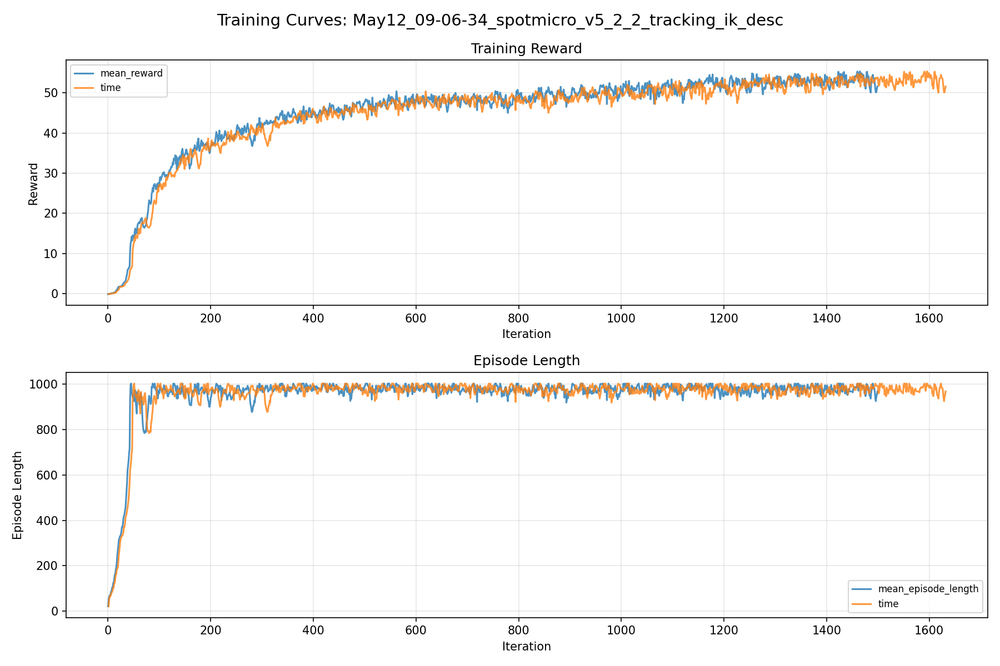
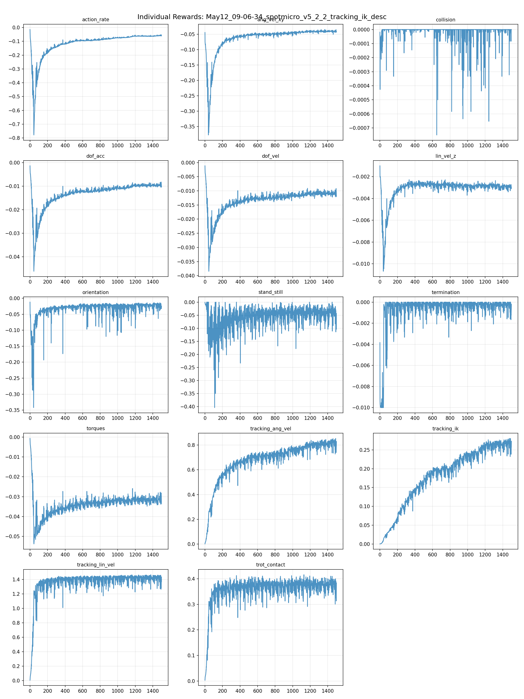
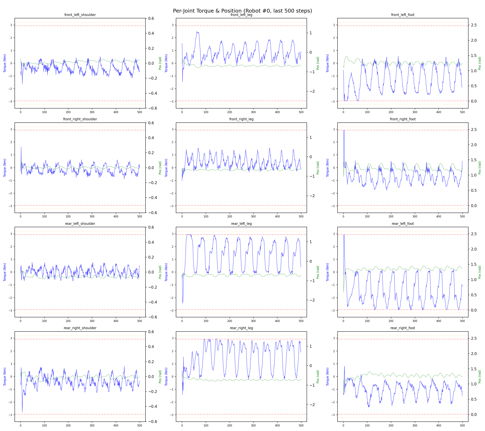
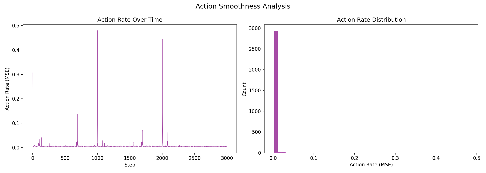

# 실험 047: spotmicro_v5_2_2_tracking_ik_desc

- **날짜:** 2026-05-12 09:35
- **Task:** spotmicro_test
- **Run name:** `spotmicro_v5_2_2_tracking_ik_desc`
- **판정:** ✅ PASS

---

## 실험 목적

V5.2.2: IK tracking 완화

---

## 변경점 (이전 커밋 대비)

```diff
diff --git a/ai_training/rl/legged_gym/legged_gym/envs/spotmicro_test/spotmicro_test_config.py b/ai_training/rl/legged_gym/legged_gym/envs/spotmicro_test/spotmicro_test_config.py
index c9225b2..757b667 100644
--- a/ai_training/rl/legged_gym/legged_gym/envs/spotmicro_test/spotmicro_test_config.py
+++ b/ai_training/rl/legged_gym/legged_gym/envs/spotmicro_test/spotmicro_test_config.py
@@ -67,7 +67,7 @@ class SpotmicroTestCfg(LeggedRobotCfg):
             symmetric_gait = 0.0
             feet_clearance = 0.0
             trot_contact = 0.5
-            tracking_ik = 1.0
+            tracking_ik = 0.5
             stand_still = -0.5
         soft_dof_pos_limit = 0.9
         base_height_target = 0.206
@@ -123,7 +123,7 @@ class SpotmicroTestCfgPPO(LeggedRobotCfgPPO):
         entropy_coef = 0.01
 
     class runner(LeggedRobotCfgPPO.runner):
-        run_name = 'spotmicro_v5_2_1_gait_perioid'
+        run_name = 'spotmicro_v5_2_2_tracking_ik_desc'
         experiment_name = 'spotmicro_test'
         max_iterations = 1500
         save_interval = 100
```

**변경 요약:**
  - tracking_ik = 1.0
  + tracking_ik = 0.5
  - run_name = 'spotmicro_v5_2_1_gait_perioid'
  + run_name = 'spotmicro_v5_2_2_tracking_ik_desc'

---

## 현재 Reward Scales

| Reward | Scale |
|--------|-------|
| action_rate | -0.05 |
| ang_vel_xy | -0.4 |
| collision | -1.0 |
| dof_acc | -2.5e-07 |
| dof_vel | -0.001 |
| lin_vel_z | -2.0 |
| orientation | -6.0 |
| stand_still | -0.5 |
| termination | -10.0 |
| torques | -0.001 |
| tracking_ang_vel | 1.3 |
| tracking_ik | 0.5 |
| tracking_lin_vel | 1.5 |
| trot_contact | 0.5 |

---

## 진단 결과 (Diagnostic)

### 핵심 지표

- ✅ Timeout: 90.7% (≥80%)
- ✅ 속도오차 X: 0.0778 m/s (<0.08)
- ⚠️ 토크포화: 11.0% (10~40%)
- ✅ 자세: roll 2.2°, pitch 2.2° (안정)
- ✅ 조기종료: 0.0% (<5%)

### 상세 수치

| 지표 | 값 |
|------|-----|
| Timeout% | 90.71428571428571 |
| 조기종료% | 0.0 |
| 속도오차 X | 0.0778280645608902 m/s |
| 속도오차 Y | 0.04146339371800423 m/s |
| 각속도오차 | 0.13913190364837646 rad/s |
| 토크포화% | 11.01064733877234 |
| 평균 높이 | 0.21302789142042092 m |
| Roll (평균) | 2.2118630409240723° |
| Pitch (평균) | 2.151259422302246° |
| Action Rate | 0.005558726377785206 |
| 평균 전력 | 5.078323841094971 W |
| CoT | 2.4737412863448722 |

## Command Mode별 회전 추종 분석

| 모드 | 비율 | 샘플 수 | 평균 abs(cmd_wz) | 평균 abs(actual_wz) | yaw 오차 | 상태 |
|------|------|---------|------------------|---------------------|----------|------|
| 정지 | 3.4% | 6506 | 0.0311 | 0.0906 | 0.0953 | ❌ |
| 직진/저회전 | 40.8% | 78445 | 0.0750 | 0.1444 | 0.1376 | ⚠️ |
| 제자리 회전 | 7.0% | 13515 | 0.2226 | 0.1465 | 0.1492 | ⚠️ |
| 전진+회전 | 42.9% | 82370 | 0.2194 | 0.1953 | 0.1461 | ⚠️ |
| 큰 회전명령 | 0.0% | 0 | N/A | N/A | N/A | N/A |

> 해석 기준: `제자리 회전`만 나쁘면 pure turn 학습/보행 패턴 문제, `큰 회전명령`만 나쁘면 yaw 명령 범위가 현재 토크/보폭 한계보다 큰 문제, `정지`가 나쁘면 stop drift 문제로 보면 됩니다.
        


## 학습 곡선 분석

| 지표 | 값 | 판정 |
|------|-----|------|
| 수렴 iter (90%) | 562 | 보통 |
| 후반 안정성 (CV) | 0.038 | 안정 |
| 정체 구간 | 없음 | |


## Per-leg 분석

### 발별 접촉/공중 비율

| 발 | 접촉% | 공중% |
|-----|-------|------|
| foot_0 | 81.6% | 18.4% |
| foot_1 | 81.7% | 18.3% |
| foot_2 | 74.6% | 25.4% |
| foot_3 | 79.1% | 20.9% |

### 관절별 토크 포화

| 관절 | 포화% | 최대토크 | 한계 | 상태 |
|------|------|---------|------|------|
| front_left_shoulder | 0.1% | 2.940 | 2.940 | ✅ |
| front_left_leg | 12.2% | 2.940 | 2.940 | ⚠️ |
| front_left_foot | 7.6% | 2.940 | 2.940 | ⚠️ |
| front_right_shoulder | 0.0% | 2.940 | 2.940 | ✅ |
| front_right_leg | 18.8% | 2.940 | 2.940 | ⚠️ |
| front_right_foot | 0.9% | 2.940 | 2.940 | ✅ |
| rear_left_shoulder | 0.4% | 2.940 | 2.940 | ✅ |
| rear_left_leg | 15.6% | 2.940 | 2.940 | ⚠️ |
| rear_left_foot | 38.7% | 2.940 | 2.940 | ❌ |
| rear_right_shoulder | 0.1% | 2.940 | 2.940 | ✅ |
| rear_right_leg | 34.8% | 2.940 | 2.940 | ❌ |
| rear_right_foot | 2.9% | 2.940 | 2.940 | ✅ |


## Gait 분석

| 지표 | 값 |
|------|-----|
| Gait 주파수 | 1.00 Hz |
| Gait 주기 | 50 steps |
| 대각 동기화율 | 86.6% |
| L/R 비대칭 | 0.0%p |
| 판정 | ✅ Trot 패턴 / ✅ 대칭 |


## 관절별 상세

| 관절 | 토크포화% | 사용범위% | 편향(rad) | 한계근접% | 상태 |
|------|----------|----------|----------|----------|------|
| front_left_shoulder | 0.1% | 83% | +0.098 | 0.1% | ✅ |
| front_left_leg | 12.2% | 37% | -0.691 | 0.0% | ⚠️ |
| front_left_foot | 7.6% | 61% | +1.375 | 0.0% | ⚠️ |
| front_right_shoulder | 0.0% | 101% | +0.005 | 0.1% | ✅ |
| front_right_leg | 18.8% | 28% | -0.759 | 0.0% | ⚠️ |
| front_right_foot | 0.9% | 65% | +1.088 | 0.0% | ⚠️ |
| rear_left_shoulder | 0.4% | 101% | -0.003 | 0.4% | ✅ |
| rear_left_leg | 15.6% | 58% | -1.455 | 0.0% | ⚠️ |
| rear_left_foot | 38.7% | 91% | +1.124 | 0.0% | ⚠️ |
| rear_right_shoulder | 0.1% | 79% | +0.119 | 0.2% | ⚠️ |
| rear_right_leg | 34.8% | 27% | -0.784 | 0.0% | ⚠️ |
| rear_right_foot | 2.9% | 66% | +1.296 | 0.0% | ⚠️ |


## 에너지 효율 상세

| 지표 | 값 |
|------|-----|
| 평균 전력 | 5.08 W |
| 피크 전력 | 36.42 W |
| 피크/평균 비율 | 7.2x |
| CoT | 2.47 |

### 관절별 전력 분배

| 관절 | 평균전력(W) | 비율% |
|------|-----------|-------|
| rear_left_foot | 0.923 | 18.2% |
| front_left_foot | 0.893 | 17.6% |
| rear_right_foot | 0.577 | 11.4% |
| front_right_foot | 0.557 | 11.0% |
| rear_right_leg | 0.491 | 9.7% |
| front_right_leg | 0.482 | 9.5% |
| rear_left_leg | 0.472 | 9.3% |
| front_left_leg | 0.432 | 8.5% |
| rear_right_shoulder | 0.076 | 1.5% |
| front_left_shoulder | 0.074 | 1.5% |
| rear_left_shoulder | 0.052 | 1.0% |
| front_right_shoulder | 0.048 | 0.9% |


## 이전 실험 대비 비교

| 지표 | 이전 (exp046) | 현재 (exp047) | 변화 |
|------|-------|-------|------|
| Timeout% | 90.7% | 90.7% | → 유지 |
| 속도오차 X | 0.0778 | 0.0778 | → 유지 |
| 토크포화 | 11.0% | 11.0% | → 유지 |
| Roll | 2.2° | 2.2° | → 유지 |
| Pitch | 2.2° | 2.2° | → 유지 |
| 평균 전력 | 5.0783W | 5.0783W | → 유지 |


## Tensorboard 학습 곡선 요약

| 스칼라 | 최종값 | 최대 | 최소 | 후반10% 평균 |
|--------|--------|------|------|-------------|
| rew_action_rate | -0.0606 | -0.0146 | -0.7779 | -0.0609 |
| rew_ang_vel_xy | -0.0409 | -0.0342 | -0.3772 | -0.0400 |
| rew_collision | 0.0000 | 0.0000 | -0.0008 | -0.0000 |
| rew_dof_acc | -0.0103 | -0.0013 | -0.0462 | -0.0096 |
| rew_dof_vel | -0.0119 | -0.0012 | -0.0384 | -0.0109 |
| rew_lin_vel_z | -0.0030 | -0.0010 | -0.0107 | -0.0029 |
| rew_orientation | -0.0244 | -0.0122 | -0.3421 | -0.0233 |
| rew_stand_still | -0.0434 | 0.0000 | -0.4034 | -0.0455 |
| rew_termination | -0.0002 | 0.0000 | -0.0100 | -0.0003 |
| rew_torques | -0.0336 | -0.0007 | -0.0538 | -0.0316 |
| rew_tracking_ang_vel | 0.8285 | 0.8536 | 0.0022 | 0.8113 |
| rew_tracking_ik | 0.2727 | 0.2803 | 0.0006 | 0.2642 |
| rew_tracking_lin_vel | 1.4322 | 1.4659 | 0.0071 | 1.4149 |
| rew_trot_contact | 0.3840 | 0.4159 | 0.0030 | 0.3726 |
| learning_rate | 0.0004 | 0.0100 | 0.0000 | 0.0004 |
| surrogate | -0.0034 | 0.0013 | -0.0070 | -0.0033 |
| value_function | 0.0110 | 0.0853 | 0.0031 | 0.0118 |
| collection time | 0.7876 | 1.1609 | 0.7466 | 0.7828 |
| learning_time | 0.2890 | 0.3510 | 0.2733 | 0.2878 |
| total_fps | 91310.0000 | 95031.0000 | 67026.0000 | 91839.2733 |
| mean_noise_std | 0.2022 | 0.9997 | 0.1995 | 0.2063 |
| mean_episode_length | 967.7200 | 1002.0000 | 21.7100 | 977.5769 |
| time | 967.7200 | 1002.0000 | 21.7100 | 977.5769 |
| mean_reward | 51.5748 | 55.3453 | -0.1535 | 53.0629 |
| time | 51.5748 | 55.3453 | -0.1535 | 53.0629 |

총 학습 iteration: 1499


---

## 그래프

### Tensorboard 학습 곡선



### Diagnostic 결과





---

## 결론 및 다음 실험 방향

**자동 판정:** ✅ PASS

대부분 기준을 통과했으나 일부 항목이 보통 수준입니다.
  - ⚠️ 토크포화: 11.0% (10~40%)

> 💡 위 결론은 자동 생성되었습니다. 필요시 수정하세요.

---

## 메모

_(추가 메모가 있으면 여기에 작성)_

