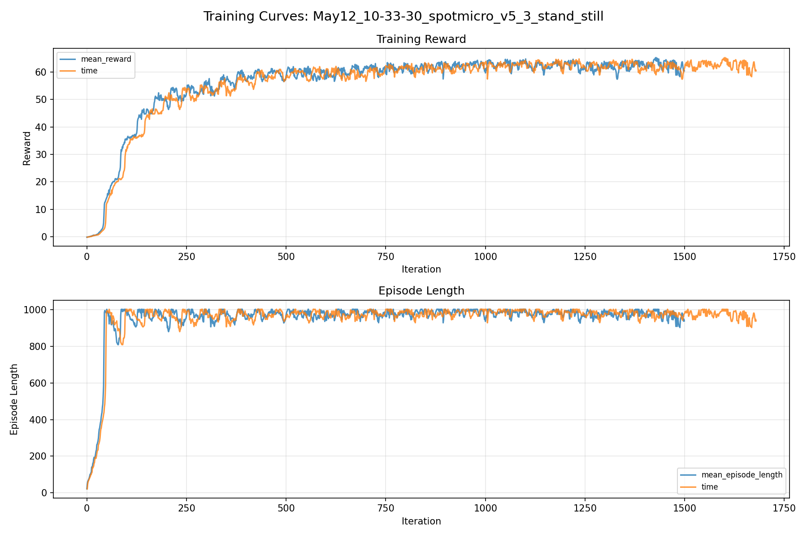
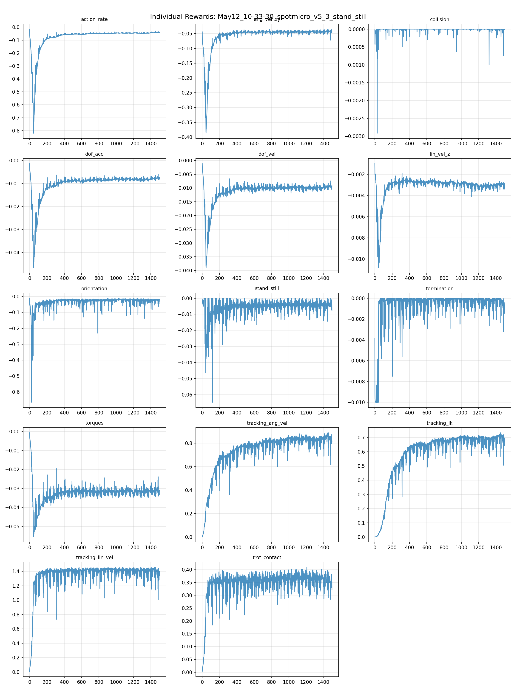
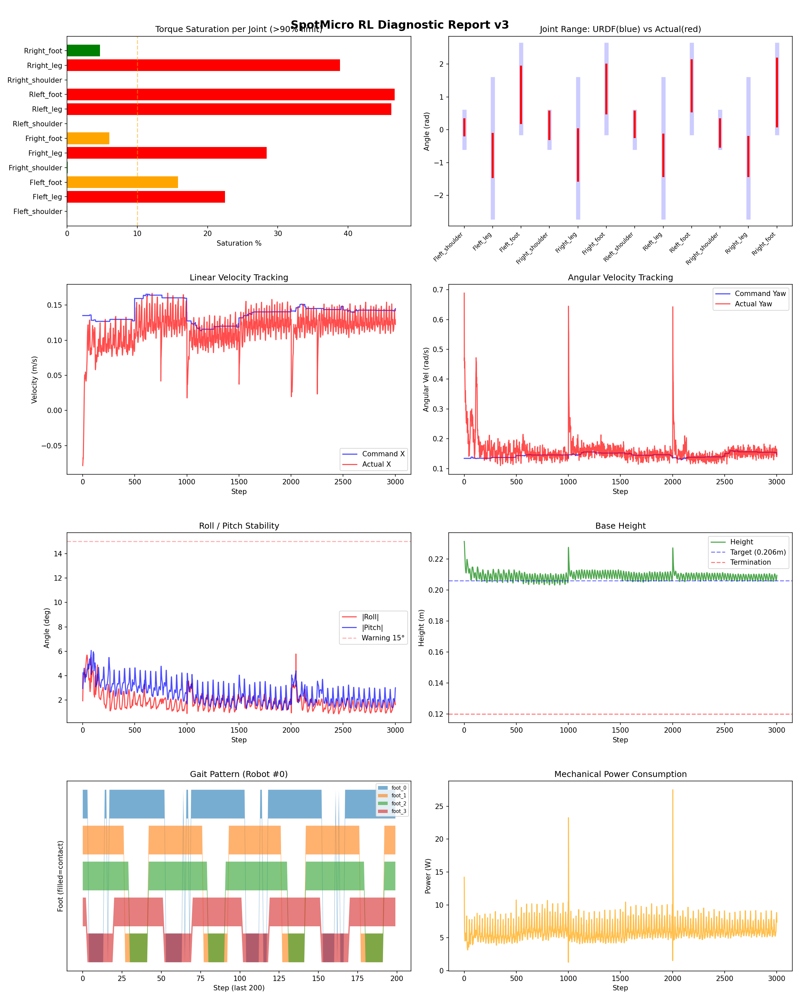
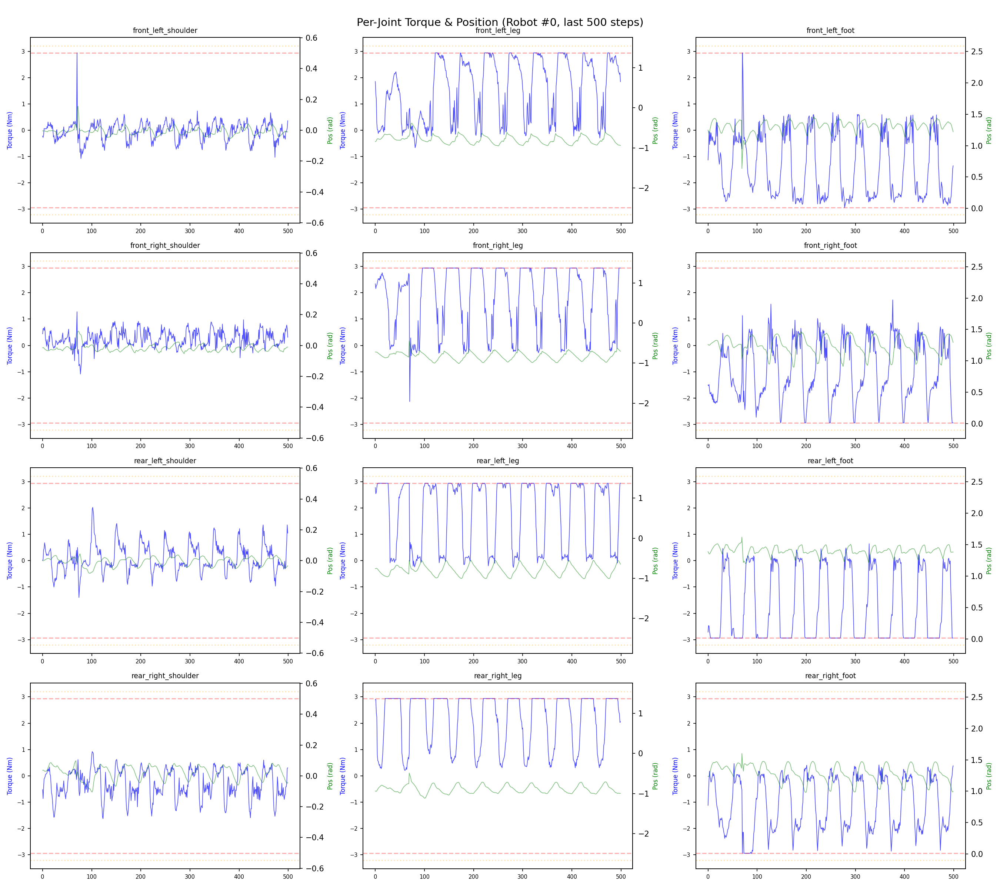
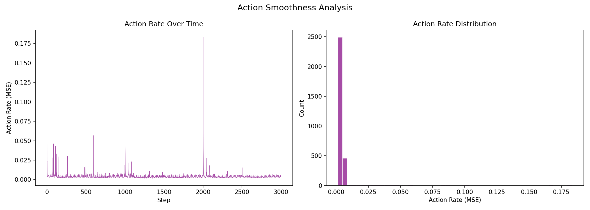

# 실험 051: spotmicro_v5_3_stand_still

- **날짜:** 2026-05-12 11:03
- **Task:** spotmicro_test
- **Run name:** `spotmicro_v5_3_stand_still`
- **판정:** ✅ PASS

---

## 실험 목적

V5.3: 정지상태 yaw 오차 감소

---

## 변경점 (이전 커밋 대비)

```diff
diff --git a/ai_training/rl/legged_gym/legged_gym/envs/spotmicro_test/spotmicro_test.py b/ai_training/rl/legged_gym/legged_gym/envs/spotmicro_test/spotmicro_test.py
index 06b31cc..44d7e17 100644
--- a/ai_training/rl/legged_gym/legged_gym/envs/spotmicro_test/spotmicro_test.py
+++ b/ai_training/rl/legged_gym/legged_gym/envs/spotmicro_test/spotmicro_test.py
@@ -272,7 +272,15 @@ class SpotmicroTest(LeggedRobot):
         
     def _reward_stand_still(self):
         cmd_norm = torch.norm(self.commands[:, :3], dim=1)
-        return torch.sum(torch.abs(self.dof_pos - self.default_dof_pos), dim=1) * (cmd_norm < 0.1)
+        is_stand = (cmd_norm < 0.1).float()
+
+        lin_penalty = torch.sum(torch.square(self.base_lin_vel[:, :2]), dim=1)
+        yaw_penalty = torch.square(self.base_ang_vel[:, 2])
+        pose_penalty = 0.2 * torch.sum(
+            torch.square(self.dof_pos - self.default_dof_pos), dim=1
+        )
+
+        return (lin_penalty + 0.5 * yaw_penalty + pose_penalty) * is_stand
 
     def _get_ik_target(self):
         vx = self.commands[:, 0]
diff --git a/ai_training/rl/legged_gym/legged_gym/envs/spotmicro_test/spotmicro_test_config.py b/ai_training/rl/legged_gym/legged_gym/envs/spotmicro_test/spotmicro_test_config.py
index 602830f..4c0f11c 100644
--- a/ai_training/rl/legged_gym/legged_gym/envs/spotmicro_test/spotmicro_test_config.py
+++ b/ai_training/rl/legged_gym/legged_gym/envs/spotmicro_test/spotmicro_test_config.py
@@ -123,7 +123,7 @@ class SpotmicroTestCfgPPO(LeggedRobotCfgPPO):
         entropy_coef = 0.01
 
     class runner(LeggedRobotCfgPPO.runner):
-        run_name = 'spotmicro_v5_2_2_tracking_ik_desc'
+        run_name = 'spotmicro_v5_3_stand_still'
         experiment_name = 'spotmicro_test'
         max_iterations = 1500
         save_interval = 100
```

**변경 요약:**
  - return torch.sum(torch.abs(self.dof_pos - self.default_dof_pos), dim=1) * (cmd_norm < 0.1)
  + is_stand = (cmd_norm < 0.1).float()
  + lin_penalty = torch.sum(torch.square(self.base_lin_vel[:, :2]), dim=1)
  + yaw_penalty = torch.square(self.base_ang_vel[:, 2])
  + pose_penalty = 0.2 * torch.sum(
  + torch.square(self.dof_pos - self.default_dof_pos), dim=1
  + )
  + return (lin_penalty + 0.5 * yaw_penalty + pose_penalty) * is_stand
  - run_name = 'spotmicro_v5_2_2_tracking_ik_desc'
  + run_name = 'spotmicro_v5_3_stand_still'

---

## 현재 Reward Scales

| Reward | Scale |
|--------|-------|
| action_rate | -0.05 |
| ang_vel_xy | -0.4 |
| collision | -1.0 |
| dof_acc | -2.5e-07 |
| dof_vel | -0.001 |
| lin_vel_z | -2.0 |
| orientation | -6.0 |
| stand_still | -0.5 |
| termination | -10.0 |
| torques | -0.001 |
| tracking_ang_vel | 1.3 |
| tracking_ik | 1.0 |
| tracking_lin_vel | 1.5 |
| trot_contact | 0.5 |

---

## 진단 결과 (Diagnostic)

### 핵심 지표

- ✅ Timeout: 89.5% (≥80%)
- ✅ 속도오차 X: 0.0458 m/s (<0.08)
- ⚠️ 토크포화: 17.4% (10~40%)
- ✅ 자세: roll 1.8°, pitch 2.6° (안정)
- ✅ 조기종료: 2.8% (<5%)

### 상세 수치

| 지표 | 값 |
|------|-----|
| Timeout% | 89.5104895104895 |
| 조기종료% | 2.797202797202797 |
| 속도오차 X | 0.04580022767186165 m/s |
| 속도오차 Y | 0.027541445568203926 m/s |
| 각속도오차 | 0.0888398066163063 rad/s |
| 토크포화% | 17.43408501221001 |
| 평균 높이 | 0.209021290907493 m |
| Roll (평균) | 1.84149169921875° |
| Pitch (평균) | 2.5702359676361084° |
| Action Rate | 0.004276870749890804 |
| 평균 전력 | 6.1257643699646 W |
| CoT | 2.0762818309275706 |

## Command Mode별 회전 추종 분석

| 모드 | 비율 | 샘플 수 | 평균 abs(cmd_wz) | 평균 abs(actual_wz) | yaw 오차 | 상태 |
|------|------|---------|------------------|---------------------|----------|------|
| 정지 | 2.9% | 5508 | 0.0231 | 0.0709 | 0.0741 | ❌ |
| 직진/저회전 | 43.8% | 84261 | 0.0755 | 0.1132 | 0.0876 | ⚠️ |
| 제자리 회전 | 8.0% | 15381 | 0.2336 | 0.1935 | 0.1008 | ⚠️ |
| 전진+회전 | 37.2% | 71540 | 0.2287 | 0.2215 | 0.0889 | ⚠️ |
| 큰 회전명령 | 0.0% | 0 | N/A | N/A | N/A | N/A |

> 해석 기준: `제자리 회전`만 나쁘면 pure turn 학습/보행 패턴 문제, `큰 회전명령`만 나쁘면 yaw 명령 범위가 현재 토크/보폭 한계보다 큰 문제, `정지`가 나쁘면 stop drift 문제로 보면 됩니다.
        


## 학습 곡선 분석

| 지표 | 값 | 판정 |
|------|-----|------|
| 수렴 iter (90%) | 343 | 빠름 |
| 후반 안정성 (CV) | 0.021 | 안정 |
| 정체 구간 | 없음 | |


## Per-leg 분석

### 발별 접촉/공중 비율

| 발 | 접촉% | 공중% |
|-----|-------|------|
| foot_0 | 74.6% | 25.4% |
| foot_1 | 75.7% | 24.3% |
| foot_2 | 73.5% | 26.5% |
| foot_3 | 68.0% | 32.0% |

### 관절별 토크 포화

| 관절 | 포화% | 최대토크 | 한계 | 상태 |
|------|------|---------|------|------|
| front_left_shoulder | 0.0% | 2.940 | 2.940 | ✅ |
| front_left_leg | 22.5% | 2.940 | 2.940 | ❌ |
| front_left_foot | 15.8% | 2.940 | 2.940 | ⚠️ |
| front_right_shoulder | 0.1% | 2.940 | 2.940 | ✅ |
| front_right_leg | 28.4% | 2.940 | 2.940 | ❌ |
| front_right_foot | 6.0% | 2.940 | 2.940 | ⚠️ |
| rear_left_shoulder | 0.0% | 2.940 | 2.940 | ✅ |
| rear_left_leg | 46.2% | 2.940 | 2.940 | ❌ |
| rear_left_foot | 46.6% | 2.940 | 2.940 | ❌ |
| rear_right_shoulder | 0.0% | 2.940 | 2.940 | ✅ |
| rear_right_leg | 38.9% | 2.940 | 2.940 | ❌ |
| rear_right_foot | 4.7% | 2.940 | 2.940 | ✅ |


## Gait 분석

| 지표 | 값 |
|------|-----|
| Gait 주파수 | 1.00 Hz |
| Gait 주기 | 50 steps |
| 대각 동기화율 | 84.2% |
| L/R 비대칭 | 0.0%p |
| 판정 | ✅ Trot 패턴 / ✅ 대칭 |


## 관절별 상세

| 관절 | 토크포화% | 사용범위% | 편향(rad) | 한계근접% | 상태 |
|------|----------|----------|----------|----------|------|
| front_left_shoulder | 0.0% | 45% | +0.074 | 0.0% | ✅ |
| front_left_leg | 22.5% | 31% | -0.784 | 0.0% | ⚠️ |
| front_left_foot | 15.8% | 64% | +1.064 | 0.0% | ⚠️ |
| front_right_shoulder | 0.1% | 76% | +0.135 | 0.0% | ⚠️ |
| front_right_leg | 28.4% | 37% | -0.765 | 0.0% | ⚠️ |
| front_right_foot | 6.0% | 55% | +1.246 | 0.0% | ⚠️ |
| rear_left_shoulder | 0.0% | 70% | +0.164 | 0.1% | ⚠️ |
| rear_left_leg | 46.2% | 30% | -0.780 | 0.0% | ⚠️ |
| rear_left_foot | 46.6% | 58% | +1.335 | 0.0% | ⚠️ |
| rear_right_shoulder | 0.0% | 75% | -0.096 | 0.0% | ✅ |
| rear_right_leg | 38.9% | 28% | -0.816 | 0.0% | ⚠️ |
| rear_right_foot | 4.7% | 77% | +1.136 | 0.0% | ⚠️ |


## 에너지 효율 상세

| 지표 | 값 |
|------|-----|
| 평균 전력 | 6.13 W |
| 피크 전력 | 27.50 W |
| 피크/평균 비율 | 4.5x |
| CoT | 2.08 |

### 관절별 전력 분배

| 관절 | 평균전력(W) | 비율% |
|------|-----------|-------|
| rear_left_foot | 1.171 | 19.1% |
| front_left_foot | 1.035 | 16.9% |
| front_right_foot | 0.842 | 13.7% |
| front_right_leg | 0.660 | 10.8% |
| rear_right_foot | 0.651 | 10.6% |
| front_left_leg | 0.538 | 8.8% |
| rear_right_leg | 0.513 | 8.4% |
| rear_left_leg | 0.511 | 8.3% |
| rear_right_shoulder | 0.077 | 1.3% |
| rear_left_shoulder | 0.049 | 0.8% |
| front_right_shoulder | 0.043 | 0.7% |
| front_left_shoulder | 0.037 | 0.6% |


## 이전 실험 대비 비교

| 지표 | 이전 (exp050) | 현재 (exp051) | 변화 |
|------|-------|-------|------|
| Timeout% | 94.8% | 89.5% | ⚠️ ↓ 5.3043% |
| 속도오차 X | 0.0502 | 0.0458 | ✅ ↓ 0.0044m/s |
| 토크포화 | 14.5% | 17.4% | ⚠️ ↑ 2.8993% |
| Roll | 1.6° | 1.8° | ⚠️ ↑ 0.1942° |
| Pitch | 1.6° | 2.6° | ⚠️ ↑ 0.9559° |
| 평균 전력 | 6.0831W | 6.1258W | ⚠️ ↑ 0.0426W |


## Tensorboard 학습 곡선 요약

| 스칼라 | 최종값 | 최대 | 최소 | 후반10% 평균 |
|--------|--------|------|------|-------------|
| rew_action_rate | -0.0400 | -0.0146 | -0.8205 | -0.0422 |
| rew_ang_vel_xy | -0.0413 | -0.0346 | -0.3872 | -0.0427 |
| rew_collision | 0.0000 | 0.0000 | -0.0029 | -0.0000 |
| rew_dof_acc | -0.0074 | -0.0013 | -0.0466 | -0.0078 |
| rew_dof_vel | -0.0092 | -0.0012 | -0.0390 | -0.0097 |
| rew_lin_vel_z | -0.0029 | -0.0010 | -0.0108 | -0.0031 |
| rew_orientation | -0.0191 | -0.0107 | -0.6651 | -0.0256 |
| rew_stand_still | -0.0076 | 0.0000 | -0.0648 | -0.0043 |
| rew_termination | -0.0007 | 0.0000 | -0.0100 | -0.0004 |
| rew_torques | -0.0310 | -0.0007 | -0.0555 | -0.0315 |
| rew_tracking_ang_vel | 0.8134 | 0.8890 | 0.0022 | 0.8358 |
| rew_tracking_ik | 0.6744 | 0.7335 | 0.0012 | 0.6902 |
| rew_tracking_lin_vel | 1.3453 | 1.4572 | 0.0071 | 1.3945 |
| rew_trot_contact | 0.3212 | 0.4092 | 0.0030 | 0.3579 |
| learning_rate | 0.0003 | 0.0076 | 0.0000 | 0.0003 |
| surrogate | -0.0025 | 0.0494 | -0.0100 | -0.0020 |
| value_function | 0.0125 | 0.2656 | 0.0025 | 0.0152 |
| collection time | 0.8234 | 1.0321 | 0.7580 | 0.8132 |
| learning_time | 0.2877 | 0.3441 | 0.2699 | 0.2886 |
| total_fps | 88473.0000 | 94197.0000 | 74201.0000 | 89281.5800 |
| mean_noise_std | 0.1793 | 0.9992 | 0.1598 | 0.1724 |
| mean_episode_length | 938.2700 | 1002.0000 | 21.7100 | 970.6315 |
| time | 938.2700 | 1002.0000 | 21.7100 | 970.6315 |
| mean_reward | 60.4459 | 65.2791 | -0.1532 | 62.4903 |
| time | 60.4459 | 65.2791 | -0.1532 | 62.4903 |

총 학습 iteration: 1499


---

## 그래프

### Tensorboard 학습 곡선



### Diagnostic 결과





---

## 결론 및 다음 실험 방향

**자동 판정:** ✅ PASS

대부분 기준을 통과했으나 일부 항목이 보통 수준입니다.
  - ⚠️ 토크포화: 17.4% (10~40%)

> 💡 위 결론은 자동 생성되었습니다. 필요시 수정하세요.

---

## 메모

_(추가 메모가 있으면 여기에 작성)_

