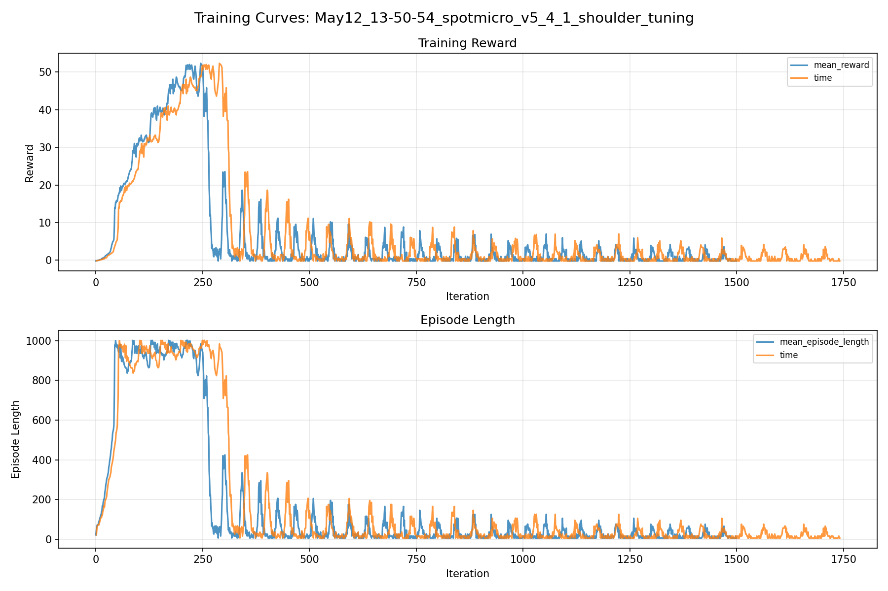
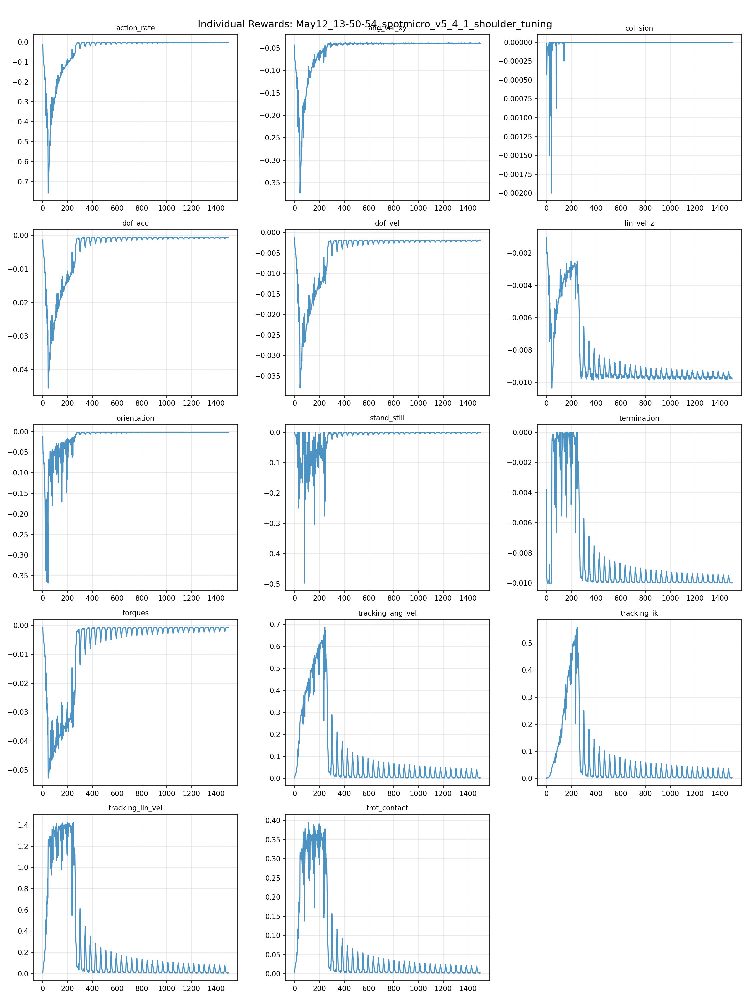
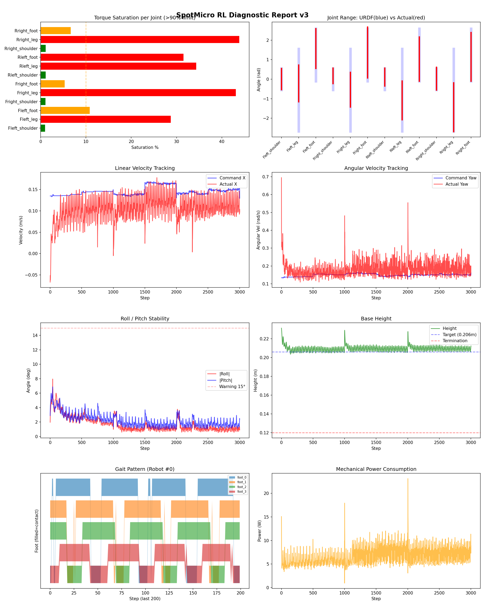
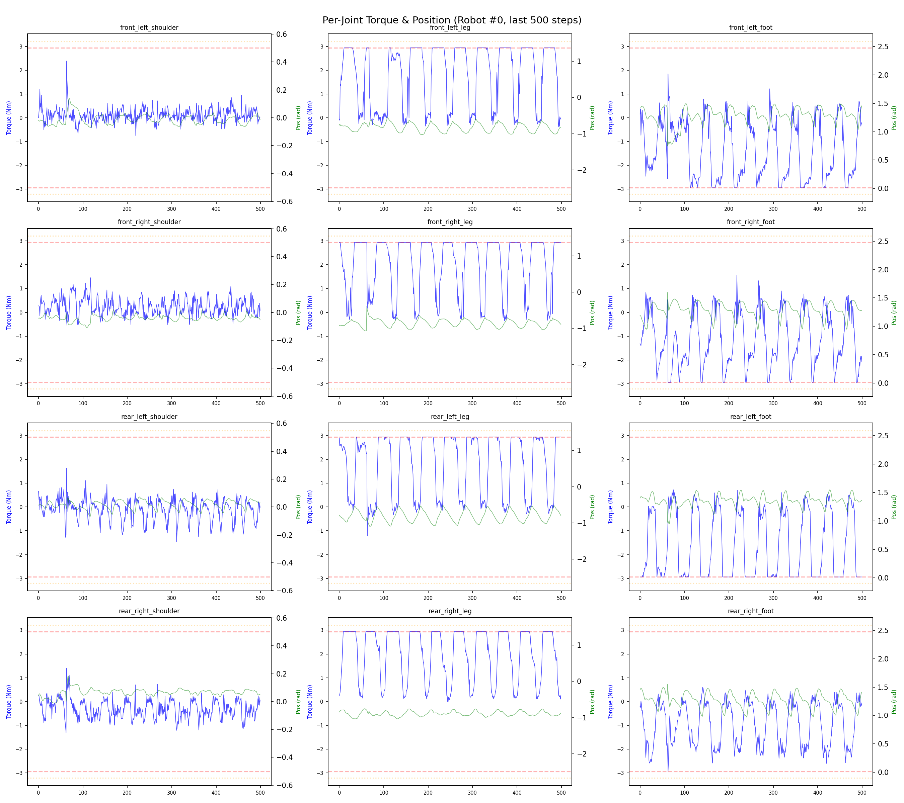
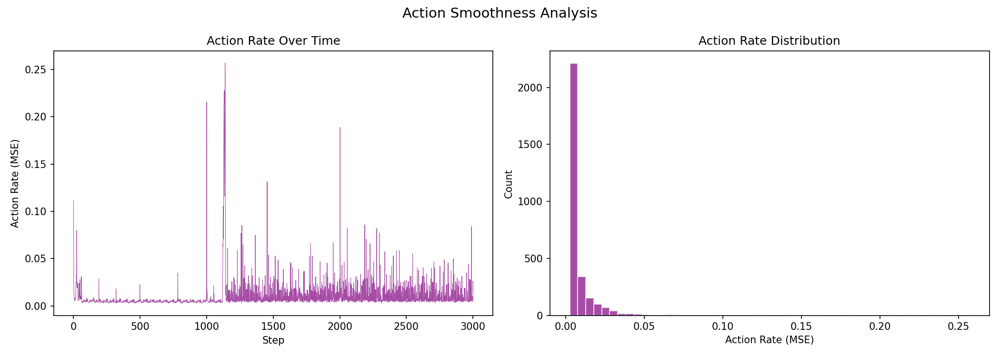

# 실험 053: spotmicro_v5_4_1_shoulder_tuning

- **날짜:** 2026-05-12 14:21
- **Task:** spotmicro_test
- **Run name:** `spotmicro_v5_4_1_shoulder_tuning`
- **판정:** ❌ FAIL (일부 기준 미달)

---

## 실험 목적

V5.4.1: shoulder ref 약화

---

## 변경점 (이전 커밋 대비)

```diff
diff --git a/ai_training/rl/legged_gym/legged_gym/envs/spotmicro_test/spotmicro_test.py b/ai_training/rl/legged_gym/legged_gym/envs/spotmicro_test/spotmicro_test.py
index c8b9d44..2fe2a81 100644
--- a/ai_training/rl/legged_gym/legged_gym/envs/spotmicro_test/spotmicro_test.py
+++ b/ai_training/rl/legged_gym/legged_gym/envs/spotmicro_test/spotmicro_test.py
@@ -51,9 +51,9 @@ class SpotmicroTest(LeggedRobot):
         )
 
         self.max_stride_x = 0.12
-        self.max_stride_y = 0.03
-        self.shoulder_y_gain = 1.0
-        self.shoulder_ref_limit = 0.10
+        self.max_stride_y = 0.02
+        self.shoulder_y_gain = 0.5
+        self.shoulder_ref_limit = 0.05
         # ==== Step 5: 서보 응답 지연 (substep 단위, dt=5ms 해상도) ====
         if self.cfg.domain_rand.action_delay:
             delay_range = self.cfg.domain_rand.action_delay_range
diff --git a/ai_training/rl/legged_gym/legged_gym/envs/spotmicro_test/spotmicro_test_config.py b/ai_training/rl/legged_gym/legged_gym/envs/spotmicro_test/spotmicro_test_config.py
index dcddc5b..d90cb63 100644
--- a/ai_training/rl/legged_gym/legged_gym/envs/spotmicro_test/spotmicro_test_config.py
+++ b/ai_training/rl/legged_gym/legged_gym/envs/spotmicro_test/spotmicro_test_config.py
@@ -123,7 +123,7 @@ class SpotmicroTestCfgPPO(LeggedRobotCfgPPO):
         entropy_coef = 0.01
 
     class runner(LeggedRobotCfgPPO.runner):
-        run_name = 'spotmicro_v5_4_IK_yaw'
+        run_name = 'spotmicro_v5_4_1_shoulder_tuning'
         experiment_name = 'spotmicro_test'
         max_iterations = 1500
         save_interval = 100
```

**변경 요약:**
  - self.max_stride_y = 0.03
  - self.shoulder_y_gain = 1.0
  - self.shoulder_ref_limit = 0.10
  + self.max_stride_y = 0.02
  + self.shoulder_y_gain = 0.5
  + self.shoulder_ref_limit = 0.05
  - run_name = 'spotmicro_v5_4_IK_yaw'
  + run_name = 'spotmicro_v5_4_1_shoulder_tuning'

---

## 현재 Reward Scales

| Reward | Scale |
|--------|-------|
| action_rate | -0.05 |
| ang_vel_xy | -0.4 |
| collision | -1.0 |
| dof_acc | -2.5e-07 |
| dof_vel | -0.001 |
| lin_vel_z | -2.0 |
| orientation | -6.0 |
| stand_still | -0.5 |
| termination | -10.0 |
| torques | -0.001 |
| tracking_ang_vel | 1.3 |
| tracking_ik | 1.0 |
| tracking_lin_vel | 1.5 |
| trot_contact | 0.5 |

---

## 진단 결과 (Diagnostic)

### 핵심 지표

- ❌ Timeout: 27.3% (<60%, 미달)
- ✅ 속도오차 X: 0.0603 m/s (<0.08)
- ⚠️ 토크포화: 17.4% (10~40%)
- ✅ 자세: roll 1.7°, pitch 2.2° (안정)
- ❌ 조기종료: 71.7% (>20%)

### 상세 수치

| 지표 | 값 |
|------|-----|
| Timeout% | 27.253218884120173 |
| 조기종료% | 71.67381974248927 |
| 속도오차 X | 0.06028043478727341 m/s |
| 속도오차 Y | 0.02871358022093773 m/s |
| 각속도오차 | 0.1184057667851448 rad/s |
| 토크포화% | 17.37537635975136 |
| 평균 높이 | 0.20959802997576726 m |
| Roll (평균) | 1.7040601968765259° |
| Pitch (평균) | 2.1936862468719482° |
| Action Rate | 0.009759251028299332 |
| 평균 전력 | 7.026157379150391 W |
| CoT | 2.5852412533405866 |

## Command Mode별 회전 추종 분석

| 모드 | 비율 | 샘플 수 | 평균 abs(cmd_wz) | 평균 abs(actual_wz) | yaw 오차 | 상태 |
|------|------|---------|------------------|---------------------|----------|------|
| 정지 | 2.9% | 5508 | 0.0261 | 0.0929 | 0.0958 | ❌ |
| 직진/저회전 | 40.8% | 78352 | 0.0708 | 0.1324 | 0.1140 | ⚠️ |
| 제자리 회전 | 8.0% | 15406 | 0.2258 | 0.2193 | 0.1178 | ⚠️ |
| 전진+회전 | 42.8% | 82326 | 0.2231 | 0.2271 | 0.1229 | ⚠️ |
| 큰 회전명령 | 0.0% | 0 | N/A | N/A | N/A | N/A |

> 해석 기준: `제자리 회전`만 나쁘면 pure turn 학습/보행 패턴 문제, `큰 회전명령`만 나쁘면 yaw 명령 범위가 현재 토크/보폭 한계보다 큰 문제, `정지`가 나쁘면 stop drift 문제로 보면 됩니다.
        


## 학습 곡선 분석

| 지표 | 값 | 판정 |
|------|-----|------|
| 수렴 iter (90%) | 180 | 빠름 |
| 후반 안정성 (CV) | 1.700 | 불안정 |
| 정체 구간 | 없음 | |


## Per-leg 분석

### 발별 접촉/공중 비율

| 발 | 접촉% | 공중% |
|-----|-------|------|
| foot_0 | 75.5% | 24.5% |
| foot_1 | 79.3% | 20.7% |
| foot_2 | 72.8% | 27.2% |
| foot_3 | 71.2% | 28.8% |

### 관절별 토크 포화

| 관절 | 포화% | 최대토크 | 한계 | 상태 |
|------|------|---------|------|------|
| front_left_shoulder | 1.0% | 2.940 | 2.940 | ✅ |
| front_left_leg | 28.7% | 2.940 | 2.940 | ❌ |
| front_left_foot | 10.8% | 2.940 | 2.940 | ⚠️ |
| front_right_shoulder | 1.0% | 2.940 | 2.940 | ✅ |
| front_right_leg | 43.1% | 2.940 | 2.940 | ❌ |
| front_right_foot | 5.3% | 2.940 | 2.940 | ⚠️ |
| rear_left_shoulder | 1.1% | 2.940 | 2.940 | ✅ |
| rear_left_leg | 34.4% | 2.940 | 2.940 | ❌ |
| rear_left_foot | 31.5% | 2.940 | 2.940 | ❌ |
| rear_right_shoulder | 1.1% | 2.940 | 2.940 | ✅ |
| rear_right_leg | 43.9% | 2.940 | 2.940 | ❌ |
| rear_right_foot | 6.6% | 2.940 | 2.940 | ⚠️ |


## Gait 분석

| 지표 | 값 |
|------|-----|
| Gait 주파수 | 1.00 Hz |
| Gait 주기 | 50 steps |
| 대각 동기화율 | 84.1% |
| L/R 비대칭 | 0.0%p |
| 판정 | ✅ Trot 패턴 / ✅ 대칭 |


## 관절별 상세

| 관절 | 토크포화% | 사용범위% | 편향(rad) | 한계근접% | 상태 |
|------|----------|----------|----------|----------|------|
| front_left_shoulder | 1.0% | 100% | +0.003 | 0.3% | ✅ |
| front_left_leg | 28.7% | 45% | -0.215 | 0.0% | ⚠️ |
| front_left_foot | 10.8% | 76% | +1.570 | 0.0% | ⚠️ |
| front_right_shoulder | 1.0% | 73% | +0.175 | 0.3% | ⚠️ |
| front_right_leg | 43.1% | 42% | -0.536 | 0.0% | ⚠️ |
| front_right_foot | 5.3% | 97% | +1.362 | 0.0% | ⚠️ |
| rear_left_shoulder | 1.1% | 84% | +0.109 | 0.0% | ⚠️ |
| rear_left_leg | 34.4% | 47% | -1.090 | 0.0% | ⚠️ |
| rear_left_foot | 31.5% | 84% | +1.029 | 0.0% | ⚠️ |
| rear_right_shoulder | 1.1% | 106% | +0.027 | 0.2% | ✅ |
| rear_right_leg | 43.9% | 59% | -1.435 | 0.0% | ⚠️ |
| rear_right_foot | 6.6% | 93% | +1.143 | 0.1% | ⚠️ |


## 에너지 효율 상세

| 지표 | 값 |
|------|-----|
| 평균 전력 | 7.03 W |
| 피크 전력 | 23.13 W |
| 피크/평균 비율 | 3.3x |
| CoT | 2.59 |

### 관절별 전력 분배

| 관절 | 평균전력(W) | 비율% |
|------|-----------|-------|
| front_left_foot | 1.066 | 15.2% |
| rear_left_foot | 1.055 | 15.0% |
| front_right_foot | 0.850 | 12.1% |
| rear_right_foot | 0.825 | 11.7% |
| front_right_leg | 0.815 | 11.6% |
| front_left_leg | 0.725 | 10.3% |
| rear_right_leg | 0.659 | 9.4% |
| rear_left_leg | 0.501 | 7.1% |
| rear_right_shoulder | 0.158 | 2.2% |
| front_right_shoulder | 0.152 | 2.2% |
| front_left_shoulder | 0.142 | 2.0% |
| rear_left_shoulder | 0.077 | 1.1% |


## 이전 실험 대비 비교

| 지표 | 이전 (exp052) | 현재 (exp053) | 변화 |
|------|-------|-------|------|
| Timeout% | 98.5% | 27.3% | ⚠️ ↓ 71.2083% |
| 속도오차 X | 0.0488 | 0.0603 | ⚠️ ↑ 0.0115m/s |
| 토크포화 | 14.2% | 17.4% | ⚠️ ↑ 3.1765% |
| Roll | 1.4° | 1.7° | ⚠️ ↑ 0.2858° |
| Pitch | 1.3° | 2.2° | ⚠️ ↑ 0.8799° |
| 평균 전력 | 5.9570W | 7.0262W | ⚠️ ↑ 1.0692W |


## Tensorboard 학습 곡선 요약

| 스칼라 | 최종값 | 최대 | 최소 | 후반10% 평균 |
|--------|--------|------|------|-------------|
| rew_action_rate | -0.0015 | -0.0015 | -0.7574 | -0.0020 |
| rew_ang_vel_xy | -0.0398 | -0.0372 | -0.3730 | -0.0398 |
| rew_collision | 0.0000 | 0.0000 | -0.0020 | -0.0000 |
| rew_dof_acc | -0.0006 | -0.0005 | -0.0455 | -0.0006 |
| rew_dof_vel | -0.0019 | -0.0012 | -0.0379 | -0.0020 |
| rew_lin_vel_z | -0.0098 | -0.0010 | -0.0104 | -0.0097 |
| rew_orientation | -0.0016 | -0.0015 | -0.3679 | -0.0018 |
| rew_stand_still | -0.0014 | 0.0000 | -0.4972 | -0.0019 |
| rew_termination | -0.0100 | 0.0000 | -0.0100 | -0.0099 |
| rew_torques | -0.0007 | -0.0006 | -0.0528 | -0.0010 |
| rew_tracking_ang_vel | 0.0027 | 0.6870 | 0.0015 | 0.0106 |
| rew_tracking_ik | 0.0017 | 0.5588 | 0.0006 | 0.0085 |
| rew_tracking_lin_vel | 0.0062 | 1.4271 | 0.0041 | 0.0206 |
| rew_trot_contact | 0.0021 | 0.3953 | 0.0016 | 0.0058 |
| learning_rate | 0.0000 | 0.0100 | 0.0000 | 0.0000 |
| surrogate | 0.0013 | 0.0672 | -0.0073 | 0.0039 |
| value_function | 0.0033 | 58.3542 | 0.0019 | 0.0088 |
| collection time | 0.8538 | 1.0485 | 0.8017 | 0.8575 |
| learning_time | 0.2857 | 0.3628 | 0.2718 | 0.2876 |
| total_fps | 86267.0000 | 90309.0000 | 73083.0000 | 85906.6733 |
| mean_noise_std | 0.1809 | 0.9990 | 0.1809 | 0.1829 |
| mean_episode_length | 5.9000 | 1002.0000 | 5.4800 | 17.6961 |
| time | 5.9000 | 1002.0000 | 5.4800 | 17.6961 |
| mean_reward | -0.1988 | 52.3057 | -0.1997 | 0.5301 |
| time | -0.1988 | 52.3057 | -0.1997 | 0.5301 |

총 학습 iteration: 1499


---

## 그래프

### Tensorboard 학습 곡선



### Diagnostic 결과





---

## 결론 및 다음 실험 방향

**자동 판정:** ❌ FAIL (일부 기준 미달)

일부 기준을 통과하지 못했습니다. 조정이 필요합니다.
  - ❌ Timeout: 27.3% (<60%, 미달)
  - ❌ 조기종료: 71.7% (>20%)

**제안:** Timeout이 낮습니다. 최근 추가한 페널티를 절반으로 줄여보세요.

> 💡 위 결론은 자동 생성되었습니다. 필요시 수정하세요.

---

## 메모

_(추가 메모가 있으면 여기에 작성)_

