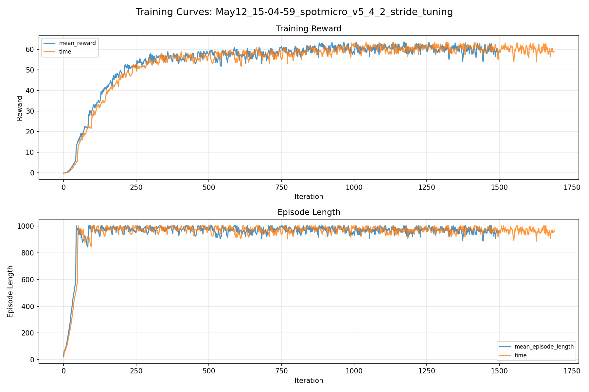
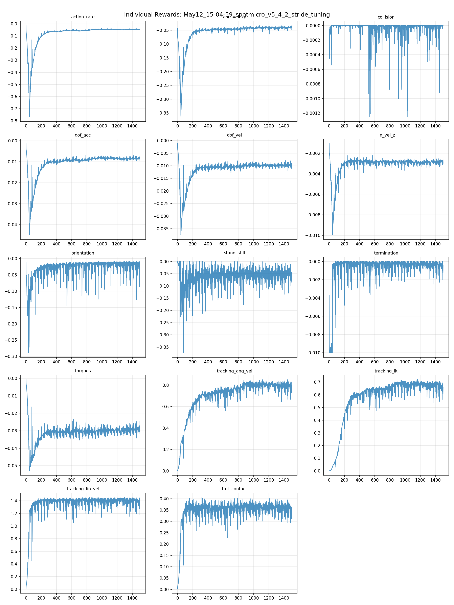
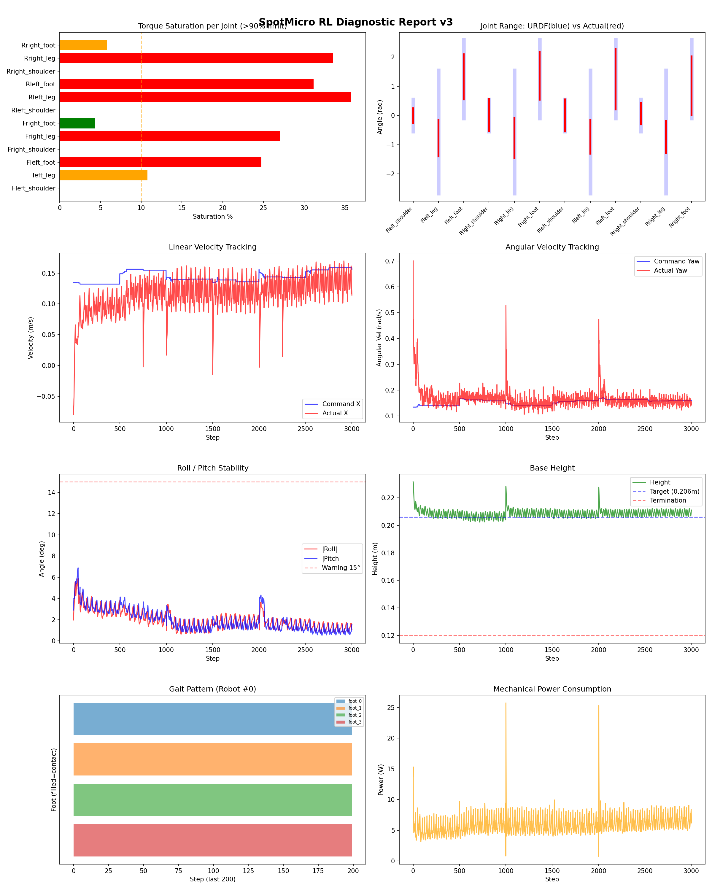
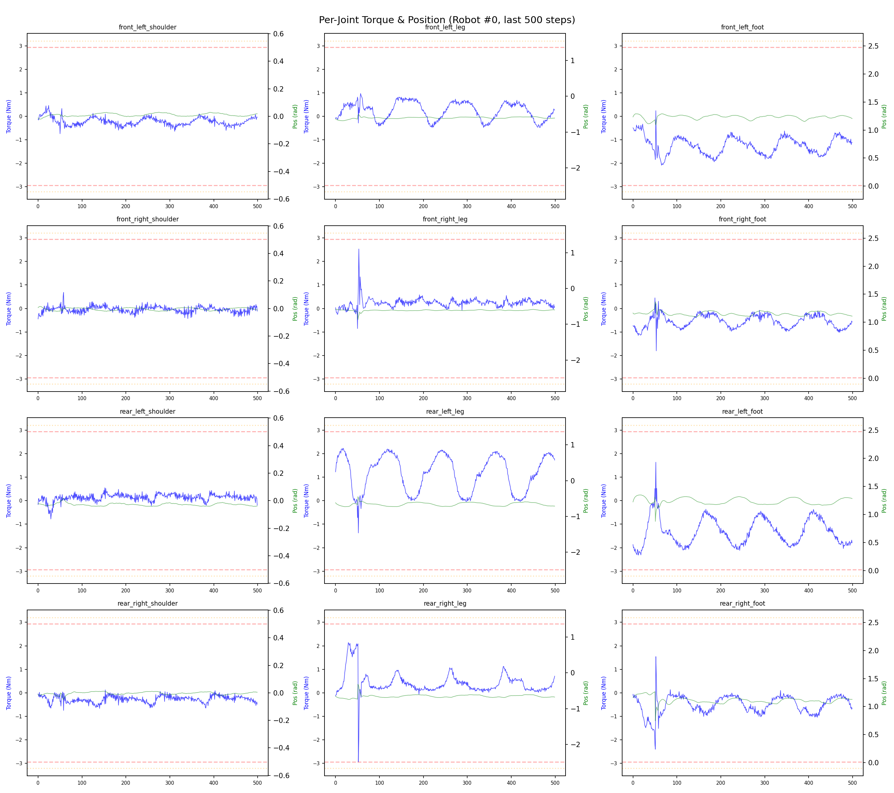
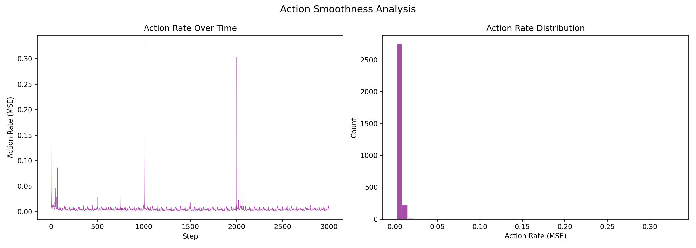

# 실험 054: spotmicro_v5_4_2_stride_tuning

- **날짜:** 2026-05-12 15:35
- **Task:** spotmicro_test
- **Run name:** `spotmicro_v5_4_2_stride_tuning`
- **판정:** ✅ PASS

---

## 실험 목적

V5.4.2: shoulder reg delete

---

## 변경점 (이전 커밋 대비)

```diff
diff --git a/ai_training/rl/legged_gym/legged_gym/envs/spotmicro_test/spotmicro_test.py b/ai_training/rl/legged_gym/legged_gym/envs/spotmicro_test/spotmicro_test.py
index 2fe2a81..5da090f 100644
--- a/ai_training/rl/legged_gym/legged_gym/envs/spotmicro_test/spotmicro_test.py
+++ b/ai_training/rl/legged_gym/legged_gym/envs/spotmicro_test/spotmicro_test.py
@@ -51,9 +51,9 @@ class SpotmicroTest(LeggedRobot):
         )
 
         self.max_stride_x = 0.12
-        self.max_stride_y = 0.02
-        self.shoulder_y_gain = 0.5
-        self.shoulder_ref_limit = 0.05
+        self.max_stride_y = 0.03
+        self.shoulder_y_gain = 1.0
+        self.shoulder_ref_limit = 0.1
         # ==== Step 5: 서보 응답 지연 (substep 단위, dt=5ms 해상도) ====
         if self.cfg.domain_rand.action_delay:
             delay_range = self.cfg.domain_rand.action_delay_range
@@ -323,7 +323,8 @@ class SpotmicroTest(LeggedRobot):
 
         # yaw 회전에 따른 다리별 목표 foot velocity
         foot_vx = vx - wz * leg_y
-        foot_vy = vy + wz * leg_x
+        #foot_vy = vy + wz * leg_x
+        foot_vy = torch.zeros_like(foot_vx)
 
         stance_time = self.gait_period * self.duty_factor
 
@@ -335,12 +336,14 @@ class SpotmicroTest(LeggedRobot):
             -self.max_stride_x,
             self.max_stride_x,
         )
+        '''
         stride_y = torch.clamp(
             stride_y,
             -self.max_stride_y,
             self.max_stride_y,
         )
-
+        '''
+        stride_y = torch.zeros_like(stride_x)
         offsets = torch.tensor(
             [0.0, 0.5, 0.5, 0.0],
             device=self.device,
@@ -378,6 +381,7 @@ class SpotmicroTest(LeggedRobot):
         # y 방향 목표를 shoulder reference로 변환
         shoulder_raw = self.shoulder_y_gain * torch.atan2(y, -z)
 
+        '''
         shoulder_ref = torch.clamp(
             shoulder_raw,
             -self.shoulder_ref_limit,
@@ -385,6 +389,8 @@ class SpotmicroTest(LeggedRobot):
         )
 
         shoulder_ref = shoulder_ref * self.shoulder_sign.unsqueeze(0)
+        '''
+        shoulder_ref = torch.zeros((self.num_envs, 4), device=self.device)
 
         # shoulder가 y 방향을 담당한다고 보고,
         # leg/foot IK는 x-z_eff 평면에서 계산
diff --git a/ai_training/rl/legged_gym/legged_gym/envs/spotmicro_test/spotmicro_test_config.py b/ai_training/rl/legged_gym/legged_gym/envs/spotmicro_test/spotmicro_test_config.py
index d90cb63..4f48882 100644
--- a/ai_training/rl/legged_gym/legged_gym/envs/spotmicro_test/spotmicro_test_config.py
+++ b/ai_training/rl/legged_gym/legged_gym/envs/spotmicro_test/spotmicro_test_config.py
@@ -123,7 +123,7 @@ class SpotmicroTestCfgPPO(LeggedRobotCfgPPO):
         entropy_coef = 0.01
 
     class runner(LeggedRobotCfgPPO.runner):
-        run_name = 'spotmicro_v5_4_1_shoulder_tuning'
+        run_name = 'spotmicro_v5_4_2_stride_tuning'
         experiment_name = 'spotmicro_test'
         max_iterations = 1500
         save_interval = 100
```

**변경 요약:**
  - self.max_stride_y = 0.02
  - self.shoulder_y_gain = 0.5
  - self.shoulder_ref_limit = 0.05
  + self.max_stride_y = 0.03
  + self.shoulder_y_gain = 1.0
  + self.shoulder_ref_limit = 0.1
  - foot_vy = vy + wz * leg_x
  + foot_vy = torch.zeros_like(foot_vx)
  + '''
  + '''
  + stride_y = torch.zeros_like(stride_x)
  + '''
  + '''
  + shoulder_ref = torch.zeros((self.num_envs, 4), device=self.device)
  - run_name = 'spotmicro_v5_4_1_shoulder_tuning'
  + run_name = 'spotmicro_v5_4_2_stride_tuning'

---

## 현재 Reward Scales

| Reward | Scale |
|--------|-------|
| action_rate | -0.05 |
| ang_vel_xy | -0.4 |
| collision | -1.0 |
| dof_acc | -2.5e-07 |
| dof_vel | -0.001 |
| lin_vel_z | -2.0 |
| orientation | -6.0 |
| stand_still | -0.5 |
| termination | -10.0 |
| torques | -0.001 |
| tracking_ang_vel | 1.3 |
| tracking_ik | 1.0 |
| tracking_lin_vel | 1.5 |
| trot_contact | 0.5 |

---

## 진단 결과 (Diagnostic)

### 핵심 지표

- ✅ Timeout: 92.8% (≥80%)
- ✅ 속도오차 X: 0.0489 m/s (<0.08)
- ⚠️ 토크포화: 14.4% (10~40%)
- ✅ 자세: roll 2.0°, pitch 1.9° (안정)
- ✅ 조기종료: 3.6% (<5%)

### 상세 수치

| 지표 | 값 |
|------|-----|
| Timeout% | 92.7536231884058 |
| 조기종료% | 3.6231884057971016 |
| 속도오차 X | 0.048926446586847305 m/s |
| 속도오차 Y | 0.026524771004915237 m/s |
| 각속도오차 | 0.09287805110216141 rad/s |
| 토크포화% | 14.445580461205463 |
| 평균 높이 | 0.20871377801085328 m |
| Roll (평균) | 1.9867379665374756° |
| Pitch (평균) | 1.926176905632019° |
| Action Rate | 0.005251478403806686 |
| 평균 전력 | 5.8792195320129395 W |
| CoT | 1.986162801942351 |

## Command Mode별 회전 추종 분석

| 모드 | 비율 | 샘플 수 | 평균 abs(cmd_wz) | 평균 abs(actual_wz) | yaw 오차 | 상태 |
|------|------|---------|------------------|---------------------|----------|------|
| 정지 | 1.8% | 3507 | 0.0178 | 0.0543 | 0.0581 | ⚠️ |
| 직진/저회전 | 40.9% | 78554 | 0.0735 | 0.1147 | 0.0938 | ⚠️ |
| 제자리 회전 | 9.6% | 18522 | 0.2196 | 0.1945 | 0.0920 | ⚠️ |
| 전진+회전 | 41.7% | 80153 | 0.2296 | 0.2206 | 0.0935 | ⚠️ |
| 큰 회전명령 | 0.0% | 0 | N/A | N/A | N/A | N/A |

> 해석 기준: `제자리 회전`만 나쁘면 pure turn 학습/보행 패턴 문제, `큰 회전명령`만 나쁘면 yaw 명령 범위가 현재 토크/보폭 한계보다 큰 문제, `정지`가 나쁘면 stop drift 문제로 보면 됩니다.
        


## 학습 곡선 분석

| 지표 | 값 | 판정 |
|------|-----|------|
| 수렴 iter (90%) | 297 | 빠름 |
| 후반 안정성 (CV) | 0.026 | 안정 |
| 정체 구간 | 없음 | |


## Per-leg 분석

### 발별 접촉/공중 비율

| 발 | 접촉% | 공중% |
|-----|-------|------|
| foot_0 | 76.3% | 23.7% |
| foot_1 | 74.7% | 25.3% |
| foot_2 | 71.4% | 28.6% |
| foot_3 | 66.9% | 33.1% |

### 관절별 토크 포화

| 관절 | 포화% | 최대토크 | 한계 | 상태 |
|------|------|---------|------|------|
| front_left_shoulder | 0.0% | 2.940 | 2.940 | ✅ |
| front_left_leg | 10.8% | 2.940 | 2.940 | ⚠️ |
| front_left_foot | 24.7% | 2.940 | 2.940 | ❌ |
| front_right_shoulder | 0.1% | 2.940 | 2.940 | ✅ |
| front_right_leg | 27.1% | 2.940 | 2.940 | ❌ |
| front_right_foot | 4.4% | 2.940 | 2.940 | ✅ |
| rear_left_shoulder | 0.0% | 2.940 | 2.940 | ✅ |
| rear_left_leg | 35.8% | 2.940 | 2.940 | ❌ |
| rear_left_foot | 31.2% | 2.940 | 2.940 | ❌ |
| rear_right_shoulder | 0.0% | 2.940 | 2.940 | ✅ |
| rear_right_leg | 33.5% | 2.940 | 2.940 | ❌ |
| rear_right_foot | 5.8% | 2.940 | 2.940 | ⚠️ |


## Gait 분석

| 지표 | 값 |
|------|-----|
| Gait 주파수 | 1.02 Hz |
| Gait 주기 | 49 steps |
| 대각 동기화율 | 88.4% |
| L/R 비대칭 | 0.0%p |
| 판정 | ✅ Trot 패턴 / ✅ 대칭 |


## 관절별 상세

| 관절 | 토크포화% | 사용범위% | 편향(rad) | 한계근접% | 상태 |
|------|----------|----------|----------|----------|------|
| front_left_shoulder | 0.0% | 45% | -0.001 | 0.0% | ✅ |
| front_left_leg | 10.8% | 30% | -0.773 | 0.0% | ⚠️ |
| front_left_foot | 24.7% | 57% | +1.322 | 0.0% | ⚠️ |
| front_right_shoulder | 0.1% | 99% | +0.015 | 0.0% | ✅ |
| front_right_leg | 27.1% | 33% | -0.760 | 0.0% | ⚠️ |
| front_right_foot | 4.4% | 61% | +1.355 | 0.0% | ⚠️ |
| rear_left_shoulder | 0.0% | 100% | +0.001 | 0.0% | ✅ |
| rear_left_leg | 35.8% | 27% | -0.726 | 0.0% | ⚠️ |
| rear_left_foot | 31.2% | 77% | +1.243 | 0.0% | ⚠️ |
| rear_right_shoulder | 0.0% | 66% | +0.061 | 0.0% | ✅ |
| rear_right_leg | 33.5% | 26% | -0.732 | 0.0% | ⚠️ |
| rear_right_foot | 5.8% | 74% | +1.026 | 0.0% | ⚠️ |


## 에너지 효율 상세

| 지표 | 값 |
|------|-----|
| 평균 전력 | 5.88 W |
| 피크 전력 | 25.76 W |
| 피크/평균 비율 | 4.4x |
| CoT | 1.99 |

### 관절별 전력 분배

| 관절 | 평균전력(W) | 비율% |
|------|-----------|-------|
| front_left_foot | 1.094 | 18.6% |
| rear_left_foot | 0.995 | 16.9% |
| front_right_foot | 0.845 | 14.4% |
| rear_right_foot | 0.644 | 10.9% |
| front_right_leg | 0.621 | 10.6% |
| front_left_leg | 0.537 | 9.1% |
| rear_right_leg | 0.480 | 8.2% |
| rear_left_leg | 0.449 | 7.6% |
| rear_right_shoulder | 0.080 | 1.4% |
| rear_left_shoulder | 0.051 | 0.9% |
| front_right_shoulder | 0.041 | 0.7% |
| front_left_shoulder | 0.041 | 0.7% |


## 이전 실험 대비 비교

| 지표 | 이전 (exp053) | 현재 (exp054) | 변화 |
|------|-------|-------|------|
| Timeout% | 27.3% | 92.8% | ✅ ↑ 65.5004% |
| 속도오차 X | 0.0603 | 0.0489 | ✅ ↓ 0.0114m/s |
| 토크포화 | 17.4% | 14.4% | ✅ ↓ 2.9298% |
| Roll | 1.7° | 2.0° | ⚠️ ↑ 0.2827° |
| Pitch | 2.2° | 1.9° | ✅ ↓ 0.2675° |
| 평균 전력 | 7.0262W | 5.8792W | ✅ ↓ 1.1469W |


## Tensorboard 학습 곡선 요약

| 스칼라 | 최종값 | 최대 | 최소 | 후반10% 평균 |
|--------|--------|------|------|-------------|
| rew_action_rate | -0.0494 | -0.0146 | -0.7669 | -0.0471 |
| rew_ang_vel_xy | -0.0404 | -0.0331 | -0.3639 | -0.0400 |
| rew_collision | 0.0000 | 0.0000 | -0.0012 | -0.0000 |
| rew_dof_acc | -0.0094 | -0.0013 | -0.0448 | -0.0084 |
| rew_dof_vel | -0.0110 | -0.0012 | -0.0374 | -0.0097 |
| rew_lin_vel_z | -0.0030 | -0.0010 | -0.0099 | -0.0028 |
| rew_orientation | -0.0133 | -0.0090 | -0.2889 | -0.0232 |
| rew_stand_still | -0.0451 | 0.0000 | -0.3735 | -0.0531 |
| rew_termination | -0.0004 | 0.0000 | -0.0100 | -0.0005 |
| rew_torques | -0.0315 | -0.0007 | -0.0529 | -0.0294 |
| rew_tracking_ang_vel | 0.7972 | 0.8529 | 0.0022 | 0.7918 |
| rew_tracking_ik | 0.6615 | 0.7217 | 0.0011 | 0.6646 |
| rew_tracking_lin_vel | 1.3915 | 1.4538 | 0.0071 | 1.3821 |
| rew_trot_contact | 0.3633 | 0.4055 | 0.0030 | 0.3553 |
| learning_rate | 0.0003 | 0.0100 | 0.0000 | 0.0004 |
| surrogate | -0.0017 | 0.0121 | -0.0079 | -0.0029 |
| value_function | 0.0094 | 0.1052 | 0.0037 | 0.0157 |
| collection time | 0.8294 | 0.9769 | 0.7736 | 0.8361 |
| learning_time | 0.2847 | 0.3831 | 0.2684 | 0.2880 |
| total_fps | 88237.0000 | 92799.0000 | 72284.0000 | 87524.2733 |
| mean_noise_std | 0.1793 | 0.9990 | 0.1691 | 0.1830 |
| mean_episode_length | 965.7400 | 1002.0000 | 21.6100 | 962.3999 |
| time | 965.7400 | 1002.0000 | 21.6100 | 962.3999 |
| mean_reward | 59.0044 | 63.5810 | -0.1535 | 59.8489 |
| time | 59.0044 | 63.5810 | -0.1535 | 59.8489 |

총 학습 iteration: 1499


---

## 그래프

### Tensorboard 학습 곡선



### Diagnostic 결과





---

## 결론 및 다음 실험 방향

**자동 판정:** ✅ PASS

대부분 기준을 통과했으나 일부 항목이 보통 수준입니다.
  - ⚠️ 토크포화: 14.4% (10~40%)

> 💡 위 결론은 자동 생성되었습니다. 필요시 수정하세요.

---

## 메모

_(추가 메모가 있으면 여기에 작성)_

