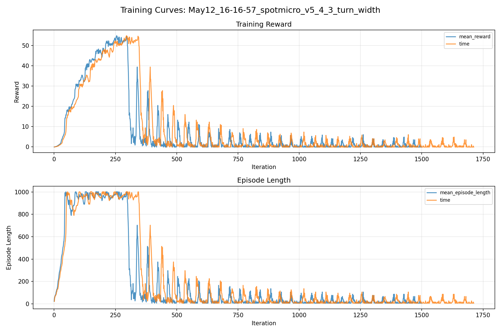
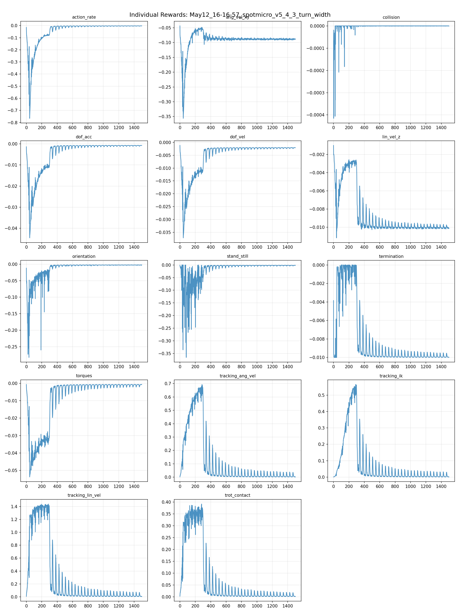
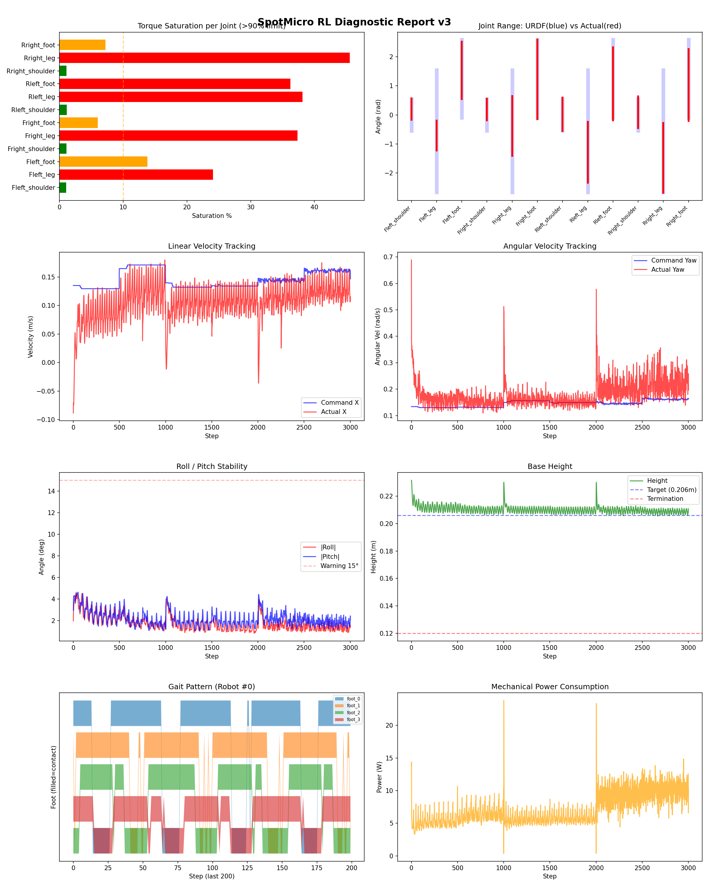
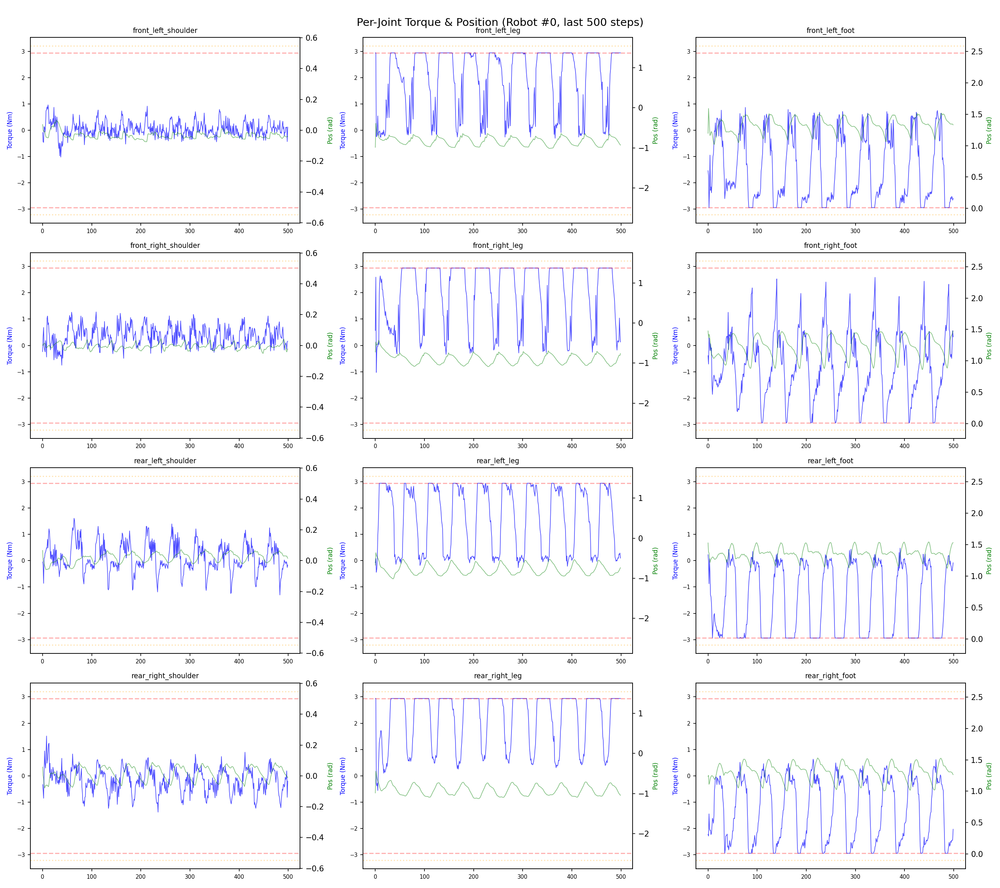
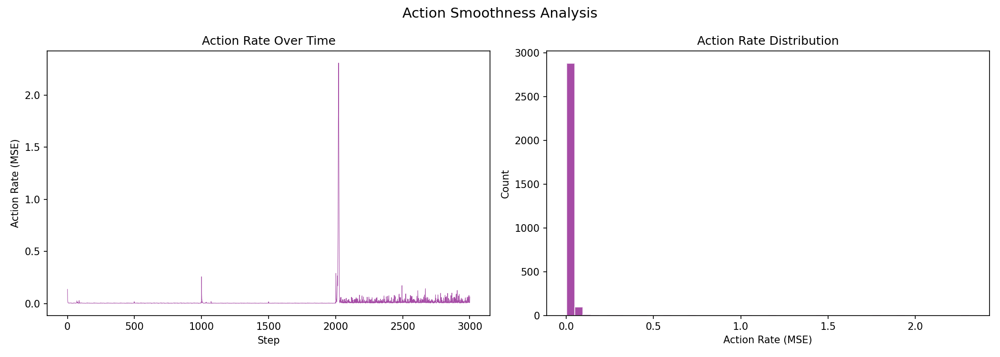

# 실험 055: spotmicro_v5_4_3_turn_width

- **날짜:** 2026-05-12 16:47
- **Task:** spotmicro_test
- **Run name:** `spotmicro_v5_4_3_turn_width`
- **판정:** ❌ FAIL (일부 기준 미달)

---

## 실험 목적

V5.4.3: half turn width parameter 추가

---

## 변경점 (이전 커밋 대비)

```diff
diff --git a/ai_training/rl/legged_gym/legged_gym/envs/spotmicro_test/spotmicro_test.py b/ai_training/rl/legged_gym/legged_gym/envs/spotmicro_test/spotmicro_test.py
index 5da090f..1231af3 100644
--- a/ai_training/rl/legged_gym/legged_gym/envs/spotmicro_test/spotmicro_test.py
+++ b/ai_training/rl/legged_gym/legged_gym/envs/spotmicro_test/spotmicro_test.py
@@ -322,7 +322,12 @@ class SpotmicroTest(LeggedRobot):
         leg_y = self.leg_origin_y.unsqueeze(0)  # [1, 4]
 
         # yaw 회전에 따른 다리별 목표 foot velocity
-        foot_vx = vx - wz * leg_y
+        
+        self.turn_half_width = 0.09
+
+        turn_y = torch.sign(self.leg_origin_y).unsqueeze(0) * self.turn_half_width
+        foot_vx = vx - wz * turn_y
+        #foot_vx = vx - wz * leg_y
         #foot_vy = vy + wz * leg_x
         foot_vy = torch.zeros_like(foot_vx)
 
diff --git a/ai_training/rl/legged_gym/legged_gym/envs/spotmicro_test/spotmicro_test_config.py b/ai_training/rl/legged_gym/legged_gym/envs/spotmicro_test/spotmicro_test_config.py
index 4f48882..a06a297 100644
--- a/ai_training/rl/legged_gym/legged_gym/envs/spotmicro_test/spotmicro_test_config.py
+++ b/ai_training/rl/legged_gym/legged_gym/envs/spotmicro_test/spotmicro_test_config.py
@@ -123,7 +123,7 @@ class SpotmicroTestCfgPPO(LeggedRobotCfgPPO):
         entropy_coef = 0.01
 
     class runner(LeggedRobotCfgPPO.runner):
-        run_name = 'spotmicro_v5_4_2_stride_tuning'
+        run_name = 'spotmicro_v5_4_3_turn_width'
         experiment_name = 'spotmicro_test'
         max_iterations = 1500
         save_interval = 100
```

**변경 요약:**
  - foot_vx = vx - wz * leg_y
  + self.turn_half_width = 0.09
  + turn_y = torch.sign(self.leg_origin_y).unsqueeze(0) * self.turn_half_width
  + foot_vx = vx - wz * turn_y
  - run_name = 'spotmicro_v5_4_2_stride_tuning'
  + run_name = 'spotmicro_v5_4_3_turn_width'

---

## 현재 Reward Scales

| Reward | Scale |
|--------|-------|
| action_rate | -0.05 |
| ang_vel_xy | -0.4 |
| collision | -1.0 |
| dof_acc | -2.5e-07 |
| dof_vel | -0.001 |
| lin_vel_z | -2.0 |
| orientation | -6.0 |
| stand_still | -0.5 |
| termination | -10.0 |
| torques | -0.001 |
| tracking_ang_vel | 1.3 |
| tracking_ik | 1.0 |
| tracking_lin_vel | 1.5 |
| trot_contact | 0.5 |

---

## 진단 결과 (Diagnostic)

### 핵심 지표

- ❌ Timeout: 27.3% (<60%, 미달)
- ✅ 속도오차 X: 0.0579 m/s (<0.08)
- ⚠️ 토크포화: 17.7% (10~40%)
- ✅ 자세: roll 1.7°, pitch 2.2° (안정)
- ❌ 조기종료: 72.1% (>20%)

### 상세 수치

| 지표 | 값 |
|------|-----|
| Timeout% | 27.292110874200425 |
| 조기종료% | 72.06823027718549 |
| 속도오차 X | 0.0579286552965641 m/s |
| 속도오차 Y | 0.03357795998454094 m/s |
| 각속도오차 | 0.12230463325977325 rad/s |
| 토크포화% | 17.731357184482185 |
| 평균 높이 | 0.21016074346872793 m |
| Roll (평균) | 1.7328935861587524° |
| Pitch (평균) | 2.162623405456543° |
| Action Rate | 0.015968529507517815 |
| 평균 전력 | 7.178871154785156 W |
| CoT | 2.6172927405169104 |

## Command Mode별 회전 추종 분석

| 모드 | 비율 | 샘플 수 | 평균 abs(cmd_wz) | 평균 abs(actual_wz) | yaw 오차 | 상태 |
|------|------|---------|------------------|---------------------|----------|------|
| 정지 | 1.9% | 3587 | 0.0180 | 0.1146 | 0.1164 | ❌ |
| 직진/저회전 | 43.3% | 83177 | 0.0720 | 0.1355 | 0.1184 | ⚠️ |
| 제자리 회전 | 6.3% | 12194 | 0.2240 | 0.2093 | 0.1331 | ⚠️ |
| 전진+회전 | 41.0% | 78711 | 0.2258 | 0.2342 | 0.1258 | ⚠️ |
| 큰 회전명령 | 0.0% | 0 | N/A | N/A | N/A | N/A |

> 해석 기준: `제자리 회전`만 나쁘면 pure turn 학습/보행 패턴 문제, `큰 회전명령`만 나쁘면 yaw 명령 범위가 현재 토크/보폭 한계보다 큰 문제, `정지`가 나쁘면 stop drift 문제로 보면 됩니다.
        


## 학습 곡선 분석

| 지표 | 값 | 판정 |
|------|-----|------|
| 수렴 iter (90%) | 210 | 빠름 |
| 후반 안정성 (CV) | 2.005 | 불안정 |
| 정체 구간 | 없음 | |


## Per-leg 분석

### 발별 접촉/공중 비율

| 발 | 접촉% | 공중% |
|-----|-------|------|
| foot_0 | 76.1% | 23.9% |
| foot_1 | 79.9% | 20.1% |
| foot_2 | 72.7% | 27.3% |
| foot_3 | 72.2% | 27.8% |

### 관절별 토크 포화

| 관절 | 포화% | 최대토크 | 한계 | 상태 |
|------|------|---------|------|------|
| front_left_shoulder | 1.0% | 2.940 | 2.940 | ✅ |
| front_left_leg | 24.1% | 2.940 | 2.940 | ❌ |
| front_left_foot | 13.8% | 2.940 | 2.940 | ⚠️ |
| front_right_shoulder | 1.1% | 2.940 | 2.940 | ✅ |
| front_right_leg | 37.4% | 2.940 | 2.940 | ❌ |
| front_right_foot | 6.0% | 2.940 | 2.940 | ⚠️ |
| rear_left_shoulder | 1.1% | 2.940 | 2.940 | ✅ |
| rear_left_leg | 38.1% | 2.940 | 2.940 | ❌ |
| rear_left_foot | 36.2% | 2.940 | 2.940 | ❌ |
| rear_right_shoulder | 1.1% | 2.940 | 2.940 | ✅ |
| rear_right_leg | 45.5% | 2.940 | 2.940 | ❌ |
| rear_right_foot | 7.2% | 2.940 | 2.940 | ⚠️ |


## Gait 분석

| 지표 | 값 |
|------|-----|
| Gait 주파수 | 1.00 Hz |
| Gait 주기 | 50 steps |
| 대각 동기화율 | 84.1% |
| L/R 비대칭 | 0.0%p |
| 판정 | ✅ Trot 패턴 / ✅ 대칭 |


## 관절별 상세

| 관절 | 토크포화% | 사용범위% | 편향(rad) | 한계근접% | 상태 |
|------|----------|----------|----------|----------|------|
| front_left_shoulder | 1.0% | 67% | +0.201 | 0.2% | ⚠️ |
| front_left_leg | 24.1% | 24% | -0.716 | 0.0% | ⚠️ |
| front_left_foot | 13.8% | 73% | +1.535 | 0.0% | ⚠️ |
| front_right_shoulder | 1.1% | 68% | +0.186 | 0.3% | ⚠️ |
| front_right_leg | 37.4% | 49% | -0.381 | 0.0% | ⚠️ |
| front_right_foot | 6.0% | 102% | +1.221 | 0.0% | ⚠️ |
| rear_left_shoulder | 1.1% | 105% | +0.023 | 0.0% | ✅ |
| rear_left_leg | 38.1% | 50% | -1.286 | 0.0% | ⚠️ |
| rear_left_foot | 36.2% | 94% | +1.075 | 0.1% | ⚠️ |
| rear_right_shoulder | 1.1% | 99% | +0.094 | 0.2% | ✅ |
| rear_right_leg | 45.5% | 57% | -1.480 | 0.0% | ⚠️ |
| rear_right_foot | 7.2% | 92% | +1.027 | 0.1% | ⚠️ |


## 에너지 효율 상세

| 지표 | 값 |
|------|-----|
| 평균 전력 | 7.18 W |
| 피크 전력 | 23.81 W |
| 피크/평균 비율 | 3.3x |
| CoT | 2.62 |

### 관절별 전력 분배

| 관절 | 평균전력(W) | 비율% |
|------|-----------|-------|
| rear_left_foot | 1.087 | 15.1% |
| front_left_foot | 1.013 | 14.1% |
| rear_right_foot | 0.861 | 12.0% |
| front_right_leg | 0.855 | 11.9% |
| front_right_foot | 0.852 | 11.9% |
| rear_right_leg | 0.688 | 9.6% |
| rear_left_leg | 0.645 | 9.0% |
| front_left_leg | 0.583 | 8.1% |
| rear_right_shoulder | 0.177 | 2.5% |
| front_right_shoulder | 0.163 | 2.3% |
| front_left_shoulder | 0.144 | 2.0% |
| rear_left_shoulder | 0.111 | 1.5% |


## 이전 실험 대비 비교

| 지표 | 이전 (exp054) | 현재 (exp055) | 변화 |
|------|-------|-------|------|
| Timeout% | 92.8% | 27.3% | ⚠️ ↓ 65.4615% |
| 속도오차 X | 0.0489 | 0.0579 | ⚠️ ↑ 0.0090m/s |
| 토크포화 | 14.4% | 17.7% | ⚠️ ↑ 3.2858% |
| Roll | 2.0° | 1.7° | ✅ ↓ 0.2538° |
| Pitch | 1.9° | 2.2° | ⚠️ ↑ 0.2364° |
| 평균 전력 | 5.8792W | 7.1789W | ⚠️ ↑ 1.2997W |


## Tensorboard 학습 곡선 요약

| 스칼라 | 최종값 | 최대 | 최소 | 후반10% 평균 |
|--------|--------|------|------|-------------|
| rew_action_rate | -0.0022 | -0.0022 | -0.7659 | -0.0027 |
| rew_ang_vel_xy | -0.0882 | -0.0436 | -0.3561 | -0.0887 |
| rew_collision | -0.0000 | 0.0000 | -0.0004 | -0.0000 |
| rew_dof_acc | -0.0007 | -0.0007 | -0.0446 | -0.0008 |
| rew_dof_vel | -0.0020 | -0.0012 | -0.0372 | -0.0021 |
| rew_lin_vel_z | -0.0101 | -0.0010 | -0.0112 | -0.0100 |
| rew_orientation | -0.0025 | -0.0024 | -0.2825 | -0.0027 |
| rew_stand_still | -0.0013 | 0.0000 | -0.3658 | -0.0019 |
| rew_termination | -0.0100 | 0.0000 | -0.0100 | -0.0099 |
| rew_torques | -0.0007 | -0.0007 | -0.0538 | -0.0009 |
| rew_tracking_ang_vel | 0.0016 | 0.6936 | 0.0014 | 0.0085 |
| rew_tracking_ik | 0.0008 | 0.5648 | 0.0007 | 0.0067 |
| rew_tracking_lin_vel | 0.0050 | 1.4393 | 0.0047 | 0.0178 |
| rew_trot_contact | 0.0018 | 0.3920 | 0.0016 | 0.0050 |
| learning_rate | 0.0000 | 0.0100 | 0.0000 | 0.0000 |
| surrogate | 0.0031 | 0.0748 | -0.0075 | 0.0033 |
| value_function | 0.0027 | 1.5139 | 0.0019 | 0.0070 |
| collection time | 0.8770 | 1.1019 | 0.7834 | 0.8379 |
| learning_time | 0.2859 | 0.3418 | 0.2645 | 0.2864 |
| total_fps | 84530.0000 | 91926.0000 | 69817.0000 | 87484.5533 |
| mean_noise_std | 0.1999 | 0.9993 | 0.1999 | 0.2027 |
| mean_episode_length | 5.9800 | 1002.0000 | 5.5900 | 16.0619 |
| time | 5.9800 | 1002.0000 | 5.5900 | 16.0619 |
| mean_reward | -0.1998 | 54.7928 | -0.2000 | 0.4047 |
| time | -0.1998 | 54.7928 | -0.2000 | 0.4047 |

총 학습 iteration: 1499


---

## 그래프

### Tensorboard 학습 곡선



### Diagnostic 결과





---

## 결론 및 다음 실험 방향

**자동 판정:** ❌ FAIL (일부 기준 미달)

일부 기준을 통과하지 못했습니다. 조정이 필요합니다.
  - ❌ Timeout: 27.3% (<60%, 미달)
  - ❌ 조기종료: 72.1% (>20%)

**제안:** Timeout이 낮습니다. 최근 추가한 페널티를 절반으로 줄여보세요.

> 💡 위 결론은 자동 생성되었습니다. 필요시 수정하세요.

---

## 메모

_(추가 메모가 있으면 여기에 작성)_

