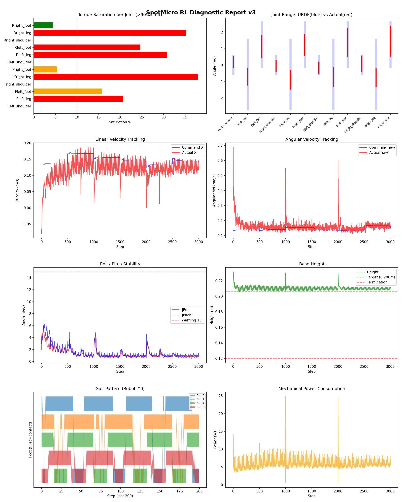
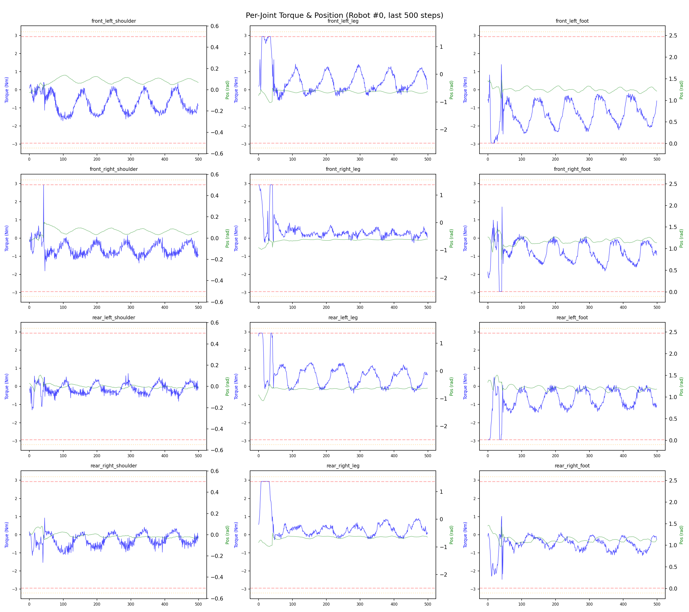
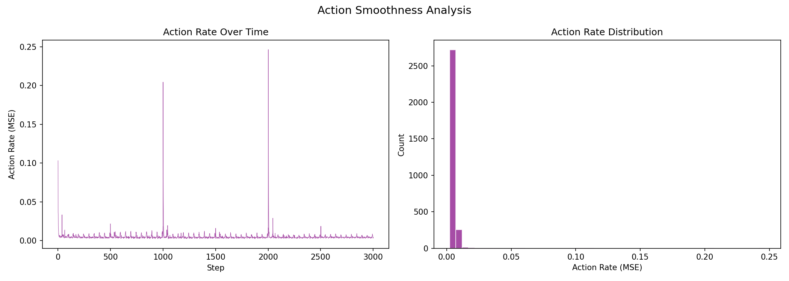

# 실험 057: spotmicro_v5_4_4_IK rollback

- **날짜:** 2026-05-13 10:00
- **Task:** spotmicro_test
- **Run name:** `spotmicro_v5_4_4_IK rollback`
- **판정:** ✅ PASS

---

## 실험 목적

V5.4.4.1: IK rollback 후 각 체크포인트마다 확인 - 700iter

---

## 변경점 (이전 커밋 대비)

```diff
diff --git a/ai_training/rl/legged_gym/legged_gym/envs/spotmicro_test/spotmicro_test.py b/ai_training/rl/legged_gym/legged_gym/envs/spotmicro_test/spotmicro_test.py
index db0863b..f194b90 100644
--- a/ai_training/rl/legged_gym/legged_gym/envs/spotmicro_test/spotmicro_test.py
+++ b/ai_training/rl/legged_gym/legged_gym/envs/spotmicro_test/spotmicro_test.py
@@ -330,7 +330,7 @@ class SpotmicroTest(LeggedRobot):
         '''
         foot_vx = vx - wz * leg_y
         foot_vy = vy + wz * leg_x
-        foot_vy = torch.zeros_like(foot_vx)
+        #foot_vy = torch.zeros_like(foot_vx)
 
         stance_time = self.gait_period * self.duty_factor
 
diff --git a/ai_training/rl/legged_gym/legged_gym/envs/spotmicro_test/spotmicro_test_config.py b/ai_training/rl/legged_gym/legged_gym/envs/spotmicro_test/spotmicro_test_config.py
index a06a297..455143b 100644
--- a/ai_training/rl/legged_gym/legged_gym/envs/spotmicro_test/spotmicro_test_config.py
+++ b/ai_training/rl/legged_gym/legged_gym/envs/spotmicro_test/spotmicro_test_config.py
@@ -123,7 +123,7 @@ class SpotmicroTestCfgPPO(LeggedRobotCfgPPO):
         entropy_coef = 0.01
 
     class runner(LeggedRobotCfgPPO.runner):
-        run_name = 'spotmicro_v5_4_3_turn_width'
+        run_name = 'spotmicro_v5_4_4_IK rollback'
         experiment_name = 'spotmicro_test'
         max_iterations = 1500
         save_interval = 100
```

**변경 요약:**
  - foot_vy = torch.zeros_like(foot_vx)
  - run_name = 'spotmicro_v5_4_3_turn_width'
  + run_name = 'spotmicro_v5_4_4_IK rollback'

---

## 현재 Reward Scales

| Reward | Scale |
|--------|-------|
| action_rate | -0.05 |
| ang_vel_xy | -0.4 |
| collision | -1.0 |
| dof_acc | -2.5e-07 |
| dof_vel | -0.001 |
| lin_vel_z | -2.0 |
| orientation | -6.0 |
| stand_still | -0.5 |
| termination | -10.0 |
| torques | -0.001 |
| tracking_ang_vel | 1.3 |
| tracking_ik | 1.0 |
| tracking_lin_vel | 1.5 |
| trot_contact | 0.5 |

---

## 진단 결과 (Diagnostic)

### 핵심 지표

- ✅ Timeout: 95.5% (≥80%)
- ✅ 속도오차 X: 0.0485 m/s (<0.08)
- ⚠️ 토크포화: 14.6% (10~40%)
- ✅ 자세: roll 1.3°, pitch 1.5° (안정)
- ✅ 조기종료: 2.2% (<5%)

### 상세 수치

| 지표 | 값 |
|------|-----|
| Timeout% | 95.52238805970148 |
| 조기종료% | 2.2388059701492535 |
| 속도오차 X | 0.048460960388183594 m/s |
| 속도오차 Y | 0.024400271475315094 m/s |
| 각속도오차 | 0.08918021619319916 rad/s |
| 토크포화% | 14.584807553557551 |
| 평균 높이 | 0.21025039981573057 m |
| Roll (평균) | 1.2829399108886719° |
| Pitch (평균) | 1.512799859046936° |
| Action Rate | 0.004863184876739979 |
| 평균 전력 | 5.971581935882568 W |
| CoT | 1.9738602300270403 |

## Command Mode별 회전 추종 분석

| 모드 | 비율 | 샘플 수 | 평균 abs(cmd_wz) | 평균 abs(actual_wz) | yaw 오차 | 상태 |
|------|------|---------|------------------|---------------------|----------|------|
| 정지 | 2.6% | 4958 | 0.0268 | 0.0846 | 0.0886 | ❌ |
| 직진/저회전 | 41.6% | 79856 | 0.0753 | 0.1139 | 0.0902 | ⚠️ |
| 제자리 회전 | 7.8% | 14999 | 0.2164 | 0.2017 | 0.0882 | ⚠️ |
| 전진+회전 | 41.8% | 80328 | 0.2206 | 0.2131 | 0.0876 | ⚠️ |
| 큰 회전명령 | 0.0% | 0 | N/A | N/A | N/A | N/A |

> 해석 기준: `제자리 회전`만 나쁘면 pure turn 학습/보행 패턴 문제, `큰 회전명령`만 나쁘면 yaw 명령 범위가 현재 토크/보폭 한계보다 큰 문제, `정지`가 나쁘면 stop drift 문제로 보면 됩니다.
        


## 학습 곡선 분석

| 지표 | 값 | 판정 |
|------|-----|------|
| 수렴 iter (90%) | 336 | 빠름 |
| 후반 안정성 (CV) | 0.247 | 불안정 |
| 정체 구간 | 없음 | |


## Per-leg 분석

### 발별 접촉/공중 비율

| 발 | 접촉% | 공중% |
|-----|-------|------|
| foot_0 | 77.0% | 23.0% |
| foot_1 | 79.1% | 20.9% |
| foot_2 | 69.6% | 30.4% |
| foot_3 | 68.9% | 31.1% |

### 관절별 토크 포화

| 관절 | 포화% | 최대토크 | 한계 | 상태 |
|------|------|---------|------|------|
| front_left_shoulder | 0.0% | 2.940 | 2.940 | ✅ |
| front_left_leg | 20.7% | 2.940 | 2.940 | ❌ |
| front_left_foot | 15.8% | 2.940 | 2.940 | ⚠️ |
| front_right_shoulder | 0.0% | 2.940 | 2.940 | ✅ |
| front_right_leg | 38.0% | 2.940 | 2.940 | ❌ |
| front_right_foot | 5.3% | 2.940 | 2.940 | ⚠️ |
| rear_left_shoulder | 0.1% | 2.940 | 2.940 | ✅ |
| rear_left_leg | 30.8% | 2.940 | 2.940 | ❌ |
| rear_left_foot | 24.7% | 2.940 | 2.940 | ❌ |
| rear_right_shoulder | 0.0% | 2.940 | 2.940 | ✅ |
| rear_right_leg | 35.2% | 2.940 | 2.940 | ❌ |
| rear_right_foot | 4.4% | 2.940 | 2.940 | ✅ |


## Gait 분석

| 지표 | 값 |
|------|-----|
| Gait 주파수 | 1.00 Hz |
| Gait 주기 | 50 steps |
| 대각 동기화율 | 82.8% |
| L/R 비대칭 | 0.0%p |
| 판정 | ✅ Trot 패턴 / ✅ 대칭 |


## 관절별 상세

| 관절 | 토크포화% | 사용범위% | 편향(rad) | 한계근접% | 상태 |
|------|----------|----------|----------|----------|------|
| front_left_shoulder | 0.0% | 62% | +0.184 | 0.0% | ⚠️ |
| front_left_leg | 20.7% | 24% | -0.690 | 0.0% | ⚠️ |
| front_left_foot | 15.8% | 51% | +1.125 | 0.0% | ⚠️ |
| front_right_shoulder | 0.0% | 59% | -0.046 | 0.0% | ✅ |
| front_right_leg | 38.0% | 27% | -0.874 | 0.0% | ⚠️ |
| front_right_foot | 5.3% | 47% | +1.207 | 0.0% | ⚠️ |
| rear_left_shoulder | 0.1% | 61% | -0.149 | 0.0% | ⚠️ |
| rear_left_leg | 30.8% | 27% | -0.740 | 0.0% | ⚠️ |
| rear_left_foot | 24.7% | 62% | +1.393 | 0.0% | ⚠️ |
| rear_right_shoulder | 0.0% | 85% | +0.085 | 0.0% | ✅ |
| rear_right_leg | 35.2% | 26% | -0.774 | 0.0% | ⚠️ |
| rear_right_foot | 4.4% | 68% | +1.461 | 0.0% | ⚠️ |


## 에너지 효율 상세

| 지표 | 값 |
|------|-----|
| 평균 전력 | 5.97 W |
| 피크 전력 | 24.82 W |
| 피크/평균 비율 | 4.2x |
| CoT | 1.97 |

### 관절별 전력 분배

| 관절 | 평균전력(W) | 비율% |
|------|-----------|-------|
| front_left_foot | 1.077 | 18.0% |
| rear_left_foot | 0.961 | 16.1% |
| front_right_foot | 0.864 | 14.5% |
| rear_right_foot | 0.712 | 11.9% |
| front_right_leg | 0.672 | 11.3% |
| front_left_leg | 0.566 | 9.5% |
| rear_right_leg | 0.480 | 8.0% |
| rear_left_leg | 0.453 | 7.6% |
| rear_right_shoulder | 0.065 | 1.1% |
| front_right_shoulder | 0.043 | 0.7% |
| rear_left_shoulder | 0.041 | 0.7% |
| front_left_shoulder | 0.037 | 0.6% |


## 이전 실험 대비 비교

| 지표 | 이전 (exp056) | 현재 (exp057) | 변화 |
|------|-------|-------|------|
| Timeout% | 98.5% | 95.5% | ⚠️ ↓ 2.9392% |
| 속도오차 X | 0.0488 | 0.0485 | ✅ ↓ 0.0003m/s |
| 토크포화 | 14.2% | 14.6% | ⚠️ ↑ 0.3859% |
| Roll | 1.4° | 1.3° | ✅ ↓ 0.1354° |
| Pitch | 1.3° | 1.5° | ⚠️ ↑ 0.1990° |
| 평균 전력 | 5.9570W | 5.9716W | ⚠️ ↑ 0.0146W |


## Tensorboard 학습 곡선 요약

| 스칼라 | 최종값 | 최대 | 최소 | 후반10% 평균 |
|--------|--------|------|------|-------------|
| rew_action_rate | -0.0105 | -0.0101 | -0.7437 | -0.0197 |
| rew_ang_vel_xy | -0.0414 | -0.0233 | -0.3490 | -0.0325 |
| rew_collision | 0.0000 | 0.0000 | -0.0020 | -0.0000 |
| rew_dof_acc | -0.0025 | -0.0013 | -0.0440 | -0.0045 |
| rew_dof_vel | -0.0039 | -0.0012 | -0.0366 | -0.0062 |
| rew_lin_vel_z | -0.0112 | -0.0010 | -0.0112 | -0.0063 |
| rew_orientation | -0.0030 | -0.0024 | -0.5148 | -0.0063 |
| rew_stand_still | -0.0369 | 0.0000 | -0.2409 | -0.0358 |
| rew_termination | -0.0069 | 0.0000 | -0.0100 | -0.0035 |
| rew_torques | -0.0095 | -0.0007 | -0.0539 | -0.0195 |
| rew_tracking_ang_vel | 0.2975 | 0.8643 | 0.0022 | 0.6123 |
| rew_tracking_ik | 0.2474 | 0.7206 | 0.0011 | 0.5118 |
| rew_tracking_lin_vel | 0.4574 | 1.4545 | 0.0071 | 0.9450 |
| rew_trot_contact | 0.1053 | 0.4027 | 0.0030 | 0.2415 |
| learning_rate | 0.0000 | 0.0100 | 0.0000 | 0.0000 |
| surrogate | -0.0012 | 0.0319 | -0.0077 | -0.0007 |
| value_function | 0.0062 | 0.1664 | 0.0032 | 0.0094 |
| collection time | 0.8194 | 0.9194 | 0.7696 | 0.8172 |
| learning_time | 0.2879 | 0.3401 | 0.2732 | 0.2883 |
| total_fps | 88777.0000 | 93145.0000 | 78401.0000 | 88949.3600 |
| mean_noise_std | 0.1344 | 0.9990 | 0.1344 | 0.1366 |
| mean_episode_length | 453.8800 | 1002.0000 | 21.8600 | 672.9192 |
| time | 453.8800 | 1002.0000 | 21.8600 | 672.9192 |
| mean_reward | 30.4661 | 63.6451 | -0.1590 | 45.1923 |
| time | 30.4661 | 63.6451 | -0.1590 | 45.1923 |

총 학습 iteration: 1499


---

## 그래프

### Tensorboard 학습 곡선


### Diagnostic 결과





---

## 결론 및 다음 실험 방향

**자동 판정:** ✅ PASS

대부분 기준을 통과했으나 일부 항목이 보통 수준입니다.
  - ⚠️ 토크포화: 14.6% (10~40%)

> 💡 위 결론은 자동 생성되었습니다. 필요시 수정하세요.

---

## 메모

_(추가 메모가 있으면 여기에 작성)_

