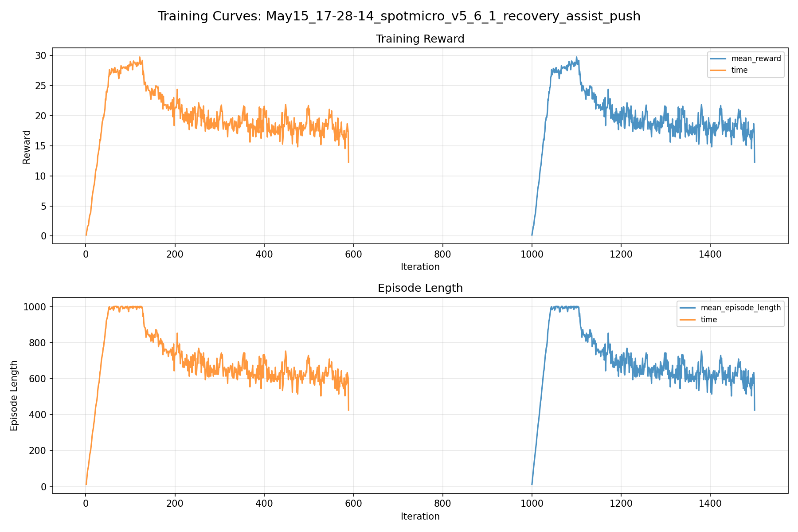
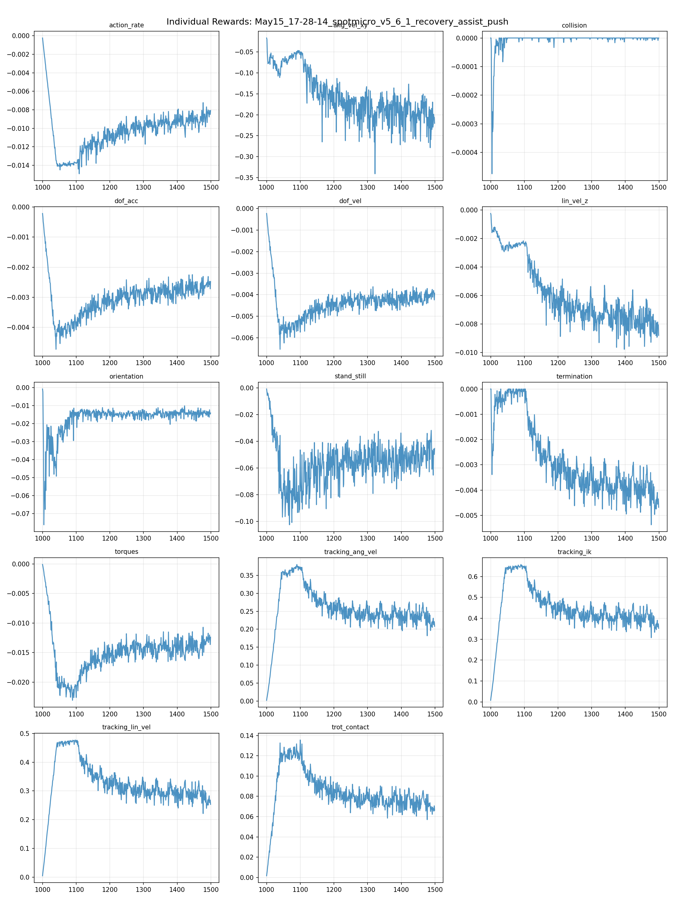
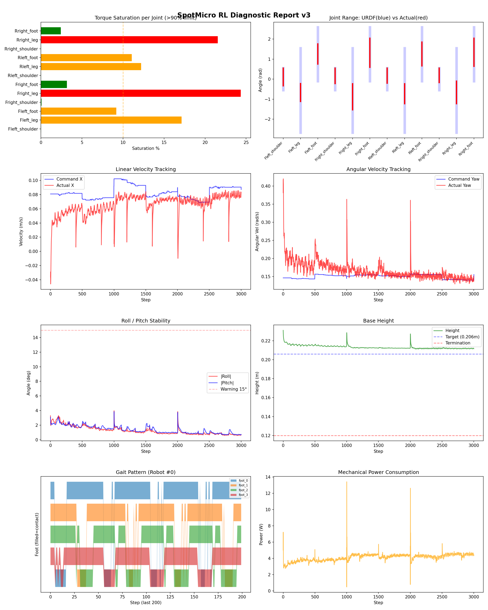
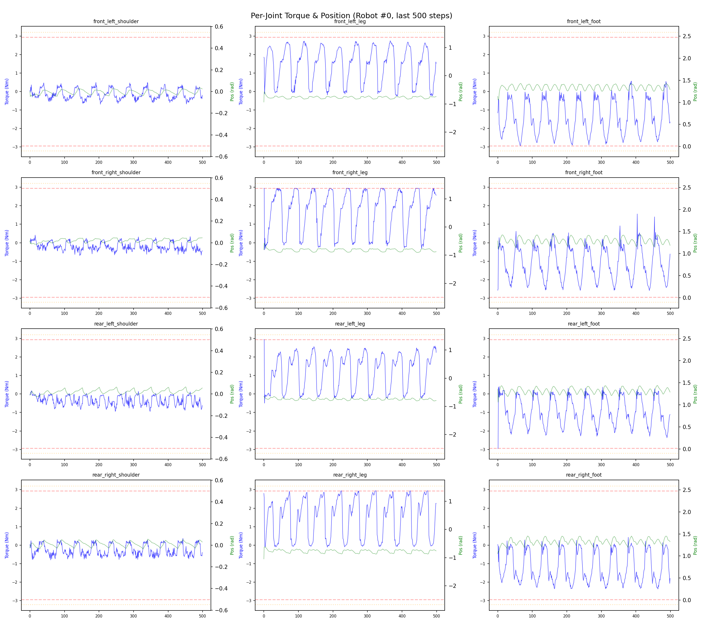
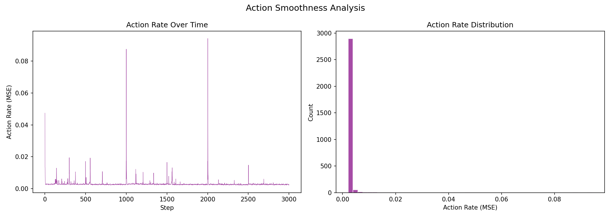

# 실험 060: spotmicro_v5_6_1_recovery_assist_push

- **날짜:** 2026-05-15 17:41
- **Task:** spotmicro_test
- **Run name:** `spotmicro_v5_6_1_recovery_assist_push`
- **판정:** ✅ PASS

---

## 실험 목적

V5.6.1: recovery test - add push

---

## 변경점 (이전 커밋 대비)

```diff
diff --git a/ai_training/rl/experiment_report.py b/ai_training/rl/experiment_report.py
index 8c8e66b..0667969 100644
--- a/ai_training/rl/experiment_report.py
+++ b/ai_training/rl/experiment_report.py
@@ -521,6 +521,7 @@ def generate_report(exp_id, purpose, diag_data, tb_data, diff_text,
     reward_scales = diag_data.get('reward_scales', {}) if diag_data else {}
     
     command_mode_metrics = diag_data.get('command_mode_metrics', {}) if diag_data else {}
+    recovery_data = diag_data.get('recovery', {}) if diag_data else {}
 
     # 자동 판정
     overall_judge, judgments = auto_judge(metrics, run_name)
@@ -580,7 +581,7 @@ def generate_report(exp_id, purpose, diag_data, tb_data, diff_text,
     diag_graph_dir = os.path.join(DIAG_DIR, task_name)
     diag_graphs_ref = ""
     if os.path.exists(diag_graph_dir):
-        for img_name in ['diagnostic_report.png', 'joint_detail.png', 'action_smoothness.png']:
+        for img_name in ['diagnostic_report.png', 'joint_detail.png', 'action_smoothness.png', 'recovery_report.png']:
             img_path = os.path.join(diag_graph_dir, img_name)
             if os.path.exists(img_path):
                 diag_graphs_ref += f"\n"
@@ -613,14 +614,16 @@ def generate_report(exp_id, purpose, diag_data, tb_data, diff_text,
                 f"| {s.get('mean_roll_deg', 0):.1f} "
                 f"| {s.get('mean_pitch_deg', 0):.1f} "
                 f"| {s.get('mean_power', 0):.2f} "
+                f"| {s.get('recovery_success_rate_pct', 0) if s.get('recovery_success_rate_pct') is not None else 0:.1f} "
+                f"| {s.get('mean_recovery_time_s', 0) if s.get('mean_recovery_time_s') is not None else 0:.2f} "
                 f"| {s.get('episode_return', 0):.1f} |"
             )
         snap_table = '\n'.join(snap_rows)
         snapshot_section = f"""
 ## 학습 추이 (Checkpoint 스냅샷)
 
-| iter | Timeout% | 속도오차X | 토크포화% | Roll° | Pitch° | 전력(W) | Return |
-|------|----------|----------|----------|-------|--------|---------|--------|
+| iter | Timeout% | 속도오차X | 토크포화% | Roll° | Pitch° | 전력(W) | Recovery% | 회복시간(s) | Return |
+|------|----------|----------|----------|-------|--------|---------|-----------|-------------|--------|
 {snap_table}
 """
 
@@ -766,6 +769,52 @@ def generate_report(exp_id, purpose, diag_data, tb_data, diff_text,
 > 해석 기준: `제자리 회전`만 나쁘면 pure turn 학습/보행 패턴 문제, `큰 회전명령`만 나쁘면 yaw 명령 범위가 현재 토크/보폭 한계보다 큰 문제, `정지`가 나쁘면 stop drift 문제로 보면 됩니다.
         """
 
+
+    # --- Recovery assist 분석 ---
+    recovery_section = ""
+    if recovery_data:
+        sr = recovery_data.get('success_rate_pct')
+        ert = recovery_data.get('early_failure_rate_pct')
+        mrt = recovery_data.get('mean_recovery_time_s')
+        eligible = recovery_data.get('eligible_trials', 0)
+        total = recovery_data.get('total_trials', 0)
+        success_count = recovery_data.get('success_count', 0)
+        failure_count = recovery_data.get('failure_count', 0)
+
+        sr_s
```

**변경 요약:**
  + recovery_data = diag_data.get('recovery', {}) if diag_data else {}
  - for img_name in ['diagnostic_report.png', 'joint_detail.png', 'action_smoothness.png']:
  + for img_name in ['diagnostic_report.png', 'joint_detail.png', 'action_smoothness.png', 'recovery_report.png']:
  + f"| {s.get('recovery_success_rate_pct', 0) if s.get('recovery_success_rate_pct') is not None else 0:.1f} "
  + f"| {s.get('mean_recovery_time_s', 0) if s.get('mean_recovery_time_s') is not None else 0:.2f} "
  - | iter | Timeout% | 속도오차X | 토크포화% | Roll° | Pitch° | 전력(W) | Return |
  - |------|----------|----------|----------|-------|--------|---------|--------|
  + | iter | Timeout% | 속도오차X | 토크포화% | Roll° | Pitch° | 전력(W) | Recovery% | 회복시간(s) | Return |
  + |------|----------|----------|----------|-------|--------|---------|-----------|-------------|--------|
  + recovery_section = ""
  + if recovery_data:
  + sr = recovery_data.get('success_rate_pct')
  + ert = recovery_data.get('early_failure_rate_pct')
  + mrt = recovery_data.get('mean_recovery_time_s')
  + eligible = recovery_data.get('eligible_trials', 0)
  + total = recovery_data.get('total_trials', 0)
  + success_count = recovery_data.get('success_count', 0)
  + failure_count = recovery_data.get('failure_count', 0)
  + sr_str = f"{sr:.1f}%" if sr is not None else "N/A"
  + ert_str = f"{ert:.1f}%" if ert is not None else "N/A"
  + mrt_str = f"{mrt:.3f}s" if mrt is not None else "N/A"
  + if sr is None:
  + recovery_judge = "⚠️ eligible trial 없음"
  + elif sr >= 80 and (ert is not None and ert < 10):
  + recovery_judge = "✅ Recovery 안정적"
  + elif sr >= 50:
  + recovery_judge = "⚠️ 일부 회복 가능"
  + else:
  + recovery_judge = "❌ Recovery 부족"
  + recovery_section = f"""
  + | 지표 | 값 |
  + |------|-----|
  + | 판정 | {recovery_judge} |
  + | Recovery 성공률 | {sr_str} |
  + | 성공/실패 | {success_count} / {failure_count} |
  + | Eligible trials | {eligible} / {total} |
  + | 평균 회복 시간 | {mrt_str} |
  + | 조기 실패율 | {ert_str} |
  + | 평가 horizon | {recovery_data.get('horizon_s', 'N/A')} s |
  + | 초기 tilt 기준 | {recovery_data.get('initial_tilt_threshold_deg', 'N/A')}° |
  + | 안정 기준 | roll/pitch < {recovery_data.get('stable_threshold_deg', 'N/A')}°, height > {recovery_data.get('min_height_m', 'N/A')}m |
  + | 평균 초기 tilt | {recovery_data.get('mean_initial_tilt_deg', 'N/A')}° |
  + | 평균 초기 roll/pitch | {recovery_data.get('mean_initial_roll_deg', 'N/A')}° / {recovery_data.get('mean_initial_pitch_deg', 'N/A')}° |
  + | 1초 후 평균 roll/pitch | {recovery_data.get('mean_end_roll_deg', 'N/A')}° / {recovery_data.get('mean_end_pitch_deg', 'N/A')}° |
  + | 1초 내 최대 roll/pitch 평균 | {recovery_data.get('mean_max_roll_first_1s_deg', 'N/A')}° / {recovery_data.get('mean_max_pitch_first_1s_deg', 'N/A')}° |
  + > 해석: `Recovery 성공률`은 초기 tilt가 기준 이상인 episode 중 1초 내 안정 자세로 복귀한 비율입니다. 조기 실패율이 높으면 reset 직후 바로 넘어지는 것이고, 평균 회복 시간이 짧을수록 위기 대응이 빠른 것입니다.
  + """
  + | Recovery 성공률 | {metrics.get('recovery_success_rate_pct', 'N/A')}% |
  + | Recovery eligible trials | {metrics.get('recovery_eligible_trials', 'N/A')} |
  + | 평균 회복 시간 | {metrics.get('mean_recovery_time_s', 'N/A')} s |
  + | Recovery 조기 실패율 | {metrics.get('recovery_early_failure_rate_pct', 'N/A')}% |
  + {recovery_section}
  + 'recovery': diag_data.get('recovery', {}) if diag_data else {},
  - from isaacgym.torch_utils import torch_rand_float
  + from isaacgym.torch_utils import torch_rand_float, quat_from_euler_xyz
  + self.recovery_roll_pitch_range = 10.0 * torch.pi / 180.0  # ±10 deg
  + self.recovery_yaw_range = 3.14159                        # yaw는 자유
  + self.recovery_lin_vel_xy_range = 0.10                    # ±0.10 m/s
  + self.recovery_lin_vel_z_range = 0.03                     # ±0.03 m/s
  + self.recovery_ang_vel_xy_range = 0.60                    # ±0.60 rad/s
  + self.recovery_ang_vel_z_range = 0.30                     # ±0.30 rad/s
  + self.last_reset_roll = torch.zeros(
  + self.num_envs, device=self.device, dtype=torch.float
  + )
  + self.last_reset_pitch = torch.zeros(
  + self.num_envs, device=self.device, dtype=torch.float
  + )
  + self.last_reset_tilt = torch.zeros(
  + self.num_envs, device=self.device, dtype=torch.float
  + )
  + def check_termination(self):
  + super().check_termination()
  + base_height = self.root_states[:, 2]
  + self.reset_buf |= (base_height < 0.155)
  + self.reset_buf |= (self.projected_gravity[:, 2] > 0.0)
  - self.dof_pos[env_ids] = self.default_dof_pos * torch_rand_float(
  - 0.5, 1.5, (len(env_ids), self.num_dof), device=self.device)
  + joint_noise = torch_rand_float(
  + -0.05, 0.05,
  + (len(env_ids), self.num_dof),
  + device=self.device,
  + )
  + self.dof_pos[env_ids] = self.default_dof_pos + joint_noise
  - gymtorch.unwrap_tensor(env_ids_int32), len(env_ids_int32))
  + gymtorch.unwrap_tensor(env_ids_int32),
  + len(env_ids_int32),
  + )
  + self.gait_phase[env_ids] = torch_rand_float(
  + 0.0, 1.0,
  + (len(env_ids), 1),
  + device=self.device,
  + )
  - delay_range[0], delay_range[1] + 1,
  - (len(env_ids),), device=self.device)
  + delay_range[0],
  + delay_range[1] + 1,
  + (len(env_ids),),
  + device=self.device,
  + )
  - """base 속도를 0으로 리셋"""
  + """Recovery assist용 reset:
  + - base를 살짝 기울어진 상태로 시작
  + - roll/pitch angular velocity 부여
  + - 아직 완전히 넘어진 상태는 만들지 않음
  + """
  + num = len(env_ids)
  - self.root_states[env_ids, 7:13] = torch_rand_float(
  - -0.3, 0.3, (len(env_ids), 6), device=self.device)
  + self.root_states[env_ids, 2] = self.base_init_state[2] + self.env_origins[env_ids, 2]
  + roll = torch_rand_float(
  + -self.recovery_roll_pitch_range,
  + self.recovery_roll_pitch_range,
  + (num, 1),
  + device=self.device,
  + ).squeeze(1)
  + pitch = torch_rand_float(
  + -self.recovery_roll_pitch_range,
  + self.recovery_roll_pitch_range,
  + (num, 1),
  + device=self.device,
  + ).squeeze(1)
  + yaw = torch_rand_float(
  + -self.recovery_yaw_range,
  + self.recovery_yaw_range,
  + (num, 1),
  + device=self.device,
  + ).squeeze(1)
  + self.root_states[env_ids, 3:7] = quat_from_euler_xyz(roll, pitch, yaw)
  + self.last_reset_roll[env_ids] = roll
  + self.last_reset_pitch[env_ids] = pitch
  + self.last_reset_tilt[env_ids] = torch.maximum(torch.abs(roll), torch.abs(pitch))
  + self.root_states[env_ids, 7:9] = torch_rand_float(
  + -self.recovery_lin_vel_xy_range,
  + self.recovery_lin_vel_xy_range,
  + (num, 2),
  + device=self.device,
  + )
  + self.root_states[env_ids, 9] = torch_rand_float(
  + -self.recovery_lin_vel_z_range,
  + self.recovery_lin_vel_z_range,
  + (num, 1),
  + device=self.device,
  + ).squeeze(1)
  + self.root_states[env_ids, 10:12] = torch_rand_float(
  + -self.recovery_ang_vel_xy_range,
  + self.recovery_ang_vel_xy_range,
  + (num, 2),
  + device=self.device,
  + )
  + self.root_states[env_ids, 12] = torch_rand_float(
  + -self.recovery_ang_vel_z_range,
  + self.recovery_ang_vel_z_range,
  + (num, 1),
  + device=self.device,
  + ).squeeze(1)
  - gymtorch.unwrap_tensor(env_ids_int32), len(env_ids_int32))
  - def check_termination(self):
  - super().check_termination()
  - base_height = self.root_states[:, 2]
  - self.reset_buf |= (base_height < 0.155)
  - self.reset_buf |= (self.projected_gravity[:, 2] > 0.0)
  - def _resample_commands(self, env_ids):
  - self.commands[env_ids, 0] = torch_rand_float(
  - self.command_ranges["lin_vel_x"][0], self.command_ranges["lin_vel_x"][1],
  - (len(env_ids), 1), device=self.device).squeeze(1)
  - self.commands[env_ids, 1] = torch_rand_float(
  - self.command_ranges["lin_vel_y"][0], self.command_ranges["lin_vel_y"][1],
  - (len(env_ids), 1), device=self.device).squeeze(1)
  - if self.cfg.commands.heading_command:
  - self.commands[env_ids, 3] = torch_rand_float(
  - self.command_ranges["heading"][0], self.command_ranges["heading"][1],
  - (len(env_ids), 1), device=self.device).squeeze(1)
  - else:
  - self.commands[env_ids, 2] = torch_rand_float(
  - self.command_ranges["ang_vel_yaw"][0], self.command_ranges["ang_vel_yaw"][1],
  - (len(env_ids), 1), device=self.device).squeeze(1)
  - self.commands[env_ids, :2] *= (torch.norm(self.commands[env_ids, :2], dim=1) > 0.05).unsqueeze(1)
  + gymtorch.unwrap_tensor(env_ids_int32),
  + len(env_ids_int32),
  + )
  - tracking_lin_vel = 1.5
  - tracking_ang_vel = 1.3
  + tracking_lin_vel = 0.5
  + tracking_ang_vel = 0.5
  - ang_vel_xy = -0.4
  - orientation = -6.0
  + ang_vel_xy = -1.0
  + orientation = -10.0
  - trot_contact = 0.5
  - tracking_ik = 1.0
  + trot_contact = 0.2
  + tracking_ik = 0.8
  - randomize_friction = True
  + randomize_friction = False
  - randomize_base_mass = True
  + randomize_base_mass = False
  - push_interval_s = 15
  - max_push_vel_xy = 0.2
  + push_interval_s = 8
  + max_push_vel_xy = 0.1
  - entropy_coef = 0.01
  + entropy_coef = 0.005
  + learning_rate = 1e-4
  - run_name = 'spotmicro_v5_4_4_IK rollback'
  + run_name = 'spotmicro_v5_6_1_recovery_assist_push'
  - max_iterations = 1500
  + max_iterations = 500
  + resume = True
  + load_run = "May15_16-23-12_spotmicro_v5_6_recovery_assist"
  + checkpoint = 1000
  - env_cfg.env.num_envs = min(env_cfg.env.num_envs, 64)
  + env_cfg.env.num_envs = min(env_cfg.env.num_envs, 256)
  + recovery_horizon_s = 1.0
  + recovery_horizon_steps = max(1, int(recovery_horizon_s / env.dt))
  + recovery_initial_tilt_threshold = np.radians(7.0)
  + recovery_stable_threshold = np.radians(5.0)
  + recovery_min_height = max(0.18, float(env.cfg.rewards.base_height_target) - 0.03)
  + recovery_age = np.zeros(num_envs, dtype=np.int32)
  + recovery_active = np.ones(num_envs, dtype=bool)
  + recovery_init_roll = np.full(num_envs, np.nan)
  + recovery_init_pitch = np.full(num_envs, np.nan)
  + recovery_max_roll = np.zeros(num_envs, dtype=np.float32)
  + recovery_max_pitch = np.zeros(num_envs, dtype=np.float32)
  + recovery_first_stable_step = np.full(num_envs, -1, dtype=np.int32)
  + recovery_trials = []
  + def _start_recovery_trials(env_ids_np, roll_abs_np, pitch_abs_np, height_np):
  + """새 episode/reset 직후 recovery trial 초기화"""
  + if len(env_ids_np) == 0:
  + return
  + recovery_age[env_ids_np] = 0
  + recovery_active[env_ids_np] = True
  + recovery_init_roll[env_ids_np] = roll_abs_np[env_ids_np]
  + recovery_init_pitch[env_ids_np] = pitch_abs_np[env_ids_np]
  + recovery_max_roll[env_ids_np] = roll_abs_np[env_ids_np]
  + recovery_max_pitch[env_ids_np] = pitch_abs_np[env_ids_np]
  + recovery_first_stable_step[env_ids_np] = -1
  + def _record_recovery_trial(env_i, success, end_roll, end_pitch, end_height, forced_failure=False):
  + """한 recovery trial 결과 기록"""
  + init_roll = recovery_init_roll[env_i]
  + init_pitch = recovery_init_pitch[env_i]
  + if np.isnan(init_roll) or np.isnan(init_pitch):
  + return
  + init_tilt = max(float(init_roll), float(init_pitch))
  + eligible = init_tilt >= recovery_initial_tilt_threshold
  + recovery_time_s = None
  + if success and recovery_first_stable_step[env_i] >= 0:
  + recovery_time_s = float(recovery_first_stable_step[env_i] * env.dt)
  + recovery_trials.append({
  + 'eligible': bool(eligible),
  + 'success': bool(success) if eligible else False,
  + 'forced_failure': bool(forced_failure),
  + 'init_roll_deg': float(np.degrees(init_roll)),
  + 'init_pitch_deg': float(np.degrees(init_pitch)),
  + 'init_tilt_deg': float(np.degrees(init_tilt)),
  + 'max_roll_first_1s_deg': float(np.degrees(recovery_max_roll[env_i])),
  + 'max_pitch_first_1s_deg': float(np.degrees(recovery_max_pitch[env_i])),
  + 'end_roll_deg': float(np.degrees(end_roll)),
  + 'end_pitch_deg': float(np.degrees(end_pitch)),
  + 'end_height_m': float(end_height),
  + 'recovery_time_s': recovery_time_s,
  + })
  + def _get_initial_tilt_for_trials(roll_abs_np, pitch_abs_np):
  + """env reset 때 저장한 roll/pitch가 있으면 그것을 initial로 사용"""
  + if hasattr(env, "last_reset_roll") and hasattr(env, "last_reset_pitch"):
  + init_roll = np.abs(env.last_reset_roll.cpu().numpy())
  + init_pitch = np.abs(env.last_reset_pitch.cpu().numpy())
  + return init_roll, init_pitch
  + return roll_abs_np, pitch_abs_np
  + def _summarize_recovery_trials():
  + eligible = [t for t in recovery_trials if t['eligible']]
  + successes = [t for t in eligible if t['success']]
  + failures = [t for t in eligible if not t['success']]
  + times = [t['recovery_time_s'] for t in successes if t['recovery_time_s'] is not None]
  + def _mean(key, rows):
  + return float(np.mean([r[key] for r in rows])) if rows else None
  + def _median(values):
  + return float(np.median(values)) if values else None
  + return {
  + 'horizon_s': float(recovery_horizon_s),
  + 'initial_tilt_threshold_deg': float(np.degrees(recovery_initial_tilt_threshold)),
  + 'stable_threshold_deg': float(np.degrees(recovery_stable_threshold)),
  + 'min_height_m': float(recovery_min_height),
  + 'total_trials': int(len(recovery_trials)),
  + 'eligible_trials': int(len(eligible)),
  + 'success_count': int(len(successes)),
  + 'failure_count': int(len(failures)),
  + 'success_rate_pct': float(len(successes) / len(eligible) * 100) if eligible else None,
  + 'early_failure_rate_pct': float(
  + sum(1 for t in eligible if t.get('forced_failure')) / len(eligible) * 100
  + ) if eligible else None,
  + 'mean_recovery_time_s': float(np.mean(times)) if times else None,
  + 'median_recovery_time_s': _median(times),
  + 'mean_initial_tilt_deg': _mean('init_tilt_deg', eligible),
  + 'mean_initial_roll_deg': _mean('init_roll_deg', eligible),
  + 'mean_initial_pitch_deg': _mean('init_pitch_deg', eligible),
  + 'mean_max_roll_first_1s_deg': _mean('max_roll_first_1s_deg', eligible),
  + 'mean_max_pitch_first_1s_deg': _mean('max_pitch_first_1s_deg', eligible),
  + 'mean_end_roll_deg': _mean('end_roll_deg', eligible),
  + 'mean_end_pitch_deg': _mean('end_pitch_deg', eligible),
  + 'mean_end_height_m': _mean('end_height_m', eligible),
  + }
  - data['base_height'].append(env.root_states[:, 2].mean().item())
  - data['base_vel_z'].append(env.base_lin_vel[:, 2].mean().item())
  + base_height_np = env.root_states[:, 2].cpu().numpy()
  + base_vel_z_np = env.base_lin_vel[:, 2].cpu().numpy()
  + data['base_height'].append(float(np.mean(base_height_np)))
  + data['base_vel_z'].append(float(np.mean(base_vel_z_np)))
  + roll_abs_np = np.abs(roll)
  + pitch_abs_np = np.abs(pitch)
  + uninitialized = np.where(np.isnan(recovery_init_roll))[0]
  + if len(uninitialized) > 0:
  + init_roll_np, init_pitch_np = _get_initial_tilt_for_trials(roll_abs_np, pitch_abs_np)
  + _start_recovery_trials(uninitialized, init_roll_np, init_pitch_np, base_height_np)
  + active_mask = recovery_active.copy()
  + if np.any(active_mask):
  + active_ids = np.where(active_mask)[0]
  + recovery_age[active_ids] += 1
  + recovery_max_roll[active_ids] = np.maximum(recovery_max_roll[active_ids], roll_abs_np[active_ids])
  + recovery_max_pitch[active_ids] = np.maximum(recovery_max_pitch[active_ids], pitch_abs_np[active_ids])
  + stable_now = (
  + (roll_abs_np < recovery_stable_threshold) &
  + (pitch_abs_np < recovery_stable_threshold) &
  + (base_height_np > recovery_min_height)
  + )
  + first_stable_ids = active_ids[
  + stable_now[active_ids] & (recovery_first_stable_step[active_ids] < 0)
  + ]
  + recovery_first_stable_step[first_stable_ids] = recovery_age[first_stable_ids]
  + horizon_ids = active_ids[recovery_age[active_ids] >= recovery_horizon_steps]
  + for env_i in horizon_ids:
  + success = bool(stable_now[env_i])
  + _record_recovery_trial(
  + env_i,
  + success=success,
  + end_roll=roll_abs_np[env_i],
  + end_pitch=pitch_abs_np[env_i],
  + end_height=base_height_np[env_i],
  + forced_failure=False,
  + )
  + recovery_active[horizon_ids] = False
  + done_ids_np = done_ids.cpu().numpy().astype(np.int64)
  + active_done_ids = done_ids_np[recovery_active[done_ids_np]]
  + for env_i in active_done_ids:
  + _record_recovery_trial(
  + env_i,
  + success=False,
  + end_roll=roll_abs_np[env_i],
  + end_pitch=pitch_abs_np[env_i],
  + end_height=base_height_np[env_i],
  + forced_failure=True,
  + )
  + init_roll_np, init_pitch_np = _get_initial_tilt_for_trials(roll_abs_np, pitch_abs_np)
  + _start_recovery_trials(done_ids_np, init_roll_np, init_pitch_np, base_height_np)
  + recovery_summary = _summarize_recovery_trials()
  - dt_step = env.dt  # 1 step의 실제 시간(초)
  + dt_step = env.dt * env.cfg.control.decimation  # 1 step의 실제 시간(초)
  + 'recovery_success_rate_pct': recovery_summary.get('success_rate_pct'),
  + 'recovery_eligible_trials': recovery_summary.get('eligible_trials', 0),
  + 'mean_recovery_time_s': recovery_summary.get('mean_recovery_time_s'),
  + print(f"\n{'='*60}")
  + print(f"  [15] Recovery Assist 분석")
  + print(f"{'='*60}")
  + print(f"  평가 horizon: {recovery_summary['horizon_s']:.2f}s")
  + print(f"  eligible 기준: 초기 |roll| 또는 |pitch| ≥ {recovery_summary['initial_tilt_threshold_deg']:.1f}°")
  + print(f"  안정 기준: |roll|, |pitch| < {recovery_summary['stable_threshold_deg']:.1f}°, height > {recovery_summary['min_height_m']:.3f}m")
  + print(f"  전체 trial: {recovery_summary['total_trials']}")
  + print(f"  eligible trial: {recovery_summary['eligible_trials']}")
  + if recovery_summary['success_rate_pct'] is None:
  + print("  Recovery 성공률: N/A (eligible trial 없음)")
  + else:
  + print(f"  Recovery 성공률: {recovery_summary['success_rate_pct']:.1f}% "
  + f"({recovery_summary['success_count']}/{recovery_summary['eligible_trials']})")
  + print(f"  조기 실패율: {recovery_summary['early_failure_rate_pct']:.1f}%")
  + if recovery_summary['mean_recovery_time_s'] is not None:
  + print(f"  평균 회복 시간: {recovery_summary['mean_recovery_time_s']:.3f}s")
  + print(f"  평균 초기 tilt: {recovery_summary['mean_initial_tilt_deg']:.2f}°")
  + print(f"  1초 후 평균 |roll|/|pitch|: "
  + f"{recovery_summary['mean_end_roll_deg']:.2f}° / "
  + f"{recovery_summary['mean_end_pitch_deg']:.2f}°")
  + if recovery_summary['success_rate_pct'] >= 80 and recovery_summary['early_failure_rate_pct'] < 10:
  + print("  → ✓ Recovery assist 안정적")
  + elif recovery_summary['success_rate_pct'] >= 50:
  + print("  → △ 일부 회복 가능. perturbation curriculum 또는 reward 조정 필요")
  + else:
  + print("  → ⚠ Recovery 성공률 낮음. perturbation 강도/termination/reward 확인 필요")
  + if recovery_trials:
  + eligible_trials = [t for t in recovery_trials if t['eligible']]
  + fig4, axes4 = plt.subplots(2, 2, figsize=(14, 10))
  + fig4.suptitle('Recovery Assist Analysis', fontsize=14)
  + ax = axes4[0, 0]
  + ax.plot(steps_range, [np.degrees(r) for r in data['roll_abs']], 'r-', alpha=0.7, label='|Roll|')
  + ax.plot(steps_range, [np.degrees(p) for p in data['pitch_abs']], 'b-', alpha=0.7, label='|Pitch|')
  + ax.axhline(y=recovery_summary['stable_threshold_deg'], color='green', linestyle='--', alpha=0.5, label='Stable threshold')
  + ax.axhline(y=recovery_summary['initial_tilt_threshold_deg'], color='orange', linestyle='--', alpha=0.5, label='Eligible threshold')
  + ax.set_xlabel('Step')
  + ax.set_ylabel('Angle (deg)')
  + ax.set_title('Roll/Pitch Stability During Diagnostic')
  + ax.legend()
  + ax = axes4[0, 1]
  + if eligible_trials:
  + init_tilts = [t['init_tilt_deg'] for t in eligible_trials]
  + end_tilts = [max(t['end_roll_deg'], t['end_pitch_deg']) for t in eligible_trials]
  + ax.hist(init_tilts, bins=20, alpha=0.6, label='Initial tilt')
  + ax.hist(end_tilts, bins=20, alpha=0.6, label='Tilt at 1s/end')
  + ax.set_xlabel('Tilt (deg)')
  + ax.set_ylabel('Count')
  + ax.set_title('Initial vs End Tilt Distribution')
  + ax.legend()
  + else:
  + ax.text(0.5, 0.5, 'No eligible trials', ha='center', va='center')
  + ax.set_axis_off()
  + ax = axes4[1, 0]
  + if eligible_trials:
  + success_count = recovery_summary['success_count']
  + failure_count = recovery_summary['failure_count']
  + ax.bar(['Success', 'Failure'], [success_count, failure_count])
  + ax.set_ylabel('Trials')
  + ax.set_title(f"Recovery Success Rate: {recovery_summary['success_rate_pct']:.1f}%")
  + else:
  + ax.text(0.5, 0.5, 'No eligible trials', ha='center', va='center')
  + ax.set_axis_off()
  + ax = axes4[1, 1]
  + times = [t['recovery_time_s'] for t in eligible_trials if t['success'] and t['recovery_time_s'] is not None]
  + if times:
  + ax.hist(times, bins=20, alpha=0.8)
  + ax.axvline(np.mean(times), linestyle='--', alpha=0.7, label=f"mean={np.mean(times):.2f}s")
  + ax.set_xlabel('Recovery time (s)')
  + ax.set_ylabel('Count')
  + ax.set_title('Recovery Time Distribution')
  + ax.legend()
  + else:
  + ax.text(0.5, 0.5, 'No successful recovery times', ha='center', va='center')
  + ax.set_axis_off()
  + plt.tight_layout()
  + save_path4 = os.path.join(diag_dir, 'recovery_report.png')
  + plt.savefig(save_path4, dpi=150)
  + print(f"  Recovery 그래프 저장: {save_path4}")
  + 'recovery_success_rate_pct': recovery_summary.get('success_rate_pct'),
  + 'recovery_eligible_trials': recovery_summary.get('eligible_trials', 0),
  + 'mean_recovery_time_s': recovery_summary.get('mean_recovery_time_s'),
  + 'recovery_early_failure_rate_pct': recovery_summary.get('early_failure_rate_pct'),
  + 'recovery': recovery_summary,

---

## 현재 Reward Scales

| Reward | Scale |
|--------|-------|
| action_rate | -0.05 |
| ang_vel_xy | -1.0 |
| collision | -1.0 |
| dof_acc | -2.5e-07 |
| dof_vel | -0.001 |
| lin_vel_z | -2.0 |
| orientation | -10.0 |
| stand_still | -0.5 |
| termination | -10.0 |
| torques | -0.001 |
| tracking_ang_vel | 0.5 |
| tracking_ik | 0.8 |
| tracking_lin_vel | 0.5 |
| trot_contact | 0.2 |

---

## 진단 결과 (Diagnostic)

### 핵심 지표

- ✅ Timeout: 93.1% (≥80%)
- ✅ 속도오차 X: 0.0562 m/s (<0.08)
- ✅ 토크포화: 8.4% (<10%)
- ✅ 자세: roll 1.3°, pitch 1.4° (안정)
- ✅ 조기종료: 0.0% (<5%)

### 상세 수치

| 지표 | 값 |
|------|-----|
| Timeout% | 93.0909090909091 |
| 조기종료% | 0.0 |
| 속도오차 X | 0.056220948696136475 m/s |
| 속도오차 Y | 0.024343769997358322 m/s |
| 각속도오차 | 0.10131891071796417 rad/s |
| 토크포화% | 8.424583229270729 |
| 평균 높이 | 0.2132925154158087 m |
| Roll (평균) | 1.267764687538147° |
| Pitch (평균) | 1.382178783416748° |
| Action Rate | 0.002930273301899433 |
| 평균 전력 | 4.119975566864014 W |
| CoT | 2.4429391336725375 |
| Recovery 성공률 | 87.2340425531915% |
| Recovery eligible trials | 423 |
| 평균 회복 시간 | 0.09756097342909836 s |
| Recovery 조기 실패율 | 0.0% |

## Recovery Assist 분석

| 지표 | 값 |
|------|-----|
| 판정 | ✅ Recovery 안정적 |
| Recovery 성공률 | 87.2% |
| 성공/실패 | 369 / 54 |
| Eligible trials | 423 / 806 |
| 평균 회복 시간 | 0.098s |
| 조기 실패율 | 0.0% |
| 평가 horizon | 1.0 s |
| 초기 tilt 기준 | 7.0° |
| 안정 기준 | roll/pitch < 5.0°, height > 0.18m |
| 평균 초기 tilt | 8.551760687697309° |
| 평균 초기 roll/pitch | 6.309662902659188° / 6.439224164397278° |
| 1초 후 평균 roll/pitch | 1.874963501894469° / 1.8771923394724022° |
| 1초 내 최대 roll/pitch 평균 | 7.10535589952559° / 7.191924066126488° |

> 해석: `Recovery 성공률`은 초기 tilt가 기준 이상인 episode 중 1초 내 안정 자세로 복귀한 비율입니다. 조기 실패율이 높으면 reset 직후 바로 넘어지는 것이고, 평균 회복 시간이 짧을수록 위기 대응이 빠른 것입니다.


## Command Mode별 회전 추종 분석

| 모드 | 비율 | 샘플 수 | 평균 abs(cmd_wz) | 평균 abs(actual_wz) | yaw 오차 | 상태 |
|------|------|---------|------------------|---------------------|----------|------|
| 정지 | 11.3% | 87240 | 0.0254 | 0.0574 | 0.0617 | ❌ |
| 직진/저회전 | 16.3% | 125441 | 0.0743 | 0.1284 | 0.1013 | ⚠️ |
| 제자리 회전 | 33.5% | 257259 | 0.2251 | 0.2163 | 0.1082 | ⚠️ |
| 전진+회전 | 17.1% | 131359 | 0.2213 | 0.2291 | 0.1075 | ⚠️ |
| 큰 회전명령 | 0.0% | 0 | N/A | N/A | N/A | N/A |

> 해석 기준: `제자리 회전`만 나쁘면 pure turn 학습/보행 패턴 문제, `큰 회전명령`만 나쁘면 yaw 명령 범위가 현재 토크/보폭 한계보다 큰 문제, `정지`가 나쁘면 stop drift 문제로 보면 됩니다.
        


## 학습 곡선 분석

| 지표 | 값 | 판정 |
|------|-----|------|
| 수렴 iter (90%) | 1044 | 보통 |
| 후반 안정성 (CV) | 0.081 | 보통 |
| 정체 구간 | 없음 | |


## Per-leg 분석

### 발별 접촉/공중 비율

| 발 | 접촉% | 공중% |
|-----|-------|------|
| foot_0 | 81.0% | 19.0% |
| foot_1 | 85.2% | 14.8% |
| foot_2 | 76.0% | 24.0% |
| foot_3 | 73.9% | 26.1% |

### 관절별 토크 포화

| 관절 | 포화% | 최대토크 | 한계 | 상태 |
|------|------|---------|------|------|
| front_left_shoulder | 0.0% | 2.940 | 2.940 | ✅ |
| front_left_leg | 17.1% | 2.940 | 2.940 | ⚠️ |
| front_left_foot | 9.2% | 2.940 | 2.940 | ⚠️ |
| front_right_shoulder | 0.1% | 2.940 | 2.940 | ✅ |
| front_right_leg | 24.3% | 2.940 | 2.940 | ❌ |
| front_right_foot | 3.2% | 2.940 | 2.940 | ✅ |
| rear_left_shoulder | 0.0% | 2.940 | 2.940 | ✅ |
| rear_left_leg | 12.2% | 2.940 | 2.940 | ⚠️ |
| rear_left_foot | 11.1% | 2.940 | 2.940 | ⚠️ |
| rear_right_shoulder | 0.0% | 2.940 | 2.940 | ✅ |
| rear_right_leg | 21.5% | 2.940 | 2.940 | ❌ |
| rear_right_foot | 2.4% | 2.940 | 2.940 | ✅ |


## Gait 분석

| 지표 | 값 |
|------|-----|
| Gait 주파수 | 0.25 Hz |
| Gait 주기 | 49 steps |
| 대각 동기화율 | 86.3% |
| L/R 비대칭 | 0.0%p |
| 판정 | ✅ Trot 패턴 / ✅ 대칭 |


## 관절별 상세

| 관절 | 토크포화% | 사용범위% | 편향(rad) | 한계근접% | 상태 |
|------|----------|----------|----------|----------|------|
| front_left_shoulder | 0.0% | 80% | +0.111 | 0.0% | ⚠️ |
| front_left_leg | 17.1% | 21% | -0.667 | 0.0% | ⚠️ |
| front_left_foot | 9.2% | 37% | +1.262 | 0.0% | ⚠️ |
| front_right_shoulder | 0.1% | 70% | +0.168 | 0.0% | ⚠️ |
| front_right_leg | 24.3% | 31% | -0.879 | 0.0% | ⚠️ |
| front_right_foot | 3.2% | 54% | +1.322 | 0.0% | ⚠️ |
| rear_left_shoulder | 0.0% | 69% | +0.174 | 0.0% | ⚠️ |
| rear_left_leg | 12.2% | 24% | -0.726 | 0.0% | ⚠️ |
| rear_left_foot | 11.1% | 44% | +1.255 | 0.0% | ⚠️ |
| rear_right_shoulder | 0.0% | 66% | +0.189 | 0.0% | ⚠️ |
| rear_right_leg | 21.5% | 27% | -0.662 | 0.0% | ⚠️ |
| rear_right_foot | 2.4% | 52% | +1.346 | 0.0% | ⚠️ |


## 에너지 효율 상세

| 지표 | 값 |
|------|-----|
| 평균 전력 | 4.12 W |
| 피크 전력 | 13.41 W |
| 피크/평균 비율 | 3.3x |
| CoT | 2.44 |

### 관절별 전력 분배

| 관절 | 평균전력(W) | 비율% |
|------|-----------|-------|
| front_left_foot | 0.793 | 19.3% |
| front_right_foot | 0.614 | 14.9% |
| rear_right_foot | 0.604 | 14.7% |
| rear_left_foot | 0.570 | 13.8% |
| front_right_leg | 0.431 | 10.5% |
| front_left_leg | 0.360 | 8.7% |
| rear_right_leg | 0.328 | 8.0% |
| rear_left_leg | 0.270 | 6.5% |
| rear_right_shoulder | 0.049 | 1.2% |
| front_right_shoulder | 0.040 | 1.0% |
| rear_left_shoulder | 0.035 | 0.9% |
| front_left_shoulder | 0.026 | 0.6% |


## 이전 실험 대비 비교

| 지표 | 이전 (exp059) | 현재 (exp060) | 변화 |
|------|-------|-------|------|
| Timeout% | 100.0% | 93.1% | ⚠️ ↓ 6.9091% |
| 속도오차 X | 0.0480 | 0.0562 | ⚠️ ↑ 0.0082m/s |
| 토크포화 | 11.5% | 8.4% | ✅ ↓ 3.1205% |
| Roll | 1.4° | 1.3° | ✅ ↓ 0.1377° |
| Pitch | 1.6° | 1.4° | ✅ ↓ 0.2207° |
| 평균 전력 | 4.8824W | 4.1200W | ✅ ↓ 0.7624W |


## Tensorboard 학습 곡선 요약

| 스칼라 | 최종값 | 최대 | 최소 | 후반10% 평균 |
|--------|--------|------|------|-------------|
| rew_action_rate | -0.0081 | -0.0002 | -0.0149 | -0.0089 |
| rew_ang_vel_xy | -0.2204 | -0.0169 | -0.3407 | -0.2023 |
| rew_collision | 0.0000 | 0.0000 | -0.0005 | -0.0000 |
| rew_dof_acc | -0.0025 | -0.0002 | -0.0047 | -0.0027 |
| rew_dof_vel | -0.0039 | -0.0002 | -0.0065 | -0.0041 |
| rew_lin_vel_z | -0.0088 | -0.0002 | -0.0098 | -0.0080 |
| rew_orientation | -0.0141 | -0.0007 | -0.0761 | -0.0144 |
| rew_stand_still | -0.0454 | -0.0009 | -0.1025 | -0.0493 |
| rew_termination | -0.0047 | 0.0000 | -0.0054 | -0.0041 |
| rew_torques | -0.0124 | -0.0001 | -0.0231 | -0.0135 |
| rew_tracking_ang_vel | 0.2081 | 0.3800 | 0.0025 | 0.2301 |
| rew_tracking_ik | 0.3519 | 0.6573 | 0.0078 | 0.3909 |
| rew_tracking_lin_vel | 0.2533 | 0.4771 | 0.0051 | 0.2810 |
| rew_trot_contact | 0.0662 | 0.1356 | 0.0016 | 0.0722 |
| learning_rate | 0.0000 | 0.0006 | 0.0000 | 0.0000 |
| surrogate | -0.0002 | 0.0327 | -0.0066 | 0.0041 |
| value_function | 0.0050 | 0.9603 | 0.0034 | 0.0050 |
| collection time | 0.8893 | 1.0963 | 0.8188 | 0.8974 |
| learning_time | 0.2869 | 0.4016 | 0.2754 | 0.2885 |
| total_fps | 83580.0000 | 88975.0000 | 70453.0000 | 82957.8600 |
| mean_noise_std | 0.0922 | 0.0995 | 0.0922 | 0.0925 |
| mean_episode_length | 424.9400 | 1002.0000 | 12.5000 | 602.6204 |
| time | 424.9400 | 1002.0000 | 12.5000 | 602.6204 |
| mean_reward | 12.2796 | 29.7420 | 0.1769 | 17.6900 |
| time | 12.2796 | 29.7420 | 0.1769 | 17.6900 |

총 학습 iteration: 1499


---

## 그래프

### Tensorboard 학습 곡선



### Diagnostic 결과





---

## 결론 및 다음 실험 방향

**자동 판정:** ✅ PASS

모든 기준을 통과했습니다. 다음 Step으로 진행 가능합니다.

> 💡 위 결론은 자동 생성되었습니다. 필요시 수정하세요.

---

## 메모

_(추가 메모가 있으면 여기에 작성)_

