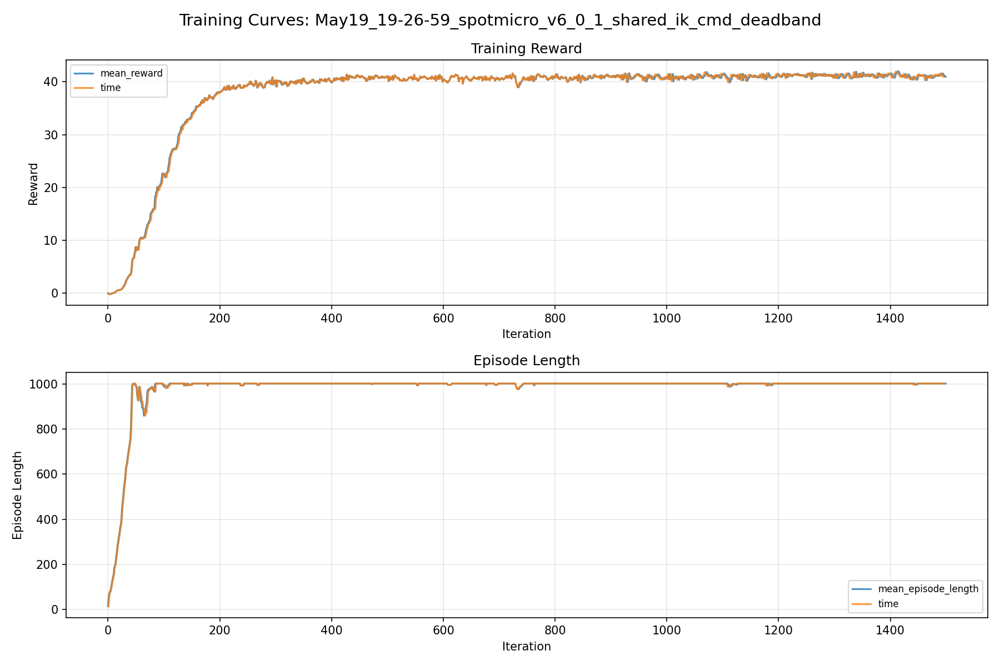
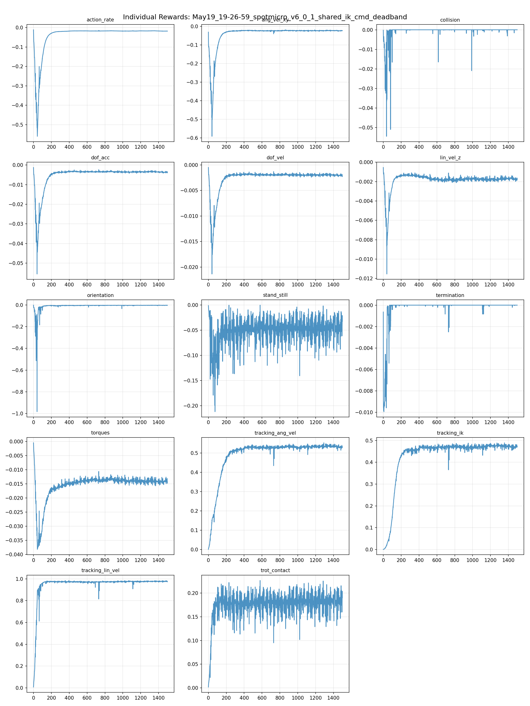
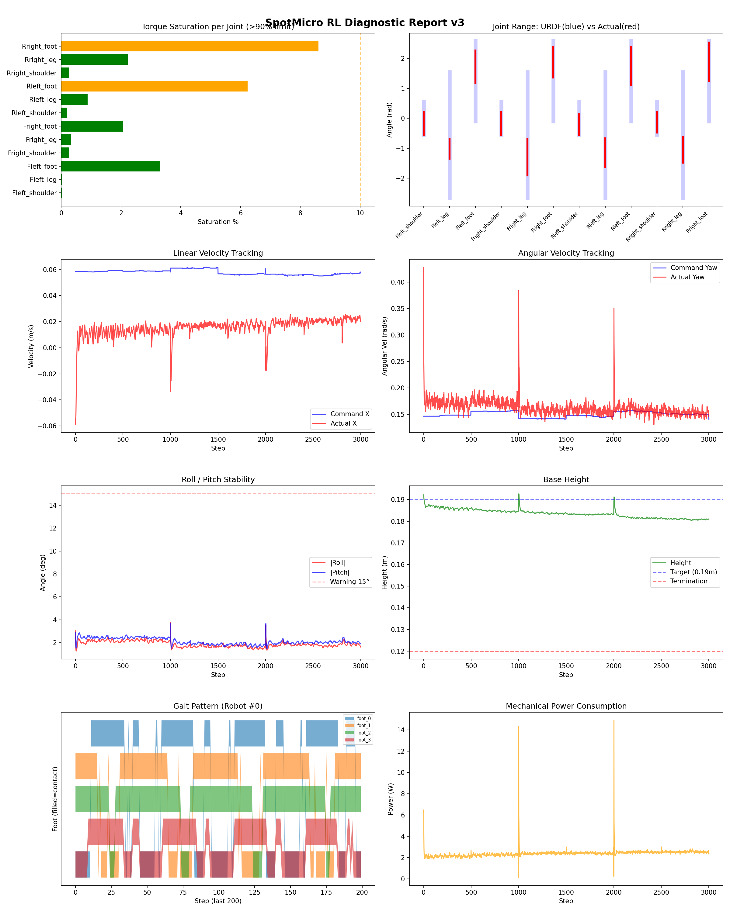
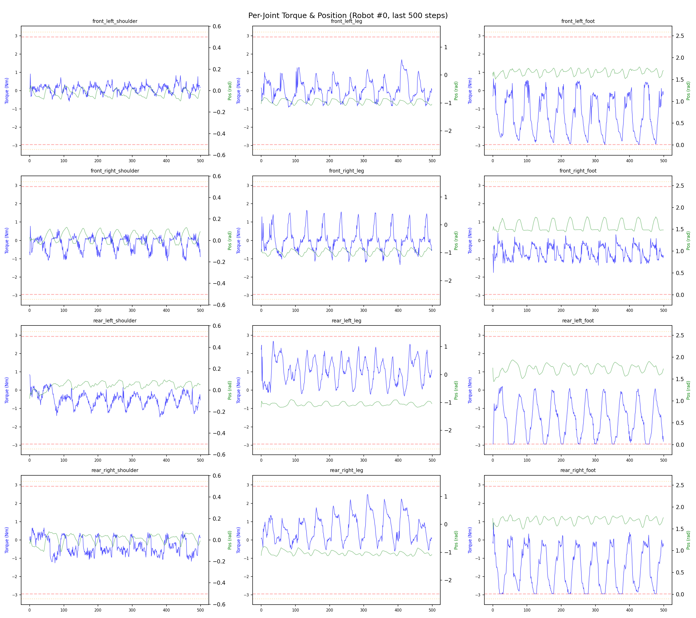
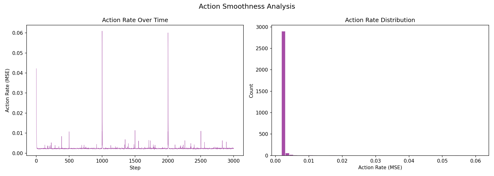

# 실험 062: spotmicro_v6_0_1_shared_ik_cmd_deadband

- **날짜:** 2026-05-19 19:55
- **Task:** spotmicro_test
- **Run name:** `spotmicro_v6_0_1_shared_ik_cmd_deadband`
- **판정:** ✅ PASS

---

## 실험 목적

v6.0.1: deadband 조정으로 걷는지 확인

---

## 변경점 (이전 커밋 대비)

```diff
diff --git a/ai_training/rl/legged_gym/legged_gym/envs/spotmicro_test/spotmicro_gait.py b/ai_training/rl/legged_gym/legged_gym/envs/spotmicro_test/spotmicro_gait.py
index b03d604..d5494d1 100644
--- a/ai_training/rl/legged_gym/legged_gym/envs/spotmicro_test/spotmicro_gait.py
+++ b/ai_training/rl/legged_gym/legged_gym/envs/spotmicro_test/spotmicro_gait.py
@@ -13,8 +13,8 @@ URDF 관절 구조:
 
 기구학 파라미터 (URDF에서 추출):
   - shoulder → leg joint offset:  (0, ±0.052, 0)
-  - leg → foot joint offset:     (0.01, 0, -0.12)  → L1_eff = 0.12042m
-  - foot → toe offset (fixed):   (0, 0, -0.115)    → L2 = 0.115m
+  - leg → foot joint offset:     (0, 0, -0.105)    → L1_eff = 0.105m
+  - foot → toe offset (fixed):   (0, 0, -0.130)    → L2 = 0.130m
 """
 
 import numpy as np
@@ -24,12 +24,12 @@ import math
 # ============================================================
 # URDF 기구학 상수
 # ============================================================
-L1_X = 0.01      # upper leg X offset (forward lean)
-L1_Z = 0.12      # upper leg Z offset (downward)
-L2   = 0.115     # lower leg length (foot → toe)
+L1_X = 0.0       # upper leg X offset (forward lean)
+L1_Z = 0.105     # upper leg Z offset (downward)
+L2   = 0.130     # lower leg length (foot → toe)
 
-L1_EFF = math.sqrt(L1_X**2 + L1_Z**2)  # 0.12042m
-ALPHA  = math.atan2(L1_X, L1_Z)         # 0.0833 rad (upper leg offset angle)
+L1_EFF = math.sqrt(L1_X**2 + L1_Z**2)  # 0.105m
+ALPHA  = math.atan2(L1_X, L1_Z)         # upper leg offset angle
 
 # 관절 한계 (URDF)
 JOINT_LIMITS = {
diff --git a/ai_training/rl/legged_gym/legged_gym/envs/spotmicro_test/spotmicro_test.py b/ai_training/rl/legged_gym/legged_gym/envs/spotmicro_test/spotmicro_test.py
index a7b5157..d5f50ba 100644
--- a/ai_training/rl/legged_gym/legged_gym/envs/spotmicro_test/spotmicro_test.py
+++ b/ai_training/rl/legged_gym/legged_gym/envs/spotmicro_test/spotmicro_test.py
@@ -1,8 +1,29 @@
 from legged_gym.envs.base.legged_robot import LeggedRobot
 from isaacgym.torch_utils import torch_rand_float, quat_from_euler_xyz
 from isaacgym import gymtorch
+from pathlib import Path
+import sys
 import torch
-  
+
+
+def _ensure_locomotion_common_on_path():
+    try:
+        from locomotion_common import TorchSharedTrotReference  # noqa: F401
+        return
+    except ImportError:
+        pass
+
+    for parent in Path(__file__).resolve().parents:
+        candidate = parent / "robot_ws" / "src" / "control" / "locomotion_common"
+        if candidate.exists():
+            sys.path.insert(0, str(candidate))
+            return
+
+
+_ensure_locomotion_common_on_path()
+from locomotion_common import TorchSharedTrotReference
+
+
 class SpotmicroTest(LeggedRobot):
     def _init_buffers(self):
         super()._init_buffers()
@@ -10,50 +31,12 @@ class SpotmicroTest(LeggedRobot):
         self.gym.refresh_rigid_body_state_tensor(self.sim)
         self.rigid_body_states = gymtorch.wrap_tensor(rigid_body_state).view(
             self.num_envs, self.num_bodies, 13)
-        se
```

**변경 요약:**
  - - leg → foot joint offset:     (0.01, 0, -0.12)  → L1_eff = 0.12042m
  - - foot → toe offset (fixed):   (0, 0, -0.115)    → L2 = 0.115m
  + - leg → foot joint offset:     (0, 0, -0.105)    → L1_eff = 0.105m
  + - foot → toe offset (fixed):   (0, 0, -0.130)    → L2 = 0.130m
  - L1_X = 0.01      # upper leg X offset (forward lean)
  - L1_Z = 0.12      # upper leg Z offset (downward)
  - L2   = 0.115     # lower leg length (foot → toe)
  + L1_X = 0.0       # upper leg X offset (forward lean)
  + L1_Z = 0.105     # upper leg Z offset (downward)
  + L2   = 0.130     # lower leg length (foot → toe)
  - L1_EFF = math.sqrt(L1_X**2 + L1_Z**2)  # 0.12042m
  - ALPHA  = math.atan2(L1_X, L1_Z)         # 0.0833 rad (upper leg offset angle)
  + L1_EFF = math.sqrt(L1_X**2 + L1_Z**2)  # 0.105m
  + ALPHA  = math.atan2(L1_X, L1_Z)         # upper leg offset angle
  + from pathlib import Path
  + import sys
  + def _ensure_locomotion_common_on_path():
  + try:
  + from locomotion_common import TorchSharedTrotReference  # noqa: F401
  + return
  + except ImportError:
  + pass
  + for parent in Path(__file__).resolve().parents:
  + candidate = parent / "robot_ws" / "src" / "control" / "locomotion_common"
  + if candidate.exists():
  + sys.path.insert(0, str(candidate))
  + return
  + _ensure_locomotion_common_on_path()
  + from locomotion_common import TorchSharedTrotReference
  - self.gait_freq = 2.0
  - self.L1_X = 0.01
  - self.L1_Z = 0.12
  - self.L2 = 0.115
  - self.L1_EFF = (0.01**2 + 0.12**2)**0.5
  - self.ALPHA = torch.atan2(torch.tensor(0.01), torch.tensor(0.12)).item()
  - self.robot_width = 0.15
  - self.gait_period = 1.0
  - self.duty_factor = 0.55
  - self.step_height = 0.025
  - self.body_height = 0.206
  + self._init_ik_reference()
  - self.leg_origin_x = torch.tensor(
  - [0.093, 0.093, -0.093, -0.093],
  - device=self.device,
  - dtype=torch.float,
  - )
  - self.leg_origin_y = torch.tensor(
  - [0.036, -0.036, 0.036, -0.036],
  - device=self.device,
  - dtype=torch.float,
  - )
  - self.shoulder_sign = torch.tensor(
  - [1.0, -1.0, 1.0, -1.0],
  - device=self.device,
  - dtype=torch.float,
  - )
  - self.max_stride_x = 0.12
  - self.max_stride_y = 0.03
  - self.shoulder_y_gain = 1.0
  - self.shoulder_ref_limit = 0.1
  + def _init_ik_reference(self):
  + ik_cfg = self.cfg.ik
  + self.gait_period = float(ik_cfg.gait_period)
  + self.duty_factor = float(ik_cfg.duty_factor)
  + self.phase_cmd_norm = float(ik_cfg.phase_cmd_norm)
  + self.blend_cmd_norm = float(ik_cfg.blend_cmd_norm)
  + self.phase_offsets = torch.tensor(
  + ik_cfg.phase_offsets,
  + device=self.device,
  + dtype=torch.float,
  + )
  + self.ik_reference = TorchSharedTrotReference(
  + device=self.device,
  + dtype=torch.float,
  + gait_period=ik_cfg.gait_period,
  + duty_factor=ik_cfg.duty_factor,
  + body_height=ik_cfg.body_height,
  + step_height=ik_cfg.step_height,
  + default_foot_x=ik_cfg.default_foot_x,
  + default_foot_y=ik_cfg.default_foot_y,
  + leg_origin_x=ik_cfg.leg_origin_x,
  + leg_origin_y=ik_cfg.leg_origin_y,
  + shoulder_sign=ik_cfg.shoulder_sign,
  + phase_offsets=ik_cfg.phase_offsets,
  + max_stride_x=ik_cfg.max_stride_x,
  + max_stride_y=ik_cfg.max_stride_y,
  + upper_link_x=ik_cfg.upper_link_x,
  + upper_link_z=ik_cfg.upper_link_z,
  + lower_link=ik_cfg.lower_link,
  + shoulder_y_gain=ik_cfg.shoulder_y_gain,
  + shoulder_limit=ik_cfg.shoulder_limit,
  + joint_min=ik_cfg.joint_min,
  + joint_max=ik_cfg.joint_max,
  + )
  - phase_scale = torch.clamp(cmd_norm / 0.1, 0.0, 1.0)  # 0.1 이하면 감속→정지
  + phase_scale = torch.clamp(cmd_norm / self.phase_cmd_norm, 0.0, 1.0)  # phase_cmd_norm 이하면 감속→정지
  - self.reset_buf |= (base_height < 0.155)
  + min_base_height = getattr(self.cfg.rewards, "min_base_height", 0.155)
  + self.reset_buf |= (base_height < min_base_height)
  + def _resample_commands(self, env_ids):
  + if len(env_ids) == 0:
  + return
  + self.commands[env_ids, 0] = torch_rand_float(
  + self.command_ranges["lin_vel_x"][0],
  + self.command_ranges["lin_vel_x"][1],
  + (len(env_ids), 1),
  + device=self.device,
  + ).squeeze(1)
  + self.commands[env_ids, 1] = torch_rand_float(
  + self.command_ranges["lin_vel_y"][0],
  + self.command_ranges["lin_vel_y"][1],
  + (len(env_ids), 1),
  + device=self.device,
  + ).squeeze(1)
  + if self.cfg.commands.heading_command:
  + self.commands[env_ids, 3] = torch_rand_float(
  + self.command_ranges["heading"][0],
  + self.command_ranges["heading"][1],
  + (len(env_ids), 1),
  + device=self.device,
  + ).squeeze(1)
  + else:
  + self.commands[env_ids, 2] = torch_rand_float(
  + self.command_ranges["ang_vel_yaw"][0],
  + self.command_ranges["ang_vel_yaw"][1],
  + (len(env_ids), 1),
  + device=self.device,
  + ).squeeze(1)
  + deadband = getattr(self.cfg.commands, "command_deadband", 0.02)
  + if deadband <= 0.0:
  + return
  + lin_norm = torch.norm(self.commands[env_ids, :2], dim=1)
  + self.commands[env_ids, :2] *= (lin_norm > deadband).unsqueeze(1)
  - vx = self.commands[:, 0].unsqueeze(1)  # [N, 1]
  - vy = self.commands[:, 1].unsqueeze(1)  # [N, 1]
  - wz = self.commands[:, 2].unsqueeze(1)  # [N, 1]
  - leg_x = self.leg_origin_x.unsqueeze(0)  # [1, 4]
  - leg_y = self.leg_origin_y.unsqueeze(0)  # [1, 4]
  - '''
  - self.turn_half_width = 0.09
  - turn_y = torch.sign(self.leg_origin_y).unsqueeze(0) * self.turn_half_width
  - foot_vx = vx - wz * turn_y
  - '''
  - foot_vx = vx - wz * leg_y
  - foot_vy = vy + wz * leg_x
  - stance_time = self.gait_period * self.duty_factor
  - stride_x = foot_vx * stance_time
  - stride_y = foot_vy * stance_time
  - stride_x = torch.clamp(
  - stride_x,
  - -self.max_stride_x,
  - self.max_stride_x,
  - )
  - stride_y = torch.clamp(
  - stride_y,
  - -self.max_stride_y,
  - self.max_stride_y,
  - )
  - offsets = torch.tensor(
  - [0.0, 0.5, 0.5, 0.0],
  - device=self.device,
  - dtype=torch.float,
  - )
  - phases = (self.gait_phase + offsets) % 1.0
  - x = torch.zeros((self.num_envs, 4), device=self.device)
  - y = torch.zeros((self.num_envs, 4), device=self.device)
  - z = torch.full(
  - (self.num_envs, 4),
  - -self.body_height,
  - device=self.device,
  - )
  - is_stance = phases < self.duty_factor
  - is_swing = ~is_stance
  - t_stance = phases / self.duty_factor
  - t_swing = (phases - self.duty_factor) / (1.0 - self.duty_factor)
  - x[is_stance] = stride_x[is_stance] * (0.5 - t_stance[is_stance])
  - y[is_stance] = stride_y[is_stance] * (0.5 - t_stance[is_stance])
  - x[is_swing] = stride_x[is_swing] * (-0.5 + t_swing[is_swing])
  - y[is_swing] = stride_y[is_swing] * (-0.5 + t_swing[is_swing])
  - z[is_swing] = (
  - -self.body_height
  - + self.step_height * torch.sin(torch.pi * t_swing[is_swing])
  - )
  - shoulder_raw = self.shoulder_y_gain * torch.atan2(y, -z)
  - shoulder_ref = torch.clamp(
  - shoulder_raw,
  - -self.shoulder_ref_limit,
  - self.shoulder_ref_limit,
  - )
  - shoulder_ref = shoulder_ref * self.shoulder_sign.unsqueeze(0)
  - z_eff = -torch.sqrt(torch.clamp(z * z + y * y, min=1e-6))
  - d = torch.sqrt(x**2 + z_eff**2)
  - cos_q2 = (d**2 - self.L1_EFF**2 - self.L2**2) / (
  - 2 * self.L1_EFF * self.L2
  - )
  - cos_q2 = torch.clamp(cos_q2, -0.999, 0.999)
  - q2 = torch.acos(cos_q2)
  - beta = torch.atan2(x, -z_eff)
  - alpha_k = torch.atan2(
  - self.L2 * torch.sin(q2),
  - self.L1_EFF + self.L2 * torch.cos(q2),
  + ref_dof_pos = self.ik_reference.get_reference(
  + self.gait_phase,
  + self.commands[:, :3],
  - q1 = beta - alpha_k
  - theta_leg = q1 - self.ALPHA
  - theta_foot = q2 + self.ALPHA
  - ref_dof_pos = torch.zeros((self.num_envs, 12), device=self.device)
  - ref_dof_pos[:, 0::3] = shoulder_ref
  - ref_dof_pos[:, 1::3] = theta_leg
  - ref_dof_pos[:, 2::3] = theta_foot
  - blend = torch.clamp(cmd_norm / 0.1, 0.0, 1.0)
  + blend = torch.clamp(cmd_norm / self.blend_cmd_norm, 0.0, 1.0)
  - offsets = torch.tensor([0.0, 0.5, 0.5, 0.0], device=self.device)
  - phases = (self.gait_phase + offsets) % 1.0
  + phases = (self.gait_phase + self.phase_offsets) % 1.0
  + class ik:
  + gait_period = 1.0
  + duty_factor = 0.55
  + phase_cmd_norm = 0.1
  + blend_cmd_norm = 0.1
  + body_height = [0.170, 0.170, 0.170, 0.170]
  + step_height = [0.016, 0.016, 0.019, 0.019]
  + default_foot_x = [-0.010, -0.010, -0.010, -0.010]
  + default_foot_y = [0.0, 0.0, 0.0, 0.0]
  + leg_origin_x = [0.093, 0.093, -0.093, -0.093]
  + leg_origin_y = [0.036, -0.036, 0.036, -0.036]
  + shoulder_sign = [1.0, -1.0, 1.0, -1.0]
  + phase_offsets = [0.0, 0.5, 0.5, 0.0]
  + max_stride_x = 0.085
  + max_stride_y = 0.025
  + upper_link_x = 0.0
  + upper_link_z = 0.105
  + lower_link = 0.130
  + shoulder_y_gain = 1.0
  + shoulder_limit = 0.16
  + joint_min = [
  + -0.548, -2.666, -0.100,
  + -0.548, -2.666, -0.100,
  + -0.548, -2.666, -0.100,
  + -0.548, -2.666, -0.100,
  + ]
  + joint_max = [
  + 0.548, 1.548, 2.590,
  + 0.548, 1.548, 2.590,
  + 0.548, 1.548, 2.590,
  + 0.548, 1.548, 2.590,
  + ]
  - pos = [0.0, 0.0, 0.23]
  + pos = [0.0, 0.0, 0.19]
  - 'front_left_leg': -0.6,
  - 'front_left_foot': 1.1,
  + 'front_left_leg': -0.9263791118902657,
  + 'front_left_foot': 1.5314088540972293,
  - 'front_right_leg': -0.6,
  - 'front_right_foot': 1.1,
  + 'front_right_leg': -0.9263791118902657,
  + 'front_right_foot': 1.5314088540972293,
  - 'rear_left_leg': -0.6,
  - 'rear_left_foot': 1.1,
  + 'rear_left_leg': -0.9263791118902657,
  + 'rear_left_foot': 1.5314088540972293,
  - 'rear_right_leg': -0.6,
  - 'rear_right_foot': 1.1,
  + 'rear_right_leg': -0.9263791118902657,
  + 'rear_right_foot': 1.5314088540972293,
  - tracking_lin_vel = 0.5
  - tracking_ang_vel = 0.5
  + tracking_lin_vel = 1.0
  + tracking_ang_vel = 0.7
  - lin_vel_z = -2.0
  - ang_vel_xy = -1.0
  - orientation = -10.0
  - torques = -0.001
  - dof_vel = -0.001
  + lin_vel_z = -1.5
  + ang_vel_xy = -0.5
  + orientation = -4.0
  + torques = -0.0008
  + dof_vel = -0.0005
  - action_rate = -0.05
  + action_rate = -0.04
  - trot_contact = 0.2
  - tracking_ik = 0.8
  - stand_still = -0.5
  + trot_contact = 0.3
  + tracking_ik = 0.6
  + stand_still = -0.3
  - base_height_target = 0.206
  + base_height_target = 0.19
  + min_base_height = 0.13
  + command_deadband = 0.02
  - lin_vel_x = [0.0, 0.3]
  + lin_vel_x = [-0.03, 0.15]
  - ang_vel_yaw = [-0.3, 0.3]
  + ang_vel_yaw = [-0.30, 0.30]
  - run_name = 'spotmicro_v5_6_1_recovery_assist_push'
  + run_name = 'spotmicro_v6_0_1_shared_ik_cmd_deadband'
  - max_iterations = 500
  + max_iterations = 1500
  - resume = True
  - load_run = "May15_16-23-12_spotmicro_v5_6_recovery_assist"
  - checkpoint = 1000
  + resume = False
  + load_run = ""
  + checkpoint = -1
  + if not checkpoint_path and train_cfg.runner.load_run in ("", None):
  + train_cfg.runner.load_run = -1
  + train_cfg.runner.checkpoint = -1
  + data['cmd_abs_vel_x'].append(np.mean(np.abs(cmd_x)))
  + data['cmd_forward_pct'].append(np.mean(cmd_x > 0.02) * 100.0)
  + data['cmd_zero_lin_pct'].append(np.mean(np.sqrt(cmd_x ** 2 + cmd_y ** 2) < 0.02) * 100.0)
  + mean_cmd_abs_x = np.mean(data['cmd_abs_vel_x'])
  + mean_cmd_forward_pct = np.mean(data['cmd_forward_pct'])
  + mean_cmd_zero_lin_pct = np.mean(data['cmd_zero_lin_pct'])
  + print(f"  평균 |cmd_x|: {mean_cmd_abs_x:.4f} m/s")
  + print(f"  전진 command 비율(cmd_x > 0.02): {mean_cmd_forward_pct:.1f}%")
  + print(f"  선속도 zero command 비율(|cmd_xy| < 0.02): {mean_cmd_zero_lin_pct:.1f}%")
  + if mean_cmd_abs_x < 0.02 and env.cfg.commands.ranges.lin_vel_x[1] > 0.05:
  + print(f"  → ⚠ 전진 command가 거의 없습니다. command deadband/sampling 설정 확인 필요.")
  + 'mean_cmd_abs_x': float(mean_cmd_abs_x),
  + 'mean_cmd_forward_pct': float(mean_cmd_forward_pct),
  + 'mean_cmd_zero_lin_pct': float(mean_cmd_zero_lin_pct),
  + 'command_deadband': float(getattr(env.cfg.commands, 'command_deadband', 0.2)),
  + if not models:
  + raise ValueError("No model checkpoints in this directory: " + load_run)

---

## 현재 Reward Scales

| Reward | Scale |
|--------|-------|
| action_rate | -0.04 |
| ang_vel_xy | -0.5 |
| collision | -1.0 |
| dof_acc | -2.5e-07 |
| dof_vel | -0.0005 |
| lin_vel_z | -1.5 |
| orientation | -4.0 |
| stand_still | -0.3 |
| termination | -10.0 |
| torques | -0.0008 |
| tracking_ang_vel | 0.7 |
| tracking_ik | 0.6 |
| tracking_lin_vel | 1.0 |
| trot_contact | 0.3 |

---

## 진단 결과 (Diagnostic)

### 핵심 지표

- ✅ Timeout: 93.4% (≥80%)
- ✅ 속도오차 X: 0.0527 m/s (<0.08)
- ✅ 토크포화: 2.0% (<10%)
- ✅ 자세: roll 1.9°, pitch 2.1° (안정)
- ✅ 조기종료: 0.0% (<5%)

### 상세 수치

| 지표 | 값 |
|------|-----|
| Timeout% | 93.43065693430657 |
| 조기종료% | 0.0 |
| 속도오차 X | 0.0526970699429512 m/s |
| 속도오차 Y | 0.02699565887451172 m/s |
| 각속도오차 | 0.12132833153009415 rad/s |
| 토크포화% | 2.033578400765901 |
| 평균 높이 | 0.18355373561362445 m |
| Roll (평균) | 1.8729496002197266° |
| Pitch (평균) | 2.1124935150146484° |
| Action Rate | 0.002468798542395234 |
| 평균 전력 | 2.3878872394561768 W |
| CoT | 5.711451218074054 |
| Recovery 성공률 | 62.11031175059952% |
| Recovery eligible trials | 417 |
| 평균 회복 시간 | 0.05359073239288735 s |
| Recovery 조기 실패율 | 0.0% |

## Recovery Assist 분석

| 지표 | 값 |
|------|-----|
| 판정 | ⚠️ 일부 회복 가능 |
| Recovery 성공률 | 62.1% |
| 성공/실패 | 259 / 158 |
| Eligible trials | 417 / 804 |
| 평균 회복 시간 | 0.054s |
| 조기 실패율 | 0.0% |
| 평가 horizon | 1.0 s |
| 초기 tilt 기준 | 7.0° |
| 안정 기준 | roll/pitch < 5.0°, height > 0.18m |
| 평균 초기 tilt | 8.52342256958776° |
| 평균 초기 roll/pitch | 6.1804033066181105° / 6.405061488333846° |
| 1초 후 평균 roll/pitch | 2.0084145900925146° / 2.504043054612849° |
| 1초 내 최대 roll/pitch 평균 | 6.702260863509395° / 7.204549668790054° |

> 해석: `Recovery 성공률`은 초기 tilt가 기준 이상인 episode 중 1초 내 안정 자세로 복귀한 비율입니다. 조기 실패율이 높으면 reset 직후 바로 넘어지는 것이고, 평균 회복 시간이 짧을수록 위기 대응이 빠른 것입니다.


## Command Mode별 회전 추종 분석

| 모드 | 비율 | 샘플 수 | 평균 abs(cmd_wz) | 평균 abs(actual_wz) | yaw 오차 | 상태 |
|------|------|---------|------------------|---------------------|----------|------|
| 정지 | 7.7% | 58826 | 0.0257 | 0.0507 | 0.0554 | ⚠️ |
| 직진/저회전 | 26.8% | 205809 | 0.0757 | 0.1403 | 0.1275 | ⚠️ |
| 제자리 회전 | 23.0% | 176461 | 0.2253 | 0.1957 | 0.1277 | ⚠️ |
| 전진+회전 | 26.7% | 205150 | 0.2225 | 0.2158 | 0.1370 | ⚠️ |
| 큰 회전명령 | 0.0% | 0 | N/A | N/A | N/A | N/A |

> 해석 기준: `제자리 회전`만 나쁘면 pure turn 학습/보행 패턴 문제, `큰 회전명령`만 나쁘면 yaw 명령 범위가 현재 토크/보폭 한계보다 큰 문제, `정지`가 나쁘면 stop drift 문제로 보면 됩니다.
        


## 학습 곡선 분석

| 지표 | 값 | 판정 |
|------|-----|------|
| 수렴 iter (90%) | 194 | 빠름 |
| 후반 안정성 (CV) | 0.008 | 안정 |
| 정체 구간 | 있음 (iter 737, 74 iter) | |


## Per-leg 분석

### 발별 접촉/공중 비율

| 발 | 접촉% | 공중% |
|-----|-------|------|
| foot_0 | 75.2% | 24.8% |
| foot_1 | 82.7% | 17.3% |
| foot_2 | 80.6% | 19.4% |
| foot_3 | 80.5% | 19.5% |

### 관절별 토크 포화

| 관절 | 포화% | 최대토크 | 한계 | 상태 |
|------|------|---------|------|------|
| front_left_shoulder | 0.0% | 2.940 | 2.940 | ✅ |
| front_left_leg | 0.0% | 2.940 | 2.940 | ✅ |
| front_left_foot | 3.3% | 2.940 | 2.940 | ✅ |
| front_right_shoulder | 0.3% | 2.940 | 2.940 | ✅ |
| front_right_leg | 0.3% | 2.940 | 2.940 | ✅ |
| front_right_foot | 2.1% | 2.940 | 2.940 | ✅ |
| rear_left_shoulder | 0.2% | 2.940 | 2.940 | ✅ |
| rear_left_leg | 0.9% | 2.940 | 2.940 | ✅ |
| rear_left_foot | 6.2% | 2.940 | 2.940 | ⚠️ |
| rear_right_shoulder | 0.3% | 2.940 | 2.940 | ✅ |
| rear_right_leg | 2.2% | 2.940 | 2.940 | ✅ |
| rear_right_foot | 8.6% | 2.940 | 2.940 | ⚠️ |


## Gait 분석

| 지표 | 값 |
|------|-----|
| Gait 주파수 | 0.25 Hz |
| Gait 주기 | 50 steps |
| 대각 동기화율 | 88.0% |
| L/R 비대칭 | 0.0%p |
| 판정 | ✅ Trot 패턴 / ✅ 대칭 |


## 관절별 상세

| 관절 | 토크포화% | 사용범위% | 편향(rad) | 한계근접% | 상태 |
|------|----------|----------|----------|----------|------|
| front_left_shoulder | 0.0% | 70% | -0.171 | 0.0% | ⚠️ |
| front_left_leg | 0.0% | 15% | -1.022 | 0.0% | ⚠️ |
| front_left_foot | 3.3% | 40% | +1.726 | 0.0% | ⚠️ |
| front_right_shoulder | 0.3% | 72% | -0.174 | 0.2% | ⚠️ |
| front_right_leg | 0.3% | 29% | -1.301 | 0.0% | ⚠️ |
| front_right_foot | 2.1% | 38% | +1.880 | 0.0% | ⚠️ |
| rear_left_shoulder | 0.2% | 64% | -0.213 | 0.1% | ⚠️ |
| rear_left_leg | 0.9% | 23% | -1.148 | 0.0% | ⚠️ |
| rear_left_foot | 6.2% | 47% | +1.747 | 0.0% | ⚠️ |
| rear_right_shoulder | 0.3% | 62% | -0.137 | 0.0% | ⚠️ |
| rear_right_leg | 2.2% | 20% | -1.052 | 0.0% | ⚠️ |
| rear_right_foot | 8.6% | 48% | +1.897 | 0.0% | ⚠️ |


## 에너지 효율 상세

| 지표 | 값 |
|------|-----|
| 평균 전력 | 2.39 W |
| 피크 전력 | 14.92 W |
| 피크/평균 비율 | 6.2x |
| CoT | 5.71 |

### 관절별 전력 분배

| 관절 | 평균전력(W) | 비율% |
|------|-----------|-------|
| rear_right_foot | 0.532 | 22.3% |
| front_left_foot | 0.358 | 15.0% |
| rear_left_foot | 0.334 | 14.0% |
| front_right_foot | 0.285 | 11.9% |
| rear_right_leg | 0.254 | 10.6% |
| front_right_leg | 0.165 | 6.9% |
| front_left_leg | 0.150 | 6.3% |
| rear_left_leg | 0.130 | 5.4% |
| rear_right_shoulder | 0.057 | 2.4% |
| front_right_shoulder | 0.045 | 1.9% |
| rear_left_shoulder | 0.043 | 1.8% |
| front_left_shoulder | 0.035 | 1.5% |


## 이전 실험 대비 비교

| 지표 | 이전 (exp061) | 현재 (exp062) | 변화 |
|------|-------|-------|------|
| Timeout% | 97.5% | 93.4% | ⚠️ ↓ 4.0932% |
| 속도오차 X | 0.0245 | 0.0527 | ⚠️ ↑ 0.0282m/s |
| 토크포화 | 2.1% | 2.0% | ✅ ↓ 0.0727% |
| Roll | 2.3° | 1.9° | ✅ ↓ 0.3925° |
| Pitch | 2.5° | 2.1° | ✅ ↓ 0.3614° |
| 평균 전력 | 1.8408W | 2.3879W | ⚠️ ↑ 0.5471W |


## Tensorboard 학습 곡선 요약

| 스칼라 | 최종값 | 최대 | 최소 | 후반10% 평균 |
|--------|--------|------|------|-------------|
| rew_action_rate | -0.0183 | -0.0116 | -0.5600 | -0.0179 |
| rew_ang_vel_xy | -0.0234 | -0.0190 | -0.5920 | -0.0235 |
| rew_collision | 0.0000 | 0.0000 | -0.0545 | -0.0000 |
| rew_dof_acc | -0.0037 | -0.0012 | -0.0555 | -0.0036 |
| rew_dof_vel | -0.0021 | -0.0005 | -0.0214 | -0.0020 |
| rew_lin_vel_z | -0.0017 | -0.0005 | -0.0115 | -0.0017 |
| rew_orientation | -0.0035 | -0.0018 | -0.9824 | -0.0034 |
| rew_stand_still | -0.0324 | -0.0001 | -0.2118 | -0.0428 |
| rew_termination | 0.0000 | 0.0000 | -0.0099 | -0.0000 |
| rew_torques | -0.0144 | -0.0005 | -0.0382 | -0.0142 |
| rew_tracking_ang_vel | 0.5331 | 0.5522 | 0.0014 | 0.5326 |
| rew_tracking_ik | 0.4705 | 0.4892 | 0.0007 | 0.4717 |
| rew_tracking_lin_vel | 0.9731 | 0.9849 | 0.0079 | 0.9769 |
| rew_trot_contact | 0.1901 | 0.2266 | 0.0018 | 0.1844 |
| learning_rate | 0.0003 | 0.0058 | 0.0000 | 0.0003 |
| surrogate | -0.0018 | 0.0027 | -0.0083 | -0.0023 |
| value_function | 0.0093 | 0.2407 | 0.0009 | 0.0128 |
| collection time | 0.6839 | 0.8253 | 0.6535 | 0.7088 |
| learning_time | 0.2890 | 0.3389 | 0.2696 | 0.2939 |
| total_fps | 101049.0000 | 104250.0000 | 84441.0000 | 98115.4267 |
| mean_noise_std | 0.1263 | 1.0002 | 0.1157 | 0.1243 |
| mean_episode_length | 1002.0000 | 1002.0000 | 13.7100 | 1001.8397 |
| time | 1002.0000 | 1002.0000 | 13.7100 | 1001.8397 |
| mean_reward | 40.9577 | 41.9714 | -0.1811 | 41.1293 |
| time | 40.9577 | 41.9714 | -0.1811 | 41.1293 |

총 학습 iteration: 1499


---

## 그래프

### Tensorboard 학습 곡선



### Diagnostic 결과





---

## 결론 및 다음 실험 방향

**자동 판정:** ✅ PASS

모든 기준을 통과했습니다. 다음 Step으로 진행 가능합니다.

> 💡 위 결론은 자동 생성되었습니다. 필요시 수정하세요.

---

## 메모

_(추가 메모가 있으면 여기에 작성)_

