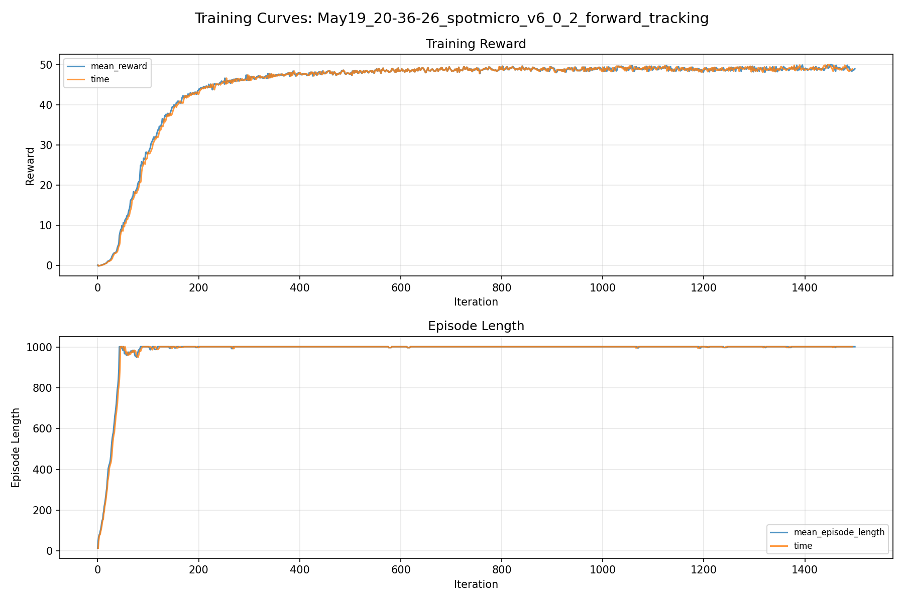
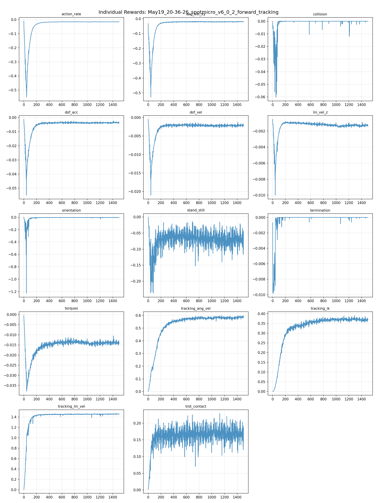
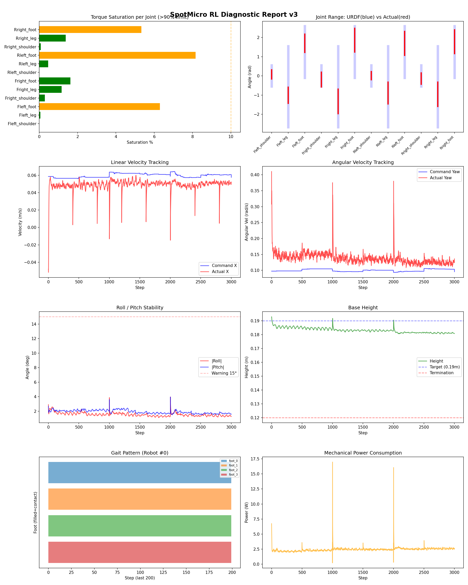
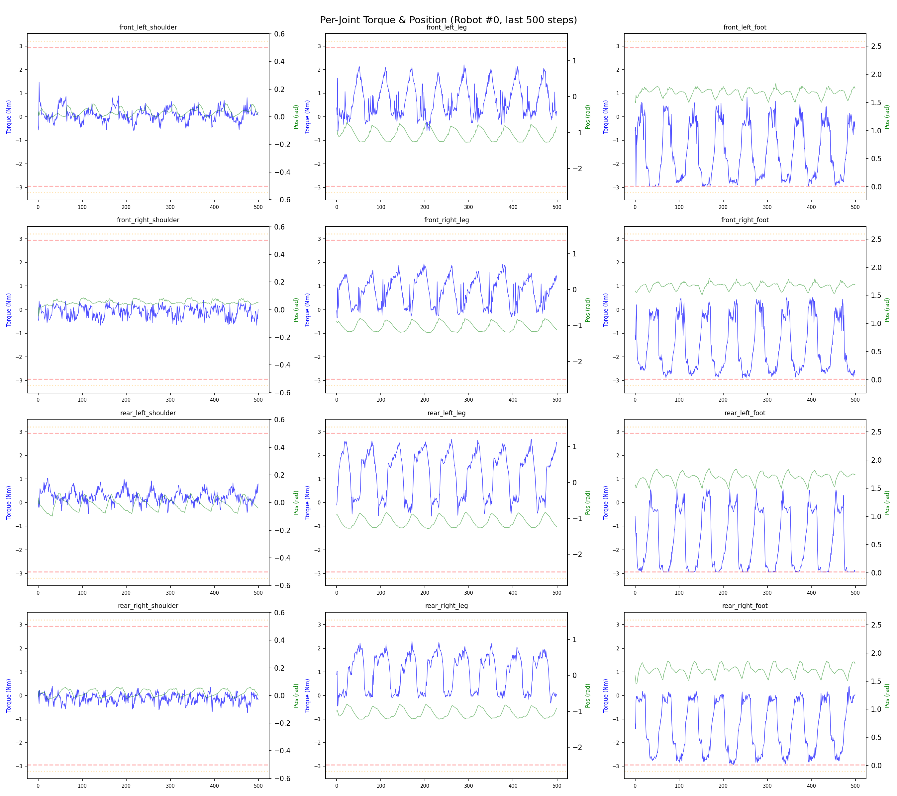
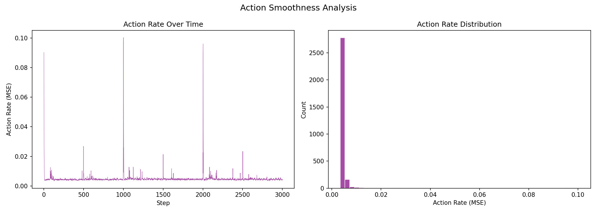

# 실험 063: spotmicro_v6_0_2_forward_tracking

- **날짜:** 2026-05-19 21:05
- **Task:** spotmicro_test
- **Run name:** `spotmicro_v6_0_2_forward_tracking`
- **판정:** ✅ PASS

---

## 실험 목적

v6.2: 설정 common IK 초기와 동일하게 변경하고 선속도 추종 증가

---

## 변경점 (이전 커밋 대비)

```diff
diff --git a/ai_training/rl/legged_gym/legged_gym/envs/spotmicro_test/spotmicro_test_config.py b/ai_training/rl/legged_gym/legged_gym/envs/spotmicro_test/spotmicro_test_config.py
index 4402ee5..adb5339 100644
--- a/ai_training/rl/legged_gym/legged_gym/envs/spotmicro_test/spotmicro_test_config.py
+++ b/ai_training/rl/legged_gym/legged_gym/envs/spotmicro_test/spotmicro_test_config.py
@@ -10,13 +10,13 @@ class SpotmicroTestCfg(LeggedRobotCfg):
 
     class ik:
         # Same gait/IK model as robot_ws/src/control/locomotion_common.
-        gait_period = 1.0
-        duty_factor = 0.55
+        gait_period = 1.2
+        duty_factor = 0.58
         phase_cmd_norm = 0.1
         blend_cmd_norm = 0.1
 
         body_height = [0.170, 0.170, 0.170, 0.170]
-        step_height = [0.016, 0.016, 0.019, 0.019]
+        step_height = [0.013, 0.013, 0.016, 0.016]
         default_foot_x = [-0.010, -0.010, -0.010, -0.010]
         default_foot_y = [0.0, 0.0, 0.0, 0.0]
 
@@ -25,8 +25,8 @@ class SpotmicroTestCfg(LeggedRobotCfg):
         shoulder_sign = [1.0, -1.0, 1.0, -1.0]
         phase_offsets = [0.0, 0.5, 0.5, 0.0]
 
-        max_stride_x = 0.085
-        max_stride_y = 0.025
+        max_stride_x = 0.070
+        max_stride_y = 0.035
         upper_link_x = 0.0
         upper_link_z = 0.105
         lower_link = 0.130
@@ -87,8 +87,8 @@ class SpotmicroTestCfg(LeggedRobotCfg):
 
     class rewards(LeggedRobotCfg.rewards):
         class scales:
-            tracking_lin_vel = 1.0
-            tracking_ang_vel = 0.7
+            tracking_lin_vel = 1.5
+            tracking_ang_vel = 0.8
             termination = -10.0
             lin_vel_z = -1.5
             ang_vel_xy = -0.5
@@ -105,13 +105,13 @@ class SpotmicroTestCfg(LeggedRobotCfg):
             symmetric_gait = 0.0
             feet_clearance = 0.0
             trot_contact = 0.3
-            tracking_ik = 0.6
+            tracking_ik = 0.5
             stand_still = -0.3
         soft_dof_pos_limit = 0.9
         base_height_target = 0.19
         min_base_height = 0.13
-        tracking_sigma = 0.1
-        tracking_sigma_ang_vel = 0.05
+        tracking_sigma = 0.02
+        tracking_sigma_ang_vel = 0.03
 
     class normalization(LeggedRobotCfg.normalization):
         class obs_scales:
@@ -142,7 +142,7 @@ class SpotmicroTestCfg(LeggedRobotCfg):
         class ranges:
             lin_vel_x = [-0.03, 0.15]
             lin_vel_y = [0.0, 0.0]
-            ang_vel_yaw = [-0.30, 0.30]
+            ang_vel_yaw = [-0.20, 0.20]
             heading = [-3.14, 3.14]
 
     class domain_rand(LeggedRobotCfg.domain_rand):
@@ -164,7 +164,7 @@ class SpotmicroTestCfgPPO(LeggedRobotCfgPPO):
         learning_rate = 1e-4
 
     class runner(LeggedRobotCfgPPO.runner):
-        run_name = 'spotmicro_v6_0_1_shared_ik_cmd_deadband'
+        run_name = 'spotmicro_v6_0_2_forward_tracking'
         experiment_name = 'spotmicro_test'
         max_iterations = 1500
         save_interval = 100
diff --git a/ai_training/rl
```

**변경 요약:**
  - gait_period = 1.0
  - duty_factor = 0.55
  + gait_period = 1.2
  + duty_factor = 0.58
  - step_height = [0.016, 0.016, 0.019, 0.019]
  + step_height = [0.013, 0.013, 0.016, 0.016]
  - max_stride_x = 0.085
  - max_stride_y = 0.025
  + max_stride_x = 0.070
  + max_stride_y = 0.035
  - tracking_lin_vel = 1.0
  - tracking_ang_vel = 0.7
  + tracking_lin_vel = 1.5
  + tracking_ang_vel = 0.8
  - tracking_ik = 0.6
  + tracking_ik = 0.5
  - tracking_sigma = 0.1
  - tracking_sigma_ang_vel = 0.05
  + tracking_sigma = 0.02
  + tracking_sigma_ang_vel = 0.03
  - ang_vel_yaw = [-0.30, 0.30]
  + ang_vel_yaw = [-0.20, 0.20]
  - run_name = 'spotmicro_v6_0_1_shared_ik_cmd_deadband'
  + run_name = 'spotmicro_v6_0_2_forward_tracking'
  + data['actual_abs_vel_x'].append(np.mean(np.abs(vel_x)))
  + data['actual_forward_pct'].append(np.mean(vel_x > 0.02) * 100.0)
  + mean_actual_abs_x = np.mean(data['actual_abs_vel_x'])
  + mean_actual_forward_pct = np.mean(data['actual_forward_pct'])
  + forward_tracking_ratio = (
  + mean_actual_abs_x / mean_cmd_abs_x
  + if mean_cmd_abs_x > 1.0e-6 else 0.0
  + )
  - cot = mean_power / (robot_mass * 9.81 * mean_vel) if mean_vel > 0.01 else 0.0
  + cot = mean_power / (robot_mass * 9.81 * mean_actual_abs_x) if mean_actual_abs_x > 0.01 else 0.0
  + print(f"  평균 |actual_x|: {mean_actual_abs_x:.4f} m/s")
  + print(f"  전진 추종 비율(|actual_x|/|cmd_x|): {forward_tracking_ratio:.2f}")
  + print(f"  실제 전진 비율(actual_x > 0.02): {mean_actual_forward_pct:.1f}%")
  + 'mean_actual_abs_x': float(mean_actual_abs_x),
  + 'forward_tracking_ratio': float(forward_tracking_ratio),
  + 'mean_actual_forward_pct': float(mean_actual_forward_pct),

---

## 현재 Reward Scales

| Reward | Scale |
|--------|-------|
| action_rate | -0.04 |
| ang_vel_xy | -0.5 |
| collision | -1.0 |
| dof_acc | -2.5e-07 |
| dof_vel | -0.0005 |
| lin_vel_z | -1.5 |
| orientation | -4.0 |
| stand_still | -0.3 |
| termination | -10.0 |
| torques | -0.0008 |
| tracking_ang_vel | 0.8 |
| tracking_ik | 0.5 |
| tracking_lin_vel | 1.5 |
| trot_contact | 0.3 |

---

## 진단 결과 (Diagnostic)

### 핵심 지표

- ✅ Timeout: 92.3% (≥80%)
- ✅ 속도오차 X: 0.0292 m/s (<0.08)
- ✅ 토크포화: 2.1% (<10%)
- ✅ 자세: roll 1.6°, pitch 1.9° (안정)
- ✅ 조기종료: 0.0% (<5%)

### 상세 수치

| 지표 | 값 |
|------|-----|
| Timeout% | 92.25225225225225 |
| 조기종료% | 0.0 |
| 속도오차 X | 0.02922874689102173 m/s |
| 속도오차 Y | 0.02309897169470787 m/s |
| 각속도오차 | 0.11003398895263672 rad/s |
| 토크포화% | 2.0718647671772668 |
| 평균 높이 | 0.18320056615949987 m |
| Roll (평균) | 1.5600897073745728° |
| Pitch (평균) | 1.9186713695526123° |
| Action Rate | 0.004880508873611689 |
| 평균 전력 | 2.4391682147979736 W |
| CoT | 1.6828390421679615 |
| Recovery 성공률 | 58.66336633663366% |
| Recovery eligible trials | 404 |
| 평균 회복 시간 | 0.06556961878756934 s |
| Recovery 조기 실패율 | 0.0% |

## Recovery Assist 분석

| 지표 | 값 |
|------|-----|
| 판정 | ⚠️ 일부 회복 가능 |
| Recovery 성공률 | 58.7% |
| 성공/실패 | 237 / 167 |
| Eligible trials | 404 / 811 |
| 평균 회복 시간 | 0.066s |
| 조기 실패율 | 0.0% |
| 평가 horizon | 1.0 s |
| 초기 tilt 기준 | 7.0° |
| 안정 기준 | roll/pitch < 5.0°, height > 0.18m |
| 평균 초기 tilt | 8.567298939268795° |
| 평균 초기 roll/pitch | 6.339356395650195° / 6.471402033124682° |
| 1초 후 평균 roll/pitch | 2.080393783844106° / 1.907078473896738° |
| 1초 내 최대 roll/pitch 평균 | 7.045896634311959° / 7.098429069070533° |

> 해석: `Recovery 성공률`은 초기 tilt가 기준 이상인 episode 중 1초 내 안정 자세로 복귀한 비율입니다. 조기 실패율이 높으면 reset 직후 바로 넘어지는 것이고, 평균 회복 시간이 짧을수록 위기 대응이 빠른 것입니다.


## Command Mode별 회전 추종 분석

| 모드 | 비율 | 샘플 수 | 평균 abs(cmd_wz) | 평균 abs(actual_wz) | yaw 오차 | 상태 |
|------|------|---------|------------------|---------------------|----------|------|
| 정지 | 10.8% | 82948 | 0.0267 | 0.0661 | 0.0688 | ❌ |
| 직진/저회전 | 41.5% | 319154 | 0.0753 | 0.1384 | 0.1187 | ⚠️ |
| 제자리 회전 | 11.6% | 88806 | 0.1742 | 0.1758 | 0.1115 | ⚠️ |
| 전진+회전 | 12.3% | 94198 | 0.1753 | 0.1907 | 0.1271 | ⚠️ |
| 큰 회전명령 | 0.0% | 0 | N/A | N/A | N/A | N/A |

> 해석 기준: `제자리 회전`만 나쁘면 pure turn 학습/보행 패턴 문제, `큰 회전명령`만 나쁘면 yaw 명령 범위가 현재 토크/보폭 한계보다 큰 문제, `정지`가 나쁘면 stop drift 문제로 보면 됩니다.
        


## 학습 곡선 분석

| 지표 | 값 | 판정 |
|------|-----|------|
| 수렴 iter (90%) | 220 | 빠름 |
| 후반 안정성 (CV) | 0.007 | 안정 |
| 정체 구간 | 있음 (iter 255, 74 iter) | |


## Per-leg 분석

### 발별 접촉/공중 비율

| 발 | 접촉% | 공중% |
|-----|-------|------|
| foot_0 | 77.5% | 22.5% |
| foot_1 | 83.0% | 17.0% |
| foot_2 | 76.1% | 23.9% |
| foot_3 | 71.8% | 28.2% |

### 관절별 토크 포화

| 관절 | 포화% | 최대토크 | 한계 | 상태 |
|------|------|---------|------|------|
| front_left_shoulder | 0.0% | 2.915 | 2.940 | ✅ |
| front_left_leg | 0.1% | 2.940 | 2.940 | ✅ |
| front_left_foot | 6.3% | 2.940 | 2.940 | ⚠️ |
| front_right_shoulder | 0.3% | 2.940 | 2.940 | ✅ |
| front_right_leg | 1.2% | 2.940 | 2.940 | ✅ |
| front_right_foot | 1.6% | 2.940 | 2.940 | ✅ |
| rear_left_shoulder | 0.0% | 2.940 | 2.940 | ✅ |
| rear_left_leg | 0.5% | 2.940 | 2.940 | ✅ |
| rear_left_foot | 8.2% | 2.940 | 2.940 | ⚠️ |
| rear_right_shoulder | 0.1% | 2.940 | 2.940 | ✅ |
| rear_right_leg | 1.4% | 2.940 | 2.940 | ✅ |
| rear_right_foot | 5.3% | 2.940 | 2.940 | ⚠️ |


## Gait 분석

| 지표 | 값 |
|------|-----|
| Gait 주파수 | 0.00 Hz |
| Gait 주기 | 3003 steps |
| 대각 동기화율 | 87.7% |
| L/R 비대칭 | 0.0%p |
| 판정 | ✅ Trot 패턴 / ✅ 대칭 |


## 관절별 상세

| 관절 | 토크포화% | 사용범위% | 편향(rad) | 한계근접% | 상태 |
|------|----------|----------|----------|----------|------|
| front_left_shoulder | 0.0% | 44% | +0.084 | 0.0% | ✅ |
| front_left_leg | 0.1% | 20% | -1.007 | 0.0% | ⚠️ |
| front_left_foot | 6.3% | 35% | +1.700 | 0.0% | ⚠️ |
| front_right_shoulder | 0.3% | 70% | -0.188 | 0.0% | ⚠️ |
| front_right_leg | 1.2% | 30% | -1.324 | 0.0% | ⚠️ |
| front_right_foot | 1.6% | 46% | +1.862 | 0.0% | ⚠️ |
| rear_left_shoulder | 0.0% | 38% | +0.015 | 0.0% | ✅ |
| rear_left_leg | 0.5% | 27% | -0.890 | 0.0% | ⚠️ |
| rear_left_foot | 8.2% | 47% | +1.693 | 0.0% | ⚠️ |
| rear_right_shoulder | 0.1% | 53% | -0.139 | 0.0% | ⚠️ |
| rear_right_leg | 1.4% | 30% | -0.954 | 0.0% | ⚠️ |
| rear_right_foot | 5.3% | 46% | +1.784 | 0.0% | ⚠️ |


## 에너지 효율 상세

| 지표 | 값 |
|------|-----|
| 평균 전력 | 2.44 W |
| 피크 전력 | 16.98 W |
| 피크/평균 비율 | 7.0x |
| CoT | 1.68 |

### 관절별 전력 분배

| 관절 | 평균전력(W) | 비율% |
|------|-----------|-------|
| rear_right_foot | 0.444 | 18.2% |
| front_left_foot | 0.434 | 17.8% |
| rear_left_foot | 0.337 | 13.8% |
| front_right_foot | 0.277 | 11.3% |
| rear_right_leg | 0.220 | 9.0% |
| front_left_leg | 0.212 | 8.7% |
| front_right_leg | 0.194 | 8.0% |
| rear_left_leg | 0.176 | 7.2% |
| rear_right_shoulder | 0.044 | 1.8% |
| front_right_shoulder | 0.038 | 1.6% |
| front_left_shoulder | 0.034 | 1.4% |
| rear_left_shoulder | 0.029 | 1.2% |


## 이전 실험 대비 비교

| 지표 | 이전 (exp062) | 현재 (exp063) | 변화 |
|------|-------|-------|------|
| Timeout% | 93.4% | 92.3% | ⚠️ ↓ 1.1784% |
| 속도오차 X | 0.0527 | 0.0292 | ✅ ↓ 0.0235m/s |
| 토크포화 | 2.0% | 2.1% | ⚠️ ↑ 0.0383% |
| Roll | 1.9° | 1.6° | ✅ ↓ 0.3129° |
| Pitch | 2.1° | 1.9° | ✅ ↓ 0.1938° |
| 평균 전력 | 2.3879W | 2.4392W | ⚠️ ↑ 0.0513W |


## Tensorboard 학습 곡선 요약

| 스칼라 | 최종값 | 최대 | 최소 | 후반10% 평균 |
|--------|--------|------|------|-------------|
| rew_action_rate | -0.0157 | -0.0116 | -0.5503 | -0.0156 |
| rew_ang_vel_xy | -0.0196 | -0.0165 | -0.5280 | -0.0197 |
| rew_collision | 0.0000 | 0.0000 | -0.0601 | -0.0000 |
| rew_dof_acc | -0.0037 | -0.0012 | -0.0550 | -0.0036 |
| rew_dof_vel | -0.0022 | -0.0005 | -0.0210 | -0.0022 |
| rew_lin_vel_z | -0.0014 | -0.0005 | -0.0100 | -0.0013 |
| rew_orientation | -0.0041 | -0.0020 | -1.2292 | -0.0038 |
| rew_stand_still | -0.0468 | -0.0014 | -0.2377 | -0.0686 |
| rew_termination | 0.0000 | 0.0000 | -0.0098 | -0.0000 |
| rew_torques | -0.0142 | -0.0005 | -0.0379 | -0.0139 |
| rew_tracking_ang_vel | 0.5805 | 0.5998 | 0.0013 | 0.5844 |
| rew_tracking_ik | 0.3702 | 0.3912 | 0.0006 | 0.3688 |
| rew_tracking_lin_vel | 1.4572 | 1.4673 | 0.0042 | 1.4583 |
| rew_trot_contact | 0.1866 | 0.2285 | 0.0016 | 0.1675 |
| learning_rate | 0.0004 | 0.0100 | 0.0000 | 0.0003 |
| surrogate | -0.0023 | 0.0069 | -0.0082 | -0.0024 |
| value_function | 0.0093 | 0.3338 | 0.0013 | 0.0110 |
| collection time | 0.6643 | 0.8243 | 0.6560 | 0.7016 |
| learning_time | 0.2906 | 0.3479 | 0.2763 | 0.2920 |
| total_fps | 102947.0000 | 104101.0000 | 86022.0000 | 98970.9000 |
| mean_noise_std | 0.1072 | 1.0004 | 0.1001 | 0.1056 |
| mean_episode_length | 1002.0000 | 1002.0000 | 13.7900 | 1001.7972 |
| time | 1002.0000 | 1002.0000 | 13.7900 | 1001.7972 |
| mean_reward | 48.9274 | 50.0207 | -0.1846 | 49.0489 |
| time | 48.9274 | 50.0207 | -0.1846 | 49.0489 |

총 학습 iteration: 1499


---

## 그래프

### Tensorboard 학습 곡선



### Diagnostic 결과





---

## 결론 및 다음 실험 방향

**자동 판정:** ✅ PASS

모든 기준을 통과했습니다. 다음 Step으로 진행 가능합니다.

> 💡 위 결론은 자동 생성되었습니다. 필요시 수정하세요.

---

## 메모

_(추가 메모가 있으면 여기에 작성)_

