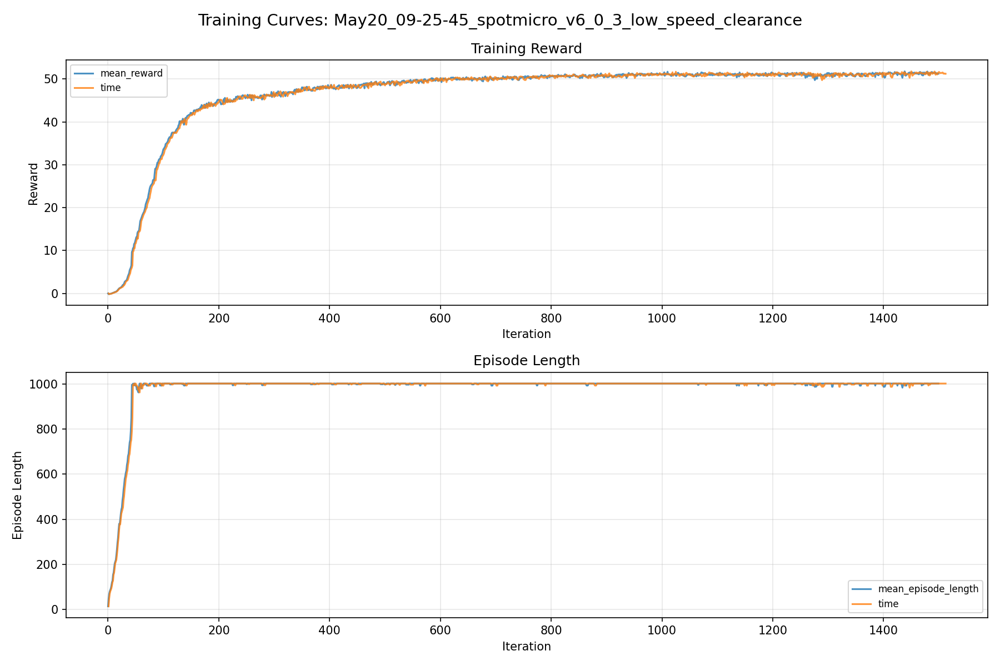
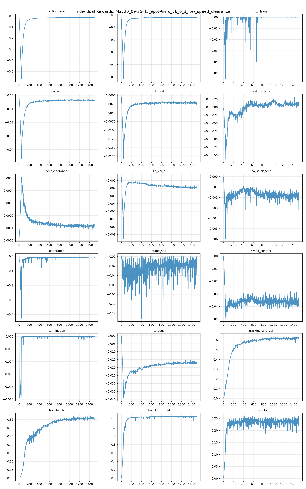
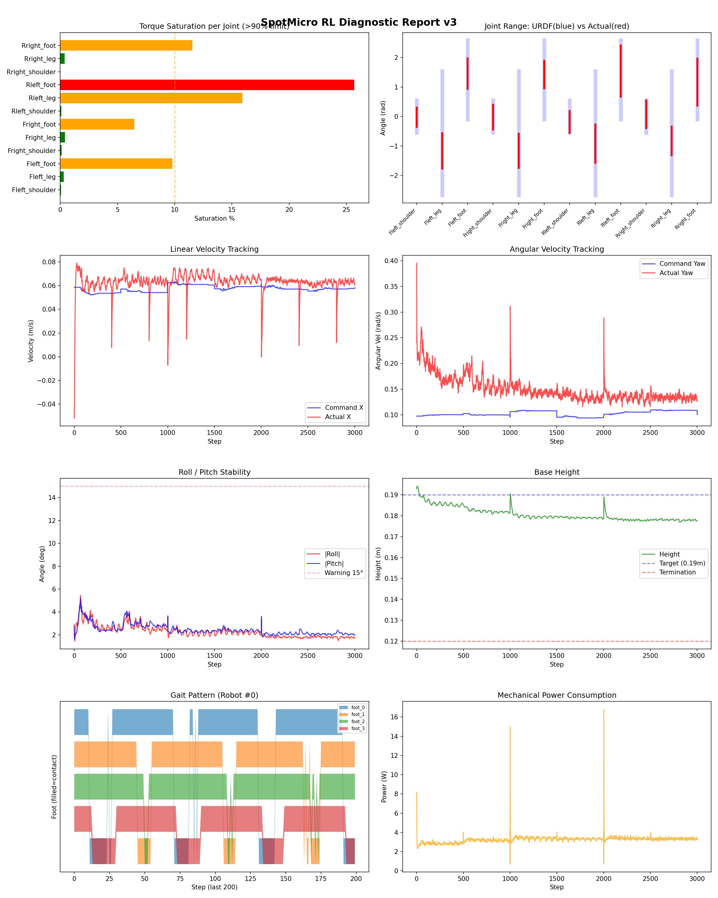
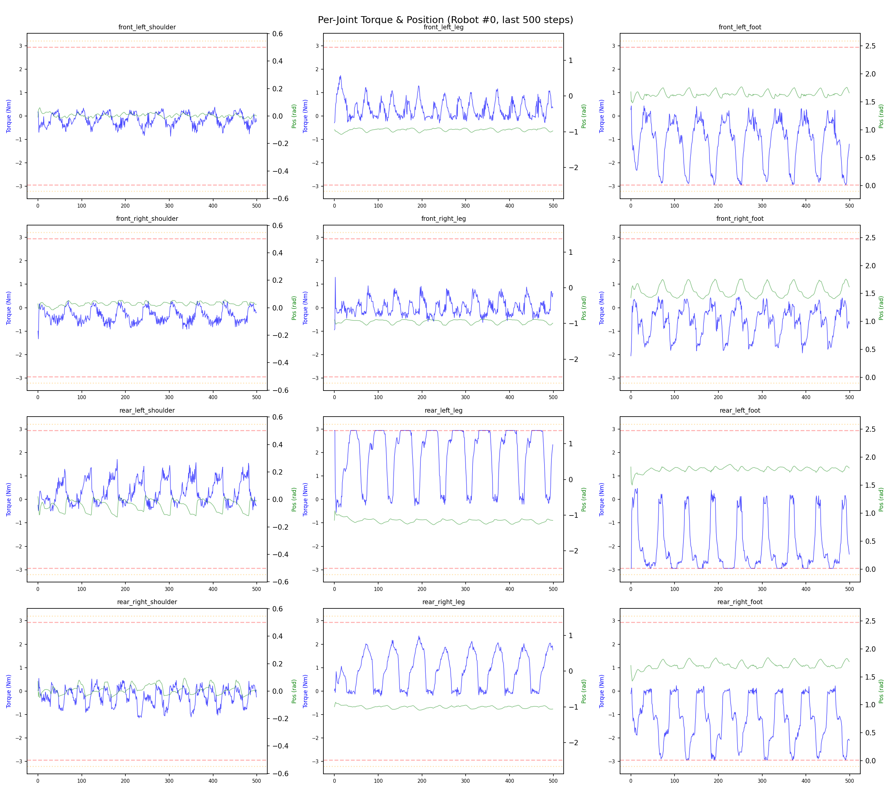
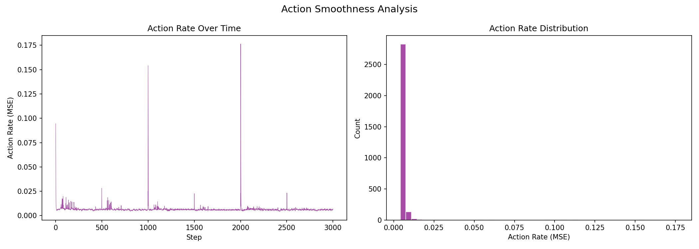

# 실험 064: spotmicro_v6_0_3_low_speed_clearance

- **날짜:** 2026-05-20 09:54
- **Task:** spotmicro_test
- **Run name:** `spotmicro_v6_0_3_low_speed_clearance`
- **판정:** ✅ PASS

---

## 실험 목적

v6.0.3: 저속 구간 재설정 및 다리 안드는 페널티 추가

---

## 변경점 (이전 커밋 대비)

```diff
diff --git a/ai_training/rl/legged_gym/legged_gym/envs/spotmicro_test/spotmicro_test.py b/ai_training/rl/legged_gym/legged_gym/envs/spotmicro_test/spotmicro_test.py
index d5f50ba..0e27a1f 100644
--- a/ai_training/rl/legged_gym/legged_gym/envs/spotmicro_test/spotmicro_test.py
+++ b/ai_training/rl/legged_gym/legged_gym/envs/spotmicro_test/spotmicro_test.py
@@ -191,6 +191,8 @@ class SpotmicroTest(LeggedRobot):
             self.pair_air_time[env_ids] = 0.
         if hasattr(self, 'max_feet_height'):
             self.max_feet_height[env_ids] = 0.
+        if hasattr(self, 'feet_swing_contact_time'):
+            self.feet_swing_contact_time[env_ids] = 0.
 
         # recovery에서는 phase mismatch도 학습해야 하므로 reset마다 랜덤화
         self.gait_phase[env_ids] = torch_rand_float(
@@ -377,7 +379,7 @@ class SpotmicroTest(LeggedRobot):
         first_contact = (self.feet_air_time > 0.) * contact_filt
         self.feet_air_time += self.dt
         rew_airTime = torch.sum((self.feet_air_time - 0.15) * first_contact, dim=1)
-        rew_airTime *= torch.norm(self.commands[:, :2], dim=1) > 0.1
+        rew_airTime *= torch.norm(self.commands[:, :3], dim=1) > self.blend_cmd_norm
         self.feet_air_time *= ~contact_filt
         return rew_airTime
         
@@ -387,18 +389,23 @@ class SpotmicroTest(LeggedRobot):
         sync_1 = (contact[:, 1] == contact[:, 2]).float()  
         anti_phase = (contact[:, 0] != contact[:, 1]).float()
         reward = (sync_0 + sync_1 + anti_phase) / 3.0
-        reward *= (torch.norm(self.commands[:, :2], dim=1) > 0.1).float()   
+        reward *= (torch.norm(self.commands[:, :3], dim=1) > self.blend_cmd_norm).float()
         return reward
         
     def _reward_no_stuck_feet(self):
         contact = self.contact_forces[:, self.feet_indices, 2] > 1.
         contact_filt = torch.logical_or(contact, self.last_contacts)
-        if not hasattr(self, 'feet_ground_time'):
-            self.feet_ground_time = torch.zeros(
+        phases = (self.gait_phase + self.phase_offsets) % 1.0
+        desired_air = phases >= self.duty_factor
+        swing_contact = desired_air & contact_filt
+        if not hasattr(self, 'feet_swing_contact_time'):
+            self.feet_swing_contact_time = torch.zeros(
                 self.num_envs, len(self.feet_indices), device=self.device)
-        self.feet_ground_time = (self.feet_ground_time + self.dt) * contact_filt.float()
-        penalty = torch.sum(torch.clamp(self.feet_ground_time - 0.15, min=0.), dim=1)
-        penalty *= (torch.norm(self.commands[:, :2], dim=1) > 0.1).float()
+        self.feet_swing_contact_time = (
+            self.feet_swing_contact_time + self.dt
+        ) * swing_contact.float()
+        penalty = torch.sum(torch.clamp(self.feet_swing_contact_time - 0.03, min=0.), dim=1)
+        penalty *= (torch.norm(self.commands[:, :3], dim=1) > self.blend_cmd_norm).float()
         return penalty
 
     def _reward_symmetric_gait(self):
@@ -419,7 +426,7 @@ class SpotmicroT
```

**변경 요약:**
  + if hasattr(self, 'feet_swing_contact_time'):
  + self.feet_swing_contact_time[env_ids] = 0.
  - rew_airTime *= torch.norm(self.commands[:, :2], dim=1) > 0.1
  + rew_airTime *= torch.norm(self.commands[:, :3], dim=1) > self.blend_cmd_norm
  - reward *= (torch.norm(self.commands[:, :2], dim=1) > 0.1).float()
  + reward *= (torch.norm(self.commands[:, :3], dim=1) > self.blend_cmd_norm).float()
  - if not hasattr(self, 'feet_ground_time'):
  - self.feet_ground_time = torch.zeros(
  + phases = (self.gait_phase + self.phase_offsets) % 1.0
  + desired_air = phases >= self.duty_factor
  + swing_contact = desired_air & contact_filt
  + if not hasattr(self, 'feet_swing_contact_time'):
  + self.feet_swing_contact_time = torch.zeros(
  - self.feet_ground_time = (self.feet_ground_time + self.dt) * contact_filt.float()
  - penalty = torch.sum(torch.clamp(self.feet_ground_time - 0.15, min=0.), dim=1)
  - penalty *= (torch.norm(self.commands[:, :2], dim=1) > 0.1).float()
  + self.feet_swing_contact_time = (
  + self.feet_swing_contact_time + self.dt
  + ) * swing_contact.float()
  + penalty = torch.sum(torch.clamp(self.feet_swing_contact_time - 0.03, min=0.), dim=1)
  + penalty *= (torch.norm(self.commands[:, :3], dim=1) > self.blend_cmd_norm).float()
  - reward *= (torch.norm(self.commands[:, :2], dim=1) > 0.1).float()
  + reward *= (torch.norm(self.commands[:, :3], dim=1) > self.blend_cmd_norm).float()
  - reward *= (torch.norm(self.commands[:, :2], dim=1) > 0.1).float()
  + reward *= (torch.norm(self.commands[:, :3], dim=1) > self.blend_cmd_norm).float()
  + def _reward_swing_contact(self):
  + phases = (self.gait_phase + self.phase_offsets) % 1.0
  + desired_air = phases >= self.duty_factor
  + actual_contact = self.contact_forces[:, self.feet_indices, 2] > 1.0
  + dragging = (desired_air & actual_contact).float()
  + cmd_norm = torch.norm(self.commands[:, :3], dim=1, keepdim=True)
  + is_moving = (cmd_norm > self.blend_cmd_norm).float()
  + return torch.sum(dragging * is_moving, dim=1) / 4.0
  - return torch.sum(torch.abs(self.dof_pos - self.default_dof_pos), dim=1) * (cmd_norm < 0.1)
  + return torch.sum(torch.abs(self.dof_pos - self.default_dof_pos), dim=1) * (cmd_norm < self.blend_cmd_norm)
  - is_moving = (cmd_norm > 0.1).float()
  + is_moving = (cmd_norm > self.blend_cmd_norm).float()
  - gait_period = 1.0
  - duty_factor = 0.55
  - phase_cmd_norm = 0.1
  - blend_cmd_norm = 0.1
  + gait_period = 1.2
  + duty_factor = 0.58
  + phase_cmd_norm = 0.04
  + blend_cmd_norm = 0.04
  - step_height = [0.016, 0.016, 0.019, 0.019]
  + step_height = [0.013, 0.013, 0.016, 0.016]
  - max_stride_x = 0.085
  - max_stride_y = 0.025
  + max_stride_x = 0.070
  + max_stride_y = 0.035
  - tracking_lin_vel = 1.0
  - tracking_ang_vel = 0.7
  + tracking_lin_vel = 1.5
  + tracking_ang_vel = 0.8
  - feet_air_time = 0.0
  + feet_air_time = 0.08
  - no_stuck_feet = 0.0
  + no_stuck_feet = -0.12
  - feet_clearance = 0.0
  + feet_clearance = 0.20
  + swing_contact = -0.25
  - tracking_ik = 0.6
  + tracking_ik = 0.5
  - tracking_sigma = 0.1
  - tracking_sigma_ang_vel = 0.05
  + tracking_sigma = 0.02
  + tracking_sigma_ang_vel = 0.03
  - ang_vel_yaw = [-0.30, 0.30]
  + ang_vel_yaw = [-0.20, 0.20]
  - run_name = 'spotmicro_v6_0_1_shared_ik_cmd_deadband'
  + run_name = 'spotmicro_v6_0_3_low_speed_clearance'
  + data['actual_abs_vel_x'].append(np.mean(np.abs(vel_x)))
  + data['actual_forward_pct'].append(np.mean(vel_x > 0.02) * 100.0)
  + mean_actual_abs_x = np.mean(data['actual_abs_vel_x'])
  + mean_actual_forward_pct = np.mean(data['actual_forward_pct'])
  + forward_tracking_ratio = (
  + mean_actual_abs_x / mean_cmd_abs_x
  + if mean_cmd_abs_x > 1.0e-6 else 0.0
  + )
  - cot = mean_power / (robot_mass * 9.81 * mean_vel) if mean_vel > 0.01 else 0.0
  + cot = mean_power / (robot_mass * 9.81 * mean_actual_abs_x) if mean_actual_abs_x > 0.01 else 0.0
  + print(f"  평균 |actual_x|: {mean_actual_abs_x:.4f} m/s")
  + print(f"  전진 추종 비율(|actual_x|/|cmd_x|): {forward_tracking_ratio:.2f}")
  + print(f"  실제 전진 비율(actual_x > 0.02): {mean_actual_forward_pct:.1f}%")
  + 'mean_actual_abs_x': float(mean_actual_abs_x),
  + 'forward_tracking_ratio': float(forward_tracking_ratio),
  + 'mean_actual_forward_pct': float(mean_actual_forward_pct),

---

## 현재 Reward Scales

| Reward | Scale |
|--------|-------|
| action_rate | -0.04 |
| ang_vel_xy | -0.5 |
| collision | -1.0 |
| dof_acc | -2.5e-07 |
| dof_vel | -0.0005 |
| feet_air_time | 0.08 |
| feet_clearance | 0.2 |
| lin_vel_z | -1.5 |
| no_stuck_feet | -0.12 |
| orientation | -4.0 |
| stand_still | -0.3 |
| swing_contact | -0.25 |
| termination | -10.0 |
| torques | -0.0008 |
| tracking_ang_vel | 0.8 |
| tracking_ik | 0.5 |
| tracking_lin_vel | 1.5 |
| trot_contact | 0.3 |

---

## 진단 결과 (Diagnostic)

### 핵심 지표

- ✅ Timeout: 90.0% (≥80%)
- ✅ 속도오차 X: 0.0258 m/s (<0.08)
- ✅ 토크포화: 5.9% (<10%)
- ✅ 자세: roll 2.3°, pitch 2.5° (안정)
- ✅ 조기종료: 0.0% (<5%)

### 상세 수치

| 지표 | 값 |
|------|-----|
| Timeout% | 89.98242530755711 |
| 조기종료% | 0.0 |
| 속도오차 X | 0.02578679472208023 m/s |
| 속도오차 Y | 0.029139256104826927 m/s |
| 각속도오차 | 0.11118917167186737 rad/s |
| 토크포화% | 5.90033881049506 |
| 평균 높이 | 0.18071023346263887 m |
| Roll (평균) | 2.2809550762176514° |
| Pitch (평균) | 2.452636480331421° |
| Action Rate | 0.0065795015543699265 |
| 평균 전력 | 3.255509376525879 W |
| CoT | 1.8681748507154854 |
| Recovery 성공률 | 43.84787472035794% |
| Recovery eligible trials | 447 |
| 평균 회복 시간 | 0.06112244761339864 s |
| Recovery 조기 실패율 | 0.0% |

## Recovery Assist 분석

| 지표 | 값 |
|------|-----|
| 판정 | ❌ Recovery 부족 |
| Recovery 성공률 | 43.8% |
| 성공/실패 | 196 / 251 |
| Eligible trials | 447 / 825 |
| 평균 회복 시간 | 0.061s |
| 조기 실패율 | 0.0% |
| 평가 horizon | 1.0 s |
| 초기 tilt 기준 | 7.0° |
| 안정 기준 | roll/pitch < 5.0°, height > 0.18m |
| 평균 초기 tilt | 8.562983735350663° |
| 평균 초기 roll/pitch | 6.3298597710439815° / 6.288908776504738° |
| 1초 후 평균 roll/pitch | 2.4938237090153366° / 3.059072805597745° |
| 1초 내 최대 roll/pitch 평균 | 7.313156948260279° / 7.5800217632746° |

> 해석: `Recovery 성공률`은 초기 tilt가 기준 이상인 episode 중 1초 내 안정 자세로 복귀한 비율입니다. 조기 실패율이 높으면 reset 직후 바로 넘어지는 것이고, 평균 회복 시간이 짧을수록 위기 대응이 빠른 것입니다.


## Command Mode별 회전 추종 분석

| 모드 | 비율 | 샘플 수 | 평균 abs(cmd_wz) | 평균 abs(actual_wz) | yaw 오차 | 상태 |
|------|------|---------|------------------|---------------------|----------|------|
| 정지 | 9.9% | 75810 | 0.0269 | 0.0929 | 0.0894 | ❌ |
| 직진/저회전 | 39.5% | 303289 | 0.0794 | 0.1461 | 0.1226 | ⚠️ |
| 제자리 회전 | 11.3% | 86897 | 0.1739 | 0.1910 | 0.1043 | ⚠️ |
| 전진+회전 | 13.4% | 103047 | 0.1735 | 0.2026 | 0.1231 | ⚠️ |
| 큰 회전명령 | 0.0% | 0 | N/A | N/A | N/A | N/A |

> 해석 기준: `제자리 회전`만 나쁘면 pure turn 학습/보행 패턴 문제, `큰 회전명령`만 나쁘면 yaw 명령 범위가 현재 토크/보폭 한계보다 큰 문제, `정지`가 나쁘면 stop drift 문제로 보면 됩니다.
        


## 학습 곡선 분석

| 지표 | 값 | 판정 |
|------|-----|------|
| 수렴 iter (90%) | 295 | 빠름 |
| 후반 안정성 (CV) | 0.006 | 안정 |
| 정체 구간 | 있음 (iter 331, 74 iter) | |


## Per-leg 분석

### 발별 접촉/공중 비율

| 발 | 접촉% | 공중% |
|-----|-------|------|
| foot_0 | 75.2% | 24.8% |
| foot_1 | 74.5% | 25.5% |
| foot_2 | 73.4% | 26.6% |
| foot_3 | 64.1% | 35.9% |

### 관절별 토크 포화

| 관절 | 포화% | 최대토크 | 한계 | 상태 |
|------|------|---------|------|------|
| front_left_shoulder | 0.1% | 2.940 | 2.940 | ✅ |
| front_left_leg | 0.3% | 2.940 | 2.940 | ✅ |
| front_left_foot | 9.8% | 2.940 | 2.940 | ⚠️ |
| front_right_shoulder | 0.1% | 2.940 | 2.940 | ✅ |
| front_right_leg | 0.4% | 2.940 | 2.940 | ✅ |
| front_right_foot | 6.5% | 2.940 | 2.940 | ⚠️ |
| rear_left_shoulder | 0.1% | 2.940 | 2.940 | ✅ |
| rear_left_leg | 15.9% | 2.940 | 2.940 | ⚠️ |
| rear_left_foot | 25.7% | 2.940 | 2.940 | ❌ |
| rear_right_shoulder | 0.0% | 2.940 | 2.940 | ✅ |
| rear_right_leg | 0.4% | 2.940 | 2.940 | ✅ |
| rear_right_foot | 11.5% | 2.940 | 2.940 | ⚠️ |


## Gait 분석

| 지표 | 값 |
|------|-----|
| Gait 주파수 | 0.21 Hz |
| Gait 주기 | 60 steps |
| 대각 동기화율 | 83.1% |
| L/R 비대칭 | 0.0%p |
| 판정 | ✅ Trot 패턴 / ✅ 대칭 |


## 관절별 상세

| 관절 | 토크포화% | 사용범위% | 편향(rad) | 한계근접% | 상태 |
|------|----------|----------|----------|----------|------|
| front_left_shoulder | 0.1% | 60% | -0.021 | 0.0% | ✅ |
| front_left_leg | 0.3% | 28% | -1.164 | 0.0% | ⚠️ |
| front_left_foot | 9.8% | 38% | +1.455 | 0.0% | ⚠️ |
| front_right_shoulder | 0.1% | 77% | -0.022 | 0.0% | ✅ |
| front_right_leg | 0.4% | 27% | -1.166 | 0.0% | ⚠️ |
| front_right_foot | 6.5% | 35% | +1.424 | 0.0% | ⚠️ |
| rear_left_shoulder | 0.1% | 67% | -0.185 | 0.0% | ⚠️ |
| rear_left_leg | 15.9% | 31% | -0.921 | 0.0% | ⚠️ |
| rear_left_foot | 25.7% | 64% | +1.542 | 0.0% | ⚠️ |
| rear_right_shoulder | 0.0% | 86% | +0.078 | 0.0% | ✅ |
| rear_right_leg | 0.4% | 23% | -0.831 | 0.0% | ⚠️ |
| rear_right_foot | 11.5% | 59% | +1.165 | 0.0% | ⚠️ |


## 에너지 효율 상세

| 지표 | 값 |
|------|-----|
| 평균 전력 | 3.26 W |
| 피크 전력 | 16.81 W |
| 피크/평균 비율 | 5.2x |
| CoT | 1.87 |

### 관절별 전력 분배

| 관절 | 평균전력(W) | 비율% |
|------|-----------|-------|
| rear_left_foot | 0.548 | 16.8% |
| front_left_foot | 0.443 | 13.6% |
| rear_right_foot | 0.439 | 13.5% |
| rear_left_leg | 0.427 | 13.1% |
| front_right_foot | 0.421 | 12.9% |
| rear_right_leg | 0.306 | 9.4% |
| front_left_leg | 0.249 | 7.7% |
| front_right_leg | 0.202 | 6.2% |
| rear_left_shoulder | 0.067 | 2.1% |
| rear_right_shoulder | 0.061 | 1.9% |
| front_right_shoulder | 0.052 | 1.6% |
| front_left_shoulder | 0.042 | 1.3% |


## 이전 실험 대비 비교

| 지표 | 이전 (exp063) | 현재 (exp064) | 변화 |
|------|-------|-------|------|
| Timeout% | 92.3% | 90.0% | ⚠️ ↓ 2.2698% |
| 속도오차 X | 0.0292 | 0.0258 | ✅ ↓ 0.0034m/s |
| 토크포화 | 2.1% | 5.9% | ⚠️ ↑ 3.8285% |
| Roll | 1.6° | 2.3° | ⚠️ ↑ 0.7209° |
| Pitch | 1.9° | 2.5° | ⚠️ ↑ 0.5340° |
| 평균 전력 | 2.4392W | 3.2555W | ⚠️ ↑ 0.8163W |


## Tensorboard 학습 곡선 요약

| 스칼라 | 최종값 | 최대 | 최소 | 후반10% 평균 |
|--------|--------|------|------|-------------|
| rew_action_rate | -0.0146 | -0.0116 | -0.5686 | -0.0145 |
| rew_ang_vel_xy | -0.0224 | -0.0188 | -0.5163 | -0.0216 |
| rew_collision | 0.0000 | 0.0000 | -0.0554 | -0.0000 |
| rew_dof_acc | -0.0036 | -0.0012 | -0.0468 | -0.0036 |
| rew_dof_vel | -0.0022 | -0.0005 | -0.0182 | -0.0022 |
| rew_feet_air_time | 0.0001 | 0.0003 | -0.0016 | 0.0001 |
| rew_feet_clearance | 0.0001 | 0.0005 | 0.0000 | 0.0001 |
| rew_lin_vel_z | -0.0019 | -0.0005 | -0.0085 | -0.0020 |
| rew_no_stuck_feet | -0.0032 | -0.0000 | -0.0060 | -0.0018 |
| rew_orientation | -0.0106 | -0.0020 | -0.4268 | -0.0056 |
| rew_stand_still | -0.0254 | 0.0000 | -0.1310 | -0.0167 |
| rew_swing_contact | -0.0365 | -0.0005 | -0.0494 | -0.0361 |
| rew_termination | 0.0000 | 0.0000 | -0.0098 | -0.0000 |
| rew_torques | -0.0173 | -0.0005 | -0.0393 | -0.0171 |
| rew_tracking_ang_vel | 0.6225 | 0.6387 | 0.0013 | 0.6205 |
| rew_tracking_ik | 0.3550 | 0.3699 | 0.0006 | 0.3583 |
| rew_tracking_lin_vel | 1.4622 | 1.4726 | 0.0042 | 1.4634 |
| rew_trot_contact | 0.2313 | 0.2589 | 0.0021 | 0.2373 |
| learning_rate | 0.0001 | 0.0058 | 0.0000 | 0.0001 |
| surrogate | -0.0011 | 0.0024 | -0.0095 | -0.0018 |
| value_function | 0.0279 | 0.0353 | 0.0008 | 0.0093 |
| collection time | 0.6753 | 0.9838 | 0.6668 | 0.7110 |
| learning_time | 0.2842 | 0.3665 | 0.2714 | 0.2863 |
| total_fps | 102455.0000 | 103247.0000 | 76629.0000 | 98603.1267 |
| mean_noise_std | 0.0978 | 1.0003 | 0.0925 | 0.0965 |
| mean_episode_length | 1002.0000 | 1002.0000 | 13.7700 | 1000.8507 |
| time | 1002.0000 | 1002.0000 | 13.7700 | 1000.8507 |
| mean_reward | 51.2213 | 51.7816 | -0.1850 | 51.2146 |
| time | 51.2213 | 51.7816 | -0.1850 | 51.2146 |

총 학습 iteration: 1499


---

## 그래프

### Tensorboard 학습 곡선



### Diagnostic 결과





---

## 결론 및 다음 실험 방향

**자동 판정:** ✅ PASS

모든 기준을 통과했습니다. 다음 Step으로 진행 가능합니다.

> 💡 위 결론은 자동 생성되었습니다. 필요시 수정하세요.

---

## 메모

_(추가 메모가 있으면 여기에 작성)_

