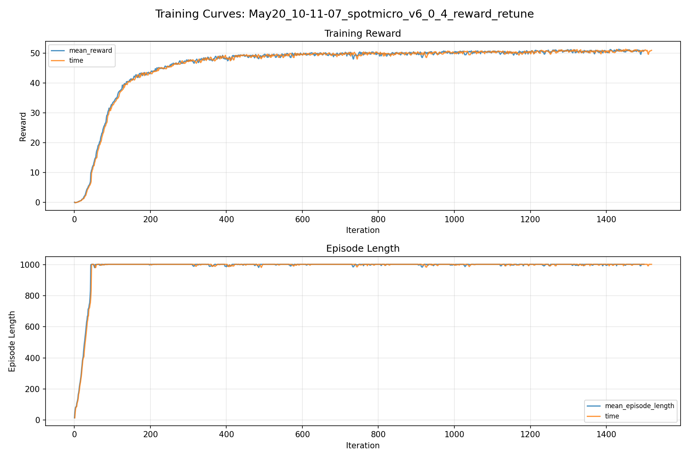
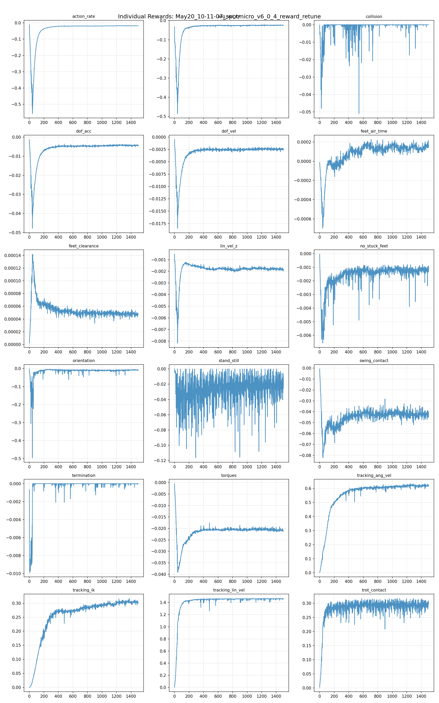
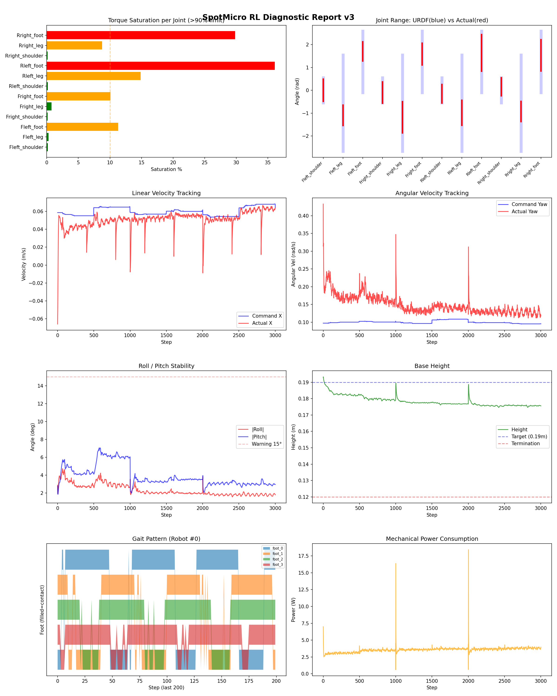
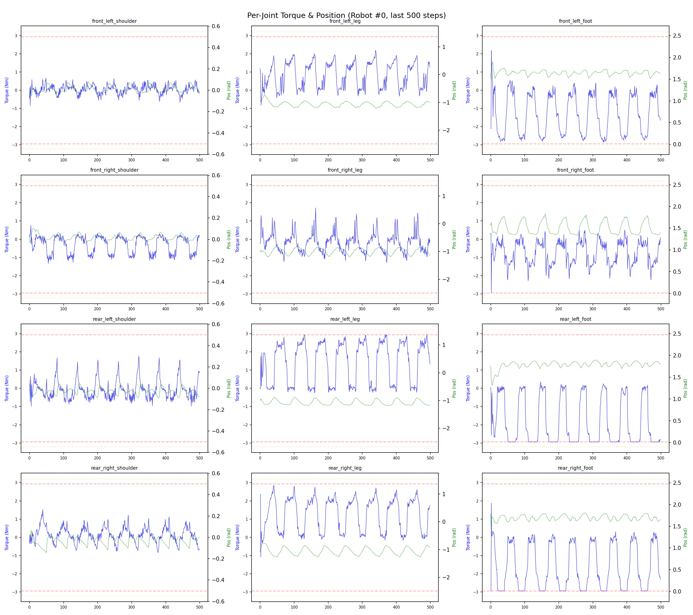
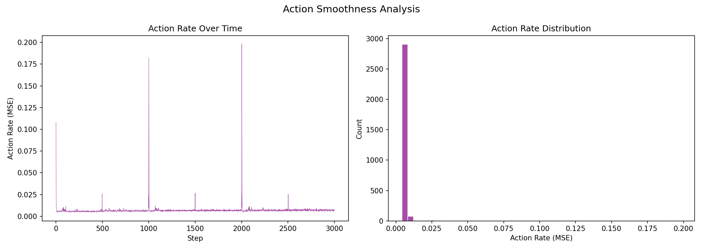

# 실험 065: spotmicro_v6_0_4_reward_retune

- **날짜:** 2026-05-20 10:40
- **Task:** spotmicro_test
- **Run name:** `spotmicro_v6_0_4_reward_retune`
- **판정:** ✅ PASS

---

## 실험 목적

v6.0.4: reward tuning. swing 중 충돌 잘 안하는지 확인

---

## 변경점 (이전 커밋 대비)

```diff
diff --git a/ai_training/rl/legged_gym/legged_gym/envs/spotmicro_test/spotmicro_test.py b/ai_training/rl/legged_gym/legged_gym/envs/spotmicro_test/spotmicro_test.py
index 0e27a1f..dc22588 100644
--- a/ai_training/rl/legged_gym/legged_gym/envs/spotmicro_test/spotmicro_test.py
+++ b/ai_training/rl/legged_gym/legged_gym/envs/spotmicro_test/spotmicro_test.py
@@ -404,7 +404,11 @@ class SpotmicroTest(LeggedRobot):
         self.feet_swing_contact_time = (
             self.feet_swing_contact_time + self.dt
         ) * swing_contact.float()
-        penalty = torch.sum(torch.clamp(self.feet_swing_contact_time - 0.03, min=0.), dim=1)
+        grace_time = getattr(self.cfg.rewards, "swing_contact_grace_time", 0.03)
+        penalty = torch.sum(
+            torch.clamp(self.feet_swing_contact_time - grace_time, min=0.),
+            dim=1,
+        )
         penalty *= (torch.norm(self.commands[:, :3], dim=1) > self.blend_cmd_norm).float()
         return penalty
 
@@ -439,7 +443,13 @@ class SpotmicroTest(LeggedRobot):
         is_air = (~contact_filt).float()
         self.max_feet_height = torch.max(self.max_feet_height, feet_z * is_air)
         first_contact = (self.max_feet_height > 0.) * contact_filt
-        height_reward = torch.clamp(self.max_feet_height - 0.02, min=0., max=0.03)
+        clearance_min = getattr(self.cfg.rewards, "feet_clearance_min", 0.02)
+        clearance_cap = getattr(self.cfg.rewards, "feet_clearance_cap", 0.03)
+        height_reward = torch.clamp(
+            self.max_feet_height - clearance_min,
+            min=0.,
+            max=clearance_cap,
+        )
         reward = torch.sum(height_reward * first_contact.float(), dim=1)
         self.max_feet_height *= is_air
         reward *= (torch.norm(self.commands[:, :3], dim=1) > self.blend_cmd_norm).float()
diff --git a/ai_training/rl/legged_gym/legged_gym/envs/spotmicro_test/spotmicro_test_config.py b/ai_training/rl/legged_gym/legged_gym/envs/spotmicro_test/spotmicro_test_config.py
index 1e40cff..4ebf520 100644
--- a/ai_training/rl/legged_gym/legged_gym/envs/spotmicro_test/spotmicro_test_config.py
+++ b/ai_training/rl/legged_gym/legged_gym/envs/spotmicro_test/spotmicro_test_config.py
@@ -97,15 +97,15 @@ class SpotmicroTestCfg(LeggedRobotCfg):
             dof_vel = -0.0005
             dof_acc = -2.5e-7
             action_rate = -0.04
-            feet_air_time = 0.08
+            feet_air_time = 0.04
             dof_pos_limits = 0.0
             collision = -1.0
             trot_symmetry = 0.0
-            no_stuck_feet = -0.12
+            no_stuck_feet = -0.20
             symmetric_gait = 0.0
-            feet_clearance = 0.20
-            swing_contact = -0.25
-            trot_contact = 0.3
+            feet_clearance = 0.03
+            swing_contact = -0.45
+            trot_contact = 0.35
             tracking_ik = 0.5
             stand_still = -0.3
         soft_dof_pos_limit = 0.9
@@ -113,6 +113,9 @@ class SpotmicroTestCfg(LeggedRobotCfg):
         m
```

**변경 요약:**
  - penalty = torch.sum(torch.clamp(self.feet_swing_contact_time - 0.03, min=0.), dim=1)
  + grace_time = getattr(self.cfg.rewards, "swing_contact_grace_time", 0.03)
  + penalty = torch.sum(
  + torch.clamp(self.feet_swing_contact_time - grace_time, min=0.),
  + dim=1,
  + )
  - height_reward = torch.clamp(self.max_feet_height - 0.02, min=0., max=0.03)
  + clearance_min = getattr(self.cfg.rewards, "feet_clearance_min", 0.02)
  + clearance_cap = getattr(self.cfg.rewards, "feet_clearance_cap", 0.03)
  + height_reward = torch.clamp(
  + self.max_feet_height - clearance_min,
  + min=0.,
  + max=clearance_cap,
  + )
  - feet_air_time = 0.08
  + feet_air_time = 0.04
  - no_stuck_feet = -0.12
  + no_stuck_feet = -0.20
  - feet_clearance = 0.20
  - swing_contact = -0.25
  - trot_contact = 0.3
  + feet_clearance = 0.03
  + swing_contact = -0.45
  + trot_contact = 0.35
  + swing_contact_grace_time = 0.02
  + feet_clearance_min = 0.006
  + feet_clearance_cap = 0.010
  - run_name = 'spotmicro_v6_0_3_low_speed_clearance'
  + run_name = 'spotmicro_v6_0_4_reward_retune'

---

## 현재 Reward Scales

| Reward | Scale |
|--------|-------|
| action_rate | -0.04 |
| ang_vel_xy | -0.5 |
| collision | -1.0 |
| dof_acc | -2.5e-07 |
| dof_vel | -0.0005 |
| feet_air_time | 0.04 |
| feet_clearance | 0.03 |
| lin_vel_z | -1.5 |
| no_stuck_feet | -0.2 |
| orientation | -4.0 |
| stand_still | -0.3 |
| swing_contact | -0.45 |
| termination | -10.0 |
| torques | -0.0008 |
| tracking_ang_vel | 0.8 |
| tracking_ik | 0.5 |
| tracking_lin_vel | 1.5 |
| trot_contact | 0.35 |

---

## 진단 결과 (Diagnostic)

### 핵심 지표

- ✅ Timeout: 92.8% (≥80%)
- ✅ 속도오차 X: 0.0256 m/s (<0.08)
- ✅ 토크포화: 9.4% (<10%)
- ✅ 자세: roll 2.3°, pitch 3.9° (안정)
- ✅ 조기종료: 0.0% (<5%)

### 상세 수치

| 지표 | 값 |
|------|-----|
| Timeout% | 92.7536231884058 |
| 조기종료% | 0.0 |
| 속도오차 X | 0.025636868551373482 m/s |
| 속도오차 Y | 0.03099702298641205 m/s |
| 각속도오차 | 0.10921839624643326 rad/s |
| 토크포화% | 9.379682817182818 |
| 평균 높이 | 0.1784078807254017 m |
| Roll (평균) | 2.336392402648926° |
| Pitch (평균) | 3.8822174072265625° |
| Action Rate | 0.006856496445834637 |
| 평균 전력 | 3.559145927429199 W |
| CoT | 2.3627549490478525 |
| Recovery 성공률 | 32.45192307692308% |
| Recovery eligible trials | 416 |
| 평균 회복 시간 | 0.06637036888687699 s |
| Recovery 조기 실패율 | 0.0% |

## Recovery Assist 분석

| 지표 | 값 |
|------|-----|
| 판정 | ❌ Recovery 부족 |
| Recovery 성공률 | 32.5% |
| 성공/실패 | 135 / 281 |
| Eligible trials | 416 / 808 |
| 평균 회복 시간 | 0.066s |
| 조기 실패율 | 0.0% |
| 평가 horizon | 1.0 s |
| 초기 tilt 기준 | 7.0° |
| 안정 기준 | roll/pitch < 5.0°, height > 0.18m |
| 평균 초기 tilt | 8.609615029568307° |
| 평균 초기 roll/pitch | 6.407311570716155° / 6.39111014761948° |
| 1초 후 평균 roll/pitch | 2.6059728771125754° / 3.47402621042252° |
| 1초 내 최대 roll/pitch 평균 | 7.4607096171149845° / 7.671154719992326° |

> 해석: `Recovery 성공률`은 초기 tilt가 기준 이상인 episode 중 1초 내 안정 자세로 복귀한 비율입니다. 조기 실패율이 높으면 reset 직후 바로 넘어지는 것이고, 평균 회복 시간이 짧을수록 위기 대응이 빠른 것입니다.


## Command Mode별 회전 추종 분석

| 모드 | 비율 | 샘플 수 | 평균 abs(cmd_wz) | 평균 abs(actual_wz) | yaw 오차 | 상태 |
|------|------|---------|------------------|---------------------|----------|------|
| 정지 | 12.3% | 94874 | 0.0267 | 0.0956 | 0.0928 | ❌ |
| 직진/저회전 | 40.1% | 308261 | 0.0763 | 0.1419 | 0.1161 | ⚠️ |
| 제자리 회전 | 11.7% | 90047 | 0.1744 | 0.1892 | 0.1035 | ⚠️ |
| 전진+회전 | 13.7% | 105478 | 0.1744 | 0.2046 | 0.1243 | ⚠️ |
| 큰 회전명령 | 0.0% | 0 | N/A | N/A | N/A | N/A |

> 해석 기준: `제자리 회전`만 나쁘면 pure turn 학습/보행 패턴 문제, `큰 회전명령`만 나쁘면 yaw 명령 범위가 현재 토크/보폭 한계보다 큰 문제, `정지`가 나쁘면 stop drift 문제로 보면 됩니다.
        


## 학습 곡선 분석

| 지표 | 값 | 판정 |
|------|-----|------|
| 수렴 iter (90%) | 255 | 빠름 |
| 후반 안정성 (CV) | 0.009 | 안정 |
| 정체 구간 | 있음 (iter 714, 74 iter) | |


## Per-leg 분석

### 발별 접촉/공중 비율

| 발 | 접촉% | 공중% |
|-----|-------|------|
| foot_0 | 71.1% | 28.9% |
| foot_1 | 71.7% | 28.3% |
| foot_2 | 69.6% | 30.4% |
| foot_3 | 67.9% | 32.1% |

### 관절별 토크 포화

| 관절 | 포화% | 최대토크 | 한계 | 상태 |
|------|------|---------|------|------|
| front_left_shoulder | 0.2% | 2.940 | 2.940 | ✅ |
| front_left_leg | 0.3% | 2.940 | 2.940 | ✅ |
| front_left_foot | 11.3% | 2.940 | 2.940 | ⚠️ |
| front_right_shoulder | 0.1% | 2.940 | 2.940 | ✅ |
| front_right_leg | 0.7% | 2.940 | 2.940 | ✅ |
| front_right_foot | 10.1% | 2.940 | 2.940 | ⚠️ |
| rear_left_shoulder | 0.2% | 2.940 | 2.940 | ✅ |
| rear_left_leg | 14.9% | 2.940 | 2.940 | ⚠️ |
| rear_left_foot | 36.1% | 2.940 | 2.940 | ❌ |
| rear_right_shoulder | 0.1% | 2.940 | 2.940 | ✅ |
| rear_right_leg | 8.8% | 2.940 | 2.940 | ⚠️ |
| rear_right_foot | 29.8% | 2.940 | 2.940 | ❌ |


## Gait 분석

| 지표 | 값 |
|------|-----|
| Gait 주파수 | 0.21 Hz |
| Gait 주기 | 60 steps |
| 대각 동기화율 | 84.0% |
| L/R 비대칭 | 0.0%p |
| 판정 | ✅ Trot 패턴 / ✅ 대칭 |


## 관절별 상세

| 관절 | 토크포화% | 사용범위% | 편향(rad) | 한계근접% | 상태 |
|------|----------|----------|----------|----------|------|
| front_left_shoulder | 0.2% | 89% | -0.000 | 0.0% | ✅ |
| front_left_leg | 0.3% | 21% | -1.090 | 0.0% | ⚠️ |
| front_left_foot | 11.3% | 31% | +1.703 | 0.0% | ⚠️ |
| front_right_shoulder | 0.1% | 85% | -0.094 | 0.0% | ✅ |
| front_right_leg | 0.7% | 33% | -1.180 | 0.0% | ⚠️ |
| front_right_foot | 10.1% | 35% | +1.589 | 0.0% | ⚠️ |
| rear_left_shoulder | 0.2% | 74% | -0.146 | 0.1% | ⚠️ |
| rear_left_leg | 14.9% | 26% | -0.982 | 0.0% | ⚠️ |
| rear_left_foot | 36.1% | 60% | +1.640 | 0.0% | ⚠️ |
| rear_right_shoulder | 0.1% | 72% | +0.157 | 0.1% | ⚠️ |
| rear_right_leg | 8.8% | 21% | -0.925 | 0.0% | ⚠️ |
| rear_right_foot | 29.8% | 51% | +1.533 | 0.0% | ⚠️ |


## 에너지 효율 상세

| 지표 | 값 |
|------|-----|
| 평균 전력 | 3.56 W |
| 피크 전력 | 18.43 W |
| 피크/평균 비율 | 5.2x |
| CoT | 2.36 |

### 관절별 전력 분배

| 관절 | 평균전력(W) | 비율% |
|------|-----------|-------|
| rear_right_foot | 0.643 | 18.1% |
| rear_left_foot | 0.625 | 17.6% |
| rear_left_leg | 0.417 | 11.7% |
| front_left_foot | 0.411 | 11.5% |
| rear_right_leg | 0.382 | 10.7% |
| front_right_foot | 0.371 | 10.4% |
| front_left_leg | 0.240 | 6.7% |
| front_right_leg | 0.230 | 6.5% |
| rear_left_shoulder | 0.075 | 2.1% |
| rear_right_shoulder | 0.064 | 1.8% |
| front_right_shoulder | 0.058 | 1.6% |
| front_left_shoulder | 0.043 | 1.2% |


## 이전 실험 대비 비교

| 지표 | 이전 (exp064) | 현재 (exp065) | 변화 |
|------|-------|-------|------|
| Timeout% | 90.0% | 92.8% | ✅ ↑ 2.7712% |
| 속도오차 X | 0.0258 | 0.0256 | ✅ ↓ 0.0001m/s |
| 토크포화 | 5.9% | 9.4% | ⚠️ ↑ 3.4793% |
| Roll | 2.3° | 2.3° | ⚠️ ↑ 0.0554° |
| Pitch | 2.5° | 3.9° | ⚠️ ↑ 1.4296° |
| 평균 전력 | 3.2555W | 3.5591W | ⚠️ ↑ 0.3036W |


## Tensorboard 학습 곡선 요약

| 스칼라 | 최종값 | 최대 | 최소 | 후반10% 평균 |
|--------|--------|------|------|-------------|
| rew_action_rate | -0.0181 | -0.0116 | -0.5573 | -0.0181 |
| rew_ang_vel_xy | -0.0243 | -0.0218 | -0.4853 | -0.0244 |
| rew_collision | 0.0000 | 0.0000 | -0.0509 | -0.0000 |
| rew_dof_acc | -0.0043 | -0.0012 | -0.0478 | -0.0043 |
| rew_dof_vel | -0.0024 | -0.0005 | -0.0185 | -0.0024 |
| rew_feet_air_time | 0.0002 | 0.0002 | -0.0007 | 0.0001 |
| rew_feet_clearance | 0.0000 | 0.0001 | 0.0000 | 0.0000 |
| rew_lin_vel_z | -0.0020 | -0.0005 | -0.0082 | -0.0018 |
| rew_no_stuck_feet | -0.0014 | -0.0000 | -0.0066 | -0.0012 |
| rew_orientation | -0.0101 | -0.0020 | -0.4959 | -0.0080 |
| rew_stand_still | -0.0089 | 0.0000 | -0.1164 | -0.0222 |
| rew_swing_contact | -0.0447 | -0.0008 | -0.0821 | -0.0425 |
| rew_termination | 0.0000 | 0.0000 | -0.0099 | -0.0000 |
| rew_torques | -0.0212 | -0.0005 | -0.0392 | -0.0208 |
| rew_tracking_ang_vel | 0.6221 | 0.6339 | 0.0013 | 0.6188 |
| rew_tracking_ik | 0.3034 | 0.3170 | 0.0006 | 0.3043 |
| rew_tracking_lin_vel | 1.4594 | 1.4677 | 0.0042 | 1.4607 |
| rew_trot_contact | 0.3061 | 0.3174 | 0.0025 | 0.2935 |
| learning_rate | 0.0002 | 0.0058 | 0.0000 | 0.0002 |
| surrogate | -0.0018 | 0.0029 | -0.0082 | -0.0017 |
| value_function | 0.0167 | 0.0537 | 0.0013 | 0.0099 |
| collection time | 0.7546 | 0.8139 | 0.6707 | 0.7278 |
| learning_time | 0.2878 | 0.3254 | 0.2769 | 0.2888 |
| total_fps | 94299.0000 | 103214.0000 | 87356.0000 | 96779.3200 |
| mean_noise_std | 0.1103 | 1.0003 | 0.1040 | 0.1092 |
| mean_episode_length | 1002.0000 | 1002.0000 | 13.7700 | 1001.1867 |
| time | 1002.0000 | 1002.0000 | 13.7700 | 1001.1867 |
| mean_reward | 50.9322 | 51.3194 | -0.1855 | 50.6863 |
| time | 50.9322 | 51.3194 | -0.1855 | 50.6863 |

총 학습 iteration: 1499


---

## 그래프

### Tensorboard 학습 곡선



### Diagnostic 결과





---

## 결론 및 다음 실험 방향

**자동 판정:** ✅ PASS

모든 기준을 통과했습니다. 다음 Step으로 진행 가능합니다.

> 💡 위 결론은 자동 생성되었습니다. 필요시 수정하세요.

---

## 메모

_(추가 메모가 있으면 여기에 작성)_

