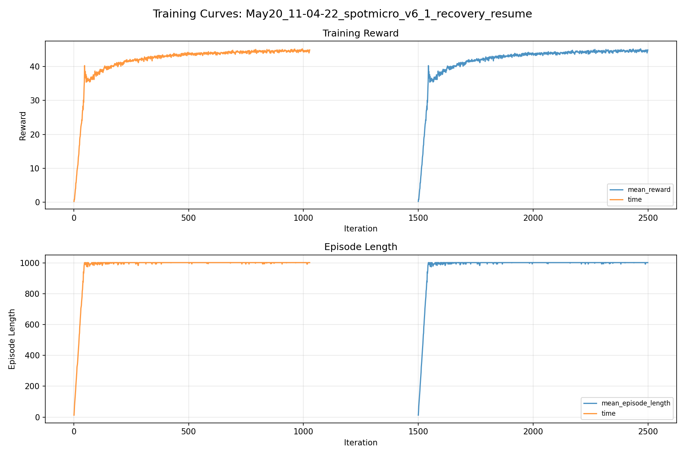
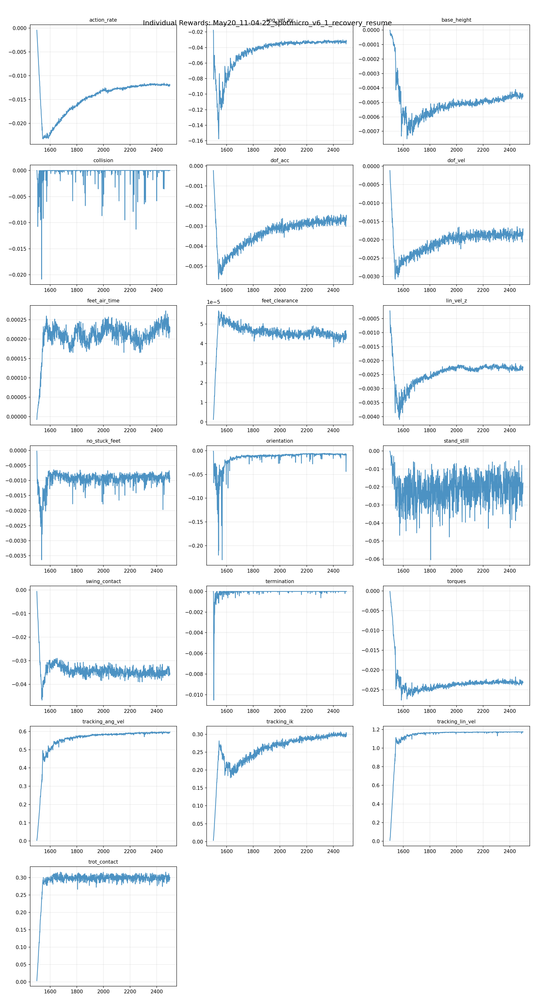
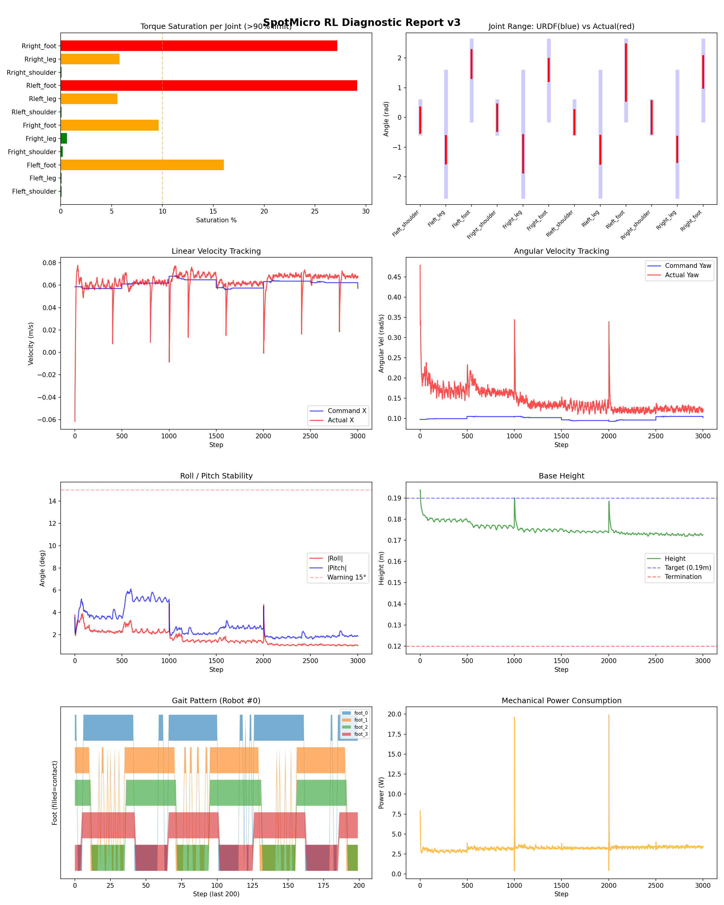
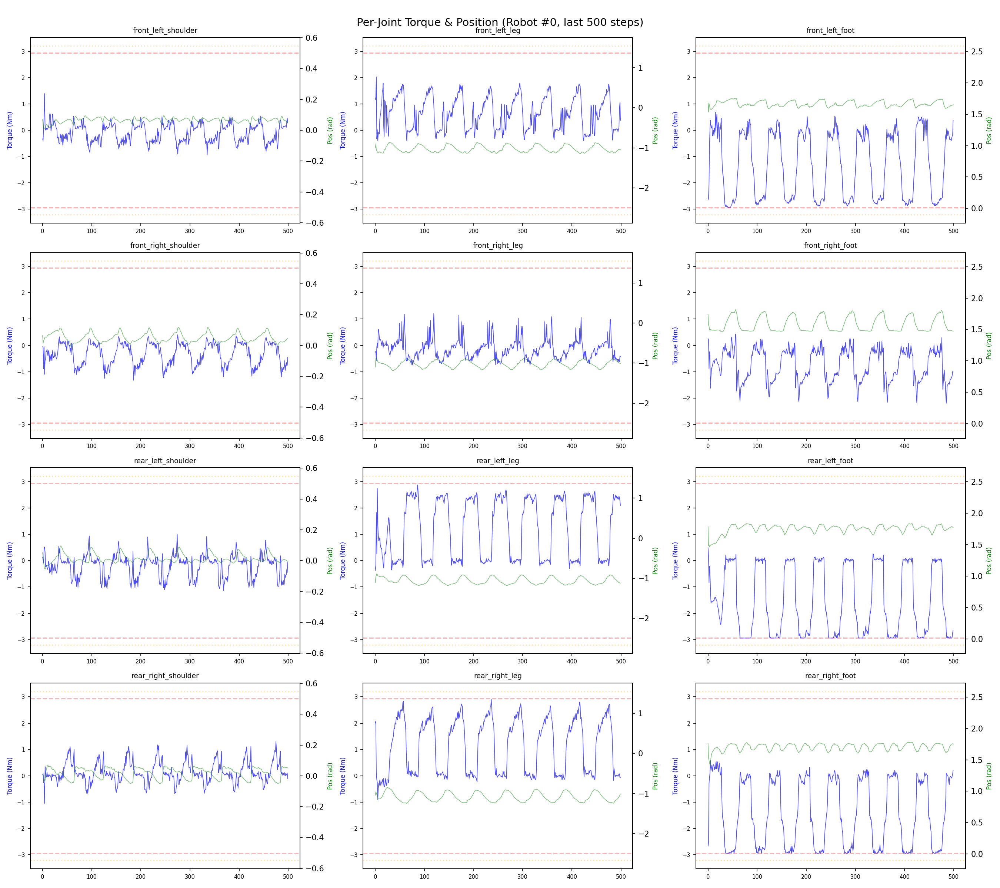
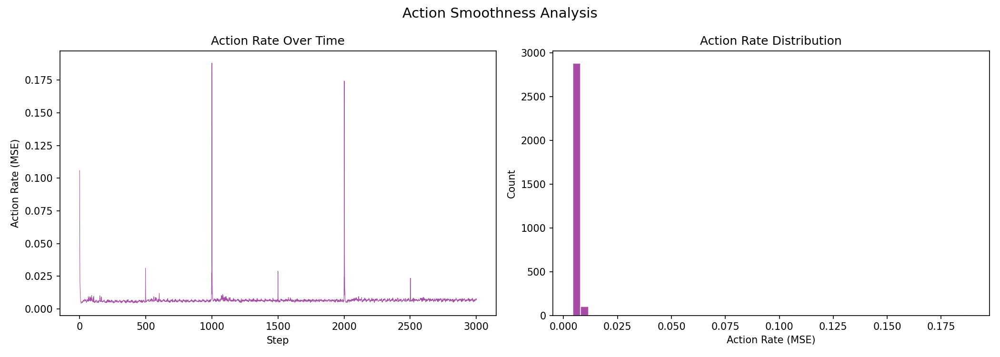

# 실험 066: spotmicro_v6_1_recovery_resume

- **날짜:** 2026-05-20 11:39
- **Task:** spotmicro_test
- **Run name:** `spotmicro_v6_1_recovery_resume`
- **판정:** ✅ PASS

---

## 실험 목적

v6.1: exp065에서 resume, recovery 안정성 강화

---

## 변경점 (이전 커밋 대비)

```diff
diff --git a/ai_training/rl/legged_gym/legged_gym/envs/spotmicro_test/spotmicro_test.py b/ai_training/rl/legged_gym/legged_gym/envs/spotmicro_test/spotmicro_test.py
index 0e27a1f..81b2284 100644
--- a/ai_training/rl/legged_gym/legged_gym/envs/spotmicro_test/spotmicro_test.py
+++ b/ai_training/rl/legged_gym/legged_gym/envs/spotmicro_test/spotmicro_test.py
@@ -2,6 +2,7 @@ from legged_gym.envs.base.legged_robot import LeggedRobot
 from isaacgym.torch_utils import torch_rand_float, quat_from_euler_xyz
 from isaacgym import gymtorch
 from pathlib import Path
+import math
 import sys
 import torch
 
@@ -58,12 +59,14 @@ class SpotmicroTest(LeggedRobot):
                   
         # ==== Recovery assist randomization ====
         # Stage 1: 너무 세게 시작하지 말 것
-        self.recovery_roll_pitch_range = 10.0 * torch.pi / 180.0  # ±10 deg
-        self.recovery_yaw_range = 3.14159                        # yaw는 자유
-        self.recovery_lin_vel_xy_range = 0.10                    # ±0.10 m/s
-        self.recovery_lin_vel_z_range = 0.03                     # ±0.03 m/s
-        self.recovery_ang_vel_xy_range = 0.60                    # ±0.60 rad/s
-        self.recovery_ang_vel_z_range = 0.30                     # ±0.30 rad/s
+        self.recovery_roll_pitch_range = math.radians(
+            getattr(self.cfg.domain_rand, "recovery_roll_pitch_range_deg", 10.0)
+        )
+        self.recovery_yaw_range = math.pi
+        self.recovery_lin_vel_xy_range = getattr(self.cfg.domain_rand, "recovery_lin_vel_xy_range", 0.10)
+        self.recovery_lin_vel_z_range = getattr(self.cfg.domain_rand, "recovery_lin_vel_z_range", 0.03)
+        self.recovery_ang_vel_xy_range = getattr(self.cfg.domain_rand, "recovery_ang_vel_xy_range", 0.60)
+        self.recovery_ang_vel_z_range = getattr(self.cfg.domain_rand, "recovery_ang_vel_z_range", 0.30)
         
         # ==== Recovery diagnostic용 reset 상태 기록 ====
         self.last_reset_roll = torch.zeros(
@@ -166,8 +169,10 @@ class SpotmicroTest(LeggedRobot):
 
         base_height = self.root_states[:, 2]
         min_base_height = getattr(self.cfg.rewards, "min_base_height", 0.155)
+        max_base_tilt_deg = getattr(self.cfg.rewards, "max_base_tilt_deg", 75.0)
+        max_tilt_gravity_z = -math.cos(math.radians(max_base_tilt_deg))
         self.reset_buf |= (base_height < min_base_height)
-        self.reset_buf |= (self.projected_gravity[:, 2] > 0.0)
+        self.reset_buf |= (self.projected_gravity[:, 2] > max_tilt_gravity_z)
         
     def _reset_dofs(self, env_ids):
         # recovery 학습 첫 단계에서는 관절은 기본 자세 근처에서 시작
@@ -404,7 +409,11 @@ class SpotmicroTest(LeggedRobot):
         self.feet_swing_contact_time = (
             self.feet_swing_contact_time + self.dt
         ) * swing_contact.float()
-        penalty = torch.sum(torch.clamp(self.feet_swing_contact_time - 0.03, min=0.), dim=1)
+        grace_time = getattr(self.cfg.rewards, "swing_contact_grace_time", 0.03)
+        penalty = torch.sum(
+            torch.c
```

**변경 요약:**
  + import math
  - self.recovery_roll_pitch_range = 10.0 * torch.pi / 180.0  # ±10 deg
  - self.recovery_yaw_range = 3.14159                        # yaw는 자유
  - self.recovery_lin_vel_xy_range = 0.10                    # ±0.10 m/s
  - self.recovery_lin_vel_z_range = 0.03                     # ±0.03 m/s
  - self.recovery_ang_vel_xy_range = 0.60                    # ±0.60 rad/s
  - self.recovery_ang_vel_z_range = 0.30                     # ±0.30 rad/s
  + self.recovery_roll_pitch_range = math.radians(
  + getattr(self.cfg.domain_rand, "recovery_roll_pitch_range_deg", 10.0)
  + )
  + self.recovery_yaw_range = math.pi
  + self.recovery_lin_vel_xy_range = getattr(self.cfg.domain_rand, "recovery_lin_vel_xy_range", 0.10)
  + self.recovery_lin_vel_z_range = getattr(self.cfg.domain_rand, "recovery_lin_vel_z_range", 0.03)
  + self.recovery_ang_vel_xy_range = getattr(self.cfg.domain_rand, "recovery_ang_vel_xy_range", 0.60)
  + self.recovery_ang_vel_z_range = getattr(self.cfg.domain_rand, "recovery_ang_vel_z_range", 0.30)
  + max_base_tilt_deg = getattr(self.cfg.rewards, "max_base_tilt_deg", 75.0)
  + max_tilt_gravity_z = -math.cos(math.radians(max_base_tilt_deg))
  - self.reset_buf |= (self.projected_gravity[:, 2] > 0.0)
  + self.reset_buf |= (self.projected_gravity[:, 2] > max_tilt_gravity_z)
  - penalty = torch.sum(torch.clamp(self.feet_swing_contact_time - 0.03, min=0.), dim=1)
  + grace_time = getattr(self.cfg.rewards, "swing_contact_grace_time", 0.03)
  + penalty = torch.sum(
  + torch.clamp(self.feet_swing_contact_time - grace_time, min=0.),
  + dim=1,
  + )
  - height_reward = torch.clamp(self.max_feet_height - 0.02, min=0., max=0.03)
  + clearance_min = getattr(self.cfg.rewards, "feet_clearance_min", 0.02)
  + clearance_cap = getattr(self.cfg.rewards, "feet_clearance_cap", 0.03)
  + height_reward = torch.clamp(
  + self.max_feet_height - clearance_min,
  + min=0.,
  + max=clearance_cap,
  + )
  - tracking_lin_vel = 1.5
  - tracking_ang_vel = 0.8
  - termination = -10.0
  - lin_vel_z = -1.5
  - ang_vel_xy = -0.5
  - orientation = -4.0
  - torques = -0.0008
  + tracking_lin_vel = 1.2
  + tracking_ang_vel = 0.7
  + termination = -15.0
  + lin_vel_z = -2.0
  + ang_vel_xy = -0.9
  + orientation = -8.0
  + torques = -0.0010
  - action_rate = -0.04
  - feet_air_time = 0.08
  + action_rate = -0.05
  + base_height = -1.0
  + feet_air_time = 0.04
  - no_stuck_feet = -0.12
  + no_stuck_feet = -0.20
  - feet_clearance = 0.20
  - swing_contact = -0.25
  - trot_contact = 0.3
  + feet_clearance = 0.03
  + swing_contact = -0.45
  + trot_contact = 0.35
  + max_base_tilt_deg = 75.0
  + swing_contact_grace_time = 0.02
  + feet_clearance_min = 0.006
  + feet_clearance_cap = 0.010
  + recovery_roll_pitch_range_deg = 12.0
  + recovery_lin_vel_xy_range = 0.12
  + recovery_lin_vel_z_range = 0.04
  + recovery_ang_vel_xy_range = 0.80
  + recovery_ang_vel_z_range = 0.35
  - run_name = 'spotmicro_v6_0_3_low_speed_clearance'
  + run_name = 'spotmicro_v6_1_recovery_resume'
  - max_iterations = 1500
  + max_iterations = 1000
  - resume = False
  - load_run = ""
  - checkpoint = -1
  + resume = True
  + load_run = "May20_10-11-07_spotmicro_v6_0_4_reward_retune"
  + checkpoint = 1500
  - if not checkpoint_path and train_cfg.runner.load_run in ("", None):
  + explicit_load_run = getattr(args, "load_run", None) is not None
  + explicit_checkpoint = getattr(args, "checkpoint", None) is not None
  + if not checkpoint_path and not explicit_load_run and not explicit_checkpoint:

---

## 현재 Reward Scales

| Reward | Scale |
|--------|-------|
| action_rate | -0.05 |
| ang_vel_xy | -0.9 |
| base_height | -1.0 |
| collision | -1.0 |
| dof_acc | -2.5e-07 |
| dof_vel | -0.0005 |
| feet_air_time | 0.04 |
| feet_clearance | 0.03 |
| lin_vel_z | -2.0 |
| no_stuck_feet | -0.2 |
| orientation | -8.0 |
| stand_still | -0.3 |
| swing_contact | -0.45 |
| termination | -15.0 |
| torques | -0.001 |
| tracking_ang_vel | 0.7 |
| tracking_ik | 0.5 |
| tracking_lin_vel | 1.2 |
| trot_contact | 0.35 |

---

## 진단 결과 (Diagnostic)

### 핵심 지표

- ✅ Timeout: 93.9% (≥80%)
- ✅ 속도오차 X: 0.0245 m/s (<0.08)
- ✅ 토크포화: 7.9% (<10%)
- ✅ 자세: roll 1.7°, pitch 2.9° (안정)
- ✅ 조기종료: 0.0% (<5%)

### 상세 수치

| 지표 | 값 |
|------|-----|
| Timeout% | 93.94495412844037 |
| 조기종료% | 0.0 |
| 속도오차 X | 0.024457871913909912 m/s |
| 속도오차 Y | 0.02218632958829403 m/s |
| 각속도오차 | 0.09796100109815598 rad/s |
| 토크포화% | 7.875197718947718 |
| 평균 높이 | 0.1754610603337204 m |
| Roll (평균) | 1.6895549297332764° |
| Pitch (평균) | 2.9095919132232666° |
| Action Rate | 0.006778738461434841 |
| 평균 전력 | 3.2513535022735596 W |
| CoT | 1.8329890631234405 |
| Recovery 성공률 | 25.328330206378986% |
| Recovery eligible trials | 533 |
| 평균 회복 시간 | 0.08829629432272028 s |
| Recovery 조기 실패율 | 0.0% |

## Recovery Assist 분석

| 지표 | 값 |
|------|-----|
| 판정 | ❌ Recovery 부족 |
| Recovery 성공률 | 25.3% |
| 성공/실패 | 135 / 398 |
| Eligible trials | 533 / 801 |
| 평균 회복 시간 | 0.088s |
| 조기 실패율 | 0.0% |
| 평가 horizon | 1.0 s |
| 초기 tilt 기준 | 7.0° |
| 안정 기준 | roll/pitch < 5.0°, height > 0.18m |
| 평균 초기 tilt | 9.730072079543552° |
| 평균 초기 roll/pitch | 7.355990303271779° / 7.111964066023443° |
| 1초 후 평균 roll/pitch | 1.9065668653822583° / 2.968218200648724° |
| 1초 내 최대 roll/pitch 평균 | 8.0712823872271° / 8.417517812793296° |

> 해석: `Recovery 성공률`은 초기 tilt가 기준 이상인 episode 중 1초 내 안정 자세로 복귀한 비율입니다. 조기 실패율이 높으면 reset 직후 바로 넘어지는 것이고, 평균 회복 시간이 짧을수록 위기 대응이 빠른 것입니다.


## Command Mode별 회전 추종 분석

| 모드 | 비율 | 샘플 수 | 평균 abs(cmd_wz) | 평균 abs(actual_wz) | yaw 오차 | 상태 |
|------|------|---------|------------------|---------------------|----------|------|
| 정지 | 11.5% | 88304 | 0.0239 | 0.0791 | 0.0764 | ❌ |
| 직진/저회전 | 40.7% | 313088 | 0.0746 | 0.1377 | 0.1080 | ⚠️ |
| 제자리 회전 | 10.4% | 79943 | 0.1740 | 0.1833 | 0.0936 | ⚠️ |
| 전진+회전 | 14.8% | 113610 | 0.1753 | 0.2079 | 0.1129 | ⚠️ |
| 큰 회전명령 | 0.0% | 0 | N/A | N/A | N/A | N/A |

> 해석 기준: `제자리 회전`만 나쁘면 pure turn 학습/보행 패턴 문제, `큰 회전명령`만 나쁘면 yaw 명령 범위가 현재 토크/보폭 한계보다 큰 문제, `정지`가 나쁘면 stop drift 문제로 보면 됩니다.
        


## 학습 곡선 분석

| 지표 | 값 | 판정 |
|------|-----|------|
| 수렴 iter (90%) | 1669 | 보통 |
| 후반 안정성 (CV) | 0.009 | 안정 |
| 정체 구간 | 있음 (iter 1692, 49 iter) | |


## Per-leg 분석

### 발별 접촉/공중 비율

| 발 | 접촉% | 공중% |
|-----|-------|------|
| foot_0 | 68.9% | 31.1% |
| foot_1 | 71.0% | 29.0% |
| foot_2 | 64.7% | 35.3% |
| foot_3 | 64.1% | 35.9% |

### 관절별 토크 포화

| 관절 | 포화% | 최대토크 | 한계 | 상태 |
|------|------|---------|------|------|
| front_left_shoulder | 0.1% | 2.940 | 2.940 | ✅ |
| front_left_leg | 0.1% | 2.940 | 2.940 | ✅ |
| front_left_foot | 16.0% | 2.940 | 2.940 | ⚠️ |
| front_right_shoulder | 0.2% | 2.940 | 2.940 | ✅ |
| front_right_leg | 0.6% | 2.940 | 2.940 | ✅ |
| front_right_foot | 9.6% | 2.940 | 2.940 | ⚠️ |
| rear_left_shoulder | 0.1% | 2.940 | 2.940 | ✅ |
| rear_left_leg | 5.6% | 2.940 | 2.940 | ⚠️ |
| rear_left_foot | 29.1% | 2.940 | 2.940 | ❌ |
| rear_right_shoulder | 0.1% | 2.940 | 2.940 | ✅ |
| rear_right_leg | 5.8% | 2.940 | 2.940 | ⚠️ |
| rear_right_foot | 27.2% | 2.940 | 2.940 | ❌ |


## Gait 분석

| 지표 | 값 |
|------|-----|
| Gait 주파수 | 0.21 Hz |
| Gait 주기 | 60 steps |
| 대각 동기화율 | 87.3% |
| L/R 비대칭 | 0.0%p |
| 판정 | ✅ Trot 패턴 / ✅ 대칭 |


## 관절별 상세

| 관절 | 토크포화% | 사용범위% | 편향(rad) | 한계근접% | 상태 |
|------|----------|----------|----------|----------|------|
| front_left_shoulder | 0.1% | 77% | -0.087 | 0.0% | ✅ |
| front_left_leg | 0.1% | 22% | -1.089 | 0.0% | ⚠️ |
| front_left_foot | 16.0% | 35% | +1.795 | 0.0% | ⚠️ |
| front_right_shoulder | 0.2% | 82% | -0.002 | 0.0% | ✅ |
| front_right_leg | 0.6% | 30% | -1.224 | 0.0% | ⚠️ |
| front_right_foot | 9.6% | 28% | +1.597 | 0.0% | ⚠️ |
| rear_left_shoulder | 0.1% | 74% | -0.157 | 0.1% | ⚠️ |
| rear_left_leg | 5.6% | 22% | -1.088 | 0.0% | ⚠️ |
| rear_left_foot | 29.1% | 71% | +1.508 | 0.0% | ⚠️ |
| rear_right_shoulder | 0.1% | 100% | +0.001 | 0.1% | ✅ |
| rear_right_leg | 5.8% | 20% | -1.070 | 0.0% | ⚠️ |
| rear_right_foot | 27.2% | 39% | +1.533 | 0.0% | ⚠️ |


## 에너지 효율 상세

| 지표 | 값 |
|------|-----|
| 평균 전력 | 3.25 W |
| 피크 전력 | 19.93 W |
| 피크/평균 비율 | 6.1x |
| CoT | 1.83 |

### 관절별 전력 분배

| 관절 | 평균전력(W) | 비율% |
|------|-----------|-------|
| rear_right_foot | 0.541 | 16.6% |
| rear_left_foot | 0.476 | 14.6% |
| front_left_foot | 0.469 | 14.4% |
| rear_left_leg | 0.376 | 11.6% |
| rear_right_leg | 0.368 | 11.3% |
| front_right_foot | 0.364 | 11.2% |
| front_right_leg | 0.229 | 7.0% |
| front_left_leg | 0.212 | 6.5% |
| rear_left_shoulder | 0.065 | 2.0% |
| rear_right_shoulder | 0.056 | 1.7% |
| front_right_shoulder | 0.054 | 1.7% |
| front_left_shoulder | 0.041 | 1.3% |


## 이전 실험 대비 비교

| 지표 | 이전 (exp065) | 현재 (exp066) | 변화 |
|------|-------|-------|------|
| Timeout% | 92.8% | 93.9% | ✅ ↑ 1.1913% |
| 속도오차 X | 0.0256 | 0.0245 | ✅ ↓ 0.0012m/s |
| 토크포화 | 9.4% | 7.9% | ✅ ↓ 1.5045% |
| Roll | 2.3° | 1.7° | ✅ ↓ 0.6468° |
| Pitch | 3.9° | 2.9° | ✅ ↓ 0.9726° |
| 평균 전력 | 3.5591W | 3.2514W | ✅ ↓ 0.3078W |


## Tensorboard 학습 곡선 요약

| 스칼라 | 최종값 | 최대 | 최소 | 후반10% 평균 |
|--------|--------|------|------|-------------|
| rew_action_rate | -0.0119 | -0.0005 | -0.0232 | -0.0119 |
| rew_ang_vel_xy | -0.0323 | -0.0177 | -0.1576 | -0.0326 |
| rew_base_height | -0.0005 | -0.0000 | -0.0008 | -0.0005 |
| rew_collision | 0.0000 | 0.0000 | -0.0208 | -0.0001 |
| rew_dof_acc | -0.0025 | -0.0002 | -0.0056 | -0.0027 |
| rew_dof_vel | -0.0017 | -0.0001 | -0.0031 | -0.0019 |
| rew_feet_air_time | 0.0002 | 0.0003 | -0.0000 | 0.0002 |
| rew_feet_clearance | 0.0000 | 0.0001 | 0.0000 | 0.0000 |
| rew_lin_vel_z | -0.0022 | -0.0002 | -0.0041 | -0.0023 |
| rew_no_stuck_feet | -0.0009 | -0.0000 | -0.0036 | -0.0009 |
| rew_orientation | -0.0085 | -0.0008 | -0.2297 | -0.0081 |
| rew_stand_still | -0.0177 | -0.0001 | -0.0604 | -0.0202 |
| rew_swing_contact | -0.0353 | -0.0006 | -0.0468 | -0.0350 |
| rew_termination | 0.0000 | 0.0000 | -0.0105 | -0.0000 |
| rew_torques | -0.0231 | -0.0001 | -0.0276 | -0.0232 |
| rew_tracking_ang_vel | 0.5974 | 0.5983 | 0.0034 | 0.5937 |
| rew_tracking_ik | 0.3003 | 0.3073 | 0.0032 | 0.2988 |
| rew_tracking_lin_vel | 1.1747 | 1.1754 | 0.0081 | 1.1728 |
| rew_trot_contact | 0.3007 | 0.3159 | 0.0035 | 0.2991 |
| learning_rate | 0.0001 | 0.0003 | 0.0000 | 0.0001 |
| surrogate | -0.0015 | 0.0051 | -0.0053 | -0.0015 |
| value_function | 0.0041 | 0.2312 | 0.0011 | 0.0027 |
| collection time | 0.7596 | 0.8055 | 0.6989 | 0.7354 |
| learning_time | 0.2828 | 0.3358 | 0.2758 | 0.2835 |
| total_fps | 94306.0000 | 100320.0000 | 86130.0000 | 96512.2200 |
| mean_noise_std | 0.0731 | 0.1126 | 0.0706 | 0.0717 |
| mean_episode_length | 1002.0000 | 1002.0000 | 12.5000 | 1001.7743 |
| time | 1002.0000 | 1002.0000 | 12.5000 | 1001.7743 |
| mean_reward | 44.9271 | 45.2255 | 0.2145 | 44.6406 |
| time | 44.9271 | 45.2255 | 0.2145 | 44.6406 |

총 학습 iteration: 2499


---

## 그래프

### Tensorboard 학습 곡선



### Diagnostic 결과





---

## 결론 및 다음 실험 방향

**자동 판정:** ✅ PASS

모든 기준을 통과했습니다. 다음 Step으로 진행 가능합니다.

> 💡 위 결론은 자동 생성되었습니다. 필요시 수정하세요.

---

## 메모

_(추가 메모가 있으면 여기에 작성)_

